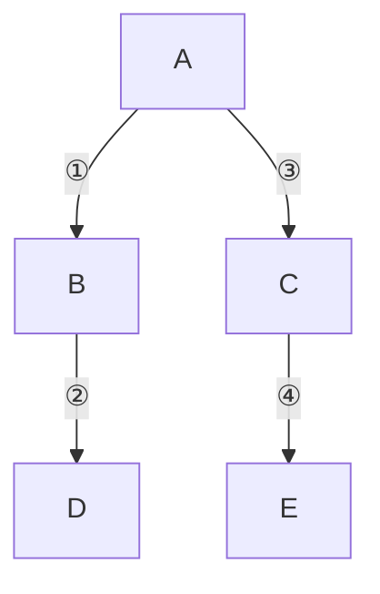

# 05 图

> 本篇导读：图是最一般的非线性结构，建模关系网络。本篇讲清图的两种存储、DFS/BFS 遍历、最短路径（Dijkstra/Bellman-Ford/Floyd）、最小生成树（Prim/Kruskal）与拓扑排序，是很多实际问题的建模语言。

## 一、图的概念

线性表是一对一，树是一对多，而图是多对多——任意两个顶点之间都可能有关系。所以图能表达社交关注、地图导航、依赖关系、电路连线等"关系网络"型数据，是建模能力最强的一种数据结构。

一个图 `G` 由顶点集合 `V` 和边集合 `E` 组成，记作 `G = (V, E)`。先理清几个基础概念：

- **顶点（Vertex）/ 节点（Node）**：图中的基本元素，对应"人""城市""任务"等实体。
- **边（Edge）**：连接两个顶点的关系。边可以表示为 `(u, v)`（无向）或 `<u, v>`（有向，从 `u` 指向 `v`）。
- **有向图（Digraph）**：边有方向，`<u, v>` 与 `<v, u>` 是两条不同的边。例如"关注"关系。
- **无向图（Undirected Graph）**：边没有方向，`(u, v)` 等价于 `(v, u)`。例如"好友"关系。无向图可看作每条边都是双向的有向图。
- **带权图（Weighted Graph）**：边上带一个数值（权重），表示距离、花费、耗时等。无权的边权重通常默认当作 1。
- **自环（Self-loop）**：一条边两端是同一个顶点；**重边（Multiple Edge）**：两顶点间有多条边。无自环、无重边的图称为**简单图**。

度和连通相关概念：

| 概念 | 无向图含义 | 有向图含义 |
| --- | --- | --- |
| **度（Degree）** | 与该顶点相连的边数 | 细分**入度**（指向它的边）与**出度**（从它发出的边），总度 = 入度 + 出度 |
| **连通（Connected）** | 任意两点间都存在路径 | 单向可达 ≠ 双向可达 |
| **连通分量** | 极大连通子图（互不相交） | — |
| **强连通** | — | 任意两点互相可达 |
| **强连通分量（SCC）** | — | 极大强连通子图 |

一个常用恒等式：**无向图所有顶点的度数之和等于边数的 2 倍**（每条边贡献两个度）。有向图中所有顶点的入度之和等于出度之和，也等于边数。

按边的疏密，图可分为两类，这直接影响选哪种存储：

- **稠密图（Dense Graph）**：边数 `E` 接近 `V²`（接近完全图）。此时用邻接矩阵最自然，空间浪费小、查边 `O(1)`。
- **稀疏图（Sparse Graph）**：`E` 接近 `O(V)` 或 `O(V log V)`。现实世界的关系网络（社交、路网）大多是稀疏的，邻接表更省空间、遍历邻边更快。

经验法则：当 `E` 显著小于 `V² / 10` 时，基本可以判定为稀疏图，优先用邻接表。

## 二、存储表示

图有三类主流存储：邻接矩阵、邻接表、边集数组。选择哪一种，本质是在"空间"和"操作效率"之间取舍。

### 2.1 邻接矩阵（Adjacency Matrix）

用一个 `V × V` 的二维数组 `matrix` 表示，其中 `matrix[i][j]` 表示顶点 `i` 到 `j` 的关系：

- 无权图：`1` 表示有边、`0` 表示无边。
- 带权图：存权重，无边存 `∞`（或一个不可能的大数）；自环按需存 0 或特殊值。

```text
无向不带权图（4 个顶点）：
     0  1  2  3
   -------------
0 |  0  1  1  0
1 |  1  0  0  1
2 |  1  0  0  1
3 |  0  1  1  0

特点：无向图的矩阵沿主对角线对称；带权图把 1 换成权重即可。
```

**优点**：判断两点是否相邻 `O(1)`；实现直观；适合稠密图。
**缺点**：无论边多少都占 `O(V²)` 空间；遍历某点的所有邻边要扫完一行 `O(V)`；边数很少时空间浪费严重。

### 2.2 邻接表（Adjacency List）

每个顶点维护一个链表（或动态数组），只存它真正相连的边/邻居。稀疏图的空间是 `O(V + E)`。

```java
package com.canoe.dsa.graph;

import java.util.ArrayList;
import java.util.List;

/**
 * 带权有向图的邻接表：每个顶点挂一个 {邻居, 权重} 列表。
 */
public class AdjListGraph {
    private final int v;
    private final List<List<int[]>> adj;

    public AdjListGraph(int v) {
        this.v = v;
        adj = new ArrayList<>();
        for (int i = 0; i < v; i++) {
            adj.add(new ArrayList<>());
        }
    }

    /** 添加一条从 from 到 to、权重为 weight 的有向边 */
    public void addEdge(int from, int to, int weight) {
        adj.get(from).add(new int[]{to, weight});
    }

    /** 遍历顶点 u 的所有出边，是 O(出度) */
    public List<int[]> neighbors(int u) {
        return adj.get(u);
    }
}
```

**优点**：省空间；遍历某顶点的邻边是 `O(出度)`，找所有边 `O(V + E)`；是绝大多数算法（DFS/BFS/最短路/最小生成树）的默认选择。
**缺点**：判断"两点是否相邻"最坏 `O(出度)`（无向图可优化成邻接"集合"）；有向图里"查入边"不方便，需要再维护一份反向邻接表。

无向图用邻接表时，一条边 `(u, v)` 要在 `u` 和 `v` 两边各加一次，相当于存了 `2E` 条记录。

### 2.3 边集数组（Edge List）

直接把边存成数组：`{u, v, weight}`，空间 `O(E)`。它几乎不便于遍历，但在 Kruskal 最小生成树里特别好用——因为算法本来就是要"按权重排序后一条条取边"。

### 2.4 三种存储对比

| 维度 | 邻接矩阵 | 邻接表 | 边集数组 |
| --- | --- | --- | --- |
| 空间复杂度 | `O(V²)` | `O(V + E)` | `O(E)` |
| 判断相邻 | `O(1)` | `O(出度)` | `O(E)` 需扫描 |
| 遍历邻边 | `O(V)` | `O(出度)` | 不便 |
| 适合场景 | 稠密图、频繁查边 | 稀疏图、通用算法 | Kruskal、按权排序取边 |
| 实现难度 | 最简单 | 中等 | 最简单 |

实际工程里：**稀疏图一律邻接表；只有稠密图或需要极快查边时才用矩阵；边集数组作为算法中间结构（如 Kruskal）使用。**

## 三、图的遍历

遍历的目标是"从某个起点出发，按某种次序访问所有可达顶点各一次"。两种基本策略：深度优先（DFS）和广度优先（BFS）。这是后面所有图算法的基础。

### 3.1 DFS 深度优先

思路像走迷宫：一条路走到底，撞墙（无未访问邻居）就回溯，换另一条路。实现上要么用递归（系统栈），要么显式用栈。



递归版骨架（邻接表、`visited` 标记防重复）：

```java
package com.canoe.dsa.graph;

import java.util.List;

public class DfsTraversal {
    private final AdjListGraph g;
    private final boolean[] visited;

    public DfsTraversal(AdjListGraph g) {
        this.g = g;
        this.visited = new boolean[g.vertexCount()];
    }

    public void dfs(int u) {
        visited[u] = true;
        System.out.print(u + " ");
        for (int[] edge : g.neighbors(u)) {
            int v = edge[0];
            if (!visited[v]) {
                dfs(v);
            }
        }
    }
}
```

DFS 的"回溯"特性让它天然适合找路径、判环、拓扑排序（后序）、强连通分量。但因为一头扎到底，它**不保证找到的是最短路径**。

### 3.2 BFS 广度优先

思路像水波扩散：先访问起点，再访问其所有邻居（第一层），再访问邻居的邻居（第二层）……用队列实现，天然是"层序"遍历，且**第一次遇到某点时的路径就是最短路径**（边权均为 1 时）。

```text
同一张图，从 A 出发的 BFS：
层 0：        A
层 1：      B   C
层 2：    D       E

BFS 访问顺序：A -> B -> C -> D -> E（严格按层推进）
```

BFS 骨架：

```java
package com.canoe.dsa.graph;

import java.util.ArrayDeque;
import java.util.Queue;

public class BfsTraversal {
    public void bfs(AdjListGraph g, int start) {
        boolean[] visited = new boolean[g.vertexCount()];
        Queue<Integer> queue = new ArrayDeque<>();
        visited[start] = true;
        queue.offer(start);
        while (!queue.isEmpty()) {
            int u = queue.poll();
            System.out.print(u + " ");
            for (int[] edge : g.neighbors(u)) {
                int v = edge[0];
                if (!visited[v]) {
                    visited[v] = true;
                    queue.offer(v);
                }
            }
        }
    }
}
```

### 3.3 两者对比

| 维度 | DFS | BFS |
| --- | --- | --- |
| 核心结构 | 栈（递归/显式栈） | 队列 |
| 访问顺序 | 一条路走到底、回溯 | 按层扩散（层序） |
| 时间复杂度 | `O(V + E)` | `O(V + E)` |
| 空间复杂度 | `O(V)`（递归栈/显式栈） | `O(V)`（队列最坏存一层） |
| 能否保证最短路 | 否（无权也不行） | 能（等边权时即最短） |
| 典型用途 | 连通性、判环、拓扑排序、SCC、路径存在性 | 最短路（无权）、最小步数、连通层 |

两者都依赖 `visited` 数组避免重复访问。无向图里"父边"也算邻居，所以判环时要区分"回到父节点"和"回到已访问的非父节点"——后者才是真正的回边（环）。

## 四、最短路径

最短路径问题分两类：**单源最短路**（一个起点到所有点）和**多源最短路**（任意两点间）。下面三个算法覆盖了主要场景。

### 4.1 Dijkstra 单源最短路（非负权）

核心思想：每次从"已确定最短距离的集合"之外，选出当前距离最小的顶点 `u`，把它加入确定集，并用它去松弛（relax）邻居——即若 `dist[u] + w(u,v) < dist[v]`，就更新 `dist[v]`。这依赖一个贪心结论：**权重非负时，当前距离最小的未确定点，其距离已经不可能再被缩短**。

为快速取出"最小距离点"，用**优先队列（最小堆）**维护候选，复杂度 `O((V + E) log V)`（稠密图用线性扫描则为 `O(V²)`）。

```java
package com.canoe.dsa.graph;

import java.util.Arrays;
import java.util.PriorityQueue;

public class Dijkstra {
    public int[] shortestPath(AdjListGraph g, int src) {
        int n = g.vertexCount();
        int[] dist = new int[n];
        Arrays.fill(dist, Integer.MAX_VALUE);
        dist[src] = 0;
        // 堆里存 {距离, 顶点}，按距离升序
        PriorityQueue<int[]> pq = new PriorityQueue<>((a, b) -> a[0] - b[0]);
        pq.offer(new int[]{0, src});
        while (!pq.isEmpty()) {
            int[] cur = pq.poll();
            int d = cur[0], u = cur[1];
            if (d > dist[u]) continue; // 过期条目，跳过
            for (int[] edge : g.neighbors(u)) {
                int v = edge[0], w = edge[1];
                if (dist[u] + w < dist[v]) {
                    dist[v] = dist[u] + w;
                    pq.offer(new int[]{dist[v], v});
                }
            }
        }
        return dist;
    }
}
```

**致命限制：Dijkstra 不能处理负权边**。因为一旦有负权，上面那个"最小距离点已确定"的结论就不成立了——一条负权边仍可能缩短它。遇到负权要用 Bellman-Ford。

### 4.2 Bellman-Ford 单源最短路（可负权、能查负环）

思想朴素：对所有边松弛 `V - 1` 轮。每松弛一轮，至少能"正确确定"一个顶点的最短距离（类似 DP 不断扩展可信前缀）。`V - 1` 轮后若还能继续松弛，说明存在能从源点到达的**负权环**（绕一圈距离变小，最短路无意义）。

复杂度 `O(V · E)`。空间只要一个 `dist` 数组，比 Dijkstra 省事，但慢。

```text
算法要点：
1. 初始化 dist[src]=0，其余 = +∞
2. 重复 V-1 次：
     对每条边 (u, v, w):
         if dist[u] + w < dist[v]: dist[v] = dist[u] + w
3. 再扫一遍所有边：若仍有 dist[u] + w < dist[v]，则存在负环
```

### 4.3 Floyd-Warshall 多源最短路（全点对）

思想：动态规划。`dp[k][i][j]` 表示"只允许经过顶点 `{0..k}` 作为中转时，`i` 到 `j` 的最短路"。转移：要么不经过 `k`，要么经过 `k`（拆成 `i->k` 和 `k->j`）。空间可滚动优化成二维，复杂度 `O(V³)`，但换来"任意两点距离一张表"。

适合**顶点少（如 `V ≤ 300`）、需要全点对距离**的场景（如网络中所有节点间的延迟矩阵）。同样要求无负环（有负权但无负环也能用）。

### 4.4 三种最短路对比

| 算法 | 适用范围 | 能否负权 | 时间复杂度 | 典型用途 |
| --- | --- | --- | --- | --- |
| **Dijkstra** | 单源、非负权 | 否 | `O((V+E) log V)` | 地图导航、路由（权重默认非负） |
| **Bellman-Ford** | 单源、可负权 | 能（并查负环） | `O(V · E)` | 含负权或需检测负环（如套利检测） |
| **Floyd-Warshall** | 多源（全点对） | 能（无负环） | `O(V³)` | 全点对距离矩阵、`V` 较小 |

选型一句话：**非负权单源用 Dijkstra；有负权或要查负环用 Bellman-Ford；要任意两点距离且 `V` 不大用 Floyd。**

## 五、最小生成树

**最小生成树（MST, Minimum Spanning Tree）**：在一个连通无向带权图里，选 `V - 1` 条边把所有 `V` 个顶点连通，且边权和最小。注意它针对的是"连通所有点、总代价最小"，**与最短路不同**——最短路关心两点间路径短，MST 关心整张网的布线总成本低。应用如：用最少的网线/管道连通所有城市、电路板布线、聚类。

MST 的两个经典算法都是贪心，且都满足"贪心选择 + 安全边"的正确性（切分定理：横跨任意切分且权重最小的边必属于某棵 MST）。

### 5.1 Prim 算法（加点）

从任一顶点出发，维护"已在树中的点集"，每次选一条**连接树内与树外、且权重最小**的边加入树，直到覆盖所有点。本质是 Dijkstra 的近亲，用优先队列取最小边，复杂度 `O((V+E) log V)`。适合**稠密图**（邻接矩阵实现可到 `O(V²)`）。

```text
Prim 思路（点集视角）：
已选点集 T   待选最小跨边
{ A }      -> (A,B)=2
{ A,B }    -> (B,D)=3
{ A,B,D }  -> (A,C)=4
...逐步把点"吸"进树，每次只加一条最小跨边
```

### 5.2 Kruskal 算法（加边）

把所有边按权重升序排序，依次考虑每条边：若它的两个端点**不在同一连通块**，就加入 MST（用并查集判断/合并）；否则会成环，跳过。直到选出 `V - 1` 条边。复杂度主要由排序决定 `O(E log E)`，适合**稀疏图**。

```java
package com.canoe.dsa.graph;

import java.util.Arrays;
import java.util.Comparator;

public class Kruskal {
    static class Edge {
        int u, v, w;
        Edge(int u, int v, int w) { this.u = u; this.v = v; this.w = w; }
    }

    public int mstWeight(Edge[] edges, int n) {
        Arrays.sort(edges, Comparator.comparingInt(e -> e.w));
        UnionFind uf = new UnionFind(n);
        int total = 0, count = 0;
        for (Edge e : edges) {
            if (uf.union(e.u, e.v)) {   // 不在同一集合才合并，避免成环
                total += e.w;
                if (++count == n - 1) break;
            }
        }
        return total;
    }

    static class UnionFind {
        private final int[] parent;
        UnionFind(int n) {
            parent = new int[n];
            for (int i = 0; i < n; i++) parent[i] = i;
        }
        int find(int x) {
            while (parent[x] != x) parent[x] = parent[parent[x]] = (x = parent[x]);
            return x;
        }
        boolean union(int a, int b) {
            int ra = find(a), rb = find(b);
            if (ra == rb) return false;
            parent[ra] = rb;
            return true;
        }
    }
}
```

### 5.3 两算法对比

| 维度 | Prim（加点） | Kruskal（加边） |
| --- | --- | --- |
| 贪心对象 | 最小跨边（连接树内外的边） | 全局最小边（不成环就加） |
| 关键结构 | 优先队列 | 并查集（判断环） |
| 时间复杂度 | `O((V+E) log V)` | `O(E log E)` |
| 更适合 | 稠密图 | 稀疏图 |
| 思考视角 | 顶点视角 | 边视角 |

MST 应用一句话：**凡是"用最小代价把一堆点全部连通且不要求两点间路径最短"的问题，基本都能建模成 MST。**

## 六、拓扑排序

**AOV 网（Activity On Vertex）**：用顶点表示"活动/任务"、有向边 `<u, v>` 表示"`u` 必须在 `v` 之前完成"的偏序关系图。拓扑排序就是把这个偏序排成一个**全序**（线性序列），使所有前置关系都满足——若存在合法拓扑序，则图**无有向环**；反之若图有环，则任何依赖顺序都无法成立（死锁/循环依赖）。

### 6.1 Kahn 算法（入度表 + 队列）

思路：不断把"入度为 0"的顶点输出并删除它的出边（使邻居入度减 1），重复直到没有入度为 0 的点。若最后输出的顶点数 `< V`，说明有环。

```text
Kahn 过程示意（任务 A 依赖无，B 依赖 A，C 依赖 A，D 依赖 B,C）：
入度: A=0  B=1  C=1  D=2
轮1: 输出 A，删 A->B、A->C  => B=0 C=0 D=2
轮2: 输出 B、C（顺序可换）   => D=0
轮3: 输出 D
一种拓扑序：A -> B -> C -> D（或 A -> C -> B -> D）
```

### 6.2 DFS 后序反转

对图做 DFS，在**递归返回时（后序）**把顶点入栈，最后把栈反转即得拓扑序。若 DFS 过程中遇到一条"指向已在当前递归栈中顶点"的回边，说明有环。

```java
package com.canoe.dsa.graph;

import java.util.ArrayList;
import java.util.Collections;
import java.util.List;

public class TopoSortDfs {
    private final AdjListGraph g;
    private final boolean[] visited;
    private final boolean[] onStack;
    private final List<Integer> order = new ArrayList<>();

    public TopoSortDfs(AdjListGraph g) {
        this.g = g;
        this.visited = new boolean[g.vertexCount()];
        this.onStack = new boolean[g.vertexCount()];
    }

    public List<Integer> sort() {
        for (int i = 0; i < g.vertexCount(); i++) {
            if (!visited[i]) dfs(i);
        }
        Collections.reverse(order);  // 后序反转
        return order;
    }

    private void dfs(int u) {
        visited[u] = true;
        onStack[u] = true;
        for (int[] edge : g.neighbors(u)) {
            int v = edge[0];
            if (!visited[v]) dfs(v);
            else if (onStack[v]) throw new IllegalStateException("检测到有向环");
        }
        onStack[u] = false;
        order.add(u);
    }
}
```

### 6.3 检测有向环 & 应用

- **检测环**：Kahn 输出数 `< V`，或 DFS 发现回边，都说明存在有向环。
- **应用**：编译器的**编译依赖**排序（先编译被依赖模块）、**任务调度/构建系统**（Make、CI 流水线）、课程选修先修关系、包管理器的依赖解析。

## 七、关键路径

**AOE 网（Activity On Edge）**：用边表示"活动"、顶点表示"事件"，边权是活动耗时。它描述的是一个工程的工序与时长。在 AOE 上求**关键路径（Critical Path）**：从起点到终点的最长路径，决定了整个工程的**最短总工期**——关键路径上任何活动拖延一天，总工期就拖延一天。

两个核心量：

- **最早开始时间 `ve`**：事件最早能发生的时刻，沿最长路径从前向后推（`ve[j] = max(ve[i] + w(i,j))`）。
- **最晚开始时间 `vl`**：事件最迟必须发生的时刻，从后向前推，不能耽误总工期（`vl[i] = min(vl[j] - w(i,j))`）。

若某活动的最早/最晚开始时间相等（或松弛量为 0），它就是关键活动，连起来即关键路径。一句话记住：**关键路径是最长路径，因为它决定的是"所有并行工序都完成"的瓶颈时间，而非最短距离。**

## 八、强连通分量

有向图里，如果一组顶点**两两互相可达**，它们就构成一个强连通分量（SCC）。整张图可按照 SCC 缩点成一个 **DAG（有向无环图）**，很多问题（如依赖分析、可达性）在缩点后大大简化。

- **Kosaraju 算法**：做两次 DFS。先按原图 DFS 得到后序，再按"后序反转"的顺序对**转置图（所有边反向）**做 DFS，每次 DFS 访问到的点构成一个 SCC。直观但需两次遍历。
- **Tarjan 算法**：一次 DFS，用 `dfn`（发现时间）和 `low`（能回溯到的最早祖先）配合栈，在 `low == dfn` 时弹栈得到一个 SCC，常数更小、更常用。

应用一句话：**SCC 用于把有向图"聚簇"成可独立处理的模块——如网页链接分析（PageRank 的预处理）、编译器过程间分析、网络中的社区发现。**

## 本篇小结

- **图 = (V, E)**，是多对多的非线性结构，能建模一切"关系网络"型数据。
- **有向/无向、带权/无权、度/入度/出度、连通/强连通、稠密/稀疏**，是描述任意图必须先分清的维度。
- **邻接矩阵 `O(V²)` 适合稠密图、查边 `O(1)`；邻接表 `O(V+E)` 适合稀疏图、遍历邻边快**，是默认选择。
- **DFS** 用栈/递归、一头扎到底、回溯，天然适合判环/拓扑/SCC，**不保证最短路**。
- **BFS** 用队列、按层扩散，边权为 1 时第一次访问即最短路径，适合最小步数问题。
- **Dijkstra** 是单源非负权最短路，靠优先队列 `O((V+E)logV)`，但**遇负权失效**。
- **Bellman-Ford** 支持负权并能查负环 `O(VE`）；**Floyd** 求全点对最短路 `O(V³)`。
- **MST** 求"连通所有点的最小代价"，Prim 加点、Kruskal 加边（并查集），都贪心，按稠密/稀疏选型。
- **拓扑排序（Kahn / DFS 后序反转）**给出依赖的线性次序，**有环则无解**，用于编译依赖与任务调度。
- **关键路径是 AOE 上的最长路径**决定最短总工期；**SCC（Kosaraju/Tarjan）**把有向图缩点成 DAG 以简化分析。

## 参考链接

- [Graph (abstract data type) - Wikipedia](https://en.wikipedia.org/wiki/Graph_(abstract_data_type))
- [Dijkstra's algorithm - Wikipedia](https://en.wikipedia.org/wiki/Dijkstra%27s_algorithm)
- [Kruskal's algorithm - Wikipedia](https://en.wikipedia.org/wiki/Kruskal%27s_algorithm)
- [Topological sorting - Wikipedia](https://en.wikipedia.org/wiki/Topological_sorting)
- [Graph Representations - GeeksforGeeks](https://www.geeksforgeeks.org/graph-and-its-representations/)
- [Shortest Path Algorithms - GeeksforGeeks](https://www.geeksforgeeks.org/shortest-path-algorithms/)
- [LeetCode 图主题题库](https://leetcode.com/tag/graph/)
- [《算法导论》（Introduction to Algorithms）第 22~24 章](https://mitpress.mit.edu/9780262046305/introduction-to-algorithms/)

下一篇 → [06 排序算法](/cs/dsa/sort)
