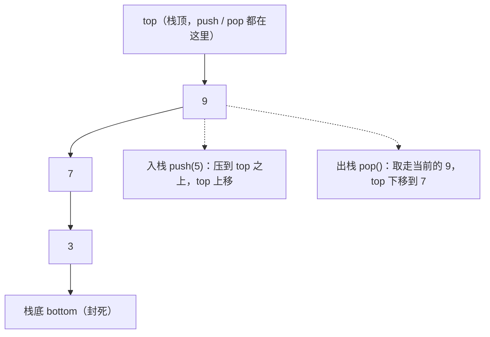
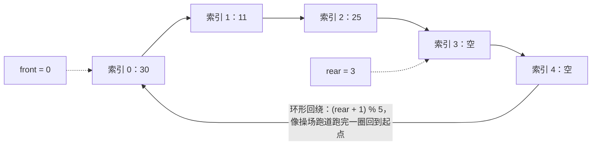

# 02 线性表：数组、链表、栈与队列

> 本篇导读：线性表是最基础的数据结构。本篇讲清数组与链表的本质区别、单/双/循环链表，以及栈与队列这两种受限线性表的应用，是后面树、哈希、图的地基。

## 一、线性表定义

**线性表（Linear List）** 是 `n` 个具有相同类型的数据元素组成的有限序列。它的核心特征是元素之间**一对一**的关系：除了第一个元素没有前驱、最后一个元素没有后继，其余每个元素都有且仅有一个直接前驱和一个直接后继。排成一列、中间不断、不岔开——这就是"线性"。

线性表的操作集合很固定：创建、判空、求长度、按位查找、按值查找、在指定位置插入、删除指定位置、遍历。具体怎么实现，则分化成两大路线：

| 实现路线 | 存储方式 | 代表结构 | 第 0 章已铺垫 |
| --- | --- | --- | --- |
| **顺序表** | 顺序存储（内存连续） | 数组、动态数组 `ArrayList` | 随机访问 `O(1)` |
| **链表** | 链式存储（节点带指针） | 单/双/循环链表 `LinkedList` | 插入删除灵活 |

后面八个小节，本质上就是把这两条路线各自展开，再衍生出"只在两头操作"的两种受限变体——栈和队列。

## 二、数组

**数组（Array）** 是用一组**连续内存单元**依次存放元素的顺序表。因为它在内存里是"一块挨一块"摆放的，所以给定一个起始地址 `baseAddr` 和下标 `i`，就能直接算出第 `i` 个元素的位置：`addr = baseAddr + i * sizeof(元素)`，这一步是 `O(1)` 的。这就是数组最大的杀手锏——**随机访问（Random Access）**。

### 随机访问 O(1) 与插入删除的代价

数组的下标访问是常数时间，但代价在增删：在中间插入一个元素，后面的所有元素都得往后挪一格；删除一个元素，后面的都要往前补。最坏情况（在头部操作）要搬 `n` 个元素，复杂度 `O(n)`。

```java
package com.canoe.dsa;

public class ArrayDemo {
    // 在数组 a 的下标 idx 处插入 val，返回新长度
    public static int insert(int[] a, int len, int idx, int val) {
        if (idx < 0 || idx > len || len >= a.length) return len;
        // 从后往前搬，腾出 idx 位置
        for (int i = len; i > idx; i--) {
            a[i] = a[i - 1];
        }
        a[idx] = val;
        return len + 1;
    }
}
```

### 多维数组与内存布局（行优先 / 列优先）

二维数组在内存里其实也被拉平成一维。怎么拉？有两种约定：

- **行优先（Row-major）**：一行一行存。C / C++ / Java / Go 都是行优先。二维 `a[row][col]` 在一维里的偏移是 `row * COLS + col`。
- **列优先（Column-major）**：一列一列存。Fortran、MATLAB、R 是列优先，偏移是 `col * ROWS + row`。

这个细节不是教条，它直接影响**缓存友好性**：在 Java 里遍历二维数组应该**外层行、内层列**（即 `for r ... for c ... a[r][c]`），这样内存是顺序访问、缓存命中高；如果你反过来内层走行，每次都跳一大截，缓存疯狂失效，性能会明显变差。

把两种遍历方式写出来对比，差别一目了然：

```java
package com.canoe.dsa;

public class RowColTraversal {
    // 推荐: 行优先访问, 内存连续, 缓存命中高
    public static long sumByRow(int[][] a) {
        long s = 0;
        for (int r = 0; r < a.length; r++) {
            for (int c = 0; c < a[r].length; c++) {
                s += a[r][c];
            }
        }
        return s;
    }

    // 不推荐: 列优先访问(在行优先的 Java 里), 每次跳一行, 缓存易失效
    public static long sumByCol(int[][] a) {
        long s = 0;
        for (int c = 0; c < a[0].length; c++) {
            for (int r = 0; r < a.length; r++) {
                s += a[r][c];
            }
        }
        return s;
    }
}
```

对同一张大矩阵，`sumByRow` 是"顺着内存往后读"，CPU 预取器每次都能提前搬好下一块；`sumByCol` 是"每次跨一整行去读一个元素"，相当于每读一个就触发一次缓存缺失。实测里两者可能差出数倍——这就是"懂内存布局 = 白捡性能"的典型例子。

### 动态数组扩容是 amortized O(1)

静态数组长度固定。工程里常用**动态数组**（如 Java 的 `ArrayList`、C++ 的 `vector`、Python 的 `list`）：装不下时申请一块更大的内存（通常翻倍），把旧数据拷过去。单次扩容是 `O(n)`，看起来很贵，但**均摊分析**告诉我们：每次扩容后容量翻倍，意味着下一次扩容前能插入同样多的元素来"分摊"这次开销，均摊到每次 `add` 只有 `O(1)`。

```java
package com.canoe.dsa;

import java.util.Arrays;

public class DynamicArray {
    private int[] data = new int[4];
    private int size = 0;

    // 均摊 O(1) 的追加
    public void add(int val) {
        if (size == data.length) {
            data = Arrays.copyOf(data, data.length * 2); // 翻倍扩容
        }
        data[size++] = val;
    }
}
```

一句话：**数组适合"读多写少、频繁随机访问"；一旦频繁在中间增删，就要警惕 `O(n)` 的搬运**。

## 三、单链表

**单链表（Singly Linked List）** 由一个个**节点（Node）** 串成。每个节点存两部分：数据本身，和一个指向下一个节点的引用（`next`）。最后一个节点的 `next` 是 `null`，表示链尾。因为节点在内存里可以散落各处、靠指针相牵，所以插入删除不用搬数据，只要改几个指针。

```java
package com.canoe.dsa;

public class SinglyList {
    // 节点定义
    static class Node {
        int val;
        Node next;
        Node(int val) { this.val = val; }
    }

    Node head; // 头指针，空表为 null

    // 头插：新节点指向原 head，head 指向新节点  O(1)
    public void addFirst(int val) {
        Node n = new Node(val);
        n.next = head;
        head = n;
    }

    // 尾插：找到末尾再接上  O(n)（若无 tail 指针）
    public void addLast(int val) {
        Node n = new Node(val);
        if (head == null) { head = n; return; }
        Node p = head;
        while (p.next != null) p = p.next;
        p.next = n;
    }

    // 按序插入（保持升序）：找到第一个比 val 大的节点的前驱
    public void insertSorted(int val) {
        Node n = new Node(val);
        if (head == null || head.val >= val) { addFirst(val); return; }
        Node p = head;
        while (p.next != null && p.next.val < val) p = p.next;
        n.next = p.next;
        p.next = n;
    }

    // 删除第一个值为 val 的节点
    public void remove(int val) {
        if (head == null) return;
        if (head.val == val) { head = head.next; return; }
        Node p = head;
        while (p.next != null && p.next.val != val) p = p.next;
        if (p.next != null) p.next = p.next.next;
    }

    // 遍历
    public void print() {
        for (Node p = head; p != null; p = p.next) {
            System.out.print(p.val + " -> ");
        }
        System.out.println("null");
    }
}
```

### 数组 vs 单链表 对比

| 维度 | 数组（顺序表） | 单链表（链式） |
| --- | --- | --- |
| **随机访问** | `O(1)`，按下标直达 | `O(n)`，只能从头顺着找 |
| **头部插入/删除** | `O(n)`，要搬后面全部 | `O(1)`，改两个指针 |
| **中间插入/删除** | `O(n)`，搬数据 | `O(n)` 找位置 + `O(1)` 改指针（定位更慢） |
| **空间开销** | 仅存数据，紧凑 | 每个节点额外存一个 `next` 指针 |
| **缓存友好** | 高（连续内存） | 低（节点散落） |
| **容量** | 固定（动态数组需扩容） | 理论按需，无上限 |

结论：**要频繁按下标访问、遍历 → 数组；要频繁在首尾增删、且不太关心随机访问 → 链表**。

## 四、双向链表与循环链表

### 双向链表

**双向链表（Doubly Linked List）** 的节点多了一个 `prev` 指针，指向前驱。代价是多存一个指针，好处是能**从任意节点反向遍历**、删除"已知节点"时不用先找前驱（直接 `node.prev.next = node.next`）。

```java
package com.canoe.dsa;

public class DoublyList {
    static class Node {
        int val;
        Node prev, next;
        Node(int val) { this.val = val; }
    }
    Node head, tail;
}
```

**LRU 缓存**是双向链表最经典的应用：用"双向链表 + 哈希表"组合，链表按访问时间排序（头最近、尾最久），哈希表 `HashMap<Integer, Node>` 让"按 key 找到节点"是 `O(1)`；访问命中就把节点移到头部，容量满就删尾部——插入、删除、查找全 `O(1)`。

### 循环链表与判环

**循环链表（Circular Linked List）** 把尾节点的 `next` 指回头节点，形成一个环。判断一个链表是否有环，最经典的是 **Floyd 快慢指针（龟兔赛跑）**：一个慢指针每次走一步、快指针每次走两步，若链表有环，快指针终会在环里追上慢指针；若快指针走到 `null` 则无环。这个技巧后面"链表经典技巧"还会展开。

## 五、链表经典技巧

链表题看着绕，但其实套路很固定。记住下面几招，绝大多数题都能拆：

### 1. 哑结点（Dummy Node）

在头节点前放一个不存数据的"假头" `dummy`，让 `dummy.next = head`。这样头插、删除头、统一处理就不需要一堆 `if (head == null)` 特判，最后返回 `dummy.next` 即可。它是链表题里减少分支的最常用技巧。

### 2. 快慢指针（Fast & Slow Pointer）

两个指针同出发，慢的走 1 步、快的走 2 步：

- **找中点**：快指针到尾时，慢指针正好在中间（奇数长度在中位，偶数在中左/中右取决于实现）。
- **判环**：如上节 Floyd 算法。
- **找倒数第 k 个**：快指针先走 `k` 步，然后两指针同步走，快指针到尾时慢指针正好在倒数第 `k` 个。

### 3. 反转链表

**反转单链表**是入门必会。用三个指针 `prev / cur / next` 原地翻转：每次把 `cur.next` 指向 `prev`，然后三个指针一起前移，直到 `cur` 为 `null`，`prev` 就是新头。

```java
package com.canoe.dsa;

public class ReverseList {
    static class Node {
        int val;
        Node next;
        Node(int val) { this.val = val; }
    }

    // 迭代反转，O(n) 时间、O(1) 空间
    public static Node reverse(Node head) {
        Node prev = null, cur = head;
        while (cur != null) {
            Node next = cur.next; // 先暂存下一个
            cur.next = prev;      // 反转指向
            prev = cur;           // prev 前移
            cur = next;           // cur 前移
        }
        return prev; // 原尾变新头
    }
}
```

### 4. 相交链表

两个链表可能从某节点开始汇成同一个尾巴（Y 形，不是 X 形）。判断相交的巧法：让两个指针分别走完 A 再走 B、走完 B 再走 A，它们会在"汇合点"或同时到 `null` 相遇——因为两条路总长度相等。无需额外空间，也无需知道长度差。

## 六、栈

**栈（Stack）** 是一种**受限线性表**：只允许在**同一端**（栈顶 `top`）插入和删除，另一端（栈底 `bottom`）封死。这个规则叫 **LIFO（Last-In-First-Out，后进先出）**——最后压进去的，最先弹出来。像一摞盘子，只能从顶上取放。

栈有两种常见实现：

- **顺序栈**：用数组实现，维护一个 `top` 下标。
- **链栈**：用链表头插实现，头就是栈顶，天然 `O(1)`。

```java
package com.canoe.dsa;

public class ArrayStack {
    private final int[] a;
    private int top; // 指向下一个可压入的位置，0 表示空栈

    public ArrayStack(int cap) { a = new int[cap]; top = 0; }

    public void push(int v) {
        if (top == a.length) throw new IllegalStateException("stack overflow");
        a[top++] = v;
    }

    public int pop() {
        if (top == 0) throw new IllegalStateException("stack empty");
        return a[--top];
    }

    public int peek() { return a[top - 1]; }
    public boolean isEmpty() { return top == 0; }
}
```

### 栈的入栈 / 出栈



### 栈的典型应用

- **括号匹配**：遇到 `(` `[` `{` 压栈，遇到右括号就弹栈看是否配对，最后栈空才合法。
- **表达式求值**：把中缀表达式转后缀（逆波兰），再用栈算；或双栈（操作数栈 + 运算符栈）直接算。
- **函数调用**：程序运行时每调一个函数就压一帧（参数、局部变量、返回地址），返回时弹栈——递归深度过大会"栈溢出（Stack Overflow）"正是这个栈被压爆。
- **撤销（Undo）**：编辑器每步操作压栈，撤销就是弹栈回退。

**栈用于中缀转后缀（逆波兰）**是最能体现栈威力的例子。规则是：数字直接输出；遇运算符按优先级压栈（栈顶优先级更高则先弹出输出）；遇 `(` 压栈，遇 `)` 弹到 `(` 为止。看一个具体转换：

```text
  中缀:  3 + 4 * 2 / ( 1 - 5 )
  转后缀过程(栈内用 [ ] 表示):

  读 3      -> 输出: 3
  读 +      -> 栈: [ + ]
  读 4      -> 输出: 3 4
  读 *      -> 栈: [ + * ]        ( * 优先级高于 +, 压入)
  读 2      -> 输出: 3 4 2
  读 /      -> 弹出 * 输出, 压 / -> 输出: 3 4 2 * , 栈: [ + / ]
  读 (      -> 栈: [ + / ( ]
  读 1      -> 输出: 3 4 2 * 1
  读 -      -> 栈: [ + / ( - ]
  读 5      -> 输出: 3 4 2 * 1 5
  读 )      -> 弹到 ( : 输出 -  -> 输出: 3 4 2 * 1 5 -
  结束      -> 弹出剩余 / +      -> 输出: 3 4 2 * 1 5 - / +

  后缀(逆波兰):  3 4 2 * 1 5 - / +
```

得到后缀后，用一个操作数栈从左到右扫：遇数字压栈，遇运算符弹出栈顶两个数计算再压回，扫完栈里剩的就是结果。后缀表达式的好处是**彻底消除了括号和优先级歧义**，CPU 和老式计算器都很喜欢。这再次说明：栈擅长把"带层级/嵌套"的问题拍平成一维顺序。

一句话：**凡是"只关心最近发生的事、且要回退"的场景，栈几乎都是首选**。

## 七、队列

**队列（Queue）** 是另一种受限线性表：只允许在**一端（队尾 `rear`）插入**、在**另一端（队头 `front`）删除**。规则叫 **FIFO（First-In-First-Out，先进先出）**——像食堂排队，先来的先打饭。

### 循环队列解决"假溢出"

如果用普通数组实现队列，`front` 和 `rear` 都只往后移，前面出队腾出的空间就白白浪费了，最终 `rear` 到头报"溢出"，可前面明明是空的——这叫**假溢出（False Overflow）**。解决办法是**循环队列**：把数组在逻辑上首尾相接成环，`rear` 到末尾后绕回开头，用取模计算下一个位置：`next = (rear + 1) % capacity`。

判空与判满要区分（否则"队空"和"队满"都是 `front == rear`）：

- 判空：`front == rear`
- 判满：`(rear + 1) % capacity == front`（故意浪费一个格子来区分）

```java
package com.canoe.dsa;

public class CircularQueue {
    private final int[] a;
    private int front = 0, rear = 0;

    public CircularQueue(int cap) {
        a = new int[cap + 1]; // 多开一格, 用于区分空/满
    }

    public boolean isEmpty() { return front == rear; }
    public boolean isFull() { return (rear + 1) % a.length == front; }

    public void enqueue(int v) {
        if (isFull()) throw new IllegalStateException("queue full");
        a[rear] = v;
        rear = (rear + 1) % a.length; // 环形前进
    }

    public int dequeue() {
        if (isEmpty()) throw new IllegalStateException("queue empty");
        int v = a[front];
        front = (front + 1) % a.length; // 环形前进
        return v;
    }
}
```

### 环形缓冲区



### 双端队列 deque

**双端队列（Double-Ended QUEue, deque）** 两端都能进能出：头尾都可入队/出队。它是栈和队列的"合体"，Java 里 `ArrayDeque` 就是典型实现，既当栈又当队列用，且比 `Stack`/`LinkedList` 更快（无同步开销）。滑窗最大值、广度优先搜索（BFS）的辅助结构常用它。

## 八、栈与队列互实现

栈和队列本质是"限制插入删除位置"的线性表，所以理论上**互相可以实现**。理解这点，能加深对两者关系的认识。

### 用两个栈实现队列

核心思想：用一个栈 `in` 负责入队，一个栈 `out` 负责出队。入队直接 `push` 进 `in`；出队时若 `out` 为空，就把 `in` 全部弹出、依次压入 `out`（顺序正好反转为先进先出），再从 `out` 弹出。

```java
package com.canoe.dsa;

import java.util.ArrayDeque;
import java.util.Deque;

public class QueueByStacks {
    private final Deque<Integer> in = new ArrayDeque<>();
    private final Deque<Integer> out = new ArrayDeque<>();

    public void enqueue(int v) { in.push(v); }

    public int dequeue() {
        if (out.isEmpty()) {
            while (!in.isEmpty()) out.push(in.pop()); // 倒置顺序
        }
        if (out.isEmpty()) throw new IllegalStateException("queue empty");
        return out.pop();
    }
}
```

单次出队可能触发 `O(n)` 的倒置，但均摊到每次操作仍是 `O(1)`。

### 用两个队列实现栈

反过来麻烦一点：队列只能从一头出。思路是——入栈时直接入队到 `q1`；出栈时，把 `q1` 里除了最后一个之外的元素全部移到 `q2`，剩下的那个就是"最后进来的"（即栈顶），弹出它，再交换 `q1`/`q2` 的角色。每次出栈都要搬 `n-1` 个元素，所以**出栈是 `O(n)`**，不如用栈实现队列划算。这正说明：用受限更少的结构去模拟受限更多的结构，代价更低。

## 九、数组 vs 链表选型

回到工程选型，给一张"何时用谁"的判断表：

| 你的场景 | 优先选 | 原因 |
| --- | --- | --- |
| 频繁按下标随机访问、遍历 | **数组 / 动态数组** | 随机访问 `O(1)`、缓存友好 |
| 频繁在头部/中间增删 | **链表** | 改指针 `O(1)`，不用搬数据 |
| 需要 LRU、频繁移动节点到头尾 | **双向链表** | `prev` 让删除/移动 `O(1)` |
| 元素数量很小、固定 | **数组** | 无指针开销、最省内存 |
| 元素数量未知、会暴涨 | **动态数组 / 链表** | 动态扩容或按需分配 |
| 只在两端操作（栈/队列） | **动态数组 / `ArrayDeque`** | 连续内存、缓存友好、实现简单 |

还要补一条现实经验：**缓存友好性**。即使理论上"链表插入 `O(1)`"比"数组插入 `O(n)`"好，但数组连续内存能让 CPU 预取器大发神威；链表节点散落、缓存命中低，当数据量不大时，数组往往实际更快。所以不要死磕大 O，**先想访问模式，再看数据规模，最后用 profiler 说话**。

## 本篇小结

- **线性表**元素间一对一，分**顺序表（数组）**与**链表**两大实现路线。
- **数组**内存连续，随机访问 `O(1)`；中间增删要搬数据 `O(n)`。
- 多维数组有**行优先**（C/Java）与**列优先**（Fortran）之分，影响缓存命中。
- **动态数组扩容翻倍**，单次 `O(n)` 但均摊到每次插入 `O(1)`。
- **单链表**靠 `next` 串联，头插 `O(1)`、随机访问 `O(n)`；每节点多一个指针开销。
- **双向链表**多 `prev` 指针，删除已知节点 `O(1)`；LRU 缓存 = 双向链表 + 哈希表。
- **循环链表**尾指回头；判环用 **Floyd 快慢指针**（快 2 步慢 1 步相遇）。
- 链表四大技巧：**哑结点减特判、快慢指针找中点/判环、三指针反转、双指针走对方找相交**。
- **栈 LIFO / 队列 FIFO**；循环队列用 `(rear+1)%cap` 解决假溢出，空满靠浪费一格区分。
- 两栈可 `O(1)` 均摊实现队列；两队列实现栈出栈 `O(n)`；选型还要看**缓存友好性**而非仅看大 O。

## 参考链接

- [List (abstract data type) — Wikipedia](https://en.wikipedia.org/wiki/List_(abstract_data_type))
- [Linked list — Wikipedia](https://en.wikipedia.org/wiki/Linked_list)
- [Stack (abstract data type) — Wikipedia](https://en.wikipedia.org/wiki/Stack_(abstract_data_type))
- [Queue (abstract data type) — Wikipedia](https://en.wikipedia.org/wiki/Queue_(abstract_data_type))
- [GeeksforGeeks：Arrays vs Linked Lists](https://www.geeksforgeeks.org/array-vs-linked-list/)
- [GeeksforGeeks：Stack Data Structure](https://www.geeksforgeeks.org/stack-data-structure/)
- [GeeksforGeeks：Queue Data Structure](https://www.geeksforgeeks.org/queue-data-structure/)
- [LeetCode：Reverse Linked List 题目](https://leetcode.com/problems/reverse-linked-list/)

下一篇 → [03 树与二叉树](/cs/dsa/tree)
