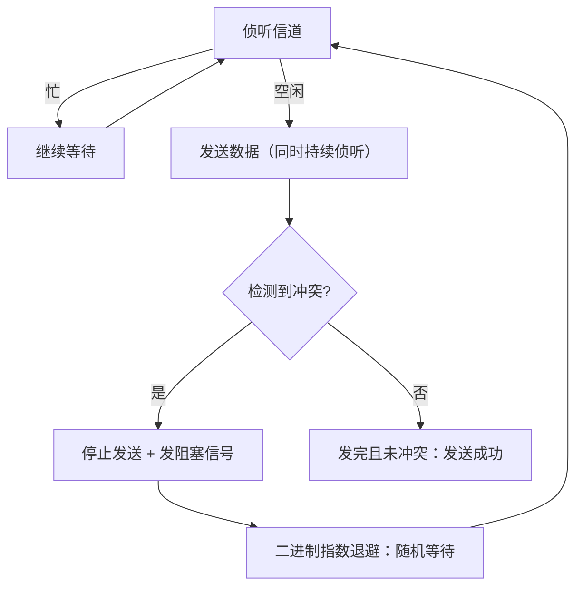

# 02 物理层与数据链路层

> 本篇导读：自底向上讲物理层的传输介质与编码、数据链路层的成帧/差错控制/介质访问，重点吃透 CSMA/CD、以太网帧与交换机转发原理。

## 一、物理层做什么

物理层（Physical Layer，OSI 第 1 层）是离硬件最近的一层，它**不关心数据"是什么"，只关心比特（0 和 1）如何在传输介质上变成电信号、光信号或无线电波，并被对方正确识别**。它要解决的纯粹是"怎么把一个个 bit 送过去"。

### 1.1 四大特性（接口规范）

为了让不同厂商的网卡、线缆能互插互通，物理层用四个特性定义接口标准：

| 特性 | 管什么 | 举例 |
| --- | --- | --- |
| ** mechanical 机械特性** | 接口形状、尺寸、引脚数、排列方式 | RJ45 水晶头 8 针、USB 接口形状 |
| **电气特性** | 电压范围、阻抗、传输速率、距离 | 网线用 ±2.5V 差分信号，RS-232 用 ±15V |
| **功能特性** | 每根引脚做什么用 | "第 1 针发、第 2 针收" |
| **规程特性（过程特性）** | 信号时序、建立/释放连接的步骤 | 先握手再传数据、何时切换方向 |

一句话记忆：**机械管"长得像"、电气管"电平多少"、功能管"哪根线干啥"、规程管"什么时候动"**。

### 1.2 传输介质

介质就是 bit 的物理载体，分有线和无线两大类：

| 介质 | 类型 | 特点 | 典型用途 |
| --- | --- | --- | --- |
| **双绞线** | 有线（铜） | 8 根两两绞合抵消干扰，便宜，最远约 100m（千兆） | 局域网最后一公里（Cat5e/Cat6） |
| **同轴电缆** | 有线（铜） | 中心铜芯+屏蔽层，抗干扰好，已逐渐被光纤取代 | 早期以太网、有线电视 |
| **光纤** | 有线（光） | 玻璃/塑料纤芯传导光，带宽极大、距离远、不受电磁干扰 | 骨干网、数据中心互联 |
| **无线** | 空间（电磁波） | 自由但易受干扰、速率随距离衰减 | Wi-Fi、蜂窝、卫星 |

补充两个易混点：

- **单模 vs 多模光纤**：单模纤芯细（约 9μm），光近似直线传播，距离可达几十公里；多模纤芯粗（50/62.5μm），光反射传播，距离短（几百米到 2km）但便宜。类比"手电筒直射（单模）vs 走廊里多次反射（多模）"。
- **双绞线为什么"绞"**：两根线平行走会像天线一样接收外界电磁干扰，绞在一起后相邻小段的干扰方向相反、互相抵消，所以"绞得越密（类别越高）抗干扰越好"。

## 二、数据通信基础

### 2.1 模拟信号 vs 数字信号

| 维度 | 模拟信号 | 数字信号 |
| --- | --- | --- |
| 形态 | 连续变化的波形 | 离散的 0/1 跳变 |
| 例子 | 老式电话语音、广播 | 计算机里的一切数据 |
| 优点 | 天然、易产生 | 抗干扰强、易存储处理、可加密 |
| 缺点 | 噪声会累积、难再生 | 需编解码、占带宽 |

现实中电脑产生的是数字信号，但电话线/无线电原本是模拟信道，所以常需要**数字信号 ⇄ 模拟信号**的相互转换。

### 2.2 调制与解调

- **调制（Modulation）**：把数字信号"搬"到模拟载波上，让它能在不适合直接传数字的信道（如电话线）上跑。常见方式：调幅（AM）、调频（FM）、调相（PM），以及它们的组合（如 QAM）。
- **解调（Demodulation）**：接收端把载波上的信息还原成数字信号。

调制的核心思想是"用载波的某个特征去代表 0 和 1"——比如频率高代表 1、低代表 0（频移键控 FSK）。**调制解调器（Modem）= MOdulator + DEModulator**，拨号上网时代家家都有。

### 2.3 信道、带宽与容量

- **信道**：信号传输的通道，有发送和接收两个方向。
- **带宽（模拟含义）**：信道能传输的频率范围，单位 Hz。这是"带宽"最原始的定义。
- **奈奎斯特准则（无噪上限）**：理想低通信道的最大码元速率 = 2 × 带宽（Baud）。若每个码元携带 k bit（如 16 种电平=4 bit），则最大数据率 = 2 × 带宽 × k。
- **香农公式（有噪上限）**：`C = B × log2(1 + S/N)`，C 是信道容量(b/s)，B 是带宽(Hz)，S/N 是信噪比。它告诉你：**带宽和信噪比共同决定上限，单纯加大功率（提 S/N）收益会边际递减**（对数关系）。

```text
香农公式直观感受：
  信噪比 S/N = 1000 (30dB)，B = 3000Hz  → C ≈ 3000 × log2(1001) ≈ 3000 × 9.97 ≈ 30 kb/s
  想翻倍容量，要么翻倍带宽，要么把信噪比从 1000 提到 10^6（难得多）
```

### 2.4 串行 vs 并行

| 方式 | 说明 | 优点 | 缺点 | 场景 |
| --- | --- | --- | --- | --- |
| **串行** | 一位一位依次发，只用 1 根数据线 | 省线、抗干扰、易做高速 | 单线速率要求高 | 网络、USB、SATA |
| **并行** | 多根线同时发多位 | 理论上更快 | 线间串扰、时钟 skew，难做高速 | 早期打印机口（已淘汰） |

今天高速通信几乎全是**串行**——因为并行线越多，线间相互干扰和"各线到的时刻不一致"问题越严重，反而跑不快。

### 2.5 通信方式（方向）

| 方式 | 方向 | 例子 |
| --- | --- | --- |
| **单工** | 只能 A→B，单向 | 广播、电视 |
| **半双工** | 可双向但不能同时 | 对讲机、早期集线器以太网 |
| **全双工** | 双向同时 | 电话、交换机现代以太网 |

现代交换机端口基本都是全双工，所以"冲突"问题在交换式以太网里基本不存在了（见第七节）。

## 三、信道复用

复用（multiplexing）就是"一条高带宽链路上同时跑多路通信"，提高利用率。四种经典方式：

| 复用方式 | 英文/缩写 | 划分维度 | 思想 | 典型应用 |
| --- | --- | --- | --- | --- |
| **频分复用** | FDM | 频率 | 各路占不同频段，同时传 | 有线电视、老式载波电话 |
| **时分复用** | TDM | 时间 | 轮流占用整条链路，分时间片 | 早期数字电话、SDH |
| **波分复用** | WDM | 光波长 | 光纤里用不同波长传多路光 | 光纤骨干网 |
| **码分多址** | CDMA | 编码 | 各路用不同正交码，频谱重叠也能区分 | 3G 移动通信 |

补充理解：

- **FDM**：像一条马路上按"车道"分（不同频率=不同车道），大家并排走。缺点是每路都要留保护频带，有浪费。
- **TDM**：像大家排好队，每人说一秒钟（时间片），轮流来。缺点是某路没数据时空片也占着（统计时分复用 STDM 可缓解）。
- **WDM**：本质是"光领域的 FDM"，一根光纤里同时传 1310nm、1550nm 等多束光，容量翻几倍。
- **CDMA**：最巧妙，所有用户同一时间、同一频率，但用互相正交的码片（如码片序列点积为 0）区分。手机同时收到所有人的信号，用自己码片一乘就能"挑"出自己的那路，别人的是噪声。军队抗干扰通信也用类似原理。

## 四、数据链路层功能

数据链路层（Data Link Layer，OSI 第 2 层）建立在物理层之上，把"裸比特流"变成"可靠的帧传输"。物理层只保证 bit 能传过去，但**不保证不传错、不丢、不乱序**——这些可靠性由链路层补上。它的四大功能：

| 功能 | 解决什么 | 手段 |
| --- | --- | --- |
| **成帧（Framing）** | 接收端怎么知道"这一帧从哪到哪" | 加帧定界符、长度字段、违规编码 |
| **差错控制** | 传错/丢包怎么办 | 检错（CRC）+ 可靠链路用确认重传（ARQ） |
| **流量控制** | 发太快接收方来不及收怎么办 | 滑动窗口、停止-等待 |
| **介质访问控制（MAC）** | 多设备共用一条介质时谁先发 | CSMA/CD、令牌、轮询等 |

关键边界：链路层提供的是**相邻节点之间**（如 主机↔交换机）的可靠传输；而"端到端"可靠是传输层（TCP）的事。两层职责别搞混。

## 五、差错控制

物理线路不可避免会有噪声，导致 bit 翻转（0 变 1）。差错控制分两步：**先能"发现"错误（检错），必要时"纠正"（纠错）**。

### 5.1 奇偶校验（最简检错）

在数据后加 1 位校验位，使"1 的个数"为奇（奇校验）或偶（偶校验）。接收端数一遍，不符就说明错了。缺点：**只能发现奇数个位出错，偶数个位错发现不了**，且不能定位。只用于要求不高的场合。

### 5.2 CRC 循环冗余校验

CRC（Cyclic Redundancy Check）是链路层真正的检错主力，能检出绝大多数突发错误。原理是**二进制模 2 除法**：

- 发送方和接收方约定一个**生成多项式 G(x)**（如 CRC-16 的 `x^16 + x^15 + x^2 + 1`，对应二进制 `11000000000000101`）。
- 发送方在数据后面补 r 个 0（r = G 的阶数），用模 2 除法除以 G，得到的余数就是**FCS（帧检验序列）**，填在帧尾。
- 接收方用同样的 G 除"收到的整帧"，余数为 0 认为没错（极小概率漏检）。

**一个具体例子**（用简化参数演示，便于理解）：

```text
假定：数据 = 1101011011（10 位）
生成多项式 G = 10011（对应 x^4 + x + 1，阶数 r = 4）

步骤 1：数据后补 4 个 0  →  11010110110000
步骤 2：用 11010110110000 模 2 除以 10011（异或，不借位）
步骤 3：得到余数（4 位），例如此处余数为 1110
步骤 4：把余数 1110 作为 FCS 接到原数据后  →  实际发送 1101011011 1110

接收方用同样 G 除 "1101011011 1110"，余数为 0 则通过。
（模 2 除法里"减法"就是异或：1-1=0, 0-1=1, 1-0=1, 0-0=0，不借位）
```

注意：CRC 是**检错**不是纠错，它发现错就丢弃该帧，靠上层（或可靠链路协议）重传。以太网、PPP、USB、Wi-Fi 都用 CRC（以太网点用 CRC-32）。

### 5.3 海明码（可纠错）

海明码（Hamming Code）不仅能检错还能**定位并纠正 1 位错**。思想是在数据位之间插入若干**校验位**（第 2^k 位），每个校验位负责一组特定位置位的奇偶校验；出错时多个校验位"指"出的位置叠加，正好定位出错的那一位，把它取反即可纠正。需要 r 个校验位满足 `2^r >= m + r + 1`（m 是数据位数）。海明码常用于存储器（内存 ECC 的简化版），在网络链路层用得不如 CRC 多，因为链路层更看重"轻量检错 + 重传"。

## 六、介质访问控制 MAC

当多个设备共享同一介质（如早期总线以太网、无线信道），必须规定"谁能在什么时候发"，否则大家一起发就碰撞了。MAC 子层就管这事，分三大类：

| 大类 | 思想 | 代表 | 适用 |
| --- | --- | --- | --- |
| **信道划分** | 把介质切成多份静态分配 | FDM / TDM / CDMA（见第三节） | 用户固定、负载稳 |
| **随机访问** | 大家抢着发，碰撞了再处理 | ALOHA、CSMA/CD、CSMA/CA | 突发流量、用户多 |
| **轮询（受控）** | 有个"主持人"挨个点名 | 令牌环、轮询协议 | 确定性时延要求 |

### 6.1 CSMA/CD（载波侦听多路访问/冲突检测）

这是**有线以太网（半双工、共享介质）**的经典算法，核心三步：

1. **载波侦听（CS）**：发之前先听信道，空闲才发；忙就等。
2. **多路访问（MA）**：所有站平等竞争同一总线。
3. **冲突检测（CD）**：边发边听，一旦发现自己发的和听到的不一致（说明别人也在发，撞了），立刻停止，发一个阻塞信号，然后**退避**一段随机时间再试（二进制指数退避）。



CSMA/CD 的硬伤：**冲突域越大、距离越远，检测到冲突的往返时间越长，效率越低**。所以以太网规定**最小帧长**，保证"一帧没发完之前一定能听到冲突"（详见第七节）。

### 6.2 CSMA/CA（冲突避免）

这是**无线 Wi-Fi（802.11）**用的算法。无线有两个难题让 CD（冲突检测）行不通：① 无线收发不能同时进行（自己发时听不到别人）；② 有"隐藏终端"问题（A 和 C 都连 B，但 A 听不到 C）。所以改为"避免"而非"检测"：

- 发之前先**侦听 + 随机退避倒计时**，倒计时归零才发。
- 发之前可先发 **RTS（请求发送）**，接收方回 **CTS（允许发送）**，让周围站点都安静（预约信道），减少碰撞。
- 收方正确收到后回 **ACK**，没收到 ACK 发送方就重发。

| 对比 | CSMA/CD | CSMA/CA |
| --- | --- | --- |
| 全称 | 冲突检测 | 冲突避免 |
| 用在 | 有线以太网（半双工） | 无线 Wi-Fi |
| 能否边发边听 | 能（有线可全双工侦听） | 不能（无线收发互斥） |
| 策略 | 发了再说，撞了退避 | 先预约/退避，尽量避免撞 |
| 确认机制 | 无（靠上层重传） | 有 ACK |

记忆：**CD 是"撞了再说"，CA 是"先礼后兵"**。

## 七、以太网

以太网（Ethernet，IEEE 802.3）是今天局域网绝对的主流，占了 99% 以上的有线局域网。

### 7.1 MAC 地址

每块网卡出厂时烧录一个 **48 位全球唯一 MAC 地址**（Media Access Control），写成 6 组十六进制，如 `00:1A:2B:3C:4D:5E`。

- 前 24 位是 **OUI（厂商编号）**，由 IEEE 分配（如 00:1A:2B 代表某厂商）。
- 后 24 位是厂商自己分配的序列号。
- 第 1 个字节的最低位表示**单播/组播**，次低位表示**全球/本地**管理。
- MAC 是"平面地址"（不体现位置），IP 才是"分层地址"（带网络号、可路由）。这正对应"链路层管相邻节点、网络层管跨网寻址"。

### 7.2 以太网 V2 帧格式

最常用的 **Ethernet II（DIX）帧** 字段如下：

| 字段 | 长度 | 作用 |
| --- | --- | --- |
| 前导码（Preamble） | 7 字节 | 10101010 交替，用于接收方时钟同步（物理层加） |
| 帧起始定界符（SFD） | 1 字节 | `10101011`，标志帧开始 |
| **目的 MAC** | 6 字节 | 接收方网卡地址 |
| **源 MAC** | 6 字节 | 发送方网卡地址 |
| **类型（Type）** | 2 字节 | 上层协议，如 0x0800=IPv4、0x0806=ARP、0x86DD=IPv6 |
| **数据（Payload）** | 46~1500 字节 | 上层交下来的包（IP 包等） |
| **FCS** | 4 字节 | CRC-32 校验，接收方验错 |
| 帧间距（IFG） | 12 字节 | 帧之间的静默间隔（物理层） |

要点：

- **MAC 头共 14 字节**（目的 6 + 源 6 + 类型 2），这是网络层包外面套的"壳"。
- **数据字段最小 46 字节**：如果上层包不足 46，链路层要填充（pad）到 46。这正引出"最小帧长"问题。

### 7.3 最小帧长与冲突域

为什么要有最小帧长？回到 CSMA/CD：发送方必须在"一帧发完之前"能侦听到冲突。如果帧太短，发完了才撞上，就发现不了。所以要求：

```text
最小帧长 ≥ 2 × 传播时延 × 带宽  =  一个冲突窗口内传的比特数
```

经典 10Mb/s 以太网冲突窗口约 51.2 μs，对应最小帧长 64 字节（14 头 + 46 数据 + 4 FCS = 64）。**所以以太网最小帧是 64 字节，小于它会被当废帧丢弃**。这也是为什么"数据字段最少 46 字节"——保证整帧 ≥ 64。

冲突域含义：在一个冲突域里，任意两站同时发都会撞。集线器把所有口连成**一个冲突域**；而交换机**每个端口是独立冲突域**，所以交换式以太网里站点各自独享带宽、几乎不再有冲突。

### 7.4 集线器 vs 交换机

| 对比 | 集线器（Hub） | 交换机（Switch） |
| --- | --- | --- |
| 工作层 | 物理层 | 数据链路层 |
| 转发 | 收到就向所有口广播 | 按目的 MAC 精准转发 |
| 冲突域 | 所有口同一冲突域 | 每端口独立冲突域 |
| 带宽 | 共享（N 台抢总带宽） | 每端口独享（全双工） |
| 安全 | 所有人都能听到 | 只发给目标，别人听不到 |

结论：**集线器已被交换机完全淘汰**，今天说的"交换机"本质是智能的、按 MAC 转发的多端口网桥。

## 八、数据链路层设备

### 8.1 网桥与交换机

**网桥（Bridge）**是早期的两端口链路层设备，**交换机（Switch）**是多端口网桥，本质一样：都在数据链路层根据 **MAC 地址**转发帧。交换机的工作靠一张 **MAC 地址表（转发表）**：

- **自学习**：交换机收到一帧，先看"源 MAC"，把"源 MAC → 入端口"记进表里（已知发送方在哪儿）。
- **转发/过滤**：再看"目的 MAC"，查表：
  - 表里有且端口 ≠ 入端口 → **转发**到那个端口；
  - 表里目的 MAC 对应的端口 = 入端口 → **过滤**（丢弃，不该往回发）；
  - 表里查不到 → **泛洪（flood）**到除入端口外的所有端口。

用一张状态表理解：

| 收到帧 | 源 MAC → 端口（学习） | 目的 MAC 查表 | 动作 |
| --- | --- | --- | --- |
| A→B | A 在端口 1 | B 未知 | 学 A；泛洪 |
| B→A | B 在端口 3 | A 在端口 1 | 学 B；精准转端口 1 |
| C→A | C 在端口 2 | A 在端口 1 | 学 C；转端口 1 |

这样运行一段时间后，表逐渐填满，交换机就只把帧发给该去的端口，效率和安全都高。

### 8.2 冲突域与广播域（再强调）

- **交换机每个端口是一个冲突域**（全双工，无冲突）。
- **默认交换机不隔离广播域**：某端口收到广播帧（目的 MAC 是全 1），会泛洪到所有端口——所有端口在同一广播域。广播风暴会拖垮网络。
- **路由器隔离广播域**：广播包到路由器就被拦下，不会跨网传播。

### 8.3 VLAN 一句话简介

**VLAN（虚拟局域网，802.1Q）**是在一台交换机上"逻辑地"切出多个互不互通的广播域——同一台物理交换机上的端口，可以分成几个 VLAN，VLAN 之间默认不能互访（要通信得走三层交换机或路由器）。它解决了"广播域太大"和"按部门隔离"的问题，是园区网基础技术。（后续网络层/交换专题再展开。）

## 九、PPP 与点对点

PPP（Point-to-Point Protocol，点对点协议）用于**两台设备直接相连**的链路，典型是**拨号上网、运营商专线、路由器之间串口链路**。它和以太网（多路访问）不同——点对点没有"多设备抢介质"的问题，所以不需要 MAC 子层和 CSMA。

PPP 由三个组件构成：

| 组件 | 作用 |
| --- | --- |
| **LCP（链路控制协议）** | 建立/配置/测试链路，协商 MTU、认证方式等 |
| **NCP（网络控制协议）** | 为上层网络协议配置，如 IPCP 用来分配 IP 地址 |
| **认证（PAP/CHAP）** | 可选的口令认证，CHAP 用挑战-应答，比明文 PAP 安全 |

PPP 帧也在首尾加标志字节 `0x7E` 定界，用字节填充法处理数据里出现的 `0x7E`。它简单、可移植，如今虽被宽带（PPPoE 是其变种，把 PPP 跑在以太网上）和光纤替代，但在串口调试、某些广域网里仍常见。

## 本篇小结

- 物理层只管**把 bit 变成电信号/光信号传过去**，用四大特性规范接口：机械、电气、功能、规程。
- 传输介质：双绞线（便宜、最后 100m）、同轴（淘汰中）、光纤（骨干、带宽大）、无线（自由但易扰）。
- **调制**把数字信号搬上模拟载波，**解调**还原；奈奎斯特给无噪上限，香农公式 `C=B·log2(1+S/N)` 给有噪上限。
- 串行因抗干扰/易提速成主流；通信分单工、半双工、全双工，现代交换以太网是全双工。
- 信道复用：FDM（分频）、TDM（分时）、WDM（分波长，光纤）、CDMA（分码，正交码区分）。
- 链路层四大功能：**成帧、差错控制、流量控制、介质访问（MAC）**，管"相邻节点"可靠，端到端可靠归 TCP。
- 差错控制：奇偶校验太弱，链路层主用 **CRC（模 2 除法 + FCS）**检错，海明码可单比特纠错。
- **CSMA/CD**（有线、撞了退避）vs **CSMA/CA**（无线、先预约避免），本质差异在能否边发边听。
- 以太网最小帧 **64 字节**（保证 CSMA/CD 能侦测冲突），MAC 48 位全球唯一，交换机按 MAC 表自学习转发。
- **集线器=物理层广播（淘汰）**，交换机=链路层按 MAC 转发、每端口独立冲突域；PPP 用于点对点广域网。

## 参考链接

- [IEEE 802.3 Ethernet - Wikipedia](https://en.wikipedia.org/wiki/Ethernet)
- [MAC address - Wikipedia](https://en.wikipedia.org/wiki/MAC_address)
- [Carrier-sense multiple access with collision detection - Wikipedia](https://en.wikipedia.org/wiki/Carrier-sense_multiple_access_with_collision_detection)
- [Cyclic redundancy check - Wikipedia](https://en.wikipedia.org/wiki/Cyclic_redundancy_check)
- [RFC 1662 - PPP in HDLC-like Framing](https://www.rfc-editor.org/rfc/rfc1662)
- [RFC 1661 - The Point-to-Point Protocol (PPP)](https://www.rfc-editor.org/rfc/rfc1661)
- [Cloudflare Learning - What is Ethernet?](https://www.cloudflare.com/learning/network-layer/what-is-ethernet/)
- [Shannon–Hartley theorem - Wikipedia](https://en.wikipedia.org/wiki/Shannon%E2%80%93Hartley_theorem)

下一篇 → [03 网络层：IP、子网划分与路由](/cs/network/network)
