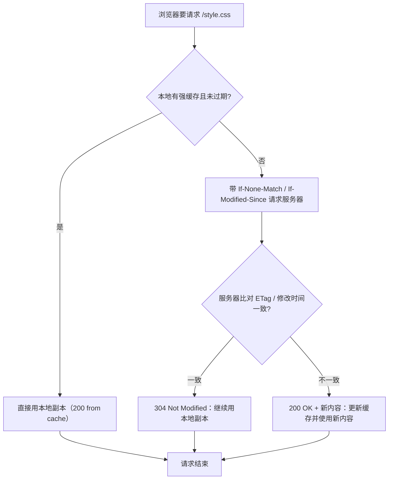
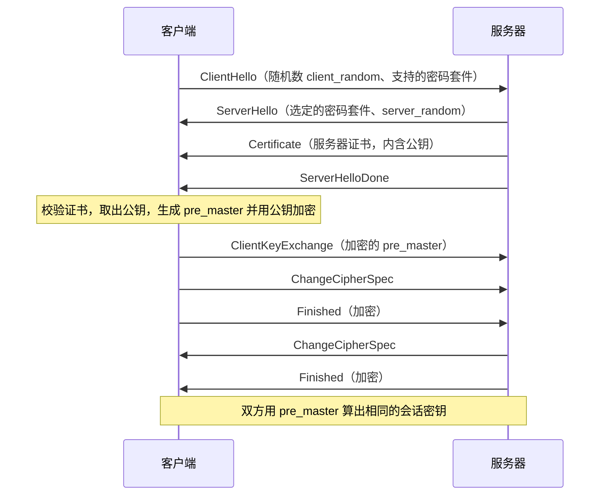
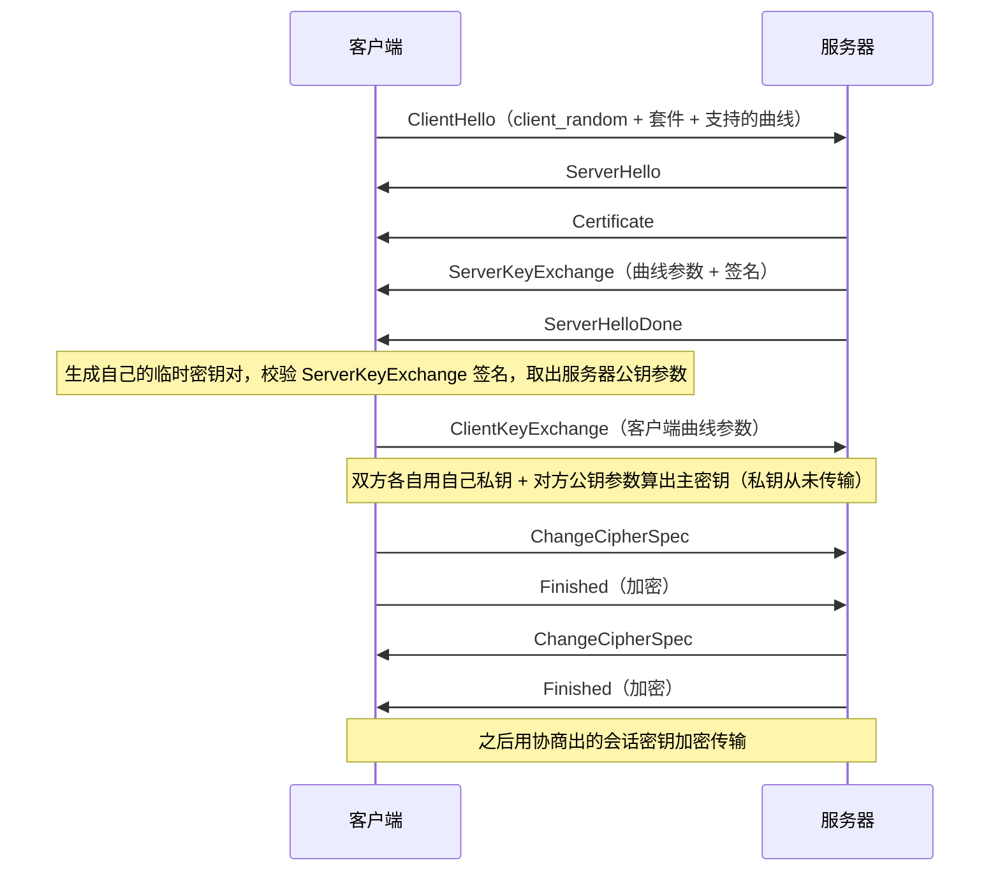
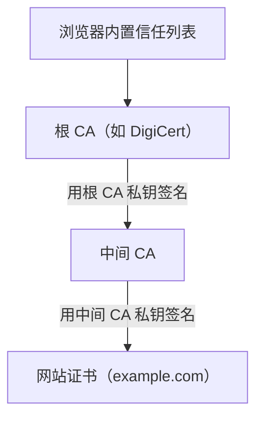

# 07 HTTP/HTTPS 深入与 TLS

> 本篇导读：把 HTTP 报文、状态码、缓存、Cookie/Session/Token 讲透，再讲为什么需要 HTTPS、对称/非对称加密如何配合、TLS 握手流程，以及 HTTP/2、HTTP/3 的演进。读完你应能看懂一次浏览器请求背后到底发生了什么，也能说清"为什么明文 HTTP 不能用于登录、支付这类场景"。

## 一、HTTP 报文结构

HTTP 是**文本协议**（HTTP/2 起改为二进制帧，但语义一致），客户端发的叫**请求报文**，服务器回的叫**响应报文**。理解报文结构，是看懂所有抓包、调试、缓存、鉴权问题的前提。

### 1.1 请求报文

一个最小但完整的 HTTP 请求长这样：

```text
POST /api/login HTTP/1.1
Host: example.com
User-Agent: Mozilla/5.0 (Windows NT 10.0; Win64; x64)
Content-Type: application/json
Content-Length: 36
Connection: keep-alive
Accept: application/json

{"username":"alice","pwd":"secret"}
```

结构拆成三块：

- **请求行**：`方法 路径 版本`，如 `POST /api/login HTTP/1.1`。
- **请求头（首部）**：每行一个 `Key: Value`，以空行结束。
- **请求体（Body）**：空行之后的内容，GET 请求通常没有。

### 1.2 响应报文

```text
HTTP/1.1 200 OK
Content-Type: text/html; charset=utf-8
Content-Length: 11
Cache-Control: max-age=3600

Hello World
```

- **状态行**：`版本 状态码 原因短语`，如 `HTTP/1.1 200 OK`。
- **响应头**：同请求头格式。
- **响应体**：空行之后的内容，就是浏览器真正渲染的数据。

### 1.3 常用首部字段

| 首部 | 出现在 | 作用 | 例子 |
| --- | --- | --- | --- |
| `Host` | 请求 | 指明目标主机与端口，一台服务器托管多个域名时靠它区分 | `Host: example.com` |
| `User-Agent` | 请求 | 客户端身份（浏览器/爬虫/版本），服务器据此做兼容或统计 | `User-Agent: curl/8.4.0` |
| `Content-Type` | 请求/响应 | 告诉对端 Body 的媒体类型与编码 | `application/json`、`text/html; charset=utf-8` |
| `Content-Length` | 请求/响应 | Body 的字节数，用于界定消息边界 | `Content-Length: 36` |
| `Connection` | 请求/响应 | 是否复用 TCP 连接（`keep-alive` 或 `close`） | `Connection: keep-alive` |
| `Accept` | 请求 | 客户端能接受的内容类型 | `Accept: application/json` |

为什么 `Host` 是 HTTP/1.1 强制首部？因为虚拟主机（一台 IP 上跑多个站点）普及后，服务器必须知道"你想访问哪个域名"才能返回正确的站点内容。

`Content-Length` 与"消息边界"的关系：TCP 是流式协议，没有天然消息边界。HTTP 靠 `Content-Length` 或分块传输编码（`Transfer-Encoding: chunked`）来告诉对端"这一帧数据到哪结束"。少了它，对端就不知道一个请求何时收完。

## 二、HTTP 方法语义

HTTP 方法代表"对资源做什么动作"。RESTful 风格里，方法语义比路径更重要。

| 方法 | 语义 | 是否带 Body | 幂等 | 安全 |
| --- | --- | --- | --- | --- |
| `GET` | 获取资源 | 通常无 | 是 | 是 |
| `POST` | 创建资源 / 提交数据处理 | 有 | 否 | 否 |
| `PUT` | 整体替换资源（有则覆盖，无则创建） | 有 | 是 | 否 |
| `DELETE` | 删除资源 | 可无 | 是 | 否 |
| `PATCH` | 局部更新资源 | 有 | 否 | 否 |
| `HEAD` | 同 GET 但不返回 Body，只取首部 | 无 | 是 | 是 |
| `OPTIONS` | 查询目标资源支持的通信选项（常用于 CORS 预检） | 无 | 是 | 是 |

### 2.1 幂等性辨析

**幂等（idempotent）** 指：同一个请求执行一次和执行多次，服务器侧最终状态一致。`GET`、`PUT`、`DELETE`、`HEAD`、`OPTIONS` 是幂等的；`POST`、`PATCH` 不是。

辨析几个容易混的点：

- **`PUT` 幂等**：`PUT /users/1` 把用户 1 设为固定内容，传十次结果一样。但它"不是安全方法"，因为它改变了服务器状态。
- **`POST` 不幂等**：`POST /orders` 每调用一次就新建一个订单，调十次产生十个订单。
- **`DELETE` 幂等**：删一次和删十次，资源都是"已删除"，最终状态相同（第二次可能返回 404，但服务器状态没再变化）。
- **`PATCH` 通常不幂等**：`PATCH` 表示"增加库存 +1"，调两次变成 +2；如果用"把库存设为 100"这种写法，它又幂等了。所以 PATCH 是否幂等取决于补丁语义，默认按"不幂等"对待。

**安全的（safe）方法** 指不会修改服务器状态，`GET`/`HEAD`/`OPTIONS` 是安全的。安全 != 幂等，但安全的方法一定幂等。

### 2.2 为什么语义重要

正确使用方法能让中间件（缓存、网关、重试机制）行为可预测。例如：浏览器/代理对 `GET` 可以安全缓存和重试；对 `POST` 重试要谨慎，避免重复下单。这也是为什么**"用 GET 传密码"不仅是丑陋，更是错误**——GET 会被记进日志、浏览器历史、代理缓存，明文密码就此泄露。

## 三、状态码

状态码是服务器对请求结果的"一句话结论"，分五大类，第一位数字决定类别：

| 类别 | 含义 | 典型场景 |
| --- | --- | --- |
| `1xx` | 信息性，请求已收到，继续处理 | `100 Continue`：客户端先发首部，等服务器回 100 再发 Body |
| `2xx` | 成功 | `200 OK`、`201 Created` |
| `3xx` | 重定向，需进一步动作 | `301` 永久、`302` 临时、`304` 未修改 |
| `4xx` | 客户端错误 | `400` 请求格式错、`404` 资源不存在 |
| `5xx` | 服务器错误 | `500` 内部错、`502` 网关错、`503` 不可用 |

### 3.1 常见状态码详解

| 状态码 | 含义 | 场景与排查要点 |
| --- | --- | --- |
| `200 OK` | 请求成功，Body 含结果 | 最平常的成功 |
| `201 Created` | 资源已创建，常在 `POST` 后返回 | 响应头 `Location` 给出新资源地址 |
| `301 Moved Permanently` | 资源永久迁移到新 URL | 搜索引擎更新索引；浏览器会缓存重定向 |
| `302 Found` | 资源临时迁移 | 登录后跳回原页常用；不缓存 |
| `304 Not Modified` | 缓存有效，用本地副本 | 协商缓存命中，详见第五节 |
| `400 Bad Request` | 请求语法/参数错误 | 通常是客户端传参格式不对 |
| `401 Unauthorized` | 未认证，需登录 | 缺少或过期 Token，响应头带 `WWW-Authenticate` |
| `403 Forbidden` | 已认证但无权限 | 登录了但不是管理员，访问被拒 |
| `404 Not Found` | 资源不存在 | 路径拼错、资源已删、路由未注册 |
| `500 Internal Server Error` | 服务器内部异常 | 代码 bug、空指针、未捕获异常 |
| `502 Bad Gateway` | 网关/代理收到无效响应 | 后端挂了、端口没起、协议不匹配 |
| `503 Service Unavailable` | 服务暂时不可用 | 过载、正在维护，常带 `Retry-After` |

`401` 与 `403` 的区别是面试高频题：**401 是"你是谁？没证明身份"；403 是"我知道你是谁，但你没资格"**。

`502`/`503`/`504` 都跟"上游"有关，但含义不同：`502` 是上游返回了非法响应，`503` 是上游明确说"我现在不接客"，`504` 是网关等上游超时。

## 四、Cookie、Session、Token

HTTP 本身是**无状态**的：每个请求相互独立，服务器不会自动记住"你上一秒登录过"。登录态保持就是要补上这个"记忆"。

### 4.1 登录态保持原理

最朴素的思路：服务器在"登录成功"后，给客户端发一个"身份证"，客户端之后每次请求都带上它，服务器据此认人。

```text
1. 浏览器 POST /login  (用户名+密码)
2. 服务器校验通过，生成身份凭证，随响应下发
3. 浏览器后续请求自动带上凭证
4. 服务器用凭证识别"这是 alice"，返回个性化数据
```

### 4.2 Cookie vs Session

这是两种配合使用的机制，不是二选一。

- **Cookie**：存在**浏览器**里的一小段键值对（`key=value`），由服务器通过 `Set-Cookie` 响应头发下，浏览器之后自动附带在请求头 `Cookie` 中。容量小（约 4KB），每次请求都带上。
- **Session**：存在**服务器**里的用户状态（用户信息、权限等），用一个 `sessionId` 作为索引。服务器把 `sessionId` 写进 Cookie 下发给浏览器，浏览器只持有一个无意义的 ID，真正的敏感数据在服务器侧。

```text
浏览器 Cookie:  sessionId=abc123   (浏览器只存这串 ID)
服务器 Session:  { abc123 -> {user:"alice", role:"admin"} }
```

| 维度 | Cookie | Session |
| --- | --- | --- |
| 存储位置 | 客户端（浏览器） | 服务端（内存/Redis） |
| 安全性 | 低，可被篡改（除非签名/加密） | 高，敏感数据不落客户端 |
| 扩展性 | 无状态，易扩展 | 有状态，服务器集群需共享存储 |
| 失效控制 | `Expires`/`Max-Age` 控制 | 服务器可随时销毁 |

**Session 的扩展痛点**：多台服务器做负载均衡时，用户第一次请求落到 A 机器，第二次落到 B 机器，B 没有他的 Session。解法：把 Session 存到共享存储（如 Redis），所有机器都从 Redis 读——这就是"集中式 Session"。

### 4.3 Token / JWT 简介

为了不被"有状态 Session"绑住，现代 API 常用 **Token**：登录后服务器签发一个令牌，客户端（浏览器或 App）自己存着，每次请求在 `Authorization` 头里带上：

```text
Authorization: Bearer <token>
```

**JWT（JSON Web Token）** 是最常见的一种：它把"用户信息 + 签名"编码进 Token 本身，服务器**不需要查库**就能验证真伪（靠签名密钥）。结构为 `header.payload.signature` 三段 base64。

| 维度 | Session | JWT/Token |
| --- | --- | --- |
| 服务器是否存状态 | 存（有状态） | 不存（无状态，靠签名验真） |
| 注销难度 | 易，删 Session 即可 | 难，Token 在过期前一直有效，需引入黑名单/短过期+刷新 |
| 跨端/跨域 | 依赖 Cookie 机制 | 头字段传递，移动端、SPA 友好 |
| 信息自包含 | 否，需查库 | 是，Payload 自带声明 |

### 4.4 安全关联

- **XSS（跨站脚本）**：攻击者往页面注入恶意脚本，偷走 Cookie/Token，进而冒充用户。缓解：Cookie 加 `HttpOnly`（JS 读不到）、`Secure`（仅 HTTPS 传）、`SameSite`。
- **CSRF（跨站请求伪造）**：攻击者诱导已登录用户点击，借用户身份发起非本意请求（如转账）。缓解：`SameSite` Cookie、CSRF Token、校验 `Origin`/`Referer`。

一句话：**Cookie/Session/Token 解决"你是谁"，而 XSS/CSRF 是利用它们漏洞的两种经典攻击面**，防护要双管齐下。

## 五、HTTP 缓存

缓存是性能优化的第一杠杆：能让重复请求不碰源站、直接复用本地/代理副本。核心分两类——**强缓存**与**协商缓存**。

### 5.1 强缓存（不发请求）

服务器告诉浏览器"在过期前你直接用本地副本，别来烦我"：

- `Cache-Control: max-age=3600`：相对时间，缓存 3600 秒（优先用，更精确）。
- `Expires: Wed, 21 Oct 2026 07:28:00 GMT`：绝对时间点，受本地时钟影响，已逐渐被 `max-age` 取代。

命中强缓存时，浏览器**根本不发网络请求**，直接从磁盘/内存读，状态栏显示 `200 (from disk cache)` 或 `200 (memory cache)`。

### 5.2 协商缓存（发请求问"还能用吗"）

强缓存过期后，浏览器带着"我这份副本的版本号"去问服务器：还有效吗？服务器说有效就回 `304 Not Modified`，浏览器继续用本地副本（省了传 Body 的流量）。

- `Last-Modified` / `If-Modified-Since`：基于**文件最后修改时间**。精度到秒，一秒内多次改动会失效；内容没变但时间变了也会误判失效。
- `ETag` / `If-None-Match`：基于**内容哈希**（如 `W/"abc123"`）。内容不变 ETag 就不变，比时间更精确，是首选。

### 5.3 缓存命中逻辑（流程图）



实践建议：静态资源（JS/CSS/图片）用 `Cache-Control: max-age=31536000, immutable` 配文件名哈希（内容变则文件名变）；HTML 用 `no-cache` 让它每次去协商，保证能拿到最新引用。

## 六、为什么需要 HTTPS

HTTP 是**明文**传输，所有内容在线路上"裸奔"。这在公共网络上是致命的。

### 6.1 三大风险

| 风险 | 说明 | 后果 |
| --- | --- | --- |
| **窃听** | 链路上的任何节点（WiFi 热点、运营商、路由器）都能读到你发的明文 | 账号密码、Cookie、聊天内容被偷看 |
| **篡改** | 中间人可修改传输内容 | 网页被插广告、下载被替换、返回假数据 |
| **冒充** | 攻击者假装成目标服务器 | 你以为在登录银行，实际连的是钓鱼机 |

### 6.2 中间人攻击（MitM）

明文 HTTP 下，中间人攻击几乎是"零成本"：

```text
你 ──── 明文请求 ────▶ 攻击者(伪造 WiFi) ────▶ 真实服务器
   ◀── 明文响应 ────      (可读可改)        ◀── 真实响应
```

攻击者处在你和目标之间，能完整看到并修改每一字节。你在咖啡店连免费 WiFi 时，这种攻击尤为现实。**HTTPS 就是给这段链路加密、校验、认证，把"明文裸奔"变成"密文专线"**。

## 七、加密基础

HTTPS = HTTP + TLS，而 TLS 的安全性建立在三类密码学原语上。

### 7.1 对称加密（AES）

加密和解密用**同一把密钥**。`alice` 和服务器共用一把密钥 K，发送方用 K 加密，接收方用 K 解密。

- 优点：**快**，适合加密大量数据（视频、大文件毫无压力）。
- 缺点：**密钥怎么安全送给对方？** 如果密钥本身在明文里传，被截获就全完了。

代表算法：`AES-128`/`AES-256`、`ChaCha20`。

### 7.2 非对称加密（RSA / ECC）

有一对密钥：**公钥**（公开）和**私钥**（保密）。用公钥加密的内容，只有对应私钥能解密；反过来，用私钥"签名"的内容，任何人用公钥都能验证确实出自私钥持有者。

- 解决"密钥分发"问题：服务器把公钥公开，你用公钥加密一段数据发给它，只有它有私钥能解开。
- 缺点：**算得慢**，不适合加密长内容。

代表算法：`RSA`、`ECDSA`（基于椭圆曲线）、`ECDH`（密钥交换）。

### 7.3 哈希与签名

- **哈希（摘要）**：把任意长度输入变成固定长度指纹（如 SHA-256）。不可逆、微小改动指纹大变。用来校验完整性。
- **数字签名**：发送方对内容哈希后用**自己私钥**加密这个哈希，附在消息上。接收方用发送方**公钥**解密哈希并比对本地计算的哈希，一致则说明"内容没被改，且确实来自私钥持有者"。

### 7.4 混合加密：既安全又高效

HTTPS 不二选一，而是**组合拳**——用非对称加密安全地协商出一把临时的对称密钥，之后用对称加密传输业务数据：

```text
1. 客户端用服务器公钥，加密"预备主密钥"发过去
2. 只有服务器私钥能解开，双方据此算出相同的会话密钥
3. 之后所有 HTTP 数据用对称加密(如 AES)传输
```

为什么不全用非对称？因为非对称慢，加密长内容不现实；为什么不全用对称？因为对称密钥无法安全送达。**混合加密用非对称解决"密钥怎么送"，用对称解决"数据怎么快送"**，二者互补。

## 八、TLS 握手

握手的目标就三件：① 确认对方身份（证书校验）；② 协商加密算法；③ 安全地生成会话密钥。下面看两种经典思路。

### 8.1 RSA 握手（已被淘汰，但利于理解）



**致命缺陷**：不支持**前向保密（PFS）**。一旦服务器私钥日后泄露，攻击者就能解密之前录下的所有通信（因为会话密钥由公钥体系直接推导）。所以现代 TLS 改用 ECDHE。

### 8.2 ECDHE 握手（现代主流，支持前向保密）

核心区别：密钥交换用 **ECDHE（椭圆曲线 Diffie-Hellman）**，双方各自生成临时密钥对，交换公钥参数后各自算出相同的会话密钥，**私钥从不下发、从不参与传输**。



**前向保密**：每次会话用一次性临时密钥，某次私钥泄露只影响那一次，历史通信安全。这是现代合规（GDPR、等保）的硬性要求。

### 8.3 证书与 CA 信任链

服务器证书是"服务器公钥 + 身份信息的数字签名文件"。你怎么相信这把公钥真的是 `example.com` 的？靠**信任链**：



浏览器出厂时内置了一批**根证书**。验证时：用根 CA 公钥验证中间 CA 证书的签名 → 用中间 CA 公钥验证网站证书签名 → 全部通过则信任。若证书过期、域名不符、或被吊销（CRL/OCSP 查询），校验失败，浏览器弹"不安全"警告。

**自签名证书**不在任何信任链里，浏览器会报警，仅适合内网/测试。

### 8.4 TLS 1.3 的简化

TLS 1.2 握手要 **2 个 RTT**（往返）。TLS 1.3 通过"0-RTT/1-RTT"和削减加密套件大幅简化：

| 项 | TLS 1.2 | TLS 1.3 |
| --- | --- | --- |
| 握手往返 | 2 RTT | 1 RTT（默认），支持 0-RTT 恢复 |
| 支持的密钥交换 | RSA、DHE、ECDHE | 仅 ECDHE（强制前向保密） |
| 加密套件 | 众多（含不安全项） | 精简为 5 个，全部 AEAD |
| 明文发密码套件 | 是 | 否，握手早期即加密 |
| 已淘汰算法 | 部分仍可用 | 明确移除 RSA 密钥交换、CBC、RC4、MD5 等 |

TLS 1.3 的核心改进：**强制前向保密、握手更快、攻击面更小**。当前主流站点已普遍启用。

## 九、HTTP/2 与 HTTP/3

HTTP/1.1 用了二十多年，问题逐渐暴露，于是有了两次大演进。

### 9.1 HTTP/1.1 的痛点

- **队头阻塞（Head-of-Line Blocking）**：同一连接里，前面的请求没返回，后面的就得等着。
- **串行效率低**：浏览器对每个域通常只开 6 个 TCP 连接，资源多就排队。
- **头部冗余**：每次请求都重复发送大量相同首部（Cookie、User-Agent…），浪费带宽。

### 9.2 HTTP/2（2015，RFC 7540）

基于**二进制帧**，核心特性：

- **多路复用**：一个 TCP 连接上并发多个请求/响应，帧带流 ID 交错传输，彻底解决应用层队头阻塞。
- **头部压缩（HPACK）**：维护首部表，重复字段只传索引，大幅减小体积。
- **服务器推送（Server Push）**：服务器可主动把客户端可能要的资源先推过去（实际效果一般，部分实现已弃用）。
- **优先级**：客户端可声明资源优先级，服务器据此调度。

但 HTTP/2 仍跑在**一个 TCP 连接**上：一旦这个 TCP 丢包，所有流都被卡住——这是**传输层**的队头阻塞，HTTP/2 解决不了。

### 9.3 HTTP/3（2022，RFC 9114）

把底层从 TCP 换成 **QUIC**（基于 UDP 的可靠传输协议）：

```text
HTTP/1.1 / HTTP/2 :  应用层 ──▶ TLS ──▶ TCP ──▶ IP
HTTP/3           :  应用层 ──▶ QUIC(内置 TLS1.3 + 可靠传输) ──▶ UDP ──▶ IP
```

QUIC 的关键能力：

- **连接级多路复用 + 独立流**：某个流丢包只影响自己，其他流照常传输，真正消除队头阻塞。
- **0-RTT 建连**：恢复连接时可立即发数据，握手延迟更低。
- **连接迁移**：切换网络（WiFi→4G）时，靠连接 ID 而非四元组保持会话，不断线。

代价是：UDP 在部分老旧网络/防火墙下可能被限流或拦截，运维需要额外关注。

### 9.4 三代对比

| 维度 | HTTP/1.1 | HTTP/2 | HTTP/3 |
| --- | --- | --- | --- |
| 传输层 | TCP | TCP | QUIC over UDP |
| 多路复用 | 无 | 有（单 TCP 内） | 有（独立流） |
| 队头阻塞 | 应用层有 | 传输层(TCP)仍有 | 基本消除 |
| 头部 | 文本、冗余 | HPACK 压缩 | QPACK 压缩 |
| 握手延迟 | TCP+TLS 多 RTT | 同左 | 0~1 RTT |
| 部署现状 | 普遍 | 主流 | 快速增长中 |

## 本篇小结

- **HTTP 报文**由"起始行 + 首部 + 空行 + Body"构成，`Content-Length`/`Transfer-Encoding` 用于界定流式 TCP 的消息边界。
- 常用首部 `Host` 区分虚拟主机、`Content-Type` 说明 Body 类型、`Connection: keep-alive` 复用 TCP。
- **方法语义**：`GET` 安全幂等、`POST` 不幂等、`PUT/DELETE` 幂等、`PATCH` 通常局部更新；滥用 GET 传密是错误。
- 状态码五大类：`2xx` 成功、`3xx` 重定向、`4xx` 客户端错、`5xx` 服务端错；`401` 是未认证、`403` 是无权限。
- **Cookie 在客户端、Session 在服务端**；JWT/Token 把状态自包含进令牌，省去查库但注销更难。
- XSS 偷凭证、CSRF 借身份，防护靠 `HttpOnly`/`Secure`/`SameSite` Cookie 与 CSRF Token。
- **强缓存**(`Cache-Control`) 不发请求直接用；**协商缓存**(`ETag`/`Last-Modified`) 命中返回 `304` 省流量。
- 明文 HTTP 面临**窃听/篡改/冒充**三大风险，中间人攻击在公共网络零成本。
- 加密采用**混合方案**：非对称(如 RSA/ECDHE) 安全协商密钥，对称(如 AES) 高速传数据。
- **现代 TLS 用 ECDHE 实现前向保密**，TLS 1.3 简化为 1-RTT 并强制 PFS；HTTP/3 借 QUIC/UDP 消除队头阻塞。

## 参考链接

- [MDN Web Docs：HTTP 概述](https://developer.mozilla.org/zh-CN/docs/Web/HTTP/Overview)
- [MDN Web Docs：HTTP 状态码](https://developer.mozilla.org/zh-CN/docs/Web/HTTP/Status)
- [MDN Web Docs：HTTP 缓存](https://developer.mozilla.org/zh-CN/docs/Web/HTTP/Caching)
- [RFC 5246：TLS 1.2（已废弃，供对照）](https://www.rfc-editor.org/rfc/rfc5246)
- [RFC 8446：TLS 1.3](https://www.rfc-editor.org/rfc/rfc8446)
- [RFC 9114：HTTP/3](https://www.rfc-editor.org/rfc/rfc9114)
- [Cloudflare：什么是 SSL/TLS？](https://www.cloudflare.com/learning/ssl/what-is-ssl/)
- [OWASP：会话管理备忘单](https://cheatsheetseries.owasp.org/cheatsheets/Session_Management_Cheat_Sheet.html)

下一篇 → [08 网络编程与排错实战](/cs/network/programming)
