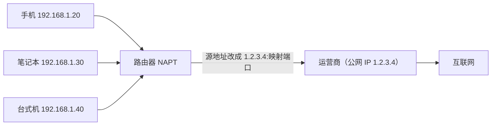

# 03 网络层：IP、子网划分与路由

> 本篇导读：网络层负责寻址与路由。本篇讲清 IPv4 地址、子网划分（这是面试高频）、ARP/ICMP、路由表与 NAT，是理解"数据包怎么从一台机器到另一台"的关键。

## 一、网络层功能

网络层（OSI 第 3 层 / TCP/IP 网际层）的核心任务，是把一个分组从源主机一路送到目的主机——不管中间隔着多少台路由器、多少种异构网络。它只关心"怎么走"，不关心"数据有没有丢、有没有按序到达"（那是传输层的事）。

网络层的三个核心功能：

- **路由选择（routing）**：在众多可能的路径里，为分组选一条合适的路。这又分为"路由算法计算路径"（控制平面）和"按路由表转发"（数据平面）。
- **分组转发（forwarding）**：路由器收到分组后，查转发表，把它从某个出接口送出去。转发是"局部动作"，每台设备只管眼前这一跳。
- **异构网络互联**：把以太网、WiFi、PPP、光纤等不同的链路层技术，用统一的 IP 协议"缝合"起来，让上层应用感觉不到底层的差异。

为什么需要独立的网络层？因为底层链路技术千差万别（MTU 不同、地址格式不同），如果让应用直接面对每种链路，复杂度会爆炸。IP 做了一个伟大抽象：**用统一的 32 位地址 + 逐跳转发，屏蔽下面所有差异**，这就是"网络的网络"得以成立的原因。

```text
应用层  HTTP/DNS/SSH ...
传输层  TCP / UDP    （端到端，管可靠与顺序）
网络层  IP           （本篇主角，管寻址与路由）
链路层  以太网/WiFi/PPP（管一跳内的帧传输）
物理层  双绞线/光纤/电磁波
```

注意上图：IP 只保证"尽力交付"，不保证送达、不保证顺序、不保证不重复。所有"可靠"的努力都交给上面的 TCP。这种"不可靠但简单"的设计，正是互联网能无限扩展的秘诀。

## 二、IPv4 地址

### 2.1 基本结构

IPv4 地址是一个 **32 位无符号整数**，点分十进制只是为了方便人读：把 32 位按每 8 位一段拆成 4 段，每段转成 0~255 的十进制，用点连接。

```text
二进制：  11000000 10101000 00000001 00000001
点分十进制： 192   .  168   .   1    .   1
```

32 位意味着地址空间是 2^32 ≈ 42.9 亿个。看起来很多，但全球几十亿设备早已不够分，这催生了 NAT、CIDR、最终 IPv6（128 位）等一系列补救措施。

### 2.2 分类地址（历史方案）

早期 Internet 用"分类地址"粗暴地把 32 位切成"网络号 + 主机号"两段，靠第一段的高位比特判定类别：

| 类别 | 首字节范围 | 最高位 | 网络号 / 主机号 | 用途 | 可用网络数 |
| --- | --- | --- | --- | --- | --- |
| A | 1 ~ 126 | `0` | 8 位 / 24 位 | 超大型网络 | 126 个 |
| B | 128 ~ 191 | `10` | 16 位 / 16 位 | 中型网络 | 约 1.6 万 |
| C | 192 ~ 223 | `110` | 24 位 / 8 位 | 小型网络 | 约 209 万 |
| D | 224 ~ 239 | `1110` | 多播地址（无主机号） | 一对多组播 | — |
| E | 240 ~ 255 | `1111` | 保留 / 实验 | 科研预留 | — |

注意两个边界细节：

- `0.0.0.0` 和 `127.0.0.0/8` 不属于任何分类，所以 A 类的首字节从 **1 到 126**（0 和 127 被特殊用途占用）。
- 分类地址的缺点是**浪费严重**：一个稍有规模的公司如果用 B 类，直接拿走 6 万多主机地址，绝大多数用不上。这正是后来 CIDR（无类域间路由）要解决的问题。

### 2.3 私有地址段

RFC 1918 划出了三段"不能在公网路由"的私有地址，给内网随便用，出了网关要靠 NAT 转换成公网地址：

| 范围 | 类别 | 容量 |
| --- | --- | --- |
| `10.0.0.0` ~ `10.255.255.255`（/8） | A 类私有 | 约 1677 万 |
| `172.16.0.0` ~ `172.31.255.255`（/12） | B 类私有 | 约 104 万 |
| `192.168.0.0` ~ `192.168.255.255`（/16） | C 类私有 | 约 6.5 万 |

家用路由器几乎都用 `192.168.x.0/24`；公司内网常见 `10.x.x.x`。

### 2.4 特殊地址

| 地址 | 含义 |
| --- | --- |
| `0.0.0.0` | 在本机表示"本机所有地址 / 未指定地址"；作源地址表示"还没有 IP"（如 DHCP 请求时） |
| `127.0.0.0/8` | 环回（loopback），`127.0.0.1` 就是本机，用来测试本机网络栈 |
| `255.255.255.255` | 受限广播，只在本网段发，不被路由转发 |
| 主机号全 0 | 表示"网络本身"，如 `192.168.1.0` 是这个子网的网段号，不能分给主机 |
| 主机号全 1 | 该子网定向广播地址，如 `192.168.1.255` |

一个常被问到的坑：**可用主机数 = 2^主机位数 - 2**，减掉的就是"全 0 网络号"和"全 1 广播地址"这两个不能给主机用的地址。

## 三、子网划分

### 3.1 为什么要划分子网

分类地址太死板（要么 254 台、要么 6 万台）。实际网络需要一个"可任意切割"的地址管理方式。思路是：**把 IP 地址看成"网络号 + 子网号 + 主机号"三层，用子网掩码标定从哪一位开始是主机位**。

### 3.2 子网掩码

子网掩码（subnet mask）长度和 IP 一样是 32 位，前面一连串 `1` 对应"网络位"，后面一连串 `0` 对应"主机位"。`1` 和 `0` 之间不能有洞。

```text
IP：     192.168.1.130   -> 11000000 10101000 00000001 10000010
掩码：   255.255.255.0   -> 11111111 11111111 11111111 00000000
网络位： 192.168.1.0     （掩码为 1 的位保留，为 0 的位清零）
```

更紧凑的写法是 **CIDR 表示法**：`192.168.1.130/24`，斜杠后的数字就是掩码里 `1` 的个数（这里 24 个 1）。

### 3.3 借位计算

要划分子网，就从原来的"主机位"里**借几位**当"子网位"。每借 1 位，子网数翻倍（×2），但每个子网的主机数减半。

公式速查：

- 子网数 = 2^借位数
- 每子网可用主机数 = 2^(原主机位 - 借位数) - 2

例如把 `192.168.1.0/24` 借 2 位（掩码变 /26）：

- 子网数 = 2^2 = 4 个
- 每子网主机位 = 8 - 2 = 6 位，可用主机 = 2^6 - 2 = 62 台
- 每块大小（块增量）= 256 / 4 = 64，子网依次是 0、64、128、192

### 3.4 划分实例一：把一个 C 段切成 4 个子网

需求：公司拿到 `192.168.10.0/24`，要分成 4 个部门子网，每个部门最多 60 台机器。

借 2 位（2^2 = 4 个子网足够），掩码 /26（255.255.255.192）：

| 子网 | 网络地址 | 可用主机范围 | 广播地址 | 可用主机数 |
| --- | --- | --- | --- | --- |
| 子网 0 | 192.168.10.0/26 | 192.168.10.1 ~ 192.168.10.62 | 192.168.10.63 | 62 |
| 子网 1 | 192.168.10.64/26 | 192.168.10.65 ~ 192.168.10.126 | 192.168.10.127 | 62 |
| 子网 2 | 192.168.10.128/26 | 192.168.10.129 ~ 192.168.10.190 | 192.168.10.191 | 62 |
| 子网 3 | 192.168.10.192/26 | 192.168.10.193 ~ 192.168.10.254 | 192.168.10.255 | 62 |

判断某 IP 属于哪个子网，方法就是"IP 与掩码做按位与（AND）"：

```text
192.168.10.130  AND  255.255.255.192
= 11000000 10101000 00001010 10000010
  11111111 11111111 11111111 11000000
= 11000000 10101000 00001010 10000000  -> 192.168.10.128  -> 落在子网 2
```

### 3.5 划分实例二：按需求切不等大的子网（VLSM）

真实场景里各部门人数不同，统一按 /26 切会浪费。这就需要 **VLSM（可变长子网掩码）**：从大块里先切最大的，再切次大的，逐层细分。

需求：给 `192.168.20.0/24` 分配——部门 A 需 100 台、部门 B 需 50 台、部门 C 需 20 台、部门 D 需 10 台。

按"从大到小"分配：

| 部门 | 需求 | 分配网段 | 掩码 | 主机范围 | 可用主机 |
| --- | --- | --- | --- | --- | --- |
| A | 100 台 | 192.168.20.0 | /25 | .1 ~ .126 | 126 |
| B | 50 台 | 192.168.20.128 | /26 | .129 ~ .190 | 62 |
| C | 20 台 | 192.168.20.192 | /27 | .193 ~ .222 | 30 |
| D | 10 台 | 192.168.20.224 | /28 | .225 ~ .238 | 14 |

要点：A 吃掉前半段（0~127），剩下 128~255 继续切；B 吃 128~191，剩下 192~255 继续切；依此类推。VLSM 让地址利用率最大化，路由会把这些小子网分别通告出去。

### 3.6 CIDR 与路由聚合

CIDR（无类别域间路由）干掉了 A/B/C 分类，允许任意长度的前缀（如 /22、/19）。它带来一个大好处——**路由聚合（route summarization）**：把多个连续的小网段，合并成一个大前缀通告，大幅压缩路由表。

```text
原来要通告 4 条：
  192.168.16.0/24
  192.168.17.0/24
  192.168.18.0/24
  192.168.19.0/24
聚合后只通告 1 条：
  192.168.16.0/22   （覆盖 16~19 共 1024 个地址）
```

聚合的前提是地址块必须"对齐"到对应前缀边界上，否则会出现黑洞或漏路由。

## 四、ARP 与 RARP

### 4.1 为什么需要 ARP

IP 地址是网络层的逻辑地址，但数据最终要在以太网上跑，必须知道对方的 **MAC 物理地址**。ARP（Address Resolution Protocol，RFC 826）就是用来做 **IP → MAC** 映射的。反向的 **RARP**（MAC → IP）早年用于无盘工作站启动，现在已被 BOOTP/DHCP 取代，基本只作历史了解。

### 4.2 ARP 表

每台主机和路由器都维护一张 ARP 缓存表，记录近期解析过的"IP ↔ MAC"：

```bash
# Linux 查看 ARP 表
ip neigh show
# 或老命令
arp -n
```

输出大致像：

```text
192.168.1.1  dev eth0  lladdr 00:1a:2b:3c:4d:5e  REACHABLE
192.168.1.50 dev eth0  lladdr 08:00:27:ab:cd:ef  STALE
```

表里每条有超时时间，久了没通信就失效，下次再重新解析。

### 4.3 ARP 请求与应答

假设主机 A（192.168.1.10）想发数据给同网段的 B（192.168.1.20），但 ARP 表里没有 B 的 MAC：

```text
A 广播 ARP 请求： "谁是 192.168.1.20？请把你的 MAC 告诉我"
  目标 MAC = FF:FF:FF:FF:FF:FF（广播），本网段所有人都能收到

B 单播 ARP 应答： "我是 192.168.1.20，我的 MAC 是 00:11:22:33:44:55"
  只有 B 应答，且是单播回给 A

A 收到后写入 ARP 表，然后才封装以太网帧发出去
```

关键点：ARP 只在**同一广播域（同二层网段）**内工作。如果目标 IP 不在本子网，A 会把数据发给**默认网关**的 MAC，由网关继续往外层路由——A 解析的是网关的 MAC，而不是最终目标的 MAC。

### 4.4 一句话安全提示

**ARP 欺骗（ARP spoofing）**：攻击者不断伪造 ARP 应答，把自己伪装成网关，从而劫持同网段流量（中间人攻击）。防范靠静态 ARP 绑定、ARP 防火墙或交换机端口安全（DAI）。

## 五、IP 数据报格式

IP 数据报是网络层传输的基本单位，由"首部 + 数据"组成。首部固定部分 20 字节，后面可跟可选字段。

```text
 0                   1                   2                   3
 0 1 2 3 4 5 6 7 8 9 0 1 2 3 4 5 6 7 8 9 0 1 2 3 4 5 6 7 8 9 0 1
+-+-+-+-+-+-+-+-+-+-+-+-+-+-+-+-+-+-+-+-+-+-+-+-+-+-+-+-+-+-+-+-+
|版本|首部长度| 区分服务 |          总长度（16位）                |
+-+-+-+-+-+-+-+-+-+-+-+-+-+-+-+-+-+-+-+-+-+-+-+-+-+-+-+-+-+-+-+-+
|      标识（16位）        |标志|   片偏移（13位）                |
+-+-+-+-+-+-+-+-+-+-+-+-+-+-+-+-+-+-+-+-+-+-+-+-+-+-+-+-+-+-+-+-+
| 生存时间 |  协议号  |        首部校验和（16位）                 |
+-+-+-+-+-+-+-+-+-+-+-+-+-+-+-+-+-+-+-+-+-+-+-+-+-+-+-+-+-+-+-+-+
|                      源 IP 地址（32位）                        |
+-+-+-+-+-+-+-+-+-+-+-+-+-+-+-+-+-+-+-+-+-+-+-+-+-+-+-+-+-+-+-+-+
|                      目的 IP 地址（32位）                      |
+-+-+-+-+-+-+-+-+-+-+-+-+-+-+-+-+-+-+-+-+-+-+-+-+-+-+-+-+-+-+-+-+
|                    可选字段（长度可变，可选）                   |
+-+-+-+-+-+-+-+-+-+-+-+-+-+-+-+-+-+-+-+-+-+-+-+-+-+-+-+-+-+-+-+-+
|                            数据部分                            |
+-+-+-+-+-+-+-+-+-+-+-+-+-+-+-+-+-+-+-+-+-+-+-+-+-+-+-+-+-+-+-+-+
```

逐字段说明：

| 字段 | 位数 | 含义 |
| --- | --- | --- |
| 版本 | 4 | IPv4 就是 4；IPv6 是 6 |
| 首部长度 | 4 | 以 4 字节为单位，最小 5（即 20 字节） |
| 区分服务（TOS/DSCP） | 8 | 标记优先级、低延迟等 QoS 提示 |
| 总长度 | 16 | 整个数据报字节数，最大 65535 |
| 标识 | 16 | 同一数据报的所有分片，标识相同 |
| 标志 | 3 | 其中 `MF=1` 表示"后面还有分片"，`DF=1` 表示"禁止分片" |
| 片偏移 | 13 | 本分片在原数据报中的相对位置，以 8 字节为单位 |
| 生存时间（TTL） | 8 | 每经过一台路由器减 1，减到 0 就丢弃，防止环路死包 |
| 协议号 | 8 | 上层协议：1=ICMP，6=TCP，17=UDP |
| 首部校验和 | 16 | 只校验首部，逐跳重新计算 |
| 源 / 目的 IP | 32×2 | 起点与终点地址 |

### 5.1 分片与重组

不同链路层的 **MTU（最大传输单元）** 不同（以太网 1500 字节、PPP 常 1492、某些链路更小）。如果一个 IP 数据报超过出接口的 MTU，且 `DF` 标志允许，路由器就会**分片**：把数据切成多个小片，各自加上 IP 首部独立转发；**重组只在最终目的主机进行**，中间的路由器不重组。

片偏移告诉我们每片在原报文里的位置：第 1 片偏移 0，第 2 片偏移 = 第 1 片数据长度 / 8，依此类推。接收方收齐所有 `MF=0` 的那片（最后一片），再按偏移拼回去。

分片会增大丢包概率（任一片丢了整个报文重传），所以现代网络更推荐**路径 MTU 发现（PMTUD）**：发送方设 `DF=1`，靠 ICMP 报错动态探测可用 MTU，避免分片。

## 六、ICMP

ICMP（Internet Control Message Protocol，RFC 792）跑在 IP 之上（协议号 1），**不传用户数据，只传控制与差错信息**。它像是网络层的"哨兵"，负责报告问题、探活。

### 6.1 差错报告与作用

典型差错报文：

| 类型 | 名称 | 触发场景 |
| --- | --- | --- |
| 3 | 目的不可达 | 端口/网络/主机不可达，或需分片但 DF=1 |
| 11 | 超时 | TTL 减到 0，或分片重组超时 |
| 5 | 重定向 | 告诉主机"走别的网关更近" |
| 4 | 源抑制（已废弃） | 拥塞时请求降速（早期机制） |

重要认知：**ICMP 只报告、不纠正**。它告诉源"出了什么问题"，由源端决定怎么办（比如 TCP 收到不可达可能会断开连接）。

### 6.2 ping 原理

`ping` 用的是 ICMP 的**回送请求（类型 8）**和**回送应答（类型 0）**：

```text
本机发：  ICMP Echo Request （带序号和载荷）
对端回：  ICMP Echo Reply   （原样返回载荷）
本机比对，计算往返时间 RTT 和丢包率
```

能 `ping` 通只说明"IP 层可达 + 对方响应了 ICMP"，**不代表 TCP 端口开放**。很多服务器禁 ICMP 但业务正常，所以 `ping` 不通不等于网络断了。

### 6.3 traceroute 原理

`traceroute`（Windows 叫 `tracert`）利用 TTL 逐跳递增 + 超时差错来画出路径：

```text
第 1 跳：发 TTL=1 的包，第 1 台路由器收到后 TTL 减为 0，回 "超时(类型11)" -> 得到第 1 跳地址
第 2 跳：发 TTL=2 的包，第 2 台路由器回超时 -> 得到第 2 跳
... 直到到达终点（终点回端口不可达或回显应答）
```

每一跳通常发 3 个包，所以你会看到每跳显示 3 个 RTT。`*` 表示该跳没回包（可能被防火墙丢 ICMP）。

### 6.4 常见类型字段一览

| Type | 名称 | 方向 |
| --- | --- | --- |
| 0 | 回送应答（Echo Reply） | 应答 |
| 3 | 目的不可达（Destination Unreachable） | 差错 |
| 8 | 回送请求（Echo Request） | 请求 |
| 11 | 超时（Time Exceeded） | 差错 |
| 5 | 重定向（Redirect） | 控制 |

## 七、路由基础

### 7.1 路由表长什么样

路由器的"大脑"是路由表，每一行是一条路由规则。Linux 上用 `ip route` 查看：

```bash
ip route show
# 常见输出示例：
# default via 192.168.1.1 dev eth0
# 192.168.1.0/24 dev eth0 proto kernel scope link src 192.168.1.10
# 10.0.0.0/8 via 192.168.1.254 dev eth0
```

一条路由通常包含：

| 字段 | 说明 |
| --- | --- |
| 目的网络 | 这条路由管哪个网段（如 `0.0.0.0/0` 表示所有地址） |
| 网关（下一跳） | 把包交给谁（同网段可省略，走直连） |
| 出接口 | 从哪个网卡发出去 |
| 度量值（metric） | 优先级，越小越优先 |

### 7.2 三种路由来源

- **直连路由（connected）**：接口配置 IP 并 UP 后，自动产生一条到本网段的路由。无需手动配。
- **静态路由（static）**：管理员手工写死，适合简单、稳定的拓扑。优点可控、不占资源；缺点是不能自动适应拓扑变化。
- **默认路由（default）**：目的写 `0.0.0.0/0`，"匹配所有、兜底用的路由"，通常指向出口网关。家用路由器只有一条默认路由指向运营商。

### 7.3 网关 vs 出接口

这是初学者最容易混的概念：

- **网关（gateway / 下一跳）**：下一台三层设备的 IP，必须是**和本机直连网段内**的地址。包先交给它，由它继续转发。
- **出接口（interface）**：本机从哪个物理/逻辑网卡把包发出去。

```bash
# 添加一条静态路由：去 10.0.0.0/8 的流量，交给网关 192.168.1.254，从 eth0 出
ip route add 10.0.0.0/8 via 192.168.1.254 dev eth0

# 添加默认路由（所有流量交给 192.168.1.1）
ip route add default via 192.168.1.1

# 老式 route 命令（等价于上面）
route add -net 10.0.0.0/8 gw 192.168.1.254
route add default gw 192.168.1.1
```

要点：**"网关"必须在出接口所在网段可达**，否则路由无效（系统会报"网络不可达"）。直连路由不需要网关，因为目标就在本链路上，直接封装 ARP 解析出的 MAC 即可。

### 7.4 查路由：最长前缀匹配

路由器收到包，会拿目的 IP 去匹配路由表，遵循**最长前缀匹配（Longest Prefix Match）**原则——掩码越长（越具体）的路由优先。

```text
路由表：
  0.0.0.0/0      via 1.1.1.1     （默认，兜底）
  192.168.0.0/16 via 2.2.2.2
  192.168.1.0/24 via 3.3.3.3

目的 192.168.1.5 -> 三条都匹配，但 /24 最长 -> 走 3.3.3.3
目的 192.168.2.5 -> 匹配 /16 -> 走 2.2.2.2
目的 8.8.8.8     -> 只匹配默认 -> 走 1.1.1.1
```

## 八、动态路由协议

当网络变大、拓扑多变，靠手工配静态路由就不可行了。动态路由协议让路由器之间**自动交换路由信息、计算最优路径**。

### 8.1 AS 与 IGP / EGP

- **AS（自治系统）**：一个（或一组）统一技术管理下的网络集合，有唯一编号 ASN。可理解为一个"管理边界"，比如一家大公司或一个运营商。
- **IGP（内部网关协议）**：在同一个 AS 内部跑的路由协议，如 RIP、OSPF、IS-IS。
- **EGP（外部网关协议）**：在 AS 之间交换路由的协议，今天实际标准就是 **BGP**。

```text
        AS 64500                         AS 64501
   +------------------+            +------------------+
   |  OSPF 域内路由    |  BGP 互联  |  OSPF 域内路由    |
   |                  | <------->  |                  |
   +------------------+            +------------------+
        IGP 管"内部"                   EGP 管"边界之间"
```

### 8.2 RIP / OSPF / BGP 对比

| 维度 | RIP | OSPF | BGP |
| --- | --- | --- | --- |
| 类型 | 距离矢量 | 链路状态 | 路径矢量 |
| 适用范围 | IGP（小网） | IGP（中大型） | EGP（跨 AS） |
| 度量 | 跳数（最多 15） | 带宽开销（cost） | 路径属性（多因子） |
| 收敛速度 | 慢 | 快 | 较慢但稳定 |
| 协议号/端口 | UDP 520 | IP 89 | TCP 179 |
| 最大规模 | 15 跳限制 | 很大（分区域） | 互联网级 |
| 典型场景 | 教学/极简网络 | 企业/数据中心 | 运营商/多云互联 |

- **RIP**：简单但跳数上限 15，超过即不可达，且收敛慢，基本只在教学或极小网络见到。
- **OSPF**：把全网拓扑画成图，用 Dijkstra 算法算最短路径；支持"区域"分层，适合复杂内网，是企业和数据中心主流 IGP。
- **BGP**：互联网的"粘合剂"，靠策略而非最短路径选路，能承载数十万条路由，是运营商和云厂商互联的基石。

### 8.3 距离矢量 vs 链路状态（一句话）

**距离矢量**是"我听邻居说去哪要几跳，我再加一跳"——信息只来自邻居，容易慢且可能环路；**链路状态**是"我把整张地图广播出去，每台路由器各自算全图最短路径"——收敛快、无环，但资源消耗大。

## 九、NAT

### 9.1 为什么需要 NAT

公网 IPv4 地址稀缺，不可能给每部手机、每台电脑都发一个公网 IP。NAT（网络地址转换，RFC 3022）让**一个公网 IP 被内网多台设备共享**，是解决地址枯竭的关键过渡技术。

### 9.2 基本 NAT 与 NAPT

- **基本 NAT**：一对一映射，内网一台主机固定对应一个公网 IP，只解决了"多个公网 IP 的复用"，没缓解地址短缺。
- **NAPT（网络地址端口转换，最常用）**：不仅改 IP，还改**端口号**，把"内网 IP:端口"映射到"公网 IP:新端口"，从而**多台内网主机共用一个公网 IP**。家用路由器用的就是 NAPT，所以也叫 PAT（端口地址转换）。

```text
内网主机 A：192.168.1.10:5000  ->  公网 1.2.3.4:10001
内网主机 B：192.168.1.11:5000  ->  公网 1.2.3.4:10002
              （同一个公网 IP，靠端口区分回包该给谁）
```

路由器维护一张 NAT 映射表，回包时再按端口反查还原成内网地址。

### 9.3 家用路由器原理

你在家里能多台设备同时上网，背后就是 NAPT：



出站包：源地址 `192.168.1.x:端口` 被改成 `1.2.3.4:映射端口`；入站包：路由器根据映射表把目的改回内网地址。注意 NAT 是"有状态"的——只有**先由内网发起**的会话，路由器才建立映射，外部主动打进来的包会被丢弃（这天然是一种防火墙）。

### 9.4 NAT 穿透一句话

由于 NAT 屏蔽了内网真实地址，两个都在 NAT 后的设备想直接互连（如 P2P、视频通话），就需要 **NAT 穿透（NAT traversal）** 技术（如 STUN/TURN/ICE）来"协商"出一条可通的映射路径。

补充：NAT 让端到端模型变"有状态"，不利于一些协议（如 FTP 主动模式、IPsec），所以 IPv6 的终极目标就是**消灭 NAT**，让每台设备都有全球唯一地址。

## 本篇小结

- **网络层核心是寻址 + 路由（逐跳转发）**，用统一的 IP 屏蔽底层异构链路差异。
- **IPv4 是 32 位点分十进制**；分类地址 A/B/C/D/E 已过时，现用 CIDR 无类编址。
- **私有地址段**为 `10/8`、`172.16/12`、`192.168/16`，公网不可路由，需经 NAT 出口。
- **特殊地址**：`0.0.0.0` 未指定、`127.0.0.1` 环回、`255.255.255.255` 广播，主机号全 0/全 1 不能给主机。
- **子网划分**靠子网掩码定网络位；借位每多 1 位子网数 ×2、主机数减半；可用主机 = 2^主机位 - 2。
- **VLSM 可变长子网**按"从大到小"分配，提高地址利用率；CIDR 支持路由聚合压缩路由表。
- **ARP 负责 IP→MAC 解析**（同广播域内），RARP 已被 DHCP 取代；ARP 欺骗是常见中间人攻击。
- **IP 首部**重点字段：TTL 防环、协议号区分上层、标识/标志/片偏移用于分片与重组。
- **ICMP 只报告不纠正**：ping 用回送请求/应答，traceroute 用 TTL 递增 + 超时报文画路径。
- **路由遵循最长前缀匹配**；NAT/NAPT 用端口复用解决公网地址短缺，但有状态不利于端到端。

## 参考链接

- [RFC 791 - Internet Protocol (IPv4)](https://www.rfc-editor.org/rfc/rfc791)
- [RFC 826 - Address Resolution Protocol (ARP)](https://www.rfc-editor.org/rfc/rfc826)
- [RFC 792 - Internet Control Message Protocol (ICMP)](https://www.rfc-editor.org/rfc/rfc792)
- [RFC 1918 - Address Allocation for Private Internets](https://www.rfc-editor.org/rfc/rfc1918)
- [Wikipedia - IPv4](https://en.wikipedia.org/wiki/IPv4)
- [Wikipedia - Subnetwork（子网）](https://en.wikipedia.org/wiki/Subnetwork)
- [Cloudflare - What is a subnet?](https://www.cloudflare.com/learning/network-layer/what-is-a-subnet/)
- [Cloudflare - What is network address translation (NAT)?](https://www.cloudflare.com/learning/network-layer/what-is-network-address-translation/)

下一篇 → [04 传输层：UDP 与 TCP 基础](/cs/network/transport)
