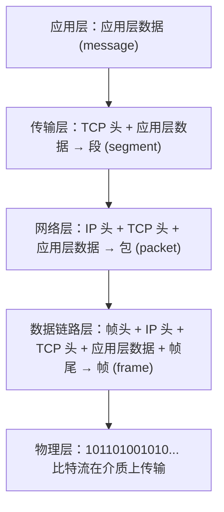

# 01 计算机网络概述与分层模型

> 本篇导读：从"网络是什么、为什么分层"讲起，建立 OSI 与 TCP/IP 分层模型的整体认知，讲清封装/解封装与性能指标，是后面所有网络篇章的基础。

## 一、什么是计算机网络

计算机网络，本质上就是**把地理上分散、各自独立的计算机通过通信线路和交换设备连起来，让它们能互相交换数据、共享资源的一张"网"**。

如果家里有两台电脑，用一根网线连起来、设好 IP 能互相传文件，这叫一个简单的网络；把全世界的电脑、手机、服务器都通过运营商的网络连起来，这就是 Internet（因特网）。

### 1.1 网络的组成

从"使用角度"看，一个完整的计算机网络可以分成两大部分：

| 部分 | 别称 | 角色 | 典型成员 |
| --- | --- | --- | --- |
| **边缘部分** | 用户侧 | 由所有接入网络的"端系统"组成，负责产生和消费数据 | 你的电脑、手机、家里的智能电视、公司的 Web 服务器 |
| **核心部分** | 网络核心 | 由大量路由器、交换机、链路组成，负责把数据从一端"搬运"到另一端 | 运营商骨干网、城域网、数据中心交换 fabric |

你可以把核心部分想象成"快递公司的分拣中心和运输干线"，边缘部分就是"寄件人和收件人"。你只管把包裹交给快递，剩下的路由、转运由核心部分完成。

### 1.2 通信子网与资源子网

这是从"功能"角度的另一种划分，和上面的"边缘/核心"是不同维度的切法：

- **通信子网**：专门负责数据传输的部分，包括传输线路（光纤、双绞线）、交换设备（路由器、交换机）、通信协议。它解决"数据怎么走过去"的问题。
- **资源子网**：建立在通信子网之上，由各类主机和资源组成，提供计算、存储、应用服务。它解决"数据送来之后能干什么"的问题。

类比：通信子网是"公路和红绿灯"，资源子网是"路边的工厂、仓库、商店"。

### 1.3 internet 与 Internet 的区别（极易混淆）

这是初学者最常踩的坑：

- **internet**（小写 i，通用名词）：泛指"互连起来的网络"，任何把多个网络用路由器连起来的集合都可以叫 internet。它是技术名词，表示"网络的网络（network of networks）"。
- **Internet**（大写 I，专有名词）：特指全球最大的、唯一的那个互连网——因特网，它统一使用 TCP/IP 协议族，由 ICANN、IANA 等机构协调管理。

一句话：**internet 是类名，Internet 是实例**；就像"车"和"你家门口那辆京 A·12345 的车"的关系。

## 二、网络能做什么

很多人觉得网络就是"能上网"，其实它的价值可以拆成五类基础能力：

| 能力 | 说明 | 例子 |
| --- | --- | --- |
| **数据通信** | 最基础的能力，主机之间可靠地传输文本、语音、图像、视频 | 微信发消息、视频会议 |
| **资源共享** | 硬件、软件、数据资源可以被网络上的其他用户共用 | 云盘共享文件、打印机共享、SaaS 软件 |
| **分布式处理** | 把一个大任务拆给多台机器并行算，再汇总结果 | 大数据 MapReduce、分布式训练 |
| **负载均衡** | 把大量请求分摊到多台服务器，避免单点过载 | Nginx 反向代理、LVS |
| **高可靠性** | 关键设备和链路有冗余，一台坏了网络还能走别的路 | 双机房、BGP 多线接入 |

这五条里，**数据通信是地基**，没有它后面四条都立不起来；而负载均衡和高可靠，正是今天互联网服务"永不宕机"神话背后的工程手段。

## 三、核心性能指标

衡量一个网络"快不快、好不好"，靠的是一组量化指标。下面这张表先整体过一遍，后面逐个展开。

| 指标 | 含义 | 常用单位 |
| --- | --- | --- |
| 速率（Speed） | 主机在数字信道上传送数据的**比特率** | b/s、kb/s、Mb/s、Gb/s |
| 带宽（Bandwidth） | 信道能通过的**最高数据率**（模拟时代指频率范围，数字时代指速率上限） | 同速率单位 |
| 吞吐量（Throughput） | 单位时间内实际通过的**数据量** | 同速率单位 |
| 时延（Delay） | 数据从一端到另一端花费的总时间 | ms、s |
| 时延带宽积 | 链路"容量"的度量 = 传播时延 × 带宽 | bit |
| RTT | 往返时间，发包到收到确认的时间 | ms |
| 信道利用率 | 信道有数据通过的时间占比 | 百分比 |
| 丢包率 | 丢失分组数 / 总发送分组数 | 百分比 |

### 3.1 速率、带宽、吞吐量

- **速率**：注意这里的"b"是**比特（bit）**不是字节（Byte），1 Byte = 8 bit。运营商说的"100M 宽带"是 100 Mb/s，理论下载峰值约 12.5 MB/s，别被数字骗了。
- **带宽**：可以理解为"水管最粗能有多粗"。带宽决定了速率的上限，但实际速率永远 ≤ 带宽（因为还有协议开销、竞争、拥塞）。
- **吞吐量**：是"实际水流大小"，受带宽、处理能力、网络负载共同影响。比如带宽是 1Gb/s，但服务器 CPU 只能处理 200Mb/s，那吞吐量就是 200Mb/s。

### 3.2 时延：四种成分

数据从 A 到 B 的时延由四部分相加：

```text
总时延 = 发送时延 + 传播时延 + 处理时延 + 排队时延
```

| 成分 | 定义 | 公式 | 由什么决定 |
| --- | --- | --- | --- |
| **发送时延**（传输时延） | 把全部比特"推"上链路的时间 | 数据长度(bit) / 发送速率(b/s) | 分组大小、网卡速率 |
| **传播时延** | 信号在链路上跑的时间 | 链路长度(m) / 传播速度(m/s) | 距离、介质（光速约 2/3c） |
| **处理时延** | 路由器查表、改头、校验的时间 | 无法简单公式，通常微秒级 | 设备性能 |
| **排队时延** | 分组在路由器队列里等转发的时间 | 随负载剧烈变化 | 网络拥塞程度 |

典型数量级感受：北京到上海光纤链路约 1200 km，传播时延 ≈ 1200 000 / (2×10^8) ≈ 6 ms；而一块 1500 字节的帧在千兆网卡上的发送时延 = 12000 bit / 10^9 ≈ 0.012 ms。所以**长距离通信里传播时延占大头，局域网里发送时延（受分组大小影响）更值得关注**。

### 3.3 时延带宽积

```text
时延带宽积 = 传播时延 × 带宽
```

它衡量的是"在途尚未到达的数据量"，也就是链路里"装"着多少比特。如果时延带宽积 = 20 ms × 1 Gb/s = 0.02 × 10^9 bit = 2×10^7 bit ≈ 2.5 MB，意思是从你发出数据到对方收到，链路中始终"飘着"约 2.5 MB 的数据。这直接关系到**TCP 的窗口该开多大**——窗口小于时延带宽积，链路就没被填满，带宽浪费了。

### 3.4 RTT 与信道利用率

- **RTT（Round-Trip Time）**：发一个包到收到它的确认，一来一回的时间。它约等于 2 倍传播时延加上两端处理时间。ping 命令测的就是 RTT。
- **信道利用率**：`利用率 = 有数据时间 / 总时间`。利用率不是越高越好——当接近 100% 时，排队时延会指数级暴涨（想象高速免费时段最后一天的服务区）。常用公式（简化）`D = D0 / (1 - U)`，D0 是无负载时延，U 是利用率；U 从 0.9 升到 0.99，时延直接放大 10 倍。
- **丢包率**：分组在传输中因队列溢出、校验失败、路由不可达而丢失的比例。丢包率上升通常意味着拥塞，TCP 会据此降速。

## 四、网络拓扑

拓扑（topology）指"节点和链路怎么连"。不同拓扑直接决定成本、可靠性和扩展方式：

| 拓扑 | 结构 | 优点 | 缺点 | 典型场景 |
| --- | --- | --- | --- | --- |
| **星型** | 所有节点连到中心节点（交换机/集线器） | 单点故障只影响自己；易管理、易扩展 | 中心节点挂了全网瘫；布线多 | 现代局域网（以太网）主流 |
| **总线型** | 所有节点挂在一根共享总线上 | 省线、结构简单 | 总线断全网瘫；冲突多、难排查 | 早期同轴以太网（已淘汰） |
| **环型** | 节点连成一圈，令牌传递 | 无冲突（令牌环）；结构简单 | 任一点断环就断；扩容麻烦 | 早期令牌环、FDDI |
| **网状** | 节点间多条链路互联 | 可靠性极高，多路径 | 成本高、布线复杂、路由难 | 运营商骨干网、数据中心 |
| **树型** | 总线/星型的层级扩展 | 易扩展、层次清晰 | 根节点是瓶颈 | 企业网、园区网 |

现实中**没有纯拓扑**，往往是混合的：比如"核心层网状 + 接入层星型"就是典型园区网三层架构。选择拓扑的本质是在**成本、可靠性、可扩展性**之间做权衡。

## 五、分层思想与协议三要素

### 5.1 为什么分层

如果让两台计算机"一口气"把所有事（怎么编码、怎么寻址、怎么纠错、怎么建立会话、怎么呈现给用户）全搞定，协议会复杂到无法维护。分层的思想是：**每层只解决一类问题，向上提供干净的服务，向下隐藏实现细节**。

好处：

- **职责单一**：改某一层实现（比如光纤换铜缆）不影响其他层。
- **易于标准化**：每层独立制定标准，大家各自实现、互相兼容。
- **便于调试**：出问题能定位到某一层。

类比：寄快递时你只管把东西交给前台（应用层），前台交给揽收点（传输层），揽收点交给分拣中心（网络层）……每一环只做自己那点事，上一环不用关心下一环怎么运输。

### 5.2 协议三要素

计算机网络里，**协议（protocol）是通信双方必须遵守的规则集合**，它由三要素构成：

| 要素 | 回答的问题 | 说明 |
| --- | --- | --- |
| **语法（Syntax）** | 数据长什么样 | 格式、编码、字段排列，比如"前 16 位是端口号" |
| **语义（Semantics）** | 每段数据什么意思 | 控制信息含义、动作响应，比如"收到 SYN 要回 SYN+ACK" |
| **同步（Timing）** | 何时发、以什么顺序发 | 速率匹配、时序、差错重传的时机 |

缺了任何一个都不叫完整协议：有语法没语义，对方收到也看不懂；有语义没同步，收发节奏对不上照样乱套。

### 5.3 接口与服务

- **服务（Service）**：下层为紧邻的上层提供的功能调用。注意——**同层之间才叫"协议"，相邻层之间叫"服务"**。
- **接口（Interface/SAP）**：上层调用下层服务时走的"门窗"，也叫服务访问点。就像你调用一个函数，不用管函数内部怎么实现，只按接口传参。

核心原则：**层间解耦**，上层只看见下层的服务和接口，看不见下层的内部实现，也看不见更下面的层。

## 六、OSI 七层模型

OSI（Open Systems Interconnection）是 ISO 在 1984 年提出的**理论参考模型**，七层自顶向下如下。注意：OSI 更多是"教学与概念框架"，现实中真正跑起来的是 TCP/IP。

| 层（编号） | 名称 | 核心功能 | 典型设备 | PDU 名称 | 代表协议/标准 |
| --- | --- | --- | --- | --- | --- |
| 7 | 应用层 | 为应用程序提供网络服务接口 | 无（应用程序本身） | 报文（message） | HTTP、FTP、DNS、SMTP |
| 6 | 表示层 | 数据格式转换、加密解密、压缩 | 无 | 报文 | SSL/TLS、JPEG、ASCII |
| 5 | 会话层 | 建立、管理、终止会话 | 无 | 报文 | RPC、NetBIOS |
| 4 | 传输层 | 端到端可靠/不可靠传输、复用 | 无（端点） | 段（segment，TCP）/ 数据报（UDP） | TCP、UDP |
| 3 | 网络层 | 路由选择、逻辑寻址（IP） | 路由器 | 包（packet） | IP、ICMP、OSPF、BGP |
| 2 | 数据链路层 | 相邻节点帧传输、差错控制 | 交换机、网桥 | 帧（frame） | 以太网、PPP、VLAN |
| 1 | 物理层 | 比特在介质上透明传输 | 集线器、中继器、网卡 | 比特（bit） | 双绞线、光纤、RJ45 |

逐层说明：

- **应用层**：离用户最近。你的浏览器用 HTTP 取网页，邮件客户端用 SMTP 发信，都在这层。PDU 叫"报文"。
- **表示层**：解决"数据怎么表示"。比如把主机内部编码转成网络标准格式、对明文加密。TLS 握手其实横跨表示/会话的思想。
- **会话层**：管理"一次对话"的生命周期，比如断线重连后从哪里续传。
- **传输层**：关键区别在于它是**端到端**的——只关心发送端进程和接收端进程，不关心中间经过多少路由器。TCP 提供可靠、面向连接、流量控制的服务；UDP 提供尽力而为、低延迟的服务。
- **网络层**：负责"从哪台机器到哪台机器"（主机到主机），核心是 IP 地址寻址和路由。路由器工作在这一层，根据 IP 包的目的地址选路。
- **数据链路层**：负责"相邻两个节点之间"（比如你的电脑到交换机）把 IP 包封装成帧，做差错检测和 MAC 寻址。交换机、网桥在此层。
- **物理层**：最底层，研究比特怎么变成电信号/光信号在介质上跑。它不关心"这是不是 IP 包"，只管把 0/1 传过去。

一个记忆窍门（自下而上）：**"物数网传会表应"** → 也可记成口诀"**应表会传网数物**"（从上到下）。

## 七、TCP/IP 模型

### 7.1 四层与五层教学模型

TCP/IP 实际工程实现是**四层**：

| TCP/IP 四层 | 对应 OSI |
| --- | --- |
| 应用层 | 应用层 + 表示层 + 会话层 |
| 传输层 | 传输层 |
| 网际层（网络互联层） | 网络层 |
| 网络接口层 | 数据链路层 + 物理层 |

为了教学方便，国内教材常把网络接口层再拆开，得到**五层教学模型**（本笔记后续也用五层）：

```text
应用层      (对应 OSI 7/6/5)
传输层      (对应 OSI 4)
网络层      (对应 OSI 3)
数据链路层  (对应 OSI 2)
物理层      (对应 OSI 1)
```

### 7.2 与 OSI 的对照

| OSI 七层 | TCP/IP 四层 | 说明 |
| --- | --- | --- |
| 应用层 | 应用层 | TCP/IP 把表示/会话合并进应用层 |
| 表示层 | 应用层 | 由具体应用自己处理（如 TLS） |
| 会话层 | 应用层 | 同上 |
| 传输层 | 传输层 | 一致 |
| 网络层 | 网际层 | 一致，核心是 IP |
| 数据链路层 | 网络接口层 | 合并了物理层 |
| 物理层 | 网络接口层 | 交由底层硬件/驱动 |

### 7.3 为什么 TCP/IP 胜出

OSI 设计优雅但"生不逢时"，TCP/IP 最终统治了世界：

- **OSI 先定标准后实现**，模型复杂、层次划分（尤其是会话/表示层）在实践中界限模糊，落地困难。
- **TCP/IP 先有实现（ARPANET 1969 起）后有标准**，从一开始就跑在真实网络上，经过实战检验，且协议栈精简务实。
- **TCP/IP 的"端到端"哲学**更利于互联网规模扩张，不用在中间节点维护复杂状态。

结论：OSI 用于**理解和教学**（七层视角清晰），TCP/IP 用于**真正组网**（四/五层工程落地）。

## 八、封装与解封装

这是理解整个网络最核心的动态过程。发送方每往下一层走，就要**把上层的数据包一层层"装"进新的外壳**（加头/加尾）；接收方则反向逐层"拆"开。

用示意图展示封装过程（从应用层到物理层）：



对应解封装（接收方，自底向上）：物理层收比特 → 链路层拆帧、验错 → 网络层拆 IP 头、查路由/交上层 → 传输层拆 TCP 头、按端口交应用 → 应用层拿到原始数据。

关键认知：

- **每层只认识自己那层加的头**。交换机只看帧头的 MAC；路由器只看包头的 IP；TCP 只认段头的端口号。这就叫"逐层解耦"。
- **"加头"= 封装，"去头"= 解封装**，全程对等层之间"仿佛"直接通信（逻辑通信），但实际数据必须一层层往下走。
- 接收方的第 N 层收到的，正是发送方第 N 层发出的"加了 N 层头的数据"——这种"对等层对话"是协议设计的灵魂。

## 九、各层设备与协议速查

### 9.1 设备与其工作的层级

| 设备 | 工作层级 | 转发依据 | 隔离冲突域 | 隔离广播域 |
| --- | --- | --- | --- | --- |
| **集线器（Hub）** | 物理层 | 无（广播放大） | 否 | 否 |
| **中继器（Repeater）** | 物理层 | 无（整形放大信号） | 否 | 否 |
| **网桥（Bridge）** | 数据链路层 | MAC 地址 | 是（按端口） | 否 |
| **交换机（Switch）** | 数据链路层 | MAC 地址 | 是（每端口） | 否（VLAN 除外） |
| **路由器（Router）** | 网络层 | IP 地址 | 是 | 是 |
| **网关（Gateway）** | 高层（常指应用层/网络层边界） | 协议/端口 | 是 | 是 |

补充概念：

- **冲突域**：同一时刻只能有一台设备发数据、否则冲突的范围。集线器所有口在同一冲突域；交换机每个口独立冲突域。
- **广播域**：广播帧能到达的范围。默认交换机不隔离广播域（所有口同广播域），路由器隔离广播域。

### 9.2 常见协议归属哪一层

| 层 | 协议举例 |
| --- | --- |
| 应用层 | HTTP、HTTPS、FTP、SMTP、POP3、DNS、DHCP、SSH、Telnet、SNMP |
| 传输层 | TCP、UDP、SCTP |
| 网络层 | IP、ICMP、IGMP、ARP（常视为 2.5 层）、OSPF、BGP、RIP |
| 数据链路层 | 以太网(802.3)、PPP、HDLC、VLAN(802.1Q)、Wi-Fi(802.11) |
| 物理层 | 无特定"协议"，而是标准：RS-232、RJ45、10BASE-T、1000BASE-LX 等 |

注意 ARP（地址解析协议）比较特殊：它在 IP 通信时用来把 IP 解析成 MAC，常被称为"介于网络层与链路层之间（2.5 层）"，但很多教材把它归到网络层辅助协议。

## 本篇小结

- **计算机网络**是地理分散的独立计算机通过通信设备互连，实现数据交换与资源共享的系统。
- 网络分为**边缘部分**（端系统，用户侧）和**核心部分**（路由器/链路，搬运数据）；也可按功能分**通信子网**与**资源子网**。
- **internet（小写）**泛指互连网（类名），**Internet（大写）**特指全球因特网（实例），二者不可混用。
- 网络五大能力：**数据通信、资源共享、分布式处理、负载均衡、高可靠**，数据通信是地基。
- 核心指标：**速率/带宽/吞吐量**描述容量，**时延**=发送+传播+处理+排队，**时延带宽积**决定 TCP 窗口大小，**RTT**用 ping 测，利用率过高时延会暴涨。
- 常见拓扑：**星型**（现代主流）、总线型、环型、网状（骨干）、树型，选型本质是成本/可靠性/扩展性权衡。
- **分层**让每层职责单一、易标准化、易调试；**协议三要素**=语法+语义+同步；层间叫"服务/接口"，层间同层叫"协议"。
- **OSI 七层**是教学与概念框架（物数网传会表应），**TCP/IP**是先落地后标准化的工程实现，最终胜出。
- **封装**=发送方逐层加头（数据→段→包→帧→比特），**解封装**=接收方逐层去头，每层只认自己那层的头。
- 设备层级：集线器(物理层)→交换机/网桥(链路层)→路由器(网络层)→网关(高层)；**路由器隔离广播域，交换机默认不隔离**。

## 参考链接

- [RFC 1122 - Requirements for Internet Hosts (TCP/IP 模型权威定义)](https://www.rfc-editor.org/rfc/rfc1122)
- [RFC 791 - Internet Protocol (IP, 网络层核心)](https://www.rfc-editor.org/rfc/rfc791)
- [OSI model - Wikipedia](https://en.wikipedia.org/wiki/OSI_model)
- [Internet protocol suite - Wikipedia](https://en.wikipedia.org/wiki/Internet_protocol_suite)
- [Cloudflare Learning - What is a network protocol?](https://www.cloudflare.com/learning/network-layer/what-is-a-protocol/)
- [Cloudflare Learning - What is latency?](https://www.cloudflare.com/learning/network-layer/what-is-latency/)
- [MDN Web Docs - OSI model](https://developer.mozilla.org/en-US/docs/Glossary/OSI_model)
- [谢希仁《计算机网络》课程相关 - 哈尔滨工业大学 MOOC（中国大学 MOOC）](https://www.icourse163.org/course/HIT-154005)

下一篇 → [02 物理层与数据链路层](/cs/network/datalink)
