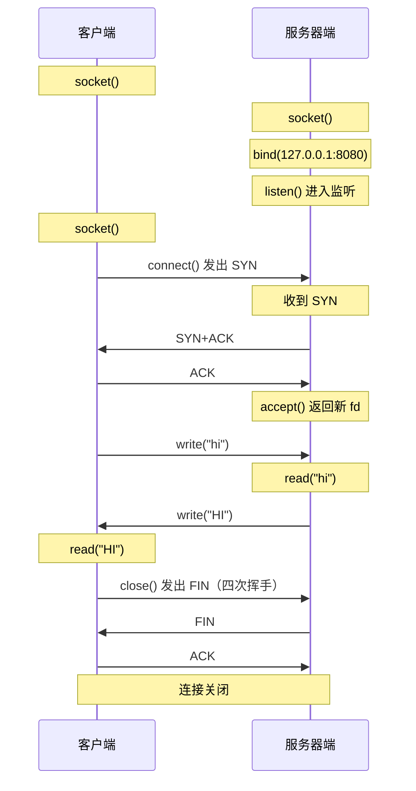
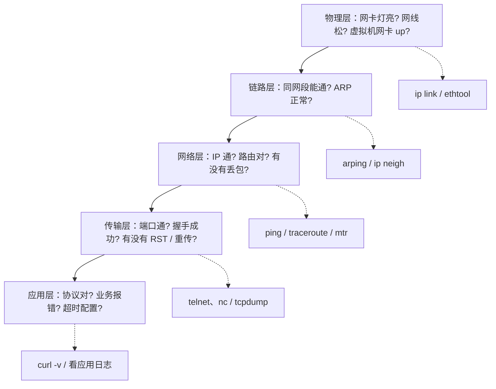

# 08 网络编程与排错实战

> 本篇导读：从 Socket 编程模型到 IO 多路复用，再到 ping/tcpdump 等排错命令与分层排查思路，把前面学的协议落到"写代码"和"线上排障"上。读完你应能写出一个最小 TCP 回声服务、讲清 select/poll/epoll 的差异、并面对"接口不通"时按图索骥定位问题。

## 一、Socket 编程模型

Socket（套接字）是**操作系统提供的网络编程接口**，它把复杂的 TCP/IP 协议细节封装成"像读写文件一样收发数据"的抽象。绝大多数语言（Java/C/Go/Python）的网络库底层都是同一套 BSD Socket API。

### 1.1 C/S 模型

网络程序基本都是**客户端-服务器（Client/Server）**结构：服务器先"蹲点"监听端口，客户端主动连上来，双方建立连接后互发数据。

核心角色：

- **服务端**：绑定固定 IP:端口，被动接受连接，通常 7×24 运行。
- **客户端**：主动发起连接，用完即走（也可能长连）。

### 1.2 核心 API 流程

服务端：`socket()` → `bind()` → `listen()` → `accept()` → `read()/write()` → `close()`
客户端：`socket()` → `connect()` → `read()/write()` → `close()`

| API | 作用 | 谁调用 |
| --- | --- | --- |
| `socket()` | 创建一个套接字（本质是内核里的一个文件描述符） | 双方 |
| `bind()` | 把 socket 绑定到指定 IP:端口 | 服务端 |
| `listen()` | 进入监听状态，设置半连接队列 | 服务端 |
| `accept()` | 从队列里"接"一个已完成三次握手的连接 | 服务端 |
| `connect()` | 向服务端发起 TCP 三次握手 | 客户端 |
| `read()/write()` | 收发数据（内核缓冲区 ↔ 应用缓冲区） | 双方 |
| `close()` | 关闭连接，触发四次挥手 | 双方 |

### 1.3 TCP 服务端-客户端交互（时序图）



注意 `accept()` 返回的是**新的 socket fd**：监听 socket 只负责"接客"，真正和客户端通信的是 accept 出来的新连接。一个服务端进程里通常有"1 个监听 fd + N 个连接 fd"。

## 二、阻塞与非阻塞

`read()/write()/accept()/connect()` 默认都是**阻塞（blocking）**的：调用后线程挂起，直到数据就绪/事件发生才返回。这直接决定了并发能力。

### 2.1 BIO：一个连接一个线程

最直观的写法：主线程 `accept()` 接到连接，就 `new Thread` 专门服务它。

```text
主线程 accept()
   ├─ 连接A → 线程A  read/write
   ├─ 连接B → 线程B  read/write
   └─ 连接C → 线程C  read/write
```

问题很明显：

| 问题 | 说明 |
| --- | --- |
| **线程开销大** | 每连接一线程，C10K（1 万连接）就要 1 万线程，内存与上下文切换吃掉 CPU |
| **阻塞浪费** | 大部分连接空闲（等着收数据），对应线程却一直阻塞挂起，资源白白占用 |
| **扩展性差** | 线程数涨到几百就趋近瓶颈，没法支撑高并发 |

这就是经典的 **C10K 问题**：如何用单台服务器撑住 1 万并发连接。答案不是加线程，而是改 IO 模型。

### 2.2 非阻塞与轮询

把 socket 设为**非阻塞（non-blocking）**：`read()` 当下没数据就立刻返回 `-1`（`EAGAIN`/`EWOULDBLOCK`），而不是干等。

朴素改进：单线程循环遍历所有 socket，谁有数据就读谁。

```text
while true:
  for fd in 所有连接:
    n = read(fd)        # 没数据立即返回 EAGAIN
    if n > 0: 处理数据
```

缺点：**轮询（忙等）**浪费 CPU，连接多了大部分 `read` 都是空转。于是进化出"让内核帮我们盯着哪些 fd 就绪"的机制——**IO 多路复用**。

## 三、五种 IO 模型

IO 模型的本质区别，在于"**等待数据就绪**"和"**数据从内核拷贝到用户空间**"这两步由谁、在何时完成。

| 模型 | 等待数据 | 拷贝数据 | 特点 |
| --- | --- | --- | --- |
| 阻塞 IO | 阻塞 | 阻塞 | 最简单，一线程一连接 |
| 非阻塞 IO | 立即返回(EAGAIN) | 阻塞 | 需轮询，浪费 CPU |
| IO 多路复用 | 阻塞在 select/epoll | 阻塞 | 一个线程管海量 fd，主流 |
| 信号驱动 IO | 信号通知 | 阻塞 | 较少用，SIGIO 复杂 |
| 异步 IO(AIO) | 不阻塞 | 不阻塞(内核拷贝完通知) | 真正的异步，Linux 用 io_uring 兴起 |

### 3.1 IO 多路复用：select / poll / epoll

"多路复用" = 一个线程同时监视成千上万个 fd，哪个就绪就处理哪个。Linux 上经历了三代。

| 维度 | `select` | `poll` | `epoll` |
| --- | --- | --- | --- |
| 底层结构 | `fd_set` 位图（默认上限 1024） | 链表，无硬上限 | 内核红黑树 + 就绪链表 |
| 每次调用开销 | O(n)，遍历全量 fd | O(n) | O(1) 等事件，仅返回就绪的 |
| 是否需重复传 fd 集合 | 是（每次重传） | 是 | 否（一次注册，长期有效） |
| 触发方式 | 水平触发(LT) | 水平触发(LT) | LT 与 ET 均支持 |
| 跨平台 | 全平台都支持 | 多数 Unix 支持 | Linux 专属 |
| 适用规模 | 少连接 | 中连接 | 海量高并发(C10K+) |

### 3.2 epoll 的 LT 与 ET

- **LT（水平触发，Level Triggered）**：只要 fd 缓冲区还有数据没读完，每次 `epoll_wait` 都会再次通知你。编程简单、不易漏事件，但通知次数多。
- **ET（边缘触发，Edge Triggered）**：仅在状态**变化那一刻**通知一次（如从"无数据"变"有数据"）。必须**一次循环把缓冲区读干**（配合 `while read` 直到 `EAGAIN`），否则剩余数据永远不会再被通知。效率高但编码要求严格。

经验法则：新手用 **LT** 更稳；追求极致吞吐且能保证"读干净"时用 **ET**。

### 3.3 为什么 epoll 快

`select`/`poll` 每次调用都要把全量 fd 从用户态拷贝进内核、再线性扫描一遍，连接越多越慢。`epoll` 把 fd 注册进去后长期维护在内核红黑树上，只有**真正就绪的 fd** 才会被放进就绪链表并返回给应用——从 O(n) 扫描降到只处理 O(就绪数) 的事件，这就是它能扛 C10K、C100K 的根本原因。

## 四、Java 网络编程

Java 提供两套网络 API：传统的 **BIO**（`ServerSocket`/`Socket`）适合教学与低并发；高并发用 **NIO**（`Channel`/`Buffer`/`Selector`）。

### 4.1 BIO 最小回声服务（ServerSocket）

```java
package com.example.net;

import java.io.BufferedReader;
import java.io.IOException;
import java.io.InputStreamReader;
import java.io.PrintWriter;
import java.net.ServerSocket;
import java.net.Socket;

public class EchoServer {
    public static void main(String[] args) throws IOException {
        try (ServerSocket server = new ServerSocket(8080)) {
            System.out.println("listening on 8080");
            while (true) {
                Socket client = server.accept();          // 阻塞等待连接
                new Thread(() -> handle(client)).start(); // 一连接一线程
            }
        }
    }

    private static void handle(Socket socket) {
        try (socket;
             BufferedReader in = new BufferedReader(
                     new InputStreamReader(socket.getInputStream()));
             PrintWriter out = new PrintWriter(socket.getOutputStream(), true)) {
            String line;
            while ((line = in.readLine()) != null) {
                out.println(line);                        // 原样回显
            }
        } catch (IOException e) {
            e.printStackTrace();
        }
    }
}
```

对应客户端：

```java
package com.example.net;

import java.io.BufferedReader;
import java.io.IOException;
import java.io.InputStreamReader;
import java.io.PrintWriter;
import java.net.Socket;

public class EchoClient {
    public static void main(String[] args) throws IOException {
        try (Socket socket = new Socket("127.0.0.1", 8080);
             BufferedReader in = new BufferedReader(
                     new InputStreamReader(socket.getInputStream()));
             PrintWriter out = new PrintWriter(socket.getOutputStream(), true);
             BufferedReader console = new BufferedReader(
                     new InputStreamReader(System.in))) {
            out.println(console.readLine());
            System.out.println("server: " + in.readLine());
        }
    }
}
```

### 4.2 NIO 三件套：Channel / Buffer / Selector

NIO（New IO，JDK 1.4+）把"多路复用"做进了标准库：

- **Channel**：双向通道，替代流，可读可写（如 `SocketChannel`、`ServerSocketChannel`）。
- **Buffer**：数据容器，所有读写都经过 Buffer（`allocate(1024)` 后 `put`/`get`，记得 `flip()` 切换读写模式）。
- **Selector**：IO 多路复用器，一个线程注册多个 Channel，用 `select()` 拿到"就绪事件"集合。

典型服务端骨架：

```java
package com.example.net;

import java.io.IOException;
import java.net.InetSocketAddress;
import java.nio.ByteBuffer;
import java.nio.channels.SelectionKey;
import java.nio.channels.Selector;
import java.nio.channels.ServerSocketChannel;
import java.nio.channels.SocketChannel;
import java.util.Iterator;
import java.util.Set;

public class NioEchoServer {
    public static void main(String[] args) throws IOException {
        Selector selector = Selector.open();
        ServerSocketChannel ssc = ServerSocketChannel.open();
        ssc.bind(new InetSocketAddress(8080));
        ssc.configureBlocking(false);          // 必须非阻塞才能注册
        ssc.register(selector, SelectionKey.OP_ACCEPT);

        ByteBuffer buf = ByteBuffer.allocate(1024);
        while (true) {
            selector.select();                 // 阻塞到有关心事件发生
            Set<SelectionKey> keys = selector.selectedKeys();
            Iterator<SelectionKey> it = keys.iterator();
            while (it.hasNext()) {
                SelectionKey key = it.next();
                it.remove();
                if (key.isAcceptable()) {
                    SocketChannel sc = ssc.accept();
                    sc.configureBlocking(false);
                    sc.register(selector, SelectionKey.OP_READ);
                } else if (key.isReadable()) {
                    SocketChannel sc = (SocketChannel) key.channel();
                    buf.clear();
                    int n = sc.read(buf);
                    if (n == -1) { sc.close(); continue; }
                    buf.flip();
                    sc.write(buf);             // 回显
                }
            }
        }
    }
}
```

### 4.3 Reactor 模式

一句话：**Reactor 模式就是把"事件分发"从业务代码里抽出来——用一个 Selector 监听 IO 事件，事件就绪后交给对应 Handler 处理**，Netty 就是它的工业级实现（`BossGroup` 接连接、`WorkerGroup` 管读写）。

### 4.4 Java NIO 选型思路

| 场景 | 建议 |
| --- | --- |
| 内部工具、连接数 < 几百 | 直接用 BIO（`ServerSocket`），代码最直白 |
| 高并发长连接（网关/IM/推送） | 用 NIO 或 Netty，单 Selector 线程 + 工作线程池 |
| 极高性能、新 JDK | 评估 `io_uring` 绑定方案（如项目 Loom/virtual thread 降低并发复杂度） |
| 不想手写事件循环 | 直接用 **Netty**，避免重复造轮子与 ET 模式踩坑 |

JDK 21 的**虚拟线程（Project Loom）**是另一条路：用"一万条虚拟线程对应少量平台线程"的方式写同步风格代码却获得高并发，正在改变"必须 NIO"的格局，值得关注。

## 五、TCP 参数调优

很多线上"诡异现象"其实是 TCP 默认值与业务不匹配造成的。掌握几个关键参数，排障时心里有底。

### 5.1 TIME_WAIT 与 SO_REUSEADDR

主动关闭方会进入 **TIME_WAIT** 状态，持续 **2×MSL**（Linux 默认 60 秒），目的是：① 确保最后 ACK 到达；② 让网络中残留的旧报文过期。

高并发短连接服务器（如每秒新建几千连接）会遇到：**端口被大量 TIME_WAIT 占满**，新连接 `bind`/`connect` 失败。

| 调优手段 | 作用 | 风险 |
| --- | --- | --- |
| `SO_REUSEADDR` | 允许绑定处于 TIME_WAIT 的相同地址（主要用于服务端快速重启） | 低 |
| `SO_REUSEPORT` | 多个进程/线程可绑同一端口，内核做负载均衡 | 低，推荐 |
| `net.ipv4.tcp_tw_reuse` | 对外连接复用 TIME_WAIT 套接字（客户端侧） | 需谨慎 |
| `net.ipv4.tcp_tw_recycle` | 快速回收（已废弃） | **禁用**，NAT 下会丢包 |

注意：服务端监听用 `SO_REUSEADDR`；真正缓解 TIME_WAIT 堆积应优先从"用长连接 / 连接池"而非"拼命回收"入手。

### 5.2 backlog 队列

`listen(fd, backlog)` 的 backlog 控制**已完成三次握手、等待 `accept()` 取走的连接**队列长度。Linux 实际取 `min(backlog, somaxconn)`，默认 `somaxconn=128` 偏小。高并发服务应调大：

```bash
# 查看与调整
sysctl net.core.somaxconn
sysctl -w net.core.somaxconn=4096
```

队列满后，新握手会被丢弃或忽略，表现为客户端连接超时、服务端 `SYN` 堆积。

### 5.3 Nagle 算法与延迟确认的交互

- **Nagle 算法**：小包不立即发，攒成稍大包再发，省带宽。规则：有未确认的小数据时不发新小包。
- **延迟确认（Delayed ACK）**：收到数据后不立即回 ACK，等 40ms 看是否有数据顺带捎回，省一个纯 ACK 包。

两者叠加的坑：**写→等 ACK→Nagle 卡着小包不发→对方延迟确认又等数据→互相干等 40ms**，造成"每次交互都卡一顿"。这在**每次发一点点的交互式协议**（如游戏、RPC 小包）里明显。

解法：对延迟敏感场景，发送端 `TCP_NODELAY`（关闭 Nagle）立刻发；或对端也关延迟确认。但关 Nagle 会增加小包数量，批量大文件传输则应保持开启。

## 六、常用排错命令

排错第一步是"会用工具"。下面按用途分组，每条都给最常见用法。

### 6.1 连通性与路径

| 命令 | 用途 | 典型用法 |
| --- | --- | --- |
| `ping` | 测 IP 层连通（ICMP） | `ping -c 4 example.com` |
| `traceroute` | 看每一跳路径与延迟 | `traceroute example.com` |
| `mtr` | ping + traceroute 实时结合 | `mtr -n example.com` |

`ping` 不通只说明 ICMP 被拦或网络断，不等于 TCP 端口不通（很多服务器禁 ICMP）。`mtr` 比 traceroute 更能看"哪一跳开始丢包"。

### 6.2 连接与端口

| 命令 | 用途 | 典型用法 |
| --- | --- | --- |
| `netstat` | 看连接/监听（老工具） | `netstat -tunlp \| grep 8080` |
| `ss` | 同上，更快更现代 | `ss -tunlp` / `ss -tn state established` |

`ss` 是 `netstat` 的替代品，大数据量下性能更好。常用：`-t` TCP、`-u` UDP、`-n` 不解析名字、`-l` 监听、`-p` 显示进程。

### 6.3 抓包

| 命令 | 用途 | 典型用法 |
| --- | --- | --- |
| `tcpdump` | 命令行抓包 | `tcpdump -i any -nn port 8080 -w cap.pcap` |

抓包后把 `cap.pcap` 拉到 Wireshark 分析。常见过滤：`host 1.2.3.4`、`tcp port 443`、`tcp[13]&2==2`（抓 SYN）。

### 6.4 发请求 / 测端口 / 查 DNS / 看网卡

| 命令 | 用途 | 典型用法 |
| --- | --- | --- |
| `curl` | 发 HTTP 请求、看细节 | `curl -v https://example.com` |
| `telnet` | 测 TCP 端口通不通 | `telnet 127.0.0.1 8080` |
| `nc` (ncat) | 更灵活地测端口/发原始数据 | `nc -vz host 22` |
| `dig` | 查 DNS 解析（推荐） | `dig example.com +short` |
| `nslookup` | 查 DNS（老工具） | `nslookup example.com` |
| `ip` | 看/配网卡与路由 | `ip addr` / `ip route` |
| `ifconfig` | 老式看网卡（逐渐被 `ip` 取代） | `ifconfig eth0` |

`curl -v` 是排查"HTTP 层面为什么错"的神器：它能直接显示 DNS 解析、TLS 握手、请求/响应头全过程。`telnet`/`nc` 用来验证"端口通不通"，比 ping 更贴近真实业务。

## 七、抓包分析

抓包是"看见真实报文"的唯一手段，Wireshark + tcpdump 是标配。

### 7.1 用 Wireshark 看关键现象

| 现象 | 含义 | 排查方向 |
| --- | --- | --- |
| 完整三次握手 | 连接建立正常 | 基础连通 OK |
| 只有 SYN 无 SYN+ACK | 对方没收到/没回应 | 防火墙、服务没起、端口错 |
| **重传（Retransmission）** | 包丢了，发送方补发 | 网络拥塞、链路质量差 |
| **乱序（Out-of-Order）** | 包到达顺序错 | 多路径、交换机，通常 TCP 自动处理 |
| **乱序/重复 ACK** | 可能丢包 | 配合重传看 |
| **Zero Window** | 接收方缓冲区满，通知"别再发" | 接收方消费太慢（应用卡） |
| RST | 连接被强行重置 | 服务崩溃、防火墙 kill、端口无监听 |

### 7.2 常见 TCP 标志位

| 标志 | 全称 | 含义 |
| --- | --- | --- |
| `SYN` | Synchronize | 同步序号，发起连接（三次握手第一、二次） |
| `ACK` | Acknowledgment | 确认号有效，绝大部分包都带 |
| `FIN` | Finish | 正常关闭连接（四次挥手） |
| `RST` | Reset | 异常重置，立即断连 |
| `PSH` | Push | 提示接收方尽快把数据交给应用 |
| `URG` | Urgent | 紧急指针有效（极少用） |

抓包实战口诀：**先看有没有 SYN/ACK 三次握手，再看有没有 retransmission/zero window 这种异常，最后比对应用日志的时间点**——三者对齐，问题往往就现形了。

## 八、典型排查思路

面对"接口不通 / 很慢 / 偶发超时"，不要东一榔头西一棒槌，按分层从底向上系统性定位。

### 8.1 分层定位法（由底向上）



原则：**先证明底层没问题，再往上走**。很多人一上来就怀疑代码，结果根因是网线没插稳或安全组没开。

### 8.2 "接口不通"排查清单

照着勾，基本能覆盖 90% 情况：

```text
□ 1. 本机端口在监听吗?        ss -tunlp | grep <端口>
□ 2. 端口能连上吗(本地)?      telnet 127.0.0.1 <端口>
□ 3. 防火墙/安全组放行了吗?   iptables -L / 云控制台安全组
□ 4. DNS 能解析吗?           dig <域名> +short
□ 5. 跨网络能连吗?           telnet <ip> <端口>  (从客户端机器测)
□ 6. 握手正常吗?             tcpdump -i any port <端口>  看 SYN/ACK
□ 7. HTTP 层报什么错?        curl -v http://<host>:<端口>/path
□ 8. 应用日志有异常吗?       看服务 stderr / 业务日志
□ 9. 资源打满了吗?           CPU/内存/连接数/文件描述符 ulimit -n
□ 10. 中间件(网关/LB)挡了吗? 反向代理、K8s Service、Ingress 配置
```

### 8.3 几个高频根因

| 现象 | 最可能根因 |
| --- | --- |
| 本地能连、远程连不上 | 防火墙/安全组未放行、只绑了 `127.0.0.1` |
| 偶发连接超时 | 服务端 `backlog`/`somaxconn` 太小、TIME_WAIT 堆积 |
| 握手成功但瞬间 RST | 服务进程崩了、端口被别的服务占用 |
| 传输很慢、有重传 | 网络质量差、MTU 不匹配、拥塞 |
| 域名解析时好时坏 | DNS 配置错、上游 DNS 不稳 |

记住一句排障心法：**能复现的问题都不是最难的，先想办法稳定复现，再分层缩小范围**。

## 本篇小结

- **Socket 是操作系统封装的网络接口**，服务端 `socket→bind→listen→accept`，客户端 `socket→connect`，之后 `read/write` 收发。
- `accept()` 返回的是**新连接 fd**，监听 fd 只负责接入，真正通信靠新 fd。
- **BIO 一连接一线程**在 C10K 下被线程开销压垮，催生了非阻塞与 IO 多路复用。
- 五种 IO 模型差异在"等待就绪"与"拷贝数据"两步是否阻塞；**IO 多路复用**是主流高并发方案。
- `select`/`poll` 每次 O(n) 扫描全量 fd，`epoll` 只返回就绪 fd（O(1) 等待），是 Linux 高并发基石。
- `epoll` 有 **LT（水平触发，易用）** 和 **ET（边缘触发，需一次读干净，高效）** 两种模式。
- Java 高并发用 **NIO（Channel/Buffer/Selector）** 或 Netty；JDK 21 虚拟线程让"同步写法 + 高并发"成为可能。
- **TIME_WAIT** 是主动关闭方的正常状态，缓解靠长连接/连接池与 `SO_REUSEPORT`，别盲目回收。
- Nagle 与延迟确认叠加会在小包交互场景引入 ~40ms 延迟，敏感场景用 `TCP_NODELAY`。
- 排错工具链：`ping/mtr` 测连通、`ss` 看连接、`tcpdump` 抓包、`curl -v` 看 HTTP；**由底向上分层定位**最高效。

## 参考链接

- [Oracle：Java NIO 官方教程（Trail）](https://docs.oracle.com/javase/tutorial/essential/io/)
- [man7.org：socket(7) 手册](https://man7.org/linux/man-pages/man7/socket.7.html)
- [man7.org：epoll(7) 手册](https://man7.org/linux/man-pages/man7/epoll.7.html)
- [Wikipedia：epoll](https://en.wikipedia.org/wiki/Epoll)
- [Cloudflare：什么是 TCP 三次握手？](https://www.cloudflare.com/learning/ddos/glossary/tcp-ip/)
- [Cloudflare：TIME_WAIT 与 TCP 状态](https://www.cloudflare.com/learning/network-layer/what-is-a-tcp-connection/)
- [Wireshark 官方文档](https://www.wireshark.org/docs/)
- [The TCPdump Manual](https://www.tcpdump.org/manpages/tcpdump.1.html)

下一篇 → [01 计算机网络概述与分层模型](/cs/network/overview)
