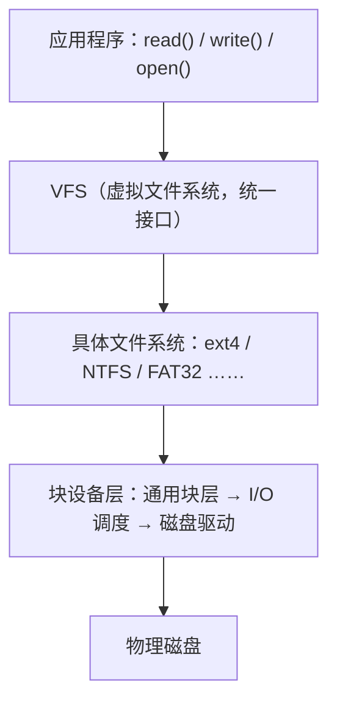

# 07 文件系统

> 本篇导读：文件是数据持久化的载体。本篇讲清文件逻辑/物理结构、目录树、UNIX 的 inode 与硬链接软链接，以及磁盘结构与调度算法。理解这些内容，你就能看懂"为什么删了大文件磁盘空间没立刻释放""为什么硬链接删一个另一个还在""为什么顺序读写比随机读写快得多"——它们都源于文件系统底层的设计选择。

## 一、文件与文件系统

**文件系统（File System，FS）** 是操作系统在存储设备上组织、管理文件的机制。它向上层提供"按名存取"的抽象：你只管 `open("/data/a.txt")` 和读写，至于数据落在磁盘的哪个扇区、怎么找回来，全部由文件系统负责。没有文件系统，磁盘只是一块连续的字节数组，你得自己记住"第 1000 到 2000 字节是文件 A"。

从层次看，文件系统处在这样的位置：



为什么需要文件系统这个中间层？因为裸磁盘有两个问题：一是**寻址困难**（用扇区号编程没人受得了），二是**没有共享与保护**（多进程怎么同时访问、谁能读谁能写）。文件系统用"文件名 + 元数据 + 索引结构"一次性解决了这两件事。

**文件（File）** 是有名字、在逻辑上连续、可持久保存的数据集合。它的关键特征：

- **按名存取**：用户用路径访问，不用管物理位置。
- **持久性**：掉电不丢（相对内存而言）。
- **结构化或无结构化**：具体看逻辑结构（见第二节）。

### 文件名与扩展名

文件名用来定位，扩展名只是**约定**而非强制类型。UNIX 世界里 `a.txt` 不因为它叫 `.txt` 就真是文本；Windows 更依赖扩展名来关联打开程序。两者差异：

| 体系 | 文件名长度限制 | 扩展名含义 | 大小写敏感 | 典型保留字符 |
| --- | --- | --- | --- | --- |
| **UNIX / Linux（ext4 等）** | 255 字节/组件，255 字符（UTF-8 下更少） | 仅是约定，系统不据此判断类型 | 敏感（`A` 与 `a` 不同） | `/` 和 NUL |
| **Windows（NTFS/FAT）** | 255 字符 | 系统据此关联程序 | 不敏感（`A` 与 `a` 相同） | `\ / : * ? " < > \|` |

注意 Linux 下文件名允许含空格，但命令行要加引号；允许含 `.` 但 `.` 开头的是隐藏文件（如 `.bashrc`），这是 `ls` 默认不显示的规则，不是文件系统强制的。

### 文件属性 / 元数据

元数据（metadata）是"关于文件的数据"，存在 inode 或 MFT 里，而不是在文件内容里。常见项：

| 元数据 | 说明 |
| --- | --- |
| **类型** | 普通文件 / 目录 / 设备 / 符号链接 / 套接字 … |
| **权限** | 所有者、同组、其他人的读/写/执行位（rwx） |
| **所有者与组** | uid / gid |
| **大小** | 字节数（逻辑大小） |
| **时间戳** | atime（访问）、mtime（内容修改）、ctime（元数据修改）、crtime（创建，ext4 支持） |
| **链接计数** | 有多少个名字指向该 inode（硬链接数） |
| **数据位置** | 指向实际数据块的索引（inode 的指针 / FAT 的簇链起点） |
| **块数 / 占用** | 实际占了多少个磁盘块（常比逻辑大小按块对齐后大） |

一个容易踩的点：**`ls -l` 显示的大小是逻辑字节数**，`du` 显示的是实际占用的磁盘块数。一个 1 字节的文件在 4KB 块的文件系统上，逻辑大小 1、占用仍是 1 个 4KB 块。

## 二、文件逻辑结构

逻辑结构指"从用户/程序视角看，文件内部怎么组织"。它和物理存储无关，是文件系统设计者给用户的一层抽象。

### 无结构字节流 vs 记录式

| 组织方式 | 说明 | 代表 |
| --- | --- | --- |
| **无结构字节流（流式）** | 文件就是一串字节，含义由应用程序解释（如 ELF 可执行文件自己定义头部格式） | UNIX 一切皆文件的做法，ext4/大多数现代 FS |
| **记录式（结构式）** | 文件由定长或变长"记录"组成，FS 负责维护记录边界，提供"读第 N 条记录" | 早期大型机/数据库专用 FS，现代多交给数据库层 |

为什么现代通用文件系统几乎都选字节流？因为**把结构交给应用更灵活**：同一个文件一会儿当文本、一会儿当图片，内核不该关心。数据库系统如果想要记录式，自己在字节流上再建一层 B+ 树即可。

### 文件内部的逻辑组织方式

即便对外是字节流，设计者仍可设想文件内部如何被访问，常见三种：

| 组织 | 思想 | 优劣 |
| --- | --- | --- |
| **顺序文件** | 记录按 key 有序存放，适合顺序扫描 | 读取快、二分查找可行；插入删除要移动，随机增删慢 |
| **索引文件** | 另建一张索引表（key→偏移），按索引定位记录 | 检索快（尤其变长记录）；多占空间、索引要维护 |
| **哈希文件** | 用 hash(key) 直接算记录位置 | 等值查找 O(1)；不适合范围查询、有冲突处理开销 |

补充一点：这里的"顺序/索引/哈希"是**逻辑组织**概念，和物理结构（连续/链式/索引）不是一回事。物理结构讲的是"磁盘上数据块怎么连"，逻辑组织讲的是"文件内容怎么被解释"。两者可以任意组合：一个字节流文件（逻辑无结构）既可能连续存放（物理连续），也可能索引存放（物理索引）。

## 三、目录结构

目录（directory）本质是**一张"文件名 → 文件索引"的映射表**。在 UNIX 里，目录本身也是文件，内容是若干 `文件名 : inode号` 的条目。所以"建目录"和"建文件"底层动作相似，区别只是目录的条目指向别的文件。

### 几种目录组织形式

| 形式 | 结构 | 问题 |
| --- | --- | --- |
| **单级目录** | 所有文件平铺在一个表里 | 不能重名、不能分组、用户间互相看见，早期系统用 |
| **两级目录** | 系统级 + 每个用户一个目录（MFD/UFD） | 解决了用户隔离与重名，但用户之间共享文件困难 |
| **树形目录** | 多级嵌套，形成一棵树 | 最常用；路径清晰、可分组、支持相对/绝对路径 |
| **无环图目录** | 树 + 允许共享（硬链接）形成有向无环图 DAG | 共享方便，但要处理"链接计数"与删除后的悬空问题 |
| **通用图目录** | 允许环（软/硬链接成环） | 最灵活但遍历会死循环，需要额外标记避免重复访问 |

### 为什么树形最常用

树形目录在"隔离 / 重名 / 分组 / 权限"之间取得了最佳平衡：

- 每个用户可以有一棵子树，互不干扰；
- 不同目录下允许同名文件（如两个项目各有 `config.yaml`）；
- 路径天然表达层级，权限可以"继承"到子目录。

现代系统实际是**有向无环图**：因为硬链接让一个文件出现在多个目录里，树就破环成图，但文件系统通过"禁止硬链接指向目录"来避免成环，于是整体仍是无环图。软链接可以指向目录、可以形成环，但软链接是独立 inode，遍历时按"是否访问过该 inode"判断，不会无限循环。

### 路径

- **绝对路径**：从根 `/` 开始，如 `/home/tom/data/a.txt`，不依赖当前目录。
- **相对路径**：从当前工作目录（cwd）开始，如当前在 `/home/tom`，写 `data/a.txt`。
- **`.` 与 `..`**：`.` 是当前目录自身，`..` 是父目录。它们是目录创建时自动生成的两条特殊条目，所以"树形"在底层其实是"每个节点有指针回父节点"的图。

路径解析过程：`/` 找到根目录项 → 取 `home` 对应的 inode → 读该目录找 `tom` → …… 每一步都是一次"目录文件查找"，这也是为什么**目录层级越深，打开文件的元数据 I/O 越多**，深目录会稍微慢一点。

## 四、文件物理结构

物理结构决定"一个文件的数据块在磁盘上如何排布"。这是文件系统实现的核心，三种经典方案各有取舍。

### 连续结构（Contiguous）

文件占用一组**连续**的磁盘块，像数组。

```text
磁盘块: [ 0 ][ 1 ][ 2 ][ 3 ][ 4 ][ 5 ][ 6 ][ 7 ]...
文件A:   [ A ][ A ][ A ][ A ]            (占块1-4)
文件B:                        [ B ][ B ]      (占块6-7)
```

- 优点：顺序访问极快（磁头不用移动），支持直接定址（块号 = 起始 + 偏移）；随机访问 `第 i 块` 是 O(1)。
- 缺点：**外部碎片**（删文件后留下空洞，新文件放不下）；**文件难增长**（要预留或整体搬迁）。多用于早期系统、CD-ROM、以及"一次写长期读"的场景（如光盘、某些日志归档）。

### 链式结构（Linked / 隐式链接）

每个块里存"下一个块的指针"，文件由块链串起来。FAT 家族用的就是这种思想的变体。

```text
块2 → 块5 → 块9 → 块3 → (EOF)
[ A1 ]   [ A2 ]   [ A3 ]   [ A4 ]
```

- 优点：无外部碎片，文件可任意增长。
- 缺点：随机访问慢（要沿链走）；**指针占用块内空间**；**一块损坏则后续全丢**；不适合直接定址。

### 索引结构（Indexed）

每个文件有一个**索引块**，里面专门放"数据块号数组"，像页表。UNIX inode 就是这种思路。

```text
索引块:  [ 指向12 ][ 指向5 ][ 指向9 ][ 指向3 ] ...
           数据块     数据块    数据块    数据块
```

- 优点：兼顾随机访问（索引里直接查）与无外部碎片（块可分散）。
- 缺点：小文件也要一个索引块，有存储开销；大文件索引块本身不够时要多级。

### FAT 表（文件分配表）

FAT 把"链式指针"从块内抽出来，集中放到一张**文件分配表（FAT）** 里：FAT 是数组，下标是簇号，值是"下一簇号"或结束标志。目录项只记"起始簇号"。

```text
目录项:  a.txt → 起始簇 2
FAT 表:
簇2 -> 簇5 -> 簇9 -> 簇3 -> 0xFFF(结束)
```

优点：块损坏时 FAT 比块内指针更易修复（FAT 常存多份备份）；随机访问比纯链块快一点（查表不在磁盘上跳来跳去）。缺点：FAT 表本身要常驻内存才快，簇数越多表越大（FAT32 簇号 28 位，表随磁盘容量暴涨）。

### UNIX 混合索引（多级索引）

UNIX inode 用"小文件直接、大文件间接"的混合方案，兼顾空间与规模：

```text
inode 指针区:
  直接块 0..11       (12 个，指向数据块，小文件零额外开销)
  一级间接           → 一个索引块 → 若干数据块
  二级间接           → 索引块 → 索引块 → 数据块
  三级间接           → 三级索引链，支持超大文件
```

假设块 4KB、块号 4 字节：一级间接存 1024 个块 ≈ 4MB，二级间接 ≈ 4GB，三级间接 ≈ 4TB。于是 12 个直接块覆盖 48KB 常见小文件零开销，再大就逐级用间接块，文件大小理论上限极高。

### 三种结构优劣对比

| 结构 | 随机访问 | 外部碎片 | 易增长 | 损坏容忍 | 典型用途 |
| --- | --- | --- | --- | --- | --- |
| **连续** | O(1) 最快 | 严重 | 难 | 中 | 光盘、归档、顺序大文件 |
| **链式** | O(n) 慢 | 无 | 易 | 差（断链丢尾） | 早期、流式 |
| **索引** | O(1) 快 | 无 | 易 | 好（索引可备份） | UNIX/ext/现代通用 FS |

## 五、inode 与超级块

这是 UNIX 系文件系统的实现核心。理解 inode，就理解了"硬链接""删除文件空间不释放""软硬链接区别"这些经典问题。

### inode 是什么

**inode（index node）** 是磁盘上存"文件元数据 + 数据块指针"的固定大小结构。注意：**inode 里没有文件名**。文件名在目录项里，目录项把"名字 → inode 号"对应起来。

```text
磁盘布局（经典 UNIX）:
┌──────────┬──────────┬────────────┬──────────────┬───────────┐
│ 引导块   │ 超级块   │ inode 表    │ 数据块区      │ …       │
└──────────┴──────────┴────────────┴──────────────┴───────────┘
                 ↑            ↑
            全局信息      所有 inode 顺序排布
```

### inode 存什么

| 字段 | 内容 |
| --- | --- |
| **文件模式/类型** | 普通文件/目录/设备/链接 + 权限位 |
| **所有者 uid / gid** | 访问控制依据 |
| **大小** | 字节数 |
| **时间戳** | atime/mtime/ctime/crtime |
| **链接计数 links** | 硬链接数，为 0 才能真正释放数据块 |
| **数据块指针** | 直接块 + 各级间接块（见第四节） |
| **扩展属性** | ACL、SELinux 标签等（ext4 可外置） |

### 超级块（Superblock）

超级块存**整个文件系统的全局参数**：总块数、空闲块数、inode 总数、每块大小、魔数（标识 FS 类型）、挂载状态（脏标志，异常关机后 fsck 会重放）。它极其重要，所以文件系统通常**在多处备份超级块**（ext 系列有备用超级块，万一主块损坏可恢复）。

### 硬链接 vs 软链接

这是高频面试题，核心差异在于"链接指向 inode 还是路径名"。

| 维度 | 硬链接（hard link） | 软链接 / 符号链接（symlink） |
| --- | --- | --- |
| **本质** | 同一个 inode 的**另一个名字**（目录项多一条） | 一个**独立的小文件**，内容是被链文件的**路径字符串** |
| **跨文件系统** | 不能（inode 号只在同 FS 内唯一） | 能（存的是路径，可跨设备） |
| **指向目录** | 通常禁止（防成环） | 允许 |
| **原文件被删** | 不影响，数据仍在（links 计数 -1，到 0 才释放） | 变成"悬空链接/断链"，访问报 No such file |
| **占用 inode** | 不新增 inode，只增加目录项与 links | 新增一个 inode |
| **`ls -l` 表现** | 与原文件完全一样，链接数变 N | 显示 `-> 目标`，权限通常是 `lrwxrwxrwx` |
| **`inode` 号** | 与原文件相同（同一个 inode） | 不同于目标（是自己的 inode） |

创建命令对照（仅说明，不要求跑）：

```bash
ln  源文件  硬链接名     # 硬链接：多一个名字指向同一 inode
ln -s 源文件  软链接名   # 软链接：新建一个小文件存路径
```

一个经典排查场景：**删了大文件，用 `df` 看磁盘没释放**。原因常是还有进程在用该文件（links 已为 0 但 fd 未关，数据块暂不能回收），或是有硬链接存在（links > 0）。此时 `lsof | grep deleted` 能找到"已删但仍被占用"的文件。这正是 inode 机制的直接后果。

## 六、空闲空间管理

文件系统必须知道"哪些块还空着"才能分配。三种主流方法：

### 位图（Bitmap）

用一个比特位表示一块的忙/闲：`0` 空闲、`1` 占用。最常用（ext 系列、NTFS 都用）。

```text
块位图:  1 0 1 1 0 0 1 0 ...
含义:    忙 闲 忙 忙 闲 闲 忙 闲 ...
```

- 优点：紧凑（1TB、4KB 块约需 32MB 位图），找连续空闲快，易实现"优先分配相邻块以减少碎片"。
- 缺点：盘很大时位图也大，但相对数据块仍可忽略。

### 空闲链表（Free List）

把空闲块用指针串成链表，或把空闲块号记在链里。

```text
头指针 → [空闲块A 存 下一块地址] → [空闲块B] → ...
```

- 优点：分配/回收就是链表头插删，简单。
- 缺点：随机分配要遍历；每块要腾出空间存指针；效率低，现代少用。

### 成组链接法（Grouped Linking，UNIX 经典）

折中：每个空闲块里存"一组（如 100 个）空闲块号"，最后一项指向下一组。分配时从当前组取，取空了跳下一组；回收时把块号加回当前组（满 100 个就新开一组）。它避免了"每块都存一个指针"的开销，又不必一次加载整张位图。

```text
组头块: [块号1][块号2]...[块号100][下一组头块号]
```

三种方法对比：

| 方法 | 空间开销 | 分配速度 | 连续分配友好 | 现状 |
| --- | --- | --- | --- | --- |
| **位图** | 极小 | 快 | 极好 | 主流（ext/NTFS/XFS） |
| **空闲链表** | 中等（每块指针） | 一般 | 一般 | 少用 |
| **成组链接** | 小 | 快 | 好 | 老 UNIX 教学经典 |

## 七、磁盘结构

要理解"为什么顺序读写快、调度算法有什么用"，先得知道磁盘怎么读写数据。

### 盘面 / 磁道 / 扇区 / 柱面 / CHS

一块机械硬盘（HDD）由多张**盘面（platter）** 叠加，每面一个磁头：

```text
      俯视一个盘面:
   ┌───────────────────────────┐
   │   磁道(同心圆)    _______ │
   │  ┌──┐ ┌──┐ ┌──┐           │
   │  │扇│ │扇│ │扇            │  每圈=1磁道
   │  └──┘ └──┘ └──┘           │
   │     圆心(主轴)            │
   └───────────────────────────┘

  所有盘面同一半径的磁道叠起来 = 一个柱面(cylinder)
```

- **盘面（platter）**：一张圆盘，两面可存。
- **磁道（track）**：盘面上的一个同心圆。
- **扇区（sector）**：磁道被等分的小段，是**物理读写最小单位**（传统 512 字节，现代高级格式化常 4KB）。
- **柱面（cylinder）**：所有盘面、相同半径的磁道集合。
- **CHS 寻址**：早期用（Cylinder, Head, Sector）三维定位一个扇区。现代磁盘用 LBA（逻辑块地址）线性编号，CHS 由磁盘固件内部转换。
- **簇 / 块（cluster / block）**：文件系统层的最小分配单位，由若干个扇区组成（如 4KB = 8 个 512B 扇区）。**扇区是硬件最小读写单位，块是文件系统分配单位**，二者不必相等。

SSD（固态盘）没有磁头机械结构，内部以"页（page，如 4KB）/块（block，如 256 页）"组织，写前需擦除整块，所以不能"原地覆盖"，这是 TRIM、写放大等问题的根源——但文件系统对上仍用"块"抽象，调度算法的"减少寻道"对 SSD 意义不大，SSD 更看重磨损均衡与队列深度。

### 一次磁盘 I/O 的时间组成

访问一个扇区要花三段时间之和：

```text
总访问时间 = 寻道时间 + 旋转延迟 + 传输时间
            ───────   ────────   ────────
            (主导)      (次主)     (很小)
```

| 组成 | 含义 | 量级 | 能否被调度优化 |
| --- | --- | --- | --- |
| **寻道时间（seek）** | 磁头臂移动到目标柱面 | 2~15 ms，占大头 | **能**（调度算法核心目标） |
| **旋转延迟（rotational latency）** | 盘片转到扇区到磁头下 | 平均半圈，7200 转约 4.2 ms | 部分能（调度可顺便优化） |
| **传输时间（transfer）** | 实际读写数据 | 与数据量/转速有关，通常 < 1 ms | 基本不能 |

结论：**寻道时间主导**，所以磁盘调度算法的唯一目标就是"让磁头少跑冤枉路、把寻道时间压到最低"。这也解释了为什么"顺序读写远快于随机读写"——顺序时磁道/柱面连续，几乎不寻道；随机时每次都大幅寻道。

## 八、磁盘调度算法

前提：磁盘驱动收到一串"读/写某柱面"的请求，磁头当前在某个位置。调度算法决定**先服务谁**，以减少平均寻道。

设磁头初始在 100，请求队列（柱面号）：`55, 58, 39, 18, 90, 160, 150, 38, 184`。下面用同一队列演示各算法（假设向编号增大方向服务，移动代价 = 柱面差绝对值）。

### FCFS（先来先服务）

按请求到达顺序依次服务，不优化。

顺序：100 → 55 → 58 → 39 → 18 → 90 → 160 → 150 → 38 → 184
寻道：45+3+19+21+72+70+10+112+146 = 498

- 优点：绝对公平、实现简单、无饥饿。
- 缺点：磁头可能来回横跳，平均寻道高，性能差。

### SSTF（最短寻道优先）

每次选"离当前磁头最近"的请求。

顺序：100 → 90 → 58 → 55 → 39 → 38 → 18 → 150 → 160 → 184
寻道：10+32+3+16+1+20+132+10+24 = 248

- 优点：平均寻道明显低于 FCFS。
- 缺点：**可能饥饿**——如果不断有中间请求进来，远处的请求（如 184）可能一直等不到，磁头"黏"在局部。

### SCAN（电梯算法）

磁头像电梯：朝一个方向走，沿途服务该方向所有请求，到端点再掉头。

顺序（先向增大）：100 → 150 → 160 → 184 → (到端) → 90 → 58 → 55 → 39 → 38 → 18
寻道：50+10+24+94+32+66+3+16+1+20 = 316

- 优点：避免饥饿（每个请求一定会在"扫到时被服务"），平均寻道低。
- 缺点：两端请求等待时间不对称（刚扫过的端点要等整整一圈）。

### C-SCAN（循环扫描）

只在一个方向服务，到端后立即回到起点（回程不服务），像"从 0 到 N 单向扫，扫完瞬间回 0 再扫"。让各柱面等待更均匀。

顺序（增大方向，到 184 后瞬回最小再增）：100 → 150 → 160 → 184 → (回) → 18 → 38 → 39 → 55 → 58 → 90
寻道：50+10+24 + (184→18=166) + 20+1+16+3+32 = 322

- 优点：请求等待时间更均匀（尤其端点），适合大量随机请求。
- 缺点：回程空跑，总移动略多；但公平性好。

### LOOK / C-LOOK

SCAN/C-SCAN 的改进：**不走到物理端点**，而是"走到该方向最后一个请求就掉头"。因为请求可能没到端点，没必要白跑到头。

LOOK 顺序：100 → 150 → 160 → 184 → 90 → 58 → 55 → 39 → 38 → 18（比 SCAN 少跑端点外的空程）

### 五算法对比

| 算法 | 思想 | 平均寻道 | 饥饿 | 公平性 | 备注 |
| --- | --- | --- | --- | --- | --- |
| **FCFS** | 按到达顺序 | 高 | 无 | 好 | 简单但慢 |
| **SSTF** | 最近优先 | 低 | **有** | 差 | 易黏局部 |
| **SCAN** | 电梯双向 | 中低 | 无 | 较好 | 端点等待长 |
| **C-SCAN** | 单向循环 | 中低 | 无 | **好** | 等待最均匀 |
| **LOOK** | SCAN 不走到头 | 更低 | 无 | 较好 | 实际最常用（现代电梯调度） |

现实里：现代 OS 的 I/O 调度器（如 Linux 的 mq-deadline、BFQ）在 SCAN/LOOK 思想上叠加了**合并相邻请求、按截止时间防饥饿、SSD 下退化为简单排队**等策略，但"减少磁头寻道"的核心思想一脉相承。

## 九、常见文件系统

一张表看清主流文件系统各自定位（一句话特点）：

| 文件系统 | 类型 / 平台 | 一句话特点 |
| --- | --- | --- |
| **FAT32** | 老牌、跨平台 | 兼容性极强（U 盘通用），但**单文件 ≤ 4GB、卷 ≤ 32GB 限制**，无日志、无权限 |
| **exFAT** | 微软、跨平台 | 为闪存设计，去除了 FAT32 的大小限制，适合大文件 U 盘/SD 卡，无日志 |
| **NTFS** | Windows 主用 | 支持日志、权限 ACL、压缩、加密、硬链接，企业级特性全，Linux 可读写（ntfs-3g） |
| **ext4** | Linux 主用 | 第四代扩展文件系统，向后兼容 ext2/3，支持日志、extent、大文件，稳定成熟 |
| **XFS** | Linux（大文件/高并发） | SGI 开发，擅长超大文件与高并发吞吐，元数据日志，常用于服务器/数据库 |
| **APFS** | macOS / iOS（2017 起） | 为 SSD 优化，支持快照、克隆、空间共享、加密，取代 HFS+ |
| **Btrfs** | Linux（写时复制） | 支持快照、校验和自检、子卷、RAID，功能多但复杂度高 |
| **ZFS** | Solaris/FreeBSD/Linux | 企业级，内置卷管理+校验和+去重+快照，数据完整性极强，内存需求大 |

选型直觉：U 盘/exFAT 求兼容；Linux 根盘 ext4 求稳、数据库盘 XFS 求吞吐；Windows 用 NTFS；macOS 用 APFS。"日志（journaling）"能防止意外掉电后文件结构损坏（把元数据操作先记日志再提交），是现代 FS 的标配。

## 本篇小结

- **文件系统**在"裸磁盘"与"按名存取"之间架桥，让多进程共享存储且带权限保护。
- 文件名与**元数据（inode/MFT）** 分离：实际数据位置存在元数据里，不在文件名中。
- 逻辑结构是"用户视角的组织"（字节流/记录式），物理结构是"磁盘上的排布"（连续/链式/索引），二者正交。
- **连续结构**随机访问最快但有外部碎片；**索引结构**最均衡，UNIX 用"直接块+多级间接"混合索引。
- FAT 把链式指针集中成文件分配表；现代主流用**位图**管理空闲空间，紧凑且利于连续分配。
- inode 存元数据与块指针、**不含文件名**；文件名在目录项里把"名字→inode 号"对应起来。
- **硬链接**是同一 inode 的别名（links 计数 +1），**软链接**是存路径的独立文件；删原文件硬链接不受影响、软链接断链。
- 删大文件 `df` 不释放，常因**还有进程占用 fd 或存在硬链接**（links 未到 0），用 `lsof | grep deleted` 排查。
- 一次磁盘 I/O = 寻道 + 旋转 + 传输，**寻道时间占主导**，所以顺序读写远快于随机读写。
- 磁盘调度（SCAN/LOOK/C-SCAN）目标是**减少平均寻道**；SSTF 快但会饥饿，LOOK 是现实最常用基础。

## 参考链接

- [OSTEP: Files and Directories](https://pages.cs.wisc.edu/~remzi/OSTEP/file-intro.pdf)
- [OSTEP: File System Implementation](https://pages.cs.wisc.edu/~remzi/OSTEP/file-implementation.pdf)
- [OSTEP: Faster File System (LFS, journaling)](https://pages.cs.wisc.edu/~remzi/OSTEP/file-ffs.pdf)
- [Wikipedia: File system](https://en.wikipedia.org/wiki/File_system)
- [Wikipedia: Inode](https://en.wikipedia.org/wiki/Inode)
- [Wikipedia: Disk scheduling (SCAN/SSTF)](https://en.wikipedia.org/wiki/Elevator_algorithm)
- [The ext4 filesystem wiki (kernel.org)](https://ext4.wiki.kernel.org/index.php/Ext4)
- [Microsoft: NTFS overview](https://learn.microsoft.com/en-us/windows-server/storage/file-server/ntfs-overview)

下一篇 → [08 并发控制与死锁](/cs/os/concurrency)
