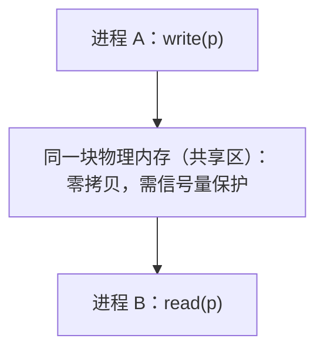

# 04 进程间通信

> 本篇导读：进程默认隔离，要协作就得通信。本篇盘点管道、消息队列、共享内存、信号量、信号、Socket 六大 IPC，对比谁快、谁需要亲缘关系。

## 一、为什么需要 IPC

### 1.1 地址空间隔离是默认状态

现代 OS 给每个进程一套**独立的虚拟地址空间**。进程 A 的地址 `0x400000` 和进程 B 的 `0x400000` 指向完全不同的物理内存，彼此看不到对方的数据。这是出于**安全与稳定**的考虑——一个进程崩溃、越界，不会把别的进程搞挂；一个恶意进程也读不到别人的密码、密钥。

但隔离带来一个问题：**进程之间想协作怎么办？** 比如：

- 一个 shell 命令 `ls | grep foo`，`ls` 的输出要喂给 `grep`。
- 浏览器把下载任务交给独立的下载进程，下完了通知主进程。
- 数据库主从之间要同步数据、交换日志。
- 多个 worker 进程共享一份缓存，避免各算各的。

这些都需要"跨进程的通道"，统称 **IPC（Inter-Process Communication，进程间通信）**。

### 1.2 协作场景分类

| 场景 | 目的 | 典型 IPC |
| --- | --- | --- |
| **数据传输** | A 把一批数据交给 B | 管道、消息队列、共享内存、Socket |
| **共享数据** | 多进程读同一份数据，零拷贝 | 共享内存 |
| **同步/互斥** | 协调执行顺序、保护临界区 | 信号量、互斥锁、条件变量 |
| **事件通知** | 告诉对方"某件事发生了" | 信号、Socket |
| **远程通信** | 跨机器交换数据 | Socket（含 unix domain socket） |

注意：**信号量不传数据，只做同步**；**信号不传大量数据，只发事件**。别把"通知"和"传数据"搞混。一个常见反模式是"用信号传数据"——信号本身带不了多少信息，硬塞只会丢事件、出 bug。

### 1.3 内核在 IPC 里扮演的角色

绝大多数 IPC 都经过内核中转（内核缓冲区、内核对象），因为进程不能直接访问对方地址空间。只有**共享内存**绕开了这一步（直接映射同一物理页），所以最快。理解"数据要不要进内核"是判断 IPC 快慢的关键：

```text
进程A ──用户态──► [内核缓冲区] ──► 进程B 用户态    大多数IPC(管道/消息队列/Socket)
进程A ──直接写──► [同一物理内存] ◄──直接读── 进程B   共享内存(零拷贝)
```

## 二、管道

管道是最古老的 IPC，Unix 设计哲学"一切皆文件"的典型体现——管道也是一个"文件"，但数据只流向一端。

### 2.1 匿名管道 pipe：半双工、仅父子

`pipe()` 创建一个内核缓冲区，返回两个文件描述符：一个读端、一个写端。数据是**半双工**的（一端写、一端读，不能双向同时）。而且它**只能在亲缘进程（父子/兄弟，共享 fork 前的 fd）之间用**——匿名管道没有名字，外部进程找不到它。

```c
#include <unistd.h>
int fd[2];
pipe(fd);          // fd[0] 读端, fd[1] 写端
if (fork() == 0) {
    close(fd[1]);            // 子进程: 关写端, 只从 fd[0] 读
    read(fd[0], buf, ...);
} else {
    close(fd[0]);            // 父进程: 关读端, 只往 fd[1] 写
    write(fd[1], "hi", 2);
}
```

**Shell 里的 `|` 就是匿名管道**：`ls | grep foo` 时，shell 先 `pipe()` 再 `fork()` 两次，把 `ls` 的标准输出重定向到管道写端，`grep` 的标准输入重定向到管道读端。于是 `ls` 写的任何东西，`grep` 都能从标准输入读到。

要点：
- 写端关闭后，读端 `read` 返回 0（EOF），读进程知道"没数据了"。
- 读端关闭后，写端再写会收到 `SIGPIPE` 信号（默认终止进程）——这就是"管道破裂"。
- 容量有限（Linux 默认管道缓冲区 64KB，可用 `fcntl` 调），写满会阻塞。

### 2.2 命名管道 FIFO：无关进程也可

匿名管道没有文件系统入口，陌生人进不来。FIFO（First-In-First-Out）给它**起个名字、落进文件系统**（如 `/tmp/myfifo`），这样**没有亲缘关系的进程也能靠路径打开它通信**。

```bash
mkfifo /tmp/myfifo          # 创建一个命名管道文件
# 终端A: 写
echo "hello" > /tmp/myfifo
# 终端B: 读（阻塞直到有人写）
cat < /tmp/myfifo
```

FIFO 打通了两个无亲缘关系的进程，但仍保持"半双工、按字节流、先进先出"的特性。注意 FIFO 文件本身不存数据，它只是个"门牌号"，数据仍在内核缓冲区。

### 2.3 管道优缺点

- 优点：简单、shell 原生支持、内核自动缓冲、用标准 `read/write` 即可。
- 缺点：
  - **半双工**（双向要建两个管道，一个负责 A→B，一个负责 B→A）。
  - **匿名管道强依赖亲缘关系**。
  - 面向**字节流、无消息边界**（读多少次、一次读多少都不固定，应用层自己分包）。
  - 容量受限，不适合传大块数据。

## 三、消息队列

管道没有"消息边界"，你不知道一次该读多少。消息队列解决了这个问题：**内核维护一个消息链表，每条消息带类型、有边界**。

### 3.1 System V / POSIX 两套

历史上有两套实现，接口风格不同：

| 实现 | 接口风格 | 标识 | 现状 |
| --- | --- | --- | --- |
| **System V 消息队列** | `msgget/msgsnd/msgrcv` | `key_t` + `msgget` 创建 | 老，仍广泛支持 |
| **POSIX 消息队列** | `mq_open/mq_send/mq_receive` | 名字（如 `/myq`） | 较新，接口更现代，支持通知 |

POSIX 消息队列还有一个好处：可以通过 `mq_notify` 注册，队列非空时收到信号或线程通知，**不用阻塞死等**；System V 只能阻塞/非阻塞 `msgrcv`。

### 3.2 按类型取是核心能力

每条消息带一个 `long` 类型的 `mtype` 字段。接收方可以**按类型选择性地取消息**，而不是只能 FIFO 顺序拿：

```c
struct msg { long mtype; char mtext[64]; };
msgsnd(qid, &m, sizeof(m.mtext), 0);    // 发送, mtype=1
msgrcv(qid, &m, 64, 1, 0);              // 只取 mtype==1 的消息
msgrcv(qid, &m, 64, 0, 0);              // mtype=0 表示取任意类型(仍按序)
```

这让"一个发送方、多个接收方按兴趣订阅"变得简单，有点像轻量发布订阅。

### 3.3 优缺点

- 优点：有**消息边界**、可**按类型取**、有**内核缓冲**（发送方不用等接收方在线，消息暂存内核，实现解耦）。
- 缺点：
  - **单条消息和队列总长度受限**（System V 默认单条上限通常几 KB、队列总上限几十 KB~几 MB，且整个系统队列数也有限制，可用 `proc/sys/kernel/msgmax` 等调）。
  - 数据需要**从用户态拷贝到内核、再从内核拷贝到用户态**（两次拷贝），比共享内存慢。
  - 默认系统重启后队列清空（除非特殊持久化配置），不适合当持久存储。

## 四、共享内存

如果追求极致速度，数据共享应该**零拷贝、不走内核中转**——这就是共享内存。

### 4.1 思想与实现

把**同一段物理内存映射到多个进程的虚拟地址空间**，于是 A 往这块内存写，B 立刻就能看到，中间**没有任何拷贝**。

- **System V 共享内存**：`shmget` 创建一段共享内存段，`shmat` 挂接到本进程地址空间，`shmdt` 脱离。
- **POSIX / mmap 共享内存**：`shm_open` 打开（或创建）一个具名共享内存对象，再 `mmap` 映射；也可以用匿名 `mmap` 配合 `fork`，让父子共享同一段映射。
- **文件映射**：`mmap` 一个普通文件并 `MAP_SHARED`，多个进程映射同一文件也能共享，顺便落盘持久化。

```c
// POSIX 具名共享内存示意
int fd = shm_open("/my_shm", O_CREAT|O_RDWR, 0600);
ftruncate(fd, 4096);
void *p = mmap(NULL, 4096, PROT_READ|PROT_WRITE, MAP_SHARED, fd, 0);
// 现在不同进程都 mmap 同一个 /my_shm，写 p 对方立即可见
```

### 4.2 拷贝次数为 0

对比其他 IPC 的"用户→内核→用户"两次拷贝，共享内存**直接读写同一块内存，拷贝次数为 0**，因此它是**最快的 IPC**，适合大数据量、高频交换（如数据库 buffer、图形帧、科学计算中间结果）。

### 4.3 必须与同步配合

缺点也直接来自"太快太裸"：**没有任何内置同步机制**。两个进程同时写同一地址会**竞态**（数据错乱）；一个在写、另一个读到半截也是错。所以共享内存**几乎总是和信号量/互斥锁配合使用**来保护临界区。另外它**需要亲缘关系或显式名字**才能找到同一段内存（匿名共享内存通常靠 fork 继承，命名共享内存靠名字）。



### 4.4 一个共享内存 + 信号量的完整思路

典型生产者/消费者：

1. 创建共享内存区，放一个环形缓冲区。
2. 创建两个信号量：`empty`（初始 = 缓冲区容量，表示空位）、`full`（初始 = 0，表示已填）。
3. 生产者：P(empty) → 写入 → V(full)。
4. 消费者：P(full) → 读出 → V(empty)。
这样数据零拷贝，且不会读写冲突、不会读到空。

## 五、信号量

信号量（semaphore）不是用来"传数据"的，而是用来**做同步与互斥**的计数器原语，由 Dijkstra 提出。

### 5.1 P/V 操作

经典定义的两个原子操作（不同书叫法不同：P=wait/down，V=signal/up）：

- **P 操作（wait / down）**：信号量 `减 1`；若结果 `< 0`，进程**阻塞**等待（把自己挂起）。
- **V 操作（signal / up）**：信号量 `加 1`；若有进程在等，唤醒一个。

```text
初值 S = 1  →  互斥锁(二元信号量)
P(S):  S=S-1; if S<0 阻塞入队
V(S):  S=S+1; 若有等待者则唤醒一个
```

- `S=1` 的二元信号量就是一把**互斥锁**（mutual exclusion），保护临界区，保证同时只有一个进程进入。
- `S=N`（N>1）的计数信号量可用于"限制同时访问某资源的进程数"（如连接池大小为 N、限流）。

### 5.2 与共享内存配合

前面说共享内存没同步，标准组合就是：**共享内存负责"快"，信号量负责"不乱"**。A 写完后 V 一下，B 在 P 处等到信号再读，保证"写完了才读"。

### 5.3 System V 与 POSIX 信号量

| 类型 | 接口 | 特点 |
| --- | --- | --- |
| System V 信号量 | `semget/semop/semctl` | 可一次原子操作多个信号量，偏底层，靠 `key_t` 标识 |
| POSIX 信号量 | `sem_open/sem_wait/sem_post` | 接口简单，有名（跨进程）/无名（线程/亲缘进程）两种 |

注意区分：**信号量（semaphore，同步）≠ 信号（signal，异步通知）**，拼写相近但完全是两回事，下面两节分别讲。

## 六、信号

信号是 OS 向进程发送的**异步事件通知**，类似"软件中断"。进程正跑着，突然被内核递一个信号，去执行对应的处理函数（或默认动作）。

### 6.1 发送与处理

- 进程可以用 `kill(pid, SIGXXX)` 向另一个进程发信号（`kill` 名字有误导，它也能发非终止信号）。
- 内核也会在特定事件自动发：除零发 `SIGFPE`、非法地址发 `SIGSEGV`、子进程退出发 `SIGCHLD`、终端关闭发 `SIGHUP`。
- 进程可注册 `signal()` / `sigaction()` 处理函数，或忽略（但部分信号不可忽略、不可捕获）。

```c
signal(SIGINT, handler);    // Ctrl+C 时调用 handler
kill(pid, SIGTERM);         // 请求 pid 进程优雅退出
```

### 6.2 常见信号

| 信号 | 编号 | 默认动作 | 触发场景 | 说明 |
| --- | --- | --- | --- | --- |
| `SIGKILL` | 9 | 终止 | `kill -9` | **不可捕获、不可忽略**，强制杀，最后的手段 |
| `SIGTERM` | 15 | 终止 | `kill` 默认 | 请求优雅退出，进程可清理后自尽 |
| `SIGINT` | 2 | 终止 | Ctrl+C | 终端中断，通常要能捕获做清理 |
| `SIGQUIT` | 3 | 终止+core | Ctrl+\ | 退出并落 core dump，便于调试 |
| `SIGCHLD` | 17 | 忽略 | 子进程停止/退出 | 父进程用它回收子进程，避免僵尸 |
| `SIGSEGV` | 11 | 终止+core | 非法内存访问 | 段错误 |
| `SIGPIPE` | 13 | 终止 | 写已关闭的管道/Socket | 见管道一节 |
| `SIGHUP` | 1 | 终止 | 终端断开/控制进程退出 | 常用来让守护进程"重载配置" |

建议实践：**先 `SIGTERM` 求优雅退出，过几秒还没退出再 `SIGKILL`**，不要上来就 `-9`。

### 6.3 不可靠信号 vs 可靠信号

- **不可靠信号（标准信号，编号 1~31）**：早期实现里，信号处理函数执行完可能要"重新注册"（否则下次恢复默认），且**信号不排队**——同一信号连续来多次，进程可能只收到一次，会丢事件。
- **可靠信号（实时信号，编号 32~63，SIGRTMIN~SIGRTMAX）**：支持**排队**，发几次收几次；可携带附加数据（`sigqueue` 带 `sigval`）；处理时更确定。适合不能丢事件的场景（如高频通知）。

工程上：用 `sigaction`（而非老旧的 `signal`）注册处理，行为可预期且能屏蔽并发信号；批量、不能丢的事件优先用实时信号或改用其他 IPC（管道/Socket）。

## 七、Socket

前面几种 IPC 基本都局限在"同一台机器"。要**跨机器**，或者本机想要一个"像网络一样"的通用端点，就用 Socket。

### 7.1 Socket 是通用通信端点

Socket 抽象了一套"收发字节流/数据报"的端点，最初为网络（TCP/UDP + IP）设计，但 OS 把它复用到了本机 IPC。最小 TCP 流程：

```c
// TCP 服务端伪码
fd = socket(AF_INET, SOCK_STREAM, 0);
bind(fd, addr); listen(fd, 5);
conn = accept(fd);            // 阻塞等连接
read(conn, buf); write(conn, reply);
```

```c
// TCP 客户端伪码
fd = socket(AF_INET, SOCK_STREAM, 0);
connect(fd, addr);            // 三次握手
write(fd, req); read(fd, buf);
```

Socket 既能 `SOCK_STREAM`（TCP，可靠、流式、有连接）也能 `SOCK_DGRAM`（UDP，不可靠、数据报、无连接），灵活度最高。

### 7.2 Unix Domain Socket：本机高效

如果是**同一台机器**的两个进程通信，完全不需要走 IP 协议栈。Unix Domain Socket（`AF_UNIX` / `AF_LOCAL`）走**内核内部的缓冲区**，绕开了网络协议栈、TCP 校验、路由等开销：

- **速度远快于 TCP loopback**：少了协议处理，实测延迟可低一个数量级。
- **支持传文件描述符**：这是 TCP 做不到的（通过辅助数据 `SCM_RIGHTS` 把 fd 传给对方进程，实现"把打开的文件交给另一个进程"）。
- 用**文件系统路径**做地址（如 `/run/docker.sock`），有文件权限（user/group/perm）控制，安全性好。
- 既支持流式（`SOCK_STREAM`）也支持数据报（`SOCK_DGRAM`），且数据报在本机是可靠的。

```bash
# 很多本机服务用 unix socket 暴露
ls -l /run/docker.sock     # Docker 守护进程的 unix socket
```

`redis`、`Docker`、`MySQL`(可选)、各种守护进程都常用 unix domain socket 做本机高速 IPC。它比 TCP loopback 更值得作为本机 IPC 首选（除非你需要跨机透明切换）。

### 7.3 优缺点

- 优点：**跨机/本机通吃**、接口统一、可传 fd、权限可控、生态成熟、语言/平台支持最全。
- 缺点：相比共享内存仍有**多次拷贝**；建立连接、协议处理有开销；用于纯本机时略重（但 unix socket 已大幅减轻）。

## 八、各类 IPC 对比

把六种方式放一张表，一眼看清该选谁：

| IPC 方式 | 速度 | 容量/边界 | 是否需亲缘关系 | 内核拷贝次数 | 典型场景 |
| --- | --- | --- | --- | --- | --- |
| **匿名管道** | 中 | 字节流，64KB 缓冲 | **是（父子）** | 2（用户↔内核） | Shell `\|`、父子传流 |
| **命名管道 FIFO** | 中 | 字节流 | 否（靠路径） | 2 | 无亲缘关系的流式通信 |
| **消息队列** | 中 | 有消息边界，单条受限 | 否（靠 key/名字） | 2 | 按类型收消息、解耦收发 |
| **共享内存** | **最快** | 大，无边界（自己定） | 否（靠名字/shm） | **0** | 大数据共享、高性能 |
| **信号量** | 快 | 只传计数 | 否 | 少量 | 同步/互斥（配共享内存） |
| **信号** | 快 | 仅事件，不传数据 | 否 | 极少 | 异步通知、优雅退出 |
| **Socket** | 中~慢 | 字节流/数据报 | 否 | 2（本机更多） | 跨机、或本机 unix socket |

### 8.1 怎么选（经验法则）

- 要**最快、传大量数据** → **共享内存 + 信号量**做同步。
- 只是**父子进程传一段流** → **匿名管道**（Shell 用得最多）。
- **无亲缘关系、流式** → **FIFO** 或 **unix domain socket**。
- 需要**消息边界、按类型取、收发解耦** → **消息队列**。
- **跨机器** → 只能 **Socket**（TCP/UDP）。
- **只通知"发生了件事"** → **信号**；要可靠不丢用实时信号。
- **只做同步互斥** → **信号量/互斥锁**。
- **本机服务对外暴露且可能跨机** → **unix domain socket**（本机快）或 TCP（跨机透明）。

### 8.2 常见选型反模式

- ❌ 用信号传结构化数据：信号不排队、带不了多少信息，必然丢。
- ❌ 用共享内存却不加锁：竞态让数据随机损坏，最难调试。
- ❌ 进程间用 TCP loopback 却忽略 unix socket：本机场景下白白多花协议开销。
- ❌ 大文件用管道硬传：64KB 缓冲、两次拷贝，不如共享内存或临时文件 + fd 传递。

### 8.3 一个常见组合范式

高性能本机服务常这么搭：

```text
共享内存  ──► 放数据（零拷贝，快）
信号量    ──► 保护共享内存、通知"可读了"
Socket    ──► 对外（尤其是跨机）暴露接口
信号      ──► 收到 SIGTERM 优雅退出
```

比如一个多进程 Web 服务器：master 用 Socket 收请求、分发给 worker；worker 之间用共享内存放统计计数、用信号量保护；master 收到 `SIGTERM` 通知所有 worker 退出。

## 九、内存映射文件（mmap 文件）作为 IPC

共享内存那一节提到 `mmap` 能把文件映射进地址空间。当多个进程**映射同一个文件**且用 `MAP_SHARED` 时，它就成了一种"带持久化"的 IPC：

```c
// 进程A、B 都执行: 映射同一个文件 → 共享其内容
int fd = open("/tmp/shared.bin", O_CREAT|O_RDWR, 0600);
ftruncate(fd, 4096);
void *p = mmap(NULL, 4096, PROT_READ|PROT_WRITE, MAP_SHARED, fd, 0);
// 任一方写 p，另一方立即可见；且数据已落盘文件，进程退出不丢
```

它和共享内存的关系：

| 维度 | 共享内存（shm） | 内存映射文件（mmap 文件） |
| --- | --- | --- |
| 持久化 | 进程全退则丢失（除非 shm 文件后端） | 文件在，重启仍可加载 |
| 生命周期 | 显式 shm_unlink / 系统回收 | 文件长期存在 |
| 同步 | 同样需要信号量/锁 | 同样需要 |
| 适用 | 纯内存高速交换 | 既要共享又要落盘（如共享配置、大块缓存） |

小文件映射的开销比反复 `read/write` 小，因此很多程序用 mmap 读大文件（如动态库、数据库文件）。

## 十、异步信号安全（async-signal-safe）

信号处理函数运行在"异步"上下文——可能在主流程任何一条指令之间插入。这带来一个隐蔽约束：**信号处理函数里只能调用"异步信号安全"的函数**。

为什么？因为信号可能在 `malloc` 持有内部锁时被触发，处理函数又调用 `malloc` 就会**死锁**；`printf` 也可能正在操作缓冲区，重入会乱。所以 Posix 规定：在信号处理器里只能调用清单内的安全函数（如 `write`、`read`、`_exit`、`kill`、`sigaction` 等），不能调用 `printf`、`malloc`、`fprintf` 这类。

实践中最稳的模式是 **self-pipe trick**（自管道技巧）：处理函数里只做一件事——往一个预先建好的管道写 1 字节；主循环用 `select/poll` 同时监听这个管道和真正的工作 fd，读到那 1 字节就知道"有信号来了"，然后在**主流程上下文**里安全地做清理。这样把"异步信号"转成了"可读事件"，规避了重入问题：

```c
// self-pipe: 信号处理只写管道，主循环统一处理
void on_signal(int s) { write(pipe_w, "1", 1); }   // 只调用安全的 write
// 主循环:
poll(fds, ...);  // fds 含 pipe_r
if (pipe_r 可读) { read(pipe_r, buf, 1); 优雅退出(); }
```

这也是为什么"在信号里直接 `printf` 调试"经常莫名其妙卡死——它根本就不该出现在那里。

## 十一、IPC 与死锁

多个 IPC 原语一起用时，若使用不当会**死锁**。典型场景：

- **双管道双向通信互等**：A 和 B 用两条管道通信，A 先写管道1 等管道2 的回应，B 却先写管道2 等管道1——两边都阻塞在"写满"或"读空"，互相等待。
- **信号量顺序不一致**：两个进程各持有一把锁、又去申请对方那把，形成循环等待（经典"哲学家就餐"问题）。避免方法：所有进程**按固定顺序**申请资源、或用"优先级天花板"一次性拿全。
- **消息队列满 + 互发**：两边都在 `msgsnd` 等对方 `msgrcv` 取走，但都没空取——必须设计成"先收后发"或异步。

死锁四要素（ Coffman）：**互斥、持有并等待、不可剥夺、循环等待**。打破任一即可：比如给资源编号强制申请顺序（破循环等待）、或用非阻塞 `trylock` 超时放弃（破持有并等待）。

## 十二、完整代码示例（可对照的写法）

下面三个最小可运行骨架，帮助把前面概念落到位。

### 12.1 POSIX 共享内存 + 信号量（生产者/消费者骨架）

```c
// 生产者
sem_t *full = sem_open("/full", O_CREAT, 0600, 0);
sem_t *empty = sem_open("/empty", O_CREAT, 0600, 1);
int shm = shm_open("/buf", O_CREAT|O_RDWR, 0600);
ftruncate(shm, 1024);
char *p = mmap(NULL, 1024, PROT_WRITE, MAP_SHARED, shm, 0);
sem_wait(empty);          // 等空位
sprintf(p, "hello");      // 写共享内存(零拷贝)
sem_post(full);           // 通知有数据
```

```c
// 消费者
sem_wait(full);           // 等有数据
printf("%s\n", p);        // 读共享内存
sem_post(empty);          // 还空位
```

### 12.2 Unix Domain Socket 回显服务骨架

```c
// 服务端
int s = socket(AF_UNIX, SOCK_STREAM, 0);
struct sockaddr_un a = {.sun_family = AF_UNIX};
strcpy(a.sun_path, "/tmp/echo.sock");
bind(s, (void*)&a, sizeof(a)); listen(s, 5);
int c = accept(s, NULL, NULL);
char buf[64]; int n = read(c, buf, sizeof(buf));
write(c, buf, n);          // 原样回显
```

```c
// 客户端
int s = socket(AF_UNIX, SOCK_STREAM, 0);
struct sockaddr_un a = {.sun_family = AF_UNIX};
strcpy(a.sun_path, "/tmp/echo.sock");
connect(s, (void*)&a, sizeof(a));
write(s, "hi", 2); read(s, buf, 2);   // 本机走内核缓冲, 很快
```

注意服务端退出后记得 `unlink("/tmp/echo.sock")`，否则残留 socket 文件会让下次 `bind` 失败。

## 十三、System V 消息队列完整示例

前面用结构示意带过了消息队列，这里给一个最小可对照的 System V 写法（与 POSIX 风格不同，注意 `key_t` 与 `msgrcv` 的取类型机制）：

```c
// 发送端
key_t key = ftok("/tmp", 'A');          // 用路径+项目号生成 key
int qid = msgget(key, IPC_CREAT|0600);
struct msg { long mtype; char mtext[64]; } m;
m.mtype = 2;                            // 类型=2
strcpy(m.mtext, "order-123");
msgsnd(qid, &m, strlen(m.mtext)+1, 0);  // 阻塞直到队列有空间
```

```c
// 接收端: 只取类型为 2 的消息
int qid = msgget(key, 0600);
msgrcv(qid, &m, 64, 2, 0);              // 第四个参数=2 即"只取 mtype==2"
printf("got: %s\n", m.mtext);
// msgctl(qid, IPC_RMID, NULL);        // 用完了显式删队列, 否则残留内核
```

几个易踩的点：

- `ftok` 依赖文件路径，**路径被删后重建可能拿到不同 key**，导致两端连不上同一个队列。生产常用固定 `key_t` 或约定常量。
- 队列不用了要 `msgctl(qid, IPC_RMID, NULL)` 删除，否则会一直占着内核资源（`ipcs` 能看到）。
- System V IPC（消息队列、信号量、共享内存）的对象不随进程退出自动销毁，是"内核级资源泄漏"的高发区。

## 十四、调试 IPC 的常用手段

排 IPC 问题时，几个命令能直接看到内核里的对象：

| 命令 | 看什么 | 典型用法 |
| --- | --- | --- |
| `ipcs` | 系统里所有共享内存/信号量/消息队列 | `ipcs -m`（共享内存）、`ipcs -s`（信号量）、`ipcs -q`（消息队列） |
| `ipcrm` | 手动删残留的 IPC 对象 | `ipcrm -m <shmid>` 删共享内存段 |
| `lsof` | 进程打开的文件/管道/Socket | `lsof -p <pid>` 看它持有哪些 fd |
| `strace` | 系统调用轨迹 | `strace -f ./prog` 看 `pipe/read/write/clone` 行为 |
| `ss` / `netstat` | Socket 端点 | `ss -x` 看 unix domain socket，`ss -t` 看 TCP |

经验：如果发现"进程退出了内存没释放、或起不来报已存在"，先 `ipcs` 看是不是上一轮的共享内存/信号量没清掉，用 `ipcrm` 清理即可。这比重启机器优雅得多。

## 十五、IPC 性能数量级（心里有数）

不同 IPC 的延迟/带宽差很多，选型时心里要有杆秤（数量级参考，具体看硬件）：

```text
方式              典型单向延迟        拷贝次数      说明
信号              极低(us级)          近0          只通知, 不传数据
信号量            低(us级)            少           同步原语
共享内存          最低(百ns~us)       0            零拷贝, 最快
管道/FIFO         中(几us~十几us)     2            走内核缓冲
消息队列          中~高(十us级)       2            有类型/边界开销
Unix Socket       低~中(几us)         2(本机)      比TCP loopback快很多
TCP loopback      高(十几~几十us)     多次         绕协议栈, 跨机才划算
```

- **共享内存/信号量**是性能敏感路径的首选（如高频行情、音视频帧、数据库共享缓冲）。
- **管道/Socket** 胜在简单和通用，做控制面、低频数据完全够用。
- 别为"看起来快"强行上共享内存——同步写错比慢一点更致命。

## 十六、一句话选型速查

| 场景 | 选型 |
| --- | --- |
| 要传大量数据且同机 | 共享内存 + 信号量（或 mmap 文件） |
| 父子进程传一段流 | 匿名管道（即 shell 的 `\|`） |
| 无亲缘、流式、同机 | FIFO 或 unix domain socket |
| 要消息边界 / 按类型分发 | 消息队列 |
| 要跨机器 | Socket（TCP/UDP） |
| 只通知"出事了" | 信号（可靠场景用实时信号） |
| 只要互斥 / 同步 | 信号量 / 互斥锁 |
| 本机服务对外暴露 | unix domain socket（本机）或 TCP（跨机透明） |

## 十七、管道缓冲边界与写原子性

管道不是"想写多少写多少"，有几个边界细节常被忽略：

- **容量上限**：Linux 管道默认缓冲区 64KB（`/proc/sys/fs/pipe-max-size` 可调上限）。写满时 `write` 会**阻塞**（除非设了 `O_NONBLOCK`，此时返回 `EAGAIN`）。
- **小写的原子性**：POSIX 规定，当写入字节数 ≤ `PIPE_BUF`（Linux 下通常 4096）时，`write` 是**原子的**——多个进程并发写不会被互相穿插。超过 `PIPE_BUF` 就不保证原子，可能出现"半条消息交错"。所以多生产者写管道时，单条消息应控制在 `PIPE_BUF` 内，或自己加锁。
- **读端全关 → 写端 SIGPIPE**：这是"管道破裂"，常被新手当成程序莫名退出——记得对 `write` 返回值判断或捕获信号。
- **EOF 语义**：所有写端关闭后，读端 `read` 返回 0。Shell 管道链里，前端进程退出关闭写端，后端自然读到 EOF 结束，是"优雅收尾"的基础。

```c
// 非阻塞写示例: 满了不傻等, 返回 EAGAIN 自己处理
int fd = open_pipe_write_end();
fcntl(fd, F_SETFL, O_NONBLOCK);
ssize_t n = write(fd, buf, len);
if (n < 0 && errno == EAGAIN) { /* 管道满, 稍后再试或缓存 */ }
```

## 十八、共享内存生命周期与权限陷阱

共享内存快，但"生命周期"比管道麻烦，容易踩坑：

- **不随进程退出自动销毁**：System V 共享内存段、`shm_open` 创建的 POSIX 对象，进程退出后**内核里还在**，必须显式 `shm_unlink` / `IPC_RMID`，否则泄漏。`ipcs -m` 能看到一堆孤儿段。对比：匿名 `mmap` + `fork` 的子进程随父退出自然回收，更省心。
- **权限**：`shm_open` 的 mode（如 `0600`）决定谁能挂接；设成 `0666` 谁都能读写，有安全风险。
- **粘滞的"已 attach"**：只要还有进程 `shmat` 挂着，即使 `shmctl(IPC_RMID)` 标记删除，段也直到最后一个进程 `shmdt` 才真正释放——这是预期行为，不是 bug。
- **同步缺位最致命**：再次强调，共享内存**没有任何互斥**。两个进程各写各的到同一地址，结果是未定义的。经验法则是：**凡是用共享内存，旁边一定配一把锁/信号量**，并把临界区缩到最小。

```c
// 用完了记得拆, 否则内核残留
shm_unlink("/my_shm");        // POSIX 具名共享内存
// 或 System V:
shmctl(shmid, IPC_RMID, NULL);
```

## 十九、综合练习：选一种 IPC 并说明理由

把前面知识串起来，做几道"选型题"：

1. **父子进程，父把 1MB 日志发给子，只发一次**：用匿名管道即可（一次性、亲缘、简单），不必上共享内存。
2. **两个无亲缘的常驻服务，每秒交换几 MB 行情**：共享内存 + 信号量，零拷贝扛住带宽；管道/消息队列两次拷贝太慢。
3. **Web 服务器 master 通知 worker 重新加载配置**：信号 `SIGHUP` 最合适（事件通知、轻量），worker 在处理器外安全处理。
4. **A 进程要把一张打开的文件句柄交给 B 进程**：用 unix domain socket + `SCM_RIGHTS` 传 fd，其他 IPC 做不到。
5. **跨机房两台机器对账**：只能 Socket（TCP），本机方案都不行。
6. **按优先级顺序处理任务、且不想预知时长**：多级反馈队列（MLFQ 思想）落到进程调度，或消息队列按类型分发。

这些题的答案没有"唯一正确"，关键是**权衡速度、亲缘关系、数据量、是否跨机**四个维度——这正是本篇要建立的直觉。

## 本篇小结

- **进程默认地址空间隔离**，要协作必须通过 IPC 通道；IPC 目的分数据传输、共享数据、同步、事件通知、远程通信。
- **匿名管道 `pipe()`** 半双工、仅父子可用，Shell 的 `|` 就是它；写端关读端 EOF，读端关写端触发 `SIGPIPE` 破裂。
- **命名管道 FIFO** 在文件系统有名字，无亲缘关系进程也能用，仍是字节流、半双工，文件本身只是门牌号。
- **消息队列**有消息边界、可按类型取、有内核缓冲能解耦收发，但单条/总长受限、两次拷贝。
- **共享内存**把同一物理内存映射到多进程，**拷贝次数 0、最快**，但无内置同步，必须配信号量/锁。
- **信号量**的 P/V 操作只做同步互斥不传数据，常和共享内存组合保护临界区（生产者/消费者模型）。
- **信号**是异步事件通知，`SIGKILL` 不可捕获、`SIGTERM` 求优雅退出、`SIGCHLD` 用于回收子进程防僵尸。
- **不可靠信号不排队会丢事件**；可靠（实时）信号排队、可携带数据，用 `sigaction` 注册更稳妥。
- **Socket 通吃跨机与本机**；本机用 **unix domain socket** 走内核缓冲、更快且能传 fd。
- 选型经验：**大数据共享用共享内存+信号量，父子流用管道，跨机用 Socket，仅通知用信号**。

## 参考链接

- [OSTEP: Interlude - IPC Mechanisms (进程间通信机制)](https://pages.cs.wisc.edu/~remzi/Classes/537/Spring2018/Book/ostep-ipc.pdf)
- [Wikipedia: Inter-process communication](https://en.wikipedia.org/wiki/Inter-process_communication)
- [Wikipedia: Pipeline (Unix)](https://en.wikipedia.org/wiki/Pipeline_(Unix))
- [Wikipedia: Shared memory](https://en.wikipedia.org/wiki/Shared_memory)
- [Wikipedia: Semaphore (programming)](https://en.wikipedia.org/wiki/Semaphore_(programming))
- [Wikipedia: Signal (IPC)](https://en.wikipedia.org/wiki/Signal_(IPC))
- [Linux man-pages: ipc(7) 总览](https://man7.org/linux/man-pages/man7/ipc.7.html)
- [Linux man-pages: unix(7) Unix domain socket](https://man7.org/linux/man-pages/man7/unix.7.html)

下一篇 → [05 内存管理基础](/cs/os/memory)
