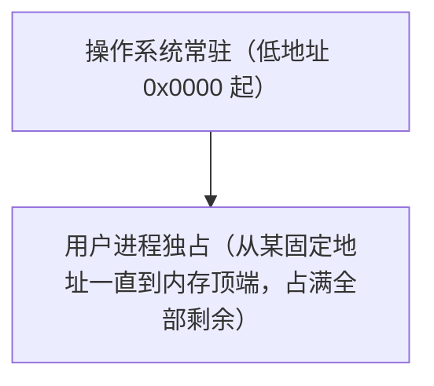
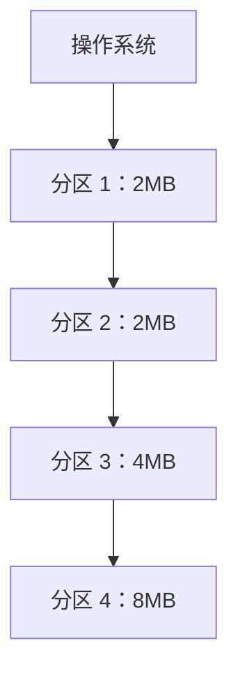
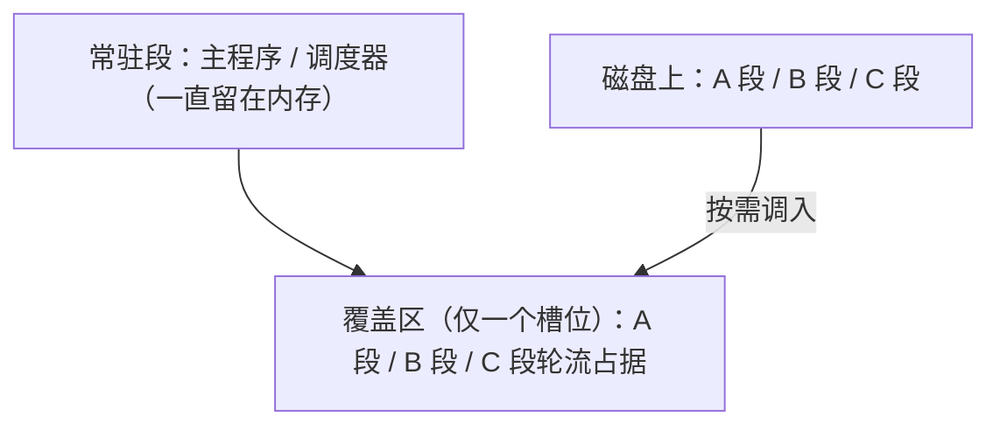
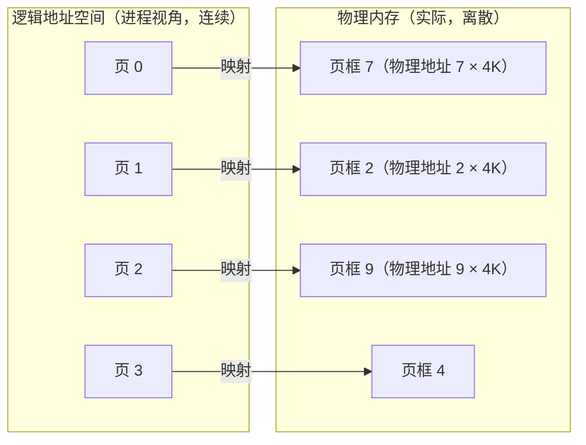
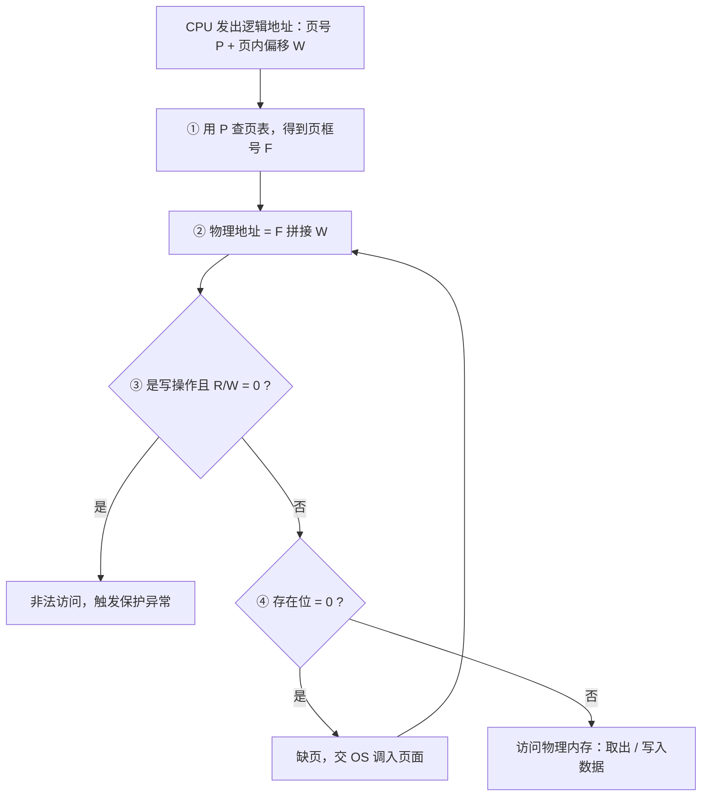
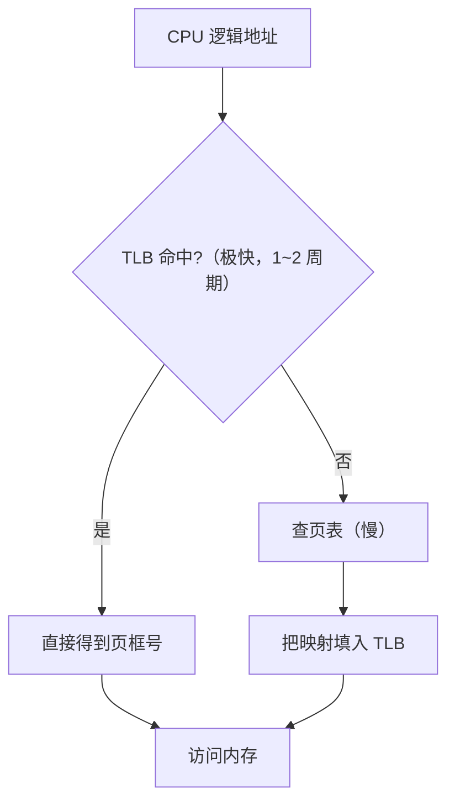
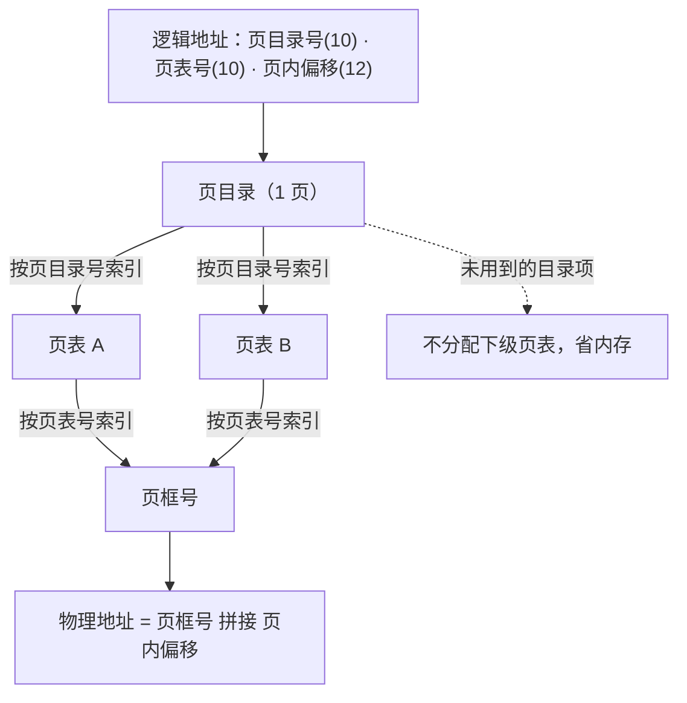
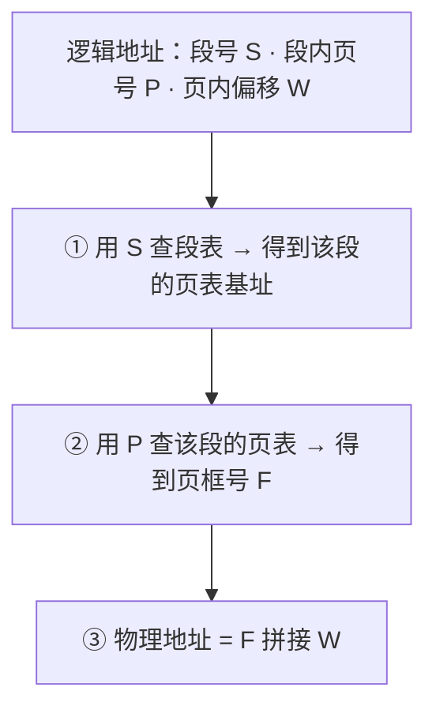
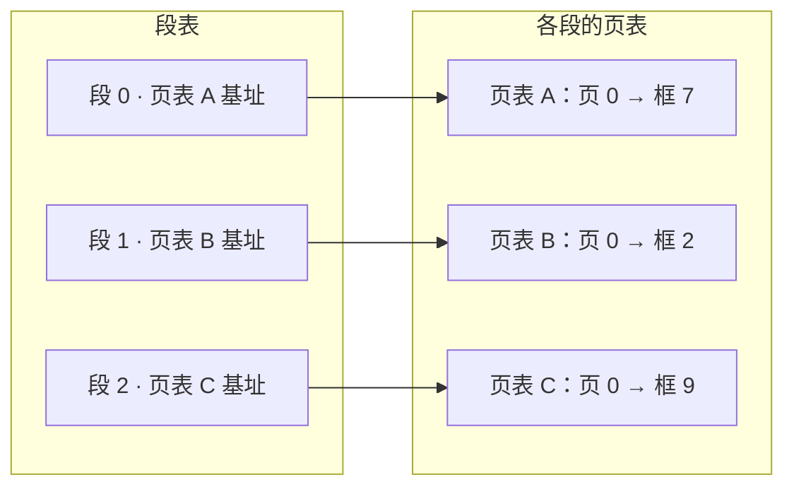

# 05 内存管理基础

> 本篇导读：内存是进程运行的舞台。本篇讲清连续分配、覆盖与交换、分页/分段/段页式，以及快表 TLB 与地址转换，是理解虚拟内存的前置。我们会从"内存管理到底要干什么"出发，先看早期的连续分配如何产生碎片，再看用覆盖与交换怎么"骗"出更多内存；接着进入现代操作系统的核心——分页与分段，把逻辑地址翻译成物理地址；最后补齐内存保护和空闲内存管理这两块地基，让你既有全局视角，也能落到一个个具体的数据结构。

## 一、内存管理做什么

为什么需要专门的内存管理？根本原因是：**内存很小、很贵、还要被很多进程同时抢着用**。早期计算机一次只跑一个程序，整块内存都是它的；但现代系统里，几十上百个进程并发，操作系统必须替它们把这块有限的物理内存分好、护好、还能"变大"。

内存管理的五大职责：

| 职责 | 要解决的问题 | 典型手段 |
| --- | --- | --- |
| **分配（Allocation）** | 进程要内存时，从空闲区里切一块给它 | 分区、页框分配、伙伴系统 |
| **回收（Reclamation）** | 进程退出/释放后，把内存收回来再利用 | 空闲链表、位图标记 |
| **保护（Protection）** | 进程 A 不能偷看或改写进程 B 的内存 | 界地址寄存器、段权限位 |
| **共享（Sharing）** | 多个进程共用同一份只读代码（如 C 库） | 共享页、共享段 |
| **扩充（Expansion）** | 物理内存不够时，让进程"以为"自己有很多 | 交换、虚拟内存、覆盖 |

这五件事贯穿整篇。后文的分区、分页、分段，本质上都是在回答"怎么分配与回收"；保护与共享由地址转换时的硬件检查来保证；扩充则靠交换和后面的虚拟内存实现。

一个容易被忽略的点：**内存管理同时服务"效率"和"安全"**。分得太碎会浪费（碎片），管得太松会越界（崩溃或安全漏洞），平衡靠的是合适的抽象——分页对齐硬件、分段对齐程序员语义。

举个反例体会"没有内存管理会怎样"：设想两个进程直接操作物理地址，进程 A 写到地址 0x1000，进程 B 也恰好用 0x1000，二者就会互相踩内存——一个进程的 bug 直接搞崩另一个，甚至篡改内核。内存管理通过"每个进程只看虚拟地址 + 硬件翻译 + 权限位"这三道防线，把这种混乱彻底收拾干净。这也是为什么现代系统哪怕内存再大，也绝不会回到"裸物理地址"的时代。

## 二、连续分配

连续分配是最朴素的思路：给一个进程的内存必须是**物理上连续的一整块**。它经历过三个发展阶段。

### 2.1 单一连续分配

最原始的单道程序时代，内存一分为二：一块给操作系统（常驻低地址），一块给唯一的用户进程（独占剩余全部）。



优点是实现极简；缺点是**内存利用率极低**——一个只占 1MB 的小程序也会霸占整块用户区，其余空间白白闲置，且一次只能跑一个进程。

### 2.2 固定分区分配

为了支持多道程序，把用户区**预先**切成若干固定大小的分区，每个分区装一个进程。分区大小可以相等，也可以不等（小分区放小程序、大分区放大程序）。



分配时找"够大且空闲"的分区挂上进程。问题在于：**分区大小定死后，超过最大分区的程序跑不了；而小程序放进大分区，多出来的部分用不上**，这部分浪费就是"内部碎片"（后面解释）。

### 2.3 动态分区分配

不预先切，等进程来了再按它实际需要的大小从空闲区里"现场切"一块。这是连续分配里最灵活的一种。

```text
初始空闲: [======== 64MB 整块 ========]

装入 A(20MB):  [ AA ] [==== 44MB 空闲 ====]
装入 B(10MB):  [ AA ] [ BB ] [== 34MB ==]
A 退出释放:    [ 空闲 ] [ BB ] [== 34MB ==]
装入 C(30MB):  [ CCCC ] [ BB ] [= 4MB =]
```

动态分区的关键是**分配算法**，决定从空闲块里挑哪一块：

| 算法 | 挑选规则 | 优点 | 缺点 |
| --- | --- | --- | --- |
| **首次适应（First Fit）** | 从低地址起找第一个够大的块 | 简单、最快找到 | 低地址小碎片越积越多 |
| **最佳适应（Best Fit）** | 挑"刚好比需求大一点"的块 | 节约大块 | 留下大量极小的"外碎片" |
| **最坏适应（Worst Fit）** | 挑最大的块切 | 剩的碎片较大能再用 | 大块被很快切碎 |
| **邻近适应（Next Fit）** | 从上次位置继续找 | 分摊查找开销 | 类似首次，中部易碎 |

### 2.4 内部碎片 vs 外部碎片

这两个概念考试和面试都必考，务必分清：

- **内部碎片（Internal Fragmentation）**：分配给进程的内存**比它实际需要的多**，多出来的部分在分配单元"内部"用不掉。例如固定分区里 3MB 程序放进 4MB 分区，那 1MB 就是内部碎片。分页里页内偏移的零头同理。
- **外部碎片（External Fragmentation）**：内存总量够，但**散落成很多不连续的小空闲块**，拼不到一起给一个新进程用。动态分区跑久了必然出现：总空闲 40MB，但没有一块连续 ≥20MB。

```text
外部碎片示意（连续空闲但太小，拼不出大块）：
[已用][空闲8K][已用][空闲16K][已用][空闲8K][已用]
            ↑ 三者加起来 32K，但物理不连续，装不下 20K 的进程
```

连续分配最大的死穴就是**外部碎片**：即使空闲总量充足，进程仍可能因"不连续"而分配失败。压缩（碎片整理，把已用块挪到一起）能缓解但开销大、且不能移动正在用的内存。于是人们引入了"非连续分配"——分页，从根上消灭外部碎片。

### 2.5 紧凑（Compaction）：把碎片拼起来

针对外部碎片，一个直接的补救手段是**紧凑（Compaction）**：把内存里所有"已用块"向一端挪动，把零散空闲挤成一块大的连续空间。

```text
紧凑前（碎片散落）：
[已用A][空闲8K][已用B][空闲16K][已用C][空闲8K]

紧凑后（全部靠左，尾部合并出大空闲）：
[已用A][已用B][已用C][=====32K 连续空闲=====]
```

紧凑的代价很明显：

- **移动代价高**：要改写每个被移动进程的每一个地址（重定位），相当于暂停业务做"大搬家"。
- **不能移动正在用的内存**：运行中的进程地址在变，移动时要冻结并修正所有指针，极易出错。
- 因此紧凑只在外部碎片严重、且系统空闲时才做，是"治标"而非"治本"。真正消灭外部碎片靠的是下节的分页。

补充一个常被问到的点：**内部碎片和外部碎片谁更可怕？** 外部碎片更棘手，因为它让"总量够却分配失败"；内部碎片只是"每个分配单元里浪费一点"，总量仍然可用。连续分配受外部碎片困扰，分页用固定页大小换来"无外部碎片、只剩可控的内部碎片"，是工程上更优的取舍。

## 三、覆盖与交换

在虚拟内存普及之前，工程师用两种"软件技巧"来让小内存跑更大的程序，思路都是：**把暂时用不到的东西先挪走**。

### 3.1 覆盖技术（Overlay）

覆盖由**程序员手动**划分程序的段：把互相不同时执行的模块分成"覆盖段"，常驻段留在内存，覆盖段按需从磁盘调入，覆盖掉暂时不用的另一段。



典型场景：一个编辑器，编辑模块和打印模块不会同时用，就让它们共用同一个覆盖槽。覆盖的代价是**程序员必须自己搞清楚模块间的调用时序**，极其繁琐，且只能在一个进程内部"腾挪"，无法跨进程。

### 3.2 交换技术（Swapping）

交换由**操作系统**完成，粒度是"整个进程"：把暂时不运行的进程**整个换出（swap out）**到磁盘的交换区，腾出物理内存给更需要的进程；等它要运行时再**换入（swap in）**。

```text
时间线：
T1: 内存有 P1 P2 P3，内存快满了
T2: 调度器选中 P3 换出到磁盘 → 内存空出 P3 那块
T3: P4 进来占用刚空出的空间
T4: P3 又被调度，从磁盘换入（可能换到另一块内存）
```

交换的要点：

- 换出的是**整个进程的映像**（代码+数据+堆栈），不是单页，所以粒度粗、开销大。
- 换入时**不要求回到原来的物理地址**（进程看到的是逻辑地址，由重定位保证正确），这点比覆盖自由。
- 交换区一般在磁盘上单独划分（swap partition / swap file），速度远慢于内存，所以交换是"救急"而非"常态"。

覆盖与交换的区别一句话：**覆盖是"进程内模块级"、程序员管；交换是"进程级"、操作系统管**。它们是虚拟内存出现前的权宜之计，理解它们有助于体会虚拟内存"按页换入换出"的精巧。

### 3.3 覆盖与交换对比小结

| 维度 | 覆盖（Overlay） | 交换（Swapping） |
| --- | --- | --- |
| 管理主体 | 程序员（手动划分段） | 操作系统（自动） |
| 粒度 | 进程内的模块/段 | 整个进程映像 |
| 是否跨进程 | 否 | 是（腾出内存给别人） |
| 对程序员要求 | 高（要懂调用时序） | 无（透明） |
| 换入位置 | 固定覆盖槽 | 可换到任意空闲区 |
| 现代地位 | 已基本淘汰 | 演进为虚拟内存的"换页" |

一个直观例子体会"交换如何腾地方"：内存共 100MB，已有进程 P1(40MB)、P2(30MB)，剩 30MB；此时 P3 要 50MB 起不来。调度器把 P2 整个换出到磁盘（释放 30MB），加上原有 30MB 空闲凑成 60MB，P3 得以运行；等 P2 又被调度时再从磁盘换回（可能换到别的物理位置，靠重定位保证正确）。这就是交换"以时间换空间"的朴素思想，虚拟内存把粒度细化到"页"后，才真正好用。

## 四、分页存储

分页（Paging）是现代 OS 内存管理的基石，它把"连续"这件事彻底抛弃，改用语义更简单、硬件友好的**页（page）**。

### 4.1 页与页框

- **页（Page）**：把进程的**逻辑地址空间**按固定大小（如 4KB）切成一片片，叫页。页内连续，页间无所谓。
- **页框（Page Frame）**：把**物理内存**也按同样大小切成一片片，叫页框（或物理块）。
- 进程的第 i 个页，可以装进内存任意空闲的第 j 个页框——**物理上不要求连续**。



因为页和页框大小相等，**页内偏移在逻辑和物理里完全一样**，只有"页号→页框号"需要转换。这从根本上消灭了外部碎片（任何空闲页框都能用），只剩页内零头的内部碎片（平均半页）。

### 4.2 逻辑地址的结构

分页下，CPU 给出的逻辑地址被硬件拆成两段：

```text
逻辑地址（32 位示例，页大小 4KB = 2^12）：
┌───────────────────────┬─────────────────────────┐
│   页号 P  （高 20 位）   │  页内偏移 W（低12位）│
└───────────────────────┴─────────────────────────┘
      用来查页表              直接作为物理偏移
```

物理地址 = 页框号 × 页大小 + 页内偏移 W。因为页大小是 2 的幂，乘除法变成简单的位拼接：把"页框号"放在高位、"偏移"放在低位即可。

### 4.3 页表

**页表（Page Table）**是记录"页号 → 页框号"映射的表，每个进程一张，由操作系统建立、硬件（MMU）查询。

```text
页表（某进程）示例，页大小 4KB：

| 页号 | 页框号 | 存在位 | 权限 | 说明 |
| --- | --- | --- | --- | --- |
| 0 | 7 | 1 | R/W | |
| 1 | 2 | 1 | R/W | |
| 2 | 9 | 1 | R/O | |
| 3 | 4 | 1 | R/W | |
| 4 | — | 0 | — | 存在位 0：尚未调入内存 |
```

页表项（PTE）除了页框号，还带若干**控制位**，后面虚拟内存会大用：

- **存在位（Present / Valid）**：该页是否在物理内存中。
- **读/写位（R/W）**：是否允许写，实现只读保护。
- **用户/内核位（U/S）**：用户态能否访问，隔离内核。
- **访问位（Accessed）**、**修改位（Dirty）**：给置换算法和写回策略用。

### 4.4 地址转换过程

一次访存，MMU 要干这些事：



问题来了：每次访存都要先查页表（一次额外的内存访问），速度减半。解决之道是**快表 TLB**。

### 4.5 快表 TLB

TLB（Translation Lookaside Buffer）是 MMU 里的一块**高速缓存**，专门缓存最近用过的"页号→页框号"映射。查地址时先问 TLB：



TLB 命中率通常在 99% 以上，所以平均访问时间几乎等于一次内存访问。TLB 是**硬件全相联/组相联缓存**，容量很小（几十到几百项），由硬件在页表更新时同步失效（OS 改页表后要发 `TLB flush` 指令）。

### 4.6 多级页表

页表本身也要占内存。32 位、4KB 页时，页号 20 位 → 最多 2^20 个页表项，每项 4 字节 → **一级页表就要 4MB**，且进程往往只用地址空间的一小角，绝大多数页表项是空的却仍要占地方。

多级页表（如 x86 的二级页表、64 位的四级页表）用**树形结构**按需展开：顶层只指向下级目录，哪一段地址空间真用了，才分配对应的下一级页表。



多级页表让"稀疏的大地址空间"不必为真空区域买单，是支持 64 位海量虚拟地址的关键。代价是地址转换可能要多级查表（同样靠 TLB 兜底命中）。

### 4.7 一个地址转换的数值例子

光看结构不够直观，算一遍最清楚。假设：页大小 4KB（2^12），物理内存 32 位（页框号 20 位），某进程页表如下：

| 页号 | 页框号（存在位均为 1） |
| --- | --- |
| 0 | 5 |
| 1 | 9 |
| 2 | 2 |
| 3 | 11 |

进程要访问**逻辑地址 0x00002C14**（十六进制）。先转二进制看结构：

```text
逻辑地址 0x2C14 = 0000 0010 1100 0001 0100 (二进制, 共32位取低段说明)
页大小 4KB = 2^12，故低 12 位是页内偏移：
  偏移 W = 0xC14 = 3092
  页号 P = 0x2 = 2

查页表：页号 2 → 页框号 2
物理地址 = 页框号 × 页大小 + 偏移
         = 2 × 4096 + 3092
         = 8192 + 3092 = 11284 = 0x2C14
```

注意一个有趣的现象：本例里页框号恰好等于页号，物理地址"数值上"等于逻辑地址，但这是巧合——如果页号 2 映射到页框号 9，物理地址就变成 `9×4096+3092 = 39956`。**关键不在数值，在于"页号被翻译成了页框号"这一步，进程对此完全无感知**。

再把 TLB 加进来算"平均访问时间"。设内存访问 100ns，TLB 命中率 99%，TLB 查询 1ns：

```text
TLB 命中: 1ns(查TLB) + 100ns(访存) = 101ns
TLB 未命中: 1ns + 100ns(查页表) + 100ns(访存) = 201ns
平均 = 0.99×101 + 0.01×201 = 99.99 + 2.01 ≈ 102ns
```

对比"没有 TLB、每次都查页表"的 200ns，TLB 把有效访问时间几乎拉回到单次访存水平——这就是 TLB 不可或缺的原因。

### 4.8 反置页表（Inverted Page Table）

前面说的页表是"**每进程一张、按页号索引**"，页表项数是进程页数。但还有另一种思路——**反置页表**：系统**只维护一张**表，按"物理页框号"索引，每一项记录"这个页框当前被哪个进程的哪个页占用"。

```text
普通页表:  进程视角  页号 → 页框号   （进程数×页数 项，占内存多）
反置页表:  物理视角  页框号 → (进程ID, 页号)  （仅 物理页数 项，省内存）
```

反置页表的优势是**页表总大小只和物理内存挂钩，与进程数、虚拟空间无关**——64 位大地址空间下尤其划算。代价是"按页号查页框"变成了"在反置表里搜 (进程ID,页号)"，需要哈希加速，且共享内存、写时复制的实现不如普通页表直观。PowerPC、IA-64 等架构采用过这种方案，是"页表也可以反过来组织"的有益对照。

## 五、分段存储

分段（Segmentation）换了一种视角：程序员眼里的程序本就是按**语义**分块的——代码段、数据段、堆、栈、共享库。分段按"段"来管理，每段是一维连续的地址空间，但段长可变。

### 5.1 段与段表

- **段（Segment）**：一个逻辑单元，如代码段、数据段，有自己的名字和长度。
- **二维逻辑地址**：`[段号 S | 段内偏移 W]`，区别于分页的一维页号。

段表记录每个段的**基址（在物理内存的起点）**和**界限（段长）**：

段表（某进程）示例：

| 段号 | 基址（物理起点） | 段长 | 权限 |
| --- | --- | --- | --- |
| 0 代码 | 0x100000 | 8KB | R/X |
| 1 数据 | 0x200000 | 4KB | R/W |
| 2 栈 | 0x300000 | 2KB | R/W |
| 3 堆 | 0x400000 | 16KB | R/W |

物理地址 = 基址 + 段内偏移（需先检查 偏移 < 段长）

### 5.2 分段 vs 分页：为什么分段"好用"

| 维度 | 分页 | 分段 |
| --- | --- | --- |
| 划分依据 | 物理均匀切块，与逻辑无关 | 按程序语义（代码/数据/栈） |
| 地址空间 | 一维（页号+偏移） | 二维（段号+段内偏移） |
| 碎片 | 只有内部碎片 | 有外部碎片（段长不一） |
| 共享/保护 | 按页，粒度死板 | **天然方便**：整个段设只读共享 |
| 程序员 | 无感知（透明） | 可见（早期语言里 `segment` 概念） |

分段最擅长的是**保护与共享**：比如把"数学库代码段"标成只读、共享给所有进程；把"数据段"标成私有。分页做共享要按页对齐、且难表达"这一整块逻辑是共享的"。

分段的硬伤是**外部碎片**：段长不固定，分配回收后内存会碎成不连续小块，需要紧凑（compaction）来整理，开销大。

### 5.3 分段地址转换数值例子

段式是二维地址，转换时要先做"越界检查"再做"基址相加"。假设段表：

```text
段表：
段号0(代码): 基址=0x10000, 段长=0x2000(8KB), 权限=R/X
段号1(数据): 基址=0x20000, 段长=0x1000(4KB), 权限=R/W
```

进程访问逻辑地址 `[段号=1, 段内偏移=0x0800]`：

```text
① 查段表：段1 基址=0x20000，段长=0x1000
② 越界检查：偏移 0x0800 < 0x1000  ✓ 合法
③ 权限检查：本次是读/写，段1 权限 R/W ✓
④ 物理地址 = 基址 + 偏移 = 0x20000 + 0x0800 = 0x20800
```

若偏移变成 0x1800（≥ 段长 0x1000），硬件直接判越界、触发异常，阻止访问别的段的内存——这正是分段做保护的直观体现。对比分页：分页的"越界"是隐式的（页号超出页表范围才算错，页内偏移天然合法），而分段每次都要显式比较"偏移 < 段长"。

## 六、段页式

既然分页无外部碎片但共享差，分段共享好但有外部碎片，能不能结合？**段页式（Segmentation with Paging）**就是答案：先按段的逻辑划分，再对每个段内部用分页。

### 6.1 地址结构

段页式下逻辑地址变成三维：`[段号 S | 段内页号 P | 页内偏移 W]`。



- 段表项不再存"基址+段长"，而是存"**该段的页表起始地址**"。
- 每个段各自有一张页表，段长由"页表项数"隐式决定。
- 兼具：段级的保护/共享（按段设权限）+ 页级的无外部碎片（段内分页，物理离散）。



代价是转换要多查一级（段表→页表），且结构更复杂。实际应用里，现代系统（如 x86 的 64 位模式）大多**名义上分段、实际扁平化**，真正挑大梁的是分页（配合后面的虚拟内存）；但"段"的概念仍保留，用于权限隔离（如代码段/数据段、内核态/用户态）。

三种非连续/离散方案放在一起对比，避免混淆：

| 方案 | 划分单位 | 地址维度 | 外部碎片 | 共享/保护 | 典型用途 |
| --- | --- | --- | --- | --- | --- |
| **分页** | 固定大小页 | 一维 | 无（仅内部） | 按页，较死板 | 现代 OS 主用 |
| **分段** | 变长段（语义） | 二维 | 有 | 天然方便 | 早期/权限隔离 |
| **段页式** | 段内再分页 | 三维 | 无（段内分页） | 段级+页级 | 理论兼顾两者 |

一句话记忆：**分页管"物理好不好切"，分段管"程序好不好懂"，段页式两者都要**；现实里是"分页打底 + 段做权限壳"。

## 七、内存保护

内存管理必须保证"进程 A 不能越权访问进程 B"，否则一个 bug 或恶意程序就能搞垮整个系统。保护在地址转换的硬件环节完成。

### 7.1 重定位与界地址寄存器

最早的保护手段是**界地址寄存器（界限寄存器 / 基址-限长寄存器）**，配合重定位：

- **重定位（Relocation）**：程序编译时用的"相对地址"，加载时由 OS 加上"基址"变成物理地址，程序本身不知道自己在哪。
- **界地址寄存器**：一对硬件寄存器——**基址寄存器（base）**存本进程内存起点，**限长寄存器（limit）**存长度。每次访存，硬件自动检查：`基址 ≤ 物理地址 < 基址+限长`，越界则抛异常。

```text
基址=1000, 限长=500：
允许访问范围: [1000, 1500)
进程访问地址 1200 → 1000≤1200<1500 ✓
进程访问地址 1600 → 越界 ✗ → 触发保护异常
```

这种方式简单，但只能保护"一整块连续"内存，限制了非连续分配的发展——于是分页/分段把保护信息搬进了**页表项/段表项**的权限位，做到更细粒度。

### 7.2 越界检查与只读保护

在分段里，每次访存检查"段内偏移 < 段长"；在分页里，检查"存在位=1"以及"权限匹配"：

```text
保护检查的几种情况：
① 偏移 ≥ 段长        → 越界异常（分段）
② 存在位 = 0         → 缺页（分页，交 OS）
③ 试图写 R/O 页/段    → 写保护异常
④ 用户态访问内核页    → 特权级异常
```

只读保护很有用：代码段、共享库、只读数据都标成只读，任何意外写入都会立刻被硬件拦截并杀掉违规进程，既防 bug 也防攻击（如阻止改写可执行代码）。

### 7.3 静态重定位 vs 动态重定位

重定位（把逻辑地址改成物理地址）有两种实现时机，理解它有助于区分"为什么早期程序难搬、现代程序随便搬"：

| 类型 | 何时重定位 | 能否在内存中移动 | 说明 |
| --- | --- | --- | --- |
| **静态重定位** | 装入内存时一次性改好 | 不能（地址已写死） | 早期连续分配用，程序搬移需重新装入 |
| **动态重定位** | 每次访存由硬件实时加基址 | 能（只改基址寄存器） | 现代靠 MMU + 页表，进程可任意换入换出 |

动态重定位正是分页/分段能"非连续、可移动"的根本：CPU 发出的是逻辑地址，硬件在地址转换阶段才叠加基址/查页表得到物理地址，进程在内存里挪个位置只要改一下页表映射即可，对程序透明。交换（第三篇）能把进程换到别的物理位置再换回，靠的就是动态重定位。

## 八、空闲内存管理

不论连续分配还是分页，操作系统都要记录"哪些内存空闲、哪些已用"。三类主流方法：

### 8.1 位图（Bitmap）

把内存按分配单元（如 1KB 或一页）编号，用一位表示"空闲(0)/占用(1)"。

```text
内存单元:  [0][1][2][3][4][5][6][7]
位图 bits:  1  0  0  1  1  0  1  0
含义:       占 空 空 占 占 空 占 空
```

- 优点：固定开销、易找连续块（扫描一段 0 比特）。
- 缺点：要分配 n 个连续单元时，得线性扫描找 n 个连续的 0，大内存下慢。

### 8.2 空闲链表（Linked List）

把连续空闲区串成链表，每个节点记"起始地址+长度+下一个指针"。分配时遍历链表找够大的块（可切分），回收时合并相邻空闲块。

```text
空闲链表:
[起始0x1000,长2K] -> [起始0x3000,长4K] -> [起始0x9000,长1K] -> NULL
```

变体**隐式空闲链表**把"头部"藏在空闲块自身里，零额外结构开销，但合并（coalescing）需要技巧（边界标记法）。这是 `malloc` 底层常用的思路。

### 8.3 伙伴系统（Buddy System）

伙伴系统是很多内核（如 Linux 早期页框分配器、现在的伙伴+slab 组合）采用的折中方案，核心思想：**按 2 的幂大小管理空闲块**。

规则：

1. 内存总大小是 2 的幂（如 1MB）。
2. 请求大小向上取整到最近的 2^k。
3. 若现有块太大（2^(k+1)），就**对半劈成两个"伙伴"**，递归直到刚好 2^k。
4. 释放时，若"伙伴"也空闲，则**合并**回更大的块。

```text
分配 16KB（总 64KB）：
64KB ──劈──> 32KB ──劈──> 16KB(给) + 16KB(伙伴空闲)
                                      ^
分配另一个16KB时直接复用那个伙伴，无需再劈。
释放后两伙伴都空 → 合并回 32KB → 再合并回 64KB。
```

伙伴系统的优缺点：

| 维度 | 说明 |
| --- | --- |
| **优点** | 合并极快（伙伴地址可算出），无外部碎片积累，分配/回收 O(log n) |
| **缺点** | 块大小是 2 的幂，仍有**内部碎片**（如 17KB 要分 32KB，浪费 15KB） |
| **应用** | Linux 页分配器 `buddy` 管物理页；上层再用 `slab` 切更小对象 |

伙伴系统解决了"连续大块"的分配效率，又避免了链表合并难的痛点，是连续与离散之间很好的工程平衡。

### 8.4 slab 分配器：页再切成小对象

伙伴系统管的是"以页为单位"的分配，但内核里大量要的是**几十到几百字节的小对象**（如 task_struct、inode）。若每次都向伙伴系统要一整页，内部碎片会非常严重。于是内核在伙伴系统之上叠了一层 **slab 分配器**：

```text
伙伴系统(管页)
   │ 批发整页
   ▼
slab 层(把一页切成 N 个同尺寸对象)
   ├─ 空闲对象链表（随时取用）
   └─ 已用对象
   例：一页 4KB 切成 64 个 64 字节的对象，专供某类内核结构
```

slab 的好处：

- **零内部碎片**：对象尺寸固定，页被精确切分。
- **缓存热点**：常用对象（如已释放的）留在 slab 的"部分满"队列里，下次分配免初始化，快。
- **色彩（coloring）**：错开对象在页内的起始偏移，让不同 slab 的同尺寸对象映射到不同缓存行，减少 CPU cache 冲突。

Linux 现代内存分配层次可概括为：用户态 `malloc` → 内核 `slab` → 伙伴系统 → 物理页。这套组合既解决了"大块连续"也解决了"小块高效"，是工程上把几种空闲管理思想叠加使用的范例。

### 8.5 空闲管理怎么选：一张决策表

不同场景适合不同方法，没有"银弹"：

| 场景 | 推荐方法 | 理由 |
| --- | --- | --- |
| 连续分配、块大小不均 | 空闲链表 / 首次适应 | 实现简单，历史方案 |
| 连续大块、怕外部碎片 | 伙伴系统 | 合并快、无碎片积累 |
| 内核小块对象 | slab（在伙伴之上） | 零内部碎片、热点缓存 |
| 大内存、稀疏分配 | 位图 / 多级结构 | 易找连续、开销可控 |
| 用户态通用分配 | 隐式空闲链表（malloc） | 零额外结构、合并灵活 |

一句话：**连续分配用链表/伙伴，离散分页用页表+伙伴，小块用 slab，用户态用 malloc 那套隐式链表**——它们不是互相替代，而是分层共存。

顺带一提，理解空闲管理还有助于读懂"内存泄漏"：用户态 `malloc` 后没 `free`，对应的 slab/页框就一直被标记为已用、无法回收，累积到常驻集只增不减——这正是为什么长期运行的服务要警惕内存泄漏，根子就在这个"分配出去收不回来"的链路里。

## 本篇小结

- 内存管理五大职责：**分配、回收、保护、共享、扩充**，缺一不可。
- **连续分配**简单但有外部碎片；动态分区用首次/最佳/最坏适应等算法切空闲区。
- **内部碎片**是"分配单元内用不掉"，**外部碎片**是"总量够但不连续拼不出"，两者成因不同。
- **覆盖**是进程内模块级、程序员手动；**交换**是进程级、OS 自动换入换出到磁盘。
- **分页**把逻辑/物理都按固定页切，物理离散，从根上消灭外部碎片（只剩页内内部碎片）。
- 逻辑地址 = **页号 + 页内偏移**；页表记录页号→页框号映射，由 MMU 硬件查询。
- **TLB 快表**缓存近期映射，命中率极高，把"每次查页表"的开销几乎抹平。
- **多级页表**按需展开，让稀疏的大地址空间不必为空区域买单，是 64 位的基础。
- **分段**按语义划分、共享/保护好，但有外部碎片；**段页式**先分段再分页，兼得两者之长。
- 空闲内存管理三法：**位图、空闲链表、伙伴系统**；伙伴系统靠 2 的幂块+伙伴合并平衡效率。

## 参考链接

- [OSTEP 第 13~15 章：地址空间与分页（Paging）](https://pages.cs.wisc.edu/~remzi/Classes/537/Spring2018/Book/copy/ostep-vm-paging.pdf)
- [Wikipedia: Paging (computer memory)](https://en.wikipedia.org/wiki/Paging)
- [Wikipedia: Memory segmentation](https://en.wikipedia.org/wiki/Memory_segmentation)
- [Wikipedia: Buddy memory allocation](https://en.wikipedia.org/wiki/Buddy_memory_allocation)
- [Wikipedia: Translation lookaside buffer](https://en.wikipedia.org/wiki/Translation_lookaside_buffer)
- [Wikipedia: Virtual memory](https://en.wikipedia.org/wiki/Virtual_memory)
- [GeeksforGeeks: Difference between Paging and Segmentation](https://www.geeksforgeeks.org/difference-between-paging-and-segmentation/)

下一篇 → [06 虚拟内存与页面置换](/cs/os/vm)
