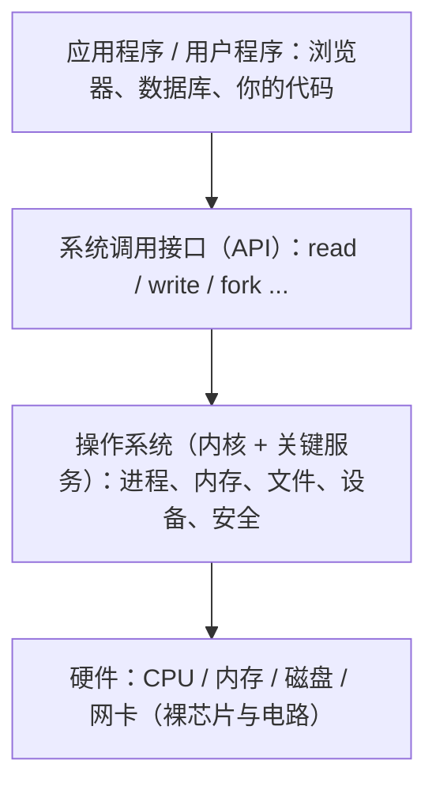
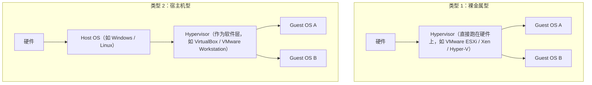

# 01 操作系统概述与体系结构

> 本篇导读：操作系统是硬件与程序之间的"大管家"。本篇建立对 OS 的整体认知：它管什么、怎么管（内核态/用户态、中断、系统调用），以及宏内核与微内核的取舍。读完你应该能回答三个问题——操作系统到底处在什么位置、它是怎么从用户程序"接管"硬件的、为什么今天的系统大多选择宏内核又都在往混合方向走。

## 一、什么是操作系统

操作系统（Operating System，简称 OS）是管理计算机硬件与软件资源的系统软件，也是用户、应用程序与硬件之间那层必不可少的"中间人"。没有它，你写的程序根本没法直接操作 CPU、内存、磁盘和网络。

可以从两个视角理解它：

- **作为"资源管理者"**：一台机器上的 CPU、内存、磁盘、网卡是有限的，但跑在上面的程序往往有成百上千个。OS 负责把这些资源公平、高效地分配给各个程序，并在它们结束时回收，避免互相踩踏。
- **作为"接口提供者"**：OS 把复杂的硬件操作（读盘、发网络包、切进程）封装成简单、统一的接口（系统调用、库函数），让开发者不必关心硬盘是机械的还是固态的、网卡是哪家芯片。

它在整个计算机体系里的位置：



一句话概括：**硬件是身体，操作系统是大脑和神经系统，应用程序是借由它运作的思想**。把"大脑"和"身体"解耦，正是计算机能同时跑无数种软件的根本原因。

### 1.4 操作系统的分类

按"服务目标"可把 OS 粗分为几类，便于理解它为什么长这样：

| 类型 | 目标 | 代表 |
| --- | --- | --- |
| **批处理 OS** | 吞吐优先，攒一批作业自动跑 | 早期 IBM OS/360 |
| **分时 OS** | 交互优先，多用户轮转 | UNIX、Linux 终端 |
| **实时 OS（RTOS）** | 截止时间优先，准时不差分 | VxWorks、QNX、RT-Thread |
| **分布式 OS** | 把多台机器当一台用 | 各种集群/云调度层 |
| **嵌入式 OS** | 资源极小、确定性强 | FreeRTOS、Zephyr |

注意分类之间并不互斥：今天的 Linux 既能当分时系统给人用，也能靠 `PREEMPT_RT` 补丁逼近实时，还能做嵌入式。分类只是强调"设计重心不同"。

## 二、操作系统的主要功能

OS 的核心职责可以拆成五大块，每一块都对应一类"它替你管着、你一般不用操心"的资源。

### 2.1 处理机与进程管理

处理机（CPU）是计算机里最宝贵的资源。管理它的本质是回答三件事：

- **谁先用**：决定哪个进程、哪个线程此刻占用 CPU，这就是调度（本专栏后续会专门讲）。
- **怎么切换**：一个进程时间到了或被更高优先级打断，OS 要保存现场、装入另一个进程的现场，这就是上下文切换。
- **怎么协同**：进程之间要通信（管道、共享内存、信号）、要同步（锁、信号量），OS 提供原语支撑。

### 2.2 内存管理

内存管理解决"这么多程序都要用内存，地址不够、还怕互相越界"的问题，关键手段有：

| 手段 | 作用 |
| --- | --- |
| **地址空间隔离** | 每个进程有独立的虚拟地址空间，A 进程写坏内存不会拖垮 B 进程 |
| **虚拟内存** | 用磁盘（交换区）扩充"看起来"的内存，进程可用地址远超物理内存 |
| **分页与分段** | 把内存切成固定/可变大小的块，配合页表做虚实地址映射 |
| **分配与回收** | 进程申请堆内存（`malloc`）、退出后 OS 回收，避免泄漏与碎片 |

### 2.3 文件管理

文件系统把"一堆 0 和 1 的磁盘扇区"组织成人类能理解的目录树与文件，并提供：

- 统一的"打开/读/写/关闭"抽象，屏蔽底层是 ext4、NTFS 还是网络存储的差异；
- 权限与归属（谁可读、可写、可执行）；
- 目录结构、硬链接/软链接等组织方式。

### 2.4 设备管理

键盘、鼠标、显示器、打印机、网卡这些 I/O 设备五花八门，OS 通过**设备驱动**把它们统一成"读/写/控制"几类操作，并做缓冲、缓存与中断处理，让应用程序用一套接口就能操作所有设备。

### 2.5 安全与保护

OS 是安全的第一道闸门：

- **隔离**：用户态程序不能直接碰硬件、不能直接读别进程的内存；
- **鉴权**：文件、设备的访问受用户/组权限控制；
- **保护**：特权级（ring）机制确保只有内核能执行危险指令。

五大功能彼此不是孤岛。例如"启动一个进程"（处理机管理）需要分配内存（内存管理），进程要读配置文件（文件管理），还可能要发网络请求（设备管理）。OS 正是把这些功能缝合在一起的总指挥。

## 三、发展历史

操作系统的形态是被"硬件成本"和"人的耐心"一步步逼出来的。下图是一条主线：

```text
手工操作 --> 单道批处理 --> 多道批处理 --> 分时系统 --> 实时系统 --> 现代通用/分布式
  (1940s)     (1950s)       (1960s)      (1970s)     (1970s+)     (1990s+)
```

### 3.1 手工操作与单道批处理

最早没有 OS，程序员背着打孔纸带去机房，自己装卸、自己等结果，CPU 大量时间花在"人操作"上。后来有了**单道批处理**：把一批作业攒起来，由一个监督程序自动依次执行，减少人工干预。但缺点是——**内存里同一时刻只有一个程序**，它要等 I/O 时，CPU 只能干瞪眼。

### 3.2 多道批处理

**多道程序（multiprogramming）**是质变：内存里同时驻留多个程序，A 在等磁盘时，CPU 立刻去跑 B。CPU 利用率因此大幅上升。代价是需要内存隔离、需要调度，OS 复杂度陡增。多道批处理下用户基本"提交作业后走人"，没有交互感。

这里有个关键概念——**多道度（degree of multiprogramming）**：同时驻留内存的程序数量。它并非越大越好：

```text
多道度 低:  内存里 1~2 个程序  -> CPU 仍常因 I/O 空等 (利用率低)
多道度 适中: 内存里 N 个程序   -> 总有就绪的可跑, CPU 几乎不闲 (利用率高)
多道度 过高: 内存被塞满       -> 频繁换页(颠簸 thrashing), 反而变慢
```

当程序太多把内存挤爆，OS 不得不把暂时用不到的页换到磁盘，等到要用又换回来，这种"换入换出停不下来"的恶性循环叫**颠簸（thrashing）**，是调度与内存管理必须联手避免的典型故障。多道批处理的精髓，就是在"多塞几个提高利用率"和"别塞太满引发颠簸"之间找平衡。

### 3.3 分时系统

人们很快不满足于"扔进去等结果"，希望像打电话一样"随时敲、随时回"。**分时系统（time-sharing）**把 CPU 时间切成很短的时间片（如 10~100 毫秒），轮流分给每个联机终端用户，因为切换极快，每人都觉得自己独占机器。UNIX 正是分时思想的经典产物。

分时系统的典型特点：

| 特点 | 说明 |
| --- | --- |
| **交互性** | 用户能实时输入、立即看到反馈 |
| **多用户同时** | 多个终端共享一台主机，各自独立 |
| **独立感** | 时间片轮转极快，用户察觉不到"被轮流" |
| **及时响应** | 响应时间通常是秒级甚至毫秒级 |

### 3.4 实时与现代化

**实时系统**不为"公平"，而为"准时"：工业控制、火箭、医疗监护里，任务必须在截止时间前完成，否则就是事故。它分硬实时（错过即失败）与软实时（偶尔错过可接受）。

进入 1990 年代后，随着 PC 普及、多核、网络与虚拟化兴起，现代 OS 演变为"分时 + 抢占 + 多核调度 + 虚拟化 + 安全隔离"的庞然大物，但底层思想仍是历史里那些原型。

## 四、内核态与用户态

为什么你写的程序不能直接格式化硬盘、不能直接改页表？因为 CPU 引入了**特权级（privilege level）**，最经典的是 x86 的 **ring 0~ring 3**：

| 特权级 | 名称 | 能做的事 |
| --- | --- | --- |
| ring 0 | **内核态（kernel mode）** | 执行所有指令，直接操作硬件、改页表、关中断 |
| ring 1/2 | 保留（部分系统用于驱动） | 较少使用 |
| ring 3 | **用户态（user mode）** | 只能执行"安全"指令，访问受限内存，不能直接碰硬件 |

应用程序默认跑在 ring 3（用户态）；操作系统内核跑在 ring 0（内核态）。

### 4.1 用户态如何陷入内核

用户程序想要做"特权操作"（如读文件），自己没权限，必须**陷入（trap）**内核。常见触发方式：

- **系统调用（syscall）**：程序主动请求，如 `read`/`write`/`fork`；
- **中断（interrupt）**：硬件主动打断，如网卡收到包、时钟到时；
- **异常（exception）**：程序自己犯错，如除零、访问越界内存。

陷入时 CPU 会做几件关键事：保存当前用户态现场 → 切换到 ring 0 → 跳到内核预设的处理入口 → 执行内核代码 → 恢复现场回到 ring 3。

### 4.2 切换代价与为什么区分

每次"用户态 ↔ 内核态"切换都有成本：要保存/恢复寄存器、刷 TLB 与缓存、改页表、做权限检查。所以高频系统调用（如网络服务器每收一个包就陷入一次）是性能热点，这也是后续"内核旁路（如 DPDK）""用户态网络栈"出现的理由。

为什么非得分？核心答案是**保护**：

- 不隔离，一个程序的野指针就能把整个系统的内存、硬件搞崩；
   - 特权级把"危险能力"锁在内核手里，用户程序只能通过内核提供的、经过审查的接口去间接使用硬件，从而保证了多程序共存时的稳定与安全。

### 4.3 陷入指令与切换开销

不同架构"陷入内核"的指令不同，但做的事一致：把 CPU 特权级抬高到 ring 0，并跳到内核预设入口。

| 架构 | 陷入指令 | 说明 |
| --- | --- | --- |
| x86-64 | `syscall` / `sysenter` | 现代快速系统调用指令，比老式 `int 0x80` 软中断快得多 |
| x86（老） | `int 0x80` | 早期用 0x80 号软中断进内核，通用但慢 |
| ARM | `svc` (SuperVisor Call) |  formerly `swi`，触发 SVC 异常进入 EL1（内核态） |
| RISC-V | `ecall` | 环境调用指令，陷入 machine/supervisor 模式 |

切换本身的开销虽只有几十到几百纳秒，但在某些场景会被放大：

- **高频系统调用**：如网络代理每处理一个包都要多次 `read`/`write`，陷入+返回的总成本可能超过实际业务逻辑；
- **上下文跨核**：若下次调度落到别的 CPU 核，连 L1/L2 缓存都要冷一遍，代价更高；
- **页表切换**：系统调用通常**不换页表**（同进程内），所以纯系统调用比进程切换便宜很多，但与"零陷入"的用户态方案相比仍可观。

这也是 `io_uring`（Linux 异步 I/O 框架，提交/收割队列都在用户态与内核共享内存里）这类"减少来回陷入"技术流行的原因：把一大批请求一次性交给内核，少进少出。

## 五、中断与异常

中断与异常是"CPU 被强行打断去处理别的事"的两种来源，是 OS 能够"及时响应外部世界"的基石。

### 5.1 分类

```text
CPU 被打断
   |
   +-- 外部中断 (interrupt, 来自 CPU 之外)
   |     如: 时钟到时 / 网卡来包 / 键盘敲击 / 磁盘读完
   |
   +-- 内部异常 (exception, 来自 CPU 执行指令时)
         如: 除零 / 缺页 / 越权访问 / 非法指令
```

- **外部中断**：异步、与当前指令无关，由硬件通过中断控制器（如 APIC）发给 CPU。它是"事件驱动"的核心——没有中断，CPU 只能不停轮询"磁盘好了没"，浪费惊人。
- **内部异常**：同步、由正在执行的指令直接引发，CPU 必须现场处理（如缺页要加载页面，除零要杀进程）。

### 5.2 中断向量表

CPU 收到一个中断号（如 32 号是时钟、14 号是缺页），就拿着这个号去查一张表——**中断向量表（Interrupt Vector Table / IDT）**，表里存着每个号对应的处理函数入口。流程如下：

```text
硬件发中断(号N) --> CPU 暂停当前指令 --> 查 IDT[N] 得处理入口
   --> 保存现场 --> 执行对应 handler --> 恢复现场 --> 回到被中断处
```

### 5.3 时钟中断的作用

在所有中断里，**时钟中断（timer interrupt）**最不起眼也最关键。它定期（如每 1 毫秒或 10 毫秒）把 CPU 从任何进程手里"抢"回来交给内核，内核借此实现：

- **时间片轮转调度**：到点就换进程，保证没人能一直霸占 CPU；
- **统计与超时**：计算进程用了多少 CPU、超时的 `sleep` 何时唤醒；
- **多任务假象**：正是它让单核也能"同时"跑很多程序。

没有时钟中断，抢占式多任务几乎无从实现。

## 六、系统调用

系统调用（system call）是用户程序**主动**向内核请求服务的唯一正规入口，是用户态触碰硬件的"安检通道"。

### 6.1 与库函数、API 的区别

三者常被混用，但层次不同：

| 概念 | 位置 | 说明 |
| --- | --- | --- |
| **系统调用** | 内核边界 | 真正陷入内核的那一次调用，数量有限（如 Linux 几百个），由 OS 定义 |
| **库函数（libc）** | 用户态 | 对系统调用的封装，如 C 的 `printf` 底层是 `write` 系统调用 |
| **API** | 应用层 | 更上层的接口约定，如 POSIX、Windows API，可能由多个库函数组合而成 |

一句话：**系统调用是"内核那一侧的门铃"，库函数是"门铃外面的好看按钮"，API 是"按钮的使用说明书"**。

### 6.2 以 read 为例看"用户态 → 内核态 → 返回"

以 C 程序读取文件为例，完整链路如下：

```c
#include <fcntl.h>
#include <unistd.h>

int main(void) {
    int fd = open("data.txt", O_RDONLY);   // 系统调用: 打开文件
    char buf[128];
    /* read 触发 用户态 -> 内核态 的陷入 */
    ssize_t n = read(fd, buf, sizeof(buf)); // 系统调用: 读数据
    close(fd);                              // 系统调用: 关闭
    return 0;
}
```

`read` 执行时的内部流转：

```text
[用户态] 调用 read(buf, 128)
   |  1. 把参数( fd, 缓冲地址, 长度 )放入寄存器/栈
   |  2. 执行一条特殊指令(如 x86 的 syscall / int 0x80) 陷入内核
   v
[内核态] 3. CPU 切到 ring0, 跳到内核 read 处理入口
        4. 内核校验参数合法性(地址是否属于该进程, 长度合理)
        5. 查文件描述符表 -> 找到对应文件对象
        6. 检查页缓存: 命中则直接拷贝到用户 buf; 未命中则触发磁盘 I/O 把数据读入页缓存再拷贝
        7. 把读到的字节数写入返回值
   |  8. 执行返回指令, 切回 ring3, 恢复用户现场
   v
[用户态] read 返回, 程序拿到数据继续往下走
```

要点：**用户态代码全程碰不到磁盘**，它只负责"提需求"，真正读写由内核在特权级下完成，再经一次内存拷贝把结果送回用户的缓冲区。这也是为什么频繁的小 `read` 会有拷贝与陷入开销，于是有了 `readv`、零拷贝（`splice`/`mmap`）等优化。

### 6.3 参数怎么传给内核

用户态调用 `read(fd, buf, 128)` 时，三个参数怎么"越过"用户态/内核态这道墙送进内核？常见三种方式：

| 方式 | 做法 | 评价 |
| --- | --- | --- |
| **寄存器传参** | 把参数塞进通用寄存器（如 `rdi`/`rsi`/`rdx`） | 最快，但寄存器数量有限，参数多时不够用 |
| **内存块传参** | 在用户态拼一个结构体，把地址传给内核，内核再 safe-copy 进来 | 参数多时常用（如 Linux 的 `struct` 传参） |
| **栈传参** | 把参数压栈后把栈指针给内核 | 较少用，需额外拷贝 |

无论哪种，内核拿到参数后**第一步永远是校验**：指针是否落在调用进程自己的地址空间内、长度是否合理、缓冲区是否可写。若用户恶意传一个内核地址，校验会直接拒绝，防止"借系统调用读写内核内存"的越权。校验通过后，结果返回时通常也带一个 `errno`（出错码）供库函数转成 `-1` 返回值。

### 6.4 常见系统调用分类

Linux 的系统调用按功能大致分组，下面列出最常用的一批（帮助建立"内核到底提供了哪些门铃"的印象）：

| 类别 | 代表系统调用 | 作用 |
| --- | --- | --- |
| 进程 | `fork` / `execve` / `exit` / `wait4` | 创建、执行、退出、等待子进程 |
| 文件 | `open` / `read` / `write` / `close` / `stat` | 文件打开读写与元信息 |
| 内存 | `mmap` / `brk` / `mprotect` | 映射/扩展堆/改页保护 |
| 通信 | `pipe` / `socket` / `connect` / `sendto` | 管道与网络 |
| 信号 | `kill` / `sigaction` / `signal` | 进程间异步通知 |
| 时间 | `nanosleep` / `clock_gettime` | 睡眠与取时间 |
| 杂项 | `getpid` / `getuid` / `uname` | 查询自身/系统信息 |

注意每个系统调用在内核里都有**固定编号**（如 Linux x86-64 上 `read` 是 0、`write` 是 1、`fork` 是 57），用户态陷入时把编号放进约定寄存器，内核据此查"系统调用表"找到对应处理函数。新增系统调用要改这张表，因此内核演进非常谨慎，宁可用 `ioctl`/`prctl` 这类"多路复用"接口，也不轻易加号。

## 七、体系结构

OS 内核"把功能怎么摆布"的宏观设计，决定了它的性能、安全与可维护性。主流分三类。

### 7.1 宏内核（Monolithic Kernel）

宏内核把进程管理、内存、文件、设备驱动等**全部塞进内核态一个大程序**里。传统 UNIX、Linux 都是典型代表（Linux 虽支持可加载模块，整体仍是宏内核思路）。

- 优点：模块间直接函数调用，**性能高**、通信开销小；
- 缺点：代码量大、一个驱动写崩可能拖垮整个内核；安全性与隔离性偏弱。

### 7.2 微内核（Microkernel）

微内核**只保留最必需的功能在内核态**（如最基础的进程间通信 IPC、底层中断、地址空间管理），其余（文件系统、网络设备栈、驱动）都作为**用户态服务进程**存在。

- 优点：**隔离好**，某个驱动崩溃只是用户态进程挂掉，内核不受影响；更容易形式化验证、适合高安全/嵌入式场景；
- 缺点：功能间靠 IPC 跨进程通信，**频繁上下文切换带来性能损耗**。

经典代表：Mach（早期）、QNX、seL4、Minix。

### 7.3 混合内核（Hybrid Kernel）

现实往往是折中：**把性能敏感的部分（如文件、网络）留在内核态，把可隔离的部分外移**。Windows NT 与 macOS（XNU，基于 Mach + BSD 层）都属于这一类，既想拿微内核的模块化，又不想丢宏内核的速度。

### 7.4 各主流系统的归属与对比

| 系统 | 内核类型 | 说明 |
| --- | --- | --- |
| **Linux** | 宏内核 | 全功能在内核态，通过可加载模块扩展；性能强、生态广 |
| **Windows (NT)** | 混合内核 | 内核精简 + 大量功能在"执行体"层，兼顾性能与模块化 |
| **macOS / iOS (XNU)** | 混合内核 | Mach 微内核骨架 + BSD 层，兼具 IPC 能力与 POSIX 兼容 |
| **QNX / seL4** | 微内核 | 极致隔离、可验证，常用于汽车、工控、航天 |

三类取舍一句话总结：

```text
性能:   宏内核  >  混合内核  >  微内核
隔离:   微内核  >  混合内核  >  宏内核
生态成熟度: 宏内核(尤其Linux) 当前最广泛
```

所以今天工业界的主流选择是**宏内核（Linux 几乎垄断服务器与移动端）**与**混合内核（Windows、macOS 桌面）**，纯微内核更多固守在对安全可靠要求极高的细分领域。

### 7.5 其他内核形态与趋势

三类之外，还有几种值得知道的形态：

| 形态 | 思路 | 代表 |
| --- | --- | --- |
| **外核（Exokernel）** | 内核只负责"安全复用硬件"，把资源管理策略完全交给用户态库（libOS） | MIT Exokernel 研究项目 |
| **单内核模块（Unikernel）** | 把应用和极简内核编进同一个镜像，无独立 OS 层，启动极快、攻击面极小 | MirageOS（OCaml）、Rumprun |
| **多内核（Multikernel）** | 把多核当成"网络里的多台计算机"，每个核跑独立内核实例，靠消息通信 | Barrelfish 研究项目 |

工业界的实际走向是"**宏内核 + 可加载模块 + 部分微内核思想**"：

- Linux 的**可加载内核模块（LKM）**让你不重编内核就能挂驱动，兼顾了宏内核性能与一定灵活性；
- 现代浏览器、数据库等也开始把部分逻辑下沉到**用户态（如用户态文件系统 FUSE、用户态网络栈）**，这是微内核"把功能移出内核"思想的回潮；
- 安全敏感场景（汽车、军工）则偏爱**可形式化验证的微内核（如 seL4，已被数学证明无越权）**，用验证弥补性能的代价。

一句话：**架构之争本质是"性能 vs 隔离/安全 vs 可维护"的三角权衡，没有银弹**。

## 八、虚拟化与容器

当一台物理机太强、一个任务太轻，"把一台机器拆成多台用"就成了刚需，这就是虚拟化。

### 8.1 宿主 OS 与客户 OS

- **宿主 OS（Host OS）**：直接装在物理硬件上的操作系统；
- **客户 OS（Guest OS）**：跑在虚拟机里的"客人"系统，它以为自己独占硬件，其实看到的是虚拟化层给的"假硬件"。

### 8.2 Hypervisor 的两类

Hypervisor（虚拟机监控器，VMM）是虚拟化的核心，分两类：



- **Type 1（裸金属型）**：Hypervisor 直接装在硬件上，性能高、接近原生，用于数据中心；
- **Type 2（宿主型）**：Hypervisor 是个普通软件，装在已有 OS 上，方便个人桌面练手。

### 8.3 容器与 OS 的关系

**容器（如 Docker）并不虚拟化硬件，而是共享宿主机的 OS 内核**，只在用户态用命名空间（namespace）和控制组（cgroup）做"资源与视图隔离"，因此启动以毫秒计、镜像以 MB 计，远轻于虚拟机。一句话：**虚拟机虚拟硬件、各自带 OS；容器共享内核、只隔离应用运行环境**。

### 8.4 容器的底层机制：namespace 与 cgroup

容器"轻"不是魔法，靠两个 Linux 内核能力：

- **namespace（命名空间）**：给进程一套"被裁剪过的视图"。例如 PID namespace 让容器里的进程以为自己是 1 号进程，实际在宿主里是个普通 PID；network namespace 让容器有独立网卡与端口，mount namespace 让它有独立根文件系统。常见六种：mount、pid、net、ipc、uts、user。
- **cgroup（控制组）**：给进程组**限额与记账**——CPU 用多少、内存上限多少、IO 带宽多少，超了就限流或杀掉，实现资源隔离而非视图隔离。

二者合起来：namespace 管"你能看到什么"，cgroup 管"你最多用多少"。docker、containerd 都是在这两套原语之上封装出镜像、网络、存储的产品。

### 8.5 虚拟机 vs 容器 一图对比

```text
虚拟机(重):  硬件 -> Hypervisor -> GuestOS内核 -> 应用    启动秒~分钟, 隔离强
容器(轻):    硬件 -> HostOS内核 -> 容器运行时 -> 应用      启动毫秒, 共享内核
```

| 维度 | 虚拟机 | 容器 |
| --- | --- | --- |
| 隔离粒度 | 硬件/OS 级，强 | 进程/namespace 级，较强 |
| 启动速度 | 慢（要起整机 OS） | 快（起个进程） |
| 镜像体积 | GB 级 | MB 级 |
| 内核 | 各自独立内核 | 共享宿主内核 |
| 性能损耗 | 有虚拟化开销 | 接近原生 |
| 适用 | 强隔离、跑不可信负载 | 高密度部署、微服务 |

补充一句：**Kata Containers / gVisor** 这类方案试图"既要又要"——用轻量虚拟机跑容器，拿到近乎虚拟机的隔离又保留容器的快，代表了容器安全化的前沿。

## 本篇小结

- **操作系统**位于"用户程序/应用程序"与"硬件"之间，既是资源管理者，也是接口提供者。
- 五大功能：**处理机(进程)管理、内存管理、文件管理、设备管理、安全与保护**，彼此协同而非孤立。
- 历史主线：**手工 → 单道批处理 → 多道批处理 → 分时 → 实时 → 现代**；多道批处理解决了 CPU 空等 I/O，分时系统带来了交互感。
- **分时系统**核心是时间片轮转，让用户产生"独占机器"的错觉，特点是对话式、多用户、及时响应。
- CPU 特权级常见为 **ring 0(内核态) / ring 3(用户态)**，用户程序默认在 ring 3，不能直接碰硬件。
- 用户态陷入内核的三条路：**系统调用(主动)、中断(硬件)、异常(出错)**，每次切换都有寄存器和缓存的保存恢复成本。
- **中断向量表**把中断号映射到处理函数；**时钟中断**负责抢占、调度与时间统计，是抢占式多任务的基础。
- 系统调用是"门铃"、库函数是"按钮"、API 是"说明书"；`read` 经陷入内核、校验、查缓存/磁盘、拷贝返回完成。
- 内核架构三类：**宏内核(Linux)、微内核(QNX/seL4)、混合内核(Windows NT、macOS XNU)**，性能与隔离此消彼长。
- **虚拟化**分 Type1 裸金属与 Type2 宿主型；容器共享宿主内核、只做运行环境隔离，比虚拟机轻得多。

## 参考链接

- [Operating Systems: Three Easy Pieces (OSTEP) 教材官网](https://ostep.org/)
- [Wikipedia: Operating system](https://en.wikipedia.org/wiki/Operating_system)
- [Wikipedia: Kernel (operating system)](https://en.wikipedia.org/wiki/Kernel_(operating_system))
- [Wikipedia: Microkernel](https://en.wikipedia.org/wiki/Microkernel)
- [Wikipedia: System call](https://en.wikipedia.org/wiki/System_call)
- [Red Hat: What is an operating system](https://www.redhat.com/en/topics/linux/what-is-an-operating-system)
- [Wikipedia: Hypervisor](https://en.wikipedia.org/wiki/Hypervisor)

下一篇 → [02 进程与线程](/cs/os/process)
