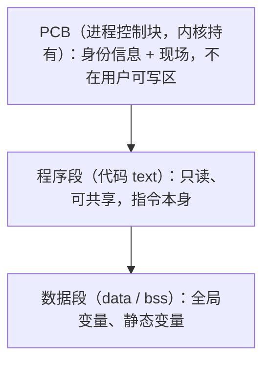
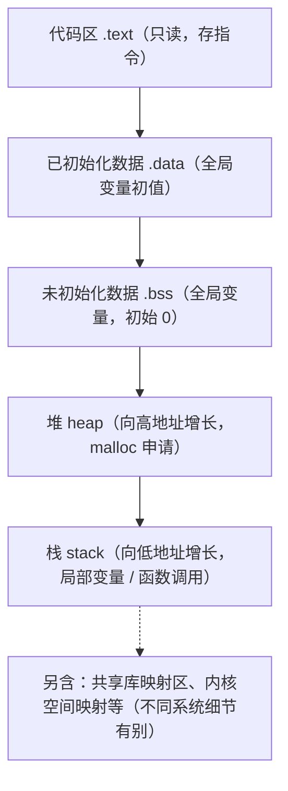
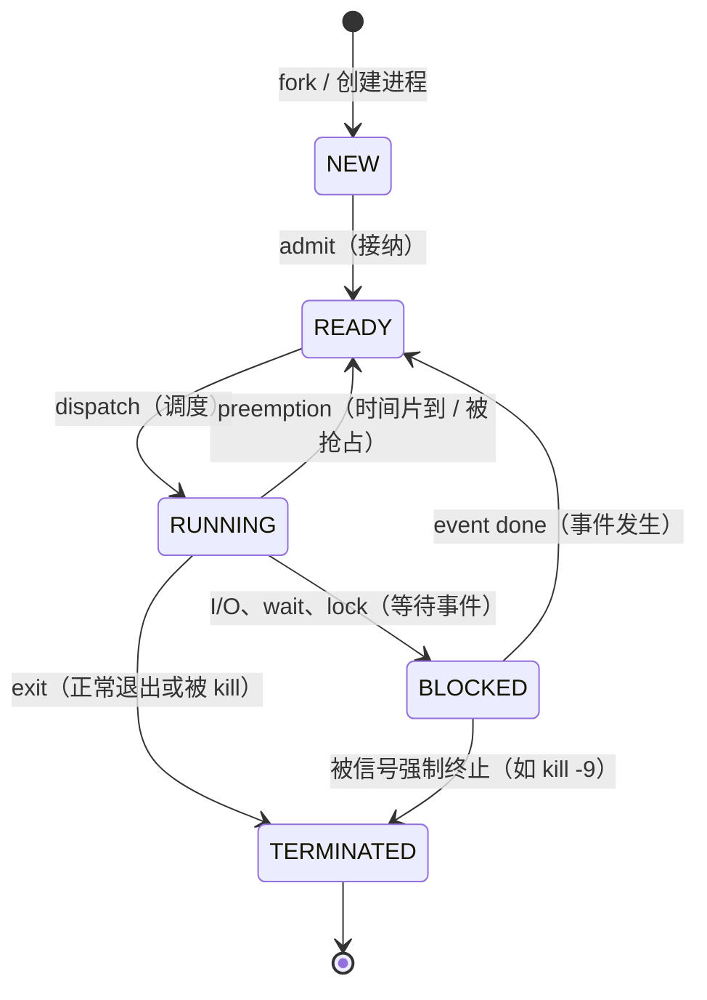

# 02 进程与线程

> 本篇导读：进程与线程是 OS 调度的基本单位。本篇讲清进程是什么、PCB 存什么、五状态模型怎么流转，以及进程与线程的区别、为什么引入线程、上下文切换的开销到底从哪来。读完你能说清"为什么有了进程还要有线程""为什么线程切换比进程切换轻""协程又比线程轻在哪"。

## 一、并发与并行

这两个词天天被混用，但含义不同，区别的根本在"是否同时占用 CPU"。

- **并发（concurrency）**：多个任务在**同一时间段内交替**执行，任一时刻其实只有一个在跑 CPU，只是切换得快，看起来像"一起"。它解决的是"等 I/O 时别让 CPU 闲着"。
- **并行（parallelism）**：多个任务在**同一时刻真正同时**执行，必须有多核/多 CPU 支撑。它解决的是"算得不够快，多颗核心一起算"。

```text
单核 CPU:
   时间 ->  [A][B][A][C][B][C]...   交替 = 并发, 但非并行

多核 CPU (2核):
   核1:  [A][A][A]...
   核2:  [B][B][B]...               同时 = 并行 (也包含并发)
```

关键结论：**并行一定是并发的特例（同时做必然也算"一段时期内都在做"），但并发未必并行**。多核时代之前，操作系统靠并发制造"多任务"假象；有了多核，进程/线程才真正能并行跑。

### 1.3 为什么关心它：阿姆达尔定律

并发/并行不是"加核就线性变快"。**阿姆达尔定律（Amdahl's Law）**指出：一个任务的总加速比受其中"必须串行"的那部分限制。

```text
设 串行比例 = s (0~1), 处理器数 = N
加速比 S(N) = 1 / ( s + (1-s)/N )

例: s=0.2 (20%必须串行)
   N=1  -> S=1.0
   N=4  -> S=1/(0.2+0.8/4)=1/0.4=2.5x
   N=无限 -> S 趋近于 1/0.2=5x  (天花板)
```

启示很实在：想靠多线程提速，先想办法**缩小串行比例**（减少锁、减少单线程初始化），否则堆再多核也有天花板。I/O 密集型任务串行比例低，所以加线程收益大；计算密集型且锁很多的任务，加线程可能几乎没用甚至变慢（线程切换本身也吃 CPU）。

## 二、进程概念

### 2.1 定义

进程（process）是**程序在某次执行过程中的一次"动态实例"**。注意它和程序的区别：程序是躺在磁盘上的静态代码（如 `a.out`），进程是这段代码被加载进内存、拿到 CPU 真正跑起来后的那个"活体"，它有生命周期、有状态、会生会灭。

一个经典定义：**进程 = 程序 + 数据 + 执行上下文（PCB + 寄存器现场）**。

### 2.2 特征

| 特征 | 说明 |
| --- | --- |
| **动态性** | 进程有创建、运行、终止的过程，是"活的"；程序是静态文件 |
| **并发性** | 多个进程可以交替（甚至并行）存在于内存中 |
| **独立性** | 每个进程有独立地址空间，互不干扰，一个崩了不影响别的 |
| **异步性** | 进程以不可预知的速度推进，OS 必须保证结果可重现（原子性/同步机制） |

### 2.3 进程控制块 PCB 存什么

操作系统靠一张"身份证"管进程，这张身份证叫**进程控制块（Process Control Block, PCB）**。内核给每个进程建一个 PCB，调度、切换、通信全靠它。它通常包含：

| PCB 字段 | 含义 |
| --- | --- |
| **进程 ID (PID)** | 系统内唯一标识 |
| **状态** | 就绪/运行/阻塞等 |
| **优先级** | 调度时决定谁先上 |
| **寄存器现场** | 程序计数器 PC、栈指针、通用寄存器值（切换时保存/恢复） |
| **内存信息** | 页表基址、地址空间范围 |
| **打开的文件表** | 该进程持有哪些文件描述符 |
| **记账信息** | 用了多少 CPU 时间、创建时间 |
| **父子关系** | 父进程 PID、子进程列表、所属用户/组 |

可以说：**PCB 是进程存在的唯一标志**——内核里没了 PCB，进程在 OS 眼里就不存在了。

### 2.4 程序与进程，再厘清一次

| 对比 | 程序（Program） | 进程（Process） |
| --- | --- | --- |
| 形态 | 磁盘上的静态文件（如 `vim`、`python`） | 内存中正在运行的实例 |
| 有无生命周期 | 无，永久躺着 | 有，创建→运行→消亡 |
| 地址空间 | 无 | 有独立虚拟地址空间 |
| 可否多个并存 | 一份文件可被多个进程同时跑 | 同一程序可同时有多个进程 |

举个具体例子：你在终端连开两个 `bash`，磁盘上只有一份 `/bin/bash` 文件，但内存里有两个进程（两个 PID），各自有独立的环境变量、当前目录与工作现场。这就是为什么"程序"和"进程"是两个层面的概念——前者是菜谱，后者是按菜谱正在炒的那盘菜。

## 三、进程的组成

一个进程的"实体"由三部分构成：



### 3.1 内存映像（虚拟地址空间视角）

从进程自己看到的虚拟内存来看，更直观的是下面这个布局（以典型 32/64 位进程为例，地址从低到高）：



要点：

- **代码区**只读可共享，多个进程跑同一程序（如多个 `bash`）能共用同一份物理代码页，省内存；
- **堆**由程序员手动申请释放（`malloc`/`free`、Java 的 GC 代管），向高地址扩张；
- **栈**由编译器自动管理，函数调用时压栈、返回时弹栈，向低地址收缩；
- 每个进程的这块"虚拟内存"彼此独立，由 MMU + 页表映射到不同物理页，正是隔离的来源。

### 3.2 用户空间与内核空间

在典型 32 位布局里，虚拟地址空间并非全给用户用，内核会霸占顶端一段：

```text
32 位进程(4GB 虚拟空间)示例:
   0x00000000 ~ 0xBFFFFFFF   用户空间 (3GB, 进程自己可访问)
   0xC0000000 ~ 0xFFFFFFFF   内核空间 (1GB, 只有内核态能访问)
```

- 用户程序只能访问用户空间；一旦执行系统调用陷入内核，CPU 切到内核态，才临时"借用"内核空间的代码去干活，但仍在**当前进程上下文**里（所以内核能拿到该进程的 PCB、文件表）；
- 不同进程的**用户空间彼此隔离**，但共享同一份**内核空间代码**（毕竟内核只有一个），这正是"进程隔离但内核统一"的实现基础。

### 3.3 共享库与写时复制

同一台机器上几百个进程都链接了 `libc`，难道内存里要装几百份？不必：

- **共享库（shared library，如 `.so`/`.dll`）**的代码段被映射成"只读 + 多进程共享"的物理页，只有一份；
- 每个进程独有的是自己的数据段与栈（这些才会写时复制，互不干扰）。

所以"代码可共享、数据各一份"是进程既省内存又相互隔离的关键设计，也解释了为什么 `fork` 之后父子能迅速共享几乎全部内存、只在真正写入时才分家。

## 四、进程状态

进程不是"一直跑"，它会因等待资源、被抢 CPU 而在不同状态间游走。先有三态，后扩展出五态。

### 4.1 三态模型

最朴素的三态：**就绪（ready）、运行（running）、阻塞（blocked）**。

- **就绪**：一切就绪，只差 CPU；
- **运行**：正占着 CPU 执行；
- **阻塞**：因等某事件（I/O、锁、信号）而让出 CPU，且即使给它 CPU 也干不了活。

### 4.2 五态模型与状态图

实际系统会把"新建"和"终止"也显式建模为状态，得到五态：**新建（new）、就绪（ready）、运行（running）、阻塞（blocked）、终止（terminated）**。

用状态图展示状态转换（触发事件写在箭头旁）：



状态转换与触发事件一览：

| 转换 | 触发事件 |
| --- | --- |
| NEW → READY | 进程被创建、资源就绪，OS 把它接纳进就绪队列 |
| READY → RUNNING | 调度器选中，分配 CPU |
| RUNNING → READY | 时间片用完、或被更高优先级抢占（被动让出） |
| RUNNING → BLOCKED | 执行中请求 I/O、等锁、等信号等，主动阻塞 |
| BLOCKED → READY | 等待的事件完成（如磁盘读完、锁释放） |
| RUNNING → TERMINATED | 正常退出或被强制杀死（`exit`/`kill`） |
| BLOCKED → TERMINATED | 被信号强制终止（如 `kill -9`） |

注意两个**不会直接发生**的转换：运行不能一步跳到阻塞之外再回来；阻塞态即便被"给 CPU"也无法运行，必须先回到就绪。这套模型保证了"只有就绪态的进程才会被调度"，是调度正确性的基础。

### 4.3 引入"挂起"：七态模型

五态模型漏了一种现实情况：**内存不够时，OS 想把某个进程整体换到磁盘睡眠**，让它暂时不参与调度，这就是**挂起（suspend）**。加上"就绪挂起"和"阻塞挂起"，得到七态：

```text
   激活(在内存)                  挂起(换出到磁盘)
   READY      <--activate--   READY_SUSPEND
     |  dispatch                |  (内存紧时换出)
     v                          v
   RUNNING                     BLOCKED_SUSPEND
     |                          ^
     v  block                   | event
   BLOCKED     <--activate--   BLOCKED_SUSPEND
```

- **就绪挂起 / 阻塞挂起**：进程不在内存，OS 不能调度它；
- 只有当 OS 把它**激活（换回内存）**，才重新回到就绪/阻塞态。

挂起常发生在内存压力大时（OS 用"对换 swap"腾地方），也常用于"调试时冻结某进程"" hibernation（休眠）把整个系统状态写入磁盘"。理解它，就懂了为什么你的电脑内存快满时会突然变卡——背后正是大量进程被换入换出。

## 五、进程控制

进程从生到死，由 OS 提供的"原语"操作。所谓**原语（primitive）**，是指执行不可中断、一气呵成的一段内核代码——它要么全做、要么不做，不能被中途切走，否则会出现"进程创建到一半、父子关系乱套"这类竞态。

### 5.1 创建：fork

在 UNIX/Linux 里，新进程的诞生几乎都靠 `fork`：它**复制调用者（父进程）的地址空间，生成一个几乎一模一样的子进程**，两者从 `fork` 返回处分道扬镳（靠返回值区分父子）。

```c
#include <stdio.h>
#include <unistd.h>
#include <sys/types.h>

int main(void) {
    pid_t pid = fork();          /* 复制父进程, 返回两次 */
    if (pid == 0) {
        /* 子进程: 返回值 0 */
        printf("child, pid=%d\n", (int)getpid());
    } else if (pid > 0) {
        /* 父进程: 返回子进程 PID */
        printf("parent, child pid=%d\n", (int)pid);
    } else {
        perror("fork failed");
    }
    return 0;
}
```

现代系统用**写时复制（Copy-On-Write, COW）**优化：fork 并不立刻复制整块内存，父子先共享同一批物理页，谁先写某页才真正复制那一页，极大降低创建开销。

### 5.2 退出：exit

进程结束调用 `exit`（或 `return` 从 `main` 返回），内核回收它的 PCB、内存、打开的文件，并给父进程发一个"子进程已死"的信号（SIGCHLD），父进程需用 `wait` 收尸，否则子进程会变成**僵尸进程（zombie）**占用 PID。

### 5.3 阻塞与唤醒

阻塞与唤醒是一对原语：

- **阻塞（block）**：进程主动放弃 CPU，把 PCB 状态从运行改为阻塞，挂到某个等待队列上（如"等键盘输入"队列）；
- **唤醒（wakeup）**：当事件到来（如键盘敲了、数据到了），内核把等待队列上对应的进程状态改回就绪，重新送入就绪队列等调度。

它们必须成对、原子地用，否则会出现"进程睡下后没人叫它醒"的经典死锁 bug（典型：先检查条件再睡，但检查和睡之间条件变了却没睡对）。所以工程上多用"睡眠自带条件判断"的同步原语（如条件变量）。

### 5.4 孤儿、僵尸与守护进程

进程关系里还有三个绕不开的角色：

| 角色 | 成因 | 后果 / 处理 |
| --- | --- | --- |
| **僵尸进程（zombie）** | 子进程已 `exit`，但父进程没 `wait` 收尸 | 残留 PCB 占用 PID，积累多了会耗尽 PID 号 |
| **孤儿进程（orphan）** | 父进程先死，子进程还在 | 被 `init`/`systemd`（PID 1）收养，正常继续，不会变僵尸 |
| **守护进程（daemon）** | 后台长期运行的服务（如 `sshd`） | 脱离终端、随系统启动，通常 fork 两次并 setsid 脱离会话 |

僵尸进程的核心是"**进程死了但身份证(PCB)还在**"——内核要保留退出码供父进程查询，若父进程永远不查，这块 PCB 就一直占着。解决办法：父进程务必 `wait`/`waitpid`，或在 `fork` 前忽略 SIGCHLD 让内核自动回收；若父进程本身有 bug，杀掉父进程即可让 `init` 接管并清理其子进程。

## 六、线程

有了进程为什么还要线程？因为**进程的"重"成了瓶颈**。

### 6.1 为什么引入线程

进程作为独立资源单位，创建、切换、通信都贵：

- 创建进程要复制地址空间、建 PCB，慢；
- 进程间通信（IPC）要跨地址空间，靠内核中转（管道、共享内存、消息队列），繁；
- 一个程序想"边算边收网络边刷界面"，开多个进程代价高、协作难。

于是人们发现：**很多任务共享同一份代码和数据，只是"执行流"不同**。把"执行流"从进程里拆出来，就成了线程（thread）。**线程是进程内的一个执行流，是 CPU 调度的最小单位；进程是资源分配的最小单位**。同一个进程的多个线程共享地址空间，切换和通信都轻得多。

### 6.2 线程与进程的区别

| 维度 | 进程 | 线程 |
| --- | --- | --- |
| 资源拥有 | 拥有独立地址空间、文件等 | 基本不拥有资源，共享所属进程的资源 |
| 调度单位 | 传统上也是，但现代多以线程调度 | CPU 调度的基本单位 |
| 切换开销 | 大（要换页表、刷 TLB） | 小（同进程内，地址空间不变） |
| 通信 | 需 IPC（跨地址空间） | 直接读写共享变量（需加锁） |
| 健壮性 | 一个崩了一般不影响别的 | 一个线程崩（如段错误）常拖垮整个进程 |

### 6.3 线程控制块 TCB

进程有 PCB，线程也有自己的"身份证"——**线程控制块（TCB）**，但比 PCB 轻：它主要存**线程自己的寄存器现场、栈指针、调度状态、优先级、所属线程 ID** 等，而页表、打开文件表这些"重资源"仍放在进程的 PCB 里、被同进程所有线程共享。

### 6.4 用户级线程 vs 内核级线程

按"调度由谁管"分两类：

| 类型 | 调度者 | 优点 | 缺点 |
| --- | --- | --- | --- |
| **用户级线程 (ULT)** | 用户态库（如早期 POSIX 线程库、green thread） | 切换纯用户态、极快，不进内核；可移植 | 一个线程阻塞（如系统调用）会卡住整个进程；无法利用多核并行 |
| **内核级线程 (KLT)** | 内核 | 真正并行、一个阻塞不影响其他；内核能调度到多核 | 切换要陷入内核，有成本 |

现实主流是**一对一模型**：一个用户线程绑定一个内核线程（如 Linux 的 NPTL、Windows 线程），兼顾并行与可管理。这样既能用多核，又由内核兜底调度。

### 6.5 三种线程映射模型

用户线程与内核线程的绑定关系有经典三档：

```text
多对一 (Many-to-One, ULT):
   用户线程 T1 T2 T3  -->  内核线程 K1
   优点: 切换快(纯用户态)  缺点: 一个阻塞全卡, 不能并行

一对一 (One-to-One, KLT):
   用户线程 T1 --> 内核线程 K1
   用户线程 T2 --> 内核线程 K2
   优点: 真并行, 一个阻塞不影响其他  缺点: 创建开销大

多对多 (Many-to-Many):
   用户线程 T1 T2 T3  -->  内核线程 K1 K2 (池)
   折中: 既轻又能并行, 由运行时在池中调度
```

现代 Linux（NPTL）、Windows、Java 默认线程都是**一对一**；Go 的 goroutine 则是典型**多对多**（M 个协程映射到 N 个内核线程的 M:N 调度）。了解这层，能读懂"为什么 Java 起十万线程会 OOM，而 Go 起十万 goroutine 轻松如常"——前者一对一吃真实内核资源，后者多对多只是用户态簿记。

### 6.6 一个 POSIX 线程（pthread）例子

```c
#include <pthread.h>
#include <stdio.h>

void *worker(void *arg) {
    long id = (long)arg;
    printf("thread %ld running\n", id);
    return NULL;
}

int main(void) {
    pthread_t t1, t2;
    pthread_create(&t1, NULL, worker, (void *)1L);  /* 创建并启动线程 */
    pthread_create(&t2, NULL, worker, (void *)2L);
    pthread_join(t1, NULL);  /* 等待线程结束, 回收资源 */
    pthread_join(t2, NULL);
    return 0;
}
```

`pthread_create` 在内核里最终走到 `clone`（带 `CLONE_VM` 等标志，表示与父共享地址空间），从而造出一个"共享内存、独立栈"的线程；`pthread_join` 等价于线程版的 `wait`。

## 七、协程

线程仍有"重"的地方：默认栈几 MB、创建成千上万个就吃紧，且切换仍需内核参与。于是更轻的**协程（coroutine）**登场。

### 7.1 是什么

协程也叫**绿色线程（green thread）、轻量级线程**，本质是**运行在用户态、由程序自身（而非 OS 内核）调度的"协作式执行流"**。它和线程最大的不同：**切换不陷入内核，由用户代码在合适时机主动让出（yield）**。经典如 Java 的虚拟线程、Go 的 goroutine。

### 7.2 与线程的区别

| 维度 | 线程 | 协程 |
| --- | --- | --- |
| 调度者 | 内核（抢占式） | 用户态运行时（协作式 + 运行时托管） |
| 切换成本 | 需陷入内核、刷寄存器/缓存 | 纯用户态，几乎只是换几个寄存器 |
| 栈大小 | 默认 MB 级 | 初始几 KB，按需增长 |
| 数量 | 几千到几万封顶 | 可并发百万级 |
| 阻塞行为 | 系统调用阻塞会占住内核线程 | 协程阻塞时，运行时把底层线程让给别的协程 |

一句话：**协程把"调度权"从内核手里收回到用户程序，用极小的栈和纯用户态切换，换取海量并发**（尤其适合 I/O 密集的网络服务）。

### 7.3 例子一句话

- **Go 的 goroutine**：`go func()` 一行起一个协程，Go 运行时用 M:N 调度把它映射到少量 OS 线程上；
- **Java 虚拟线程（Virtual Thread, JDK 21+）**：`Thread.startVirtualThread(() -> {...})`，由 JVM 调度，阻塞时自动卸载到底层平台线程，写法与普通线程一致却轻量得多。

```java
// Java 虚拟线程示例 (需要 JDK 21+)
package com.example.demo;

import java.util.concurrent.Executors;

public class VirtualThreadDemo {
    public static void main(String[] args) throws InterruptedException {
        // 用虚拟线程池并发处理 10 万个任务也毫无压力
        try (var executor = Executors.newVirtualThreadPerTaskExecutor()) {
            for (int i = 0; i < 100_000; i++) {
                executor.submit(() -> {
                    // 此处阻塞时, JVM 会自动把底层平台线程让给其他虚拟线程
                    Thread.sleep(100);
                    return "done";
                });
            }
        }
    }
}
```

### 7.4 Go 的 goroutine 调度（G-M-P 模型）

Go 运行时用自己的调度器把 goroutine 映射到少量 OS 线程，经典抽象是 **G-M-P**：

```text
G (Goroutine): 用户态协程, 轻量, 初始栈仅 2KB
M (Machine):   底层 OS 线程, 真正在 CPU 上跑
P (Processor): 逻辑处理器, 持有可运行 G 的本地队列, 数量 = GOMAXPROCS

调度流转:
   本地队列 P 里的 G 被 M 取走执行
   某 G 阻塞(如系统调用) -> 该 M 与 P 解绑, P 带着其余 G 交给别的 M
   阻塞结束 -> G 被放回某 P 的队列等待再调度
```

精髓在于：**当某个 goroutine 阻塞在系统调用时，Go 不会让整个线程空闲**，而是把 P"腾"给另一个 M，继续跑别的 goroutine——这就是协程能扛海量并发、又不浪费内核线程的原因。

### 7.5 Java 虚拟线程的调度

Java 21 的虚拟线程由 **JVM 的 ForkJoinPool** 调度到底层"载体线程（carrier thread，即平台线程）"上：

- 虚拟线程在**运行 Java 代码**时占用载体线程；
- 一旦它阻塞在**阻塞式 I/O**（如 `InputStream.read`、JDBC），JVM 自动把它**从载体线程上卸载（unmount）**，载体线程立刻去跑别的虚拟线程；
- I/O 完成后再把虚拟线程**重新挂载（mount）**到某个载体线程继续。

对开发者来说，写法和老式 `Thread` 一模一样（不需要 `async/await` 改造成回调地狱），却获得了"每请求一线程"却轻如协程的好处。这正是"用内核级线程的编程模型，拿到用户级协程的并发度"的工程典范。

## 八、上下文切换

"切换"听着轻巧，实则是有成本的，理解它才能明白为什么线程比进程轻、协程又比线程轻。

### 8.1 切换时保存/恢复什么

当 CPU 从一个执行流（进程或线程）换到另一个，必须**保存旧执行流的"现场"，装入新执行流的"现场"**，否则回来时程序就乱套了。现场主要包括：

| 保存内容 | 说明 |
| --- | --- |
| **通用寄存器** | 程序当前算到一半的值 |
| **程序计数器 PC** | 下一条要执行的指令地址 |
| **栈指针 SP** | 当前栈位置 |
| **状态字/标志位** | 进位、中断允许等 |

若是**进程间切换**，还要额外换**页表基址（CR3）**和整套地址空间映射，这一换就把 TLB 也清了。

### 8.2 开销来源

上下文切换的成本主要来自三处：

```text
切换开销 = 寄存器保存/恢复(快)
         + 页表切换 + TLB 刷新(进程切换才有, 慢)
         + CPU 缓存失效(新执行流的数据不在缓存, 要回内存取, 很慢)
```

| 来源 | 进程切换 | 线程切换 | 协程切换 |
| --- | --- | --- | --- |
| 寄存器现场 | 有 | 有 | 有 |
| TLB/页表 | **刷新**（地址空间变了） | 不刷（同进程） | 不刷 |
| 缓存失效 | 严重 | 较轻 | 最轻 |
| 是否陷入内核 | 是 | 是 | **否（用户态）** |

这就是为什么：**进程切换 > 线程切换 > 协程切换**。高并发服务（如网关、数据库代理）极力减少无谓切换、推崇协程或用户态队列，正是为了躲开缓存失效这个大头。

### 8.3 切换何时发生、如何减少

上下文切换由两类事件触发：

| 触发类型 | 例子 | 可避免吗 |
| --- | --- | --- |
| **主动（yield）** | 线程主动 `sleep`、等锁、让出 CPU | 部分可优化（减少不必要等待） |
| **被动（抢占）** | 时间片到、被更高优先级抢占、收到中断 | 由内核决定，应用难控但可调优 |

工程上"减少切换"的常见招数：

- **绑核（CPU affinity）**：把关键线程绑到固定核，避免跨核导致缓存冷掉；
- **批处理**：攒一批任务一次处理，而非来一个处理一个（减少陷入与切换频率）；
- **用协程/用户态队列**：把调度收回到用户态，把内核切换降到最低；
- **减少锁竞争**：锁竞争会频繁让线程阻塞/唤醒，是无谓切换的一大来源；
- **合适的线程数**：线程数远超 CPU 核数会导致大量"抢 CPU"式切换，I/O 密集可调高、计算密集应贴近核数。

一句话：**切换本身不是敌人，无意义的、伴随缓存冷掉的切换才是**。调优的本质，是让"每次切走再切回"都物有所值。

## 九、进程 vs 线程对比

把本篇核心差异压缩成一张表，便于面试与工程选型时对照：

| 维度 | 进程 | 线程 | 协程(补充) |
| --- | --- | --- | --- |
| **资源拥有** | 独立地址空间、文件 | 共享进程资源 | 同线程, 更轻 |
| **调度单位** | 资源分配单位 | CPU 调度基本单位 | 用户态调度 |
| **切换开销** | 大（刷 TLB） | 中（不刷 TLB） | 小（用户态） |
| **通信方式** | IPC（管道/共享内存/消息） | 共享变量（需锁） | 共享变量 + channel |
| **并行能力** | 可跨核并行 | 可跨核并行 | 依托底层线程并行 |
| **健壮性** | 强（互不影响） | 弱（一崩全崩） | 弱 |
| **数量上限** | 数百~数千 | 数千~数万 | 数十万~百万级 |
| **创建速度** | 慢 | 较快 | 极快 |

工程选型直觉：

- 要**隔离、稳定**（如跑不可信代码、多租户） → 用进程；
- 要**共享数据、高并发计算** → 用线程（配好锁）；
- 要**海量 I/O 并发**（如高并发网络服务） → 用协程/虚拟线程，以最小代价撑住连接数。

### 9.2 三个常见误区

- **误区一："线程越多越快"**。错。线程超过 CPU 核数后，多出来的是切换开销而非算力；计算密集任务线程数贴近核数即可，过多反而因抢 CPU 变慢（见阿姆达尔定律）。
- **误区二："进程间绝对不能共享"**。错。进程间可用**共享内存（shared memory）**刻意共享一段物理内存，只是默认隔离；共享内存是 IPC 里最快的一种，代价是要自己处理同步。
- **误区三："协程能并行"**。协程本身是单线程内的协作调度，**真正并行仍依赖底层多核线程**；单个线程里的多个协程在同一时刻只有一个在跑，只是切换极廉价。说"Go 程序能并行"指的是它的 M:N 调度把协程铺到了多个内核线程上，而非协程自身并行。

## 本篇小结

- **并发是交替、并行是同时**；并行须多核，并发不必须，但并行一定包含并发。
- **进程 = 程序 + 数据 + 执行上下文**，是程序的一次动态执行实例，有生有灭。
- 进程四大特征：**动态、并发、独立、异步**；**PCB 是进程存在的唯一标志**，存 PID、状态、寄存器现场、页表等。
- 进程实体 = PCB + 程序段 + 数据段；虚拟内存里**代码只读、堆向上、栈向下**，各进程地址空间独立。
- **五态模型**：新建→就绪→运行→阻塞→终止；运行只能经"调度"进、经"抢占/阻塞"出，阻塞须先回就绪才能再运行。
- **fork** 用写时复制高效生子进程；**exit** 后父进程须 `wait` 收尸，否则成僵尸进程。
- **原语不可中断**；阻塞/唤醒成对原子使用，避免"睡死没人叫醒"。
- **线程是进程内的执行流、CPU 调度最小单位**；同进程线程共享地址空间，切换比进程轻（不刷 TLB）。
- **协程是用户态调度的轻量执行流**（Go goroutine / Java 虚拟线程），切换不陷内核，可撑百万级并发。
- **上下文切换开销**来自寄存器保存、TLB 刷新（仅进程切换）、缓存失效；故 进程 > 线程 > 协程。

## 参考链接

- [Operating Systems: Three Easy Pieces (OSTEP) 教材官网](https://ostep.org/)
- [Wikipedia: Process (computing)](https://en.wikipedia.org/wiki/Process_(computing))
- [Wikipedia: Thread (computing)](https://en.wikipedia.org/wiki/Thread_(computing))
- [Wikipedia: Context switch](https://en.wikipedia.org/wiki/Context_switch)
- [Wikipedia: Coroutine](https://en.wikipedia.org/wiki/Coroutine)
- [Linux man-pages: fork(2)](https://man7.org/linux/man-pages/man2/fork.2.html)
- [Linux man-pages: clone(2)](https://man7.org/linux/man-pages/man2/clone.2.html)
- [Oracle: Java Thread 类文档](https://docs.oracle.com/en/java/javase/21/docs/api/java.base/java/lang/Thread.html)

下一篇 → [03 进程调度](/cs/os/schedule)
