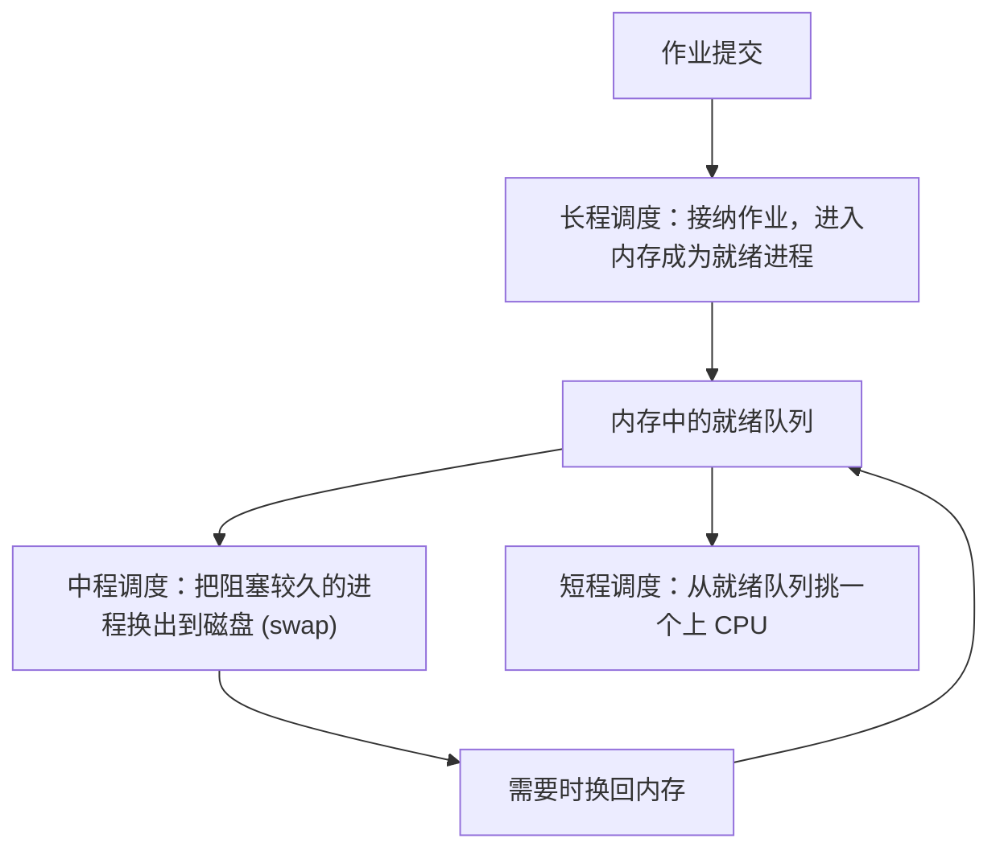
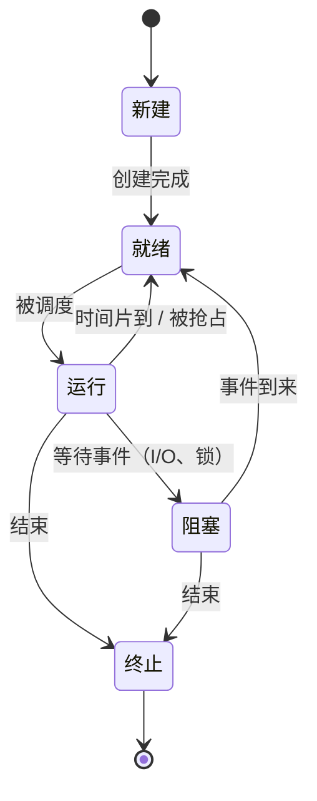
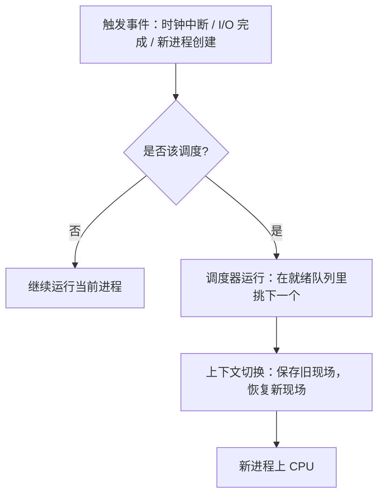
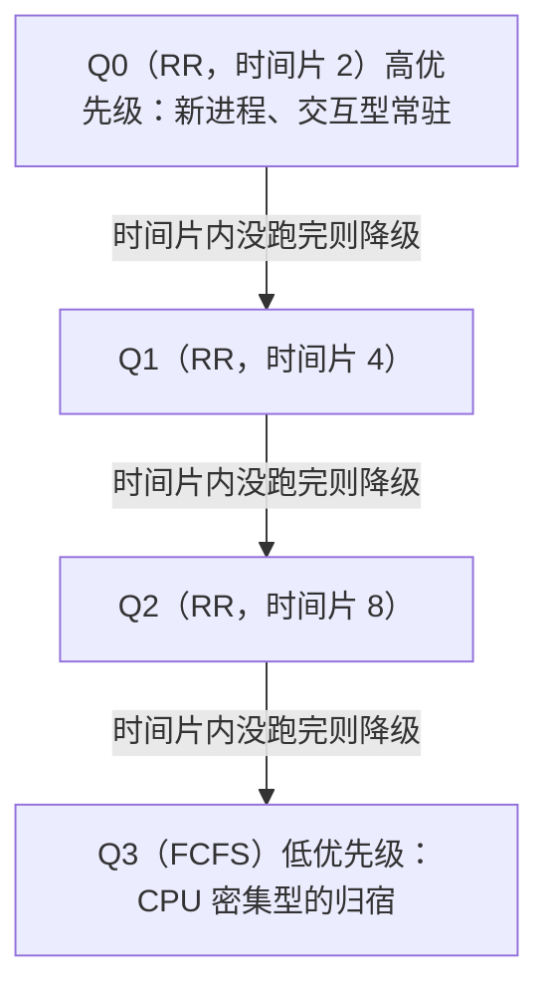

# 03 进程调度

> 本篇导读：当就绪队列有多个进程，CPU 先跑谁？本篇讲清调度层次、评价指标，以及 FCFS/SJF/时间片轮转/多级反馈队列等算法的思想与优劣，并给手算周转时间的例子。

## 一、调度层次

现代操作系统把"把谁放进 CPU 跑"这件事拆成了好几层，每一层管的范围和频率都不一样。理解层次，才知道某个调度器到底在管什么。

### 1.1 三层调度对比

| 层次 | 别称 | 管的事 | 频率 | 发生位置 |
| --- | --- | --- | --- | --- |
| **长程调度** | 作业调度 / 高级调度 | 决定是否把一个新提交的任务（作业）接纳进内存，成为进程 | 很低，秒~分钟级 | 作业进入系统 ↔ 内存 |
| **中程调度** | 内存调度 / 交换 | 把暂时用不到的进程换出到磁盘（挂起），或换回内存 | 中等 | 内存 ↔ 磁盘（swap） |
| **短程调度** | 进程调度 / 低级调度 | 从就绪队列里挑一个进程，真正把 CPU 交给它 | 极高，毫秒~微秒级 | CPU ↔ 就绪队列 |

一句话记忆：**长程管"进不进内存"，中程管"在不在内存"，短程管"现在跑哪个"**。

### 1.2 为什么要分三层

早期计算机内存小，任务一多就装不下。如果所有提交的任务都常驻内存，内存会爆。于是：

- 长程调度像"门卫"，控制**并发度**（同时有多少进程驻留内存），避免内存被占满。分时系统里它也叫"接纳调度"，会把"多道程序度"维持在一个合理值。
- 中程调度像"仓库管理员"，把阻塞很久、暂时用不上的进程换出到磁盘，腾出内存给更需要的进程，等以后再换回。这就是"挂起态（suspend）"的由来。它把"内存紧张"和"CPU 调度"解耦——即使内存不够，也别让就绪进程饿死。
- 短程调度像"裁判"，在微观上决定下一个时间片归谁，保证系统看起来是"同时"在跑很多任务。



注意：**只有短程调度的频率高到会影响系统"流畅度"**。我们平时说"调度算法"通常指的就是短程调度（进程调度），本篇后面讲的所有算法也都落在这一层。

### 1.3 配合进程的五种基本状态

调度在进程状态机里穿梭，先认全状态（以经典五态模型为例）：



- **就绪（Ready）**：万事俱备，只等 CPU。
- **运行（Running）**：正在 CPU 上跑。
- **阻塞（Blocked/Waiting）**：在等某件事（I/O 完成、锁释放），即使给 CPU 也跑不了，所以调度器**不会**选它。
- 引入挂起后还有**就绪挂起 / 阻塞挂起**：被换出到磁盘，但逻辑状态不变。

调度器只在"就绪"集合里挑，这是理解所有算法的前提——**阻塞的进程不参与竞争 CPU**。

## 二、调度时机

调度不是随时都能发生的，要分"什么时候该调度"和"能不能抢"。

### 2.1 抢占式 vs 非抢占式

| 类型 | 含义 | 优点 | 缺点 | 典型场景 |
| --- | --- | --- | --- | --- |
| **非抢占式** | 进程一旦拿到 CPU，就一直跑到自己主动放弃（结束或阻塞） | 实现简单、无频繁切换开销、适合批处理 | 响应慢，一个长进程能"霸占"CPU 饿死别人 | 早期批处理系统、某些嵌入式 |
| **抢占式** | 操作系统有权强制把 CPU 从当前进程收回，交给更该跑的 | 响应快、公平、支持时间片 | 切换有开销、需要保证共享数据不被打断出问题 | 几乎所有现代桌面/服务器 OS |

关键区别在"谁说了算"：**非抢占式是进程自愿让出，抢占式是内核强行收回**。

为什么抢占式需要"保证共享数据安全"？因为抢占可能在任意时刻发生，如果两个进程共享一个全局变量，A 改到一半被抢，B 读到了半成品，就出错了。所以抢占式系统里，**临界区要么很短，要么用锁/关中断保护**（内核态某些路径会临时禁止抢占）。

### 2.2 何时触发调度

调度在下列时刻被触发（即调度"点"）：

- **进程主动放弃 CPU**：调用阻塞原语（如等 I/O、等锁）、正常退出、调用 `yield` 主动让出。
- **时间片用完**：抢占式系统里，时钟中断发现当前进程时间片耗尽，触发重新调度。
- **更高优先级进程就绪**：抢占式系统里，新来的或刚解阻塞的进程优先级更高，内核立即抢占当前进程。
- **当前进程被阻塞**：比如等磁盘 I/O，内核把它移出就绪队列，选下一个。



### 2.3 上下文切换的代价

"上下文切换（context switch）"指保存当前进程的寄存器、程序计数器等现场，恢复下一个进程的现场。代价包括：

1. **直接开销**：保存/恢复寄存器、切换页表（导致 **TLB 失效**）、刷新 CPU 缓存（cache 预热）。一次切换大约几微秒到几十微秒。
2. **间接开销**：新进程大概率不在 CPU 缓存里，开头一段时间都在"等内存"，指令执行变慢。

所以调度频率不能太高——时间片太短，大量 CPU 时间花在切换上，叫**切换颠簸**。经验上时间片取 10~100ms，让切换开销占比 < 1%。

## 三、调度指标

怎么判断一个调度算法好不好？靠几个量化指标。先约定符号：

- `提交时刻` = 进程进入系统的时间（到达时间 arrival）
- `开始时刻` = 进程第一次拿到 CPU 的时间
- `完成时刻` = 进程运行结束的时间
- `服务时间(CPU burst)` = 进程实际占用 CPU 的总时长，也叫 `需要时间`、`运行时间`
- `等待时间` = 在就绪队列里干等的时间（不含阻塞等 I/O）

### 3.1 核心指标与公式

| 指标 | 含义 | 公式 |
| --- | --- | --- |
| **CPU 利用率** | CPU 忙起来的比例 | `CPU利用率 = 忙碌时间 / 总时间` |
| **吞吐量** | 单位时间完成多少进程 | `吞吐量 = 完成进程数 / 总时长` |
| **周转时间** | 从提交到完成的总耗时 | `周转时间 = 完成时刻 - 提交时刻` |
| **带权周转时间** | 周转相对服务时间被放大的倍数 | `带权周转 = 周转时间 / 服务时间` |
| **等待时间** | 在就绪队列等待的累计时间 | `等待时间 = 周转时间 - 服务时间` |
| **响应时间** | 从提交到"第一次有响应" | `响应时间 = 首次开始时刻 - 提交时刻` |

几个细微但重要的点：

- **周转时间**关心"拖了多久"，对批处理任务重要。
- **响应时间**关心"多久才理我"，对交互式任务（点一下鼠标多久有反应）重要。注意响应 ≠ 完成，只要"开始被处理"就算响应了。
- **带权周转时间**消除了"任务本身长短"的偏差，便于横向比较算法——它越大说明这个进程被不公平地等得越久。理想值是 1（完全不用等）。
- 等待时间 = 周转 − 服务，因为在"忽略 I/O 重叠"的理想模型下，进程生命周期里要么在跑（服务时间）要么在等（等待时间）。

### 3.2 手算示例（贯穿后面算法）

下面这组进程贯穿 FCFS / SJF / RR 多个算法，方便对比：

```text
进程   提交时刻   服务时间(需要占用CPU的时长)
  P1      0          7
  P2      0          4
  P3      0          1
  P4      0          4
```

假设全部在时刻 0 就绪（提交时刻都为 0）。我们先记住"完美情况"下：总服务时间 = 7+4+1+4 = 16；如果完全不切换、顺序跑，各进程周转时间就是各自前面累加的服务时间。

## 四、调度算法

逐个讲。每个算法给：**思想 + 优缺点 + 手算小例子 + 伪码**。

### 4.1 FCFS 先来先服务（First-Come, First-Served）

**思想**：就绪队列按到达顺序排成 FIFO，谁先到谁先跑，跑完才轮下一个。非抢占。

**优缺点**：
- 优点：实现极简单，公平（按先来后到）。
- 缺点：**护航效应（convoy effect）**——一个长进程后面跟着一堆短进程，短进程要等死，平均周转时间很差。

**伪码**：

```c
/* 非抢占 FCFS：按到达顺序跑 */
void fcfs(Process q[], int n) {
    sort_by_arrival(q, n);          // 按提交时刻排序
    int t = 0;
    for (int i = 0; i < n; i++) {
        if (t < q[i].arrival) t = q[i].arrival;  // 等它到达
        q[i].start = t;
        t += q[i].service;          // 一直跑完
        q[i].finish = t;
    }
}
```

**手算**（用上面四个进程，按 P1→P2→P3→P4 到达顺序）：

```text
时间轴:  0────7────11────12────16
进程:    [ P1 ][ P2 ][ P3 ][ P4 ]
```

| 进程 | 提交 | 服务 | 开始 | 完成 | 周转 | 带权周转 |
| --- | --- | --- | --- | --- | --- | --- |
| P1 | 0 | 7 | 0 | 7 | 7 | 1.00 |
| P2 | 0 | 4 | 7 | 11 | 11 | 2.75 |
| P3 | 0 | 1 | 11 | 12 | 12 | 12.00 |
| P4 | 0 | 4 | 12 | 16 | 16 | 4.00 |

平均周转 = (7+11+12+16)/4 = **11.5**；平均带权周转 = (1+2.75+12+4)/4 = **4.94**。P3 明明只要 1 秒却被拖到 12 秒，这就是护航效应。

### 4.2 SJF / SPF 短作业优先（Shortest Job First）

**思想**：每次从就绪队列选"预计服务时间最短"的先跑。若只用于非抢占叫 **SPF（Shortest Process First）**；若允许抢占（来了一个剩余时间更短的就抢），叫 **SRTF（Shortest Remaining Time First，最短剩余时间优先）**。

**优缺点**：
- 优点：**理论上能最小化平均等待/周转时间**（可证明：把短任务排前面，把它们的高等待乘子压到最低）。
- 缺点：必须**预知服务时间**（实际做不到，只能靠历史预测，如指数平滑）；**会饿死长作业**——如果一直有短任务来，长任务永远轮不上。

**伪码（非抢占 SPF）**：

```c
/* 每次从"已到达"的进程里挑服务时间最短的 */
void spf(Process p[], int n) {
    int done = 0, t = 0;
    while (done < n) {
        int best = -1;
        for (int i = 0; i < n; i++)
            if (!p[i].finished && p[i].arrival <= t)
                if (best == -1 || p[i].service < p[best].service) best = i;
        if (best == -1) { t++; continue; }   // 还没人到达, 空转
        p[best].start = t;
        t += p[best].service;
        p[best].finish = t;
        p[best].finished = 1;
        done++;
    }
}
```

**手算（非抢占 SJF，按服务时间升序：P3(1)→P2(4)→P4(4)→P1(7)）**：

```text
时间轴:  0─1──5──9────16
进程:    [P3][P2][P4][ P1 ]
```

| 进程 | 提交 | 服务 | 开始 | 完成 | 周转 | 带权周转 |
| --- | --- | --- | --- | --- | --- | --- |
| P3 | 0 | 1 | 0 | 1 | 1 | 1.00 |
| P2 | 0 | 4 | 1 | 5 | 5 | 1.25 |
| P4 | 0 | 4 | 5 | 9 | 9 | 2.25 |
| P1 | 0 | 7 | 9 | 16 | 16 | 2.29 |

平均周转 = (1+5+9+16)/4 = **7.75**（比 FCFS 的 11.5 好很多）；平均带权周转 = (1+1.25+2.25+2.29)/4 ≈ **1.70**。

**补充：SRTF（抢占版）手算**——用不同到达时间更能体现抢占：

```text
进程   到达   服务(剩余)
  A     0      8
  B     1      4
  C     2      2
```

时间线：
- t=0~1：A 跑（剩 7），t=1 B 到。
- t=1~2：B 剩余(4) < A 剩余(7)，B 抢，B 跑剩 3；t=2 C 到。
- t=2~4：C 剩余(2) 最小，C 抢并跑完（t=4）。
- t=4~7：B 剩余 3 最小，B 跑完（t=7）。
- t=7~15：A 跑完（t=15）。

| 进程 | 到达 | 服务 | 完成 | 周转 | 等待 |
| --- | --- | --- | --- | --- | --- |
| A | 0 | 8 | 15 | 15 | 7 |
| B | 1 | 4 | 7 | 6 | 2 |
| C | 2 | 2 | 4 | 2 | 0 |

平均等待 = (7+2+0)/3 ≈ **3.0**（非抢占 SJF 在这种到达分布下会更差），说明抢占对"中途插入的短任务"更友好。

### 4.3 HRRN 高响应比优先（Highest Response Ratio Next）

**思想**：SJF 太偏爱短作业，HRRN 引入"等待时间"做补偿。每次调度时计算就绪队列里每个进程的响应比，选最大的：

```text
响应比 = (等待时间 + 服务时间) / 服务时间
       = 1 + 等待时间 / 服务时间
```

**思想解读**：
- 服务时间越短，分母小，响应比天然高（保留 SJF 优点）。
- 等待越久，分子里的等待时间越大，响应比上升——**长作业等久了也会被提上来，缓解饿死**。
- 当等待时间趋近无穷，响应比趋近无穷，长作业必然被选中，从机制上杜绝饿死。

**优缺点**：
- 优点：兼顾短作业与长作业，不会饿死。
- 缺点：仍要预知服务时间，且每次调度都要遍历算一遍响应比，开销比 SJF 略大；是非抢占的（一个跑完才重算）。

**手算（用前面四个进程，非抢占）**：

时刻 0：都就绪，但 HRRN 通常用于"一个跑完再选下一个"的批处理。初始等待都是 0，响应比 = 1 + 0/服务 = 1，相等时按到达/默认顺序，假设先跑 P1（服务 7）。

P1 跑到时刻 7 完成。此时 P2/P3/P4 等待时间分别为 7。计算响应比：
- P2: 1 + 7/4 = 2.75
- P3: 1 + 7/1 = 8.00
- P4: 1 + 7/4 = 2.75

选 P3（响应比最高）。P3 跑到时刻 8 完成。此时 P2/P4 等待时间分别累计为 8：
- P2: 1 + 8/4 = 3.00
- P4: 1 + 8/4 = 3.00

相等选 P2（先到）。P2 跑到 12。P4 等待累计 12：1 + 12/4 = 4.00，选 P4 跑到 16。

| 进程 | 提交 | 服务 | 完成 | 周转 | 带权周转 |
| --- | --- | --- | --- | --- | --- |
| P1 | 0 | 7 | 7 | 7 | 1.00 |
| P3 | 0 | 1 | 8 | 8 | 8.00 |
| P2 | 0 | 4 | 12 | 12 | 3.00 |
| P4 | 0 | 4 | 16 | 16 | 4.00 |

平均周转 = (7+8+12+16)/4 = **10.75**，介于 FCFS 与 SJF 之间，但长作业 P1 没被饿死。

### 4.4 RR 时间片轮转（Round Robin）

**思想**：给每个就绪进程分配一个固定长度的时间片（quantum）。进程轮流上 CPU，时间片用完就被强行换下，排到队尾，下一个上。抢占式。

**优缺点**：
- 优点：**响应时间可预期**（每个进程最多等 `(n-1)×时间片` 就能再次上 CPU），交互友好，不会饿死。
- 缺点：时间片太短→切换开销大；太长→退化成 FCFS。经验值通常 10~100ms。而且因为长任务被打散，平均周转时间通常比 SJF 差。

**伪码**：

```c
/* RR：就绪队列循环，时间片 q */
void rr(Process p[], int n, int q) {
    Queue Q; push all arrived-at-0 into Q;
    int t = 0;
    while (!Q.empty()) {
        int i = Q.pop();
        int run = min(q, p[i].remain);
        p[i].start = (p[i].start<0 ? t : p[i].start);
        t += run; p[i].remain -= run;
        /* 期间若有新进程到达，入队(略) */
        if (p[i].remain > 0) Q.push(i);   // 没跑完，排到队尾
        else p[i].finish = t;
    }
}
```

**手算（时间片 = 2，进程 P1(7) P2(4) P3(1) P4(4)，就绪队列初始 [P1,P2,P3,P4]；设它们都在 t=0 到达）**：

```text
队列变化(每轮取队首跑min(2,剩余)):
t=0  跑P1(剩5) 队列:[P2,P3,P4,P1]
t=2  跑P2(剩2) 队列:[P3,P4,P1,P2]
t=4  跑P3(跑完1) 队列:[P4,P1,P2]
t=5  跑P4(剩2) 队列:[P1,P2,P4]
t=7  跑P1(剩3) 队列:[P2,P4,P1]
t=9  跑P2(跑完2) 队列:[P4,P1]
t=11 跑P4(跑完2) 队列:[P1]
t=13 跑P1(跑完3) 完成
```

| 进程 | 提交 | 服务 | 完成 | 周转 | 带权周转 |
| --- | --- | --- | --- | --- | --- |
| P1 | 0 | 7 | 16 | 16 | 2.29 |
| P2 | 0 | 4 | 11 | 11 | 2.75 |
| P3 | 0 | 1 | 5 | 5 | 5.00 |
| P4 | 0 | 4 | 13 | 13 | 3.25 |

平均周转 = (16+11+5+13)/4 = **11.25**。注意 RR 的平均周转通常**比 SJF 差**（因为频繁切换 + 长任务被打散），但响应时间更均衡，适合分时系统。可以验证：P3 在 t=5 就完成了，响应时间仅 4，远好于 FCFS 的 11。

### 4.5 优先级调度（Priority Scheduling）

**思想**：给每个进程一个优先级数字，每次选优先级最高的上 CPU。可抢占（更高优先级来就抢）或非抢占。优先级可静态分配，也可动态（如随等待时间升高，避免饿死）。

**优缺点**：
- 优点：能体现"重要性"，内核/实时任务可设高优先级。
- 缺点：低优先级可能**饿死**。解决办法：
  - **老化（aging）**：每等一段时间就把优先级调高，最终一定会被调度。
  - 配合 HRRN 式"等待补偿"思路。

数字约定：有的系统"数字小=优先级高"，有的相反，看实现。Linux 的 `nice` 值就是"越小越优先"（−20 最高，19 最低）；而实时优先级（0~99）是数字大优先级高，两套并存。

### 4.6 多级队列（Multilevel Queue）

**思想**：把就绪队列按进程类型（如前台交互、后台批处理）**分成多个固定子队列**，每个队列用自己的调度算法，队列之间按优先级或时间比例分配 CPU。

```text
CPU
 │
 ├─► 前台队列(交互)   用 RR，高优先级，拿 80% CPU
 │
 └─► 后台队列(批处理) 用 FCFS，低优先级，拿 20% CPU
```

**优缺点**：
- 优点：不同类型进程区别对待，简单直观（如系统进程队、交互队、批处理队各管各的）。
- 缺点：进程一旦出生就**固定**在某个队列，不能流动；各队列占比是拍脑袋定的，不灵活；无法适应"一个进程时而交互、时而计算"的混合行为。

### 4.7 多级反馈队列（Multilevel Feedback Queue, MLFQ）

**思想**：多级队列的升级版——**进程可以在队列之间移动**。核心规则（经典版）：

1. 有多个优先级队列，Q0 最高。新进程进最高队列 Q0。
2. Q0 用较短时间片 RR；Q1 用较长时间片 RR；越往下时间片越长，到最底层可能用 FCFS。
3. **如果在当前队列时间片内没跑完**（说明是 CPU 密集型），就降级到下一队列。
4. **如果在时间片内主动阻塞/让出**（说明是 I/O 密集型、交互型），保持在原队列或升级。
5. 所有队列空了才跑最底层。

**思想解读**：它**不用预知服务时间**就能自动把进程分类——

- 交互型进程经常阻塞（等键盘/网络），每次都跑不满时间片，于是**留在高优先级队列**，响应快。
- CPU 密集型进程一直跑满时间片，被一级级**往下踢**，最终在最底层用大时间片慢慢跑，不拖累交互。



**优缺点**：
- 优点：**自适应**，无需预知、兼顾响应与吞吐、不饿死（配合定期"提升"所有进程到顶层可防饿死）。
- 缺点：参数（队列数、时间片）难调，行为靠经验；是很多现代 OS 调度器（如早期 Unix、BSD、Windows 某些版本）的思想原型。

**防饿死补充**：如果 CPU 密集型进程一路沉底后一直占底层，新来的交互进程会堆积在 Q0。MLFQ 常用"定期把所有进程提升到 Q0"（如每几秒）来避免底层进程永远拿不到高优先级。

**手算一个 MLFQ 时间线**（队列 Q0 时间片 2、Q1 时间片 4，两级 RR + 底层 FCFS；进程 A(CPU型,需10)、B(交互型,需4但每次只跑1就阻塞) 都在 t=0 到达）：

- A 进 Q0，跑 2（剩 8）→ 没跑完，降级 Q1。
- B 进 Q0，跑 1（剩 3）→ 阻塞（假设让出，留 Q0）→ B 回来还是 Q0，跑 1（剩2）→ 阻塞... B 总共在 Q0 分 4 次跑完，每次响应都很快。
- A 在 Q1 跑 4（剩 4）→ 降级 Q2(FCFS)，跑完剩 4。
结果：B（交互）始终在 Q0 享受最短响应，A（计算）沉到 Q2 慢慢算，互不拖垮。这正是 MLFQ 想要的。

### 4.8 算法横向小结

| 算法 | 是否抢占 | 是否需预知时间 | 优点 | 致命缺点 |
| --- | --- | --- | --- | --- |
| FCFS | 否 | 否 | 简单公平 | 护航效应，平均周转差 |
| SJF/SPF | 可 | 是 | 平均周转最优 | 饿死长作业、需预知 |
| HRRN | 否 | 是 | 兼顾长短、不饿死 | 需预知、开销略大 |
| RR | 是 | 否 | 响应均衡、不饿死 | 平均周转差、切换开销 |
| 优先级 | 可 | 否 | 体现重要性 | 可能饿死低优先级 |
| 多级队列 | 视实现 | 否 | 分类处理 | 队列间不流动 |
| MLFQ | 是 | 否 | 自适应、兼顾二者 | 参数难调 |

### 4.9 现代系统中的真实调度器（补充）

理论归理论，真实系统在此基础上演化：

- **Linux CFS（Completely Fair Scheduler，完全公平调度器）**：不用固定时间片，而是给每个进程维护一个"虚拟运行时间 `vruntime`"，总选 `vruntime` 最小的跑，让大家都"公平地"分摊 CPU。它本质是优先级 + 红黑树的加权公平队列，取代了早期的 O(1) 调度器。
- **Windows** 早期用类似 MLFQ 的"优先级+时间片"模型，后来转向基于"线程优先级 + 动态提升"的调度。
- **实时 Linux（PREEMPT_RT）** 提供 `SCHED_FIFO` / `SCHED_RR` 实时策略，优先级高于普通 CFS 进程。

## 五、实时调度

前面讲的都是"通用调度"，目标是公平和吞吐。实时系统要求的是**确定性**：任务必须在截止时间（deadline）前完成。

### 5.1 硬实时 vs 软实时

| 类型 | 含义 | 错过 deadline 的后果 | 例子 |
| --- | --- | --- | --- |
| **硬实时** | 必须在截止前完成，一次都不许错过 | 系统失效甚至安全事故 | 汽车 ABS 刹车、火箭姿态控制、医疗设备 |
| **软实时** | 尽量在截止前完成，偶尔错过可接受 | 体验下降，不致命 | 视频播放、音视频通话、游戏帧率 |

### 5.2 速率单调调度 RMS（Rate-Monotonic Scheduling）

一句话：**RMS 是静态优先级实时算法——周期越短（频率越高）的任务，优先级越高**。可证明在"周期任务、 deadlines = 周期、抢占"前提下，若 CPU 利用率满足下界则一定可调度：

```text
可调度充分条件（Liu & Layland, 1973）:
  n 个周期任务，第 i 个: 执行时间 Ci, 周期 Ti
  总利用率 U = Σ(Ci/Ti) ≤ n × (2^(1/n) − 1)
  当 n→∞ 时，右式趋近 ln2 ≈ 0.693
```

含义：即使只用了约 69% 的 CPU，RMS 也能保证所有周期任务按时完成（这是个保守充分条件，实际能塞更多）。直觉：高频任务周期短、deadline 近，理应优先。

### 5.3 最早截止优先 EDF（补充）

EDF 是**动态优先级**实时算法：每次选"绝对截止时间最早"的任务跑。它的可调度条件是**充要**的——只要 `U ≤ 1` 且任务集合在单处理器上可调度的理论利用率上限就是 100%，比 RMS 更优（能塞满 CPU）。代价是优先级随时变、难做静态最坏情况分析，且同步时可能出现"多米诺"式连锁阻塞。

```text
RMS: 优先级固定, 实现简单, 利用率上限~69%
EDF: 优先级随deadline变, 利用率可达100%, 分析更难
```

## 六、优先级反转

这是实时/并发系统里一个经典又隐蔽的坑，曾导致火星探路者（Mars Pathfinder）探测器重启。

### 6.1 现象

三个优先级：高(H) > 中(M) > 低(L)。

1. L 先拿到 CPU，并**锁住了一个共享资源 R**（比如一把互斥锁）。
2. H 就绪，抢占 L，开始跑。
3. H 也要用资源 R，但 R 被 L 拿着 → H **阻塞**，等 L 释放。
4. 此时 M 就绪，抢占 L（因为 M > L），M 一直跑。
5. 结果：**中优先级 M 间接地阻止了高优先级 H 运行**，H 被"反压"到比 M 还慢。这就是优先级反转——优先级关系被资源依赖扭曲了。

```text
时间 ──────────────────────────────▶
L:  [拿锁R][被M抢占, 仍持锁......][终于释放锁]
H:         [想用R→阻塞等锁............][拿到R跑]
M:            [插队狂跑，不碰R]
现象: H(高) 实际比 M(中) 还晚拿到CPU
```

注意：普通（非实时）系统里优先级反转只是"性能怪现象"，但在硬实时里它可能让 H 错过 deadline 出事故。

### 6.2 优先级继承协议（Priority Inheritance）

**解决办法**：当高优先级 H 被低优先级 L 持有的锁阻塞时，**临时把 L 的优先级提升到 H 的级别**，这样中等的 M 就抢不过 L 了。L 一旦释放锁，立刻恢复原优先级。

```text
L 持锁期间，因 H 在等 → L 临时"继承"H 的高优先级
  → M 无法抢占 L → L 赶紧跑完释放锁 → H 拿到锁
```

这能保证 H 的阻塞时间最多等于 L 的"临界区长度"，不会被 M 无限拖延。该协议被用在 pthread 互斥锁（`PTHREAD_PRIO_INHERIT`，即 `PTHREAD_PRIO_INHERIT` 属性）和很多 RTOS 里。Linux 的 `futex` 也支持优先级继承以避免此类问题。

### 6.3 优先级天花板协议（Priority Ceiling，补充）

优先级继承是"被动"的（要等 H 来等锁才提升）。天花板协议更激进：**给每把锁预设一个"天花板优先级"= 所有可能用它的进程中最高优先级再 +1**。进程**一拿到锁**就立刻升到天花板，根本不给 M 插队的机会；释放锁后恢复。它**能同时避免优先级反转和死锁**（因为持锁者永远最高，不会去等别人持有的锁），但实现更复杂、可能过度提升。

```text
优先级天花板: 拿锁即升到"天花板", 释放即降
  → M 永远抢不过持锁的 L → 反转/死锁都不发生
```

## 七、调度器的设计权衡

没有"完美"的调度算法，因为几个目标互相打架。设计调度器本质是**按场景定权重**：

| 目标 | 含义 | 和谁冲突 |
| --- | --- | --- |
| **公平** | 每个进程拿到应得的 CPU 份额 | 和"优先照顾交互/实时"冲突 |
| **低响应时间** | 交互任务立刻有反应 | 和"低切换开销"（要大时间片）冲突 |
| **高吞吐** | 单位时间完成更多 | 和"频繁切换保响应"冲突 |
| **可预测/实时** | deadline 必达标 | 和"通用公平调度"冲突 |

- **批处理系统**偏吞吐和周转，可以放心用 SJF/FCFS 这类长任务友好的策略。
- **分时/交互系统**偏响应，RR、MLFQ、CFS 这类保证"人人有份"的算法更合适。
- **实时系统**偏确定性，RMS/EDF 优先，宁可降低整体利用率也要保 deadline。

一个工程上的经典矛盾：**响应时间 vs 上下文切换开销**。时间片越小响应越好，但切换占比越高；时间片越大吞吐越好，但交互卡顿。现代系统用"动态时间片/CFS 虚拟时钟"来在两者间自适应平衡。

## 八、多处理器调度简介

前面的讨论默认一个 CPU。多核/多 CPU（SMP）下，调度器还要决定"哪个进程放哪个核"：

- **对称多处理（SMP）**：所有核平等，就绪队列可以是一个**全局队列**（所有核来抢任务，负载均衡好，但锁竞争大），也可以是**每核一个本地队列**（亲和性好、无锁，但需做负载均衡把活多的核的任务搬给闲核）。
- **处理器亲和性（affinity）**：尽量让进程固定在某核，复用其缓存（cache warmth）；`taskset` 命令和 `sched_setaffinity` 系统调用可设置。频繁迁移会导致缓存失效、性能下降。
- **NUMA 感知**：内存在不同 CPU 槽附近访问速度不同，调度器应尽量让进程用"近"的内存节点，避免跨节点访存拖慢。

```text
全局队列方案:          每核队列方案:
   [全局就绪队列]         核0:[本地队列] 核1:[本地队列]
      │  │                    │            │
    核0 核1                负载均衡器搬任务
```

多处理器调度把"选进程"和"选核"两件事叠在一起，是 CFS、Windows 调度器持续优化的重点。

## 九、综合手算：同一组数据比三种算法

前面都是"同时到达"的理想情况。真实系统里进程到达时间不同，算法差异更明显。用下面这组数据，分别跑 FCFS、非抢占 SJF、RR(时间片=2)：

```text
进程   到达时刻   服务时间
  P1      0          5
  P2      1          3
  P3      2          8
  P4      3          6
```

### 9.1 FCFS（按到达顺序：P1→P2→P3→P4，非抢占）

```text
时间轴:  0────5───8────────16────────22
进程:    [ P1 ][ P2 ][   P3   ][  P4  ]
```

| 进程 | 到达 | 服务 | 开始 | 完成 | 周转 | 等待 |
| --- | --- | --- | --- | --- | --- | --- |
| P1 | 0 | 5 | 0 | 5 | 5 | 0 |
| P2 | 1 | 3 | 5 | 8 | 7 | 4 |
| P3 | 2 | 8 | 8 | 16 | 14 | 6 |
| P4 | 3 | 6 | 16 | 22 | 19 | 13 |

平均周转 = (5+7+14+19)/4 = **11.25**；平均等待 = (0+4+6+13)/4 = **5.75**。

### 9.2 非抢占 SJF（每次从已到达里挑最短）

- t=0 只有 P1 到达 → 跑 P1，t=5 完成。
- t=5 已到达 P2(3)/P3(8)/P4(6) → 挑最短 P2，t=8 完成。
- t=8 剩下 P3(8)/P4(6) → 挑 P4，t=14 完成。
- 最后 P3，t=22 完成。

```text
时间轴:  0────5───8────────14────────22
进程:    [ P1 ][ P2 ][  P4   ][  P3  ]
```

| 进程 | 到达 | 服务 | 开始 | 完成 | 周转 | 等待 |
| --- | --- | --- | --- | --- | --- | --- |
| P1 | 0 | 5 | 0 | 5 | 5 | 0 |
| P2 | 1 | 3 | 5 | 8 | 7 | 4 |
| P4 | 3 | 6 | 8 | 14 | 11 | 5 |
| P3 | 2 | 8 | 14 | 22 | 20 | 14 |

平均周转 = (5+7+11+20)/4 = **10.75**；平均等待 = (0+4+5+14)/4 = **5.75**。SJF 把长任务 P3 留到最后，平均周转略优于 FCFS，但 P3 等待被拉到 14。

### 9.3 RR（时间片=2，到达即入队）

手算时间线（队列按到达与重入顺序）：

```text
t=0   P1跑(0-2, 剩3)        队列:[P2,P1]      (P2@1入队)
t=2   P2跑(2-4, 剩1)        队列:[P1,P3,P4]   (P3@2,P4@3入队)
t=4   P2补跑(4-5, 完)       队列:[P1,P3,P4]
t=5   P1跑(5-7, 剩1)        队列:[P3,P4,P1]
t=7   P3跑(7-9, 剩6)        队列:[P4,P1,P3]
t=9   P4跑(9-11, 剩4)       队列:[P1,P3,P4]
t=11  P1补跑(11-12, 完)     队列:[P3,P4]
t=12  P3跑(12-14, 剩4)      队列:[P4,P3]
t=14  P4跑(14-16, 剩2)      队列:[P3,P4]
t=16  P3跑(16-18, 剩2)      队列:[P4,P3]
t=18  P4补跑(18-20, 完)     队列:[P3]
t=20  P3补跑(20-22, 完)
```

| 进程 | 到达 | 服务 | 完成 | 周转 | 响应 | 等待 |
| --- | --- | --- | --- | --- | --- | --- |
| P1 | 0 | 5 | 12 | 12 | 0 | 7 |
| P2 | 1 | 3 | 5 | 4 | 1 | 1 |
| P3 | 2 | 8 | 22 | 20 | 5 | 12 |
| P4 | 3 | 6 | 20 | 17 | 6 | 11 |

平均周转 = (12+4+20+17)/4 = **13.25**，比 SJF 差（长任务被打散）；但**响应时间**普遍更好（P2 仅 1、P3 仅 5），证明 RR 牺牲周转换响应，适合交互。

### 9.4 三算法对比一览

| 算法 | 平均周转 | 平均等待 | 平均响应 | 特点 |
| --- | --- | --- | --- | --- |
| FCFS | 11.25 | 5.75 | 差（后到者久等） | 简单，护航效应 |
| SJF(非抢占) | 10.75 | 5.75 | 差 | 平均周转最优，长任务饿 |
| RR(q=2) | 13.25 | — | 最好 | 响应均衡，周转牺牲 |

结论：**追求吞吐选中短优先类；追求交互响应选 RR/MLFQ**。没有银弹，看场景。

## 十、常见误区

- ❌ **"时间片越小越好"**：太小切换开销吃掉 CPU；太大退化为 FCFS。要权衡。
- ❌ **"SJF 永远最优"**：只在平均等待意义下最优，且需预知、会饿死长作业；真实系统几乎不纯用。
- ❌ **"优先级高就不会被阻塞"**：高优先级也可能因等锁/等 I/O 而阻塞，进而触发优先级反转。
- ❌ **"抢占一定能提升响应"**：若临界区太长，抢占也帮不上忙，反而增加切换。
- ❌ **混淆进程调度与线程调度**：现代系统多调度"线程"（轻量级），但算法思想完全一致，只是调度对象从进程变成线程。

## 十一、Linux 下观察与设置调度

理论落到命令行，常用这些看实际在跑什么调度策略：

| 命令 / 接口 | 作用 | 例子 |
| --- | --- | --- |
| `top` / `htop` | 看每个进程的 CPU 占用、`NI`(nice) 列 | `htop` 里按 `I` 看各核负载 |
| `chrt` | 查看/设置实时调度策略与优先级 | `chrt -p <pid>` 看策略；`chrt -f 50 ./rt` 设为 SCHED_FIFO 优先级50 |
| `nice` / `renice` | 调整普通进程的 nice 值（−20~19） | `nice -n 10 ./job` 低优先级跑批处理 |
| `taskset` | 绑核（设置 CPU 亲和性） | `taskset -c 0,1 ./prog` 限制在 0、1 核 |
| `/proc/<pid>/sched` | 某进程调度详情（上下文切换次数、等待时间） | `cat /proc/1/sched` |
| `sched_getscheduler` | 编程查询策略 | 系统调用，返回 SCHED_OTHER/FIFO/RR 等 |

普通进程默认是 `SCHED_OTHER`（即 CFS，按 nice 加权公平）；实时进程用 `SCHED_FIFO` / `SCHED_RR`，优先级 1~99 高于所有 CFS 进程。注意：给普通程序设过高实时优先级可能让它饿死系统关键进程，慎用。

```bash
# 看 1 号进程用的调度策略
chrt -p 1
# 用 CFS 但调低优先级跑一个耗时任务
nice -n 19 ./big_compute
# 把它绑到 2、3 号核, 不抢别的核的缓存
taskset -c 2,3 ./big_compute
```

理解这些接口，能把本篇的"算法思想"对应到"系统真实行为"——比如 `top` 里某个进程长期 0 等待，说明它在高优先级队列或 CPU 很闲；`/proc/<pid>/sched` 里的 `se.statistics.wait_max` 能看出它曾经等多久才拿到 CPU。

## 本篇小结

- **调度分三层**：长程管"进不进内存"、中程管"在不在内存(换入换出)"、短程管"现在跑哪个"（频率最高，本篇重点）。
- **抢占式 vs 非抢占式**的本质区别：进程自愿让出 CPU，还是内核强行收回；抢占式要保护临界区。
- **调度触发点**包括：进程阻塞/退出、时间片用完、更高优先级就绪、I/O 完成；切换有 TLB/缓存开销。
- **核心指标**：周转时间 = 完成 − 提交；带权周转 = 周转 / 服务；等待 = 周转 − 服务；响应时间关心"首次被理"。
- **FCFS** 简单但有护航效应，长任务后面的短任务被拖死，平均周转最差。
- **SJF/SPF** 平均周转最优，但需要预知服务时间且会饿死长作业；SRTF 是其抢占版，对中途插入的短任务更友好。
- **HRRN** 用 `响应比 = 1 + 等待/服务` 兼顾长短作业，机制上防止饿死。
- **RR** 时间片轮转，响应均衡、不饿死，但平均周转一般、切换有开销；时间片长短要权衡。
- **MLFQ** 不预知服务时间也能自适应分类：交互型留高队列、CPU 密集型沉底，是现代调度器思想原型。
- **实时调度**中 RMS 给短周期高优先级（利用率上限~69%），EDF 可达 100% 但分析难；**优先级反转**用优先级继承/天花板协议化解。

## 参考链接

- [OSTEP: Scheduling Introduction (CPU 调度基础)](https://pages.cs.wisc.edu/~remzi/Classes/537/Spring2018/Book/cpu-sched.pdf)
- [OSTEP: Scheduling - MLFQ (多级反馈队列)](https://pages.cs.wisc.edu/~remzi/Classes/537/Spring2018/Book/cpu-sched-mlfq.pdf)
- [Wikipedia: Scheduling (computing)](https://en.wikipedia.org/wiki/Scheduling_(computing))
- [Wikipedia: Round-robin scheduling](https://en.wikipedia.org/wiki/Round-robin_scheduling)
- [Wikipedia: Priority inversion](https://en.wikipedia.org/wiki/Priority_inversion)
- [Wikipedia: Rate-monotonic scheduling](https://en.wikipedia.org/wiki/Rate-monotonic_scheduling)
- [Linux man-pages: sched(7) 调度器与策略](https://man7.org/linux/man-pages/man7/sched.7.html)
- [GeeksforGeeks: CPU Scheduling in OS](https://www.geeksforgeeks.org/cpu-scheduling-in-operating-systems/)

下一篇 → [04 进程间通信](/cs/os/ipc)
