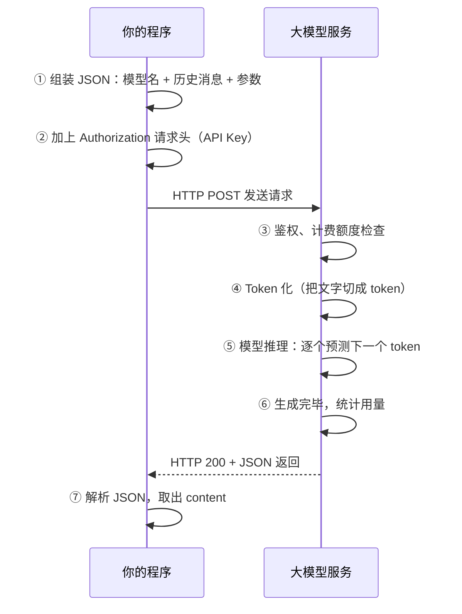

# 02 大模型 API 接入

> 上一篇我们把大模型调通了。这一篇把这件事做扎实：**请求里每个字段是什么意思、多轮对话怎么拼、参数怎么调、失败了怎么办、接其他模型要改哪里**。走完这篇，你就能做出一个能用的命令行聊天程序了。

## 本篇要解决的问题

上一章最后一版代码只能"一问一答"，而且存在这些问题：

- 想聊第二轮怎么办？模型其实不记得你说过什么
- 想换模型是不是要改一堆报文？
- 报错了怎么重试？网络抖一下整个对话就废了
- 到底花了多少钱，怎么知道？

这篇逐个解决，最后给出两种正式接入方式：**裸 HTTP** 和 **Spring AI**。

## 一、把一次调用彻底讲清楚

### 1.1 完整的请求流程



**关键认知：这个过程是同步阻塞的。** 模型的回答是一个 token 一个 token 生成的，通常要几秒甚至几十秒。所以：

- 接口超时时间要设得比普通业务接口长得多
- 前端不能干等着 —— 这就是"流式输出"要解决的问题（第 04 章）

### 1.2 请求字段详解

| 字段 | 类型 | 说明 |
| --- | --- | --- |
| `model` | String | 模型名称，如 `qwen-plus`、`qwen-max`、`deepseek-v3` |
| `messages` | Array | 消息数组，**多轮对话的核心**，按顺序传入 |
| `messages[].role` | String | `system` 系统指令 / `user` 用户 / `assistant` 模型 |
| `messages[].content` | String | 这条消息的内容 |
| `temperature` | Float | 随机性，0～2，默认约 0.7～1.0 |
| `top_p` | Float | 核采样，一般和 temperature 二选一调 |
| `max_tokens` | Int | 本次最多生成多少个 token，控制成本和爆字 |
| `stream` | Boolean | 是否流式返回，第 04 章细讲 |
| `stop` | Array/String | 遇到指定字符串就停止生成 |

### 1.3 响应字段详解

| 字段 | 说明 |
| --- | --- |
| `choices[0].message.content` | **你真正要的内容** |
| `choices[0].finish_reason` | 结束原因：`stop` 正常结束 / `length` 被长度截断 / `tool_calls` 需要调工具 |
| `usage.prompt_tokens` | 输入消耗的 token |
| `usage.completion_tokens` | 输出消耗的 token |
| `usage.total_tokens` | 合计，计费依据 |
| `id` | 本次请求的唯一标识，报障时提供给平台排查用 |

::: warning 记得看 finish_reason
如果返回 `length`，说明**回答被长度截断了**，用户看到的是半截话。生产环境要么调大 `max_tokens`，要么检测到这种情况给用户提示"答案过长已截断"。
:::

## 二、方式一：裸 HTTP 接入（加深理解用）

### 2.1 项目依赖

这种方式只需要 Jackson 处理 JSON，依赖极少：

```xml
<dependencies>
    <!-- Jackson：Java 里最常用的 JSON 处理库 -->
    <dependency>
        <groupId>com.fasterxml.jackson.core</groupId>
        <artifactId>jackson-databind</artifactId>
        <version>2.17.2</version>
    </dependency>
    <!-- 日志门面，可选 -->
    <dependency>
        <groupId>org.slf4j</groupId>
        <artifactId>slf4j-simple</artifactId>
        <version>2.0.13</version>
    </dependency>
</dependencies>
```

### 2.2 一个带多轮对话能力的完整实现

这个类做了三件事：**管理对话历史、发起请求、解析 Token 用量**。

`src/main/java/com/example/ai/RawChatClient.java`

```java
package com.example.ai;

import com.fasterxml.jackson.databind.JsonNode;
import com.fasterxml.jackson.databind.ObjectMapper;
import com.fasterxml.jackson.databind.node.ArrayNode;
import com.fasterxml.jackson.databind.node.ObjectNode;

import java.net.URI;
import java.net.http.HttpClient;
import java.net.http.HttpRequest;
import java.net.http.HttpResponse;
import java.nio.charset.StandardCharsets;
import java.time.Duration;
import java.util.ArrayList;
import java.util.List;

/**
 * 手写一个最简单的聊天客户端。
 *
 * 用意不是让你在项目里这么用，而是把框架幫你隐藏掉的细节摊开：
 *   1. 多轮对话 = 每次把历史消息整个重发
 *   2. Token 用量要从响应里取
 *   3. 失败需要有兜底
 *
 * 真实项目请直接用 Spring AI，它把这些都做好了。
 */
public class RawChatClient {

    /** 阿里云百炼的 OpenAI 兼容端点 */
    private static final String ENDPOINT =
            "https://dashscope.aliyuncs.com/compatible-mode/v1/chat/completions";

    private final String apiKey;
    private final String model;
    private final HttpClient httpClient;
    private final ObjectMapper mapper = new ObjectMapper();

    /** 系统提示词节点，不进历史列表，每次请求时临时拼在最前面 */
    private JsonNode systemNode;

    /**
     * 保存对话历史的地方。
     * 这就是「记忆」的本质 —— 不过是一条 List 而已。
     */
    private final List<JsonNode> history = new ArrayList<>();

    public RawChatClient(String apiKey, String model) {
        this.apiKey = apiKey;
        this.model = model;
        this.httpClient = HttpClient.newBuilder()
                .connectTimeout(Duration.ofSeconds(10))
                .build();
    }

    /**
     * 设置系统提示词，设定模型的角色。
     * 注意：system 消息不进历史列表，因为它对每一轮都生效。
     */
    public void setSystemPrompt(String systemPrompt) {
        ObjectNode node = mapper.createObjectNode();
        node.put("role", "system");
        node.put("content", systemPrompt);
        this.systemNode = node;
    }

    /**
     * 发送一条用户消息，返回模型的回答。
     *
     * @param userInput 用户说的话
     * @return 模型的回答；失败时返回兜底文案
     */
    public String chat(String userInput) {
        try {
            // 1. 把用户的话加入历史
            ObjectNode userMsg = mapper.createObjectNode();
            userMsg.put("role", "user");
            userMsg.put("content", userInput);
            history.add(userMsg);

            // 2. 组装完整消息列表：system（可选）+ 全部历史
            ArrayNode messages = mapper.createArrayNode();
            if (systemNode != null) {
                messages.add(systemNode);
            }
            history.forEach(messages::add);

            // 3. 组装请求体
            ObjectNode body = mapper.createObjectNode();
            body.put("model", model);
            body.set("messages", messages);
            body.put("temperature", 0.7);
            body.put("max_tokens", 2048);

            String jsonBody = mapper.writeValueAsString(body);

            // 4. 构造 HTTP 请求
            HttpRequest request = HttpRequest.newBuilder()
                    .uri(URI.create(ENDPOINT))
                    .header("Content-Type", "application/json")
                    .header("Authorization", "Bearer " + apiKey)
                    .timeout(Duration.ofSeconds(120))   // AI 接口要给足时间
                    .POST(HttpRequest.BodyPublishers.ofString(jsonBody, StandardCharsets.UTF_8))
                    .build();

            // 5. 发送并接收
            HttpResponse<String> response = httpClient.send(
                    request, HttpResponse.BodyHandlers.ofString(StandardCharsets.UTF_8));

            if (response.statusCode() != 200) {
                // 把错误详情打出来，排查问题全靠它
                System.err.println("调用失败，状态码：" + response.statusCode());
                System.err.println("错误内容：" + response.body());
                return "抱歉，服务暂时不可用。";
            }

            // 6. 解析响应
            JsonNode root = mapper.readTree(response.body());
            String answer = root.path("choices").path(0)
                    .path("message").path("content").asText();

            // 7. 把模型的回答也加入历史 —— 这一步千万别漏，否则下一轮模型不知道自己说过啥
            ObjectNode assistantMsg = mapper.createObjectNode();
            assistantMsg.put("role", "assistant");
            assistantMsg.put("content", answer);
            history.add(assistantMsg);

            // 8. 打印本次消耗，养成成本意识
            JsonNode usage = root.path("usage");
            System.out.printf("[本次消耗] 输入 %d tokens，输出 %d tokens，合计 %d%n",
                    usage.path("prompt_tokens").asInt(),
                    usage.path("completion_tokens").asInt(),
                    usage.path("total_tokens").asInt());

            return answer;

        } catch (Exception e) {
            // 网络异常、超时、JSON 解析失败都要兜住，不能让整个线程崩掉
            System.err.println("调用异常：" + e.getMessage());
            return "抱歉，网络好像出了问题，请稍后再试。";
        }
    }

    /** 清空历史，开一个新话题 */
    public void clearHistory() {
        history.clear();
    }

    /** 查看当前历史有多少轮，用于判断是否需要压缩（见 12 章上下文工程） */
    public int historySize() {
        return history.size();
    }
}
```

### 2.3 跑起来

```java
package com.example.ai;

public class ChatDemo {
    public static void main(String[] args) {
        String apiKey = System.getenv("AI_DASHSCOPE_API_KEY");

        RawChatClient client = new RawChatClient(apiKey, "qwen-plus");
        client.setSystemPrompt("你是一位资深的 Java 架构师，回答务实、不啰嗦。");

        System.out.println(client.chat("Spring Boot 里 Bean 的作用域有哪些？"));
        System.out.println("---- 第二轮 ----");
        // 这句话里有代词"第二种"，模型之所以能理解，是因为上一轮的内容被一起发过去了
        System.out.println(client.chat("第二种适合什么场景？"));
    }
}
```

### 2.4 从这个例子必须领悟的三件事

1. **记忆就是一份 List**。所谓的"聊天上下文"，不过是每次请求时把这个 List 原样重发。
2. **每轮都重发全部历史 = 费用越来越高**。这就是后面要讲"上下文压缩"的原因（12 章）。
3. **模型不知道自己在跟谁说话**。它只是看到一个很长的文本，然后往下续写。所有"人格""记忆"都是你的程序伪造出来的。

::: tip 学到了就可以告别手写
手写版的价值只在于理解原理。**真实项目千万别这么干** —— 没有重试、没有连接池、换个模型要改一堆代码、没有流式、没有结构化输出。下面正式接入。
:::

## 三、方式二：用 Spring AI 正式接入

Spring AI 把这些重复劳动全做了。先搭一个最小 Spring Boot 项目。

### 3.1 完整 pom.xml

```xml
<?xml version="1.0" encoding="UTF-8"?>
<project xmlns="http://maven.apache.org/POM/4.0.0"
         xmlns:xsi="http://www.w3.org/2001/XMLSchema-instance"
         xsi:schemaLocation="http://maven.apache.org/POM/4.0.0
         https://maven.apache.org/xsd/maven-4.0.0.xsd">

    <modelVersion>4.0.0</modelVersion>

    <!-- 继承 Spring Boot 父 POM，统一管理 Spring 生态依赖版本 -->
    <parent>
        <groupId>org.springframework.boot</groupId>
        <artifactId>spring-boot-starter-parent</artifactId>
        <version>3.5.5</version>
        <relativePath/>
    </parent>

    <groupId>com.example</groupId>
    <artifactId>ai-demo</artifactId>
    <version>1.0.0</version>

    <properties>
        <java.version>17</java.version>
        <spring-ai.version>1.1.2</spring-ai.version>
        <spring-ai-alibaba.version>1.1.2.0</spring-ai-alibaba.version>
    </properties>

    <dependencies>
        <!-- Web 能力，提供 HTTP 接口 -->
        <dependency>
            <groupId>org.springframework.boot</groupId>
            <artifactId>spring-boot-starter-web</artifactId>
        </dependency>

        <!-- Spring AI Alibaba 的 DashScope starter：封装了通义系列模型的调用 -->
        <dependency>
            <groupId>com.alibaba.cloud.ai</groupId>
            <artifactId>spring-ai-alibaba-starter-dashscope</artifactId>
        </dependency>
    </dependencies>

    <dependencyManagement>
        <dependencies>
            <!-- 两个 BOM 统一管理版本，避免 Spring AI 各模块之间版本冲突 -->
            <dependency>
                <groupId>org.springframework.ai</groupId>
                <artifactId>spring-ai-bom</artifactId>
                <version>${spring-ai.version}</version>
                <type>pom</type>
                <scope>import</scope>
            </dependency>
            <dependency>
                <groupId>com.alibaba.cloud.ai</groupId>
                <artifactId>spring-ai-alibaba-bom</artifactId>
                <version>${spring-ai-alibaba.version}</version>
                <type>pom</type>
                <scope>import</scope>
            </dependency>
        </dependencies>
    </dependencyManagement>

    <build>
        <plugins>
            <plugin>
                <groupId>org.springframework.boot</groupId>
                <artifactId>spring-boot-maven-plugin</artifactId>
            </plugin>
        </plugins>
    </build>
</project>
```

::: warning 依赖很容易踩的坑
Spring AI 生态里 `spring-ai-core`、`spring-ai-model-*`、`spring-ai-alibaba-*` 各模块版本必须对齐。**务必用 BOM 管理，不要自己写各模块的版本号**，否则 Maven 依赖仲裁后会得到一套互相打架的版本，报出来的错往往离谱到看不懂。
:::

### 3.2 配置文件

`src/main/resources/application.yml`

```yaml
spring:
  application:
    name: ai-demo
  ai:
    dashscope:
      # 从环境变量读取，绝不写死在这里
      api-key: ${AI_DASHSCOPE_API_KEY}
      chat:
        options:
          # 模型名称，不同场景换不同的即可
          model: qwen-plus
          # 随机性：0 最确定，1 更有创造性
          temperature: 0.7
          # 单次最多生成 token 数，防止失控
          max-tokens: 2048
      # Embedding 模型，后面 RAG 章节会用到
      embedding:
        options:
          model: text-embedding-v3

server:
  port: 8080

logging:
  level:
    # 打开框架日志，能看清请求和响应，调试阶段非常有用
    org.springframework.ai: DEBUG
```

### 3.3 主启动类

```java
package com.example.ai;

import org.springframework.boot.SpringApplication;
import org.springframework.boot.autoconfigure.SpringBootApplication;

/**
 * 启动类。
 *
 * 引入 spring-ai-alibaba-starter-dashscope 之后，Spring Boot 的自动配置
 * 会读取上面的 yml，自动创建一个 ChatModel Bean 放进容器。
 * 我们不需要写任何创建模型客户端的代码 —— 这就是 starter 的价值。
 */
@SpringBootApplication
public class AiDemoApplication {

    public static void main(String[] args) {
        SpringApplication.run(AiDemoApplication.class, args);
    }
}
```

### 3.4 第一个对话接口

```java
package com.example.ai.controller;

import org.springframework.ai.chat.client.ChatClient;
import org.springframework.web.bind.annotation.GetMapping;
import org.springframework.web.bind.annotation.RequestMapping;
import org.springframework.web.bind.annotation.RequestParam;
import org.springframework.web.bind.annotation.RestController;

/**
 * 对话接口。
 *
 * ChatClient 是 Spring AI 提供的流式 API 入口，
 * 相当于对底层 ChatModel 的一层「更好用的包装」。
 */
@RestController
@RequestMapping("/api/chat")
public class ChatController {

    private final ChatClient chatClient;

    /**
     * 构造器注入 ChatClient.Builder。
     * 这个 Builder 由 Spring Boot 自动配置提供，已经绑定好了 DashScope 的模型。
     */
    public ChatController(ChatClient.Builder builder) {
        this.chatClient = builder
                // defaultSystem 给整个 ChatClient 设定统一的系统提示词
                .defaultSystem("你是一位务实的 Java 架构师，回答要简洁，直接给结论。")
                .build();
    }

    /**
     * 最简单的对话：http://localhost:8080/api/chat/simple?msg=你好
     */
    @GetMapping("/simple")
    public String simpleChat(@RequestParam(defaultValue = "介绍一下你自己") String msg) {
        // Fluent API：prompt() 开始 → user() 设用户输入 → call() 发起调用 → content() 取文本内容
        return chatClient.prompt()
                .user(msg)
                .call()
                .content();
    }
}
```

### 3.5 带 JSON 返回和 Token 统计的版本

实际项目你往往需要知道**花了多少钱**，所以要拿完整的 `ChatResponse` 而不是只有文本：

```java
package com.example.ai.controller;

import org.springframework.ai.chat.client.ChatClient;
import org.springframework.ai.chat.model.ChatResponse;
import org.springframework.ai.chat.model.Usage;
import org.springframework.web.bind.annotation.GetMapping;
import org.springframework.web.bind.annotation.RequestMapping;
import org.springframework.web.bind.annotation.RequestParam;
import org.springframework.web.bind.annotation.RestController;

import java.util.LinkedHashMap;
import java.util.Map;

@RestController
@RequestMapping("/api/chat")
public class ChatDetailController {

    private final ChatClient chatClient;

    public ChatDetailController(ChatClient.Builder builder) {
        this.chatClient = builder.build();
    }

    @GetMapping("/detail")
    public Map<String, Object> detailChat(@RequestParam(defaultValue = "Spring AI 有什么用") String msg) {

        // 这次用 chatResponse() 而不是 content()，拿到完整的响应对象
        ChatResponse response = chatClient.prompt()
                .user(msg)
                .call()
                .chatResponse();

        Map<String, Object> result = new LinkedHashMap<>();
        // 回答内容
        result.put("content", response.getResult().getOutput().getText());
        // 实际使用的模型
        result.put("model", response.getMetadata().getModel());
        // Token 用量 -- 计费依据
        Usage usage = response.getMetadata().getUsage();
        result.put("promptTokens", usage.getPromptTokens());
        result.put("completionTokens", usage.getCompletionTokens());
        result.put("totalTokens", usage.getTotalTokens());

        return result;
    }
}
```

调用 `http://localhost:8080/api/chat/detail` 返回：

```json
{
  "content": "Spring AI 是 Spring 官方提供的 AI 应用开发框架……",
  "model": "qwen-plus",
  "promptTokens": 38,
  "completionTokens": 156,
  "totalTokens": 194
}
```

## 四、多轮对话怎么用框架实现

手写 List 的做法太原始。Spring AI 提供了**会话记忆**的标准机制：

```java
package com.example.ai.config;

import org.springframework.ai.chat.client.ChatClient;
import org.springframework.ai.chat.client.advisor.MessageChatMemoryAdvisor;
import org.springframework.ai.chat.memory.ChatMemory;
import org.springframework.ai.chat.memory.InMemoryChatMemoryRepository;
import org.springframework.ai.chat.memory.MessageWindowChatMemory;
import org.springframework.context.annotation.Bean;
import org.springframework.context.annotation.Configuration;

@Configuration
public class ChatMemoryConfig {

    /**
     * 声明一个基于内存的会话记忆。
     *
     * MessageWindowChatMemory：只保留最近 N 条消息，防止上下文无限膨胀。
     * 这是最常用的实现，生产环境可换成 Redis / JDBC 持久化版本。
     */
    @Bean
    public ChatMemory chatMemory() {
        return MessageWindowChatMemory.builder()
                .chatMemoryRepository(new InMemoryChatMemoryRepository())
                .maxMessages(20)   // 最多记住最近 20 条，超出就丢掉最早的
                .build();
    }
}
```

然后在 Controller 里使用，关键是**每次请求带上会话 ID**：

```java
package com.example.ai.controller;

import org.springframework.ai.chat.client.ChatClient;
import org.springframework.ai.chat.client.advisor.MessageChatMemoryAdvisor;
import org.springframework.ai.chat.memory.ChatMemory;
import org.springframework.web.bind.annotation.GetMapping;
import org.springframework.web.bind.annotation.RequestMapping;
import org.springframework.web.bind.annotation.RequestParam;
import org.springframework.web.bind.annotation.RestController;

@RestController
@RequestMapping("/api/chat")
public class MemoryChatController {

    private final ChatClient chatClient;

    public MemoryChatController(ChatClient.Builder builder, ChatMemory chatMemory) {
        this.chatClient = builder
                .defaultAdvisors(
                        // Advisor 就是 Spring AI 的「切面」，在调用模型前后插入逻辑
                        // MessageChatMemoryAdvisor 负责自动读写会话历史
                        MessageChatMemoryAdvisor.builder(chatMemory).build()
                )
                .build();
    }

    /**
     * 多轮对话：http://localhost:8080/api/chat/memory?sessionId=user-1&msg=你好
     *
     * @param sessionId 会话标识，同一个用户的多轮对话要用同一个 ID
     */
    @GetMapping("/memory")
    public String memoryChat(@RequestParam String sessionId,
                             @RequestParam String msg) {
        return chatClient.prompt()
                .user(msg)
                // 关键：把 sessionId 传给记忆 Advisor，它据此区分不同用户的历史
                .advisors(spec -> spec.param(ChatMemory.CONVERSATION_ID, sessionId))
                .call()
                .content();
    }
}
```

测试一下记忆是否生效：

```bash
# 第一轮
curl "http://localhost:8080/api/chat/memory?sessionId=user-1&msg=我叫张三"
# 第二轮：模型应该知道你叫张三
curl "http://localhost:8080/api/chat/memory?sessionId=user-1&msg=我叫什么名字？"
# 换个 sessionId，模型就不记得了
curl "http://localhost:8080/api/chat/memory?sessionId=user-2&msg=我叫什么名字？"
```

::: tip sessionId 为什么重要
没有会话隔离，所有用户会共享同一份历史 —— **A 问的问题会出现在 B 的对话里**。这是初学者的经典事故。搞 V2 pada的会话，一律先确认 sessionId 怎么传。
:::

## 五、关键参数怎么调

### 5.1 temperature

控制随机性。原理是调整模型在候选词上的概率分布：

| 值 | 表现 | 适合场景 |
| --- | --- | --- |
| 0 ~ 0.2 | 几乎每次输出一致，非常保守 | 数据提取、分类、代码生成、事实问答 |
| 0.5 ~ 0.8 | 平衡 | 日常对话、通用问答 |
| 0.9 ~ 1.2 | 有创意、发散 | 文案创作、头脑风暴 |

**经验**：做业务系统默认给 0.3 左右。你会发现很多"AI 不稳定"的抱怨，把 temperature 调低就解决了。

### 5.2 top_p

核采样：模型只在累计概率达到 `top_p` 的候选 token 里选。日常调试**优先调 temperature**，`top_p` 保持默认即可。两者不要同时猛调。

### 5.3 max_tokens

限制单次生成的最大长度。**强烈建议显式设置**，理由：

1. 防止极端情况下模型一直生成，费用失控
2. 防止返回超长内容把下游程序压垮

```yaml
spring:
  ai:
    dashscope:
      chat:
        options:
          max-tokens: 2048    # 根据业务需要给，不要偷懒给最大值
```

### 5.4 常用模型怎么选

阿里云百炼（DashScope）系列：

| 模型 | 特点 | 适合 |
| --- | --- | --- |
| `qwen-turbo` | 快、便宜 | 简单问答、大量调用 |
| `qwen-plus` | **性价比均衡，日常首选** | 绝大多数业务场景 |
| `qwen-max` | 能力最强、最贵 | 复杂推理、难度高的任务 |
| `qwen-vl-max` | 支持图片输入 | 多模态场景 |

::: tip 选模型的实用方法
**先用 `qwen-plus` 把功能跑通**，遇到它确实处理不了的任务再升级到 `qwen-max`。反过来从 max 开始做，最后会舍不得降级，成本直接起飞。
:::

## 六、接其他模型要改什么

因为用了 OpenAI 兼容协议，切换模型通常只需要改 `base-url` + `api-key` + `model` 三项。

### 6.1 DeepSeek

```yaml
spring:
  ai:
    openai:
      api-key: ${DEEPSEEK_API_KEY}
      base-url: https://api.deepseek.com
      chat:
        options:
          model: deepseek-chat
```

依赖改成 OpenAI 的 starter：

```xml
<dependency>
    <groupId>org.springframework.ai</groupId>
    <artifactId>spring-ai-starter-model-openai</artifactId>
</dependency>
```

### 6.2 用 OpenAI 兼容端点访问通义

如果你希望保持 OpenAI 的 API 风格，也可以这样接 DashScope：

```yaml
spring:
  ai:
    openai:
      api-key: ${AI_DASHSCOPE_API_KEY}
      base-url: https://dashscope.aliyuncs.com/compatible-mode
      chat:
        options:
          model: qwen-plus
```

::: warning 两种方式别混用
`spring-ai-alibaba-starter-dashscope` 和 `spring-ai-starter-model-openai` 会各自创建不同的 `ChatModel` Bean。**同时引入两个 starter，注入时会出现多个候选 Bean 导致启动失败。** 选一种，然后专注用到底。
:::

## 七、API Key 的安全管理

这是必须遵守的红线：

```java
// 错误示范：Key 硬编码，提交到 Git 就被盗刷
private static final String API_KEY = "sk-abc123def456";

// 正确：从环境变量或配置中心读取
String key = System.getenv("AI_DASHSCOPE_API_KEY");
```

配套动作：

1. `application.yml` 里只写 `${AI_DASHSCOPE_API_KEY}` 占位符
2. `.gitignore` 里加上 `application-local.yml`、`*.env`
3. 生产环境用配置中心（Nacos / K8s Secret）下发
4. 给 Key 设置**额度上限**，就算泄露损失也可控
5. 定期轮换 Key

::: danger Git 提交前必查
Key 泄露后往往几分钟内就被自动化脚本扫到。如果怀疑泄露，**第一时间是去控制台禁用**，而不是删除提交记录 —— 删了历史，GitHub 的 fork 和缓存里可能还在。
:::

## 八、超时、重试与限流

AI 接口和普通接口不一样：**慢、可能超时、可能被限流**。生产环境必须处理。

### 8.1 设置超时

```yaml
spring:
  ai:
    dashscope:
      api-key: ${AI_DASHSCOPE_API_KEY}
      # 不同版本配置项名称可能略有差异，以官方文档为准
      chat:
        options:
          model: qwen-plus
```

超时还需要在 HTTP 客户端层面控制，Spring AI 的 starter 一般提供对应的 `connect-timeout` / `read-timeout` 配置。**如果不生效，可以自定义底层客户端 Bean 来兜底。**

### 8.2 自己加重试

网络抖动导致的偶发失败，加一层重试就能救回来很大比例：

```java
package com.example.ai.service;

import io.github.resilience4j.retry.Retry;
import io.github.resilience4j.retry.RetryConfig;
import org.springframework.ai.chat.client.ChatClient;
import org.springframework.stereotype.Service;

import java.time.Duration;

/**
 * 用 Resilience4j 给模型调用加重试。
 *
 * 依赖：io.github.resilience4j:resilience4j-retry
 */
@Service
public class RetryableChatService {

    private final ChatClient chatClient;
    private final Retry retry;

    public RetryableChatService(ChatClient.Builder builder) {
        this.chatClient = builder.build();

        // 配置重试策略：最多重试 3 次，每次间隔 2 秒
        RetryConfig config = RetryConfig.custom()
                .maxAttempts(3)
                .waitDuration(Duration.ofSeconds(2))
                // 只对异常重试（不建议对业务性失败重试）
                .retryOnException(throwable -> true)
                .build();

        this.retry = Retry.of("chatRetry", config);
    }

    public String chat(String message) {
        // 用重试器包住调用逻辑
        return Retry.decorateSupplier(retry, () ->
                chatClient.prompt().user(message).call().content()
        ).get();
    }
}
```

需要加入依赖：

```xml
<dependency>
    <groupId>io.github.resilience4j</groupId>
    <artifactId>resilience4j-retry</artifactId>
    <version>2.2.0</version>
</dependency>
```

::: tip 重试要注意幂等性
每次重试都会**重新计费**。重试前想清楚：这个请求失败了重来一次是安全的吗？涉及写操作（比如"帮我发一封邮件"）时，重试可能导致重复执行。
:::

## 九、成本控制

三个最有效的手段：

1. **给 `max_tokens` 设上限** —— 防止单次生成失控
2. **控制历史消息长度** —— `MessageWindowChatMemory` 的 `maxMessages`，或做上下文压缩（12 章）
3. **记录每一次调用的 Token 消耗** —— 有了数据才知道钱花在哪

一个最小的成本统计切面：

```java
package com.example.ai.aspect;

import org.aspectj.lang.ProceedingJoinPoint;
import org.aspectj.lang.annotation.Around;
import org.aspectj.lang.annotation.Aspect;
import org.slf4j.Logger;
import org.slf4j.LoggerFactory;
import org.springframework.ai.chat.model.ChatResponse;
import org.springframework.stereotype.Component;

/**
 * 统一记录调用的耗时与 Token 消耗。
 *
 * 依赖：org.springframework.boot:spring-boot-starter-aop
 */
@Aspect
@Component
public class ChatCostAspect {

    private static final Logger log = LoggerFactory.getLogger(ChatCostAspect.class);

    /**
     * 切 com.example.ai.service 包下所有方法。
     * 想精确控制可以换成自定义注解的方式。
     */
    @Around("execution(* com.example.ai.service..*(..))")
    public Object logCost(ProceedingJoinPoint joinPoint) throws Throwable {
        long start = System.currentTimeMillis();
        try {
            Object result = joinPoint.proceed();

            // 如果返回的是 ChatResponse，顺便把 Token 用量记下来
            if (result instanceof ChatResponse response) {
                var usage = response.getMetadata().getUsage();
                log.info("[AI调用] {} 耗时 {} ms，输入 {} tokens，输出 {} tokens",
                        joinPoint.getSignature().toShortString(),
                        System.currentTimeMillis() - start,
                        usage.getPromptTokens(),
                        usage.getCompletionTokens());
                return result;
            }

            log.info("[AI调用] {} 耗时 {} ms",
                    joinPoint.getSignature().toShortString(),
                    System.currentTimeMillis() - start);
            return result;

        } catch (Throwable ex) {
            log.error("[AI调用失败] {} 耗时 {} ms，原因：{}",
                    joinPoint.getSignature().toShortString(),
                    System.currentTimeMillis() - start,
                    ex.getMessage());
            throw ex;
        }
    }
}
```

## 本篇小结

- **大模型是无状态的**，所谓"记忆"就是你把历史消息每次重发一遍。
- **裸 HTTP 接入**适合理解原理，**Spring AI 接入**才是生产用法 —— 一个 starter + 一份 yml 就能干活。
- **多轮对话必须隔离 sessionId**，否则不同用户会串台。
- **参数里最重要的是 temperature 和 max_tokens**，前者决定稳定性，后者决定成本上限。
- **切换模型通常只改三个配置**：`base-url`、`api-key`、`model`。但别同时引入两个 starter。
- **API Key 必须用环境变量**，这是红线。
- **超时重试要自己做**，并且注意重试会重复计费。

到这里你已经能做出一个能聊天的后端服务了。但你会发现模型的回答经常"差点意思" —— 下一章用零成本的方式解决它：**提示词工程**。

## 参考链接

- 阿里云百炼控制台：<https://bailian.console.aliyun.com/>
- DashScope OpenAI 兼容 API 文档：<https://help.aliyun.com/zh/model-studio/>
- Spring AI 官方文档：<https://docs.spring.io/spring-ai/reference/>
- Resilience4j：<https://resilience4j.readme.io/>

下一篇 → [03 提示词工程](/java/ai/prompt)
