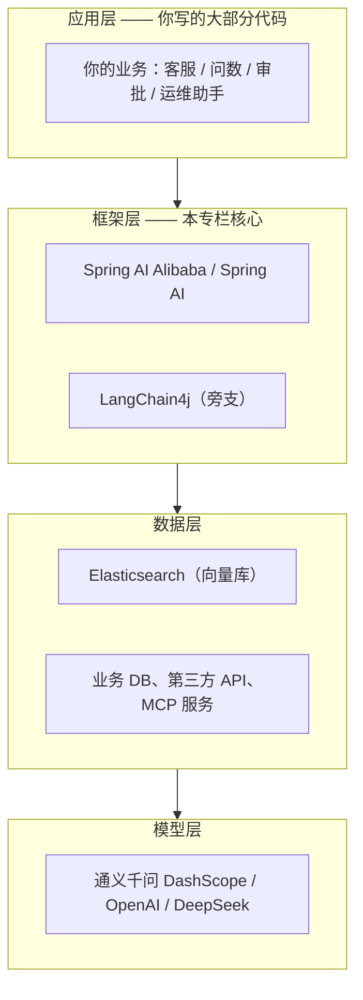

# 01 AI 开发概览

> 本篇不急着写代码，先解决一个更根本的问题：**大模型到底是什么东西，Java 程序员在这波浪潮里到底要做什么**。搞懂这个，后面所有章节的学习成本都会降一半。

## 本篇要解决的问题

很多 Java 同学接触 AI 应用时被一堆名词劝退：Embedding、向量检索、Agent、ReAct、Graph、MCP……听起来像是要从头学一门新学科。

但实际上，**你过去写业务系统的能力完全没有作废** —— 你不需要训练模型（那是算法工程师的活），你要做的是：**调用模型的能力，加上你自己的数据和业务逻辑，拼出一个能解决具体问题的应用。**

这一章会把整件事的地基打一遍：

- 大模型到底是什么，用一个比喻讲透
- 一次调用背后发生了什么
- Java 开发者真正要干的活是什么
- AI 应用的四种形态逐级演进
- 本专栏的技术栈基线和阅读路线

## 一、先把大模型祛魅：它其实是个"超级续写机器"

### 1.1 一个比喻

把大模型想象成一个**读过互联网上几乎所有文本的人**，你给他一段文字，他接下去往下写。

- 你写"床前明月光，"他就写"疑是地上霜。" —— 这是**背诵**
- 你写"请把下面这句话翻译成英文：今天天气真好。"他就写"Today is a nice day." —— 这是**翻译**
- 你写"帮我写一封请假条，理由是感冒，时间是明天一天。"他就写出一封格式完整的请假条 —— 这是**生成**
- 你写"Java 里 HashMap 和 ConcurrentHashMap 的区别是"他会给出对比分析 —— 这是**问答**

你看，**这些任务的形式完全一样：你给一段文字，它往下续写**。区别只在于你给的那段文字（也就是"提示词"）把它导向了不同的行为。

::: tip 这就是全部秘密
**大模型唯一的能力是"预测下一个字"**（严格说是下一个 Token）。所谓的智能，是在足够大的数据和足够大的模型规模之上，从"预测"这件事里涌现出来的。

理解这一点非常重要 —— 后面你搞不懂"为什么模型会瞎编""为什么要写提示词""为什么需要 RAG"，根子都在这里。它只是在续写一段看起来最合理的文字，**它并不知道事实**。
:::

### 1.2 Token：模型眼中的字

在模型眼里，文本不是一个一个汉字组成的，而是被切成 **Token**（词元）。

你可以粗略地这样理解：

| 文本 | 大概会被切成 |
| --- | --- |
| `Hello` | 1 个 token 左右 |
| `今天天气真好` | 4～6 个 token |
| `Spring Boot` | 2～4 个 token |

细节不用深究，但**这个概念直接影响两件事**：

1. **计费** —— 大模型按 Token 收费，输入和输出都算钱。所以上下文塞得越长，花的钱越多。
2. **长度上限** —— 每个模型都有"上下文窗口"，比如 128K tokens，指的是一次对话中它能"看到"的总量（输入 + 输出）。超出部分会被截断。**这就是为什么前面几十轮聊天内容会被"忘掉"。**

::: warning 一个很常见的误解
模型"记不住事了"不是因为它笨，而是**上下文窗口被占满了**。这也是后续「上下文工程」那一章存在的理由 —— 怎么在有限的窗口里塞进最重要的信息，是 Agent 开发的核心难题之一。
:::

### 1.3 一次调用在干什么

不管上层框架包装得多花哨，调用大模型本质上就是**发一个 HTTP 请求**。请求里带着"你给的那段话"，响应里带着"模型续写的话"。

下面是一个真实的请求体（JSON）：

```json
{
  "model": "qwen-plus",
  "messages": [
    { "role": "system", "content": "你是一个乐于助人的助手。" },
    { "role": "user", "content": "用一句话解释什么是 Java。" }
  ],
  "temperature": 0.7
}
```

对应的响应：

```json
{
  "choices": [
    {
      "message": {
        "role": "assistant",
        "content": "Java 是一门广泛使用的面向对象编程语言……"
      }
    }
  ],
  "usage": {
    "prompt_tokens": 26,
    "completion_tokens": 43,
    "total_tokens": 69
  }
}
```

四个关键点：

- `role: system` —— 设定模型的"人格"和行为准则，优先级最高
- `role: user` —— 你说的话
- `role: assistant` —— 模型的回复
- `usage` —— 本次消耗的 Token 数，也就是计费依据

**多轮对话的原理**：每一轮都把**完整的历史对话**重新发一遍。模型本身是无状态的，它不"记得"你上一句说了什么，是你每次都把记录重新喂给它。所以对话越长，请求体越大，花的钱越多。

## 二、Java 开发者在 AI 应用里干什么

明确一下分工，避免把力气用错地方：

| 角色 | 做什么 | 用什么 |
| --- | --- | --- |
| 算法工程师 | 预训练模型、微调、对齐 | PyTorch、GPU 集群 |
| **你（应用开发者）** | 调用模型 API、组织 Prompt、对接自己公司的数据和业务、做工程化 | **Java / Spring / Spring AI Alibaba** |

你的核心价值在于：

1. **把模型能力接到真实业务里** —— 查订单、查库存、查政策文档
2. **给它装上"手"和"眼"** —— 让它能调你系统的接口（工具调用）
3. **给它装上"记忆"** —— 让它能访问你公司的知识库（RAG）
4. **把 Demo 变成能上线的系统** —— 流式响应、超时重试、成本控制、可观测、权限隔离

::: tip 一句话概括
**大模型负责"聪明"，你负责"靠谱"。** 一个能上线的 AI 应用，绝大部分代码其实是围绕模型的那层工程 —— 这恰好是 Java 工程师最擅长的部分。
:::

## 三、AI 应用的四种形态

这是理解本专栏目录结构的**关键框架**。能力是一级一级叠上去的：

### 形态 1：纯对话

直接把用户的话丢给模型，模型自己回答。

```text
用户 ──→ 大模型 ──→ 回答
```

**缺点**：只有模型的"通识"，不知道你的私有数据；知识有截止日期；会编造内容。

### 形态 2：RAG（检索增强生成）

回答之前，先去你自己的知识库里查资料，把查到的内容塞进提示词，让模型"照着材料回答"。

```text
用户提问 ──→ 去知识库检索 ──→ 把资料塞进提示词 ──→ 大模型作答
```

**解决了**：私有数据问答、减少幻觉。对应本专栏 **19、20 两章**。

### 形态 3：Agent（智能体）

给模型挂上"工具"，它能自己判断要不要调用工具、调用哪个、拿到结果后接着推理，循环往复直到任务完成。

```text
用户 → 模型思考 → 决定调用工具A → 拿到结果 → 继续思考 → 调用工具B → … → 给出答案
```

**解决了**：模型只能"说"不能"做"的问题。对应本专栏 **10 ReactAgent、18 Tool 与 MCP**。

### 形态 4：多 Agent 与工作流

单个 Agent 搞不定复杂任务，就拆成多个专职 Agent，像团队一样协作，还能精确控制流程。

```text
       ┌→ 检索 Agent ─┐
主管 → ├→ 分析 Agent ─┤ → 汇总 → 输出
       └→ 写作 Agent ─┘
```

**解决了**：复杂任务的可靠性和可控性。对应本专栏 **11 多 Agent 编排、14～16 的 Graph 三章**。

::: warning 别跳级
很多团队一上来就要做形态 4，失败了就觉得 AI 不行。**绝大多数业务场景，形态 2 加一点形态 3 就够用了。** 按这个顺序来：先把对话跑通，再加检索，再加工具，最后才考虑编排。
:::

## 四、技术全景图

把整件事分层看，会更清楚你要学什么：



对应到 Spring AI Alibaba 的三层架构（第 07 章会详细展开）：

| 层 | 作用 | 什么时候接触 |
| --- | --- | --- |
| **Agent Framework** | 高层抽象，ReactAgent 等 | 日常开发，绝大多数场景从这里开始 |
| **Graph** | 底层工作流与多 Agent 编排运行时 | 需要精确控制流程时 |
| **Augmented LLM** | 模型、工具、向量存储等原子能力 | 接入模型、定义工具、做 RAG 时 |

## 五、本专栏的统一技术基线

后面所有章节的代码都基于下面这套**固定组合**，避免每章换一套依赖看得头晕。

| 项 | 版本 / 选型 |
| --- | --- |
| JDK | **17**（Spring AI Alibaba 的硬要求） |
| 构建工具 | Maven 3.6+ |
| Spring Boot | 3.5.x |
| Spring AI | 1.1.x |
| Spring AI Alibaba | 1.1.2.x |
| 大模型 | 阿里云百炼 DashScope（通义千问系列） |
| 向量库 | **Elasticsearch 8.x**（本专栏统一使用） |

涉及的依赖，后面章节会给出完整的 `pom.xml`，这里先有个印象：

```xml
<!-- 所有 Spring AI 相关依赖统一由 BOM 管理版本，避免版本打架 -->
<dependency>
    <groupId>org.springframework.ai</groupId>
    <artifactId>spring-ai-bom</artifactId>
    <version>1.1.2</version>
    <type>pom</type>
    <scope>import</scope>
</dependency>
<dependency>
    <groupId>com.alibaba.cloud.ai</groupId>
    <artifactId>spring-ai-alibaba-bom</artifactId>
    <version>1.1.2.0</version>
    <type>pom</type>
    <scope>import</scope>
</dependency>
```

### 需要准备的环境

1. **JDK 17** —— 务必确认版本，Spring AI Alibaba 跑不起来最常见的原因就是 JDK 版本不对

   ```bash
   java -version
   # 需要看到 17.x.x
   ```

2. **阿里云百炼 API Key** —— 到 <https://bailian.console.aliyun.com/> 创建，创建后立刻保存（只显示一次）

3. **不要把 Key 写进代码里**。设置环境变量，后面所有章节都从环境变量读取：

   ```bash
   # Windows PowerShell
   $env:AI_DASHSCOPE_API_KEY="sk-xxxxxxxxxx"

   # Linux / macOS
   export AI_DASHSCOPE_API_KEY=sk-xxxxxxxxxx
   ```

   ::: danger 血泪教训
   Key 一旦提交到公开仓库，很快就会被扫描到并盗刷，产生真实账单。**务必用环境变量或配置中心，并且加到 `.gitignore`。**
   :::

4. **Elasticsearch 8.x** —— 从 19 章开始用，到时候会给完整的 Docker 启动命令

## 六、动手：不依赖任何框架，调通第一次大模型调用

光看概念没手感，我们**不用 Spring，不用任何 AI 框架**，只用 JDK 自带的能力发一个 HTTP 请求，把大模型调通。

这样做的好处：你会亲眼看到所谓"调用大模型"就是这么朴素的一件事，后面框架再怎么封装也不会心里发虚。

### 完整代码

路径：`src/main/java/com/example/ai/HelloLlm.java`

```java
package com.example.ai;

import java.io.IOException;
import java.net.URI;
import java.net.http.HttpClient;      // JDK 11+ 自带的 HTTP 客户端
import java.net.http.HttpRequest;
import java.net.http.HttpResponse;
import java.nio.charset.StandardCharsets;
import java.time.Duration;

/**
 * 零依赖调用大模型示例。
 *
 * 目的：让你看清「调用大模型」的本质就是一次 HTTP POST 请求。
 * 后面的 Spring AI / Spring AI Alibaba 都是在这个基础上做封装，
 * 理解了这里，再看框架就不会觉得是黑魔法。
 *
 * 运行前请先设置环境变量：AI_DASHSCOPE_API_KEY
 */
public class HelloLlm {

    // 阿里云百炼的 OpenAI 兼容端点：用 OpenAI 的报文格式，访问国产大模型
    private static final String ENDPOINT =
            "https://dashscope.aliyuncs.com/compatible-mode/v1/chat/completions";

    public static void main(String[] args) throws IOException, InterruptedException {

        // 1. 从环境变量读取 API Key，绝对不能硬编码到代码里
        String apiKey = System.getenv("AI_DASHSCOPE_API_KEY");
        if (apiKey == null || apiKey.isBlank()) {
            throw new IllegalStateException("请先设置环境变量 AI_DASHSCOPE_API_KEY");
        }

        // 2. 组装请求体 JSON
        //    system 消息：给模型设定角色和行为准则，优先级最高
        //    user   消息：用户真正的问题
        //    注意：手写 JSON 时引号需要转义，实际项目里建议用 Jackson 构造
        String requestBody = """
                {
                  "model": "qwen-plus",
                  "messages": [
                    {
                      "role": "system",
                      "content": "你是一个 Java 技术专家，回答要简洁，控制在 100 字以内。"
                    },
                    {
                      "role": "user",
                      "content": "用一句话解释什么是 Spring Boot 的自动配置。"
                    }
                  ],
                  "temperature": 0.7
                }
                """;

        // 3. 创建 HTTP 客户端
        //    AI 调用通常比普通接口慢很多，超时时间一定要给够
        HttpClient client = HttpClient.newBuilder()
                .connectTimeout(Duration.ofSeconds(10))
                .build();

        // 4. 构造 POST 请求
        HttpRequest request = HttpRequest.newBuilder()
                .uri(URI.create(ENDPOINT))
                .header("Content-Type", "application/json")
                .header("Authorization", "Bearer " + apiKey)  // API Key 放在请求头
                .timeout(Duration.ofSeconds(60))               // 整体超时
                .POST(HttpRequest.BodyPublishers.ofString(requestBody, StandardCharsets.UTF_8))
                .build();

        // 5. 发送请求并接收响应
        HttpResponse<String> response = client.send(
                request,
                HttpResponse.BodyHandlers.ofString(StandardCharsets.UTF_8)
        );

        // 6. 打印状态码和响应内容
        System.out.println("HTTP 状态码: " + response.statusCode());
        System.out.println("响应内容:");
        System.out.println(response.body());
    }
}
```

### 不需要任何第三方依赖

上面这段代码只用了 JDK 自带的类，**连 Maven 依赖都不需要**，直接编译运行：

```bash
javac HelloLlm.java
java HelloLlm
```

### 运行结果

你会看到类似这样的返回（内容每次略有不同，因为模型生成是有随机性的）：

```json
{
  "choices": [
    {
      "message": {
        "role": "assistant",
        "content": "自动配置是 Spring Boot 根据 classpath 中的依赖自动推断并注册所需 Bean 的机制，让你无需手写大量 XML 或 Java 配置。"
      }
    }
  ],
  "usage": {
    "prompt_tokens": 45,
    "completion_tokens": 38,
    "total_tokens": 83
  }
}
```

### 从这段代码应该得出的四个结论

1. **大模型调用就是一次 HTTP 调用**，没有黑魔法。
2. **多轮对话 = 每次重发完整历史**。可以试着在 `messages` 数组里多塞两条 `assistant` 和 `user` 记录，模型就能"接得上话"。
3. **`temperature` 控制随机性**。越低越稳定保守（适合回答事实性问题）；越高越发散（适合写文案、头脑风暴）。
4. **`usage` 就是账单**。每调一次都记下来，这是成本控制的起点。

::: tip 那么框架到底帮我们做了什么
上面这段代码虽然能跑，但一旦要落地就会遇到一堆问题：超时重试怎么办、换个模型是不是要改报文、流式输出怎么实现、历史对话怎么管理、Token 怎么统计、失败怎么兜底……

**这些才是 Spring AI 和 Spring AI Alibaba 存在的意义。** 带着这些痛点往后读，你会发现框架的每一个抽象都对应一个真实存在的麻烦。
:::

## 七、本专栏阅读路线

```text
基础篇 01-06
  ├── 01 AI 开发概览                    ← 你在这里
  ├── 02 大模型 API 接入                建立第一手感
  ├── 03 提示词工程                    零成本提升效果的技巧
  ├── 04 流式输出与 Function Calling
  ├── 05 Spring AI 框架                核心抽象，强烈建议读
  └── 06 LangChain4j 框架              横向对照，可选

Spring AI Alibaba 07-18
  ├── 07-09  三层架构 / 快速上手 / 版本生态
  ├── 10-13  ReactAgent / 多 Agent 编排 / 上下文工程 / 人机协同
  ├── 14-16  Graph 三连：构图 / 状态 / 持久化
  └── 17-18  模型接入 / Tool 与 MCP

检索增强 19-20
  └── Elasticsearch 向量库 + RAG 调优

工程化 21-24
  └── 可观测 / Studio 与 Admin / 实战案例 / FAQ
```

::: tip 按基础选路线
- **完全零基础**：按 01 → 02 → 03 → 05 → 07 → 08 的顺序走，先跑起来建立体感。
- **已经调过 OpenAI / 通义 API**：跳过 01、02，直接从 03 开始。
- **只想快速用 SAA 做项目**：重点看 07、08、10、17、18、19。
:::

## 八、术语速查表

后面章节会反复出现这些词，先混个脸熟：

| 术语 | 大白话解释 |
| --- | --- |
| **Token** | 模型处理文本的基本单位，也是计费单位。粗略估算中文一个字约等于 1 个 token |
| **Prompt（提示词）** | 你发给模型的全部内容，包含系统设定、历史对话、当前问题 |
| **Completion（补全）** | 模型返回的内容。这个词本身就残留了"续写机器"的本质 |
| **Embedding（向量化）** | 把一段文字转成一串数字，语义相近的文字会得到相似的数字，这是语义搜索的基础 |
| **向量相似度** | 比较两个向量的距离，用来找语义相近的内容，RAG 的技术底座 |
| **上下文窗口** | 模型一次能看到的最大 token 数，超出就"忘事" |
| **幻觉 Hallucination** | 模型一本正经地编造不存在的事实 |
| **Function Calling** | 让模型输出"我要调用哪个函数、参数是什么"，由你的代码真正去执行 |
| **Agent（智能体）** | 能自主思考、调用工具、循环执行直到完成任务的程序 |
| **ReAct** | Agent 的经典范式：Reason 推理 + Act 行动，两者交替进行 |
| **RAG** | 检索增强生成：先查资料再回答 |
| **MCP** | Model Context Protocol，工具调用的标准协议，让工具能跨项目复用 |

## 本篇小结

- **大模型的本质是"预测下一个 Token"**，所有能力都从这个基础上涌现。它并不知道事实，只知道什么内容看起来最合理。
- **调用大模型就是一次 HTTP 请求**：带 API Key、模型名和消息数组，返回续写内容和 Token 用量。
- **Java 开发者的活是把模型接到业务里**：给数据（RAG）、给工具（Agent）、给可靠性（工程化）。这才是你的主场。
- **应用形态四级演进**：对话 → RAG → Agent → 多 Agent 工作流，不要跳级。
- 本专栏统一技术栈：**JDK 17 + Spring Boot 3.5 + Spring AI + Spring AI Alibaba + Elasticsearch**。

## 参考链接

- 阿里云百炼控制台：<https://bailian.console.aliyun.com/>
- Spring AI 官方文档：<https://docs.spring.io/spring-ai/reference/>
- Spring AI Alibaba 官网：<https://java2ai.com/>
- Spring AI Alibaba GitHub：<https://github.com/alibaba/spring-ai-alibaba>

下一篇 → [02 大模型 API 接入](/java/ai/llm-api)
