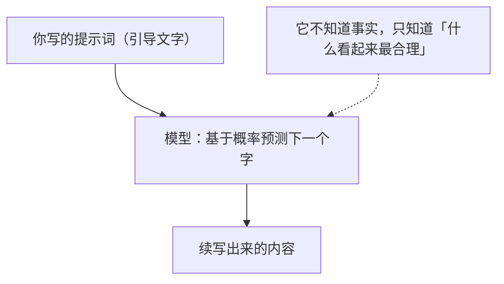
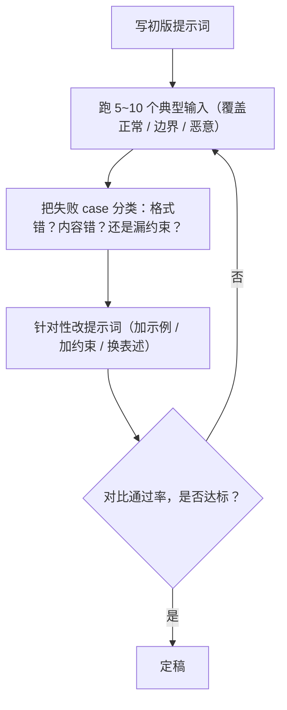

# 03 提示词工程

> 模型没变、代码没变，只改提示词就能让效果上一个台阶的方法论。这一章不讲玄学，只讲"怎么用文字把一只超级续写机器调教成你想要的样子"。

## 本篇要解决的问题

上一章（02）我们学会了怎么把大模型调通、怎么接多轮对话、怎么换模型。但你很快就会遇到一个尴尬：

- 同样一句话，换个说法，模型回答质量天差地别。
- 你让它"返回 JSON"，它偏要给你加一句"好的，以下是结果："然后才输出 JSON。
- 你让它"只回答事实"，它照样一本正经地编。

这些都不是代码 bug，而是**提示词（Prompt）没写好**。这一章解决的就是这个"差一口气"的问题——而且它几乎是**零成本**的：不换模型、不加算力、不改架构，纯粹靠把话说清楚。

读完你会掌握：

- 为什么提示词能"决定一切"（和它到底能不能决定一切）
- System / User / Assistant 三种消息分别是什么、怎么用
- 角色设定、约束、少样本、思维链这些经典套路
- 怎么让模型乖乖吐结构化数据（JSON）
- 怎么把提示词抽成模板文件，交给不懂 Java 的同事维护
- 常见反模式与一套可落地的迭代调试方法

## 一、为什么提示词能"决定一切"（呼应 01 章）

在 01 章我们给大模型下了个定义：**它本质是个"超级续写机器"，唯一能力是预测下一个 Token**。请务必把这句话刻在脑子里，因为提示词工程的全部魔法都源于此。

回到那个比喻：你给模型一段文字，它往下续写。你给的这段"引导文字"就是提示词。模型续写的质量，几乎完全取决于你给的引导有多精准。



::: tip 关键推论
模型没有"理解"你的意图，它只是在**猜测**：在看到你这段话之后，最合理的下一句是什么。

所以"提示词决定一切"真正的意思是：**你给的上下文越能锚定模型的概率分布，输出就越接近你想要的结果。** 你不能命令模型，你只能"引导"它。
:::

::: warning 但也别神话提示词
提示词不是万能药。它有天花板：
1. 模型本身能力的上限，提示词救不了（比如 qwen-plus 算不清的复杂数学，怎么写提示词都难）。
2. 模型会"幻觉"——它续写时并不知道事实，提示词只能降低概率，不能根除。
3. 超出上下文窗口的内容，你塞不进去，提示词再漂亮也没用。

提示词是性价比最高的优化手段，但排在它后面的还有 RAG（喂真实资料）、Fine-tuning（微调）、Agent（给工具）等手段。
:::

## 二、一条 Prompt 的完整结构

在 OpenAI / DashScope 这套协议里，一次请求的消息数组由三种角色的消息组成。Spring AI 把它们抽象成了 `Message` 接口的三个实现类。

| 角色 | 类名 | 谁写的 | 作用 |
| --- | --- | --- | --- |
| `system` | `SystemMessage` | 你（开发者） | 设定模型人格、规则、约束，**优先级最高** |
| `user` | `UserMessage` | 用户 | 这一轮真正的问题或指令 |
| `assistant` | `AssistantMessage` | 模型 | 模型上一轮的回答，**用于多轮对话记忆** |

它们的本质，正如 02 章说的：都是塞进同一个文本里的"引导文字"，只是贴了不同的角色标签，帮模型区分"这是规则""这是用户说的""这是我之前说的"。

下面用最低层的 `ChatModel` API 演示三种消息怎么拼：

`src/main/java/com/example/ai/prompt/RoleDemo.java`

```java
package com.example.ai.prompt;

import org.springframework.ai.chat.client.ChatClient;
import org.springframework.ai.chat.messages.AssistantMessage;
import org.springframework.ai.chat.messages.SystemMessage;
import org.springframework.ai.chat.messages.UserMessage;
import org.springframework.ai.chat.model.ChatResponse;
import org.springframework.ai.chat.prompt.Prompt;

import java.util.List;

/**
 * 演示 System / User / Assistant 三种消息的拼装。
 *
 * 这里故意用最低层的 ChatModel.call(Prompt) 写法，
 * 让你看清"所谓多轮对话，就是把历史 assistant 消息一起再发一遍"。
 */
public class RoleDemo {

    private final ChatClient chatClient;

    public RoleDemo(ChatClient.Builder builder) {
        this.chatClient = builder.build();
    }

    public String demo() {
        // 1. system 消息：设定人格与规则，对后续每一轮都生效
        SystemMessage system = new SystemMessage(
                "你是一位严谨的法律助理，只依据给定事实回答，不知道就说不知道，不编造。");

        // 2. user 消息：用户这一轮的问题
        UserMessage user = new UserMessage("张三借给李四 10 万元，有借条，李四赖账不还，张三能起诉吗？");

        // 3. assistant 消息：模型上一轮的回答（假设这是第二轮，把这轮历史也带上）
        AssistantMessage history = new AssistantMessage(
                "能。有借条证明借贷关系，张三可以提起民间借贷纠纷诉讼。");

        // 4. 把三种消息拼成一个 Prompt 发给模型
        //    注意顺序：system 在最前，然后是历史，最后是当前 user
        Prompt prompt = new Prompt(List.of(system, history, user));

        ChatResponse response = chatClient.prompt(prompt).call().chatResponse();
        return response.getResult().getOutput().getText();
    }
}
```

::: tip System 消息为什么优先级最高
很多模型在训练时就被强化了一个习惯：**优先服从 system 里的指令**。所以"你是一个xxx""你只能xxx""禁止xxx"这类全局规则，一定要放 system，而不是混在 user 里。否则模型很容易把你的规则当成普通闲聊忽略掉。
:::

## 三、角色设定与任务边界

"角色设定"（Role Prompting）是提示词工程里最基础、性价比最高的一招：**告诉模型"你是谁"，它的回答风格和质量会立刻不一样**。

原理还是回到续写机器：当你在开头写"你是一位有 20 年经验的 Java 架构师"，模型后续续写时，会倾向于生成符合"资深架构师"语气的文本——用词更专业、更敢下判断、更简洁。

`src/main/java/com/example/ai/prompt/RoleController.java`

```java
package com.example.ai.prompt;

import org.springframework.ai.chat.client.ChatClient;
import org.springframework.web.bind.annotation.GetMapping;
import org.springframework.web.bind.annotation.RequestMapping;
import org.springframework.web.bind.annotation.RequestParam;
import org.springframework.web.bind.annotation.RestController;

/**
 * 角色设定示例。
 *
 * 关键在 defaultSystem：给整个 ChatClient 设定统一人格。
 * 所有走这个 client 的请求都会自动带上这段系统提示词。
 */
@RestController
@RequestMapping("/api/prompt/role")
public class RoleController {

    private final ChatClient chatClient;

    public RoleController(ChatClient.Builder builder) {
        this.chatClient = builder
                // defaultSystem 设定"你是谁" + "你的边界是什么"
                .defaultSystem("""
                        你是一位有 20 年经验的 Java 架构师。
                        回答要求：
                        1. 直接给结论，不要寒暄。
                        2. 必要时给出关键代码片段，使用 Java 17 语法。
                        3. 如果问题超出你的知识或涉及不确定事实，明确说明"不确定"。
                        4. 禁止编造 API 名称或版本号。
                        """)
                .build();
    }

    @GetMapping("/design")
    public String design(@RequestParam(defaultValue = "什么时候该用 synchronized，什么时候该用 ReentrantLock？") String q) {
        return chatClient.prompt()
                .user(q)
                .call()
                .content();
    }
}
```

### 3.1 任务边界（约束）怎么写才有效

光说"你是架构师"往往不够，要给它**明确的边界和评判标准**。经验法则：

| 写法 | 效果 |
| --- | --- |
| "你帮我写个接口" | 模糊，模型自由发挥，质量飘 |
| "用 Spring Boot 3 写一个 REST 接口，入参校验用 @Valid，返回统一 Result 结构，带完整注释" | 边界清晰，产出可直接用 |

约束的常用维度（按需要组合）：

- **格式约束**："只返回 JSON""用 Markdown 表格""不超过 100 字"。
- **内容约束**："只依据提供的事实""禁止编造""不确定就明说"。
- **风格约束**："口语化""给管理者看的""给新手看的"。
- **步骤约束**："先列方案，再给推荐，最后说风险"。

## 四、少样本示例 Few-shot

如果你想要的输出格式比较特殊，单纯用文字描述不如**直接给它看几个例子**。这就是 Few-shot（少样本提示）。

原理：模型是续写机器，你给它看"问题→标准答案"的范例，它就会模仿这个模式继续续写。例子越多、越典型，模仿越准。

`src/main/java/com/example/ai/prompt/FewShotController.java`

```java
package com.example.ai.prompt;

import org.springframework.ai.chat.client.ChatClient;
import org.springframework.web.bind.annotation.GetMapping;
import org.springframework.web.bind.annotation.RequestMapping;
import org.springframework.web.bind.annotation.RequestParam;
import org.springframework.web.bind.annotation.RestController;

/**
 * Few-shot 示例：让模型把用户口语化的需求，转换成固定的"工单格式"。
 *
 * 我们不靠长篇大论去描述格式，而是直接给 2 个范例，模型照着学。
 */
@RestController
@RequestMapping("/api/prompt/fewshot")
public class FewShotController {

    private final ChatClient chatClient;

    // 把 few-shot 范例直接写进 system，相当于"教科书例题"
    private static final String FEW_SHOT_SYSTEM = """
            你负责把用户的口语化需求，整理成标准工单。标准工单格式为：
            【标题】一句话概括
            【优先级】P0/P1/P2/P3
            【模块】受影响系统
            【描述】具体现象与诉求

            示例 1：
            用户说："线上支付一直转圈，钱扣了但订单没生成，急死了"
            你输出：
            【标题】支付成功但订单未生成
            【优先级】P0
            【模块】交易-支付
            【描述】用户支付扣款成功，但订单状态未更新，疑似支付回调丢失。

            示例 2：
            用户说："后台导出的 Excel 打开是乱码"
            你输出：
            【标题】导出 Excel 乱码
            【优先级】P2
            【模块】报表中心
            【描述】后台导出功能生成的 Excel 在 Windows 下打开中文乱码，疑似编码问题。

            现在请按上述格式处理用户的新需求。
            """;

    public FewShotController(ChatClient.Builder builder) {
        this.chatClient = builder.defaultSystem(FEW_SHOT_SYSTEM).build();
    }

    @GetMapping("/ticket")
    public String ticket(@RequestParam String demand) {
        return chatClient.prompt()
                .user(demand)
                .call()
                .content();
    }
}
```

调用 `http://localhost:8080/api/prompt/fewshot/ticket?demand=APP 闪退了，安卓一打开就白屏` 时，模型会模仿范例输出标准工单，而不是自由发挥。

::: tip Few-shot 的取舍
- **0-shot**（不给例子）：适合模型很熟悉的任务，比如翻译、摘要。
- **Few-shot**（给 2~5 个例子）：适合你有特定格式/风格要求，且用文字描述不清楚时。
- 例子要**典型、多样、格式严格一致**，否则模型会学到错误的模式。
:::

## 五、思维链 CoT：让模型把推理写出来

有些任务（数学、多步推理、复杂判断）直接问答案，模型容易"跳步"然后答错。**思维链（Chain of Thought, CoT）**的做法是：让模型"一步一步想"，把中间推理过程写出来，再给结论。

原理：续写机器在"写出推理步骤"的过程中，把问题拆细了，每一步的概率分布更稳，最终答案更准。而且你还能从步骤里看出它哪里想错了。

`src/main/java/com/example/ai/prompt/CotController.java`

```java
package com.example.ai.prompt;

import org.springframework.ai.chat.client.ChatClient;
import org.springframework.web.bind.annotation.GetMapping;
import org.springframework.web.bind.annotation.RequestMapping;
import org.springframework.web.bind.annotation.RequestParam;
import org.springframework.web.bind.annotation.RestController;

/**
 * 思维链（CoT）示例。
 *
 * 关键就一句话："请一步步思考再给答案"。
 * 对于需要推理的任务，这比直接要答案可靠得多。
 */
@RestController
@RequestMapping("/api/prompt/cot")
public class CotController {

    private final ChatClient chatClient;

    public CotController(ChatClient.Builder builder) {
        this.chatClient = builder.build();
    }

    @GetMapping("/reason")
    public String reason(@RequestParam(defaultValue =
            "一个仓库有 12 排货架，每排 8 层，每层放 15 个箱子，总共能放多少箱子？如果已放 800 个，还剩多少空位？") String q) {
        return chatClient.prompt()
                .system("你是一个严谨的运算助手。遇到计算或推理题，必须先列出每一步的推导，再给出最终答案。")
                .user(q)
                .call()
                .content();
    }
}
```

更进一步的技巧：

- **Zero-shot CoT**：什么都不给，只在问题后加一句"让我们一步步思考"（Let's think step by step），就有明显提升。
- **Self-Consistency**：让模型用不同思路算几次，取多数答案，进一步提升可靠性（适合关键计算）。

::: warning CoT 的代价
CoT 会让模型输出变长，因此 **token 消耗和响应时间都会增加**。日常闲聊、摘要这类不需要推理的任务，别加 CoT，纯浪费。
:::

## 六、输出格式约束与结构化输出

很多时候你不是要一段文字，而是要**能直接进代码的结构化数据**（JSON、对象）。这里有两层做法。

### 6.1 第一层：纯文本约束（不靠谱但简单）

在提示词里写"只返回 JSON，不要解释"，然后自己用 Jackson 解析。问题是模型偶尔会不听话，在 JSON 前后加废话。

### 6.2 第二层：BeanOutputConverter（推荐，框架兜底）

Spring AI 提供 `BeanOutputConverter`：它根据你给的 Java 类，**自动生成 JSON Schema 并塞进提示词**，让模型按 schema 输出，再用 `ObjectMapper` 反序列化成对象。这就是"让输出结构化"的标准答案。

`src/main/java/com/example/ai/prompt/StructuredController.java`

```java
package com.example.ai.prompt;

import org.springframework.ai.chat.client.ChatClient;
import org.springframework.web.bind.annotation.GetMapping;
import org.springframework.web.bind.annotation.RequestMapping;
import org.springframework.web.bind.annotation.RequestParam;
import org.springframework.web.bind.annotation.RestController;

import java.util.List;

/**
 * 结构化输出示例。
 *
 * 我们用 .entity(Recipe.class) 让 Spring AI 自动：
 *   1. 根据 Recipe 类生成 JSON Schema 注入提示词
 *   2. 把模型返回的 JSON 反序列化成 Recipe 对象
 * 这样拿到的是强类型 Java 对象，而不是要自己 parse 的字符串。
 */
@RestController
@RequestMapping("/api/prompt/struct")
public class StructuredController {

    private final ChatClient chatClient;

    public StructuredController(ChatClient.Builder builder) {
        this.chatClient = builder.build();
    }

    /** 定义期望的结构化输出形状。用 record 最简洁，字段即 JSON 字段。 */
    public record Recipe(
            String name,                 // 菜名
            List<String> ingredients,    // 食材清单
            List<String> steps,          // 步骤
            int minutes                  // 耗时（分钟）
    ) {}

    @GetMapping("/recipe")
    public Recipe recipe(@RequestParam(defaultValue = "西红柿炒蛋") String dish) {
        // .entity(Recipe.class) 内部会调用 BeanOutputConverter，
        // 把"请按如下 JSON Schema 输出"的指令自动拼好，再做反序列化。
        return chatClient.prompt()
                .user(u -> u.text("请给出「{dish}」的菜谱，包含食材、步骤和预计耗时。")
                            .param("dish", dish))
                .call()
                .entity(Recipe.class);
    }
}
```

如果想**手动控制**（比如在低层 `ChatModel` 上用，或想看生成的 schema 长啥样），可以显式用 `BeanOutputConverter`：

`src/main/java/com/example/ai/prompt/BeanOutputConverterDemo.java`

```java
package com.example.ai.prompt;

import org.springframework.ai.chat.client.ChatClient;
import org.springframework.ai.chat.prompt.Prompt;
import org.springframework.ai.chat.prompt.PromptTemplate;
import org.springframework.ai.converter.BeanOutputConverter;

import java.util.Map;

/**
 * 手动使用 BeanOutputConverter 的写法。
 * 适合你想把"格式指令"显式放进模板，而不是交给 .entity() 自动处理的场景。
 */
public class BeanOutputConverterDemo {

    private final ChatClient chatClient;

    public BeanOutputConverterDemo(ChatClient.Builder builder) {
        this.chatClient = builder.build();
    }

    public StructuredController.Recipe manualRecipe(String dish) {
        // 1. 针对目标类型创建转换器，它会生成对应的 JSON Schema
        BeanOutputConverter<StructuredController.Recipe> converter =
                new BeanOutputConverter<>(StructuredController.Recipe.class);

        // 2. 把 schema 作为 {format} 占位符注入用户模板
        String template = """
                请生成「{dish}」的菜谱。
                {format}
                """;

        // 3. 用 PromptTemplate 渲染，把 format 换成转换器提供的格式说明
        PromptTemplate promptTemplate = new PromptTemplate(template);
        Prompt prompt = promptTemplate.create(
                Map.of("dish", dish, "format", converter.getFormat()));

        // 4. 调用并转换
        String json = chatClient.prompt(prompt).call().content();
        return converter.convert(json);
    }
}
```

::: tip 关于 JSON Schema 的一句话解释
JSON Schema 就是一段描述"JSON 应该长什么样"的规范：有哪些字段、类型是什么、是否必填。模型看到 schema 后，会努力产出符合它的 JSON。Spring AI 的 `BeanOutputConverter` 帮你从 Java 类**自动推导**这段 schema，省得手写还写错。

此外，部分模型（如 qwen-plus 配合 DashScope）支持"原生结构化输出"，Spring AI 可通过 `AdvisorParams.ENABLE_NATIVE_STRUCTURED_OUTPUT` 开启，可靠性比纯提示词更高。具体以你所用版本官方文档为准。
:::

## 七、提示词模板 PromptTemplate 与资源文件

提示词越写越长、越写越复杂后，把一大段文字硬塞在 Java 字符串里有三个坏处：难维护、难版本管理、不懂 Java 的同事（比如提示词工程师）改不了。

Spring AI 的解决办法：**把提示词抽成 classpath 下的资源文件**，Java 只管加载和填变量。

### 7.1 模板变量占位符

Spring AI 默认用 `{变量名}` 作为占位符（底层是 StringTemplate 引擎）。`PromptTemplate` 负责把变量填进去。

`src/main/resources/prompts/code-review.st`（资源文件，放 classpath 下）

```text
你是一名资深代码审查专家。请审查下面这段 {language} 代码，要求：
1. 指出明显的 Bug 或空指针风险。
2. 给出至少一处可优化的点。
3. 用简洁的中文回答，不超过 200 字。

待审查代码：
{code}
```

`src/main/java/com/example/ai/prompt/TemplateController.java`

```java
package com.example.ai.prompt;

import org.springframework.ai.chat.client.ChatClient;
import org.springframework.ai.chat.prompt.PromptTemplate;
import org.springframework.beans.factory.annotation.Value;
import org.springframework.core.io.Resource;
import org.springframework.web.bind.annotation.GetMapping;
import org.springframework.web.bind.annotation.RequestMapping;
import org.springframework.web.bind.annotation.RequestParam;
import org.springframework.web.bind.annotation.RestController;

import java.util.Map;

/**
 * 从 classpath 资源文件加载提示词模板。
 *
 * 好处：提示词和 Java 代码解耦，提示词工程师改 .st 文件即可，不用动代码。
 */
@RestController
@RequestMapping("/api/prompt/tpl")
public class TemplateController {

    private final ChatClient chatClient;

    // @Value + classpath: 直接从 resources/prompts/ 下读模板文件
    // Spring 把文件封装成 Resource 对象注入进来
    @Value("classpath:/prompts/code-review.st")
    private Resource codeReviewTemplate;

    public TemplateController(ChatClient.Builder builder) {
        this.chatClient = builder.build();
    }

    @GetMapping("/review")
    public String review(@RequestParam String language,
                         @RequestParam String code) {
        // 1. 用资源文件构造 PromptTemplate（也支持直接传字符串模板）
        PromptTemplate template = new PromptTemplate(codeReviewTemplate);

        // 2. 把变量填进去，生成 Prompt
        //    create(Map) 里的 key 必须和模板里的 {language} {code} 对应
        org.springframework.ai.chat.prompt.Prompt prompt = template.create(
                Map.of("language", language, "code", code));

        // 3. 调用
        return chatClient.prompt(prompt).call().content();
    }
}
```

::: warning 转义花括号
默认占位符是 `{ }`。如果你的提示词里**本身就需要写花括号**（比如要模型输出 JSON），会和占位符冲突。解决办法：用 `StTemplateRenderer` 换分隔符，例如改成 `< >`，或通过 `.templateRenderer(...)` 自定义。具体写法以所用版本文档为准。
:::

### 7.2 也可以直接在代码里写模板

简单模板不必单独建文件，ChatClient 的 fluent API 本身就支持内联变量：

```java
chatClient.prompt()
        .user(u -> u.text("把下面这段话翻译成{lang}：{text}")
                    .param("lang", "英语")
                    .param("text", "今天天气真好"))
        .call()
        .content();
```

## 八、中文场景的注意事项

中文用户有几个特殊坑，提前说：

1. **中文 token 更"贵"**：中文一个字往往拆成 1 个 token 左右，长提示词中文比英文更费 token。提示词能短则短。
2. **模型对中文指令的遵从度略低于英文**：关键约束建议"中英双语"或加示例兜底，尤其是结构化输出格式。
3. **中文标点与英文混排**：模型偶尔在中英混排时标点错乱，输出解析（尤其 JSON）时要容错。
4. **避免"委婉"表达**：中文习惯客气、含蓄，但模型更喜欢**直接、命令式**的指令。把"能不能帮我看看…"改成"请检查并列出…"效果更好。

## 九、常见反模式

下面这些是初学者高频踩的坑，逐条对照避坑。

| 反模式 | 表现 | 为什么错 / 怎么改 |
| --- | --- | --- |
| **没有系统提示词** | 每次只在 user 里提要求，规则飘忽 | system 放全局人格与禁忌，稳定性立刻提升 |
| **一句话塞所有要求** | "帮我写个又安全又高性能又好看又简单的登录" | 模型顾此失彼。拆维度、给优先级、用列表 |
| **用模糊词** | "好一点""专业点""差不多" | 模型无法理解主观标准。量化："不超过100字""用Java17" |
| **忽略输出格式** | 要 JSON 却只说"返回数据" | 用 `BeanOutputConverter` 或明确 JSON Schema |
| **一次性丢超长文档** | 把 2 万字塞进 prompt 问问题 | 超出上下文且噪声大，应走 RAG（19、20 章） |
| **不迭代** | 第一次效果差就放弃或换模型 | 提示词是调出来的，见下一节方法 |
| **幻觉当事实** | 模型编了 API 名也直接信 | 关键事实要 RAG 喂资料 + 让模型标"不确定" |
| **在 JSON 里裸写花括号** | 模板和 JSON 冲突导致渲染错乱 | 换分隔符或转义，见 7.2 警告 |

## 十、迭代调试方法

提示词不是一次写成的，要像调接口一样迭代。给你一套可落地的流程：



实操建议：

1. **建一个测试用例集**：把常见问题和期望答案存成表，每次改提示词都全量跑一遍，用通过率说话，别凭感觉。
2. **先 0-shot，再 few-shot**：先不加例子看模型底子，再针对薄弱环节补例子，避免例子堆太多反而引入噪音。
3. **改一个变量**：每次只改一处（比如只加一句约束），才能知道哪句话起作用。
4. **把"好提示词"沉淀成模板文件**：像 7.1 那样管起来，可版本化、可复用。
5. **善用框架日志**：在 `application.yml` 把 `org.springframework.ai` 设为 DEBUG，你能看到**实际发给模型的完整提示词**，这是调提示词最有用的信息——很多"我以为我写了"和"实际发了"并不一致。

::: tip 一个常被忽略的事实
你最终在代码里写的 `defaultSystem(...)` 字符串，经过框架拼装后，才是模型真正看到的。打开 DEBUG 日志核对一遍，往往能解释很多"为什么模型没按我说的做"。
:::

## 本篇小结

- **提示词能决定一切，是因为模型本质是续写机器**：你给的引导文字越精准，它续写的概率分布越锚定在你想要的方向。
- **三种消息**：`system` 定人格和规则（优先级最高）、`user` 是用户问题、`assistant` 是历史回答（多轮记忆靠它）。
- **经典套路**：角色设定 + 明确边界（约束）、Few-shot 给范例、CoT 让模型分步推理。按任务需要组合，别无脑全上。
- **结构化输出用 `BeanOutputConverter`**：自动生成 JSON Schema 并反序列化成 Java 对象，比手写"请返回 JSON"可靠得多。
- **提示词抽成模板文件**（`@Value("classpath:/prompts/xxx.st")` + `PromptTemplate`），交给非 Java 同事维护，可版本化。
- **提示词是调出来的**：建测试用例集、改一个变量、看 DEBUG 日志核对实际发送内容，比凭感觉有效。

## 参考链接

- Spring AI Prompt / PromptTemplate 文档：<https://docs.spring.io/spring-ai/reference/api/prompt.html>
- Spring AI 结构化输出文档：<https://docs.spring.io/spring-ai/reference/api/structured-output-converter.html>
- Spring AI ChatClient 文档：<https://docs.spring.io/spring-ai/reference/api/chatclient.html>
- LangChain4j 文档（对照）：<https://docs.langchain4j.dev/>
- 阿里云百炼：<https://bailian.console.aliyun.com/>

下一篇 → [04 流式输出与 Function Calling](/java/ai/stream-fc)
