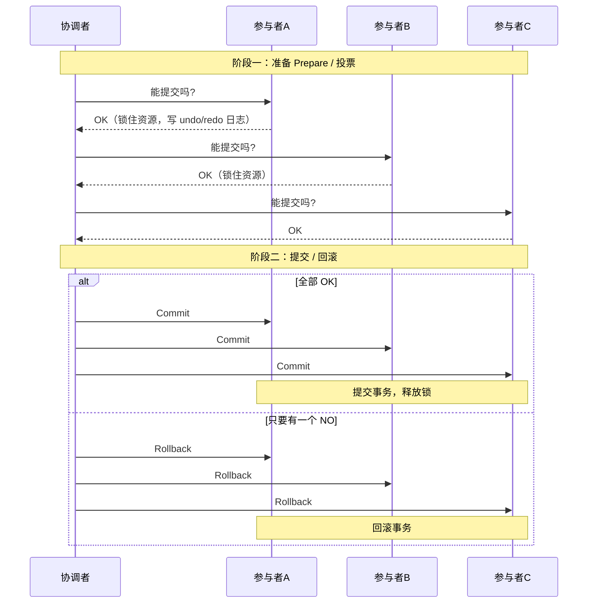

# 03 分布式事务

> 本篇导读：下单这一刻，订单库要落单、库存库要扣减、积分库要加赠——它们分属不同数据库甚至不同服务，一个 `@Transactional` 根本管不过来。本文从"本地事务为何不够"讲起，串讲 2PC/3PC/XA、TCC、Saga、本地消息表、RocketMQ 事务消息、最大努力通知，最后落到 Seata 与"能不用就不用"的选型哲学。

## 一、为什么本地事务不够

先抛一个真实场景：**用户下单**。

一次下单，背后要干三件事：

```text
用户下单
  ├── 写 订单库 (order_db)      → 插入一条订单
  ├── 写 库存库 (stock_db)      → 某商品库存 -1
  └── 写 积分库 (point_db)      → 用户积分 +10
```

这三件事要么**全部成功**，要么**全部失败回滚**。如果是单体单库，一个 `@Transactional` 就能搞定——任何一个抛异常，数据库帮你整体回滚。

但问题是，它们现在在**三个不同的数据库**里（分库了）。`@Transactional` 只管理**一个数据库连接**的事务，它管不了另外两台机器上的库。更常见的现代场景是**跨服务**：订单服务调库存服务、再调积分服务，每个服务自己一个库。这时候局部的本地事务都提交了，但中间某一步失败，前面已经提交的数据就**回不来了**。

这就是分布式事务要解决的问题：**跨多个资源（库 / 服务）时，如何保证整体的一致性**。

## 二、2PC 两阶段提交

两阶段提交（2PC）是最经典的分布式事务协议。角色有两个：**协调者（Coordinator，通常是发起方）**和**参与者（Participant，各分支事务）**。



**缺点（这就是它很少被互联网公司采用的原因）：**

- **同步阻塞**：阶段一锁住资源后，要一直等到阶段二结束才释放，资源锁定时间很长，并发极差。
- **单点问题**：协调者挂了，参与者会一直阻塞等待（尤其是阶段一之后协调者宕机，参与者不知道该提交还是回滚）。
- **数据不一致**：阶段二协调者发出 Commit，但部分参与者没收到（网络丢包），就会出现一部分提交了、一部分没提交。
- **过于保守**：任何一个参与者失败或超时，整体都要回滚，哪怕其他人都成功了。

## 三、3PC 三阶段提交

3PC 在 2PC 基础上加了 `CanCommit` 阶段，并把超时机制下沉到参与者（参与者在收不到协调者指令时会自己超时提交/回滚）。

```text
CanCommit  →  预询问"能不能提交"，不锁资源
PreCommit  →  类似 2PC 的准备，锁资源
DoCommit   →  真正提交
```

它**缓解了阻塞**（参与者有了自主超时决策），但并**不能完全解决一致性问题**（网络极端情况下仍可能不一致）。加上实现复杂，实际工程中很少有人直接用 3PC。

## 四、XA 规范

XA 是 X/Open 组织定义的**分布式事务接口标准**，本质就是 2PC 的标准化落地。Java 里通过 **JTA（Java Transaction API）** + 事务管理器（如 **Atomikos**、Bitronix）来实现。

```java
package com.canoe.cloud.tx;

import javax.transaction.UserTransaction;
import javax.transaction.TransactionManager;
import org.springframework.transaction.jta.JtaTransactionManager;

// 示意：Spring 中通过 JtaTransactionManager 接入 XA
// 多个XA数据源在同一个 UserTransaction 下统一提交/回滚
public class XaDemo {

    public static void main(String[] args) {
        // 实际用法由事务管理器托管，这里仅示意概念
        System.out.println("XA 通过 JTA + 事务管理器，按 2PC 协议统一提交多个资源");
    }
}
```

**现实**：XA 性能差（同样有长事务锁资源的问题），互联网高并发场景基本不用，多见于传统企业级（金融核心系统）对一致性要求极高、且并发不高的地方。

## 五、TCC

TCC（Try-Confirm-Cancel）是**业务层面的两阶段提交**，把"准备"和"提交"下沉到业务代码里，因此没有数据库层面的长锁，性能远好于 2PC。

三个方法：

- **Try**：预留资源（不是真正扣，而是"占住"）。比如扣库存，Try 阶段把可用库存 -1、冻结库存 +1。
- **Confirm**：确认执行，把冻结转为真正扣减。Try 成功了才调 Confirm，且 Confirm **必须成功**（幂等重试）。
- **Cancel**：释放预留资源，把冻结回退。

```java
package com.canoe.cloud.tx;

import java.util.concurrent.atomic.AtomicInteger;

// 库存服务的 TCC 实现（示意核心逻辑）
public class StockTccAction {

    // 可用库存
    private final AtomicInteger available = new AtomicInteger(100);
    // 冻结库存
    private final AtomicInteger frozen = new AtomicInteger(0);

    // Try：预留 1 件库存
    public boolean tryLock(int count) {
        int avail;
        do {
            avail = available.get();
            if (avail < count) {
                return false; // 库存不足，预留失败
            }
        } while (!available.compareAndSet(avail, avail - count));
        frozen.addAndGet(count);
        return true;
    }

    // Confirm：真正扣减（必须幂等）
    public void confirm(int count) {
        frozen.addAndGet(-count);
        System.out.println("Confirm 成功，真正扣减 " + count + " 件，剩余可用 " + available.get());
    }

    // Cancel：释放预留
    public void cancel(int count) {
        available.addAndGet(count);
        frozen.addAndGet(-count);
        System.out.println("Cancel 成功，释放预留 " + count + " 件");
    }

    public static void main(String[] args) {
        StockTccAction action = new StockTccAction();
        if (action.tryLock(1)) {
            action.confirm(1);
        } else {
            action.cancel(1);
        }
    }
}
```

**TCC 的三个必考题（面试高频）：**

1. **空回滚**：Try 没执行（比如网络原因没调到），却收到了 Cancel。解决：记录"事务日志表"，Cancel 时若发现没有对应的 Try 记录，直接当作已回滚处理。
2. **幂等**：Confirm / Cancel 可能因为网络重试被调用多次。解决：用"事务状态表"记录已完成的动作，重复调用时直接返回成功。
3. **悬挂**：Cancel 比 Try 先到（Try 的网络包延迟了），导致资源被"提前释放"后又被 Try 占住，永远得不到处理。解决：同样靠事务日志表——先到的 Cancel 标记"已取消"，后到的 Try 发现已取消就直接失败不执行。

> 对比 2PC：TCC **性能更好**（无数据库长锁），但**侵入业务**（每个参与方要写三个方法），开发成本高。

## 六、Saga

Saga 是**长事务**的解法：把一个大事务拆成一系列**本地短事务**，每个都有对应的**补偿操作**。

```text
正向：T1 → T2 → T3 → T4
补偿：        C3 ← C2 ← C1   (某个 Ti 失败，倒着补偿)

例子（旅行预订）：
T1 订机票 → T2 订酒店 → T3 订租车
若 T3 失败 → 补偿 C2 退酒店 → C1 退机票
```

两种编排模式：

- **编排（Orchestration）**：有个中央协调器，按顺序调各个服务并决定是否补偿（像导演）。
- **协同（Choreography）**：没有中央协调器，各服务通过事件相互触发（像跳舞，靠信号）。

**注意**：Saga **不保证隔离性**，可能出现脏写（A 在补偿 B 的订单时，C 又读了中间态）。缓解手段：用"语义锁"（给订单加"已取消"标记）或版本号，让后续操作感知到这是要被回滚的数据。

## 七、本地消息表

最朴素也最可靠的"最终一致"方案，很多中小公司实战首选。

```text
1. 业务与消息在同一个本地事务里落库：
   BEGIN;
     INSERT 订单(...)
     INSERT 消息表(msg_id, 业务数据, status=待发送)
   COMMIT;
   （同一事务，订单和消息要么都在，要么都不在）

2. 定时任务轮询消息表，把"待发送"的消息发给 MQ
3. 消费端处理业务，并保证幂等（见幂等篇）
4. 消费成功 → 回调更新消息表 status=已发送
5. 发送失败 → 重试（有最大重试次数）
```

```java
package com.canoe.cloud.tx;

import java.sql.Connection;
import java.sql.DriverManager;
import java.sql.PreparedStatement;

// 本地消息表：业务与消息同库同事务（示意）
public class LocalMessageTableDemo {

    public static void main(String[] args) throws Exception {
        String url = "jdbc:mysql://localhost:3306/order_db";
        try (Connection conn = DriverManager.getConnection(url, "root", "root")) {
            conn.setAutoCommit(false);
            // 1. 插入订单
            try (PreparedStatement ps1 = conn.prepareStatement(
                    "INSERT INTO `order`(order_no, user_id) VALUES (?, ?)")) {
                ps1.setString(1, "NO20240101001");
                ps1.setLong(2, 1001L);
                ps1.executeUpdate();
            }
            // 2. 同一事务插入消息
            try (PreparedStatement ps2 = conn.prepareStatement(
                    "INSERT INTO msg_log(msg_id, biz_data, status) VALUES (?, ?, 'INIT')")) {
                ps2.setString(1, "MSG001");
                ps2.setString(2, "{\"orderNo\":\"NO20240101001\"}");
                ps2.executeUpdate();
            }
            conn.commit();
            System.out.println("订单与消息在同一事务提交，保证都不丢");
        }
    }
}
```

**优点**：简单可靠，不依赖额外强一致组件。
**缺点**：消息表耦合业务库（表会变大），有延迟（靠轮询），需要自己保证消费端幂等。

## 八、RocketMQ 事务消息

这是生产环境最常用的方案之一。利用 MQ 的"半消息 + 事务回查"机制，把本地事务和消息发送串起来。

```text
1. 发送半消息（Half Message）：对消费者不可见，只是占位
2. 执行本地事务（写订单库）
3. 本地事务成功 → 提交消息（消费者此时才可见）
   本地事务失败 → 回滚消息（半消息被删除）
4. 若 RocketMQ 长时间没收到提交/回滚（比如生产者宕机）→
   主动向生产者发起"事务回查"，问：那笔事务到底成没成？
```

```java
package com.canoe.cloud.tx;

import org.apache.rocketmq.client.producer.TransactionListener;
import org.apache.rocketmq.client.producer.TransactionMQProducer;
import org.apache.rocketmq.client.producer.LocalTransactionState;
import org.apache.rocketmq.common.message.Message;
import org.apache.rocketmq.common.message.MessageExt;

// 事务监听器：决定本地事务结果 + 处理回查
public class OrderTransactionListener implements TransactionListener {

    @Override
    public LocalTransactionState executeLocalTransaction(Message msg, Object arg) {
        // 在这里写订单库（本地事务）
        boolean ok = saveOrder(msg.getKeys());
        return ok ? LocalTransactionState.COMMIT_MESSAGE
                  : LocalTransactionState.ROLLBACK_MESSAGE;
    }

    @Override
    public LocalTransactionState checkLocalTransaction(MessageExt msg) {
        // 回查：去数据库查订单是否存在，决定提交还是回滚
        return orderExists(msg.getKeys())
                ? LocalTransactionState.COMMIT_MESSAGE
                : LocalTransactionState.ROLLBACK_MESSAGE;
    }

    private boolean saveOrder(String orderNo) {
        System.out.println("执行本地事务：保存订单 " + orderNo);
        return true;
    }

    private boolean orderExists(String orderNo) {
        return true;
    }

    public static void main(String[] args) {
        System.out.println("RocketMQ 事务消息：半消息 → 本地事务 → 提交/回滚 + 回查兜底");
    }
}
```

**核心**：半消息保证"消息最终一定发得出去"，事务回查保证"即使生产者挂了也能对齐最终状态"。呼应 [RocketMQ 篇](../mq/rocketmq) 第 04 章。

## 九、最大努力通知

适用**对一致性要求最低**的场景，典型是**支付结果通知**：支付平台（如支付宝）处理完支付后，尽力把结果通知商户，通知失败就重试，商户侧做好对账。

```text
支付平台处理完成
  → 发送通知给商户（HTTP 回调）
  → 商户返回 SUCCESS 才停止
  → 否则按退避策略重试 N 次
  → 同时商户主动"查单"接口做定期校对（兜底）
```

它不保证实时、不保证一定送达，但配合"商户主动对账"，足以覆盖绝大多数支付场景。因为钱的事有对账兜底，所以叫"最大努力"而非"绝对保证"。

## 十、Seata

Seata 是阿里开源的分布式事务框架，提供四种模式：

```text
模式      侵入性   原理                                  适用
---------------------------------------------------------------
AT       无侵入   自动生成 undo_log 反向补偿，最常用       绝大部分业务
TCC      高       手写 Try/Confirm/Cancel                 高性能/特殊场景
Saga     中       长事务 + 补偿                          跨系统长流程
XA       低       基于数据库 XA，性能差                   传统强一致
```

**AT 模式最小用法**：

```java
package com.canoe.cloud.tx;

import io.seata.spring.annotation.GlobalTransactional;
import org.springframework.stereotype.Service;

@Service
public class OrderService {

    // 只要在入口方法加这个注解，下面跨库的调用就被纳入全局事务
    @GlobalTransactional(name = "create-order", rollbackFor = Exception.class)
    public void createOrder(Long userId, Long productId) {
        orderMapper.insert(userId, productId);   // 订单库
        stockMapper.decrease(productId);          // 库存库
        pointMapper.increase(userId);             // 积分库
        // 任一环节抛异常，Seata 用 undo_log 自动回滚所有分支
    }
}
```

**AT 模式的限制**：需要支持本地 ACID 的关系型数据库、需要建 `undo_log` 表、有**全局锁**（分支事务提交后会加全局锁，冲突时可能自旋等待）。高并发热点行要慎用。

## 十一、方案选型

一张决策表，直接给结论：

```text
一致性要求          性能要求   侵入程度   推荐方案
--------------------------------------------------------------
强一致(金融核心)    中低       低         Seata XA / 本地消息表+对账
强一致(一般业务)    高         无         Seata AT
高性能/热点        高         高         TCC
长流程跨系统       中         中         Saga
最终一致(解耦)     高         低         RocketMQ 事务消息 / 本地消息表
支付通知类         低         低         最大努力通知 + 对账
```

**一句话哲学：能不用分布式事务就不用**。优先用"最终一致 + 补偿 + 幂等 + 人工兜底"的组合拳——它比强一致事务简单、性能好、容错强。分布式事务是"不得已才上"的重武器。

## 十二、一致性兜底

无论选哪种方案，**最后一道防线都是"对账"**：

- **定时任务扫描**：每天凌晨跑批，对比订单库、库存库、积分库，找出"下单了但没扣库存"之类的不一致。
- **告警与人工介入通道**：对账发现差异，自动告警，运营/开发可手动补偿。
- **业务侧自愈**：比如"用户投诉没到账"，客服后台一键补发。

记住：**任何分布式方案都不可能 100% 完美，对账和人工兜底才是让你睡得着觉的东西**。

## 本篇小结

- **本地事务** 只管一个数据库连接，跨库跨服务就失效。
- **2PC** 准备+提交两阶段，但有同步阻塞、单点、数据不一致三大硬伤。
- **3PC** 加 CanCommit 与超时，缓解阻塞但仍难保一致。
- **XA** 是 2PC 的接口标准，性能差，多用于传统金融系统。
- **TCC** 把两阶段下沉到业务，性能好但侵入高，要处理空回滚/幂等/悬挂。
- **Saga** 适合长事务，靠补偿倒推，但不保证隔离性。
- **本地消息表** 业务与消息同事务，简单可靠但耦合业务库。
- **RocketMQ 事务消息** 靠半消息+回查，是生产最常方案之一。
- **最大努力通知** 适合支付结果等对一致性要求低的场景。
- **Seata** 提供 AT/TCC/Saga/XA，AT 模式对业务无侵入最常用。
- **选型原则**：能不用分布式事务就不用，优先最终一致+补偿+幂等。
- **对账兜底** 是所有方案最后一道防线，必须存在。

## 参考链接

- [Seata 官方文档](https://seata.io/zh-cn/docs/overview/what-is-seata.html)
- [RocketMQ 官方文档：事务消息](https://rocketmq.apache.org/zh/docs/featureBehavior/04transactionmessage/)
- [The Two-Phase Commit Protocol（维基百科）](https://en.wikipedia.org/wiki/Two-phase_commit_protocol)
- [Saga 模式（Microsoft Azure 架构）](https://learn.microsoft.com/en-us/azure/architecture/reference-architectures/saga/saga)
- [美团技术团队：分布式事务实践](https://tech.meituan.com/)
- [阿里中间件：分布式事务 TXC/GTS](https://help.aliyun.com/document_detail/160055.html)
- [Atomikos JTA 事务管理器](https://www.atomikos.com/)
- [Kafka / MQ 最终一致性方案合集](https://developer.aliyun.com/)

下一篇 → [04 分布式锁](/java/cloud/distribute-lock)
