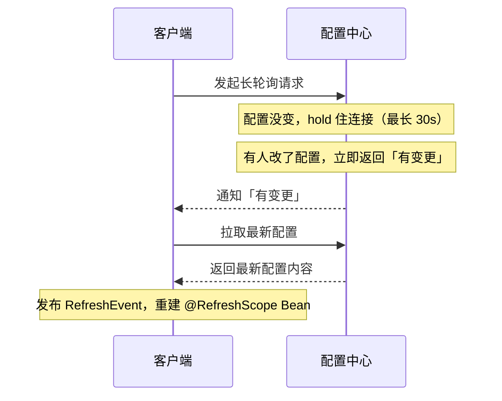

# 06 配置中心

> 本篇导读：配置散落在几十个服务的 `application.yml` 里，改一个开关要发版、不同环境靠人工拷贝、密码明文躺在 Git 里——这是配置管理的三宗罪。配置中心把"集中管理 + 动态刷新 + 多环境隔离 + 安全审计"一次性解决。本文从痛点讲起，对比主流方案，重点实战 Nacos Config 与 Apollo，再讲动态刷新原理、敏感配置加密、多环境多租户与配置规范。

## 一、为什么需要配置中心

没有配置中心的典型痛点：

- **配置散落**：每个服务一份 `application.yml`，改一个全局开关要改 N 个仓库。
- **改配置要重启**：改个线程池大小、限流阈值，得重新打包发布，代价高。
- **多环境靠人工**：dev/test/prod 的配置靠复制粘贴，极易出错、漏改。
- **密码明文**：数据库密码、`accessKey` 直接写在配置文件、提交进 Git，泄露风险巨大。
- **无法追溯**：谁改了什么、什么时候改的，全靠口头沟通，出问题没法回滚。

配置中心解决四件事：**集中管理、动态刷新、环境隔离、权限与审计**。

## 二、配置中心的四个能力

- **集中管理**：所有配置在一个地方维护，服务启动时来拉取。
- **动态刷新**：改完配置**不用重启**，应用立即生效（靠长轮询/推送 + 重建 Bean）。
- **环境隔离**：dev/test/prod 互不干扰，按 namespace / profile 区分。
- **权限与审计**：谁能改、改了什么、何时改的，有记录可回滚（Apollo 最强）。

## 三、主流方案对比

```text
方案                特点                                      适用
------------------------------------------------------------------------
Spring Cloud Config  Config Server + Git，靠 Bus + MQ 广播刷新     轻量、已有 Git 流程
Nacos Config         一个组件兼做注册+配置，长轮询，最常用          Spring Cloud Alibaba 首选
Apollo(携程)         功能最全：灰度、权限、审计、多环境极强        中大型、强管控诉求
Consul / etcd         KV 存储，偏底层，需自己搭上层                 已用 Consul 体系
```

**选择建议**：新项目用 **Nacos**（和注册中心二合一，运维简单）；对权限/灰度/审计要求高的中大型公司用 **Apollo**；已有 GitOps 流程的可用 Spring Cloud Config。

## 四、Nacos Config 实战

完整链路：控制台建配置 → 引依赖 → `bootstrap.yml` → 代码注入。

DataId 命名规则： `${spring.application.name}-${profile}.${file-extension}`，如 `user-service-dev.yaml`。

```xml
<dependency>
    <groupId>com.alibaba.cloud</groupId>
    <artifactId>spring-cloud-starter-alibaba-nacos-config</artifactId>
</dependency>
```

```yaml
# bootstrap.yml
spring:
  application:
    name: user-service
  cloud:
    nacos:
      config:
        server-addr: 127.0.0.1:8848
        file-extension: yaml
        namespace: dev          # 环境隔离
        group: DEFAULT_GROUP
```

```java
package com.canoe.cloud.sc.config;

import org.springframework.beans.factory.annotation.Value;
import org.springframework.cloud.context.config.annotation.RefreshScope;
import org.springframework.web.bind.annotation.GetMapping;
import org.springframework.web.bind.annotation.RestController;

@RestController
@RefreshScope   // 配置变更时重建此 Bean，重新注入新值
public class ConfigController {

    @Value("${pay.timeout:3000}")
    private int payTimeout;

    @GetMapping("/payTimeout")
    public String getTimeout() {
        return "支付超时=" + payTimeout + "ms";
    }
}
```

在 Nacos 控制台改 `pay.timeout`，无需重启，接口立即返回新值。

**`@RefreshScope` 原理与坑**：它实际是**销毁并重建被标记的 Bean**来重新注入配置。坑在于：Bean 里的**状态会丢失**（比如一个计数器的字段值会被重置）。不要在 `@RefreshScope` Bean 里放有状态字段，或刷新后自行重新初始化。

## 五、Apollo 简介与用法

Apollo 核心概念：

- **AppId**：应用唯一标识，每个接入应用一个。
- **Environment**：环境（DEV/FAT/UAT/PROD）。
- **Cluster**：集群（如不同机房）。
- **Namespace**：命名空间，分私有（应用独享）和公共（多应用共享，如 `application.yml` 公共配置）。

它的**灰度发布**和**权限管理**是最大卖点：可以先对少量机器灰度新配置，验证无误再全量；谁能改哪个应用有精细的权限控制。

```xml
<dependency>
    <groupId>com.ctrip.framework.apollo</groupId>
    <artifactId>apollo-client</artifactId>
</dependency>
```

```java
package com.canoe.cloud.sc.config;

import com.ctrip.framework.apollo.spring.annotation.EnableApolloConfig;
import org.springframework.boot.SpringApplication;
import org.springframework.boot.autoconfigure.SpringBootApplication;

@SpringBootApplication
@EnableApolloConfig   // 开启 Apollo 配置
public class UserApplication {
    public static void main(String[] args) {
        SpringApplication.run(UserApplication.class, args);
    }
}
```

## 六、动态刷新原理

两种主流机制：

- **长轮询（Nacos）**：客户端向服务端发一个"长轮询"请求，服务端 hold 住连接，直到配置有变更或超时才返回；客户端拿到变更后再去拉最新配置。兼顾实时性与服务端压力。
- **推送（Apollo）**：服务端通过长连接（或带版本号的长轮询）主动把变更推给客户端。

时序（以 Nacos 长轮询为例）：



`spring-cloud-context` 的 `RefreshEvent` 机制：配置变更触发事件，监听者刷新 Environment 并重建 `@RefreshScope` Bean。

## 七、敏感配置加密

配置中心里存明文密码是重大风险。三种方案：

1. **配置中心自带加密**：Apollo 支持配置项加密存储。
2. **Jasypt**：Spring Boot 集成，配置值用 `ENC(...)` 包裹，启动时用密钥解密。

   ```xml
   <dependency>
       <groupId>com.github.ulisesbocchio</groupId>
       <artifactId>jasypt-spring-boot-starter</artifactId>
   </dependency>
   ```

   ```yaml
   # 密文写法，真正密码不进仓库
   spring:
     datasource:
       password: ENC(AbCdEf123456...)
   jasypt:
     encryptor:
       password: ${JASYPT_KEY}   # 密钥放环境变量，不要写死
   ```

3. **KMS / Vault**：云厂商密钥管理服务或 HashiCorp Vault，企业级密钥托管，最安全。

## 八、多环境与多租户

推荐实践（用 Nacos 举例）：

```text
Namespace 隔离环境：  dev / test / prod  （互不越界）
Group      隔离业务线：订单业务组 / 用户业务组
DataId     隔离具体配置：user-service-dev.yaml
```

- 用 **namespace 隔离环境**（dev 看不到 prod 的配置，安全）。
- 用 **group 隔离业务线/团队**，避免互相误改。
- 公共配置（如数据库、MQ 地址）用 `shared-configs` 共享，业务配置各自维护。

## 九、配置变更的灰度与回滚

- **Apollo 灰度发布**：新配置先推给指定实例（如 1 台），观察监控正常再全量；一旦异常可一键回滚。
- **Nacos 历史版本**：每次修改都留痕，可从"历史版本"回滚到任意旧版本。

**强调**：配置变更和代码发布一样危险，**必须能回滚**。很多线上事故是"改了个配置"引发的，回滚能力是底线。

## 十、配置规范

一套可落地的配置管理实践：

```text
该放配置中心：  开关(flag)、限流阈值、超时时间、第三方地址、特性开关
不该放中心：    代码结构类、几乎不变的静态配置、本地-only 配置
敏感信息：      密码/密钥绝不进 Git，用加密或 KMS/Vault
命名规范：      统一前缀(如 order.xxx)，见名知意
负责人：        每项关键配置标注 owner，出事找得到人
注释：          配置项写明含义、单位、取值范围
```

**铁律**：**敏感信息不要进 Git**。即便用了配置中心，也别把明文密码提交到代码仓库。

## 本篇小结

- **配置中心** 解决散落、需重启、多环境、明文、无法追溯五宗罪。
- **四大能力**：集中管理、动态刷新、环境隔离、权限审计。
- **选型**：轻量用 Nacos，强管控用 Apollo，已有 Git 流程用 Spring Cloud Config。
- **Nacos DataId** 命名 `${应用名}-${环境}.${后缀}`。
- **`@RefreshScope`** 靠重建 Bean 刷新，Bean 内状态会丢失是坑。
- **Apollo** 强在灰度发布、权限与审计。
- **动态刷新** 靠长轮询(Nacos)或推送(Apollo) + RefreshEvent。
- **敏感配置** 用 Apollo 加密 / Jasypt / KMS / Vault，别明文。
- **多环境** 用 namespace 隔离环境、group 隔离业务线。
- **配置变更必须可回滚**，灰度发布降低风险。
- **敏感信息绝不进 Git**，这是安全底线。

## 参考链接

- [Nacos 配置中心文档](https://nacos.io/zh-cn/docs/quick-start-spring-cloud.html)
- [Spring Cloud Alibaba Nacos Config](https://spring-cloud-alibaba-group.github.io/github-pages/2022/zh-cn/spring-cloud-alibaba.html)
- [Apollo 官方文档](https://www.apolloconfig.com/)
- [Spring Cloud Config 文档](https://spring.io/projects/spring-cloud-config)
- [Jasypt Spring Boot](https://github.com/ulisesbocchio/jasypt-spring-boot)
- [HashiCorp Vault](https://www.vaultproject.io/)
- [refresh 机制（spring-cloud-context）](https://docs.spring.io/spring-cloud-commons/docs/current/reference/html/#_environment_changes)
- [阿里中间件：配置中心实践](https://developer.aliyun.com/)

下一篇 → [返回专栏首页](/java/cloud/springcloud/intro)
