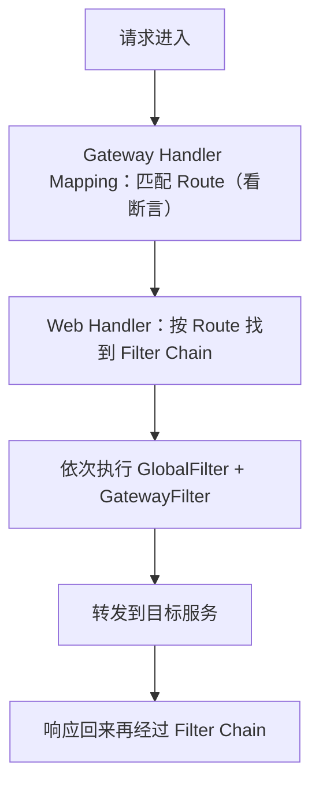

# 04 网关 Gateway

> 本篇导读：没有网关时，每个服务都要自己写鉴权、限流、日志、跨域，客户端还要记住所有服务的地址。网关把所有流量收口到一个入口，统一做路由、鉴权、限流、熔断、跨域。本文从"为什么需要网关"讲起，对比 Gateway 与 Zuul，拆解三大核心概念、路由断言过滤器、自定义鉴权过滤器、限流、跨域、整合 Nacos，最后给一张常见问题排错表。

## 一、为什么需要网关

先看没有网关的痛点：

```text
客户端 ──┬─► 用户服务(自己写鉴权/限流/日志/跨域)
         ├─► 订单服务(又写一遍鉴权/限流/日志/跨域)
         └─► 商品服务(再写一遍...)

问题：横切逻辑重复写；客户端要记住每个服务的地址和端口
```

**网关就是"所有流量的统一入口"**，把这些横切关注点（cross-cutting concerns）收口到一处：

```text
客户端 ──► 网关 ──┬─► 用户服务
                  ├─► 订单服务
                  └─► 商品服务
        (鉴权/限流/日志/跨域在网关统一做)
```

## 二、网关的核心功能

逐个列出网关能干什么：

- **路由转发**：把请求按规则转发到对应服务。
- **鉴权**：统一校验 token，非法请求直接挡在门外。
- **限流**：入口处限流，保护后端不被冲垮。
- **熔断**：后端不健康时快速失败。
- **日志 / 监控**：统一记录访问日志、埋点。
- **跨域（CORS）**：统一处理浏览器跨域。
- **协议转换**：HTTP → gRPC、加解密等。
- **灰度发布**：按权重把部分流量导到新版本。

核心思想：**横切关注点统一处理，业务服务只管业务**。

## 三、Spring Cloud Gateway vs Zuul

```text
维度        Zuul 1            Gateway
------------------------------------------------
模型        Servlet 阻塞 IO    WebFlux + Netty 响应式非阻塞
性能        一般（线程阻塞）   高（异步非阻塞，吞吐更优）
维护状态    停维              活跃维护，官方主推
```

**Zuul 1** 基于 Servlet，每个请求占一个线程，高并发下线程耗尽；**Gateway** 基于 **WebFlux + Netty**，响应式非阻塞，用少量线程扛高并发。**Zuul 2** 虽改了异步，但生态与社区已明显落后于 Gateway，新项目无脑选 Gateway。

## 四、三大核心概念

Gateway 的三个骨架概念：

- **Route（路由）**：由一个 id、目标 URI、一组断言、一组过滤器组成，是转发的基本单位。
- **Predicate（断言）**："满足什么条件才转发"，比如路径是 `/user/**`、方法是 GET。
- **Filter（过滤器）**：转发前后做什么，比如加请求头、限流、改路径。

请求处理流程：



## 五、路由配置

推荐用 `application.yml` 配置（也支持 Java `RouteLocator` 编码）：

```yaml
spring:
  cloud:
    gateway:
      routes:
        - id: user-service-route          # 路由 id
          uri: lb://user-service          # lb:// 表示从注册中心负载均衡取实例
          predicates:
            - Path=/user/**               # 路径断言
        - id: order-service-route
          uri: lb://order-service
          predicates:
            - Path=/order/**
            - Method=GET,POST             # 方法断言
```

`lb://` 前缀表示走负载均衡（依赖注册中心 + LoadBalancer），这是网关最常见的写法。

## 六、常用断言工厂

断言（Predicate）就是"匹配条件"：

```text
断言工厂            示例写法                      作用
------------------------------------------------------------------
Path              Path=/user/**                路径匹配
Method            Method=GET                   请求方法
Query             Query=token, abc             带某参数且值匹配
Header            Header=X-Request-Id, \d+     请求头匹配
Host              Host=**.canoe.com           域名匹配
After/Before     After=2024-01-01T00:00:00   时间之后(可用于定时开放)
Between           Between=...                  时间段内
RemoteAddr        RemoteAddr=192.168.1.1/24   客户端 IP 段
Weight            Weight=group1, 80            权重分流(灰度)
```

`Weight` 常用于灰度发布：把 80% 流量给稳定版、20% 给新版本，观察无异常再全量。

## 七、过滤器

**`GatewayFilter`（局部）**：只作用于某个路由。**`GlobalFilter`（全局）**：作用于所有路由。

常用内置 `GatewayFilter`：

```text
过滤器                  作用
--------------------------------------------------------------
AddRequestHeader       给下游请求加请求头
AddRequestParameter    加请求参数
StripPrefix            去掉前缀（如 /api/user → /user，常用）
PrefixPath             加前缀
RewritePath            重写路径
RequestRateLimiter     限流
Retry                  失败重试
CircuitBreaker         熔断（配合 Sentinel/Resilience4j）
```

示例（去掉 `/api` 前缀再转发）：

```yaml
spring:
  cloud:
    gateway:
      routes:
        - id: user-service-route
          uri: lb://user-service
          predicates:
            - Path=/api/user/**
          filters:
            - StripPrefix=1          # 去掉第一段 /api，下游收到 /user/**
            - AddRequestHeader=X-Gw, gateway
```

## 八、自定义全局过滤器

实现统一鉴权：从 Header 取 token → 校验 → 失败返回 401。

```java
package com.canoe.cloud.sc.gateway;

import org.springframework.cloud.gateway.filter.GlobalFilter;
import org.springframework.context.annotation.Bean;
import org.springframework.context.annotation.Configuration;
import org.springframework.core.Ordered;
import org.springframework.http.HttpStatus;
import reactor.core.publisher.Mono;
import org.springframework.cloud.gateway.filter.GatewayFilterChain;
import org.springframework.web.server.ServerWebExchange;
import org.springframework.http.server.reactive.ServerHttpRequest;

import reactor.netty.ByteBufFlux;

// 全局鉴权过滤器：校验 token，无 token 直接 401
@Configuration
public class AuthGlobalFilter {

    @Bean
    public GlobalFilter authFilter() {
        return (exchange, chain) -> {
            ServerHttpRequest request = exchange.getRequest();
            String token = request.getHeaders().getFirst("Authorization");
            if (token == null || !token.startsWith("Bearer ")) {
                // 未授权，直接拦截返回 401
                exchange.getResponse().setStatusCode(HttpStatus.UNAUTHORIZED);
                return exchange.getResponse().setComplete();
            }
            // 校验通过，放行
            return chain.filter(exchange);
        };
    }
}
```

**顺序**：实现 `Ordered`（或返回 `Ordered` 接口）来控制过滤器在链中的先后。注意数字越小越先执行。

## 九、限流

Gateway 内置 `RequestRateLimiter`，底层用 **Redis 令牌桶**：

```yaml
spring:
  cloud:
    gateway:
      routes:
        - id: order-service-route
          uri: lb://order-service
          predicates:
            - Path=/order/**
          filters:
            - name: RequestRateLimiter
              args:
                redis-rate-limiter.replenishRate: 10   # 每秒补充 10 个令牌
                redis-rate-limiter.burstCapacity: 20   # 桶容量 20（允许突发）
                key-resolver: "#{@ipKeyResolver}"      # 按 IP 限流
```

`KeyResolver` 定义限流维度（按 IP / 用户 / 接口）：

```java
package com.canoe.cloud.sc.gateway;

import org.springframework.cloud.gateway.filter.ratelimit.KeyResolver;
import org.springframework.context.annotation.Bean;
import org.springframework.context.annotation.Configuration;
import reactor.core.publisher.Mono;
import org.springframework.web.server.ServerWebExchange;

@Configuration
public class RateLimitConfig {

    // 按客户端 IP 限流
    @Bean
    public KeyResolver ipKeyResolver() {
        return exchange -> Mono.just(
                exchange.getRequest().getRemoteAddress().getHostString());
    }
}
```

## 十、跨域

全局 CORS 配置：

```java
package com.canoe.cloud.sc.gateway;

import org.springframework.context.annotation.Bean;
import org.springframework.context.annotation.Configuration;
import org.springframework.web.cors.CorsConfiguration;
import org.springframework.web.cors.reactive.CorsWebFilter;
import org.springframework.web.cors.reactive.UrlBasedCorsConfigurationSource;

import java.util.Arrays;
import java.util.List;

@Configuration
public class CorsConfig {

    @Bean
    public CorsWebFilter corsWebFilter() {
        CorsConfiguration cfg = new CorsConfiguration();
        cfg.setAllowedOriginPatterns(List.of("*"));   // 生产应限定具体域名
        cfg.setAllowedMethods(Arrays.asList("GET", "POST", "PUT", "DELETE"));
        cfg.setAllowedHeaders(List.of("*"));
        cfg.setAllowCredentials(true);
        UrlBasedCorsConfigurationSource source = new UrlBasedCorsConfigurationSource();
        source.registerCorsConfiguration("/**", cfg);
        return new CorsWebFilter(source);
    }
}
```

**坑**：网关配了 CORS，**下游服务就不要再配一遍**，否则响应头重复导致浏览器报错。

## 十一、整合 Nacos

开启服务发现，网关自动按服务名路由：

```yaml
spring:
  cloud:
    gateway:
      discovery:
        locator:
          enabled: true               # 自动按服务名生成路由
          lower-case-service-id: true # 服务名转小写
```

开启后，访问 `/user-service/user/1` 会自动转发到 `user-service` 的 `/user/1`。也可以像前面那样手动写 `routes` 来精确控制。

## 十二、常见问题

```text
现象          原因
--------------------------------------------------
404           path 断言写错；StripPrefix 没配导致下游路径不对
503           目标服务没注册上 / lb:// 服务名写错
跨域报错      网关和下游都配了 CORS，响应头重复
启动报 Web 依赖冲突  Gateway 不能引 spring-boot-starter-web（它是 WebFlux）
lb:// 不生效   没引 LoadBalancer 或没开 discovery.locator
限流不工作     没配 KeyResolver Bean / Redis 没连上
```

## 本篇小结

- **网关** 是统一入口，集中处理鉴权、限流、日志、跨域等横切逻辑。
- **Gateway** 基于 WebFlux + Netty 响应式非阻塞，性能优于 Zuul 1。
- **三大概念**：Route(路由)、Predicate(断言)、Filter(过滤器)。
- **`lb://`** 前缀走注册中心负载均衡，是网关常用写法。
- **断言** 有 Path/Method/Query/Header/Host/时间/Weight 等工厂。
- **`GatewayFilter`** 局部、**`GlobalFilter`** 全局，顺序用 Ordered 控制。
- **`StripPrefix`** 常用，去掉 `/api` 等前缀再转发。
- **自定义 GlobalFilter** 可实现统一鉴权，无 token 直接 401。
- **限流** 用 `RequestRateLimiter` + Redis 令牌桶 + KeyResolver。
- **跨域** 只配网关一处，下游别重复配。
- **Gateway 不能引 `spring-boot-starter-web`**，否则依赖冲突。

## 参考链接

- [Spring Cloud Gateway 官方文档](https://spring.io/projects/spring-cloud-gateway)
- [Gateway Route Predicate Factories](https://docs.spring.io/spring-cloud-gateway/docs/current/reference/html/#gateway-request-predicates-factories)
- [Gateway Filter Factories](https://docs.spring.io/spring-cloud-gateway/docs/current/reference/html/#gatewayfilter-factories)
- [RequestRateLimiter 限流](https://docs.spring.io/spring-cloud-gateway/docs/current/reference/html/#the-requestratelimiter-gatewayfilter-factory)
- [Spring WebFlux 文档](https://spring.io/projects/spring-webflux)
- [Nacos 服务发现集成](https://nacos.io/zh-cn/docs/what-is-nacos.html)
- [Zuul（已停维，参考）](https://github.com/Netflix/zuul)
- [MDN：CORS 跨域](https://developer.mozilla.org/zh-CN/docs/Web/HTTP/CORS)

下一篇 → [05 Sentinel 熔断限流](/java/cloud/springcloud/sentinel)
