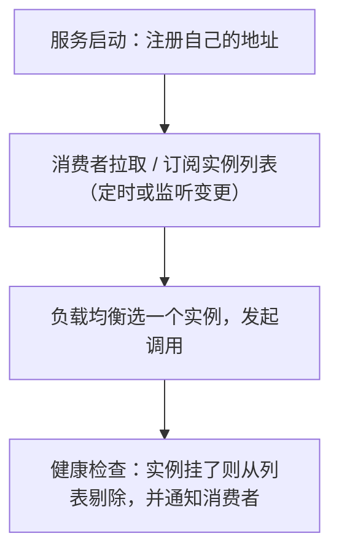

# 02 注册中心 Nacos

> 本篇导读：早期我们把服务 IP 写死在配置里，一旦扩容、缩容、故障转移，调用方就得改配置重启——这是运维噩梦。Nacos 既是注册中心（服务的通讯录）又是配置中心（配置的集中管理），是 Spring Cloud Alibaba 的基石。本文从"为什么需要注册中心"讲起，覆盖安装、注册发现、数据模型、配置中心、集群与健康检查，最后给一份常见问题排错表。

## 一、为什么需要注册中心

先看"写死 IP"的痛：

```text
consumer 配置里写死：user-service = 192.168.1.10:8080

某天 user-service 扩容到 3 台，或 192.168.1.10 宕机换到 .11
  → consumer 配置要改、要重启
  → 几十个调用方都要改，根本改不过来
```

**注册中心就是"服务的通讯录"**：服务启动时把自己（IP、端口、服务名）报到注册中心，调用方从注册中心查"现在有哪些实例可用"，动态拿到地址。扩容缩容、故障下线，注册中心自动感知，调用方无感。

## 二、注册中心的核心能力

四个核心能力，以及一次典型调用流程：



- **服务注册（Register）**：实例上线时登记自己。
- **服务发现（Discover）**：调用方查询可用实例。
- **健康检查（Health Check）**：探活，剔除死实例。
- **变更通知（Notify）**：实例列表变化（上线/下线）主动推送给订阅者。

## 三、CAP 视角下的注册中心

不同注册中心在 C 和 A 之间取舍不同：

```text
组件          CAP倾向   特点
----------------------------------------------
Eureka       AP        允许短暂不一致，有自我保护机制
Nacos        AP/CP可切  临时实例=AP(心跳)，持久实例=CP(Raft)
Consul       CP        Raft 强一致
Zookeeper    CP        ZAB 强一致，可靠性高但可用性略弱
```

**Nacos 的精妙之处**：它同时支持两种模式——
- **临时实例（默认）**：靠客户端心跳保活，网络分区时允许数据短暂不一致（AP），适合对可用性要求高的场景。
- **持久实例**：注册信息落盘，用 Raft 保证强一致（CP），适合不能丢注册信息的核心服务。

通过 `ephemeral: true/false` 切换。

## 四、Nacos 安装与启动

最省事的是 Docker 单机模式：

```yaml
# docker-compose.yml
version: '3'
services:
  nacos:
    image: nacos/nacos-server:v2.2.3
    environment:
      - MODE=standalone            # 单机模式（生产用 cluster）
      - NACOS_AUTH_ENABLE=true     # 建议开启认证
    ports:
      - "8848:8848"                # 服务/配置端口
      - "9848:9848"                # 2.x 新增的 gRPC 端口，务必放通
```

启动后访问控制台 `http://localhost:8848/nacos`，默认账号密码 `nacos/nacos`（生产务必改密）。

> 注意：Nacos 2.x 引入了 gRPC 端口（8848+1000=9848），**防火墙/容器只开 8848 会导致客户端连不上**，这是高频坑。

## 五、服务注册

引入依赖并配置即可，几乎零代码：

```xml
<dependency>
    <groupId>com.alibaba.cloud</groupId>
    <artifactId>spring-cloud-starter-alibaba-nacos-discovery</artifactId>
</dependency>
```

```yaml
spring:
  application:
    name: user-service          # 服务名，注册中心靠它识别
  cloud:
    nacos:
      discovery:
        server-addr: 127.0.0.1:8848
        namespace: dev          # 环境隔离
        group: DEFAULT_GROUP
```

```java
package com.canoe.cloud.sc.nacos;

import org.springframework.boot.SpringApplication;
import org.springframework.boot.autoconfigure.SpringBootApplication;
import org.springframework.cloud.client.discovery.EnableDiscoveryClient;

@SpringBootApplication
@EnableDiscoveryClient   // Spring Cloud 2020+ 可省略，只要依赖在就会自动注册
public class UserServiceApplication {
    public static void main(String[] args) {
        SpringApplication.run(UserServiceApplication.class, args);
    }
}
```

启动后，Nacos 控制台"服务管理 → 服务列表"就能看到 `user-service` 在线。

## 六、服务发现与调用

从注册中心拿实例列表，配合 `RestTemplate` 或 `DiscoveryClient`：

```java
package com.canoe.cloud.sc.nacos;

import org.springframework.beans.factory.annotation.Autowired;
import org.springframework.cloud.client.discovery.DiscoveryClient;
import org.springframework.web.bind.annotation.GetMapping;
import org.springframework.web.bind.annotation.RestController;
import org.springframework.web.client.RestTemplate;

import java.util.List;

@RestController
public class CallController {

    @Autowired
    private DiscoveryClient discoveryClient;

    @Autowired
    private RestTemplate restTemplate;

    @GetMapping("/callUser")
    public String callUser() {
        // 从注册中心获取 user-service 的所有实例
        List<String> instances = discoveryClient.getInstances("user-service")
                .stream()
                .map(i -> i.getHost() + ":" + i.getPort())
                .toList();
        // 真实项目用 OpenFeign + 负载均衡调用，这里仅演示发现能力
        return "可用实例：" + instances;
    }
}
```

实际生产中更推荐用 OpenFeign（见下一篇），它内置了从注册中心取实例 + 负载均衡。

## 七、Nacos 数据模型

三层隔离模型，理解它才能用好多环境与多项目：

```text
Namespace (命名空间)
   └── Group (分组)
         └── DataId / Service (具体配置或服务)

例：
Namespace = dev / test / prod        （环境隔离）
Group     = 订单业务组 / 用户业务组    （项目/模块隔离）
DataId    = user-service-dev.yaml     （具体某个配置）
```

- **Namespace**：用于**环境隔离**（dev/test/prod 互不可见），最常用。
- **Group**：用于**业务线/项目分组**，同一 Namespace 下不同团队的项目分开。
- **DataId / Service**：具体的一个配置项或一个微服务。

画一张层级图：

```text
prod 命名空间 ──┬── 订单Group ── user-service-prod.yaml
                └── 用户Group ── user-service-prod.yaml
dev  命名空间 ──┬── 订单Group ── user-service-dev.yaml
                └── 用户Group ── user-service-dev.yaml
```

## 八、配置中心用法

Nacos 一个组件同时做注册中心和配置中心。在控制台新建配置，DataId 命名规则：

```text
${spring.application.name}-${profile}.${file-extension}
例：user-service-dev.yaml
```

项目引入配置中心依赖，`bootstrap.yml`（Spring Cloud 2020+ 需要 `spring-cloud-starter-bootstrap` 或 `spring.config.import`）：

```xml
<dependency>
    <groupId>com.alibaba.cloud</groupId>
    <artifactId>spring-cloud-starter-alibaba-nacos-config</artifactId>
</dependency>
```

```yaml
# bootstrap.yml
spring:
  application:
    name: user-service
  cloud:
    nacos:
      config:
        server-addr: 127.0.0.1:8848
        file-extension: yaml
        namespace: dev
```

代码中用 `@RefreshScope` 实现动态刷新：

```java
package com.canoe.cloud.sc.nacos;

import org.springframework.beans.factory.annotation.Value;
import org.springframework.cloud.context.config.annotation.RefreshScope;
import org.springframework.web.bind.annotation.GetMapping;
import org.springframework.web.bind.annotation.RestController;

@RestController
@RefreshScope   // 配置变更时，这个 Bean 会被重建，重新注入新值
public class ConfigController {

    @Value("${discount.rate:1.0}")
    private String discountRate;

    @GetMapping("/rate")
    public String rate() {
        return "当前折扣率：" + discountRate;
    }
}
```

改 Nacos 里 `discount.rate` 的值，无需重启，接口立即返回新值。

## 九、配置的优先级与共享

**优先级**（从高到低，大致）：

```text
本地 bootstrap.yml 低于 Nacos 共享配置(shared-configs)
低于 Nacos 扩展配置(extension-configs)
低于 Nacos 当前环境配置(DataId)
```

共享配置用法（多个服务共用同一份如数据库连接配置）：

```yaml
spring:
  cloud:
    nacos:
      config:
        shared-configs:
          - data-id: common.yaml
            group: DEFAULT_GROUP
            refresh: true      # 是否动态刷新
        extension-configs:
          - data-id: datasource.yaml
            group: DEFAULT_GROUP
            refresh: true
```

`shared-configs` 通常放全局公共配置，`extension-configs` 放业务扩展配置。

## 十、集群部署

生产至少是 **3 节点 + MySQL 持久化 + Nginx 反向代理**：

```text
                 Nginx (VIP)
        ┌──────────┼──────────┐
       Nacos1     Nacos2     Nacos3   (3 节点，Raft 选主)
        └──────────┴──────────┘
                 MySQL (共享数据库，持久化)
```

关键配置：在 `conf/cluster.conf` 列出所有节点 IP:端口；`conf/application.properties` 里配置外置 MySQL 连接。客户端填 `server-addr: nginx-ip:8848` 即可，对客户端透明。

## 十一、健康检查与下线

- **临时实例**：默认 **5 秒心跳**；**15 秒**未收到心跳标记为不健康；**30 秒**未收到则剔除（从列表移除，消费者不再打到它）。
- **优雅下线**：服务关闭时（Spring 的 `@PreDestroy` / 停机钩子）会向 Nacos 发注销请求，摘流量，避免正在处理的请求被"咔嚓"断掉。配合 K8s 的 `preStop` 钩子效果更好。

## 十二、常见问题

一张排错表，照着查：

```text
现象                      可能原因
--------------------------------------------------
服务注册不上               namespace/group 不一致；8848/9848 端口未放通；版本不匹配；没加 discovery 依赖
控制台看不到实例           应用没启动成功；服务名没配 spring.application.name
配置不生效                 DataId 命名写错；没加 @RefreshScope；bootstrap.yml 没加载
bootstrap.yml 不生效       Spring Cloud 2020+ 缺 spring-cloud-starter-bootstrap
集群数据不一致             MySQL 没共享；节点间网络分区
客户端连不上               只开了 8848 忘了 9848(gRPC)；Nacos 开了鉴权但客户端没配账号
```

## 本篇小结

- **注册中心** 是服务的通讯录，解决 IP 写死带来的扩容/故障痛点。
- **四大能力**：注册、发现、健康检查、变更通知。
- **Nacos** 同时支持 AP（临时实例）与 CP（持久实例，Raft）。
- **Eureka 是 AP**，Consul/ZK 是 CP，Nacos 两者皆可。
- **Docker 单机** 用 `MODE=standalone`，但 2.x 务必放通 9848 gRPC 端口。
- **服务注册** 几乎零代码，配 `server-addr` + 服务名即可。
- **数据模型** 三层：Namespace(环境) → Group(项目) → DataId(配置)。
- **配置中心** DataId 命名 `${应用名}-${环境}.${后缀}`。
- **`@RefreshScope`** 让配置变更不重启生效（Bean 会被重建）。
- **集群** 至少 3 节点 + MySQL + Nginx。
- **临时实例** 5 秒心跳、15 秒不健康、30 秒剔除。

## 参考链接

- [Nacos 官方文档](https://nacos.io/zh-cn/docs/what-is-nacos.html)
- [Nacos 注册中心快速开始](https://nacos.io/zh-cn/docs/quick-start-spring-cloud.html)
- [Nacos 配置中心](https://nacos.io/zh-cn/docs/quick-start-spring-cloud.html)
- [Spring Cloud Alibaba Nacos Discovery](https://spring-cloud-alibaba-group.github.io/github-pages/2022/zh-cn/spring-cloud-alibaba.html)
- [Nacos GitHub](https://github.com/alibaba/nacos)
- [Spring Cloud Commons：服务发现](https://spring.io/projects/spring-cloud-commons)
- [Consul 官方文档](https://developer.hashicorp.com/consul/docs)
- [Eureka（Netflix，维护模式）](https://github.com/Netflix/eureka)

下一篇 → [03 服务调用 OpenFeign](/java/cloud/springcloud/openfeign)
