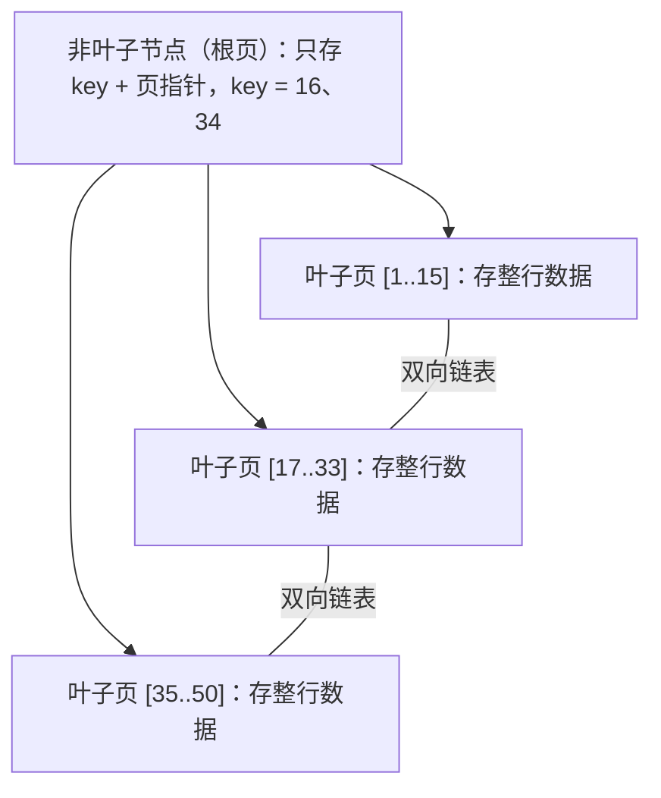

# 03 索引原理

> 本篇导读：为什么同一条 SQL，有的表查出来是毫秒级，有的却要扫全表几秒？秘密几乎都在"索引"上。本篇从"书的目录"这个比喻出发，讲清为什么 MySQL 最终选择了 B+Tree，聚簇索引、二级索引、回表到底是怎么回事，联合索引的最左前缀怎么用，哪些写法会让索引失效，以及怎么用 EXPLAIN 看懂执行计划。这是 MySQL 调优的基石。

## 一、索引是什么

你翻开一本几百页的技术书找"事务隔离级别"那一节，会怎么做？肯定先看**目录**，找到页码直接翻过去，而不是从第一页开始一页页扫。数据库的**索引（Index）就是这张目录**。

它的核心价值：

- **加快查询**：没有索引，MySQL 只能做"全表扫描"（从第一行读到最后一行）；有索引，可以直接定位到目标数据。
- **代价**：天下没有免费的午餐。索引要占磁盘空间；每次增删改数据，索引也要同步更新，所以**写操作会变慢**；索引太多还会拖慢优化器选计划的速度。

所以索引不是"建得越多越好"，而是"建得巧才好"。

## 二、索引的数据结构

为什么 MySQL 选了 B+Tree？我们挨个把"落选选手"枪毙一遍，答案就清楚了。

**为什么不用哈希表？**
哈希表按 key 算 hash 直接定位，等值查询 `WHERE id = 1` 极快（O(1)）。但它有个致命伤：**不支持范围查询**。`WHERE age > 18`、`BETWEEN 10 AND 20` 这类范围在哈希表上只能全表扫，因为 hash 值是散列的，相邻的 key 在磁盘上并不相邻。而业务里范围查询太常见了，所以哈希表只能当辅助（Memory 引擎、InnoDB 自适应哈希索引）。

**为什么不用二叉搜索树（BST / AVL / 红黑树）？**
二叉搜索树每个节点最多两个孩子，**树会非常高**。比如存一千万条数据，树高可能 20+ 层，意味着一次查询要 20+ 次磁盘 IO——这谁顶得住？而且如果插入有序（如自增 id），二叉搜索树会退化成**链表**，查询退化成 O(n)。

**为什么不用 B 树（B-Tree）？**
B 树已经是一棵"矮胖"的多叉树了，每个节点存多个 key。但 B 树的问题是：**非叶子节点也存数据**。这样一来，一个 16KB 的页里能放的 key 数量就少了（被数据挤占），树就会变高，IO 次数变多。

**为什么最终选 B+Tree？** 它完美解决了上面所有问题：

- **非叶子节点只存 key + 指针**（不存数据），所以一页能塞下极多 key，树更矮——三层就能存千万级数据。
- **叶子节点用双向链表相连**，天然支持范围查询（`WHERE id > 100` 顺着链表往后扫即可）。
- **所有查询都要走到叶子节点**，IO 次数稳定（树高固定），性能可预期。

```text
哈希表：等值快，范围崩 ❌
二叉搜索树：树太高，易退化链表 ❌
B 树：非叶子存数据，树偏高 ❌
B+Tree：非叶子只存key(矮) + 叶子链表(范围友好) ✅
```

## 三、B+Tree 结构

InnoDB 中，B+Tree 的每个节点对应一个 **16KB 的页（page）**：

- **非叶子节点**：只存 `key + 指针`（指针指向下一层页）。
- **叶子节点**：存**整行数据**（聚簇索引时）或主键值（二级索引时），并且叶子之间用**双向链表**串起来。



**经典面试题：三层 B+Tree 能存多少数据？**

来算一笔账：

- 一页 16KB。
- 非叶子节点：主键用 `BIGINT` 占 8 字节，指针在 InnoDB 中占 6 字节，一个 key+指针 ≈ 14 字节。一页约能放 `16KB / 14B ≈ 1170` 个 key。
- 假设一行数据约 1KB，叶子节点一页约放 `16KB / 1KB = 16` 行。
- 三层结构：第一层 1 页 → 第二层 1170 页 → 第三层叶子 `1170 × 1170` 页，每行 16 条：
  `1170 × 1170 × 16 ≈ 21,902,400`，即**约两千万条**。

也就是说，**两千万条数据，最多只要 3 次磁盘 IO 就能定位**——这就是 B+Tree 的威力。

## 四、聚簇索引与二级索引

**聚簇索引（Clustered Index）**：InnoDB 用主键构建的 B+Tree，**叶子节点存的是整行数据**。一张表有且只有一个聚簇索引（数据只能按一种顺序物理排布）。

**二级索引（Secondary Index，也叫辅助索引）**：在别的列上建的索引，它的 B+Tree **叶子节点存的不是整行，而是主键值**。

这就引出了数据库里一个极重要的概念——**回表**：


查询流程：先用二级索引找到对应的**主键值**，再拿主键值回聚簇索引把整行捞出来——这一步"回去捞完整数据"就叫**回表**，它要多一次 B+Tree 查找，有额外 IO 开销。

**主键为什么要显式定义？** InnoDB 的规则是：

1. 有显式 `PRIMARY KEY` → 用它做聚簇索引。
2. 没有 → 选第一个**非空唯一索引**做聚簇索引。
3. 再没有 → InnoDB **自动生成一棵 6 字节的隐藏 `row_id`** 当聚簇索引。

> 教训：一定要显式定义自增主键 `BIGINT`，否则 MySQL 帮你生成的隐藏 row_id 不可控，且用业务字段当主键容易导致聚簇索引分裂频繁。自增主键还能让插入总是追加在 B+Tree 末尾，减少页分裂。

## 五、回表与覆盖索引

**覆盖索引（Covering Index）** 是个能救命的优化：如果**查询要的所有列，恰好都在这个索引里**，那就不用回表了，直接在索引上就能拿到结果。

```sql
-- user 表有联合索引 idx_name_age (name, age)
-- 只查 name、age，索引里全有 → 覆盖索引，不用回表
EXPLAIN SELECT name, age FROM user WHERE name = '张三';
-- Extra 出现：Using index  ← 这就是覆盖索引的标志！

-- 查了 *（要整行），索引没有 address → 必须回表
EXPLAIN SELECT * FROM user WHERE name = '张三';
-- Extra 没有 Using index
```

`Using index` 是**覆盖索引生效**的信号，意味着查询只访问了索引树，省掉了回表 IO，性能直接起飞。所以设计索引时，经常把"查询频繁但又不想回表"的列顺手加进联合索引的末尾，人为制造覆盖索引。

## 六、索引分类

MySQL（InnoDB）常见索引类型：

| 类型 | 说明 | 创建语法 | 适用场景 |
| --- | --- | --- | --- |
| 主键索引 | 聚簇索引，唯一非空 | `PRIMARY KEY (id)` | 每行标识 |
| 唯一索引 | 值唯一，可 NULL | `UNIQUE KEY uk_email (email)` | 邮箱、手机号 |
| 普通索引 | 最常用，无约束 | `INDEX idx_name (name)` | 高频查询列 |
| 联合索引 | 多列组合 | `INDEX idx_a_b (a, b)` | 多条件查询 |
| 全文索引 | 分词检索 | `FULLTEXT KEY ft_title (title)` | 文章内容搜索 |
| 前缀索引 | 只索引字符串前 n 字符 | `INDEX idx_addr (address(20))` | 长字符串省空间 |

```sql
CREATE TABLE article (
  id      BIGINT PRIMARY KEY AUTO_INCREMENT,
  title   VARCHAR(200),
  author  VARCHAR(64),
  status  TINYINT,
  created_at DATETIME,
  -- 联合索引：常用于"按作者+状态筛选并按时间排序"
  INDEX idx_author_status_ct (author, status, created_at),
  -- 前缀索引：标题可能很长，只取前 20 字符建索引
  INDEX idx_title (title(20))
) ENGINE=InnoDB DEFAULT CHARSET=utf8mb4;
```

## 七、联合索引与最左前缀

联合索引 `(a, b, c)` 在 B+Tree 里其实是一条**按 a、再 b、再 c 排序**的链表。可以想象它先按 a 排，a 相同再按 b 排，b 相同再按 c 排：

```text
(a,b,c) 联合索引的有序性示意：
(1,2,3) → (1,2,5) → (1,3,1) → (2,1,9) → (2,4,6) → (3,?,?)
   ↑a相同        ↑a相同   ↑a升序      ↑a升序
   再比b         再比b
```

**最左前缀原则**：查询必须从联合索引的**最左列开始、且连续**，才能利用索引。像爬楼梯，得一级一级踩，不能跳过前面的台阶。

| 查询条件 | 能否用索引 | 说明 |
| --- | --- | --- |
| `WHERE a = 1` | ✅ 用 a | 命中最左 |
| `WHERE a = 1 AND b = 2` | ✅ 用 a,b | 连续前缀 |
| `WHERE a = 1 AND b = 2 AND c = 3` | ✅ 用 a,b,c | 全命中 |
| `WHERE b = 2` | ❌ 失效 | 没走最左 a |
| `WHERE a = 1 AND c = 3` | ⚠️ 只用 a | b 缺失，c 用不上 |

**范围查询右边的列索引失效**：如果某一列用了范围（如 `>`、`BETWEEN`），它**右边**的列就无法用索引排序/定位了：

```sql
-- a 等值、b 范围、c 用不上索引（被 b 的范围截断）
SELECT * FROM t WHERE a = 1 AND b > 10 AND c = 3;
-- 实际只用到了 (a, b)，c 在索引里的有序性被 b 的范围破坏
```

**索引下推 ICP（Index Condition Pushdown，MySQL 5.6+）**：在没有 ICP 的时代，存储引擎用索引找到候选行后，把整行回表丢给 Server 层去判断剩余条件；有了 ICP，可以在**存储引擎层就用索引里的条件先过滤**，减少回表次数。EXPLAIN 的 Extra 会显示 `Using index condition`。

```sql
-- (a,b) 联合索引，a 等值、b 范围
SELECT * FROM t WHERE a = 1 AND b LIKE '张%';
-- 5.6+ 会在索引层就用 b LIKE '张%' 过滤，再回表 → Using index condition
```

## 八、索引失效的场景

下面这些写法，再好的索引也会瞬间报废，逐条记牢（附反例与改写）：

1. **违反最左前缀**：`WHERE b = 2`（联合索引 `(a,b)` 没带 a）→ 该查 a。
2. **索引列上用函数/运算**：`WHERE YEAR(created_at) = 2024` 失效 → 改成 `created_at >= '2024-01-01' AND created_at < '2025-01-01'`。
3. **隐式类型转换**：字符串字段传数字，`WHERE phone = 13800138000`（phone 是 `VARCHAR`）→ MySQL 会帮你转成数字，等于对列用了函数，索引失效 → 改成 `WHERE phone = '13800138000'`。
4. **`LIKE` 以 `%` 开头**：`WHERE name LIKE '%明'` 失效 → 尽量 `%` 放结尾，或改用全文索引。
5. **`OR` 连接非索引列**：`WHERE a = 1 OR b = 2`（b 无索引）整条失效 → 拆成 `UNION` 或给 b 加索引。
6. **`!=`、`<>`、`NOT IN`**：通常导致全表扫 → 看能否用范围改写。
7. **`IS NULL` / `IS NOT NULL`**：是否失效看数据分布和优化器判断，并非绝对。
8. **优化器认为全表更快**：当查询结果占表很大比例时，回表代价过高，优化器会放弃索引直接扫全表（此时索引"主动失效"是合理选择）。

```sql
-- 反例：对列用函数，索引失效
EXPLAIN SELECT * FROM user WHERE SUBSTRING(name,1,1) = '张';

-- 改写：前缀匹配，索引可用
EXPLAIN SELECT * FROM user WHERE name LIKE '张%';
```

## 九、EXPLAIN 详解

`EXPLAIN` 是看执行计划的唯一正道。在任意 SELECT 前加 `EXPLAIN` 即可：

```sql
EXPLAIN SELECT * FROM user WHERE age > 18 ORDER BY name;
```

**完整字段说明表**：

| 字段 | 含义 |
| --- | --- |
| `id` | 查询中每个 SELECT 的编号，越大越先执行；相同 id 从上往下 |
| `select_type` | 查询类型：`SIMPLE` 简单查询、`PRIMARY` 主查询、`SUBQUERY` 子查询、`DERIVED` 派生表等 |
| `table` | 当前行访问的表 |
| `type` | **访问类型，性能依次递减（关键！）**：`system > const > eq_ref > ref > range > index > ALL` |
| `possible_keys` | 可能用到的索引 |
| `key` | **实际用到的索引**（NULL 表示没用） |
| `key_len` | 用到索引的长度（字节），可判断是否用了联合索引的哪些列 |
| `ref` | 与索引比较的列或常量 |
| `rows` | 预估要扫描的行数（越小越好） |
| `filtered` | 存储引擎返回后被过滤掉的百分比 |
| `Extra` | 额外信息（见下） |

**`type` 各档逐个解释**（从上到下越来越慢）：

- `system`：表里只有一行，极特殊。
- `const`：主键或唯一索引等值查询，最多返回一行，"常数级"。
- `eq_ref`：多表 JOIN，被驱动表用主键/唯一索引关联，每行只匹配一条。
- `ref`：非唯一索引等值查询，可能返回多行。
- `range`：索引范围查询（`BETWEEN`、`<`、`IN` 等）。
- `index`：全索引扫描（扫完整个索引树，比 ALL 好点因为索引小）。
- `ALL`：全表扫描，**最差**，必须优化。

**`key_len` 怎么算**：等于所用索引列的定义长度之和。例如 `VARCHAR(64)` utf8mb4 且可为 NULL，一列占 `64×4 + 2(长度位) + 1(NULL位) = 259` 字节；`BIGINT` 占 8 字节。通过 key_len 能判断联合索引到底用到了前几列。

**`Extra` 关键值**：

- `Using filesort`：需要额外排序，没用上索引顺序，**要优化**。
- `Using temporary`：用了临时表（常因 GROUP BY/ORDER BY 列不同），**要优化**。
- `Using index`：**覆盖索引**，好事。
- `Using where`：Server 层做了过滤。
- `Using join buffer`：JOIN 没用上索引，用了 join buffer，性能差。

**真实输出逐字段解读**：

| id | select_type | table | type | key | key_len | ref | rows | filt | Extra |
| --- | --- | --- | --- | --- | --- | --- | --- | --- | --- |
| 1 | SIMPLE | user | ref | idx_name | 259 | const | 1 | 100 | Using index condition |

解读：`type=ref` 说明走了非唯一索引等值查询（不错）；`key=idx_name` 实际用了名字索引；`rows=1` 预估只扫一行；`Extra=Using index condition` 说明触发了索引下推。整体是个好计划。

## 十、索引设计原则

一套可落地的设计规范：

- **区分度高的列才建索引**：性别这种只有两三个值的列建索引几乎没用（优化器大概率直接全表扫）。`COUNT(DISTINCT col)/COUNT(*)` 越接近 1 越适合建索引。
- **联合索引顺序**：区分度高的列放前面；**等值条件的列在前，范围条件的列在后**（避免截断后续列）。
- **避免冗余索引**：有了 `(a, b)` 就别再单独建 `(a)`——`(a,b)` 已经能服务只查 a 的场景。冗余索引只增加写负担。
- **控制单表索引数量**：建议不超过 5~6 个，写多读少的表更要克制。
- **长字符串用前缀索引**：`INDEX(addr(20))` 省空间，但**前缀索引会导致覆盖索引失效**（因为只存了前 20 字符，无法在索引里拿到完整列）。
- **定期清理无用索引**：用 `sys.schema_unused_indexes` 找出长期不用的索引删掉。

## 十一、索引优化实战

**案例 1：深分页慢查询**（见 SQL 篇），用延迟关联 + 联合索引解决。

**案例 2：隐式转换导致全表扫**
慢 SQL：`SELECT * FROM user WHERE phone = 13800138000;`（phone 是 VARCHAR）
`EXPLAIN` 显示 `type=ALL`。原因：phone 是字符串，传了数字，MySQL 做隐式转换等价于 `CAST(phone AS UNSIGNED) = 13800138000`，对列用了函数。
改写：`WHERE phone = '13800138000'`，立刻变成 `type=ref`，走索引。

**案例 3：ORDER BY Filesort**
慢 SQL：`SELECT * FROM orders WHERE status = 1 ORDER BY created_at DESC LIMIT 20;`
`EXPLAIN` 出现 `Using filesort`。建联合索引 `INDEX idx_status_ct (status, created_at)`，让排序直接沿用索引顺序，filesort 消失。

**案例 4：OR 击穿索引**
慢 SQL：`SELECT * FROM user WHERE name = '张三' OR age = 20;`（只有 name 有索引）
OR 连接了无索引的 age，导致整条放弃索引。改为：

```sql
SELECT * FROM user WHERE name = '张三'
UNION
SELECT * FROM user WHERE age = 20;   -- 并给 age 加索引
```

或给 age 也建索引，让优化器分别走索引再合并。

## 本篇小结

- **索引就是数据库的"目录"**，加速查询但拖慢写入、占空间。
- 哈希表不支持**范围查询**，二叉树**树太高**，B 树**非叶子存数据**，故 MySQL 选 **B+Tree**。
- B+Tree **非叶子只存 key+指针**（树矮），**叶子双向链表**（范围友好）。
- **三层 B+Tree 约存两千万条**，查询最多 3 次 IO。
- **聚簇索引叶子存整行**；二级索引叶子存**主键值**，需**回表**。
- 无显式主键时 InnoDB 用隐藏 **6 字节 row_id** 当聚簇索引。
- **覆盖索引**让查询只走索引不回表，Extra 显示 **`Using index`**。
- 联合索引遵循**最左前缀**，范围列右边的列会失效。
- **ICP 索引下推**（5.6+）在存储引擎层先过滤，减少回表。
- 索引失效八类：违反最左前缀、列上函数、**隐式类型转换**、`%`开头 LIKE、`OR` 非索引列、`!=`/`NOT IN` 等。
- `EXPLAIN` 的 `type` 优到劣：**`const > eq_ref > ref > range > index > ALL`**，目标避免 `ALL`。
- 设计原则：**区分度高才建、等值在前范围在后、避免冗余、长串用前缀索引**。

## 参考链接

- [MySQL 官方：B-Tree 与哈希索引](https://dev.mysql.com/doc/refman/8.0/en/index-btree-hash.html)
- [MySQL 官方：聚簇与二级索引](https://dev.mysql.com/doc/refman/8.0/en/innodb-index-types.html)
- [MySQL 官方：EXPLAIN 输出详解](https://dev.mysql.com/doc/refman/8.0/en/explain-output.html)
- [MySQL 官方：索引条件下推 ICP](https://dev.mysql.com/doc/refman/8.0/en/index-condition-pushdown-optimization.html)
- [丁奇《MySQL 实战45讲》](https://time.geekbang.org/column/intro/100020801)
- [《高性能 MySQL（第4版）》索引章节](https://www.oreilly.com/library/view/high-performance-mysql/9781492080515/)

下一篇 → [04 事务与 ACID](/java/db/transaction)
