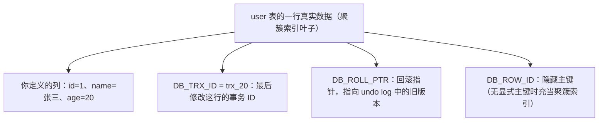
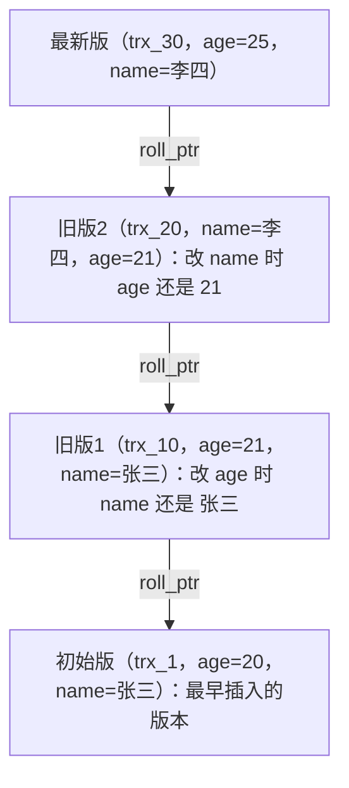
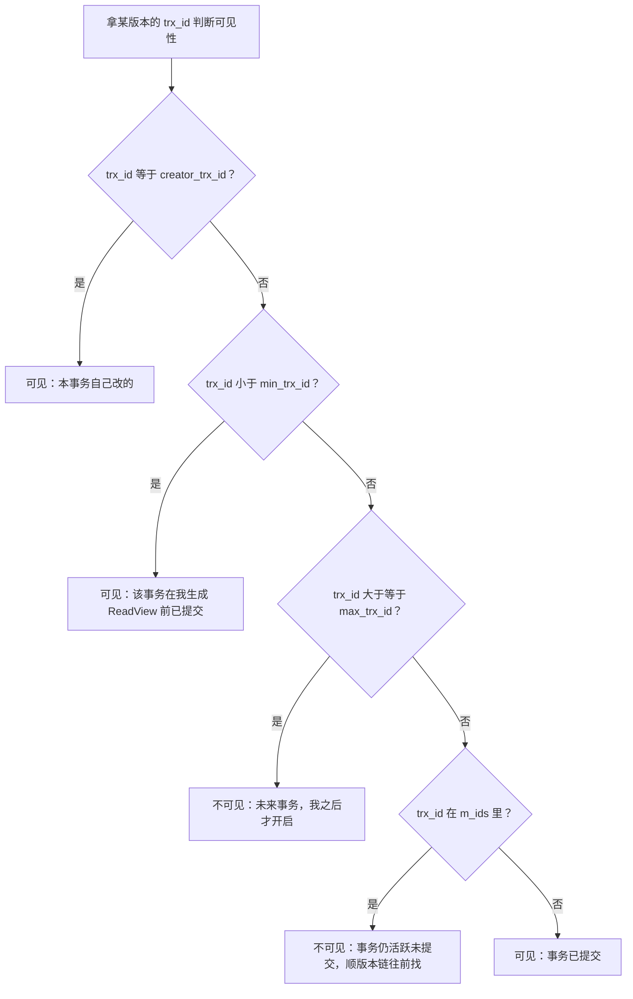
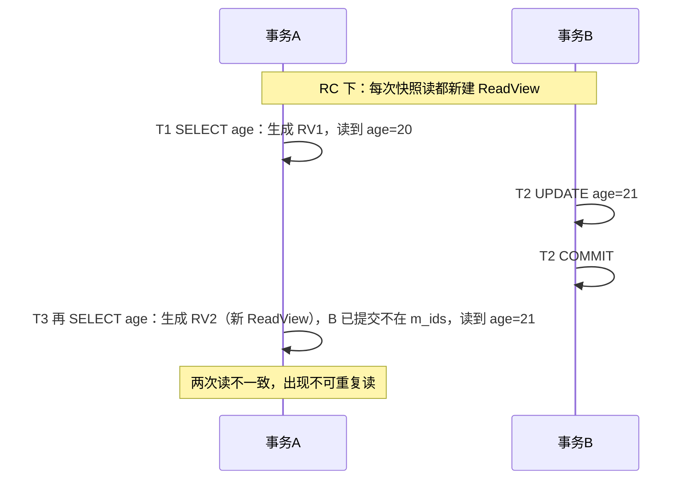
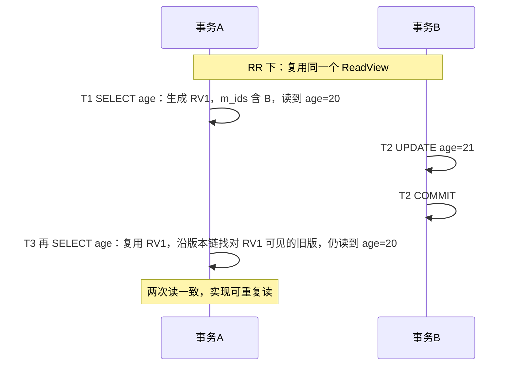

# 05 MVCC

> 本篇导读：上一章讲隔离级别时提到 RR 能"可重复读"，靠的就是本篇的主角 MVCC（多版本并发控制）。它让你在读书（SELECT）时不被写书的人（UPDATE）干扰，实现"读写不冲突"。本篇拆解隐藏字段、undo log 版本链、ReadView 可见性判断，并解释为什么 RC 会有不可重复读而 RR 不会——理解它，隔离级别就真正通透了。

## 一、什么是 MVCC

**MVCC（Multi-Version Concurrency Control，多版本并发控制）** 的核心思想一句话：**一行数据同时保存多个版本，读操作读历史版本，写操作生成新版本，读写互不阻塞**。

对比"纯加锁读"：如果读也要加锁，那读写就是串行的，性能极差。MVCC 让：

- **读不阻塞写**：读的是快照版本，写的是新版本，互不踩脚。
- **写不阻塞读**：读者的快照在写之前就定好了。

代价是：每行要额外存版本信息（靠隐藏字段），且旧版本要有人清理（靠 purge 线程）。

## 二、当前读与快照读

理解 MVCC，先分清两种"读"：

| 类型 | 行为 | 例子 |
| --- | --- | --- |
| 快照读 Snapshot Read | 读**历史版本**（MVCC 提供），不加锁 | 普通 `SELECT` |
| 当前读 Current Read | 读**最新已提交版本**并加锁 | `SELECT ... FOR UPDATE`、`SELECT ... LOCK IN SHARE MODE`、`INSERT/UPDATE/DELETE` |

```sql
SELECT * FROM user WHERE id = 1;              -- 快照读，无锁，读历史版本
SELECT * FROM user WHERE id = 1 FOR UPDATE;   -- 当前读，加 X 锁，读最新
UPDATE user SET age = 20 WHERE id = 1;        -- 当前读（要先读到最新再改）
```

为什么需要当前读？因为 UPDATE 必须基于"最新数据"去改，否则会覆盖别人的提交；同时加锁防止别人并发改同一行。而普通的 SELECT 用快照读就能满足"可重复读"且高并发。

## 三、隐藏字段

InnoDB 每行数据除了你定义的列，还偷偷加了三个隐藏字段：

| 隐藏列 | 含义 |
| --- | --- |
| `DB_TRX_ID` | 最后修改这行数据的**事务 ID** |
| `DB_ROLL_PTR` | **回滚指针**，指向 undo log 里的上一个版本 |
| `DB_ROW_ID` | 隐藏主键（没显式主键时由它充当聚簇索引） |



## 四、undo log 版本链

每次你 UPDATE/DELETE 一行，InnoDB 不会直接覆盖旧值，而是把"改前的值"写进 undo log，并通过 `DB_ROLL_PTR` 把新旧版本**串成一条链表**。链头是**最新版本**，顺着指针往回是越来越旧的版本。

以 `user` 表 `id=1` 这行为例，假设初始 `name='张三', age=20`，然后依次发生：

```text
事务10: UPDATE age=21       事务20: UPDATE name='李四'      事务30: UPDATE age=25
```

版本链演化如下（每版都带自己的 trx_id 和指向上一版的 roll_ptr）：



当某事务要"读历史版本"时，就从链头出发，顺着 roll_ptr 一路往前找，直到找到"对自己可见"的那个版本为止。这就是 MVCC 取数据的本质：**在版本链上挑一个可见的旧版本**。

## 五、ReadView

**ReadView（读视图）** 是 MVCC 判断"哪个版本对我可见"的裁判。每次快照读时，InnoDB 会生成一个 ReadView，它关键看四个字段：

| 字段 | 含义 |
| --- | --- |
| `m_ids` | 当前**活跃（未提交）**的事务 ID 列表 |
| `min_trx_id` | `m_ids` 中最小的事务 ID |
| `max_trx_id` | 预分配给下一个新事务的 ID（= 当前最大 trx_id + 1） |
| `creator_trx_id` | 生成这个 ReadView 的**当前事务**自己的 ID |

**可见性判断规则**（拿着某个版本的 `trx_id` 来比对）：

1. 如果 `trx_id == creator_trx_id`：是自己改的，**可见**。
2. 如果 `trx_id < min_trx_id`：说明修改该版本的事务在"我"生成 ReadView 前就已提交，**可见**。
3. 如果 `trx_id >= max_trx_id`：这是"未来"的事务（我生成 ReadView 之后才开启的），**不可见**。
4. 如果 `min_trx_id <= trx_id < max_trx_id`：看它是否在 `m_ids` 里——
   - **在 m_ids 里**（还活跃未提交）→ **不可见**，顺着版本链往前找；
   - **不在 m_ids 里**（已提交）→ **可见**。



顺着版本链一路应用这套规则，第一个"可见"的版本就是该事务应该读到的数据。

## 六、RC 与 RR 下 ReadView 的生成时机

**这是理解隔离级别差异的最关键结论，务必记死：**

- **RC（读已提交）**：**每次快照读都会生成一个新的 ReadView**。所以每次读都能"看到"别的事务刚提交的改动 → 同事务两次读可能不同 → **不可重复读**。
- **RR（可重复读）**：**只在第一次快照读时生成 ReadView，之后整个事务都复用这一个**。所以后面无论别的事务怎么提交，你的 ReadView 不变，看到的永远是"第一次读那一刻"的快照 → **可重复读**。

带时序的对比示例（初始 `user id=1, age=20`）：





注意 RR 下"可重复读"的精髓：**不是数据没变，而是你的 ReadView 一直没换，所以永远读到同一个历史快照。**

## 七、MVCC 如何解决不可重复读

用上面的时序直接说明：在 RR 中，事务 A 的两次 `SELECT` 用的是**同一个 ReadView**。第一次读后，事务 B 提交了 `age=21`，但这个新版本的 `trx_id` 在 A 的 ReadView 的 `m_ids` 里（B 在 A 生成 ReadView 时还活跃），根据规则 4 它"不可见"，于是 A 顺着版本链找到对自己可见的旧版本 `age=20`。

因此 A 两次读都得到 20，**不可重复读被 MVCC 解决**。RC 之所以解决不了，是因为它第二次读换了新 ReadView，B 这时已不在活跃列表里，新版本就可见了。

## 八、MVCC 与幻读

回到事务篇的幻读问题：MVCC 解决的是**快照读**的幻读，但**当前读的幻读要靠 next-key lock 解决**。

- **快照读幻读**：事务 A 两次普通 `SELECT ... WHERE age>18`，第二次如果只依赖 MVCC 快照，看不到 B 新插入的行，所以无幻读。
- **当前读幻读**：如果 A 用 `SELECT ... FOR UPDATE` 或执行 `UPDATE/DELETE`，这些是当前读，必须看到最新数据。此时仅靠 MVCC 不够，需要 InnoDB 在 RR 下加 **next-key lock（临键锁 = 记录锁 + 间隙锁）**，把"满足条件的间隙"锁住，让 B 插不进新行，从而也杜绝幻读。

所以完整的说法是：**MVCC 负责快照读不幻读，next-key lock 负责当前读不幻读**，二者配合，RR 才能真正防住幻读（详见锁机制篇）。

## 九、purge 与版本清理

版本链不能无限长。旧版本什么时候被清理？答案是：**当没有任何活跃事务还需要它时，由 purge 线程回收**。

InnoDB 通过 ReadView 机制能算出"最老的那个 ReadView 还可能需要哪些旧版本"，比那更早的版本就可以安全删掉。purge 线程负责真正删除这些过期 undo 记录和打了删除标记的数据行。

**长事务为什么危险？** 因为长事务会长期持有它的 ReadView，导致它启动那一刻之后的所有旧版本都无法被 purge 清理。结果：

- 版本链越积越长，undo log 膨胀；
- 回滚段（rollback segment）占用大量空间；
- 后续查询要顺着更长的版本链找可见版本，变慢。

> 一句话：**长事务是 undo 日志和版本的"垃圾回收"的拦路虎。**

## 十、实战：长事务的危害与排查

查询当前活跃的长事务：

```sql
-- 查看运行超过 10 秒的事务
SELECT
  trx_id, trx_state, trx_started,
  TIMESTAMPDIFF(SECOND, trx_started, NOW()) AS duration_sec,
  trx_query
FROM information_schema.innodb_trx
WHERE trx_started < NOW() - INTERVAL 10 SECOND;
```

**危害总结**：占锁不释放（容易引发锁等待和死锁）、阻塞 purge（undo 膨胀）、占连接资源。

**规避建议**：

- 把大事务拆成小事务，分批提交。
- 事务里**不要做 RPC / HTTP 调用**等慢操作——网络一卡，事务就变长。
- 设置语句超时：`SET MAX_EXECUTION_TIME=2000 ...`（单位毫秒）防止单条跑太久。
- 监控长事务（如 Prometheus + exporter 告警），定期排查。
- 必须做"全表扫描式更新"时，加 `LIMIT` 分批，避免一个事务锁全表。

## 本篇小结

- **MVCC 让一行数据多版本并存，读历史、写新版本，读写不阻塞**。
- 普通 SELECT 是**快照读**（无锁），`FOR UPDATE`/DML 是**当前读**（加锁读最新）。
- 每行有隐藏字段 **`DB_TRX_ID` / `DB_ROLL_PTR` / `DB_ROW_ID`**。
- **undo log 版本链**由 roll_ptr 串起，链头是最新版本。
- **ReadView 四个字段**：`m_ids` / `min_trx_id` / `max_trx_id` / `creator_trx_id`。
- 可见性规则核心：**已提交且早于 min 可见，活跃(in m_ids)不可见，未来事务不可见**。
- **RC 每次快照读新建 ReadView → 不可重复读**；**RR 复用同一 ReadView → 可重复读**。
- MVCC 解决**快照读幻读**，当前读幻读靠 **next-key lock**。
- **purge 线程**回收无人需要的旧版本；长事务会阻塞它。
- **长事务危害**：占锁、阻塞 purge、undo 膨胀、查询变慢。
- 排查用 **`information_schema.innodb_trx`**，规避靠拆事务、事务内不做 RPC。

## 参考链接

- [MySQL 官方：InnoDB 多版本与 MVCC](https://dev.mysql.com/doc/refman/8.0/en/innodb-multi-versioning.html)
- [MySQL 官方：undo log 与 purge](https://dev.mysql.com/doc/refman/8.0/en/innodb-undo-logs.html)
- [MySQL 官方：事务隔离级别](https://dev.mysql.com/doc/refman/8.0/en/innodb-transaction-isolation-levels.html)
- [丁奇《MySQL 实战45讲》](https://time.geekbang.org/column/intro/100020801)
- [《高性能 MySQL（第4版）》](https://www.oreilly.com/library/view/high-performance-mysql/9781492080515/)
- [MySQL Source: read_view 可见性说明](https://dev.mysql.com/doc/dev/mysql-server/latest/)

下一篇 → [06 锁机制](/java/db/lock)
