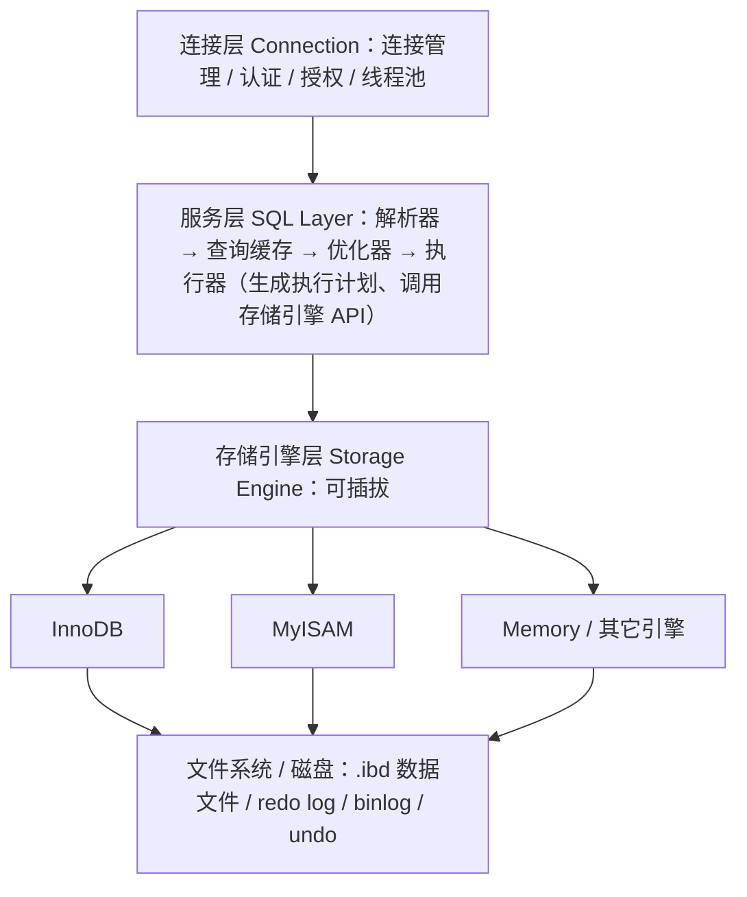

# 01 MySQL 基础

> 本篇导读：很多同学一上来就背"索引怎么建""事务隔离级别有几种"，却说不清 MySQL 到底由哪几层组成。本篇先打地基：数据库是什么、MySQL 的体系结构与可插拔存储引擎、常用数据类型该怎么选、约束与范式是怎么回事。地基稳了，后面索引、事务、锁才能讲得透。

## 一、数据库是什么

想象你是一个图书管理员。最开始你把借书记录写在一个 Excel 里，几千行还能忍；等到几万、几十万行，每次找"张三借了哪些书"都要从头扫到尾，还要担心两个人同时改把数据覆盖掉。这时候你就需要一个**带索引、支持并发查询、有约束保护、容量近乎无限的"智能文件柜"**——这就是数据库。

和 Excel 比，数据库强在这几点：

- **查询能力**：一条 SQL 就能按任意条件筛选、聚合、排序，底层有索引帮你想好怎么最快拿到数据。
- **并发控制**：多个用户同时读写，数据库用锁和 MVCC 保证不互相踩脚。
- **约束保护**：主键、唯一、外键、非空等约束，从机制上杜绝脏数据。
- **容量与持久化**：数据落盘且可恢复，远非一个文件能比。

MySQL 是世界上最流行的开源关系型数据库，读作"My Sequel"或"My S-Q-L"。它的角色，就是替你管好那座"智能文件柜"。

## 二、关系型数据库基本概念

关系型数据库用"二维表"组织数据，核心术语有一套自己的说法，初学时容易和日常用语混淆，先对齐一下：

| 术语（标准叫法） | 也常叫 | 说明 |
| --- | --- | --- |
| 数据库 Database | 库 | 一组相关表的集合，如 `shop_db` |
| 表 Table | 表 | 同一类实体的集合，如 `user` 表 |
| 行 Row | 记录 / 元组 | 一条具体数据，如"用户 id=1 的张三" |
| 列 Column | 字段 / 属性 | 一个属性，如 `username`、`age` |
| 主键 Primary Key | PK | 唯一标识一行的列（或列组合） |
| 外键 Foreign Key | FK | 指向另一张表主键的引用列 |
| 约束 Constraint | 约束 | 限制列取值的规则 |

> 小提醒：面试里经常问"字段和列有什么区别"。严格说**字段（field）偏向 Java 实体里的属性，列（column）偏向数据库表里的列**，日常混用没问题，但心里要知道它们分属应用层与存储层。

## 三、安装与环境

最省事的方式是 Docker 一键起一个 MySQL 8，下面是一份可直接用的 `docker-compose.yml`：

```yaml
version: "3.8"
services:
  mysql:
    image: mysql:8.0
    container_name: canoe-mysql
    environment:
      MYSQL_ROOT_PASSWORD: root123
      MYSQL_DATABASE: shop_db
      TZ: Asia/Shanghai
    ports:
      - "3306:3306"
    command:
      - --character-set-server=utf8mb4
      - --collation-server=utf8mb4_unicode_ci
    volumes:
      - ./mysql-data:/var/lib/mysql
```

执行 `docker compose up -d` 即可。Windows 上也可以直接装 MySQL Installer，但无论哪种方式，有一件事必须盯死：**字符集要用 `utf8mb4`，不要用 `utf8`**。

这是因为 MySQL 里的 `utf8` 其实是"假 utf8"——它最多只占 **3 个字节**，而真正的 UTF-8 一个字符最多 4 字节。emoji 表情（如 😀）、某些生僻汉字正好需要 4 字节，用 `utf8` 存会直接报 `Incorrect string value` 错误。所以请务必用 `utf8mb4`，它才是完整的 UTF-8。

```sql
-- 建库时务必带上字符集
CREATE DATABASE shop_db
  DEFAULT CHARACTER SET utf8mb4
  DEFAULT COLLATE utf8mb4_unicode_ci;
```

## 四、MySQL 的体系结构

MySQL 不是"一块铁板"，而是分层的。理解分层，才能理解为什么"存储引擎可以换"、为什么"binlog 和 redo log 是两套"。



- **连接层**：负责和客户端握手、做账号密码认证、权限校验，维护连接线程。
- **服务层**：所有跨存储引擎的事都在这——SQL 解析成语法树、优化器选执行计划、执行器真正去跑。binlog 也在这里产生。
- **存储引擎层**：真正"存数据、取数据"的地方，是一个个可插拔的插件。InnoDB、MyISAM 都是这里的"选手"。
- **文件系统**：最终落地成磁盘文件。

**关键认知：存储引擎是可插拔的。** 一张表可以用 InnoDB，另一张表可以用 MyISAM，互不影响。这正是 MySQL 灵活的地方。

## 五、存储引擎对比

最常用的三个引擎对比如下：

| 特性 | InnoDB | MyISAM | Memory |
| --- | --- | --- | --- |
| 事务 | ✅ 支持 | ❌ 不支持 | ❌ 不支持 |
| 锁粒度 | 行锁 | 表锁 | 表锁 |
| 外键 | ✅ 支持 | ❌ 不支持 | ❌ 不支持 |
| 崩溃恢复 | 强（redo/undo） | 弱（需 repair） | 无（重启即丢） |
| 全文索引 | 5.6+ 支持 | 支持 | 不支持 |
| 数据位置 | 磁盘（缓冲池缓存） | 磁盘 | 内存 |
| 适用场景 | 99% 业务表 | 只读/报表统计 | 临时缓存 |

**结论：自 MySQL 5.5 起，InnoDB 就是默认且几乎是唯一推荐的选择。** 需要事务、需要并发、需要崩溃后不丢数据，全靠它。后面所有索引、事务、锁、MVCC 的篇幅，默认都是讲 InnoDB。

## 六、常用数据类型

选对数据类型，表就成功了一半。下面按类别讲，并给出"怎么选"的建议。

**整数类型**：`TINYINT`(1B) / `SMALLINT`(2B) / `MEDIUMINT`(3B) / `INT`(4B) / `BIGINT`(8B)。

一个经典坑：`INT(11)` 里的 `11` **不是长度限制，只是显示宽度**（ zerofill 时才看得出），它完全不影响能存多大。存年龄用 `TINYINT UNSIGNED` 就够；存订单号这种可能很大的，老实用 `BIGINT`。

**小数类型**：金额**绝对不要用 `FLOAT` / `DOUBLE`**——它们是浮点数，会有精度误差（`0.1 + 0.2 != 0.3` 那种坑）。必须用 `DECIMAL(M, D)`，它是定点数，按字符串精确存储。例如 `DECIMAL(10, 2)` 表示总共 10 位、小数点后 2 位。

**字符串类型**：

- `CHAR(n)`：定长，不足补空格，适合长度固定的列（如身份证号、MD5）。
- `VARCHAR(n)`：**n 是字符数不是字节数**。utf8mb4 下一个汉字占 3~4 字节，`VARCHAR(255)` 最多存 255 个字符。
- `TEXT`：长文本，不能建普通索引（只能前缀索引），尽量别往表里塞大文本。

**日期时间类型**：

- `DATETIME`：范围 `1000-01-01 ~ 9999-12-31`，与时区无关，占 8 字节。
- `TIMESTAMP`：范围 `1970-01-01 ~ 2038-01-19`，**受时区影响**，占 4 字节。这就是著名的 **2038 问题**——到 2038 年它会溢出。新项目建议优先用 `DATETIME`。

**枚举与 JSON**：`ENUM` 适合取值固定的列（如状态），但扩展性差；MySQL 5.7+ 原生支持 `JSON` 类型并支持生成列索引，存半结构化数据很方便。

选型速查表：

| 场景 | 推荐类型 |
| --- | --- |
| 主键自增 id | `BIGINT UNSIGNED AUTO_INCREMENT` |
| 金额 | `DECIMAL(10,2)` |
| 短字符串（姓名、标题） | `VARCHAR(64)` |
| 长文本 | `TEXT`（或干脆放对象存储） |
| 创建时间 | `DATETIME` / `TIMESTAMP` |
| 是否删除（逻辑删） | `TINYINT(1)` 或 `BIT` |
| 性别、状态 | `TINYINT` / `ENUM` |

## 七、表的约束

约束是"保证人不会往数据库里塞垃圾"的闸门：

- **主键 PRIMARY KEY**：唯一且非空，一张表只能有一个。InnoDB 会拿它当聚簇索引。
- **唯一 UNIQUE**：值不能重复（但可以有多个 NULL）。
- **非空 NOT NULL**：列必须有值。建议核心字段都加，避免满屏 NULL 判断。
- **默认 DEFAULT**：插入时没给值就用默认值。
- **外键 FOREIGN KEY**：保证引用完整性。但**互联网公司一般不用物理外键**——它会在写入时去查父表、加锁，影响性能；通常改由业务代码自己保证一致性。
- **自增 AUTO_INCREMENT**：插入时自动生成递增的 id。

```sql
CREATE TABLE user (
  id        BIGINT UNSIGNED NOT NULL AUTO_INCREMENT COMMENT '主键',
  username  VARCHAR(64)  NOT NULL COMMENT '用户名',
  age       TINYINT UNSIGNED DEFAULT 0 COMMENT '年龄',
  email     VARCHAR(128) DEFAULT NULL COMMENT '邮箱',
  status    TINYINT      NOT NULL DEFAULT 1 COMMENT '1正常 0禁用',
  created_at DATETIME    NOT NULL DEFAULT CURRENT_TIMESTAMP,
  PRIMARY KEY (id),
  UNIQUE KEY uk_username (username)
) ENGINE=InnoDB DEFAULT CHARSET=utf8mb4;
```

## 八、库表操作 DDL

DDL（Data Definition Language）负责"建房子"，常见语句：

```sql
-- 建库
CREATE DATABASE IF NOT EXISTS shop_db DEFAULT CHARSET utf8mb4;

-- 建表（见上节）
CREATE TABLE ...

-- 加一列
ALTER TABLE user ADD COLUMN phone VARCHAR(20) DEFAULT NULL COMMENT '手机号';

-- 改列类型
ALTER TABLE user MODIFY COLUMN age SMALLINT UNSIGNED NOT NULL DEFAULT 0;

-- 删列
ALTER TABLE user DROP COLUMN phone;

-- 删表（连结构带数据全没，谨慎！）
DROP TABLE IF EXISTS user;

-- 清空表（结构保留，数据清空，自增重置）
TRUNCATE TABLE user;
```

**DROP vs DELETE vs TRUNCATE** 是面试常客，必须分清：

| 操作 | 删结构 | 删数据 | 可回滚 | 重置自增 | 速度 | 触发触发器 |
| --- | --- | --- | --- | --- | --- | --- |
| `DROP TABLE` | ✅ 删表 | ✅ | ❌（DDL） | - | 最快 | ❌ |
| `TRUNCATE` | ❌ | ✅ | ❌（DDL） | ✅ 重置 | 快 | ❌ |
| `DELETE` | ❌ | ✅（可加 WHERE） | ✅（事务内） | ❌ 不重置 | 慢（逐行） | ✅ |

一句话：**想连表一起消失用 DROP；想快速清空且不要回滚用 TRUNCATE；想按条件删且能回滚用 DELETE。**

## 九、客户端工具

日常和 MySQL 打交道，不一定非要在黑框框里敲命令，常用兵器有：

- **命令行 `mysql`**：`mysql -h 127.0.0.1 -P 3306 -u root -p` 连上后直接敲 SQL，最朴素也最通用。
- **Navicat**：老牌图形化工具，功能全，付费。
- **DataGrip**：JetBrains 出品，智能提示极强，和 IDEA 一家。
- **IDEA 内置 Database**：写 Java 的同学几乎零成本上手。
- **DBeaver**：开源免费，跨平台，社区版够用。

命令行几个常用参数：`\G` 把结果竖着显示（列多时超好用）、`\s` 看服务器状态、`SOURCE xxx.sql` 执行脚本文件。

## 十、数据库设计范式

范式是"减少数据冗余、避免更新异常"的规范，重点掌握前三范式：

- **1NF 第一范式（原子性）**：列不可再分。比如不能把"省-市-区"塞在一个 `address` 字段里，要拆成三列。
- **2NF 第二范式（消除部分依赖）**：非主键列必须依赖**整个**主键，而不是只依赖主键的一部分。常见于"联合主键"场景——比如订单明细表 `(订单id, 商品id)` 做主键，而"商品名称"只依赖"商品id"（部分依赖），应当把商品信息单独抽成商品表。
- **3NF 第三范式（消除传递依赖）**：非主键列不能依赖另一个非主键列。比如用户表里放了"部门名称"，而部门名称依赖"部门id"，部门id 又依赖用户id，这就是传递依赖，应该把部门信息抽到部门表。

但**范式不是金科玉律**。真实项目大量使用"反范式"设计——故意冗余字段换查询性能。例如订单表直接冗余"用户昵称""商品标题"，这样展示订单列表时不用去 JOIN 用户表、商品表，一个表搞定。代价是要自己维护冗余字段的一致性。**经验法则：写多读少、一致性要求高的核心表遵循范式；读多写少、追求查询速度的报表/展示表可以适当反范式冗余。**

## 本篇小结

- **数据库**是带索引、支持并发与约束的"智能文件柜"，远强于 Excel。
- **术语对齐**：行=记录、列=字段、主键唯一标识一行。
- MySQL 安装务必使用 **`utf8mb4`**，原生 `utf8` 仅 3 字节存不了 emoji。
- MySQL 体系分为**连接层、服务层、存储引擎层、文件系统**四层。
- **存储引擎可插拔**，`InnoDB` 自 5.5 起是默认且几乎唯一推荐。
- **金额必须用 `DECIMAL`**，绝不用 `FLOAT`/`DOUBLE` 避免精度丢失。
- `INT(11)` 的 `11` 是显示宽度，**不代表能存多大**。
- `VARCHAR(n)` 的 **n 是字符数不是字节数**。
- `TIMESTAMP` 有 **2038 问题**，新项目优先 `DATETIME`。
- **互联网公司一般不用物理外键**，由业务层保证一致性。
- **`DROP`/`TRUNCATE` 是 DDL 不可回滚**，`DELETE` 可在事务内回滚。
- 三范式讲**原子性、消除部分依赖、消除传递依赖**，但可读多写少表适当反范式冗余。

## 参考链接

- [MySQL 8.0 官方参考手册](https://dev.mysql.com/doc/refman/8.0/en/)
- [MySQL 字符集与 utf8mb4 说明](https://dev.mysql.com/doc/refman/8.0/en/charset-unicode-utf8mb4.html)
- [InnoDB 存储引擎官方文档](https://dev.mysql.com/doc/refman/8.0/en/innodb-storage-engine.html)
- [MySQL 数据类型官方文档](https://dev.mysql.com/doc/refman/8.0/en/data-types.html)
- [丁奇《MySQL 实战45讲》](https://time.geekbang.org/column/intro/100020801)
- [《高性能 MySQL（第4版）》](https://www.oreilly.com/library/view/high-performance-mysql/9781492080515/)

下一篇 → [02 SQL 语句](/java/db/sql)
