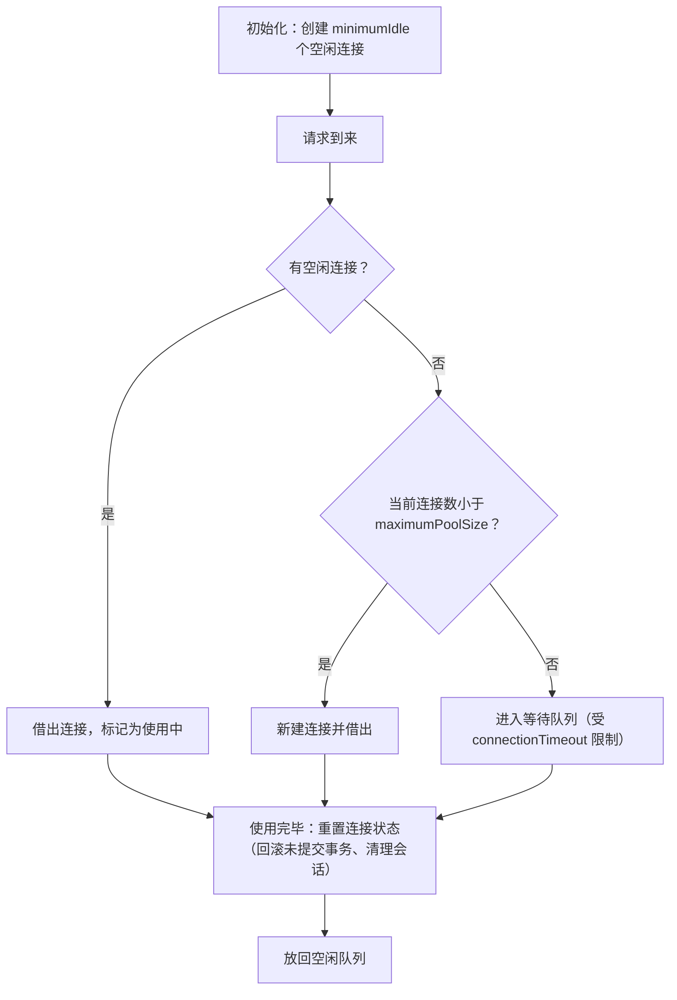

# 08 连接池

> 本篇导读：上篇 JDBC 用 `DriverManager.getConnection` 每次都新建连接——这在生产环境是灾难。一次 `getConnection` 背后是一次 TCP 三次握手 + MySQL 认证 + 权限校验，高并发下数据库会被活活拖垮。解决方案就是**连接池**：提前建好一批连接循环复用。本篇讲清连接池原理、HikariCP 与 Druid 的对比、核心参数怎么配、最大连接数怎么设、`maxLifetime` 与 `wait_timeout` 的坑、连接泄漏怎么查，最后给 Spring Boot 集成配置。

## 一、为什么需要连接池

先算一笔账。假设一次 TCP 建连 + MySQL 认证约耗时 10ms（还没算业务 SQL），那么：

- 不用连接池，1000 QPS 意味着每秒新建 1000 个连接，光握手就吃掉 10 秒/秒——**不可能**。
- 更糟的是，每次请求完就 `close()` 断开，下次又重连，**数据库的连接管理开销被无限放大**，连接数瞬间打满，新请求全部阻塞或报错。

连接池的做法：**启动时就建好一批连接放在池里，请求来了"借"一个用，用完"还"回去（不是真关），下一个请求接着用**。省掉了反复建连的开销。

```text
不用连接池： 请求 → 建连(10ms) → 查 → 关连 → 下一个又建连 ... （灾难）
用连接池：   请求 → 从池借连接(0.01ms) → 查 → 归还池 → 复用
```

## 二、连接池的工作原理



**关键认知：连接池里的"关闭"不是真关闭。** 你调用 `connection.close()` 时，连接池拦截了这个调用，把连接**重置状态后放回池**，而不是断开 TCP。真正的断开只在连接池销毁或连接失效时发生。

## 三、HikariCP

**HikariCP 是 Spring Boot 2/3 的默认连接池**，以"快"闻名。它的高性能来自几个设计：

- **极致轻量**：代码量小，去掉一切不必要抽象。
- **FastList**：自研的集合类，相比 `ArrayList` 做了读多写少、反向遍历的优化。
- **ConcurrentBag**：无锁的并发容器，减少锁竞争，提升借还连接的吞吐。
- 字节码级优化，去掉 `invokedynamic` 等开销。

Maven 依赖（Spring Boot 项目通常已自带，无需单独引）：

```xml
<dependency>
    <groupId>com.zaxxer</groupId>
    <artifactId>HikariCP</artifactId>
    <version>5.0.1</version>
</dependency>
```

Java 配置示例（注意每个 import 单独列出）：

```java
package com.canoe.db.pool;

import com.zaxxer.hikari.HikariConfig;
import com.zaxxer.hikari.HikariDataSource;

import javax.sql.DataSource;

/**
 * HikariCP 最小配置示例。
 */
public class HikariConfigDemo {

    public static DataSource buildDataSource() {
        // 用配置对象构建数据源
        HikariConfig config = new HikariConfig();
        config.setJdbcUrl("jdbc:mysql://127.0.0.1:3306/shop_db?useUnicode=true&characterEncoding=utf8mb4");
        config.setUsername("root");
        config.setPassword("root123");
        // 最小空闲连接数
        config.setMinimumIdle(5);
        // 最大连接数
        config.setMaximumPoolSize(20);
        // 连接最大存活时间（必须 < MySQL wait_timeout）
        config.setMaxLifetime(1800000);
        // 获取连接超时（毫秒）
        config.setConnectionTimeout(30000);
        // 连接泄漏检测阈值（毫秒），超时会打印告警
        config.setLeakDetectionThreshold(60000);

        // 全局只需一个 HikariDataSource 实例
        return new HikariDataSource(config);
    }
}
```

## 四、Druid

**Druid 是阿里开源的连接池，最大卖点是监控。** 它不仅能管连接，还能：

- **SQL 监控**：统计每条 SQL 的执行次数、耗时、慢 SQL。
- **Web 监控页面**：内置 `druid/stat/view` 控制台，可视化看连接池状态。
- **WallFilter 防 SQL 注入**：内置 SQL 防火墙，拦截危险 SQL。
- **慢 SQL 日志**：超过阈值的 SQL 自动记录。

Maven 依赖：

```xml
<dependency>
    <groupId>com.alibaba</groupId>
    <artifactId>druid-spring-boot-starter</artifactId>
    <version>1.2.20</version>
</dependency>
```

Java 配置示例（开启 StatFilter 和 WallFilter）：

```java
package com.canoe.db.pool;

import com.alibaba.druid.pool.DruidDataSource;
import com.alibaba.druid.wall.WallFilter;

import javax.sql.DataSource;
import java.util.ArrayList;
import java.util.List;

/**
 * Druid 配置示例：开启监控与 SQL 防火墙。
 */
public class DruidConfigDemo {

    public static DataSource buildDataSource() {
        DruidDataSource ds = new DruidDataSource();
        ds.setUrl("jdbc:mysql://127.0.0.1:3306/shop_db?useUnicode=true&characterEncoding=utf8mb4");
        ds.setUsername("root");
        ds.setPassword("root123");
        ds.setInitialSize(5);
        ds.setMinIdle(5);
        ds.setMaxActive(20);
        // 慢 SQL 阈值（毫秒）
        ds.setSlowSqlMillis(1000);
        ds.setLogSlowSql(true);
        // 开启 SQL 防火墙
        WallFilter wallFilter = new WallFilter();
        List<com.alibaba.druid.filter.Filter> filters = new ArrayList<>();
        filters.add(wallFilter);
        ds.setProxyFilters(filters);
        return ds;
    }
}
```

## 五、两者对比

| 维度 | HikariCP | Druid |
| --- | --- | --- |
| 性能 | ⭐ 略优（极致优化） | 很好，略逊 |
| 监控 | 弱（靠外部如 Prometheus） | ⭐ 强（内置 Web 页面、SQL 统计） |
| 功能 | 专注连接池 | ⭐ SQL 防火墙、慢 SQL、统计全 |
| 社区/生态 | Spring Boot 默认，活跃 | 阿里维护，国内生态好 |
| 选择建议 | 要极致性能、轻量 | 要监控、要 SQL 防护 |

**实践建议**：纯微服务、追求性能、已有外部监控体系 → 选 **HikariCP**；需要开箱即用的 SQL 监控、慢 SQL 排查、防注入 → 选 **Druid**。两者都能用好，别纠结。

## 六、核心参数

逐个解释并给建议值（以 HikariCP 为准，Druid 字段名略有不同）：

| 参数 | 含义 | 建议 |
| --- | --- | --- |
| `minimumIdle` | 最小空闲连接数 | 与业务平稳期 QPS 匹配，如 5~10 |
| `maximumPoolSize` | 最大连接数 | 见第七节公式，通常 10~50 |
| `connectionTimeout` | 获取连接超时 | **默认 30s**，高并发可调小到 3~5s 快速失败 |
| `idleTimeout` | 空闲连接超时回收 | 默认 10min，小于 maxLifetime |
| `maxLifetime` | 连接最大存活时间 | **必须 < MySQL `wait_timeout`**，建议 1800s(30min) |
| `validationTimeout` | 连接校验超时 | 默认 5s |
| `leakDetectionThreshold` | 连接泄漏检测 | 很有用，设为 60s（超时会告警） |

```java
package com.canoe.db.pool;

import com.zaxxer.hikari.HikariConfig;

/**
 * 核心参数配置说明。
 */
public class PoolParamsDemo {
    public static void configure(HikariConfig config) {
        config.setMinimumIdle(5);            // 最小空闲：保持 5 个热连接
        config.setMaximumPoolSize(20);       // 最大连接：峰值上限
        config.setConnectionTimeout(30000);  // 拿连接最多等 30s，超时抛异常
        config.setIdleTimeout(600000);       // 空闲 10min 回收
        config.setMaxLifetime(1800000);      // 连接活 30min 后强制重建（< wait_timeout）
        config.setLeakDetectionThreshold(60000); // 借出 60s 未还 → 告警，疑似泄漏
    }
}
```

## 七、maximumPoolSize 怎么设

**连接数不是越大越好！** 这是最常见的误区。很多人觉得"多开点连接并发就高"，结果适得其反。

原因是：数据库连接本质是**一个工作线程在处理一个连接**。连接数超过数据库的 CPU 核数后，线程上下文切换开销急剧上升，每个查询都在"等 CPU"，吞吐反而下降。MySQL 官方经验公式（PostgreSQL 作者也提过类似思路）：

```text
connections ≈ ((core_count * 2) + effective_spindle_count)
```

即：连接数 ≈ CPU 核数 × 2 + 磁盘数。对常见 4~8 核、SSD 的机器，单库连接数在 **10~30** 之间往往是最优区间。

**压测思路**：从较小值（如 10）起步，逐步加压并观察数据库 `Threads_running` 和 QPS/RT。当加大连接数 RT 反而上升、CPU 上下文切换暴涨，就说明过线了，回退到拐点前的值。实战中 **10~50** 是绝大多数单体服务的合理范围，别一上来设 200。

## 八、maxLifetime 与 wait_timeout

这是生产最常见的"灵异报错"来源。

`maxLifetime` 是连接池认为"这条连接最多活多久就报废重建"；`wait_timeout` 是 **MySQL 服务端**认为"这条空闲连接多久不用就主动断开"。如果 `maxLifetime` 大于 `wait_timeout`：连接池还觉得连接"活着"，但 MySQL 早已把它断开了，应用拿来用就报经典错误：

```text
com.mysql.jdbc.exceptions.jdbc4.CommunicationsException:
The last packet successfully received from the server was XXX milliseconds ago.
The last packet sent successfully to the server was YYYY milliseconds ago.
```

意思是：连接早被服务端掐了，你还当它是好的。

**配置建议**：

```java
package com.canoe.db.pool;

import com.zaxxer.hikari.HikariConfig;

/**
 * maxLifetime 必须小于 MySQL wait_timeout。
 */
public class MaxLifetimeDemo {
    public static void configure(HikariConfig config) {
        // MySQL 默认 wait_timeout = 28800 秒(8小时)
        // 让连接池在 30 分钟就主动重建，远小于服务端 8 小时阈值，留出安全余量
        config.setMaxLifetime(30 * 60 * 1000L); // 1800000 ms
    }
}
```

经验法则：**`maxLifetime` 设成 `wait_timeout` 的 1/2 ~ 2/3**，且至少比它小几分钟，给网络抖动留余量。改完可在测试环境抓到该类报错消失来验证。

## 九、连接泄漏

**连接泄漏**：业务代码借了连接却没还（异常分支漏关、忘记 try-with-resources、事务长期不提交），池子里的连接被慢慢借光，最终 `getConnection` 全部超时，服务"假死"。

排查方式：

1. **Hikari 的 `leakDetectionThreshold`**：借出连接超过该阈值未还，会打印 `Connection leak detection` 堆栈，直接定位到借连接的代码行。
2. **Druid 的 `removeAbandoned`**：开启后自动回收"超时未还"的废弃连接，并打印日志。
3. **`SHOW PROCESSLIST`**：看数据库侧连接数是否只增不减、状态多为 `Sleep`。

```java
package com.canoe.db.pool;

import com.zaxxer.hikari.HikariConfig;

/**
 * 连接泄漏检测配置。
 */
public class LeakDemo {
    public static void configure(HikariConfig config) {
        // 借出超过 60s 没还就告警（值应大于正常业务耗时，小于整体超时）
        config.setLeakDetectionThreshold(60000);
    }
}
```

> 根治办法：**永远用 try-with-resources**，保证任何异常路径都能归还连接；不要在事务里做 RPC 等慢操作。

## 十、Spring Boot 集成

Spring Boot 对两种连接池都有 starter，配置写在 `application.yml`，每项加注释。

**HikariCP 配置**：

```yaml
spring:
  datasource:
    url: jdbc:mysql://127.0.0.1:3306/shop_db?useUnicode=true&characterEncoding=utf8mb4&serverTimezone=Asia/Shanghai
    username: root
    password: root123
    # 指定使用 HikariCP（Spring Boot 默认就是这个）
    type: com.zaxxer.hikari.HikariDataSource
    hikari:
      minimum-idle: 5
      maximum-pool-size: 20
      connection-timeout: 30000
      idle-timeout: 600000
      max-lifetime: 1800000        # 必须小于 MySQL wait_timeout
      leak-detection-threshold: 60000
```

**Druid 配置**：

```yaml
spring:
  datasource:
    url: jdbc:mysql://127.0.0.1:3306/shop_db?useUnicode=true&characterEncoding=utf8mb4&serverTimezone=Asia/Shanghai
    username: root
    password: root123
    type: com.alibaba.druid.pool.DruidDataSource
    druid:
      initial-size: 5
      min-idle: 5
      max-active: 20
      # 慢 SQL 与防火墙
      filter:
        stat:
          enabled: true
          slow-sql-millis: 1000
          log-slow-sql: true
        wall:
          enabled: true
      # 开启 Web 监控页面（访问 /druid 查看）
      stat-view-servlet:
        enabled: true
        url-pattern: /druid/*
        login-username: admin
        login-password: admin123
```

配上 Druid 后，访问 `http://你的服务/druid/` 就能看到 SQL 监控、连接池状态、慢 SQL 排行，是排查慢查询的利器。

## 本篇小结

- **连接池复用连接，避免反复 TCP 握手+认证拖垮数据库**。
- 池里"关闭"是**归还而非断开**，真正断开只在失效/销毁时。
- **HikariCP 是 Spring Boot 默认**，靠 FastList + ConcurrentBag 极致优化。
- **Druid 监控强**，内置 SQL 统计、慢 SQL、WallFilter 防注入、Web 页面。
- 核心参数：`minimumIdle`/`maximumPoolSize`/`connectionTimeout`/`maxLifetime`/`leakDetectionThreshold`。
- **`maxLifetime` 必须 < MySQL `wait_timeout`**，否则报"last packet"错误。
- **`maximumPoolSize` 不是越大越好**，约 CPU核数×2，超了上下文切换反降吞吐。
- 连接泄漏靠 **`leakDetectionThreshold` / `removeAbandoned`** + `SHOW PROCESSLIST` 排查。
- 根治泄漏：**永远用 try-with-resources**，事务内不做 RPC。
- Spring Boot 配 `application.yml` 即可，Druid 可开 `/druid` 监控页。

## 参考链接

- [HikariCP GitHub](https://github.com/brettwooldridge/HikariCP)
- [HikariCP 配置说明（Wiki）](https://github.com/brettwooldridge/HikariCP/wiki/About-Pool-Sizing)
- [Druid GitHub](https://github.com/alibaba/druid)
- [Druid Spring Boot Starter 文档](https://github.com/alibaba/druid/tree/master/druid-spring-boot-starter)
- [MySQL wait_timeout 官方文档](https://dev.mysql.com/doc/refman/8.0/en/server-system-variables.html#sysvar_wait_timeout)
- [Spring Boot 数据源官方文档](https://docs.spring.io/spring-boot/docs/current/reference/htmlsingle/#data.sql)

下一篇 → [返回专栏首页](/java/db/mysql-base)
