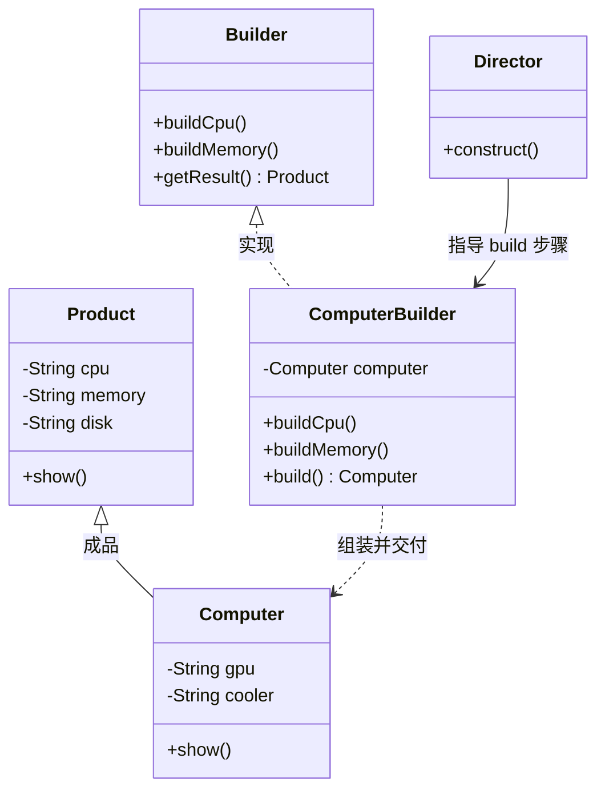

# 05 建造者模式

你要组装一台电脑：CPU、内存、硬盘、显卡、机箱、电源……少一样开不了机，顺序还讲究（先主板后显卡）。如果用一个含 6 个参数的构造器 `new Computer(cpu, mem, disk, gpu, case, power)`，调用方很容易把"32G 内存"填到"显卡"位上，而且还有一堆可选配件。建造者模式（Builder）就是来解决"**参数多、有必填有选填、要按步骤拼装**"这种对象的创建问题——它把"造电脑"拆成一步步 `build`，最后一次性 `build()` 出整机。本文用"组装电脑"和"麦当劳套餐"两条线讲清它，并顺带拆穿 Lombok `@Builder` 的几个常见坑。

## 一、它是什么

一句话大白话：**建造者模式把"复杂对象的构造"从对象本身剥离到一个专门的 Builder 里，让你像搭乐高一样一步步拼，最后一次性交付成品**。

生活化比喻：你去麦当劳点"巨无霸套餐"，店员（Builder）先定主菜、加饮料、加薯条、选大小，全部配齐后一次性把套餐递给你——你不用关心"套餐对象"内部怎么把这几样塞进一个纸袋，只要"逐步点单"即可。

经典定义（GoF）：**Separate the construction of a complex object from its representation so that the same construction process can create different representations.** 将一个复杂对象的构建与其表示分离，使得同样的构建过程可以创建不同的表示。

## 二、为什么需要它（不用会怎样）

先看"不用建造者"的苦：

```java
package com.canoe.pattern.builder;

// 没有建造者：要么 telescoping constructor（重叠构造器）地狱，要么 setter 满天飞
public class BadComputer {
    private String cpu;     // 必填
    private String memory;  // 必填
    private String disk;    // 必填
    private String gpu;     // 选填
    private String power;   // 必填
    private String cooler;  // 选填

    // 重叠构造器：必填 3 个、4 个、5 个……重载到怀疑人生
    public BadComputer(String cpu, String memory, String disk) {
        this(cpu, memory, disk, null, null, null);
    }
    public BadComputer(String cpu, String memory, String disk, String gpu) {
        this(cpu, memory, disk, gpu, null, null);
    }
    public BadComputer(String cpu, String memory, String disk, String gpu, String power) {
        this(cpu, memory, disk, gpu, power, null);
    }
    public BadComputer(String cpu, String memory, String disk, String gpu, String power, String cooler) {
        this.cpu = cpu; this.memory = memory; this.disk = disk;
        this.gpu = gpu; this.power = power; this.cooler = cooler;
    }
}
```

痛点：

- **参数顺序灾难**：6 个参数一长串，调用方极易把"电源"填到"显卡"位，编译不报错、运行才炸。
- **重叠构造器爆炸**：必填+选填组合越多，构造器重载越多，代码又臭又长。
- **对象半成品可见**：用 setter 分步设字段时，对象在"还没设完"的状态就可能被别人拿到，线程不安全、状态不一致。
- **不可变对象难做**：想要 `final` 字段的不可变对象，setter 方案直接报废。

建造者的作用：**把构造拆成清晰步骤，必填在构造器里、选填用同名方法链式返回 Builder，最后 `build()` 一次性交付不可变成品**。

## 三、结构与角色



| 角色 | 职责 | 说明 |
| --- | --- | --- |
| `Product`（产品） | 最终要造的复杂对象（如 `Computer`） | 通常字段 `final`，不可变 |
| `Builder`（抽象建造者） | 声明各 `buildXxx()` 步骤与 `getResult()` | 可省，常用具体 Builder 直接上 |
| `ConcreteBuilder`（具体建造者） | 真正实现每一步，持有待装配的产品 | 链式调用返回自身 |
| `Director`（指挥者） | 规定装配顺序，调用 Builder 各步骤 | 可省略，常用"流式 Builder"替代 |
| `Client`（调用方） | 创建 Builder、按需设参、最后 `build()` | 只跟 Builder 打交道 |

## 四、代码实现

手写一个不可变、链式调用的 `Computer` 建造者，完整可运行：

```java
package com.canoe.pattern.builder;

// 成品：电脑。字段用 final 保证不可变，没有 setter
public class Computer {
    private final String cpu;     // 必填
    private final String memory;  // 必填
    private final String disk;    // 必填
    private final String gpu;     // 选填，可无
    private final String power;   // 必填
    private final String cooler;  // 选填，可无

    // 构造器私有：外部只能通过 Builder 创建
    private Computer(Builder b) {
        this.cpu = b.cpu;
        this.memory = b.memory;
        this.disk = b.disk;
        this.gpu = b.gpu;
        this.power = b.power;
        this.cooler = b.cooler;
    }

    public void show() {
        System.out.println("组装完成 -> CPU:" + cpu + ", 内存:" + memory
                + ", 硬盘:" + disk + ", 显卡:" + (gpu == null ? "集成显卡" : gpu)
                + ", 电源:" + power + ", 散热:" + (cooler == null ? "原装风扇" : cooler));
    }

    // 静态内部 Builder：必填进构造器，选填用同名方法链式返回自身
    public static class Builder {
        private final String cpu;
        private final String memory;
        private final String disk;
        private final String power;
        private String gpu;
        private String cooler;

        // 必填项在 Builder 构造器里强制传入
        public Builder(String cpu, String memory, String disk, String power) {
            this.cpu = cpu;
            this.memory = memory;
            this.disk = disk;
            this.power = power;
        }

        public Builder gpu(String gpu) {
            this.gpu = gpu;
            return this; // 关键：返回 this 实现链式
        }

        public Builder cooler(String cooler) {
            this.cooler = cooler;
            return this;
        }

        // 最后一步：校验必填、装配成品并返回
        public Computer build() {
            if (cpu == null || memory == null || disk == null || power == null) {
                throw new IllegalStateException("必填配件缺失，无法装机！");
            }
            return new Computer(this);
        }
    }

    // 演示
    public static void main(String[] args) {
        Computer gaming = new Computer.Builder("i9", "32G", "2T SSD", "850W")
                .gpu("RTX 4090")
                .cooler("360 水冷")
                .build();
        gaming.show();

        Computer office = new Computer.Builder("i5", "16G", "512G SSD", "500W")
                .build(); // 不配显卡与散热，用默认值
        office.show();
    }
}
```

运行输出：

```text
组装完成 -> CPU:i9, 内存:32G, 硬盘:2T SSD, 显卡:RTX 4090, 电源:850W, 散热:360 水冷
组装完成 -> CPU:i5, 内存:16G, 硬盘:512G SSD, 显卡:集成显卡, 电源:500W, 散热:原装风扇
```

## 五、链式调用与 Lombok @Builder

上面的链式写法很爽，但手写了一大堆样板。Lombok 的 `@Builder` 能让它"秒变"：

```java
package com.canoe.pattern.builder;

import lombok.Builder;
import lombok.ToString;

// Lombok 一行搞定链式 Builder
@Builder
@ToString
class LombokComputer {
    private String cpu;
    private String memory;
    private String disk;
    private String gpu;
}

class LombokDemo {
    public static void main(String[] args) {
        LombokComputer c = LombokComputer.builder()
                .cpu("i7")
                .memory("16G")
                .disk("1T SSD")
                .build();
        System.out.println(c);
    }
}
```

但 `@Builder` 有几个**真坑**，踩过的人不少：

1. **默认值失效**：你给字段写了 `private String gpu = "集成显卡";`，`@Builder` 生成的构造器会**用参数覆盖默认值**——如果调用方没 `.gpu(...)`，结果不是"集成显卡"而是 `null`。要默认值得配合 `@Builder.Default`：

   ```java
   @Builder.Default
   private String gpu = "集成显卡"; // 这样不填时才是"集成显卡"
   ```

2. **没有无参构造器**：`@Builder` 不会生成普通无参构造器，若框架（如 JSON 反序列化、ORM）需要无参构造，得额外加 `@NoArgsConstructor`，但加了又和 `@Builder` 冲突（final 字段无法无参），常需 `@AllArgsConstructor` 一起上。

3. **与 `@Data`/`@Value` 的字段覆盖**：`@Builder` 是按"全参构造器"工作的，若字段是 `final` 且类同时有 `@Builder`，务必保留全参构造；混用 `@Data` 时容易因 `equals/hashCode` 把 Builder 状态算进去而出错。

4. **校验失效**：手写的 `build()` 里能抛 `IllegalStateException` 校验必填；`@Builder` 默认不校验，必填要靠 `@NonNull` 或在 `@Builder` 外自行处理。

一句话：**`@Builder` 省样板，但默认值和必填校验要额外小心**。

## 六、与工厂模式的区别

二者都"替你创建对象"，但关注点完全不同：

- **工厂模式**关注"**造哪一个整体**"：给个类型，返回一个现成产品，不关心内部怎么拼。比如工厂方法选 `CheesePizza` 还是 `DurianPizza`。
- **建造者模式**关注"**按什么步骤一步步拼装出这个复杂对象**"：同一个 `Computer` 类，通过不同 Builder 步骤拼出游戏本/办公本。

打个比方：工厂是"直接给你一整台成品车"，建造者是"你坐在 4S 店一点一点选配，最后交车"。**产品内部差异大、装配步骤多是建造者的舞台；产品种类多是工厂的舞台。**

## 七、优缺点

| 优点 | 缺点 |
| --- | --- |
| **可读性强**：链式调用一目了然，避免长参数顺序错乱 | **代码量上升**：要多写一个 Builder 类（Lombok 可缓解） |
| **支持必填/选填分离**：必填入构造器，选填入方法 | **对象臃肿时 Builder 也臃肿**：字段几十个时 Builder 同样庞大 |
| **可造不可变对象**：成品字段 final，线程安全 | **过度设计风险**：字段只有两三个时没必要上建造者 |
| **屏蔽装配细节**：调用方只管"点单"，不管内部顺序 | **与框架集成的坑**：无参构造/默认值问题（见第五节） |
| **可逐步扩展部件**：加选填项不影响已有调用方 | **Builder 自身可变**：Builder 不是线程安全的，别多线程共用 |

## 八、适用场景

- **参数多且有选填的构造**：如 `Computer`、`HttpRequest`、`SQL` 构造器。
- **构造复杂 SQL / HTTP 请求**：MyBatis 的 `SQL` 类、OkHttp 的 `Request.Builder` 都是典范。
- **套餐/配置组装**：麦当劳套餐、保险方案、订单优惠组合，按步骤拼。
- **不可变对象创建**：希望成品 `final`、无 setter 又要灵活装配时。
- **文档/报表生成**：分步填充标题、段落、表格，最后 `build()` 出文档。

**什么情况下不要用**：对象只有两三个字段、且必填选填都少，直接构造器或 setter 更清爽，上建造者是过度设计。

## 九、在 JDK / 开源框架中的应用

- **`java.lang.StringBuilder` / `StringBuffer`**：最贴近的"建造者"思想，`.append()` 逐步拼字符，最后 `toString()` 产出不可变 `String`。
- **`java.util.stream.Stream.Builder`**：`Stream.builder().add(x).add(y).build()` 流式构建流。
- **OkHttp `Request.Builder` / `OkHttpClient.Builder`**：HTTP 请求与客户端全用 Builder 拼，链式优雅。
- **MyBatis `SQL` 类**：`new SQL().SELECT("*").FROM("user").WHERE("id=1").toString()` 逐步拼 SQL，正是建造者。
- **Spring `UriComponentsBuilder` / `BeanDefinitionBuilder`**：URI 构建、Bean 定义构建都用 Builder 模式。

## 十、与相近模式的区别

| 对比项 | 建造者模式 | 工厂模式 | 原型模式 |
| --- | --- | --- | --- |
| **关注点** | 分步拼装复杂对象 | 选哪个现成产品 | 拷贝已有对象 |
| **产出差异** | 同一类不同配置 | 不同类的实例 | 与源对象同类的副本 |
| **使用场景** | 字段多、有装配顺序 | 产品种类多 | 创建成本高、需大量副本 |

## 本篇小结

- **建造者模式**将复杂对象的"构建"与"表示"分离，调用方按步骤拼装最后一次性交付。
- **必填项放 Builder 构造器、选填项用同名方法**，链式 `return this` 是标准写法。
- 手写 `build()` 可**集中校验必填**，避免产出"半成品"对象。
- 成品字段设为 `final` + 无 setter，可得到**线程安全的不可变对象**。
- **重叠构造器（telescoping constructor）**是反模式，参数多时应优先建造者。
- **Lombok `@Builder`** 省样板，但**默认值需用 `@Builder.Default`** 才生效。
- `@Builder` **不会生成无参构造器**，与 JSON/ORM 反序列化集成时要注意。
- **`@NonNull` 或 `@Builder` 外校验**才能补上 Lombok 缺失的必填检查。
- 建造者关注"**怎么一步步拼**"，工厂关注"**造哪一个整体**"，二者不冲突可组合。
- **`StringBuilder`、OkHttp `Request.Builder`、MyBatis `SQL`** 都是建造者的真实落地。
- 字段只有两三个时**别硬上建造者**，否则是过度设计。
- 字段几十个时 Builder 也会臃肿，可考虑拆分子 Builder 或分步 Director 收敛复杂度。

## 参考链接

- [Refactoring Guru · 建造者模式](https://refactoringguru.cn/design-patterns/builder)
- [菜鸟教程 · 建造者模式](https://www.runoob.com/design-pattern/builder-pattern.html)
- [Project Lombok · @Builder 官方文档](https://projectlombok.org/features/Builder)
- [OkHttp · Request.Builder](https://square.github.io/okhttp/4.x/okhttp/okhttp3/-request/-builder/)
- [MyBatis 官方文档 · SQL 构建](https://mybatis.org/mybatis-3/zh/statement-builders.html)
- [Oracle JavaDoc · StringBuilder](https://docs.oracle.com/en/java/javase/17/docs/api/java.base/java/lang/StringBuilder.html)
- [Spring 官方文档 · UriComponentsBuilder](https://docs.spring.io/spring-framework/docs/current/javadoc-api/org/springframework/web/util/UriComponentsBuilder.html)

下一篇 → [06 原型模式](/java/design-pattern/prototype)
