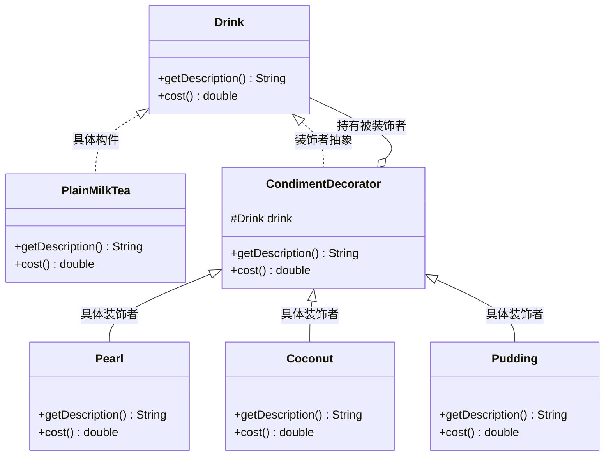

# 08 装饰器模式

点奶茶时你一定干过这事：先要一杯原味奶茶，然后"加珍珠、加椰果、加布丁"——每加一样，这杯饮料还是那杯饮料，只是**多了点东西、贵了点钱**。装饰器模式（Decorator）就是这套"加料"逻辑在代码里的翻版：它**不改变原对象的接口，动态地给对象叠加新职责**。本篇用"奶茶加料"这根主线，讲清它为什么比继承优雅。

## 一、它是什么

一句话大白话：**装饰器就是给对象"穿衣服"**，一层套一层，每套一层就多一项能力，但外表（接口）始终没变。

生活化比喻：你光着身子（裸对象），先穿内衣、再穿毛衣、再围围巾——每加一件，你还是"你"，别人照样认得你，只是你更暖和了。对应到代码：原味奶茶先被"珍珠"包一层，再被"椰果"包一层，它仍是 `Drink`，调用 `cost()` 会一路把各层加料钱累加出来。

经典定义（GoF）：**动态地给一个对象添加一些额外的职责**。就增加功能而言，装饰器模式比生成子类（继承）更为灵活。

## 二、为什么需要它（不用会怎样）

继续奶茶的例子。基础奶茶有若干种（原味、抹茶、乌龙），加料也有若干种（珍珠、椰果、布丁、红豆）。如果**不用**装饰器，用继承硬凑：

```java
package com.canoe.pattern.decorator.before;

// 不用装饰器：每种"基础 × 加料"组合都得单独建类
public class PlainMilkTea { /* 原味 */ }
class PearlMilkTea extends PlainMilkTea { /* 原味+珍珠 */ }
class CoconutMilkTea extends PlainMilkTea { /* 原味+椰果 */ }
class PearlCoconutMilkTea extends PlainMilkTea { /* 原味+珍珠+椰果 */ }
// 抹茶也要再来一遍…… 2 种基础 × 4 种加料 = 8 个类起步
```

痛点：

- **类爆炸**：基础 M 种、加料 N 种，组合会产生大量子类。
- **静态、不灵活**：加料是编译期钉死的，"临时想加双份珍珠"根本表达不了。
- **重复代码**：每个子类都要重写价格累加逻辑，改规则要改一片类。

装饰器让加料在**运行期**一层层"包"上去，基础类和加料类彻底正交。

## 三、结构与角色



| 角色 | 对应到奶茶 | 职责 |
| --- | --- | --- |
| **Component（组件接口）** | `Drink` | 被装饰者和装饰者的共同抽象，定义 `getDescription()`/`cost()` |
| **ConcreteComponent（具体构件）** | `PlainMilkTea` | 被装饰的"裸"对象，初始状态 |
| **Decorator（装饰者抽象）** | `CondimentDecorator` | 实现 Component，**持有**一个 Component 引用 |
| **ConcreteDecorator（具体装饰者）** | `Pearl`/`Coconut`/`Pudding` | 在委托原有行为前后，追加自己的职责（加料/加价） |

关键：**装饰者自己也是 `Drink`**，所以它能再被另一个装饰者包住，形成任意深度的链条。

## 四、代码实现

```java
package com.canoe.pattern.decorator;

// 组件接口：所有饮料（被装饰者与装饰者）的共同抽象
public interface Drink {
    // 返回描述
    String getDescription();
    // 返回价格
    double cost();
}
```

```java
package com.canoe.pattern.decorator;

// 具体构件：原味奶茶（被装饰的"裸"对象）
public class PlainMilkTea implements Drink {
    @Override
    public String getDescription() {
        return "原味奶茶";
    }

    @Override
    public double cost() {
        return 8.0;
    }
}
```

```java
package com.canoe.pattern.decorator;

// 装饰者抽象：所有加料的基类，本身也是 Drink，并持有被装饰者
public abstract class CondimentDecorator implements Drink {
    // 关键：装饰者"包"住一个被装饰的饮料
    protected Drink drink;

    // 通过构造器把被装饰者塞进来
    public CondimentDecorator(Drink drink) {
        this.drink = drink;
    }
}
```

```java
package com.canoe.pattern.decorator;

// 具体装饰者：珍珠
public class Pearl extends CondimentDecorator {
    public Pearl(Drink drink) {
        super(drink);
    }

    @Override
    public String getDescription() {
        // 在原有描述后追加自己的料
        return drink.getDescription() + " + 珍珠";
    }

    @Override
    public double cost() {
        // 在原价基础上叠加料钱
        return drink.cost() + 2.0;
    }
}
```

```java
package com.canoe.pattern.decorator;

// 具体装饰者：椰果
public class Coconut extends CondimentDecorator {
    public Coconut(Drink drink) {
        super(drink);
    }

    @Override
    public String getDescription() {
        return drink.getDescription() + " + 椰果";
    }

    @Override
    public double cost() {
        return drink.cost() + 1.5;
    }
}
```

```java
package com.canoe.pattern.decorator;

// 具体装饰者：布丁
public class Pudding extends CondimentDecorator {
    public Pudding(Drink drink) {
        super(drink);
    }

    @Override
    public String getDescription() {
        return drink.getDescription() + " + 布丁";
    }

    @Override
    public double cost() {
        return drink.cost() + 3.0;
    }
}
```

```java
package com.canoe.pattern.decorator;

// 演示：自由加料，层层包裹
public class DecoratorDemo {
    public static void main(String[] args) {
        // 先来一杯原味奶茶
        Drink tea = new PlainMilkTea();
        System.out.println(tea.getDescription() + " ￥" + tea.cost());

        // 加珍珠
        tea = new Pearl(tea);
        // 再加椰果
        tea = new Coconut(tea);
        // 最后加布丁
        tea = new Pudding(tea);

        System.out.println(tea.getDescription() + " ￥" + tea.cost());
    }
}
```

运行输出：

```text
原味奶茶 ￥8.0
原味奶茶 + 珍珠 + 椰果 + 布丁 ￥14.5
```

## 五、为什么比继承好

用"咖啡加料"再算一笔账：

- 基础咖啡 M 种（美式、拿铁、卡布……），调料 N 种（摩卡、奶泡、糖……）。
- **用继承**：M 种基础 × N 种调料 = **M×N 个类**（"加摩卡加奶泡的拿铁"都要一个类）。加一种调料，M 个类跟着涨。
- **用装饰器**：M 个基础类 + N 个调料类 = **M+N 个类**。加一种调料，只加 1 个类，还能"双份摩卡"地重复包裹。

```text
  继承：M 种基础 × N 种调料 = M×N 个类（爆炸）
  装饰器：M 种基础 + N 种调料 = M+N 个类（正交）
  且装饰器支持运行期任意组合、重复叠加，继承天生做不到
```

装饰器把"**静态的类的乘法**"变成了"**运行期对象的加法**"。

## 六、JDK IO 流里的装饰器

Java 的 IO 流是装饰器模式的教科书级范例。拆开下面这行：

```java
package com.canoe.pattern.decorator.io;

import java.io.BufferedInputStream;
import java.io.FileInputStream;
import java.io.InputStream;

// 经典装饰链：BufferedInputStream 装饰 FileInputStream
public class IoDemo {
    public static void main(String[] args) throws Exception {
        // 最里层：具体构件，负责真正从文件读字节
        InputStream in = new FileInputStream("a.txt");
        // 外层：装饰者，加上"缓冲"能力，读得更快
        in = new BufferedInputStream(in);
        int b;
        while ((b = in.read()) != -1) {
            // 逐字节读取（实际应批量读，这里仅为示意）
        }
        in.close();
    }
}
```

逐层看清谁装饰谁：

- `InputStream`：**组件接口**（抽象构件）。
- `FileInputStream`：**具体构件**，真正从文件读字节。
- `FilterInputStream`：**装饰者抽象**，持有 `InputStream` 引用。
- `BufferedInputStream`：**具体装饰者**，包住 `FileInputStream`，叠加"缓冲"职责——对外还是 `InputStream`，但读起来更快。
- 同理还有 `DataInputStream`（读基本类型）、`ObjectInputStream`（读对象）、`GZIPInputStream`（解压）等，可以像叠衣服一样任意组合：`new GZIPInputStream(new BufferedInputStream(new FileInputStream("a.gz")))`。

## 七、与代理模式的区别

- **目的不同**：装饰器是**增强**对象功能（加料、加缓冲），关注"多出点能力"；代理是**控制**对对象的访问（懒加载、权限、远程调用），关注"能不能、怎么访问"。
- **客户端知情权不同**：装饰器里**客户端清楚**自己传进去的是什么、加的哪层料；代理里**客户端往往不知道**真实对象是谁，代理在背后替它藏着。
- **持有方式**：两者都持有目标引用，但装饰器通常**由客户端主动一层层包**，代理通常是**框架/工厂一次性生成**后直接给客户端用。

## 八、优缺点

| 优点 | 缺点 |
| --- | --- |
| **比继承灵活**：运行期动态增减职责，支持重复叠加 | 装饰链过长时，调试和排错要一层层剥开，定位麻烦 |
| 避免**类爆炸**，职责正交拆分 | 会产生大量小装饰类，类数量变多（但远小于继承） |
| **符合开闭原则**：加新装饰者不改老代码 | 装饰顺序可能影响结果（如先加糖再加奶 vs 反过来），需注意 |
| 可以组合出任意复杂行为，粒度细 | 初学者容易写出 `new A(new B(new C(x)))` 这种嵌套深的表达式 |

## 九、适用场景

- **需要动态、透明地给对象加功能**，且不影响其他对象时（如 IO 缓冲、压缩、加密）。
- **不适合用继承扩展**（类已被 final，或会导致子类爆炸）。
- **撤销功能**也容易：不包那一层即可。
- **GUI 组件**：给文本框动态加滚动条、边框等。
- **Web 中间件**：给请求加日志、鉴权、限流等拦截层（责任链+装饰思路）。

什么情况下**不要**用：如果功能组合非常固定、且只有一两种，直接写个子类反而更清楚，不必上装饰器。

## 十、在 JDK / 开源框架中的应用

- **`java.io` 包**：`FilterInputStream`/`FilterOutputStream`/`FilterReader` 及其子类（`BufferedInputStream`、`DataInputStream`、`BufferedReader` 等）是标准装饰者。
- **`java.util.Collections`**：`Collections.unmodifiableList(...)`、`synchronizedList(...)`、`checkedList(...)` 用装饰器给集合加"不可修改/同步/类型检查"等能力，返回的仍是 `List`。
- **Spring `BeanWrapper` / `TransactionAwareCacheDecorator`**：后者用装饰器给 `Cache` 增加事务感知能力。
- **MyBatis `CachingExecutor`**：用装饰器给 `Executor` 包一层二级缓存逻辑，接口不变。
- **Servlet `HttpServletRequestWrapper` / `HttpServletResponseWrapper`**：容器提供包装类，让你方便地装饰请求/响应（如统一加字符编码）。

它们都用装饰器**在不改原接口的前提下叠加能力**。

## 十一、与相近模式的区别

| 模式 | 目的 | 结构 | 使用场景 |
| --- | --- | --- | --- |
| **代理** | 控制访问，隐藏真实对象 | 持有目标，通常一次性生成 | 懒加载/权限/远程调用 |
| **适配器** | 改变接口以对接不兼容 | 包一层翻译接口 | 兼容旧接口/第三方 |
| **装饰器** | 保持接口，动态增强职责 | 同接口层层包裹 | 运行期加功能/加料 |

一句话：**装饰器保接口以加料，代理藏对象以控访问，适配器改接口以兼容**。

## 本篇小结

- **装饰器核心**是动态、透明地给对象叠加职责，且接口不变。
- 它比**继承**灵活，避免了"基础 × 加料"的类爆炸。
- 结构四角色：**Component、ConcreteComponent、Decorator、ConcreteDecorator**。
- 关键机制：装饰者**自己也实现组件接口**，并**持有**被装饰者引用。
- 装饰链可任意深度、可重复包裹（如"双份珍珠"）。
- JDK 的 `BufferedInputStream` 是装饰 `FileInputStream` 的经典例子。
- `Collections.unmodifiableList` 也是装饰器（给集合加只读能力）。
- 装饰器与**代理**最大区别：一个增强、一个控制访问。
- 装饰器**符合开闭原则**：新增装饰者不改动老类。
- 缺点：装饰链过长时**调试定位**较麻烦。
- 口诀：**装饰器保接口加料，代理藏对象控访问，适配器改接口兼容**。

## 参考链接

- [Refactoring Guru · 装饰器模式](https://refactoringguru.cn/design-patterns/decorator)
- [Oracle JavaDoc · FilterInputStream](https://docs.oracle.com/en/java/javase/17/docs/api/java.base/java/io/FilterInputStream.html)
- [Oracle JavaDoc · Collections 装饰方法](https://docs.oracle.com/en/java/javase/17/docs/api/java.base/java/util/Collections.html)
- [Oracle JavaDoc · HttpServletRequestWrapper](https://docs.oracle.com/en/java/javase/17/docs/api/java.servlet/javax/servlet/http/HttpServletRequestWrapper.html)
- [Head First Design Patterns（O'Reilly）](https://www.oreilly.com/library/view/head-first-design/9781492078005/)
- [维基百科 · Decorator pattern](https://en.wikipedia.org/wiki/Decorator_pattern)
- [IBM Developer · 设计模式：装饰器模式](https://developer.ibm.com/articles/design-patterns-decorator/)

下一篇 → [09 代理模式](/java/design-pattern/proxy)
