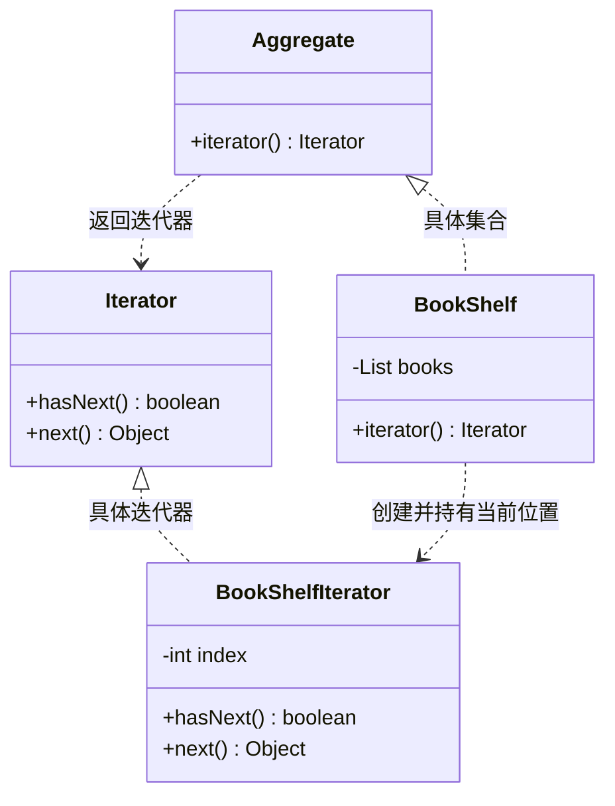

# 17 迭代器模式

迭代器模式（Iterator Pattern）是 GoF 里最"低调"的行为型模式——你几乎每天都在用它，却很少意识到它的存在。它干的事很单纯：**提供一种方法，顺序访问一个聚合对象里的各个元素，而又不暴露该对象的内部存储结构**。换句话说，无论底层是数组、链表还是哈希表，你拿到的遍历方式永远一样。

## 一、它是什么

一句话大白话：**给集合配一个"导游"，你只管跟着导游走，不必关心集合肚子里到底怎么装的。**

生活化比喻：图书馆书架。你借书时不会把书架拆了翻底板，而是顺着书架一层层取。这个"顺着取"的动作，就是迭代器；书架（集合）把"怎么取"的细节藏起来，只递给你一个能 `hasNext()` / `next()` 的导游。

官方定义（GoF）：*Provide a way to access the elements of an aggregate object sequentially without exposing its underlying representation.* 即"提供一种顺序访问聚合对象元素的方法，且不暴露其底层表示"。

## 二、为什么需要它（不用会怎样）

假设书架用数组存书，遍历代码长这样：

```java
package com.canoe.pattern.iterator.bad;

// 没有迭代器：遍历逻辑直接耦合书架的内部存储
public class BadBookShelf {
    private String[] books = new String[10];
    private int size = 0;

    public void add(String book) {
        books[size++] = book;
    }

    // 调用方必须知道"内部是数组、下标从 0 到 size"
    public void printAll() {
        for (int i = 0; i < size; i++) {
            System.out.println(books[i]);
        }
    }
}
```

痛点：

- **暴露内部结构**：调用方写死 `books[i]`、写死下标循环，等于把"用数组存"这事儿公开了。
- **换存储就崩**：哪天把 `String[]` 换成 `LinkedList<String>`，所有遍历代码都得改。
- **遍历逻辑重复**：十个地方遍历，就写十遍 `for (int i=0; ...)`，一旦规则变（比如跳过禁书）要改十处。

迭代器把"怎么取下一个"收进一个对象，`BookShelf` 只暴露 `iterator()`，底层是数组还是链表，调用方一概不知。

## 三、结构与角色



| 角色 | 对应类 | 职责 |
| --- | --- | --- |
| 集合接口 Aggregate | `Aggregate` | 声明 `iterator()`，产出自己的迭代器 |
| 具体集合 ConcreteAggregate | `BookShelf` | 实现 `iterator()`，返回配套的具体迭代器 |
| 迭代器接口 Iterator | `Iterator` | 声明 `hasNext()` 与 `next()` |
| 具体迭代器 ConcreteIterator | `BookShelfIterator` | 维护遍历位置，实现取元素逻辑 |

**角色的作用**：`Aggregate` 与 `Iterator` 把"集合"和"遍历"两件事拆开——集合只管存，迭代器只管走，二者通过 `iterator()` 这个工厂方法对接。

## 四、代码实现

元素：一本书。

```java
package com.canoe.pattern.iterator;

// 元素：一本书
public class Book {
    private String name;

    public Book(String name) {
        this.name = name;
    }

    public String getName() {
        return name;
    }
}
```

集合接口与迭代器接口：

```java
package com.canoe.pattern.iterator;

// 集合接口：能产出自己的迭代器
public interface Aggregate {
    Iterator iterator();
}
```

```java
package com.canoe.pattern.iterator;

// 迭代器接口
public interface Iterator {
    boolean hasNext();
    Object next();
}
```

具体集合：书架。

```java
package com.canoe.pattern.iterator;

import java.util.ArrayList;
import java.util.List;

// 具体集合：书架
public class BookShelf implements Aggregate {
    // 底层用 List 存书，调用方看不见
    private List<Book> books = new ArrayList<Book>();

    public void addBook(Book book) {
        books.add(book);
    }

    public Book getBookAt(int index) {
        return books.get(index);
    }

    public int getLength() {
        return books.size();
    }

    @Override
    public Iterator iterator() {
        // 返回配套的具体迭代器
        return new BookShelfIterator(this);
    }
}
```

具体迭代器：维护当前下标。

```java
package com.canoe.pattern.iterator;

// 具体迭代器：维护当前下标
public class BookShelfIterator implements Iterator {
    private BookShelf bookShelf;
    private int index = 0;

    public BookShelfIterator(BookShelf bookShelf) {
        this.bookShelf = bookShelf;
    }

    @Override
    public boolean hasNext() {
        return index < bookShelf.getLength();
    }

    @Override
    public Object next() {
        Book book = bookShelf.getBookAt(index);
        index++;
        return book;
    }
}
```

客户端：只跟迭代器打交道。

```java
package com.canoe.pattern.iterator;

// 客户端：遍历书架，完全不知道底层是数组还是链表
public class Client {
    public static void main(String[] args) {
        BookShelf shelf = new BookShelf();
        shelf.addBook(new Book("《设计模式之禅》"));
        shelf.addBook(new Book("《Java 编程思想》"));
        shelf.addBook(new Book("《重构》"));

        Iterator it = shelf.iterator();
        while (it.hasNext()) {
            Book book = (Book) it.next();
            System.out.println(book.getName());
        }
    }
}
```

## 五、自己实现一个迭代器

`hasNext()` 与 `next()` 的本质非常简单：一个游标 `index`，到头就停。

```java
package com.canoe.pattern.iterator.custom;

// 手写迭代器的核心逻辑（以书架为例）
public class BookShelfIterator {
    private BookShelf bookShelf;
    private int index = 0;

    public boolean hasNext() {
        // 游标还没走到末尾，就还有下一个
        return index < bookShelf.getLength();
    }

    public Book next() {
        Book book = bookShelf.getBookAt(index);
        index++;   // 取完往前挪一位
        return book;
    }
}
```

**为什么需要 `hasNext()` 而不是直接在 `next()` 里判断？** 因为 `next()` 的职责是"取"，若它同时负责"判空"，调用方一旦多调一次就会拿到 `null` 或抛异常。`hasNext()` 把"还有没有"和"取出来"分开，循环写起来才干净。

**fail-fast 与 `ConcurrentModificationException`**：JDK 的 `ArrayList` 迭代器是"快速失败"的——集合内部有个 `modCount`（修改次数）计数器，迭代器创建时记下一个 `expectedModCount`。每次 `next()` 前都会核对：

```java
// ArrayList.Itr 的简化逻辑
int cursor;                      // 下一个要返回的元素下标
int expectedModCount = modCount; // 创建迭代器时记录当时的修改次数

public boolean hasNext() {
    return cursor != size;
}

public E next() {
    checkForComodification();    // 检查集合是否被偷偷改过
    int i = cursor;
    if (i >= size) throw new NoSuchElementException();
    cursor = i + 1;
    return elementData[i];
}

final void checkForComodification() {
    if (modCount != expectedModCount)
        throw new ConcurrentModificationException();
}
```

也就是说：**一边用迭代器遍历、一边用集合本身 `add/remove` 改结构，迭代器下次 `next()` 就会抛出 `ConcurrentModificationException`**，主动告诉你"数据已经被改乱了"。这正是 fail-fast 设计——宁可立刻报错，也不让你拿到错误数据。若要在遍历时删除，请用迭代器自己的 `remove()`（它会同步 `expectedModCount`）；高并发场景则改用 `CopyOnWriteArrayList` 或 `ConcurrentHashMap`。

## 六、与 for-each 的关系

你天天写的增强 for 循环（`for (Book b : shelf)`）其实不是语法糖那么简单——它背后**编译后就是迭代器**。能让 `for-each` 工作的前提，是集合实现 `java.lang.Iterable` 接口（注意是 `Iterable`，不是 `Iterator`）：

```java
package com.canoe.pattern.iterator.iterable;

import java.util.ArrayList;
import java.util.Iterator;
import java.util.List;

// Iterable：只负责"给我一个迭代器"
public class MyShelf implements Iterable<Book> {
    private List<Book> books = new ArrayList<Book>();

    @Override
    public Iterator<Book> iterator() {
        return books.iterator();
    }
}
```

二者的分工非常清晰：

- **`Iterable`**：集合实现它，对外承诺"我能提供一个迭代器"，是 `for-each` 的入场券。
- **`Iterator`**：迭代器本身，负责 `hasNext()` / `next()` 的遍历细节。

所以 `for (Book b : shelf)` 在字节码层面等价于 `Iterator<Book> it = shelf.iterator(); while (it.hasNext()) { Book b = it.next(); }`。理解这点，你就明白了为什么自定义集合只要实现 `Iterable` 就能直接被 `for-each` 遍历。

## 七、优缺点

| 优点 | 缺点 |
| --- | --- |
| **隐藏集合内部存储**，调用方与实现解耦 | 为每种集合配一个迭代器类，类增多 |
| **统一遍历接口**，数组/链表/树一个写法 | 简单集合用迭代器略显繁琐 |
| 支持多种遍历方式（正序/逆序/过滤）并存 | 迭代器与集合生命周期需协调 |
| 便于在遍历中做 fail-fast 保护 | 并发遍历需额外考虑线程安全 |
| 符合单一职责：集合管存、迭代器管走 | 过度抽象小集合是杀鸡用牛刀 |

## 八、适用场景

- 需要遍历各种集合，但**不想暴露其底层结构**（数组、链表、树、图都行）。
- 集合有多种遍历方式（正向、反向、按条件过滤），想让它们并存且不污染集合类。
- 想把"遍历算法"从集合里抽出来，单独复用或替换。

**什么时候不要用**：集合极小、只用一次遍历、且结构稳定，直接 `for` 循环更省事；若追求极致性能且确定结构，手写下标循环也可接受。

## 九、在 JDK / 开源框架中的应用

- **`java.util.Iterator` / `java.util.Iterable`**：JDK 标准接口，`ArrayList`、`HashSet`、`LinkedList` 全都实现，是迭代器模式的官方范本。
- **`java.util.ListIterator`**：`ArrayList` 内部 `ListItr` 提供双向遍历（`previous()` / `hasPrevious()`），是同一模式的增强版。
- **`java.util.Enumeration`**：早期 JDK（如 `Vector`）的"老迭代器"，已被 `Iterator` 取代，但思想一脉相承。
- **MyBatis `ResultHandler` / `Cursor`**：`Cursor<T>` 迭代式读取大结果集，逐行取数避免一次性加载内存，是迭代器在 DAO 层的应用。
- **Spring `CompositeIterator`**：`org.springframework.beans.factory.config` 等包里用迭代器统一遍历嵌套集合。

为什么这么设计：把"怎么取下一个"从集合里剥离，集合就能自由更换底层结构、自由新增遍历方式，而调用方一行遍历代码都不用改。

## 十、与相近模式的区别

| 对比 | 迭代器模式 | 访问者模式 |
| --- | --- | --- |
| 目的 | 统一"遍历集合"的方式 | 在不改元素类的前提下"新增对元素的操作" |
| 关注点 | 怎么把元素一个个取出来 | 对每个元素做什么（操作与元素解耦） |
| 配合关系 | 访问者常借助迭代器遍历元素 | 常依赖迭代器完成"走遍所有元素" |
| 典型场景 | `for-each`、集合遍历 | 报表统计、AST 遍历 |

一句话区分：**迭代器管"怎么走"，访问者管"走到后干啥"**；二者经常联手——访问者坐着迭代器这辆车，把集合逛个遍。

## 本篇小结

- **迭代器模式统一了集合的遍历方式**，调用方不必关心底层存储。
- **核心是 `Iterator` 接口**：`hasNext()` 判有没有、`next()` 取出来。
- **`Aggregate` 通过 `iterator()` 产出配套迭代器**，集合与遍历解耦。
- **书架空 List、调用方写 `while(it.hasNext())`**，底层换了也不影响。
- **`hasNext()` 与 `next()` 分离**，避免多调一次拿到脏数据。
- **fail-fast 靠 `modCount` 校验**：遍历中改集合会抛 `ConcurrentModificationException`。
- **遍历时删除要用迭代器自己的 `remove()`**，否则破坏 `expectedModCount`。
- **增强 for 循环编译后就是迭代器**，前提是集合实现 `Iterable`。
- **`Iterable` 负责给迭代器，`Iterator` 负责遍历**，二者分工明确。
- **JDK 的 `ArrayList`/`HashSet` 都是迭代器模式的范例**。
- **它与访问者常配合**：迭代器负责"走"，访问者负责"做"。

## 参考链接

- [Refactoring Guru · Iterator Pattern（中文）](https://refactoringguru.cn/design-patterns/iterator)
- [Refactoring Guru · Iterator Pattern（英文）](https://refactoring.guru/design-patterns/iterator)
- [菜鸟教程 · 迭代器模式](https://www.runoob.com/design-pattern/iterator-pattern.html)
- [图说设计模式 · 迭代器模式](https://design-patterns.readthedocs.io/zh_CN/latest/behavioral_patterns/iterator.html)
- [Wikipedia · Iterator pattern](https://en.wikipedia.org/wiki/Iterator_pattern)
- [Oracle Java Docs · Iterator](https://docs.oracle.com/javase/8/docs/api/java/util/Iterator.html)
- [Oracle Java Docs · Iterable](https://docs.oracle.com/javase/8/docs/api/java/lang/Iterable.html)

下一篇 → [18 责任链模式](/java/design-pattern/chain)
