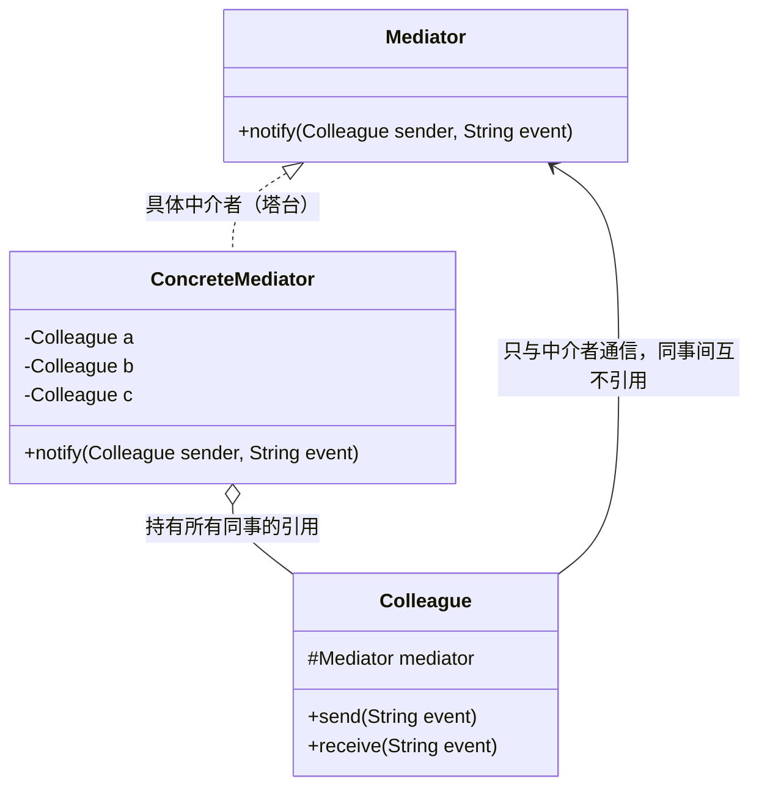

# 23 中介者模式

> 本篇导读：想象一座繁忙的机场，几十架飞机同时在跑道、滑行道、停机坪之间穿梭。如果让每架飞机自己打电话给其他飞机"你让一下、我过来了"，天空立刻乱成一锅粥。中介者模式就是那位冷静的空管塔台——把所有对象之间的"私聊"全部收编成"对塔台说"，由塔台统一协调。它解决的是**对象之间网状耦合**的问题，用一个中介对象把错综复杂的通信变成"星型"结构。

## 一、它是什么

一句话大白话：**中介者模式用一个中间人把一群对象之间的相互引用解开，让对象只跟中间人打交道，不再彼此直接通信。**

生活化比喻：微信群就是个中介者。A 想通知 B、C、D，不用分别私聊三个人（那样 A 的通讯录会越来越臃肿），只要在群里 @ 一下，群（中介者）负责把消息转发给每个人。哪天 E 进群、B 退群，A 完全不用改代码。

GoF 的官方定义是：

> Define an object that encapsulates how a set of objects interact. Mediator promotes loose coupling by keeping objects from referring to each other explicitly, and it lets you vary their interaction independently.
>
> （用一个中介对象来封装一系列对象的交互。中介者使各对象不需要显式地相互引用，从而使其耦合松散，并且可以独立地改变它们之间的交互。）

## 二、为什么需要它（不用会怎样）

先看一段"没有塔台"的反面代码。假设飞机之间直接互相引用，自己决定避让逻辑：

```java
// 反例：飞机之间直接耦合，灾难的开始
public class BadAirplane {
    public String flightNo;
    public BadAirplane ahead;   // 前机
    public BadAirplane behind;  // 后机
    public BadAirplane left;    // 左邻
    public BadAirplane right;   // 右邻

    public void prepareTakeoff() {
        // 起飞前要挨个问邻机：你腾空了吗？
        if (ahead != null && !ahead.isClear()) return;
        if (left != null && !left.isClear()) return;
        if (right != null && !right.isClear()) return;
        // ... 真正的起飞逻辑淹没在 N 个 if 里
    }

    public boolean isClear() { return true; }
}
```

这段代码的问题非常明显：

1. **网状耦合**：每架飞机要认识 4 个邻居，系统里有 20 架飞机时，引用关系就有上百条，`BadAirplane` 类被拖垮。
2. **改动牵一发动全身**：塔台规则从"问左右"改成"问前后"，所有飞机类都得改。
3. **逻辑分散**：协调规则散落在每个对象里，无法集中、无法复用。

引入中介者后，飞机只认塔台一个人，协调逻辑全部收拢到塔台，**对象数量越多，省下的耦合就越夸张**。

## 三、结构与角色



| 角色 | 类名（示例） | 职责 |
| --- | --- | --- |
| 抽象中介者 | `AirTrafficControl` | 定义同事对象之间通信的接口，如 `register()`、`send()` |
| 具体中介者 | `ControlTower` | 实现协调逻辑，持有并管理所有同事对象的引用 |
| 抽象同事 | `Airplane` | 持有中介者引用，定义与中介者通信的方法 |
| 具体同事 | `ArrivalAirplane` / `DepartureAirplane` | 实现自身业务，需要通信时只调用中介者，而非直接找其他同事 |

## 四、代码实现

完整的机场塔台调度示例，每个类都可直接运行。

```java
package com.canoe.pattern.mediator;

// 抽象中介者：空管塔台
public interface AirTrafficControl {
    void register(Airplane airplane);          // 登记航班
    void send(String message, Airplane sender); // 中转消息
}
```

```java
package com.canoe.pattern.mediator;

// 抽象同事：飞机（只认塔台，不认其他飞机）
public abstract class Airplane {
    protected AirTrafficControl tower;  // 仅依赖中介者
    protected String flightNo;

    public Airplane(AirTrafficControl tower, String flightNo) {
        this.tower = tower;
        this.flightNo = flightNo;
    }

    // 通过塔台广播消息
    public abstract void send(String message);

    // 接收塔台转发的消息
    public abstract void receive(String message);

    public String getFlightNo() {
        return flightNo;
    }
}
```

```java
package com.canoe.pattern.mediator;

// 具体同事：进港飞机
public class ArrivalAirplane extends Airplane {
    public ArrivalAirplane(AirTrafficControl tower, String flightNo) {
        super(tower, flightNo);
    }

    @Override
    public void send(String message) {
        System.out.println("[" + flightNo + " 进港] 发送：" + message);
        tower.send(message, this);   // 不直接找别的飞机，交给塔台
    }

    @Override
    public void receive(String message) {
        System.out.println("[" + flightNo + " 进港] 收到塔台指令：" + message);
    }
}
```

```java
package com.canoe.pattern.mediator;

// 具体同事：出港飞机
public class DepartureAirplane extends Airplane {
    public DepartureAirplane(AirTrafficControl tower, String flightNo) {
        super(tower, flightNo);
    }

    @Override
    public void send(String message) {
        System.out.println("[" + flightNo + " 出港] 发送：" + message);
        tower.send(message, this);
    }

    @Override
    public void receive(String message) {
        System.out.println("[" + flightNo + " 出港] 收到塔台指令：" + message);
    }
}
```

```java
package com.canoe.pattern.mediator;

import java.util.ArrayList;
import java.util.List;

// 具体中介者：塔台（集中所有协调逻辑）
public class ControlTower implements AirTrafficControl {
    private final List<Airplane> airplanes = new ArrayList<Airplane>();

    @Override
    public void register(Airplane airplane) {
        airplanes.add(airplane);
        System.out.println("塔台：欢迎 " + airplane.getFlightNo() + " 进入管制空域");
    }

    @Override
    public void send(String message, Airplane sender) {
        for (Airplane airplane : airplanes) {
            // 不回发给发送者自己，只通知其他航班协同
            if (airplane != sender) {
                airplane.receive("来自 " + sender.getFlightNo() + " 的协同请求：" + message);
            }
        }
    }
}
```

```java
package com.canoe.pattern.mediator;

// 演示入口
public class MediatorDemo {
    public static void main(String[] args) {
        AirTrafficControl tower = new ControlTower();

        Airplane ca1234 = new DepartureAirplane(tower, "CA1234");
        Airplane mu5678 = new ArrivalAirplane(tower, "MU5678");

        tower.register(ca1234);
        tower.register(mu5678);

        // 出港飞机只管告诉塔台，由塔台统一协调
        ca1234.send("我准备起飞，请跑道周边清空");
    }
}
```

运行结果里，`CA1234` 发出请求后，是塔台把消息转发给了 `MU5678`，两架飞机自始至终没有直接说过一句话。

## 五、与外观模式的区别

这是最容易混淆的一对，核心差异在**通信方向**与**是否双向**：

- **中介者是双向的**：同事对象之间互相通信都要经过它，塔台既收飞机的消息也发消息给飞机，飞机知道塔台的存在。
- **外观是单向的**：外观为子系统提供一个简化入口，调用方 经过 外观 访问 子系统，但子系统**根本不知道外观的存在**，也不会反向调用外观。

一句话记忆：**中介者让对象"彼此聊天"，外观替对象"包办琐事"**。中介者关注的是对象间的交互行为，外观关注的是接口的简化封装。

## 六、实际应用

- **MVC 里的 Controller**：Controller 就是 View 与 Model 之间的中介者，View 不直接改 Model，而是通过 Controller 转发。
- **机场 / 火车站调度系统**：统一调度中心协调列车、航班、站台资源。
- **聊天室 / 即时通讯**：服务端充当中介者，转发消息给在线的各个客户端。
- **消息中间件 MQ**：生产者与消费者彼此不知道对方存在，全部通过 Broker 解耦。
- **智能家居中枢**：空调、灯光、窗帘都只对接"中枢"，由中枢根据场景联动。

## 七、优缺点

| 优点 | 缺点 |
| --- | --- |
| 把网状耦合变成星型，降低对象间依赖 | 中介者本身容易变成"超级类"，职责过重 |
| 集中协调逻辑，便于统一修改与复用 | 一旦中介者出问题，整套通信瘫痪 |
| 新增同事类无需改动其他同事 | 类数量增加（多了中介者与抽象层） |
| 符合迪米特法则（最少知识原则） | 复杂场景下中介者逻辑难以测试 |
| 交互行为可独立变化、可替换 | 过度使用会让流程分散在中介者中，可读性下降 |

## 八、适用场景

- 一组对象以**复杂且多变的方式**相互通信，引用关系像蜘蛛网。
- GUI 界面中多个控件需要联动（勾选 A 禁用 B、填写 C 高亮 D）。
- 想复用某个对象，但它与其他对象耦合太紧，抽不出来。
- 行为分布在多个类里，又不想产生太多子类时（用中介者替代"子类化扩展行为"）。
- 微服务之间通过 MQ / 事件总线解耦。

**什么时候不要用**：如果对象之间本来就只有 1 对 1 的简单调用，硬套中介者只会增加一层无谓的抽象，反而更难懂。

## 九、在 JDK / 开源框架中的应用

- **`java.util.Timer`**：`Timer` 把一堆 `TimerTask` 的调度统一收拢，任务不直接互相协调，而是注册给 `Timer` 这个"中介者"去触发。
- **Spring `HandlerMethodArgumentResolver` / `HandlerAdapter`**：DispatcherServlet 充当中介者，把请求按规则分发给不同处理器，Controller 之间互不认识。
- **Spring `ApplicationEvent` + `ApplicationEventPublisher`**：组件之间发布/订阅事件，发布者完全不知道谁是监听者，由 Spring 容器居中协调。
- **消息队列（Kafka / RabbitMQ）**：生产者和消费者彻底解耦，靠 Broker 中转，是中介者模式在分布式层面的放大版。

## 十、与相近模式的区别

| 对比模式 | 目的 | 结构 | 使用场景 |
| --- | --- | --- | --- |
| 中介者 vs 外观 | 中介者协调对象**互相**通信；外观为子系统提供简化入口 | 中介者双向、同事互相感知；外观单向、子系统无感知 | 对象间交互复杂用中介者；只需简化调用用外观 |
| 中介者 vs 观察者 | 中介者集中控制；观察者通过订阅解耦 | 中介者是中心节点；观察者是发布-订阅广播 | 需要集中式调度用中介者；需要松散广播用观察者 |

## 本篇小结

- **中介者模式**用一个中间对象封装一组对象的交互，解除对象间的显式引用。
- 它把**网状耦合**重构为**星型结构**，对象越多收益越大。
- 核心角色只有四个：抽象中介者、具体中介者、抽象同事、具体同事。
- 同事对象**只认识中介者**，绝不互相直接调用，这是判断是否用对的关键。
- 协调逻辑全部集中在具体中介者里，**便于统一修改但也容易膨胀成超级类**。
- 中介者是**双向**通信，外观是**单向**封装，二者目的不同不可混用。
- 它天然符合**迪米特法则**（最少知识原则），降低系统耦合度。
- MVC 的 **Controller**、Java 的 `Timer`、Spring 的 **事件机制** 都体现了中介者思想。
- 消息中间件 **MQ** 是分布式层面的中介者，生产消费彻底解耦。
- 当对象间只有简单 1 对 1 调用时，**不要过度使用**中介者。
- 复杂业务下可配合**观察者模式**一起使用，进一步削弱依赖。
- 测试中介者时建议为其依赖的同事预留**接口**，方便 mock 验证转发逻辑。

## 参考链接

- [Refactoring Guru · Mediator](https://refactoring.guru/design-patterns/mediator)
- [SourceMaking · Mediator Pattern](https://sourcemaking.com/design_patterns/mediator)
- [GeeksforGeeks · Mediator Design Pattern](https://www.geeksforgeeks.org/mediator-design-pattern/)
- [TutorialsPoint · Mediator Pattern](https://www.tutorialspoint.com/design_pattern/mediator_pattern.htm)
- [Wikipedia · Mediator pattern](https://en.wikipedia.org/wiki/Mediator_pattern)
- [菜鸟教程 · 中介者模式](https://www.runoob.com/design-pattern/mediator-pattern.html)

下一篇 → [24 解释器模式](/java/design-pattern/interpreter)
