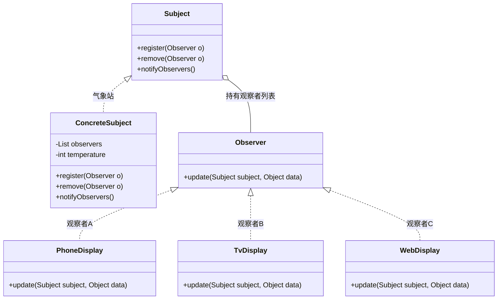

# 16 观察者模式

> 本篇导读：你关注的微信公众号一发文章，手机立刻弹出提醒；气象站的温湿度一变，所有显示屏同步刷新。这些"一个对象变了，一堆对象跟着变"的场景，就是观察者模式的用武之地。本文用"气象站播报"做主线，从反面代码一路写到推/拉模型、JDK 内置实现的废弃真相，以及 Spring 事件机制，让你彻底搞懂"发布-订阅"这件事。

## 一、它是什么

一句话大白话：**观察者模式就是"你关注我，我一动你就收到通知"**——一对多的依赖关系，被关注者状态一变，所有关注者自动被通知。

生活化比喻：微信公众号就是典型的观察者模式。你（观察者）关注了某个号（被观察者/主题），号主每发一篇文章，平台就把文章**推**到你手机上。你不用一直刷新，号主也不用知道你到底是谁——只管"发"，平台负责"通知所有人"。

GoF 的官方定义：

> Define a one-to-many dependency between objects so that when one object changes state, all its dependents are notified and updated automatically.
> ——《Design Patterns: Elements of Reusable Object-Oriented Software》

翻译：**定义对象间的一对多依赖，当一个对象的状态发生改变时，所有依赖它的对象都会自动收到通知并更新。**

## 二、为什么需要它（不用会怎样）

反面代码——气象站直接硬编码通知各个显示屏，没有观察者模式：

```java
// ❌ 反面教材：气象站紧耦合所有显示屏
public class WeatherStation {
    private float temperature;
    private PhoneDisplay phone;     // 手机屏
    private TvDisplay tv;           // 电视屏
    private WebDisplay web;         // 网页屏

    public void setTemperature(float t) {
        this.temperature = t;
        // 每加一个显示屏就要改这里，耦合爆炸
        phone.show(temperature);
        tv.show(temperature);
        web.show(temperature);
    }
}
```

痛点：

1. **紧耦合**：气象站必须认识每一个显示屏，新增一块屏就得改 `WeatherStation`。
2. **违反开闭原则**：扩展（加显示屏）变成了修改（改被观察者）。
3. **职责错乱**：气象站本职是"测温度"，却还要管"通知谁、怎么通知"。

观察者模式的改善：**被观察者只维护一个观察者列表，状态变化时统一通知列表，不关心具体是谁**。新增显示屏只是往列表里 `register` 一个，气象站一行不改。

## 三、结构与角色



| 角色 | 职责 |
| --- | --- |
| **Subject（主题/被观察者）** | 维护观察者列表，提供 `register` / `remove`，状态变化时调用 `notifyObservers()` 通知所有人。 |
| **Observer（观察者接口）** | 定义 `update` 方法，所有具体观察者实现它来接收通知。 |
| **ConcreteSubject（具体主题）** | 持有真正业务状态（如温度），状态改变时触发通知。 |
| **ConcreteObserver（具体观察者）** | 实现 `update`，根据通知更新自身展示（手机屏/电视屏/网页屏）。 |

## 四、代码实现

完整可运行示例——气象站 (`Subject`) + 手机屏、电视屏、网页屏三个 `Observer`，带 `register` / `remove` / `notify`。

```java
package com.canoe.pattern.observer;

/**
 * 观察者接口：所有显示屏都要实现 update
 */
public interface Observer {
    /**
     * 收到主题通知时调用
     *
     * @param temperature 最新温度
     */
    void update(float temperature);
}
```

```java
package com.canoe.pattern.observer;

import java.util.ArrayList;
import java.util.List;

/**
 * 主题（被观察者）接口
 */
public interface Subject {
    /** 注册观察者 */
    void register(Observer o);

    /** 移除观察者 */
    void remove(Observer o);

    /** 通知所有观察者 */
    void notifyObservers();
}

/**
 * 具体主题：气象站
 */
public class WeatherStation implements Subject {
    private final List<Observer> observers = new ArrayList<Observer>();
    private float temperature;

    @Override
    public void register(Observer o) {
        observers.add(o);
    }

    @Override
    public void remove(Observer o) {
        observers.remove(o);
    }

    @Override
    public void notifyObservers() {
        // 遍历通知每一个观察者（推模型：把数据带过去）
        for (Observer o : observers) {
            o.update(temperature);
        }
    }

    /** 温度变化时更新并通知 */
    public void setTemperature(float temperature) {
        this.temperature = temperature;
        System.out.println("气象站更新温度：" + temperature + "℃");
        notifyObservers();
    }
}
```

```java
package com.canoe.pattern.observer;

/** 具体观察者：手机屏 */
public class PhoneDisplay implements Observer {
    @Override
    public void update(float temperature) {
        System.out.println("[手机屏] 当前温度 " + temperature + "℃");
    }
}
```

```java
package com.canoe.pattern.observer;

/** 具体观察者：电视屏 */
public class TvDisplay implements Observer {
    @Override
    public void update(float temperature) {
        System.out.println("[电视屏] 当前温度 " + temperature + "℃");
    }
}
```

```java
package com.canoe.pattern.observer;

/** 具体观察者：网页屏 */
public class WebDisplay implements Observer {
    @Override
    public void update(float temperature) {
        System.out.println("[网页屏] 当前温度 " + temperature + "℃");
    }
}
```

```java
package com.canoe.pattern.observer;

/** 演示 */
public class ObserverDemo {
    public static void main(String[] args) {
        WeatherStation station = new WeatherStation();

        Observer phone = new PhoneDisplay();
        Observer tv = new TvDisplay();
        Observer web = new WebDisplay();

        station.register(phone);
        station.register(tv);
        station.register(web);

        station.setTemperature(26.5f);

        // 某块屏不想看了，移除后不再收到通知
        station.remove(tv);
        System.out.println("--- 电视屏取消关注后 ---");
        station.setTemperature(28.0f);
    }
}
```

运行输出：

```text
气象站更新温度：26.5℃
[手机屏] 当前温度 26.5℃
[电视屏] 当前温度 26.5℃
[网页屏] 当前温度 26.5℃
--- 电视屏取消关注后 ---
气象站更新温度：28.0℃
[手机屏] 当前温度 28.0℃
[网页屏] 当前温度 28.0℃
```

可以看到：**新增屏幕只管 `register`，移除只管 `remove`，气象站完全不用改**——这就是解耦的威力。

## 五、推模型 vs 拉模型

**推模型（Push）**：通知时主动把数据塞给观察者（上文 `update(float temperature)` 就是推）。

- 优点：观察者直接拿到数据，简单省事。
- 缺点：若数据多，每次都全量推，浪费带宽；新增数据字段要改接口。

**拉模型（Pull）**：通知只说"我变了"，观察者拿到主题引用**自己来取**需要的字段。

```java
package com.canoe.pattern.observer.pull;

/** 拉模型：update 只拿到主题引用，观察者自己取数据 */
public interface Observer {
    void update(WeatherStation station);
}

// 观察者内部按需拉取：
// station.getTemperature(); station.getHumidity();
```

| 维度 | 推模型 | 拉模型 |
| --- | --- | --- |
| 通知传参 | 直接带数据 | 只传主题引用 |
| 观察者主动性 | 被动接收 | 主动拉取 |
| 耦合度 | 与具体数据类型耦合 | 只耦合主题对象 |
| 适用 | 数据少且固定 | 数据多、字段常变 |

**取舍**：数据简单、字段稳定用推；数据复杂、想减少接口变更用拉。折中做法是推一个"变更事件对象"（如 `WeatherEvent`），既明确又少改接口。

## 六、JDK 内置实现 java.util.Observer

JDK 曾经提供 `java.util.Observable`（被观察者基类）和 `java.util.Observer` 接口，但**在 JDK 9 已被标记为 `@Deprecated` 并计划移除**。

废弃原因主要有三点：

1. **`Observable` 是个类而不是接口**：必须为它继承，而 Java 是单继承，导致业务类无法再继承别的类，严重限制复用。
2. **方法不是 `final` 且未考虑线程安全**：`setChanged()` / `notifyObservers()` 在并发下不安全，需要调用方自己加锁。
3. **API 设计粗糙**：`notifyObservers()` 传 `Object` 参数，丢失类型信息。

**建议**：新代码不要再用 `Observable` / `Observer`，而是自己实现（如第四节）或改用 **Guava 的 `EventBus`**、**Spring 的 `ApplicationEvent`**（见下一节）。

## 七、Spring 事件机制

Spring 自带一套观察者实现，核心三件套：`ApplicationEvent`（事件）、`ApplicationListener`（监听器）、`ApplicationEventPublisher`（发布器）。

```java
package com.canoe.pattern.observer.spring;

import org.springframework.context.ApplicationEvent;

/** 自定义事件：温度变更事件（相当于"推"的数据对象） */
public class TemperatureEvent extends ApplicationEvent {
    private final float temperature;

    public TemperatureEvent(Object source, float temperature) {
        super(source);
        this.temperature = temperature;
    }

    public float getTemperature() {
        return temperature;
    }
}
```

```java
package com.canoe.pattern.observer.spring;

import org.springframework.context.ApplicationListener;
import org.springframework.stereotype.Component;

/** 监听器：实现 ApplicationListener<事件类型> */
@Component
public class PhoneListener implements ApplicationListener<TemperatureEvent> {
    @Override
    public void onApplicationEvent(TemperatureEvent event) {
        System.out.println("[手机屏] 收到 Spring 事件，温度 " + event.getTemperature() + "℃");
    }
}
```

```java
package com.canoe.pattern.observer.spring;

import org.springframework.context.ApplicationEventPublisher;
import org.springframework.context.ApplicationEventPublisherAware;
import org.springframework.stereotype.Component;

/** 发布器：被观察者通过它发布事件 */
@Component
public class WeatherStation implements ApplicationEventPublisherAware {
    private ApplicationEventPublisher publisher;

    @Override
    public void setApplicationEventPublisher(ApplicationEventPublisher publisher) {
        this.publisher = publisher;
    }

    public void setTemperature(float t) {
        publisher.publishEvent(new TemperatureEvent(this, t));
    }
}
```

**重要**：Spring 事件**默认是同步的**——`publishEvent` 会阻塞直到所有监听器处理完。要实现异步，二选一：

- 在监听器方法上加 **`@Async`**（需开启 `@EnableAsync`）；
- 或自定义 **`ApplicationEventMulticaster`** 替换默认的 `SimpleApplicationEventMulticaster`，给它配一个线程池。

现代 Spring 还推荐用注解式监听，更简洁：

```java
package com.canoe.pattern.observer.spring;

import org.springframework.context.event.EventListener;
import org.springframework.stereotype.Component;

@Component
public class TvListener {
    @EventListener
    public void onTemp(TemperatureEvent event) {
        System.out.println("[电视屏] 收到 Spring 事件，温度 " + event.getTemperature() + "℃");
    }
}
```

## 八、优缺点

| 优点 | 缺点 |
| --- | --- |
| 被观察者与观察者**松耦合**，互不知道具体类 | 通知是**顺序同步**的，一个观察者慢会拖慢整体 |
| 符合开闭原则，新增观察者不改被观察者 | 观察者太多时，通知开销累积 |
| 支持**一对多**广播，天然适合发布订阅 | 若形成**循环依赖**（A 通知 B，B 又改 A）会死循环 |
| 可动态增删观察者，运行期灵活 | 异步场景下**难以追踪调用链**，调试变难 |

## 九、适用场景

- 一个对象状态变化需要**联动更新多个对象**（气象站播报、股票行情提醒）。
- 公众号/订阅号的**消息推送**；App 的推送通知。
- GUI 中**模型与视图分离**：Model 变了，多个 View 自动刷新。
- 组件间通信想**解耦**时，用事件总线（EventBus）替代直接调用。
- 监听系统事件：`EventListener`、Spring `ApplicationListener`。

**什么情况下不要用**：如果只有单一接收方、且强一致同步调用更简单，硬上观察者反而绕；若观察者间有严格顺序依赖，责任链/管道更合适。

## 十、在 JDK / 开源框架中的应用

- **`java.util.EventListener` 体系**：Swing/AWT 的点击、按键等事件全是观察者模式（如 `ActionListener`）。
- **Spring `ApplicationEvent` / `ApplicationListener`**：见第七节。
- **Guava `EventBus`**：`@Subscribe` 注解注册观察者，轻量级发布订阅。
- **ZooKeeper `Watcher`**：节点数据变化回调通知客户端，本质是观察者。
- **消息队列（Kafka/RabbitMQ）**：分布式版观察者，生产者=被观察者，消费者=观察者。

## 十一、与相近模式的区别

| 对比模式 | 区别点 | 观察者模式 |
| --- | --- | --- |
| **发布-订阅（MQ）** | 观察者通常是**同进程**直接调用；发布订阅多了**中间代理（Broker）**，跨进程、可持久化 | 进程内的"轻量发布订阅" |
| **责任链模式** | 责任链是**请求沿链传递、可中断**；观察者是**广播给所有观察者、互不干扰** | 关注"一对多通知" |

## 本篇小结

- **观察者模式**建立**一对多依赖**，被观察者状态变则自动通知所有观察者。
- 核心是**解耦**：被观察者只维护列表，不认识具体观察者是谁。
- 主题提供 **`register` / `remove` / `notifyObservers`** 三件套管理观察者。
- 新增观察者**只管注册**，被观察者代码一行不动，符合**开闭原则**。
- **推模型**直接带数据、**拉模型**只通知让观察者自己取，按数据复杂度取舍。
- JDK 的 **`Observable` / `Observer` 已在 JDK 9 废弃**，因单继承限制与线程不安全。
- Spring 的 **`ApplicationEvent` + `ApplicationListener`** 是观察者模式的工业级实现。
- Spring 事件**默认同步**，要异步需加 **`@Async`** 或自定义 `ApplicationEventMulticaster`。
- 观察者过多、且同步通知时，**一个慢观察者会拖慢整体**。
- 循环通知会导致**死循环**，设计时要避免观察者反向修改主题。
- 分布式场景用 **MQ** 做"跨进程的观察者"。

## 参考链接

- [Refactoring Guru · 观察者模式](https://refactoringguru.cn/design-patterns/observer)
- [Oracle JavaDoc · Observer（已废弃）](https://docs.oracle.com/en/java/javase/17/docs/api/java.base/java/util/Observer.html)
- [Spring Framework · ApplicationEvent](https://docs.spring.io/spring-framework/docs/current/javadoc-api/org/springframework/context/ApplicationEvent.html)
- [Spring Framework · @EventListener](https://docs.spring.io/spring-framework/docs/current/javadoc-api/org/springframework/context/event/EventListener.html)
- [Google Guava · EventBus](https://github.com/google/guava/wiki/EventBusExplained)
- [维基百科 · Observer pattern](https://en.wikipedia.org/wiki/Observer_pattern)
- [GoF 设计模式 · 观察者](https://en.wikipedia.org/wiki/Design_Patterns)

下一篇 → [17 迭代器模式](/java/design-pattern/iterator)
