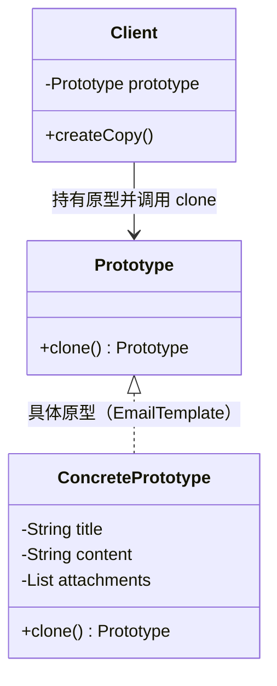
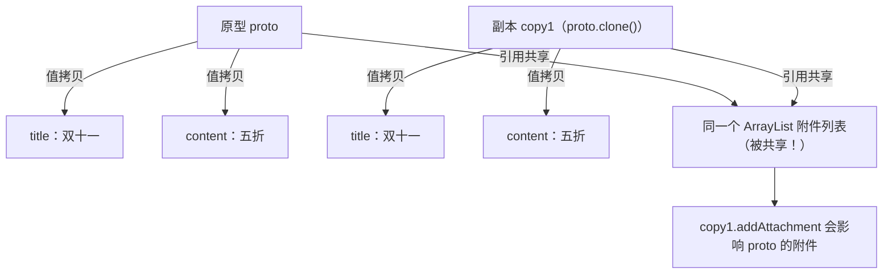

# 06 原型模式

齐天大圣孙悟空拔下一根毫毛，喊一声"变！"，瞬间跳出十几个一模一样的小悟空替他打架——他可没有重新"从石头里再蹦一个"出来，而是**照着自己复制了一堆**。原型模式（Prototype）干的就是这件事：**不靠 `new`，而是复制一个已有对象来创建新对象**，当创建一个对象成本高（查数据库、读配置、复杂初始化）或需要大量"相似但不完全一样"的对象时，它比反复 `new` 高效得多。本文用"大圣分身"开场，重点拆穿深浅拷贝的坑，并给出三种深拷贝实现。

## 一、它是什么

一句话大白话：**原型模式就是"照着已有的样本复制一份"，新对象不是 `new` 出来的，而是 `clone` 出来的**。

生活化比喻：HR 给你发offer，不是手敲一份新合同，而是拿模板"复印"再改名字——模板就是原型，复印就是克隆。大圣的毫毛就是原型，每个分身都是 `clone()` 出来的副本。

经典定义（GoF）：**Specify the kinds of objects to create using a prototypical instance, and create new objects by copying this prototype.** 用一个原型实例指定要创建对象的种类，并通过拷贝这个原型来创建新对象。

## 二、为什么需要它（不用会怎样）

假设要群发 1000 封邮件，每封只是收件人不同，其余内容一致。不用原型时：

```java
package com.canoe.pattern.prototype;

// 不用原型：每封邮件都重新查库、重新组装，创建成本高
public class HeavyEmail {
    private String title;
    private String content;
    private String receiver;
    private String signature; // 假设需从数据库/配置读取

    public HeavyEmail(String receiver) {
        // 模拟昂贵的初始化：读库、拼模板、加载签名……
        this.title = "双十一大促";
        this.content = "全场五折，速来！";
        this.signature = loadSignatureFromDb(); // 每 new 一次都查一次库，浪费！
        this.receiver = receiver;
    }

    private String loadSignatureFromDb() {
        return "—— 某商城官方团队";
    }

    public void send() {
        System.out.println("发给 " + receiver + "：" + title + " | " + content + " " + signature);
    }
}

class WithoutPrototypeDemo {
    public static void main(String[] args) {
        // 1000 次 new = 1000 次查库，性能灾难
        new HeavyEmail("张三").send();
        new HeavyEmail("李四").send();
    }
}
```

痛点：

- **创建成本高却反复付**：模板、签名这些不变的部分每次都重新查库/组装，纯属浪费。
- **new 不适合"大量相似对象"**：你只想改个收件人，却被迫重建整个对象。
- **初始化顺序复杂**：有些对象构造依赖外部资源，直接 `new` 易出错。

原型的作用：**先造好一个"原型"（查一次库），之后 `clone()` 它，只改差异字段（收件人）**，既快又稳。

## 三、结构与角色



| 角色 | 职责 | 说明 |
| --- | --- | --- |
| `Prototype`（原型） | 声明克隆自己的方法（常即 `Cloneable`） | Java 里通常是实现 `Cloneable` |
| `ConcretePrototype`（具体原型） | 实现 `clone()`，返回自身副本 | 持有需要被复制的字段 |
| `Client`（调用方） | 持有一个原型，调用其 `clone()` 造新对象 | 不直接 `new` 具体类 |
| 副本（clone 结果） | 与原型"当前状态"一致的新对象 | 改副本不影响原型 |

## 四、代码实现

先给出"邮件模板"的原型实现（浅拷贝版，重点看克隆怎么用）：

```java
package com.canoe.pattern.prototype;

import java.util.ArrayList;
import java.util.List;

// 具体原型：邮件模板，实现 Cloneable 才能被 clone
public class EmailTemplate implements Cloneable {
    private String title;
    private String content;
    private String signature;
    // 引用类型字段：附件列表。浅拷贝时它会被共享（见第五节）
    private List<String> attachments;

    public EmailTemplate(String title, String content, String signature) {
        this.title = title;
        this.content = content;
        this.signature = signature;
        this.attachments = new ArrayList<String>(); // 初始化一个空列表
    }

    public void addAttachment(String file) {
        attachments.add(file);
    }

    // 重写 clone()：必须 public，且调用 super.clone() 做位级拷贝
    @Override
    public EmailTemplate clone() {
        try {
            return (EmailTemplate) super.clone();
        } catch (CloneNotSupportedException e) {
            throw new RuntimeException("克隆失败", e);
        }
    }

    public void setReceiver(String receiver) {
        // 真实场景这里会有 receiver 字段，为演示聚焦模板复制省略
    }

    public void sendTo(String receiver) {
        System.out.println("发给 " + receiver + "：" + title + " | 附件数="
                + attachments.size() + " | " + signature);
    }

    public List<String> getAttachments() {
        return attachments;
    }

    // 演示：先造原型，再 clone 出多个只改差异
    public static void main(String[] args) {
        EmailTemplate proto = new EmailTemplate("双十一大促", "全场五折", "—— 官方团队");
        proto.addAttachment("优惠券.pdf");

        EmailTemplate copy1 = proto.clone(); // 克隆原型，免去重新查库
        copy1.sendTo("张三");

        EmailTemplate copy2 = proto.clone();
        copy2.sendTo("李四");

        System.out.println("copy1 与 proto 是不同对象？ " + (copy1 != proto)); // true
    }
}
```

运行输出：

```text
发给 张三：双十一大促 | 附件数=1 | —— 官方团队
发给 李四：双十一大促 | 附件数=1 | —— 官方团队
copy1 与 proto 是不同对象？ true
```

## 五、深拷贝与浅拷贝

这是原型模式的**核心考点**。Java 的 `Object.clone()` 默认是**浅拷贝**：基本类型字段会复制值，但**引用类型字段只复制"引用地址"**，原型和副本指向**同一个对象**。

用内存图看浅拷贝的隐患：



验证浅拷贝的坑：

```java
package com.canoe.pattern.prototype;

// 演示浅拷贝导致引用字段被共享
class ShallowBugDemo {
    public static void main(String[] args) {
        EmailTemplate proto = new EmailTemplate("主题", "正文", "签名");
        proto.addAttachment("a.pdf");

        EmailTemplate copy = proto.clone();
        copy.addAttachment("b.pdf"); // 以为只改副本

        // 原型也被改了！因为 attachments 列表是同一份
        System.out.println("原型附件数（期望 1，实际）：" + proto.getAttachments().size());
        // 输出 2 —— 浅拷贝的坑实锤
    }
}
```

**三种深拷贝实现**，各给完整代码：

**① 逐层 clone（手动深拷贝）**：引用字段也实现 `Cloneable` 并重写 `clone()`，在父级 `clone()` 里手动克隆它。

```java
package com.canoe.pattern.prototype;

import java.util.ArrayList;
import java.util.List;

// 深拷贝版：附件列表也单独 clone
class DeepEmail implements Cloneable {
    private String title;
    private List<String> attachments;

    public DeepEmail(String title) {
        this.title = title;
        this.attachments = new ArrayList<String>();
    }

    public void addAttachment(String f) { attachments.add(f); }
    public List<String> getAttachments() { return attachments; }

    @Override
    public DeepEmail clone() {
        try {
            DeepEmail copy = (DeepEmail) super.clone();
            // 关键：引用字段单独克隆，断开与原型的共享
            copy.attachments = new ArrayList<String>(this.attachments);
            return copy;
        } catch (CloneNotSupportedException e) {
            throw new RuntimeException(e);
        }
    }
}
```

**② 序列化（最省心，但要实现 `Serializable`）**：把对象写进流再读出来，天然得到全新深拷贝。

```java
package com.canoe.pattern.prototype;

import java.io.ByteArrayInputStream;
import java.io.ByteArrayOutputStream;
import java.io.IOException;
import java.io.ObjectInputStream;
import java.io.ObjectOutputStream;
import java.io.Serializable;
import java.util.ArrayList;
import java.util.List;

// 序列化深拷贝：对象及其引用字段都要 Serializable
class SerializableEmail implements Serializable {
    private static final long serialVersionUID = 1L;
    private String title;
    private List<String> attachments;

    public SerializableEmail(String title) {
        this.title = title;
        this.attachments = new ArrayList<String>();
    }
    public void addAttachment(String f) { attachments.add(f); }
    public List<String> getAttachments() { return attachments; }

    // 通过字节流"写出去再读回来"，得到完全独立的深拷贝
    public SerializableEmail deepCopy() {
        try {
            ByteArrayOutputStream bos = new ByteArrayOutputStream();
            ObjectOutputStream oos = new ObjectOutputStream(bos);
            oos.writeObject(this);            // 写
            oos.close();

            ByteArrayInputStream bis = new ByteArrayInputStream(bos.toByteArray());
            ObjectInputStream ois = new ObjectInputStream(bis);
            SerializableEmail copy = (SerializableEmail) ois.readObject(); // 读
            ois.close();
            return copy;
        } catch (IOException | ClassNotFoundException e) {
            throw new RuntimeException("深拷贝失败", e);
        }
    }
}
```

**③ JSON 转换（最直观，需第三方库如 Gson/Jackson）**：转成 JSON 字符串再解析回对象，自动深拷贝。

```java
package com.canoe.pattern.prototype;

import com.google.gson.Gson;
import java.util.ArrayList;
import java.util.List;

// JSON 深拷贝：依赖 Gson，对象需有无参构造、字段可被序列化
class JsonEmail {
    private String title;
    private List<String> attachments = new ArrayList<String>();

    public JsonEmail(String title) { this.title = title; }
    public void addAttachment(String f) { attachments.add(f); }
    public List<String> getAttachments() { return attachments; }

    public JsonEmail deepCopy() {
        Gson gson = new Gson();
        String json = gson.toJson(this);          // 对象 -> JSON
        return gson.fromJson(json, JsonEmail.class); // JSON -> 新对象（深拷贝）
    }
}
```

三种方式对比：

| 方式 | 优点 | 缺点 | 适用 |
| --- | --- | --- | --- |
| 逐层 clone | 不依赖 IO、性能好 | 每层都要手写、易漏字段 | 引用层级浅、可控 |
| 序列化 | 全自动、最省心 | 所有类要实现 `Serializable`、性能较差 | 层级深、图结构 |
| JSON 转换 | 直观、无需 `Cloneable` | 引入第三方库、忽略 `transient`、性能一般 | 已有 JSON 工具链 |

## 六、Cloneable 接口与 clone() 的坑

`Cloneable` 和 `clone()` 是 Java 里出了名的"反人类"设计，坑不少：

1. **`Cloneable` 是空标记接口**：它里面一个方法都没有，只是给 JVM 一个"信号"——只有实现了它，`super.clone()` 才不会抛 `CloneNotSupportedException`。不实现却调用 `clone()` 直接报错。
2. **`Object.clone()` 是 `protected`**：子类必须**重写并改成 `public`**，否则外部调不到。
3. **`clone()` 不调用构造器**：它是做"位级拷贝"（直接复制内存），所以构造器里的初始化逻辑、计数器等**不会执行**，容易踩坑。
4. **数组克隆是浅拷贝**：`arr.clone()` 只复制数组本身，元素是引用时仍共享，需要逐元素再克隆。
5. **`final` 字段与 clone 冲突**：若引用字段是 `final`，逐层 clone 时无法重新赋值新克隆对象，深拷贝会编译失败——所以要做深拷贝的字段别设 `final`。
6. **替代方案更香**：《Effective Java》建议**优先用拷贝构造器或静态工厂**（如 `new HashMap<>(orig)`）而非 `clone()`，语义更清晰、不踩 `Cloneable` 的雷。

## 七、优缺点

| 优点 | 缺点 |
| --- | --- |
| **性能高**：绕过 `new` 与复杂初始化，直接复制内存 | **深拷贝实现麻烦**：引用字段需逐层处理，易漏 |
| **隐藏创建成本**：适合"造一个贵、复制便宜"的对象 | **破坏封装**：clone 常要访问内部状态，耦合强 |
| **便于批量造相似对象**：群发、模板、分身场景天然契合 | **Cloneable 设计反人类**：标记接口 + protected，易错 |
| **可动态增删原型**：运行时注册原型即可扩展种类 | **`final` 字段冲突**：深拷贝无法重新赋值 final 引用 |
| **与工厂可组合**：用注册表管理原型，按名取副本 | **浅拷贝隐含共享 bug**：不加防范会改一处动全局 |

## 八、适用场景

- **大量相似对象**：邮件群发、报表批量生成，复制模板只改差异字段。
- **创建成本高**：对象需查库、读大文件、复杂计算初始化，克隆比重建快。
- **大圣"分身"类需求**：游戏中复制大量属性相近的敌人/NPC。
- **简历复印/配置克隆**：基于一份模板快速派生多份变体。
- **原型注册表**：Spring 中 `Prototype` 作用域的 Bean，每次 `getBean()` 返回新实例（本质是每次给新副本）。

**什么情况下不要用**：对象创建本就廉价、字段少，直接 `new` 更直观；或对象图极其复杂且引用环多，深拷贝容易出 bug，此时不如用工厂或拷贝构造器。

## 九、在 JDK / 开源框架中的应用

- **`Object.clone()`**：Java 一切克隆的源头，所有对象都继承了它（需 `Cloneable` 才能用）。
- **`ArrayList.clone()` / `HashMap.clone()`**：集合框架的克隆，注意它们是**浅拷贝**。
- **Spring `Prototype` 作用域**：`<bean scope="prototype">` 或 `@Scope("prototype")`，每次 `getBean()` 都返回新实例，是原型模式在容器层的体现。
- **Apache Commons BeanUtils / Spring BeanUtils `copyProperties`**：对象属性拷贝工具，常被当作"浅拷贝版原型"使用，跨对象复制字段。
- **图形/游戏引擎**：许多 Java 游戏框架用原型注册表缓存敌人模板，需要时 `clone()` 出分身。

## 十、与相近模式的区别

| 对比项 | 原型模式 | 工厂模式 | 单例模式 |
| --- | --- | --- | --- |
| **目的** | 通过拷贝快速造相似对象 | 屏蔽创建、选哪个产品 | 保证全局唯一 |
| **创建方式** | `clone()` 复制已有对象 | 工厂 `new` 新产品 | 只产一个且唯一 |
| **使用场景** | 创建贵、需大量副本 | 产品种类多、要扩展 | 资源唯一共享 |

## 本篇小结

- **原型模式**通过复制已有对象来创建新对象，避免反复昂贵的 `new`。
- **大圣拔毛分身**是原型最形象的隐喻：照着自己 `clone` 出一群副本。
- **浅拷贝**只复制引用地址，原型与副本会**共享引用类型字段**，改一处动全局。
- **深拷贝**需让引用字段也各自独立，否则 `clone()` 出的副本会"串味"。
- **逐层 clone**性能好但手写繁琐，容易漏掉某个引用字段导致半深拷贝。
- **序列化深拷贝**最省心，但要求对象及所有引用字段都实现 `Serializable`。
- **JSON 转换深拷贝**直观，依赖 Gson/Jackson，会忽略 `transient` 字段。
- **`Cloneable` 是空标记接口**，`super.clone()` 只在实现了它时才不抛异常。
- **`Object.clone()` 是 protected**，子类必须重写为 `public` 才能外部调用。
- **`clone()` 不调用构造器**，构造器内的初始化与计数逻辑不会执行。
- **`final` 引用字段与深拷贝冲突**：想逐层 clone 就别把引用字段设成 `final`。
- **《Effective Java》建议用拷贝构造器替代 `clone()`**，语义更清晰、坑更少。

## 参考链接

- [Refactoring Guru · 原型模式](https://refactoringguru.cn/design-patterns/prototype)
- [菜鸟教程 · 原型模式](https://www.runoob.com/design-pattern/prototype-pattern.html)
- [Oracle JavaDoc · Object.clone()](https://docs.oracle.com/en/java/javase/17/docs/api/java.base/java/lang/Object.html#clone())
- [Oracle JavaDoc · Cloneable](https://docs.oracle.com/en/java/javase/17/docs/api/java.base/java/lang/Cloneable.html)
- [Spring 官方文档 · Bean 作用域（prototype）](https://docs.spring.io/spring-framework/docs/current/reference/html/core.html#beans-factory-scopes-prototype)
- [《Effective Java》第三版 · 条目 13：谨慎重写 clone](https://book.douban.com/subject/30412517/)
- [廖雪峰的 Java 教程 · 克隆](https://www.liaoxuefeng.com/wiki/1252599548343744/1281319214514209)

下一篇 → [07 适配器模式](/java/design-pattern/adapter)
