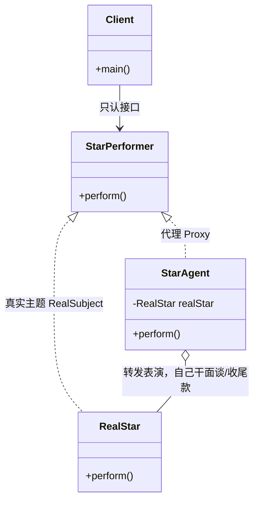

# 09 代理模式

大牌明星不会亲自去谈商演、审合同、收尾款——这些杂活都交给经纪人。代理模式（Proxy）干的就是"经纪人"的活儿：在**不改动原对象**的前提下，找一个替身替它接活、加戏、做前置后置处理，客户端却以为自己一直在跟"本人"打交道。本文用明星经纪人的例子，把静态代理、JDK 动态代理、CGLIB 一次性讲透，并顺带解开"Spring AOP 到底用的哪种代理"这个高频面试题。

## 一、它是什么

**一句话大白话**：代理模式就是"找个人替你干活，但对外还是用你的名义"。

举个生活里的例子：你想租房子，直接找房东要挨家挨户敲门、看房、谈价、拟合同，累得半死；于是你找了房产中介。中介就是房东的"代理"——你把钱交给中介，中介再转交房东；你看的是中介带看的房，但本质上住的是房东的房。中介在不改变"房子是房东的"这个事实的前提下，替房东（和你）做了大量前置后置工作。

换成软件术语，GoF 的官方定义是：

> 为其他对象提供一种**代理**以控制对这个对象的访问。

注意关键词是"**控制访问**"——代理不是简单地转发请求，它往往要在请求前后塞入额外逻辑：权限校验、日志、事务、缓存、懒加载……这正是 Spring AOP 能横切编程的底层基石。

## 二、为什么需要它（不用会怎样）

假设我们要做一个"明星接商演"的系统。最朴素的写法，客户端直接调用真实明星：

```java
// 反面教材：没有代理，所有杂活都混进业务代码
public class BadClient {
    public static void main(String[] args) {
        RealStar star = new RealStar("周杰轮");

        // 每次商演都要手写一遍"面谈、审合同、收尾款"的重复逻辑
        System.out.println("【客户】先安排面谈...");
        star.表演();
        System.out.println("【客户】演出结束，我来收尾款、做记账...");

        // 换一场演出，重复代码又来一遍，逻辑散落各处
        System.out.println("【客户】先安排面谈...");
        star.表演();
        System.out.println("【客户】演出结束，我来收尾款、做记账...");
    }
}
```

痛点立刻暴露：

1. **横切逻辑散落**：面谈、记账、收尾款这种"每个商演都要做"的活儿，被复制粘贴到每个调用点，改一处要改全身。
2. **真实对象被污染**：明星本该只关心"表演"，却被迫耦合了商务流程。
3. **无法统一管控**：想给所有商演加一道"黑名单客户拦截"，只能去每个调用点改代码，类爆炸且极易漏改。

代理模式的解法：把"面谈、签合同、收尾款"这些通用动作收拢到**经纪人（代理）**身上，明星只管表演，客户端只管找经纪人。业务逻辑与横切逻辑彻底解耦。

## 三、结构与角色

代理模式的标准结构（以经纪人为例）：



| 角色 | 对应类 | 职责 |
| --- | --- | --- |
| **抽象主题 Subject** | `StarPerformer` | 定义真实主题与代理共同遵守的接口，让客户端可以无差别地使用二者 |
| **真实主题 RealSubject** | `RealStar` | 真正执行业务逻辑的对象（明星本人表演） |
| **代理 Proxy** | `StarAgent` | 实现同一接口，持有真实主题引用，在转发请求前后插入额外控制逻辑 |
| **客户端 Client** | `ProxyDemo` | 面向抽象主题编程，感知不到自己用的是代理还是本人 |

核心效果：**客户端只依赖抽象主题接口**，代理与真实主题可以互相替换，控制逻辑被收口到代理里。

## 四、代码实现

先搭好抽象主题与真实主题这一对"台前幕后"的基础代码（后面静态代理、动态代理都复用它）。

```java
package com.canoe.pattern.proxy;

import java.lang.reflect.InvocationHandler;
import java.lang.reflect.Method;
import java.lang.reflect.Proxy;

// 抽象主题：明星对外提供的商务能力
interface StarPerformer {
    void 面谈();
    void 签合同();
    void 表演();
    void 收钱();
}

// 真实主题：真正的明星，只关心表演本身
class RealStar implements StarPerformer {
    private String name;

    public RealStar(String name) {
        this.name = name;
    }

    @Override
    public void 面谈() {
        System.out.println(name + "：我们来聊聊演出细节。");
    }

    @Override
    public void 签合同() {
        System.out.println(name + "：合同我签了。");
    }

    @Override
    public void 表演() {
        System.out.println(name + "：开始唱歌！");
    }

    @Override
    public void 收钱() {
        System.out.println(name + "：钱到账，谢谢！");
    }
}
```

## 五、静态代理

静态代理就是**手动**写一个实现了同一接口的代理类，把真实对象包起来：

```java
// 静态代理：经纪人，手动实现 StarPerformer
class StarAgent implements StarPerformer {
    // 持有真实主题的引用
    private RealStar star;

    public StarAgent(RealStar star) {
        this.star = star;
    }

    @Override
    public void 面谈() {
        // 前置增强：杂活经纪人包了
        System.out.println("经纪人：面谈排期这种杂活我来做。");
    }

    @Override
    public void 签合同() {
        System.out.println("经纪人：合同法务我来审，规避风险。");
    }

    @Override
    public void 表演() {
        // 核心业务才交给真实明星
        star.表演();
    }

    @Override
    public void 收钱() {
        System.out.println("经纪人：尾款我来收，抽成 20%。");
    }
}
```

客户端使用：

```java
public class ProxyDemo {
    public static void main(String[] args) {
        System.out.println("===== 静态代理 =====");
        RealStar 周杰轮 = new RealStar("周杰轮");
        // 客户端只认接口，感知不到背后是经纪人
        StarPerformer agent = new StarAgent(周杰轮);
        agent.面谈();
        agent.签合同();
        agent.表演();
        agent.收钱();
    }
}
```

**静态代理的致命缺点——类爆炸**：一个接口就要配一个代理类。如果现在有 `歌星`、`影星`、`笑星` 三种艺人，每种又有 `国内商演`、`海外商演` 两种代理策略，你就得手写 `3 × 2 = 6` 个代理类。接口一旦新增方法，所有代理类都要跟着改。当接口数量一多，**代理类的维护成本会指数级上升**——这正是动态代理要解决的问题。

## 六、JDK 动态代理

JDK 动态代理在**运行时**由 `Proxy` 类根据接口动态生成代理类，不再需要手写每一个代理。核心是 `InvocationHandler`：所有方法调用都会统一兜到它的 `invoke` 方法里。

```java
// 动态代理处理器：把"经纪人逻辑"统一收口到这里
class StarInvocationHandler implements InvocationHandler {
    // 被代理的真实对象
    private Object target;

    public StarInvocationHandler(Object target) {
        this.target = target;
    }

    /**
     * 所有通过代理调用的方法，最终都会走到这里
     * @param proxy  生成的代理对象本身
     * @param method 当前被调用的方法
     * @param args   方法参数
     */
    @Override
    public Object invoke(Object proxy, Method method, Object[] args) throws Throwable {
        System.out.println("【经纪人】接活前先安排面谈、审档期");
        // 真正调用真实对象的方法
        Object result = method.invoke(target, args);
        System.out.println("【经纪人】演出后统一收尾款、做税务记账");
        return result;
    }
}
```

客户端这样用：

```java
public class ProxyDemo {
    // 上一节的 main 省略，这里展示动态代理部分
    public static void main(String[] args) {
        System.out.println("===== JDK 动态代理 =====");
        RealStar 明星 = new RealStar("林俊节");
        // 运行时动态生成代理对象，无需手写代理类
        StarPerformer dynamic = (StarPerformer) Proxy.newProxyInstance(
                StarPerformer.class.getClassLoader(),   // 类加载器
                new Class<?>[]{StarPerformer.class},    // 要实现的接口数组
                new StarInvocationHandler(明星)          // 调用处理器
        );
        dynamic.面谈();
        dynamic.表演();
        dynamic.收钱();
    }
}
```

**为什么 JDK 动态代理必须实现接口？** 因为 `Proxy.newProxyInstance` 生成的代理类， already 继承了 JDK 自带的 `Proxy` 类（Java 单继承，extends 名额已用掉），所以只能**通过实现接口**来暴露能力。这也是为什么"有接口才能用 JDK 动态代理"——没有接口，它就没法附着。

## 七、CGLIB 动态代理

CGLIB（Code Generation Library）走的是另一条路：**继承**。它不要求目标类实现接口，而是运行时生成目标类的一个子类作为代理，通过重写方法并插入拦截逻辑来工作。核心是 `MethodInterceptor`。

```java
// 需要引入 cglib 依赖（如 net.sf.cglib:cglib:3.3.0）
// import net.sf.cglib.proxy.Enhancer;
// import net.sf.cglib.proxy.MethodInterceptor;
// import net.sf.cglib.proxy.MethodProxy;
// import java.lang.reflect.Method;

// 被代理类：无需实现任何接口
class OrdinaryStar {
    public void 表演() {
        System.out.println("普通明星：开始表演！");
    }
}

// 方法拦截器，等价于 JDK 的 InvocationHandler
class StarMethodInterceptor implements MethodInterceptor {
    @Override
    public Object intercept(Object obj, Method method, Object[] args,
                            MethodProxy proxy) throws Throwable {
        System.out.println("【CGLIB 经纪人】演出前安排档期");
        // 调用父类（真实对象）的方法
        Object result = proxy.invokeSuper(obj, args);
        System.out.println("【CGLIB 经纪人】演出后收尾款");
        return result;
    }
}
```

使用方式（示意）：

```java
// Enhancer enhancer = new Enhancer();
// enhancer.setSuperclass(OrdinaryStar.class);
// enhancer.setCallback(new StarMethodInterceptor());
// OrdinaryStar proxy = (OrdinaryStar) enhancer.create();
// proxy.表演();
```

| 对比点 | JDK 动态代理 | CGLIB 动态代理 |
| --- | --- | --- |
| 实现机制 | 实现接口（Proxy 子类） | 继承目标类（生成子类） |
| 是否需接口 | **必须**有接口 | 不需要接口 |
| 限制 | 只能代理接口方法 | **不能**代理 `final` 类与 `final` 方法 |
| 性能 | JDK 8+ 已高度优化，通常更快 | 早期更快，生成代理略慢 |
| 依赖 | JDK 内置，无需第三方 | 需引入 cglib 依赖 |

## 八、Spring AOP 用的是哪种

这是面试高频题，结论要记牢：

- **Spring AOP 早期**：目标对象**有接口**用 JDK 动态代理，**无接口**用 CGLIB。
- **Spring Boot 2.x 起**：AOP 默认**统一使用 CGLIB**。原因是 JDK 动态代理要求目标必须实现接口，而很多业务类（如 `@Service`）未必有接口；统一用 CGLIB 可以让代理行为更一致，避免"同一类有时被代理成接口、有时被代理成子类"的歧义。当然你仍可通过配置 `spring.aop.proxy-target-class=false` 切回"有接口就用 JDK"的策略。
- 此外，Spring 的事务管理（`@Transactional`）、缓存（`@Cacheable`）、安全（`@Secured`）等注解，底层**全都是 AOP 代理**在起作用——你写的业务方法被代理偷偷包了一层事务开启/提交/回滚。

一句话记忆：**AOP = 代理模式 + 一个统一的"在哪切、切什么"的配置引擎**。

## 九、优缺点

| 优点 | 缺点 |
| --- | --- |
| **职责清晰**：真实对象只管核心业务，代理管横切逻辑 | **增加间接层**：多一次方法转发，调用链变长 |
| **开闭原则**：新增控制逻辑（日志、鉴权）不改真实对象 | **类数量上升**：静态代理会带来类爆炸 |
| **灵活可控**：可在任意位置插入前置/后置/异常逻辑 | **JDK 代理受限**：必须有接口才能用 |
| **保护目标**：可隐去真实对象、做访问控制与缓存 | **调试略难**：动态代理的调用栈不如直接调用直观 |
| **支持远程/虚拟代理**：本地调用远程对象或延迟加载 | CGLIB 不能代理 `final` 类与方法 |

## 十、适用场景

1. **远程代理**：调用本地接口，代理在背后走网络访问远程服务（如 RMI、RPC 客户端 Stub）。
2. **虚拟代理（懒加载）**：图片/大对象很重，先用占位图代理，真正需要时再加载原图（如网页图片懒加载）。
3. **保护代理**：在代理里做权限校验，无权限直接拒绝访问真实对象。
4. **缓存代理**：代理先查缓存，命中就返回，未命中再调真实对象并回填（如 MyBatis 二级缓存）。
5. **日志/监控/事务代理**：AOP 的典型用途，统一横切关注点。
6. **智能引用**：对象被引用时自动计数、记录访问日志。

**什么情况下不要用**：如果对象很小、逻辑很简单、且不存在横切需求，硬套代理只会徒增复杂度；另外当代理链嵌套过深（代理的代理的代理），可维护性与性能都会告警。

## 十一、在 JDK / 开源框架中的应用

- **JDK `java.lang.reflect.Proxy`**：动态代理的原生实现，上面已演示，是 AOP 的基石。
- **JDK `java.rmi`**：RMI 的 Stub 本质就是远程对象的代理，让远程调用看起来像本地方法。
- **Spring AOP / Transactional**：`@Transactional` 通过代理在方法前后织入事务的 begin/commit/rollback。
- **MyBatis `MapperProxy`**：你写的 `UserMapper` 接口没有任何实现类，MyBatis 用 `MapperProxy`（实现 `InvocationHandler`）在运行时动态生成代理，把接口方法翻译成 SQL 执行。
- **Spring `CglibAopProxy` / `JdkDynamicAopProxy`**：Spring 内部就这两个类分别对应 CGLIB 与 JDK 两种代理策略。

设计意图高度一致：**用一层间接性，换取横切逻辑的统一收口与业务代码的解耦**。

## 十二、与相近模式的区别

| 模式 | 目的 | 与代理的区别 |
| --- | --- | --- |
| **适配器 Adapter** | 把一个接口**转换成**客户端期望的另一个接口 | 适配器改变接口形态；代理**保持接口不变**，只控制访问 |
| **装饰器 Decorator** | 在不改接口的前提下**增强**对象功能，可层层嵌套叠加 | 装饰器强调"功能叠加"且通常客户端主动包裹；代理强调"访问控制"，由框架/容器自动套上，客户端往往无感知 |

记忆口诀：**装饰器是"锦上添花"，代理是"门卫把关"**。

## 本篇小结

- **代理模式**的本质是"找替身控制访问"，客户端只认抽象主题接口。
- 经典结构分**抽象主题、真实主题、代理**三角色，代理持有真实对象引用。
- **静态代理**简单直观，但真实类一多就会引发**类爆炸**。
- **JDK 动态代理**用 `Proxy` + `InvocationHandler` 在运行时生成代理，无需手写代理类。
- JDK 动态代理**必须基于接口**，因为生成的代理类已继承 `Proxy`、无法再继承目标类。
- **CGLIB** 基于继承生成子类，无需接口，但**不能代理 `final` 类和方法**。
- Spring AOP 在 Boot 2.x 后**默认统一用 CGLIB** 代理。
- `@Transactional`、`@Cacheable` 等注解底层全是**AOP 代理**在织入逻辑。
- 代理适合**远程、虚拟（懒加载）、保护、缓存、日志**等横切场景。
- 代理与**装饰器**不同：装饰器增强功能，代理控制访问。
- 代理与**适配器**不同：适配器改接口形态，代理保持接口不变。
- 过度嵌套代理会让**调用链变长、调试变难**，需克制使用。

## 参考链接

- [Refactoring Guru · Proxy Pattern（英文）](https://refactoring.guru/design-patterns/proxy)
- [Refactoring Guru · 代理模式（中文）](https://refactoringguru.cn/design-patterns/proxy)
- [菜鸟教程 · 代理模式](https://www.runoob.com/design-pattern/proxy-pattern.html)
- [Oracle JDK · java.lang.reflect.Proxy](https://docs.oracle.com/javase/8/docs/api/java/lang/reflect/Proxy.html)
- [Spring 官方文档 · AOP](https://docs.spring.io/spring-framework/docs/current/reference/html/core.html#aop)
- [Wikipedia · Proxy Pattern](https://en.wikipedia.org/wiki/Proxy_pattern)
- [MyBatis 官方文档](https://mybatis.org/mybatis-3/)

下一篇 → [10 桥接模式](/java/design-pattern/bridge)
