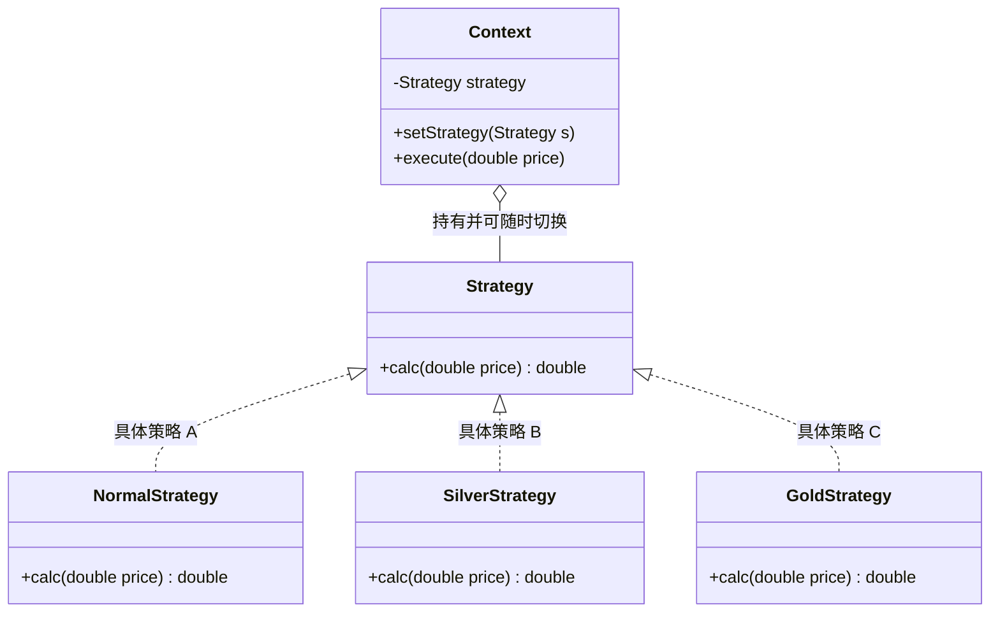

# 14 策略模式

> 本篇导读：你是否见过一段代码里塞满了十几个 `if-else` 来计算不同会员的折扣？每加一种促销，就要改一次主干逻辑，还生怕改坏别人的分支。策略模式就是专门收拾这种"条件分支膨胀"的利器：把每一种算法封装成一个独立的策略，让它们可以互相替换，客户端只管"选哪个"，不用管"怎么算"。本文用超市促销和排序算法两个故事，带你从反面代码一路重构到优雅实现。

## 一、它是什么

一句话大白话：**策略模式就是把"做一件事的多种不同做法"各自封装成独立的类，让它们可以无缝替换**。

打个比方：你去超市买东西，付款方式可以选现金、支付宝、微信、信用卡。对"付钱"这件事来说，这几种方式就是不同的**策略**——你的目的都是买单，只是手段不同，而且今天想用哪个就用哪个，随时能换。

再看个更"三国"的：诸葛亮给赵云三个锦囊，嘱咐"到东吴办不成亲事就拆第一个，遇危险拆第二个，还不行拆第三个"。每个锦囊是应对不同局势的**妙计（策略）**，赵云不需要会算卦，只要按情形掏对应锦囊即可。

GoF 的官方定义：

> Define a family of algorithms, encapsulate each one, and make them interchangeable. Strategy lets the algorithm vary independently from clients that use it.
> ——《Design Patterns: Elements of Reusable Object-Oriented Software》

翻译过来就是：**定义一族算法，把它们分别封装起来，并且让它们之间可以互相替换。策略模式使得算法可以独立于使用它的客户端而变化。**

## 二、为什么需要它（不用会怎样）

先看一段"没有策略模式"的反面代码——超市促销结算：

```java
// ❌ 反面教材：所有折扣逻辑挤在一个方法里
public class Cashier {
    public double checkout(String memberLevel, double price) {
        if ("NORMAL".equals(memberLevel)) {
            return price;                      // 普通会员不打折
        } else if ("SILVER".equals(memberLevel)) {
            return price * 0.95;               // 银卡 95 折
        } else if ("GOLD".equals(memberLevel)) {
            return price * 0.9;                // 金卡 9 折
        } else if ("PLATINUM".equals(memberLevel)) {
            if (price > 1000) {
                return price * 0.85 - 100;     // 白金卡满 1000 再减 100
            }
            return price * 0.85;
        } else if ("VIP".equals(memberLevel)) {
            return price * 0.8;                // 钻石 8 折
        }
        throw new IllegalArgumentException("未知会员等级：" + memberLevel);
    }
}
```

这段代码的痛点很明显：

1. **分支膨胀**：每加一种会员等级，就要在 `checkout` 里加一个 `else if`，方法越来越长。
2. **改一处动全身**：折扣算法和结算流程耦合在一起，改金卡逻辑时一不小心可能误伤普通会员的分支。
3. **无法复用与测试**：某个折扣算法想单独抽出去复用或单元测试，根本拆不出来。
4. **开闭原则被破坏**：对"扩展（新增策略）"是开放的，但对"修改（改主干）"也是开放的，这违背了"对扩展开放、对修改关闭"。

策略模式的改善：把"每种折扣怎么算"抽成一个个独立的策略类，主干只负责调用策略，新增等级时**只加类、不改主干**。

## 三、结构与角色



| 角色 | 职责 |
| --- | --- |
| **Context（上下文）** | 持有一个 Strategy 引用，对外提供设置策略和执行的方法。它不知道具体算法细节，只负责"转交"。 |
| **Strategy（抽象策略）** | 定义所有具体策略必须实现的操作接口（如 `calc`），是客户端依赖的抽象。 |
| **ConcreteStrategy（具体策略）** | 实现 Strategy 接口，封装某一种具体算法，彼此独立、可互换。 |
| **Client（客户端）** | 创建具体策略并注入 Context，决定"这次用哪个策略"。 |

## 四、代码实现

完整可运行示例——超市促销策略。

```java
package com.canoe.pattern.strategy;

import java.math.BigDecimal;
import java.math.RoundingMode;

/**
 * 抽象策略：折扣策略
 * 每种会员等级对应一种具体的折扣算法
 */
public interface DiscountStrategy {
    /**
     * 根据原价计算应付金额
     *
     * @param price 原价
     * @return 折后价
     */
    BigDecimal calc(BigDecimal price);
}
```

```java
package com.canoe.pattern.strategy;

import java.math.BigDecimal;
import java.math.RoundingMode;

/** 普通会员：不打折 */
public class NormalStrategy implements DiscountStrategy {
    @Override
    public BigDecimal calc(BigDecimal price) {
        return price.setScale(2, RoundingMode.HALF_UP);
    }
}
```

```java
package com.canoe.pattern.strategy;

import java.math.BigDecimal;
import java.math.RoundingMode;

/** 银卡会员：95 折 */
public class SilverStrategy implements DiscountStrategy {
    @Override
    public BigDecimal calc(BigDecimal price) {
        return price.multiply(new BigDecimal("0.95")).setScale(2, RoundingMode.HALF_UP);
    }
}
```

```java
package com.canoe.pattern.strategy;

import java.math.BigDecimal;
import java.math.RoundingMode;

/** 金卡会员：9 折 */
public class GoldStrategy implements DiscountStrategy {
    @Override
    public BigDecimal calc(BigDecimal price) {
        return price.multiply(new BigDecimal("0.9")).setScale(2, RoundingMode.HALF_UP);
    }
}
```

```java
package com.canoe.pattern.strategy;

import java.math.BigDecimal;
import java.math.RoundingMode;

/** 白金会员：85 折，且满 1000 再减 100 */
public class PlatinumStrategy implements DiscountStrategy {
    @Override
    public BigDecimal calc(BigDecimal price) {
        BigDecimal discounted = price.multiply(new BigDecimal("0.85"));
        if (discounted.compareTo(new BigDecimal("1000")) > 0) {
            discounted = discounted.subtract(new BigDecimal("100"));
        }
        return discounted.setScale(2, RoundingMode.HALF_UP);
    }
}
```

```java
package com.canoe.pattern.strategy;

import java.math.BigDecimal;

/**
 * 上下文（收银员）
 * 持有当前策略，把"算钱"这件事委托出去
 */
public class Cashier {
    private DiscountStrategy strategy;

    /** 客户端通过这个方法动态切换策略 */
    public void setStrategy(DiscountStrategy strategy) {
        this.strategy = strategy;
    }

    /** 结算：委托给当前策略 */
    public BigDecimal checkout(BigDecimal price) {
        if (strategy == null) {
            throw new IllegalStateException("尚未选择折扣策略");
        }
        return strategy.calc(price);
    }
}
```

```java
package com.canoe.pattern.strategy;

import java.math.BigDecimal;

/** 演示：同一笔订单，换不同策略得到不同结果 */
public class StrategyDemo {
    public static void main(String[] args) {
        Cashier cashier = new Cashier();
        BigDecimal order = new BigDecimal("2000");

        cashier.setStrategy(new NormalStrategy());
        System.out.println("普通会员应付：" + cashier.checkout(order));

        cashier.setStrategy(new PlatinumStrategy());
        System.out.println("白金会员应付：" + cashier.checkout(order));

        cashier.setStrategy(new GoldStrategy());
        System.out.println("金卡会员应付：" + cashier.checkout(order));
    }
}
```

运行输出：

```text
普通会员应付：2000.00
白金会员应付：1600.00
金卡会员应付：1800.00
```

注意 `setStrategy` 这一点——**策略可以在运行时随时切换**，这正是它比写死 `if-else` 灵活的地方。

## 五、消灭 if-else 的实战

上面还要客户端 `new` 具体策略，仍残留"选择"的硬编码。真实项目里更彻底的做法是：**用 Map 登记全部策略，按 key 取用，新增策略零改动主干**。

```java
package com.canoe.pattern.strategy.advanced;

import java.math.BigDecimal;
import java.math.RoundingMode;
import java.util.HashMap;
import java.util.Map;

/** 抽象策略 */
public interface DiscountStrategy {
    BigDecimal calc(BigDecimal price);
}

class SilverStrategy implements DiscountStrategy {
    @Override
    public BigDecimal calc(BigDecimal price) {
        return price.multiply(new BigDecimal("0.95")).setScale(2, RoundingMode.HALF_UP);
    }
}

class GoldStrategy implements DiscountStrategy {
    @Override
    public BigDecimal calc(BigDecimal price) {
        return price.multiply(new BigDecimal("0.9")).setScale(2, RoundingMode.HALF_UP);
    }
}

/**
 * 策略工厂：用 Map 维护 等级 -> 策略 的映射
 * 新增会员等级时，只需往 MAP 里加一条，主干一行都不用改
 */
class DiscountStrategyFactory {
    private static final Map<String, DiscountStrategy> MAP = new HashMap<String, DiscountStrategy>();

    static {
        MAP.put("SILVER", new SilverStrategy());
        MAP.put("GOLD", new GoldStrategy());
    }

    public static DiscountStrategy get(String level) {
        DiscountStrategy s = MAP.get(level);
        if (s == null) {
            throw new IllegalArgumentException("未知会员等级：" + level);
        }
        return s;
    }
}
```

在 Spring 中还可以更优雅：**把容器里所有 `DiscountStrategy` 实现类自动收集进 Map**，彻底消除"注册"这一步：

```java
package com.canoe.pattern.strategy.advanced;

import java.util.List;
import java.util.Map;
import java.util.stream.Collectors;

import org.springframework.stereotype.Component;

/**
 * 利用 Spring 依赖注入，把所有 DiscountStrategy 实现类按 Bean 名收集到 Map
 * 新增策略只需加一个 @Component 类，无需改动此处一行代码
 */
@Component
public class DiscountStrategyHolder {
    private final Map<String, DiscountStrategy> strategyMap;

    public DiscountStrategyHolder(List<DiscountStrategy> strategies) {
        this.strategyMap = strategies.stream()
                .collect(Collectors.toMap(s -> s.getClass().getSimpleName(), s -> s));
    }

    public DiscountStrategy get(String beanName) {
        return strategyMap.get(beanName);
    }
}
```

## 六、与状态模式的区别

| 维度 | 策略模式 | 状态模式 |
| --- | --- | --- |
| **谁选策略/状态** | 由**客户端**主动选择要用的策略 | 由**对象内部**条件驱动，自动在状态间切换 |
| **是否感知彼此** | 各个策略**互不知晓**，彼此独立 | 各个状态通常**知道下一个状态**，能触发流转 |
| **目的** | 让"算法/做法"可替换，关注行为选择 | 让"对象行为随状态改变"，关注状态流转 |
| **数量关系** | 同一时刻只用一个策略 | 状态会随事件不断迁移 |

一句话记：**策略是"你想用哪个自己挑"，状态是"我根据你的处境自动变"**。

## 七、优缺点

| 优点 | 缺点 |
| --- | --- |
| 消除大量 `if-else` / `switch`，主干清爽 | 策略类数量变多，每加一种算法就多一个类 |
| 符合开闭原则，新增策略不改旧代码 | 客户端必须了解所有策略差异，才能正确选择 |
| 算法可复用、可单独单元测试 | 若策略极少且几乎不变，反而显得过度设计 |
| 运行时动态切换策略，灵活 | 多个策略共享数据时，可能需额外传递上下文 |

## 八、适用场景

- 一个行为有多种实现方式，且需要**在运行时切换**（如支付方式：现金/支付宝/微信）。
- 一个类中出现大量条件分支，且分支逻辑彼此独立、容易变化（如会员折扣、税费计算）。
- 需要把算法细节对客户隐藏，只暴露统一接口（如排序算法选择：快排/归并/堆排）。
- 出行/物流方式选择：步行、骑车、开车、打车各有成本与耗时计算。
- 诸葛亮的"锦囊"式业务：不同情境触发不同应对方案。

**什么情况下不要用**：如果只有两三种算法、且几乎不会再变，直接写 `if-else` 反而更简单，上策略模式就是杀鸡用牛刀。

## 九、在 JDK / 开源框架中的应用

- **`java.util.Comparator<T>`**：这就是一个典型的策略接口。`Collections.sort(list, comparator)` 时传入不同 `Comparator` 即切换排序规则，与本文"排序算法选择"如出一辙。
- **`java.util.concurrent.RejectedExecutionHandler`**：线程池拒绝任务时的处理策略（Abort / Discard / CallerRuns / DiscardOldest），由调用方注入，标准策略模式。
- **Spring 的 `Resource` 与 `ResourceLoader`**：加载资源时按协议选择 `ClassPathResource` / `UrlResource` / `FileSystemResource` 等策略。
- **MyBatis 的 `Executor` 与 `StatementHandler`**：`BatchExecutor` / `ReuseExecutor` / `SimpleExecutor` 是不同的执行策略，由配置决定注入哪个。

它们这么设计的原因一致：**把"易变的行为"从"稳定的主体"中抽离，保证主体代码不被频繁改动**。

## 十、与相近模式的区别

| 对比模式 | 区别点 | 策略模式 |
| --- | --- | --- |
| **状态模式** | 状态由内部自动切换、状态间相互知晓；策略由客户端主动选择、彼此独立 | 关注"做法可替换" |
| **工厂模式** | 工厂负责"创建对象"，策略负责"执行行为"；工厂常用来生产策略，二者常搭档 | 关注"行为本身" |

## 本篇小结

- **策略模式**的核心是把"一族算法"各自封装，做到**互相可替换**。
- 它最直接的价值是**干掉臃肿的 `if-else` / `switch` 分支**。
- **Context（上下文）** 只持有策略引用，把计算**委托**出去，自己不关心算法细节。
- **客户端**负责选择并注入具体策略，实现了**控制反转**。
- 策略之间**互不知晓、彼此独立**，符合"职责单一"。
- 新增一种算法只需**新增一个类**，主干代码一行不动，符合**开闭原则**。
- 用 **Map + 工厂** 可进一步做到"选择逻辑"也无需改动。
- 在 **Spring** 中可用依赖注入把全部实现类收集进 Map，实现**零改动扩展**。
- 与**状态模式**最大的区别：策略是客户端主动选，状态是内部自动切。
- JDK 的 **`Comparator`** 与线程池**拒绝策略**都是策略模式的经典现身。
- 策略模式通常**与工厂模式搭档**，由工厂生产策略再注入 Context。
- 算法**极少且稳定**时不必使用，避免过度设计。

## 参考链接

- [Refactoring Guru · 策略模式](https://refactoringguru.cn/design-patterns/strategy)
- [Oracle JavaDoc · Comparator](https://docs.oracle.com/en/java/javase/17/docs/api/java.base/java/util/Comparator.html)
- [Oracle JavaDoc · RejectedExecutionHandler](https://docs.oracle.com/en/java/javase/17/docs/api/java.base/java/util/concurrent/RejectedExecutionHandler.html)
- [Spring Framework · Resource 抽象](https://docs.spring.io/spring-framework/reference/core/resources.html)
- [MyBatis · Executor 源码](https://github.com/mybatis/mybatis-3/blob/master/src/main/java/org/apache/ibatis/executor/Executor.java)
- [维基百科 · Strategy pattern](https://en.wikipedia.org/wiki/Strategy_pattern)
- [GoF 设计模式 · 策略](https://en.wikipedia.org/wiki/Design_Patterns)

下一篇 → [15 模板方法模式](/java/design-pattern/template-method)
