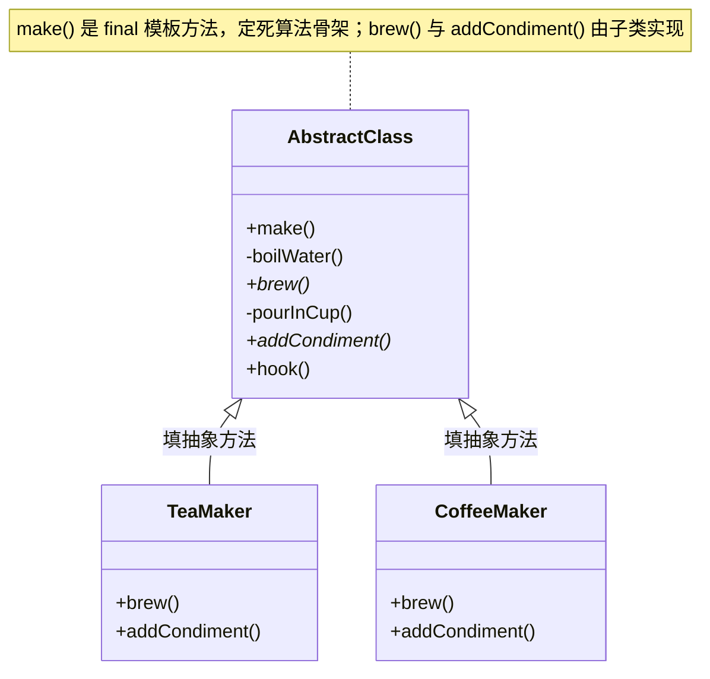

# 15 模板方法模式

> 本篇导读：泡茶和泡咖啡，步骤几乎一样——烧水、冲泡、倒进杯子、加点料。唯一不同的是"冲什么"和"加什么料"。模板方法模式就是把这种"流程骨架固定、某些步骤可变"的场景抽象出来：父类定好算法的**骨架**，把可变的步骤声明为抽象方法，丢给子类去填。本文用"泡茶 vs 泡咖啡"的趣味例子，带你写出第一个模板方法，并讲清钩子方法、与工厂方法的关系，以及在 JDK/Spring 里的真实身影。

## 一、它是什么

一句话大白话：**模板方法模式就是"父类定流程，子类填细节"**——把不变的步骤写在父类，把会变的步骤留给子类实现。

生活化比喻：你去奶茶店点单，不管点珍珠奶茶还是柠檬茶，店员的**流程骨架**都一样：煮水 → 加原料 → 摇匀 → 装杯。区别只是"加什么原料"。这个"骨架"就是模板方法，而"加原料"是留给具体饮品去实现的空位。

GoF 的官方定义：

> Define the skeleton of an algorithm in an operation, deferring some steps to subclasses. Template Method lets subclasses redefine certain steps of an algorithm without changing the algorithm's structure.
> ——《Design Patterns: Elements of Reusable Object-Oriented Software》

翻译：**在操作中定义算法的骨架，将某些步骤延迟到子类实现。模板方法让子类可以在不改变算法结构的前提下，重新定义其中的某些步骤。**

## 二、为什么需要它（不用会怎样）

先看反面代码——分别写泡茶和泡咖啡，没有模板方法：

```java
// ❌ 反面教材：两份高度重复的代码
public class TeaMaker {
    public void make() {
        boilWater();          // 烧水（重复）
        steepTeaBag();        // 泡茶
        pourInCup();          // 倒杯（重复）
        addLemon();           // 加柠檬
    }
    private void boilWater() { System.out.println("烧开水"); }
    private void steepTeaBag() { System.out.println("浸泡茶叶"); }
    private void pourInCup() { System.out.println("倒进杯子"); }
    private void addLemon() { System.out.println("加柠檬"); }
}

public class CoffeeMaker {
    public void make() {
        boilWater();          // 烧水（重复）
        brewCoffee();         // 煮咖啡
        pourInCup();          // 倒杯（重复）
        addSugar();           // 加糖
    }
    private void boilWater() { System.out.println("烧开水"); }
    private void brewCoffee() { System.out.println("冲泡咖啡粉"); }
    private void pourInCup() { System.out.println("倒进杯子"); }
    private void addSugar() { System.out.println("加糖"); }
}
```

痛点：

1. **重复代码多**：`boilWater`、`pourInCup` 在两类里各写了一遍，违背"不要重复自己（DRY）"。
2. **流程易走样**：哪天规定"先温杯再倒"，得同时改 TeaMaker 和 CoffeeMaker，漏一个就出 bug。
3. **改一处动全身**：流程属于公共逻辑，却散落在每个子类，难以保证一致。

模板方法的改善：把公共的 `boilWater`、`pourInCup` 提到父类，只把 `brew()`、`addCondiment()` 留给子类，**流程只写一次**。

## 三、结构与角色



| 角色 | 职责 |
| --- | --- |
| **AbstractClass（抽象类）** | 定义 `final` 的模板方法 `make()`，编排固定流程；把可变步骤声明为抽象方法，并可选地提供钩子方法（默认空实现）。 |
| **ConcreteClass（具体子类）** | 实现父类声明的抽象步骤，按自身需要覆盖钩子方法。 |
| **模板方法 `make()`** | 用 `final` 防止子类篡改流程顺序，是"好莱坞原则"（Don't call us, we'll call you）的体现。 |

## 四、代码实现

完整可运行示例——泡茶 vs 泡咖啡。

```java
package com.canoe.pattern.templatemethod;

/**
 * 抽象类：饮料制作模板
 * 固定流程：烧水 -> 冲泡 -> 倒杯 -> 加料
 */
public abstract class BeverageTemplate {

    /** 模板方法：流程骨架，final 禁止子类篡改顺序 */
    public final void make() {
        boilWater();
        brew();
        pourInCup();
        // 通过钩子决定是否加料
        if (needCondiment()) {
            addCondiment();
        }
    }

    /** 公共步骤：烧水（所有饮料一样） */
    private void boilWater() {
        System.out.println("1. 烧开水");
    }

    /** 公共步骤：倒杯（所有饮料一样） */
    private void pourInCup() {
        System.out.println("3. 倒进杯子");
    }

    /** 可变步骤：冲泡什么，由子类决定 */
    protected abstract void brew();

    /** 可变步骤：加什么料，由子类决定 */
    protected abstract void addCondiment();

    /** 钩子方法：默认需要加料，子类可覆盖 */
    protected boolean needCondiment() {
        return true;
    }
}
```

```java
package com.canoe.pattern.templatemethod;

/** 泡茶：实现可变步骤 */
public class TeaMaker extends BeverageTemplate {
    @Override
    protected void brew() {
        System.out.println("2. 浸泡茶叶");
    }

    @Override
    protected void addCondiment() {
        System.out.println("4. 加柠檬");
    }
}
```

```java
package com.canoe.pattern.templatemethod;

/** 泡咖啡：实现可变步骤 */
public class CoffeeMaker extends BeverageTemplate {
    @Override
    protected void brew() {
        System.out.println("2. 冲泡咖啡粉");
    }

    @Override
    protected void addCondiment() {
        System.out.println("4. 加糖加奶");
    }
}
```

```java
package com.canoe.pattern.templatemethod;

/** 演示 */
public class TemplateMethodDemo {
    public static void main(String[] args) {
        System.out.println("=== 泡茶 ===");
        BeverageTemplate tea = new TeaMaker();
        tea.make();

        System.out.println("\n=== 泡咖啡 ===");
        BeverageTemplate coffee = new CoffeeMaker();
        coffee.make();
    }
}
```

运行输出：

```text
=== 泡茶 ===
1. 烧开水
2. 浸泡茶叶
3. 倒进杯子
4. 加柠檬

=== 泡咖啡 ===
1. 烧开水
2. 冲泡咖啡粉
3. 倒进杯子
4. 加糖加奶
```

注意父类的 `make()` 用 `final` 修饰——**这是模板方法的灵魂**：流程顺序只能由父类定，子类改不了，只能填空。

## 五、钩子方法 Hook

钩子（Hook）是父类提供的**"可选步骤"**：有默认实现（通常为空或返回 `true`），子类**可以**覆盖它来影响流程走向，也可以**完全不管**。

在上面的 `BeverageTemplate` 里，`needCondiment()` 就是一个钩子。再看一个更直观的例子——有人爱喝"黑咖啡不加料"：

```java
package com.canoe.pattern.templatemethod.hook;

/** 不加料的纯咖啡：通过钩子改变流程 */
public class PlainCoffeeMaker extends BeverageTemplate {
    @Override
    protected void brew() {
        System.out.println("2. 冲泡咖啡粉");
    }

    @Override
    protected void addCondiment() {
        // 不会被调用，因为钩子返回 false
        System.out.println("4. 加糖加奶");
    }

    /** 覆盖钩子：表示不需要加料，流程自动跳过第 4 步 */
    @Override
    protected boolean needCondiment() {
        return false;
    }
}
```

与抽象方法的区别：**抽象方法强制子类必须实现**（否则编译报错）；**钩子方法不强制**，子类按需覆盖即可。钩子让模板方法在"固定流程"之余，保留了"微调弹性"。

## 六、实际应用

模板方法在框架里无处不在，它们都是"父类定骨架、子类填细节"：

- **Servlet 的 `HttpServlet.service()`**：`service()` 根据请求方法（GET/POST/PUT…）分派到 `doGet` / `doPost` 等模板方法，我们写的 `HttpServlet` 子类只需覆盖对应 `doXxx`，不必关心分发流程。
- **Spring 的 `JdbcTemplate`**：`execute()` 固定了"获取连接 → 创建 Statement → 执行 → 释放资源"的骨架，把"具体 SQL 与结果映射"作为回调/抽象步骤留给调用方。
- **MyBatis 的 `BaseExecutor`**：`update` / `query` 定义了"清缓存 → 调 doUpdate/doQuery → 记日志"的骨架，`doUpdate` / `doQuery` 由 `SimpleExecutor` 等子类实现。
- **JUnit 的 `TestCase.runBare()`**：固定了 `setUp → runTest → tearDown` 的生命周期，我们只需写 `testXxx` 方法。

## 七、与工厂方法的关系

工厂方法模式（Factory Method）本质上就是**模板方法模式的一种特例**：当模板方法里"可变的那一步"恰好是"创建一个对象"时，这个抽象步骤就叫 `factoryMethod()`。

```java
// 模板方法里调用工厂方法生产产品，具体产品由子类决定
public abstract class OrderProcessor {
    public final void process() {
        Product p = createProduct();   // ← 这就是工厂方法
        p.pack();
    }
    protected abstract Product createProduct();  // 工厂方法
}
```

所以二者关系：**工厂方法是"创建型"的模板方法**，模板方法是"行为型"的更广义概念。很多模板方法里会顺手塞一个工厂方法来决定使用哪个具体组件。

## 八、优缺点

| 优点 | 缺点 |
| --- | --- |
| 消除重复代码，公共逻辑只写一次 | 父类定义流程，子类受约束，**灵活性受限** |
| 符合开闭原则，新增子类不改父类流程 | 类数量增加，每加一种变体多一个子类 |
| 控制反转（好莱坞原则），流程由父类掌控 | 父类改动流程会**牵连所有子类** |
| 便于复用与统一规范 | 子类与父类**耦合紧密**，调试时要点进父类 |

## 九、适用场景

- 多个类有**相同流程、只有个别步骤不同**（如泡茶/泡咖啡、HR 入职流程）。
- 想固定算法骨架、只开放少数步骤给扩展（如做饭：备菜→烹饪→装盘，烹饪方式可变）。
- 框架需要定义生命周期钩子，让使用者填空（如 JUnit、Servlet）。
- 考试答题：出题、发卷、收卷固定，答题内容各人不同。
- 数据导入：读取→校验→落库固定，校验规则因来源而异。

**什么情况下不要用**：如果流程本身经常变、或各实现之间步骤差异极大，模板方法反而把结构焊死，应改用策略模式等更松散的组合。

## 十、在 JDK / 开源框架中的应用

- **`java.io.InputStream.read()`**：`read()` 是抽象方法（可变），而 `read(byte[] b)` 是模板方法，它内部循环调用 `read()` 填满缓冲区——典型的"骨架固定、细节延迟"。
- **`java.util.AbstractList` / `AbstractSet`**：提供了 `addAll` / `iterator` 等模板方法，把 `get` / `size` 等留给具体集合实现。
- **Spring `JdbcTemplate`**：见上文第六节的说明。
- **Servlet `HttpServlet.service()`**：见上文第六节的说明。

它们这么设计的原因一致：**把稳定不变的部分固化在父类，把易变细节交给子类，既减少重复又统一规范**。

## 十一、与相近模式的区别

| 对比模式 | 区别点 | 模板方法模式 |
| --- | --- | --- |
| **策略模式** | 策略用**组合**委托算法，运行时可换；模板用**继承**固定流程，编译期确定 | 关注"流程复用" |
| **工厂方法模式** | 工厂方法就是模板方法的特例，差异仅在抽象步骤的用途（造对象 vs 做行为） | 更广义的骨架 |

## 本篇小结

- **模板方法模式** = **父类定骨架，子类填空格**，复用公共流程。
- 模板方法必须用 **`final` 修饰**，防止子类篡改算法顺序。
- 可变步骤声明为**抽象方法**，强制子类实现；可选步骤用**钩子（Hook）**留给子类按需覆盖。
- 它体现了**好莱坞原则**："Don't call us, we'll call you"（子类别调父类，父类来调你）。
- 最大的好处是**消除重复代码**，公共逻辑只写一次。
- 新增一种变体只需**新增一个子类**，符合开闭原则。
- **钩子方法**让固定流程保留微调弹性，且子类不覆盖也能跑。
- **工厂方法**是模板方法的一个特例（可变步骤恰好是创建对象）。
- JDK 的 **`InputStream.read()`**、**`AbstractList`** 都用了模板方法。
- Spring 的 **`JdbcTemplate`**、Servlet 的 **`HttpServlet`** 是框架级经典应用。
- 缺点是子类与父类**耦合紧**，父类改流程会牵连所有子类。
- 流程本身多变、步骤差异大时**不宜使用**，应改用策略模式。

## 参考链接

- [Refactoring Guru · 模板方法模式](https://refactoringguru.cn/design-patterns/template-method)
- [Oracle JavaDoc · InputStream](https://docs.oracle.com/en/java/javase/17/docs/api/java.base/java/io/InputStream.html)
- [Oracle JavaDoc · AbstractList](https://docs.oracle.com/en/java/javase/17/docs/api/java.base/java/util/AbstractList.html)
- [Spring Framework · JdbcTemplate](https://docs.spring.io/spring-framework/docs/current/javadoc-api/org/springframework/jdbc/core/JdbcTemplate.html)
- [Oracle JavaDoc · HttpServlet](https://docs.oracle.com/javaee/7/api/javax/servlet/http/HttpServlet.html)
- [维基百科 · Template method pattern](https://en.wikipedia.org/wiki/Template_method_pattern)
- [GoF 设计模式 · 模板方法](https://en.wikipedia.org/wiki/Design_Patterns)

下一篇 → [16 观察者模式](/java/design-pattern/observer)
