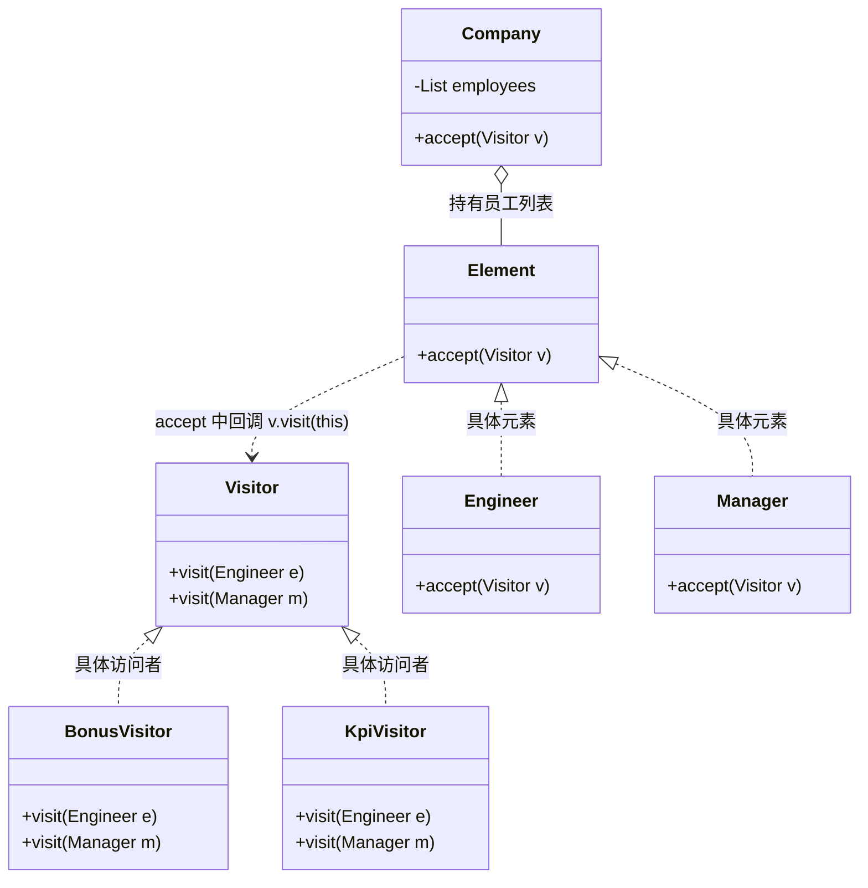

# 22 访问者模式

访问者模式（Visitor Pattern）是 GoF 行为型模式里最"绕"、也最容易被误用的一位。它解决的是一个看似矛盾的需求：**有一组稳定的元素类（如工程师、经理），你希望在不修改它们的前提下，不断往上面加新的操作（发奖金、做 KPI、查差旅）**。正常写法是在每个元素里加方法，元素类会被改到崩溃；访问者模式反过来——把"操作"抽成独立的访问者类，让元素敞开大门说"你来访问我吧"。

## 一、它是什么

一句话大白话：**把"对一群对象的操作"单独打包成一个人（访问者），这群对象排好队让他挨个参观，每个对象自己把"该怎么被操作"告诉他。**

生活化比喻：公司年终考核。HR 带着两套方案来——一套算年终奖，一套评 KPI。他走到工程师工位前说"我给你算奖金"，工程师就按自己的指标（代码量、 bug 数）报数；走到经理工位前说"我给你算奖金"，经理按自己的指标（产品收入、团队规模）报数。HR 这个"考核人"就是访问者，工程师/经理就是被参观的元素。

官方定义（GoF）：*Represent an operation to be performed on the elements of an object structure. Visitor lets you define a new operation without changing the classes of the elements on which it operates.* 即"表示一个作用于某对象结构各元素上的操作，让你能定义新操作而不改变元素所属的类"。

## 二、为什么需要它（不用会怎样）

还是年终考核。不用访问者，你会在每个员工类里堆方法：

```java
package com.canoe.pattern.visitor.bad;

// 没有访问者模式：每加一种考核，就要改所有员工类
public abstract class BadEmployee {
    protected String name;
    public BadEmployee(String name) { this.name = name; }

    // 发奖金
    public abstract int calcBonus();
    // 评 KPI
    public abstract String evalKpi();
    // 查差旅（新需求来了！）
    // public abstract void checkTravel();  // 又要改 Engineer / Manager 两个类
}

class BadEngineer extends BadEmployee {
    private int codeLines;
    private int bugCount;
    public BadEngineer(String name, int codeLines, int bugCount) {
        super(name); this.codeLines = codeLines; this.bugCount = bugCount;
    }
    @Override public int calcBonus() { return codeLines / 1000 * 1000; }
    @Override public String evalKpi() { return bugCount <= 3 ? "A" : "B"; }
}

class BadManager extends BadEmployee {
    private int productIncome;
    private int teamSize;
    public BadManager(String name, int productIncome, int teamSize) {
        super(name); this.productIncome = productIncome; this.teamSize = teamSize;
    }
    @Override public int calcBonus() { return productIncome / 10000 * 1000; }
    @Override public String evalKpi() { return productIncome > 1000000 ? "A" : "B"; }
}
```

痛点：

- **改一处动全类**：每来一种新考核（查差旅、查考勤），`Engineer` 和 `Manager` 两个类都得改，违反开闭原则。
- **元素类职责膨胀**：员工类本该只管"我是谁、我有哪些属性"，却被塞满各种统计逻辑。
- **相关操作散落**：算奖金的代码一半在工程师、一半在经理，想整体review年终奖规则得翻两个类。

访问者模式把"奖金""KPI""差旅"各自做成独立访问者，员工类从此**只开门、不干事**。

## 三、结构与角色



| 角色 | 对应类 | 职责 |
| --- | --- | --- |
| 访问者 Visitor | `Visitor` | 为每种元素声明一个 `visit(Xxx)` 重载方法 |
| 具体访问者 ConcreteVisitor | `BonusVisitor` / `KpiVisitor` | 实现每种元素的具体操作 |
| 元素 Element | `Employee` | 声明 `accept(Visitor)`，开门迎接访问者 |
| 具体元素 ConcreteElement | `Engineer` / `Manager` | 在 `accept` 里调用 `visitor.visit(this)` |
| 对象结构 ObjectStructure | `Company` | 持有元素集合，提供让访问者遍历的入口 |

**角色的作用**：`Visitor` 用一组 `visit` 重载把"操作"集中起来；`Element.accept` 是双分派的入口；`ObjectStructure` 负责把访问者领进每个元素面前。

## 四、代码实现

元素抽象：

```java
package com.canoe.pattern.visitor;

// 员工（元素）抽象
public abstract class Employee {
    protected String name;
    protected int salary;

    public Employee(String name, int salary) {
        this.name = name;
        this.salary = salary;
    }

    public String getName() {
        return name;
    }

    public int getSalary() {
        return salary;
    }

    // 接受访问者：双分派的第一跳
    public abstract void accept(Visitor visitor);
}
```

两个具体元素：

```java
package com.canoe.pattern.visitor;

// 工程师：靠代码量和技术等级考核
public class Engineer extends Employee {
    private int codeLines; // 年度代码行数
    private int bugCount;  // 漏出的 bug 数

    public Engineer(String name, int salary, int codeLines, int bugCount) {
        super(name, salary);
        this.codeLines = codeLines;
        this.bugCount = bugCount;
    }

    public int getCodeLines() {
        return codeLines;
    }

    public int getBugCount() {
        return bugCount;
    }

    @Override
    public void accept(Visitor visitor) {
        // 第二跳：把"具体的自己"交给对应的 visit 重载
        visitor.visit(this);
    }
}
```

```java
package com.canoe.pattern.visitor;

// 经理：靠产品收入和团队规模考核
public class Manager extends Employee {
    private int productIncome; // 负责产品的年收入
    private int teamSize;      // 团队人数

    public Manager(String name, int salary, int productIncome, int teamSize) {
        super(name, salary);
        this.productIncome = productIncome;
        this.teamSize = teamSize;
    }

    public int getProductIncome() {
        return productIncome;
    }

    public int getTeamSize() {
        return teamSize;
    }

    @Override
    public void accept(Visitor visitor) {
        visitor.visit(this);
    }
}
```

访问者接口与两个具体访问者：

```java
package com.canoe.pattern.visitor;

// 访问者：定义对每种元素的操作
public interface Visitor {
    void visit(Engineer engineer);
    void visit(Manager manager);
}
```

```java
package com.canoe.pattern.visitor;

// 发奖金的访问者
public class BonusVisitor implements Visitor {
    @Override
    public void visit(Engineer engineer) {
        int bonus = engineer.getCodeLines() / 1000 * 1000 + engineer.getBugCount() * -200;
        System.out.println(engineer.getName() + "（工程师）年终奖：" + Math.max(bonus, 0) + " 元");
    }

    @Override
    public void visit(Manager manager) {
        int bonus = manager.getProductIncome() / 10000 * 1000 + manager.getTeamSize() * 500;
        System.out.println(manager.getName() + "（经理）年终奖：" + bonus + " 元");
    }
}
```

```java
package com.canoe.pattern.visitor;

// 做 KPI 考核的访问者
public class KpiVisitor implements Visitor {
    @Override
    public void visit(Engineer engineer) {
        String level = engineer.getBugCount() <= 3 ? "A" : "B";
        System.out.println(engineer.getName() + " 工程师 KPI 评级：" + level);
    }

    @Override
    public void visit(Manager manager) {
        String level = manager.getProductIncome() > 1000000 ? "A" : "B";
        System.out.println(manager.getName() + " 经理 KPI 评级：" + level);
    }
}
```

对象结构：公司。

```java
package com.canoe.pattern.visitor;

import java.util.ArrayList;
import java.util.List;

// 对象结构：公司，持有所有员工
public class Company {
    private List<Employee> employees = new ArrayList<Employee>();

    public void addEmployee(Employee e) {
        employees.add(e);
    }

    // 让访问者遍历所有员工
    public void accept(Visitor visitor) {
        for (Employee e : employees) {
            e.accept(visitor);
        }
    }
}
```

客户端：

```java
package com.canoe.pattern.visitor;

// 客户端演示：同一批员工，两种考核
public class Client {
    public static void main(String[] args) {
        Company company = new Company();
        company.addEmployee(new Engineer("张三", 20000, 50000, 2));
        company.addEmployee(new Manager("李四", 35000, 2000000, 12));

        System.out.println("====== 发年终奖 ======");
        company.accept(new BonusVisitor());

        System.out.println("====== KPI 考核 ======");
        company.accept(new KpiVisitor());
    }
}
```

输出：

```text
====== 发年终奖 ======
张三（工程师）年终奖：50000 元
李四（经理）年终奖：2006000 元
====== KPI 考核 ======
张三 工程师 KPI 评级：A
李四 经理 KPI 评级：A
```

## 五、双分派（Double Dispatch）

这是访问者模式最硬核、也最容易被讲歪的一点。先厘清 Java 的分派机制：

- **Java 是单分派语言**：方法调用时，只有 `this` 的实际类型参与运行期绑定；而**参数类型在编译期就定死了**（按静态类型选重载）。

看这句：`visitor.visit(this)`。单看它，似乎"参数 `this` 也是动态绑定"——其实不是。关键在于 `accept` 方法是**被重写的**：当 `Company` 遍历到 `Engineer` 时，调用的是 `Engineer.accept(visitor)`；进入这个方法后，`this` 的静态类型就是 `Engineer`，于是编译器在这里就把 `visit(this)` 绑定到 `visit(Engineer)` 这个重载上。

所以完整的"两次分派"是：

1. **第一次分派（动态）**：`e.accept(visitor)` 根据 `e` 的实际类型（Engineer 还是 Manager）动态调到对应的 `accept`。
2. **第二次分派（编译期确定重载）**：在 `accept` 体内 `visitor.visit(this)`，`this` 静态类型是具体元素，于是绑定到正确的 `visit(Engineer)` / `visit(Manager)`。

正是这两步配合，才让"同一个 `visitor.visit` 调用"最终走到与元素类型精确匹配的实现——这就是所谓的**双分派**。没有 `accept` 这一跳，光靠 `Visitor.visit(Employee)` 一个方法，Java 永远无法在运行期知道传进来的是工程师还是经理（参数静态类型固定），也就无法分派到不同逻辑。

一句话记忆：**`accept` 负责选"谁来接待"，`visit` 负责"接待时干啥"，两者接力完成类型精确匹配。**

## 六、优缺点

本节的"优缺点"先谈一个最关键、也最容易被忽略的特性——**开闭原则的"倾斜"**：

- **新增"操作"极容易**：要加"查差旅""查考勤"，只需新建一个 `TravelVisitor` / `AttendanceVisitor` 实现 `Visitor` 的两个 `visit` 方法，元素类一个字都不用改。这是它对"操作扩展"的完美开放。
- **新增"元素"极痛苦**：如果要加第三种员工 `Intern`（实习生），你得改 `Visitor` 接口加一个 `visit(Intern)`，然后**所有已有的访问者（BonusVisitor、KpiVisitor……）全都得补一个方法**，否则编译不过。这是它对"元素扩展"的封闭。

所以访问者模式适合"**元素类稳定、操作常变**"的场景。如果你的元素类型也天天变，用访问者反而是一场灾难——这正体现了开闭原则在此处的倾斜：它对"操作"敞开，对"元素"闭合。

## 七、实际应用

- **编译器 AST 遍历**：抽象语法树节点（表达式、语句）稳定，而"类型检查""代码生成""格式化"是不同访问者，挨个遍历节点即可。
- **ASM 字节码修改**：ASM 的 `ClassVisitor` / `MethodVisitor` 就是访问者，遍历 class 文件的各个结构并做织入。
- **Spring `BeanDefinitionVisitor`**：Spring 用访问者遍历 `BeanDefinition`，统一做占位符 `${...}` 的解析替换。
- **报表导出**：对"资产""负债""权益"做不同统计（求和、占比、同比），每种统计一个访问者，财务报表元素不动。

## 八、优缺点

| 优点 | 缺点 |
| --- | --- |
| **新增操作很容易**，只加访问者类，元素不动 | **新增元素很痛苦**，要改所有访问者接口与实现 |
| **相关操作集中**在一个访问者里，便于整体维护 | 破坏元素封装：访问者常需暴露元素内部状态 |
| 符合对"操作"的开闭原则 | 元素类必须稳定，否则得不偿失 |
| 可在一次遍历里完成多种统计，效率高 | 结构复杂、理解成本高，易过度设计 |
| 易于累积跨元素的全局状态（如求和计数器） | 与迭代器强耦合，需先能遍历 |

## 九、适用场景

- 对象结构（元素集合）**稳定**，但**要经常新增作用于它们的操作**。
- 需要对一组不同类型元素做多种互不相关的统计/处理（报表、检查器、导出器）。
- 想避免把各种操作逻辑散落进元素类，保持元素类的纯粹。

**什么时候不要用**：元素类型本身会频繁变化；或只有一两种操作、元素很少。此时直接给元素加方法更直白，硬上访问者只会增加理解负担。

## 十、在 JDK / 开源框架中的应用

- **ASM `org.objectweb.asm.ClassVisitor`**：字节码处理框架用访问者遍历 class 结构，是最经典的工业级访问者。
- **Spring `BeanDefinitionVisitor`**：遍历 `BeanDefinition` 做占位符解析，访问者模式在 IoC 容器中的真实落地。
- **Java `javax.lang.model.element.ElementVisitor`**（注解处理）：`Element` 稳定，各种注解处理器作为访问者遍历 AST 元素。
- **Apache Commons BCEL / 各类 AST 工具**：语法树节点 + 多遍扫描（语义检查、优化、CodeGen）都是访问者套路。

为什么这么设计：语法树、字节码、Bean 定义这些"结构"极少变动，而"要对它们做什么"却随需求层出不穷——访问者把易变的"操作"外置，结构层保持干净。

## 十一、与相近模式的区别

| 对比 | 访问者模式 | 迭代器模式 |
| --- | --- | --- |
| 目的 | 给稳定元素集合**新增操作**而不改元素 | 统一**遍历**元素的方式 |
| 关注点 | 走到每个元素"干啥" | 怎么把元素"一个个取出来" |
| 结构 | 元素 `accept` 访问者，访问者 `visit` 元素 | 集合 `iterator()` 产出迭代器 |
| 典型场景 | 报表统计、AST 遍历 | `for-each`、集合遍历 |
| 关系 | 常**借助迭代器**完成遍历 | 常被访问者"乘坐" |

一句话区分：**迭代器负责"把大家逛一遍"，访问者负责"逛到每个人面前做不同的事"**——二者经常组合使用。

## 本篇小结

- **访问者模式把"操作"抽成独立类**，元素只开门、不干事。
- **核心是 `Element.accept(Visitor)` + `Visitor.visit(X)`** 的双向接口。
- **双分派靠两步**：`accept` 动态选接待者，`this` 静态类型定 `visit` 重载。
- **Java 是单分派**，没有 `accept` 这一跳就无法按元素类型精确分派。
- **新增操作极易**：加访问者类即可，元素类零改动。
- **新增元素极难**：要改 `Visitor` 接口和所有已有访问者，编译全挂。
- **开闭原则在此倾斜**：对操作开放、对元素封闭。
- **适合"元素稳定、操作常变"**，反之是灾难。
- **它常借助迭代器遍历元素**，二者是搭档不是对手。
- **ASM、Spring BeanDefinitionVisitor、注解处理器**都是真实范例。
- **理解双分派就理解了访问者**，这是本篇最关键的钥匙。

## 参考链接

- [Refactoring Guru · Visitor Pattern（中文）](https://refactoringguru.cn/design-patterns/visitor)
- [Refactoring Guru · Visitor Pattern（英文）](https://refactoring.guru/design-patterns/visitor)
- [菜鸟教程 · 访问者模式](https://www.runoob.com/design-pattern/visitor-pattern.html)
- [图说设计模式 · 访问者模式](https://design-patterns.readthedocs.io/zh_CN/latest/behavioral_patterns/visitor.html)
- [Wikipedia · Visitor pattern](https://en.wikipedia.org/wiki/Visitor_pattern)
- [Oracle Java Docs · javax.lang.model.element.ElementVisitor](https://docs.oracle.com/javase/8/docs/api/javax/lang/model/element/ElementVisitor.html)
- [ASM 官方文档 · ClassVisitor](https://asm.ow2.io/javadoc/org/objectweb/asm/ClassVisitor.html)

下一篇 → [23 中介者模式](/java/design-pattern/mediator)
