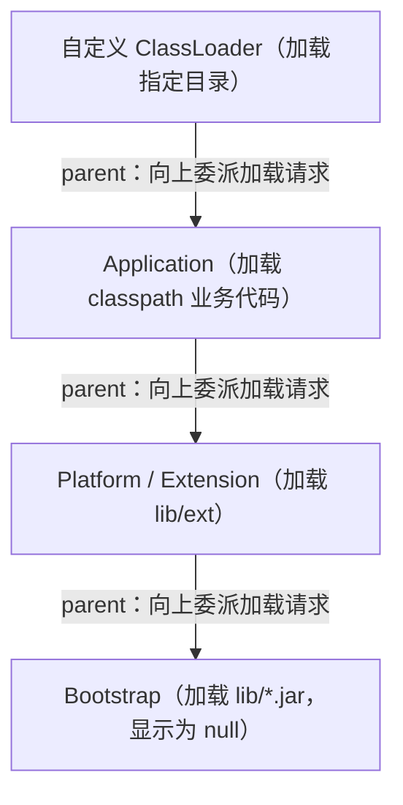

# 02 类加载机制

> 本篇导读：类加载机制决定了"一个 `.class` 文件如何变成内存里可用的类"。本文先走一遍类加载的七个阶段，讲清"准备"与"初始化"的本质区别；再拆解双亲委派模型为何能保证安全与唯一；最后看双亲委派在哪些场景下被有意打破（SPI、Tomcat、热部署），并给出自定义类加载器的完整代码。这是理解框架隔离、热更新、乃至 JVM 安全的基石。

## 一、类加载的过程

类从被加载到虚拟机内存，到卸载出内存，生命周期包括七个阶段：**加载 → 验证 → 准备 → 解析 → 初始化 → 使用 → 卸载**。其中**验证、准备、解析**三者统称为"链接（Linking）"。

- **加载**：通过类的全限定名找到 `class` 文件，把二进制字节流读进来，在方法区生成该类的 `Class` 对象（作为方法区数据的访问入口）。
- **验证**：校验字节码是否合法（魔数、版本、语义、符号引用可达等），防止恶意或错误字节码破坏 JVM。
- **准备**：为**类变量（static 字段）分配内存并赋零值**。注意只给 static 变量，且是"零值"而不是代码里写的值。
- **解析**：把常量池里的**符号引用**替换成**直接引用**（指向内存中真实地址的指针/句柄）。
- **初始化**：执行类构造器 `<clinit>()`，真正给 static 变量赋"程序里写的值"，并执行 static 代码块。

**"准备"和"初始化"的区别是面试高频点**：

```java
package com.canoe.jvm.classload;

public class PrepareInitDemo {
    // 准备阶段: value = 0（零值）
    // 初始化阶段: value = 123（程序中写的值）
    public static int value = 123;

    // 准备阶段就直接赋 456，因为它是 static final 常量（编译期常量）
    public static final int CONST = 456;
}
```

为什么 `static final` 常量在准备阶段就赋值？因为 `ConstantValue` 属性会在编译期把字面量写死，JVM 在准备阶段就直接把常量值赋上，不需要等 `<clinit>`。而普通的 `static int value` 要等到初始化阶段执行 `<clinit>` 时才变成 123。

## 二、什么时候触发初始化

JVM 严格规定了**主动引用**会触发初始化，以下 5 种场景立即对类进行初始化：

1. 遇到 `new`、`getstatic`、`putstatic`、`invokestatic` 这四条指令时（即：new 对象、读写静态字段、调用静态方法）。
2. 使用 `java.lang.reflect` 对类进行**反射**调用时。
3. **初始化子类会先触发父类的初始化**（父类还没初始化时）。
4. 虚拟机启动时，包含 `main()` 方法的那个"主类"会被初始化。
5. JDK 7 引入的 `MethodHandle` 解析出 `REF_getStatic` 等句柄时。

与之相对，下面 3 种**被动引用不会触发初始化**，是经典反例：

```java
package com.canoe.jvm.classload;

class Super {
    static { System.out.println("Super 初始化"); }
    static int superValue = 10;
}

class Sub extends Super {
    static { System.out.println("Sub 初始化"); }
}
```

```java
// 反例 1：子类引用父类的静态字段，只会触发父类初始化，不会触发子类
System.out.println(Sub.superValue);   // 只打印 "Super 初始化"

// 反例 2：数组定义不会触发类初始化（只是创建了数组类型）
Super[] arr = new Super[10];          // 不打印任何初始化信息

// 反例 3：常量在编译期被"常量传播"进常量池，引用常量不会触发定义类初始化
// 若 SUPER_CONST 是 static final 字面量，编译后直接内联，无需加载 Super
```

## 三、类加载器

JVM 里有三层核心类加载器，自顶向下：

- **Bootstrap ClassLoader（启动类加载器）**：用 **C/C++ 实现**，加载 `JAVA_HOME/lib` 下的核心类（如 `rt.jar`、`java.lang.*`）。它在 Java 中**拿不到引用，显示为 `null`**。
- **Platform / Extension ClassLoader（平台/扩展类加载器）**：加载 `JAVA_HOME/lib/ext` 或 `java.ext.dirs` 指定路径的扩展类。JDK 9 之后由"Extension"改名为"Platform"。
- **Application ClassLoader（应用程序类加载器）**：加载**当前应用的 classpath**（你写的业务代码、第三方依赖），也叫"系统类加载器"，`ClassLoader.getSystemClassLoader()` 拿到的就是它。

```java
package com.canoe.jvm.classload;

public class LoaderShow {
    public static void main(String[] args) {
        ClassLoader app = LoaderShow.class.getClassLoader();
        System.out.println("应用类加载器: " + app);

        ClassLoader ext = app.getParent();
        System.out.println("父(平台类加载器): " + ext);

        ClassLoader boot = ext.getParent();
        System.out.println("祖父(启动类加载器): " + boot); // null

        // 核心类由 Bootstrap 加载，显示为 null
        System.out.println(String.class.getClassLoader());   // null
    }
}
```

## 四、双亲委派模型

**双亲委派（Parents Delegation）** 的工作流程是：当一个类加载器收到加载请求时，**先不自己加载，而是把请求委派给父加载器**；父加载器能加载就直接返回，只有父加载器**加载不了**（搜索范围找不到该类）时，子加载器才尝试自己加载。



**为什么要这么设计？** 两个核心原因：

1. **避免重复加载**：一个类在整条委派链上只会被加载一次，保证全局唯一。
2. **保护核心类不被篡改**：假设你自己写一个 `java.lang.String` 并试图加载，由于委派链会把请求一路交给 Bootstrap，最终由它加载 `lib` 里那个真正的 `String`，你写的"假 String"根本没机会被加载。这样核心 API 的权威性和安全性就得到了保障。

```java
package com.canoe.jvm.classload;

// 即使你定义了同名的 java.lang.String，运行时也绝不会用你这个版本
package java.lang;

public class String {
    public String toString() { return "恶意替换?"; } // 不会被加载，会抛 SecurityException
}
```

实际上，如果你在 classpath 下放一个 `java.lang.String`，JVM 在加载时会因为"禁止包名以 `java.` 开头"的安全约束直接报错，从机制上杜绝了核心类被覆盖的可能。

## 五、破坏双亲委派

双亲委派不是铁律，历史上有几次"打破"，重点是理解**为什么必须打破**：

**① 历史原因（JDK 1.2 之前）**：双亲委派模型在 JDK 1.2 才被引入，此前用户已经自定义了 `loadClass`，为了兼容，新模型仍然允许重写 `loadClass`（但不推荐）。

**② SPI（服务提供者接口）**：这是教科书级的例子。以 **JDBC** 为例：`java.sql.Driver` 接口和 `DriverManager` 都在核心库（由 Bootstrap 加载），但具体的驱动实现（如 `com.mysql.cj.jdbc.Driver`）在**应用 classpath** 下，Bootstrap 根本加载不到。解决方案是引入**线程上下文类加载器（TCCL，Thread Context ClassLoader）**，让 Bootstrap 层的代码**反向**用"当前线程的 Application 加载器"去加载厂商实现，从而打破了"只能向上委派"的单向链。

```java
// JDBC 加载驱动的本质：用线程上下文类加载器加载厂商实现
ClassLoader caller = Thread.currentThread().getContextClassLoader();
Class<?> driverClass = Class.forName("com.mysql.cj.jdbc.Driver", true, caller);
```

**③ 热部署与模块化**：像 **OSGi**、**Tomcat** 这类容器，每个 Web 应用需要**相互隔离、互不干扰**，甚至同一个库的不同版本要能并存。它们让**子加载器优先加载自己路径下的类**（"自己先用，找不到再委派父亲"），从而打破了"先委派父亲"的顺序。

## 六、Tomcat 的类加载体系

Tomcat 为了**应用隔离**（不同 WebApp 可以用不同版本的 Spring、不同版本的 log4j 而不冲突），设计了一套独立的类加载器层次。每个 Web 应用都有自己的 `WebAppClassLoader`，并且**优先加载自己 `WEB-INF/classes` 和 `WEB-INF/lib` 下的类，找不到才委派父加载器**——这正是上一节说的"打破双亲委派"的实战落地。

```text
        Bootstrap
            ▲
        System (classpath)
            ▲
        Common (tomcat/lib 共享)
         ▲          ▲
   Catalina      WebApp1  WebApp2 ...   ← 每个应用独立, 自己优先加载
   (服务器自身)   (WebAppClassLoader, 先查自己的 WEB-INF)
```

这样带来的好处：

- **应用隔离**：WebApp1 的 `com.foo.User` 和 WebApp2 的同名类互不干扰。
- **版本并存**：两个应用可以分别使用 Spring 4 和 Spring 5，而不会冲突。
- **热部署**：重新部署某个应用时，丢弃并重建它的 `WebAppClassLoader` 即可，不影响其他应用。

## 七、自定义类加载器

自定义类加载器通常用于：从网络、加密文件、指定目录加载类，或实现热替换。规范做法是**继承 `ClassLoader`，重写 `findClass`**——在父加载器加载不到时，自己去指定位置找 class 文件并 define。

**重要：不要重写 `loadClass`**，因为 `loadClass` 里实现了双亲委派的逻辑；重写了就会破坏整个委派模型（除非你明确想打破，如 Tomcat）。`findClass` 才是"双亲委派找不到时由你兜底"的扩展点。

```java
package com.canoe.jvm.classload;

import java.io.ByteArrayOutputStream;
import java.io.FileInputStream;
import java.io.IOException;
import java.io.InputStream;

public class DirectoryClassLoader extends ClassLoader {

    private final String classDir;

    public DirectoryClassLoader(String classDir) {
        // 用系统类加载器作为父加载器，保留双亲委派
        super(ClassLoader.getSystemClassLoader());
        this.classDir = classDir;
    }

    @Override
    protected Class<?> findClass(String name) throws ClassNotFoundException {
        // name 形如 com.canoe.jvm.classload.Hello
        String path = classDir + "/" + name.replace('.', '/') + ".class";
        try (InputStream in = new FileInputStream(path);
             ByteArrayOutputStream out = new ByteArrayOutputStream()) {
            byte[] buf = new byte[4096];
            int len;
            while ((len = in.read(buf)) != -1) {
                out.write(buf, 0, len);
            }
            byte[] bytes = out.toByteArray();
            // 把字节数组定义成 Class
            return defineClass(name, bytes, 0, bytes.length);
        } catch (IOException e) {
            throw new ClassNotFoundException("找不到类: " + name, e);
        }
    }

    public static void main(String[] args) throws Exception {
        DirectoryClassLoader loader = new DirectoryClassLoader("/d/workSpace/classes");
        Class<?> clazz = loader.loadClass("com.canoe.jvm.classload.Hello");
        Object obj = clazz.getDeclaredConstructor().newInstance();
        System.out.println(clazz.getClassLoader()); // 输出 DirectoryClassLoader
    }
}
```

## 八、类的卸载

类并非加载后就永远驻留。一个类被卸载需要**同时满足**三个条件：

1. 该类的**所有实例都已被回收**（堆里没有任何该类的对象）。
2. **加载该类的 ClassLoader 已被回收**（这几乎意味着整个应用/模块被卸载）。
3. 该类的 **`Class` 对象没有任何地方被引用**（没有反射在用它）。

由于日常用的 Application ClassLoader 几乎不会被回收，再加上条件苛刻，所以**类的卸载在普通 Java 应用中极少发生**。这也解释了为什么方法区（元空间）虽然能回收，但实际中很容易因为动态生成大量类（动态代理、Groovy 脚本、反射生成）而**撑爆元空间、触发 `OutOfMemoryError: Metaspace`**——下一节的运行时数据区篇会进一步展开。

## 本篇小结

- **类加载分七阶段**：加载、验证、准备、解析、初始化、使用、卸载，链接含前三步。
- **准备阶段给 static 变量赋零值**，真正赋程序值要等到初始化阶段的 `<clinit>()`。
- **`static final` 常量在准备阶段就赋值**（编译期常量），不经过 `<clinit>`。
- **主动引用才触发初始化**：new、读写静态、反射、子类触发父类、主类。
- **子类引用父类静态字段、数组定义、常量传播**这三种被动引用不会触发初始化。
- **三层加载器**：Bootstrap（显示为 null）、Platform、Application，各自管不同路径。
- **双亲委派保证类唯一且核心类不被篡改**，自己写的 `java.lang.String` 不会生效。
- **打破双亲委派的经典场景**：历史兼容、SPI（JDBC 用 TCCL）、Tomcat 热部署。
- **自定义加载器应重写 `findClass` 而非 `loadClass`**，否则破坏双亲委派。
- **类卸载条件极其苛刻**，因此元空间容易发生 `Metaspace` OOM。

## 参考链接

- [Java 语言规范 - 类加载链接初始化](https://docs.oracle.com/javase/specs/jls/se17/html/jls-12.html#jls-12.4)
- [Oracle 文档 - ClassLoader](https://docs.oracle.com/en/java/javase/17/docs/api/java.base/java/lang/ClassLoader.html)
- [The Java Virtual Machine Specification - Loading, Linking](https://docs.oracle.com/javase/specs/jvms/se17/html/jvms-5.html)
- [Apache Tomcat - 类加载机制官方说明](https://tomcat.apache.org/tomcat-9.0-doc/class-loader-howto.html)
- [JDBC DriverManager 源码](https://github.com/openjdk/jdk/blob/master/src/java.sql/share/classes/java/sql/DriverManager.java)
- [周志明《深入理解Java虚拟机》](https://book.douban.com/subject/34927789/)

下一篇 → [03 运行时数据区](/java/jvm/runtime)
