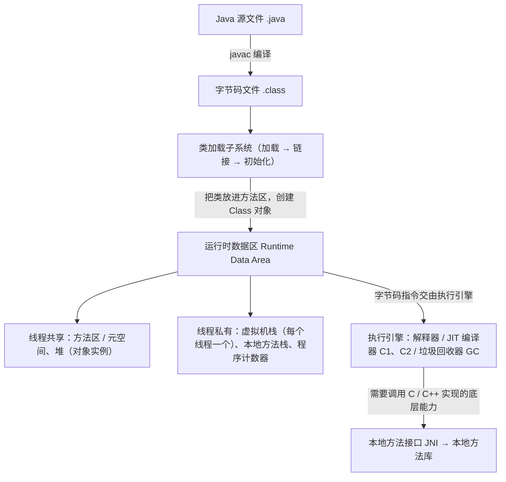

# 01 JVM 基础结构

> 本篇导读：JVM 是 Java 能够"一次编译、到处运行"的根基。本文从 JVM 的定位出发，画出它的整体架构图，梳理运行时的核心模块（类加载、运行时数据区、执行引擎），并解释解释执行与 JIT 编译如何协作，最后给出 JVM 参数分类速查。读完你会对"一个 `.class` 文件是如何被运行起来的"建立完整心智模型。

## 一、JVM 是什么

JVM（Java Virtual Machine，Java 虚拟机）是一个能够执行 `class` 字节码的**虚拟计算机**。它向上屏蔽了不同操作系统、不同 CPU 架构的差异，只要你的代码被编译成了符合规范的字节码，丢到任意平台上的 JVM 里都能运行——这就是"一次编译、到处运行"的根本原因。

从包含关系上看，三者是层层递进的：

- **JVM**：只负责运行字节码的虚拟机，是最底层。
- **JRE**（Java Runtime Environment）：JVM + 核心类库（`rt.jar` 等），是"运行 Java 程序"的最小环境。
- **JDK**（Java Development Kit）：JRE + 编译器 `javac`、诊断工具（`jps`/`jstack`/`jmap` 等），是"开发 Java 程序"的完整环境。

一句话：`JDK` 包含 `JRE`，`JRE` 包含 `JVM`。我们在环境篇装的是 JDK，真正跑代码的是里面的 JVM。

## 二、JVM 的整体结构

一个经典 HotSpot JVM 的内部可以拆成四大块：**类加载子系统**、**运行时数据区**、**执行引擎**、**本地方法接口**。它们的关系如下：



各模块一句话职责：

- **类加载子系统**：把 `.class` 读进来、校验、解析、初始化，变成运行时可用的类。
- **运行时数据区**：程序运行时的内存划分，对象、方法、变量都存在这里（后面 runtime 篇详细讲）。
- **执行引擎**：真正"干活"的地方，把字节码翻译成机器码执行，包含解释器和 JIT。
- **本地方法接口（JNI）**：让 Java 能调用操作系统层面的 C/C++ 代码（例如 `Object.hashCode()` 的 native 实现）。

## 三、JVM 的跨平台性

JVM 的跨平台靠的是**字节码这一中间层**：无论你在 Windows、Linux 还是 macOS 上用 `javac` 编译，`class` 文件的格式都是完全相同的。区别只在于每台机器上安装的是各自平台的 JVM 实现，由它把同一份字节码解释/编译成对应平台的机器指令。

更进一步，JVM 不仅是"平台无关"的，还是"语言无关"的。字节码不绑定 Java 一门语言，只要编译器能把源码编译成符合《Java 虚拟机规范》的 `class` 文件，就能跑在 JVM 上。这就是为什么今天你能看到 **Kotlin、Scala、Groovy、Clojure** 等一众语言共享同一套 JVM 生态、同一套垃圾回收器和工具链。

```bash
# 同一份 Hello.class，在不同平台表现一致
javac Hello.java        # 生成平台无关的 Hello.class
java Hello              # 由当前平台的 JVM 执行
```

## 四、JVM 的生命周期

JVM 从启动到退出，大致经历三个阶段：

1. **启动**：通过引导类加载器（Bootstrap ClassLoader）创建并加载"初始类"（包含 `main` 方法的那个类），然后调用它的 `main` 方法。
2. **运行**：`main` 方法作为起点，开启主线程；程序运行期间 JVM 会创建/销毁各种线程、加载类、分配回收内存。
3. **退出**，发生以下任意一种情况：
   - 调用了 `System.exit(int)` 或 `Runtime.exit(int)`；
   - 所有非守护线程（用户线程）都结束（守护线程如 GC 线程会随之退出）；
   - 程序抛出未捕获异常蔓延到 `main` 之外；
   - 收到外部信号（如 `kill -9`）。

注意区分**守护线程**和**用户线程**：JVM 会一直运行直到所有用户线程结束，而守护线程（如 GC、JIT 编译线程）不影响 JVM 的退出。可以用 `Thread.setDaemon(true)` 把一个线程标记为守护线程（必须在 `start()` 之前设置）。

## 五、常见 JVM 实现

虽然"Java 虚拟机"是一个规范，但实现不止一个：

- **HotSpot**：Oracle/OpenJDK 自带的实现，也是目前绝对的主流。名字来源于它的**热点代码探测**能力——会把执行频率高的"热点代码"编译成本地机器码，从而越跑越快。
- **OpenJ9**（原 IBM J9）：由 Eclipse 基金会维护，以**极低内存占用和高启动速度**著称，适合云原生和容器场景。
- **GraalVM**：Oracle 推出的多语言运行时，支持 Java 之外的 JS、Python、Ruby 等；其 **Graal 编译器**与 **Native Image** 技术可以把 Java 程序直接编译成不依赖 JVM 的原生可执行文件（启动极快、内存极小）。
- **Zing**（Azul）：面向低延迟场景的商业 JVM，拥有 C4 无停顿收集器，适合对延迟极其敏感的金融系统。

本专栏后续所有内容默认都基于 **HotSpot** 这一实现，因为这是绝大多数生产环境的真实选择。

## 六、字节码与 class 文件

`class` 文件是 JVM 的"输入格式"，它有严格的二进制结构，开头 4 个字节是固定的**魔数** `0xCAFEBABE`（咖啡宝贝，很符合 Java 的咖啡图标梗）。其后依次是：

- **次版本号 / 主版本号**：标识编译该文件所用的 JDK 版本（例如 52 = JDK 8，61 = JDK 17）。
- **常量池**：最重要的一块，存放字面量和符号引用（类名、方法名、字段名等）。
- **访问标志 / 类索引 / 父类索引 / 接口索引**：描述类本身的元信息。
- **字段表 / 方法表 / 属性表**：描述类的字段、方法和附加属性。

用 JDK 自带的 `javap` 可以直观地窥探一个类的内部结构：

```bash
# -v 表示 verbose，输出最详尽的信息
javap -v com.canoe.jvm.structure.HelloWorld
```

```text
Classfile /.../HelloWorld.class
  Last modified 2024-1-1; size 541 bytes
  MD5 checksum a1b2c3d4...
  Compiled from "HelloWorld.java"
public class com.canoe.jvm.structure.HelloWorld
  minor version: 0
  major version: 61
  flags: ACC_PUBLIC, ACC_SUPER
Constant pool:
   #1 = Methodref          #4.#15  // java/lang/Object."<init>":()V
   #2 = Fieldref           #3.#16  // java/lang/System.out:Ljava/io/PrintStream;
   #3 = Class              #17     // com/canoe/jvm/structure/HelloWorld
   ...
{
  public com.canoe.jvm.structure.HelloWorld();
    descriptor: ()V
    flags: ACC_PUBLIC
    Code:
      stack=1, locals=1, args_size=1
         0: aload_0
         1: invokespecial #1  // Method java/lang/Object."<init>":()V
         4: return
}
```

下一节的类字节码篇会对 `Constant pool`、`Code`、指令（`aload_0`、`invokespecial`）做逐行拆解，这里先建立"class 文件就是一张结构化表"的印象。

## 七、解释执行与 JIT

很多人对 Java 的印象还停留在"解释执行所以慢"，但今天的 HotSpot 是**解释器 + JIT 编译器混合**工作的：

- **解释器**：逐条读取字节码并解释执行，**启动快、零编译开销**，适合只跑一次的代码（比如程序启动阶段）。
- **JIT（Just-In-Time）编译器**：当某段代码被反复执行、成为"热点"时，JIT 会把它**编译成本地机器码**缓存起来，之后再执行就直接跑机器码，**运行快**。

HotSpot 内部有两条 JIT 编译流水线，配合**分层编译（Tiered Compilation，JDK 7 起默认开启）**：

- **C1（Client 编译器）**：编译快、优化少，适合启动阶段。
- **C2（Server 编译器）**：编译慢、优化激进（逃逸分析、内联、循环展开等），适合长期运行的稳定代码。

热点探测靠两个计数器：**方法调用计数器**（方法被调用了多少次）和**回边计数器**（循环中回跳了多少次）。一旦超过阈值（默认方法调用约 1 万次，可用 `-XX:CompileThreshold` 调整），就触发 JIT 编译。正因如此，Java 服务刚启动时稍慢、跑一段时间后变快，最终性能并不输静态编译语言——**Java 早已不是"慢"的代名词**。

## 八、JVM 参数分类

JVM 参数浩如烟海，但按稳定性可以分成三类，记住这个分类调参时就不会乱：

| 类型 | 前缀 | 示例 | 说明 |
|------|------|------|------|
| 标准参数 | `-` | `-version`、`-help`、`-cp` | 所有 JVM 实现都支持，最稳定 |
| 非标准参数 | `-X` | `-Xms512m`、`-Xmx512m`、`-Xss256k` | HotSpot 特有，相对常用 |
| 不稳定参数 | `-XX` | `-XX:+UseG1GC`、`-XX:MaxMetaspaceSize=256m` | 可能随版本变化，是**调优主力** |

`-XX` 参数又有两种写法：布尔型用 `+`/`-` 开关（如 `-XX:+UseG1GC` 表示开启 G1），键值型用 `=` 赋值（如 `-XX:MaxMetaspaceSize=256m`）。

一份最常用参数速查：

```bash
# 标准
java -version                  # 查看版本
# -X 系列
-Xms512m -Xmx512m             # 堆初始/最大（建议设成一样）
-Xss256k                      # 每个线程栈大小
-Xmn256m                      # 新生代大小
# -XX 系列
-XX:+UseG1GC                  # 使用 G1 收集器
-XX:MaxMetaspaceSize=256m     # 元空间上限
-XX:+HeapDumpOnOutOfMemoryError  # OOM 时自动 dump 堆
```

## 本篇小结

- **JVM 是执行字节码的虚拟计算机**，是 Java "一次编译、到处运行"的根本保证。
- **JDK 包含 JRE，JRE 包含 JVM**，装 JDK 才能开发，跑程序靠的是里面的 JVM。
- **JVM 四大模块**：类加载子系统、运行时数据区、执行引擎、本地方法接口，各司其职。
- **字节码是中间层**，使 JVM 既"平台无关"又"语言无关"（Kotlin/Scala 都跑在 JVM 上）。
- **JVM 生命周期**：启动加载初始类 → 运行 main → 用户线程结束或 System.exit 时退出。
- **守护线程不阻止 JVM 退出**，GC 线程就是典型的守护线程。
- **HotSpot 是主流实现**，名字来自对"热点代码"的探测与编译。
- **class 文件以魔数 CAFEBABE 开头**，核心是常量池 + 字段表 + 方法表。
- **解释器启动快、JIT 运行快**，分层编译（C1/C2）让 Java 越跑越快。
- **JVM 参数分三类**：`-` 标准、`-X` 非标准、`-XX` 不稳定（调优主力）。

## 参考链接

- [The Java Virtual Machine Specification (Oracle)](https://docs.oracle.com/javase/specs/jvms/se17/html/index.html)
- [HotSpot Virtual Machine Garbage Collection Tuning Guide](https://docs.oracle.com/en/java/javase/17/gctuning/index.html)
- [OpenJDK 官网](https://openjdk.org/)
- [GraalVM 官网](https://www.graalvm.org/)
- [Eclipse OpenJ9 官网](https://www.eclipse.org/openj9/)
- [周志明《深入理解Java虚拟机》](https://book.douban.com/subject/34927789/)

下一篇 → [02 类加载机制](/java/jvm/classload)
