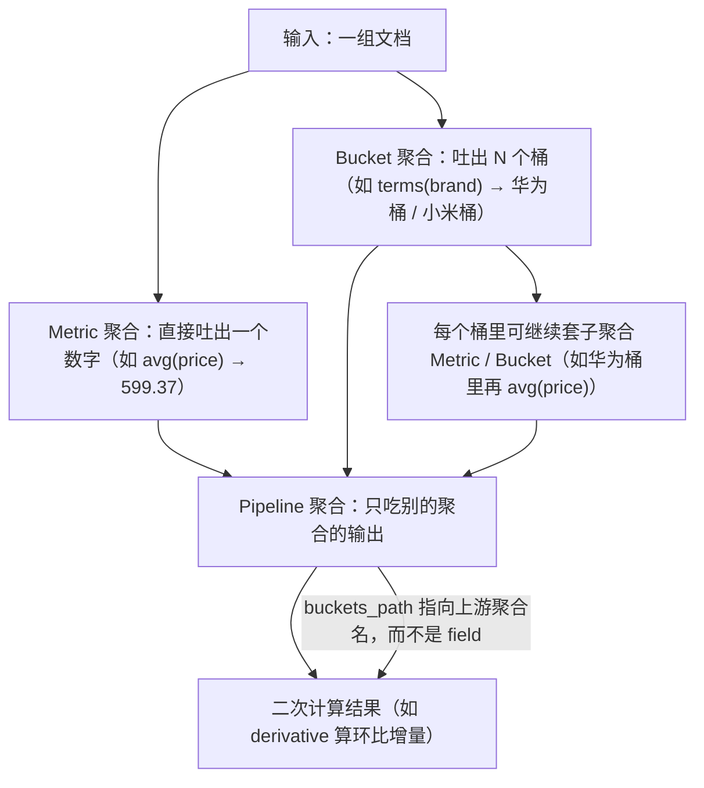

# 05 聚合分析 Aggregation

> 前四章你已经能把数据存进去、搜出来、排序高亮分页。但"搜索"只能回答"有哪些文档匹配"，回答不了"这批文档的**统计特征**是什么"——比如「按品牌分组各有多少商品、平均价格多少、价格分布长什么样」。这一章讲的就是这件事：**聚合（Aggregation）**，它是 ES 当"分析引擎"而不是"搜索引擎"的核心能力，也是 Kibana 看板、报表、Dashboard 的底層。

## 本篇要解决的问题

- 聚合到底是什么？和 SQL 的 `GROUP BY` 什么关系？
- 为什么有时候 terms 聚合的结果**数量和真实值对不上**（近似、不准）？
- `cardinality`（去重计数）为什么说它"不准"？`precision_threshold` 调的是什么？
- `histogram` 和 `date_histogram` 的 `calendar_interval` 与 `fixed_interval` 到底差在哪？时区坑在哪？
- 管道聚合（Pipeline）输入是别的聚合的输出，怎么串？
- **最致命的坑**：对 `text` 字段做 terms 聚合报 `Fielddata is disabled on text fields`，为什么？怎么解决？
- 聚合结果和查询结果怎么一起拿？`size=0` 是什么鬼？
- **Java 端怎么安全地从 `Aggregate` / `Buckets<T>` 这种嵌套类型里把值抠出来**（这是新手卡最久的地方）。

::: tip 本章约定
沿用第 04 章的 `products` 索引，并补充一个 `brand`（keyword）字段。本章所有示例都基于这个索引。字段清单：

| 字段 | 类型 | 说明 |
| --- | --- | --- |
| `title` | text（带 `.keyword` 子字段） | 商品标题，全文检索用 |
| `description` | text | 描述 |
| `price` | scaled_float | 价格 |
| `category` | keyword | 分类 |
| `brand` | keyword | **品牌**（本章用它分组） |
| `tags` | keyword[] | 标签数组 |
| `createdAt` | date | 上架时间 |
| `onSale` | boolean | 是否上架 |
| `reviews` | nested（author/rating/content） | 评论（嵌套，第 04 章讲过） |

如果本地没有 `products` 索引，先建一个（注意 `brand` 是 keyword）：

**Kibana Console**：
```json
PUT /products
{
  "mappings": {
    "properties": {
      "title":       { "type": "text",  "fields": { "keyword": { "type": "keyword", "ignore_above": 256 } } },
      "description": { "type": "text" },
      "price":       { "type": "scaled_float", "scaling_factor": 100 },
      "category":    { "type": "keyword" },
      "brand":       { "type": "keyword" },
      "tags":        { "type": "keyword" },
      "createdAt":   { "type": "date" },
      "onSale":      { "type": "boolean" },
      "reviews":     { "type": "nested", "properties": {
                        "author":  { "type": "keyword" },
                        "rating":  { "type": "integer" },
                        "content": { "type": "text" }
                      } }
    }
  }
}
```

**curl**：
```bash
curl -X PUT "http://localhost:9200/products" \
  -H "Content-Type: application/json" \
  -d '{
    "mappings": {
      "properties": {
        "title":       { "type": "text", "fields": { "keyword": { "type": "keyword", "ignore_above": 256 } } },
        "description": { "type": "text" },
        "price":       { "type": "scaled_float", "scaling_factor": 100 },
        "category":    { "type": "keyword" },
        "brand":       { "type": "keyword" },
        "tags":        { "type": "keyword" },
        "createdAt":   { "type": "date" },
        "onSale":      { "type": "boolean" },
        "reviews":     { "type": "nested", "properties": { "author": { "type": "keyword" }, "rating": { "type": "integer" }, "content": { "type": "text" } } }
      }
    }
  }'
```
:::

## 一、先搞懂：聚合到底是什么（GROUP BY 的升级版）

### 1.1 用 SQL 的 GROUP BY 来理解

如果你会 SQL，聚合几乎就是 `GROUP BY` 的亲戚。看这组对应关系：

```sql
-- SQL：按品牌分组，算每个品牌的平均价格、商品数
SELECT brand, AVG(price) AS avg_price, COUNT(*) AS cnt
FROM   products
WHERE  on_sale = true
GROUP  BY brand
ORDER  BY cnt DESC;
```

在 ES 里，等价的聚合请求长这样（先别管细节，感受结构）：

```json
GET /products/_search
{
  "size": 0,
  "query": { "term": { "onSale": true } },
  "aggs": {
    "by_brand": {
      "terms": { "field": "brand", "size": 10 },
      "aggs": {
        "avg_price": { "avg": { "field": "price" } }
      }
    }
  }
}
```

对应关系非常直白：

| SQL | ES 聚合 |
| --- | --- |
| `GROUP BY brand` | `terms` 桶聚合（按 `brand` 分桶） |
| `AVG(price)` | `avg` 指标聚合（算平均值） |
| `COUNT(*)` | 每个桶自带的 `doc_count` |
| `WHERE on_sale=true` | 请求里的 `query`（聚合前先过滤文档） |
| `ORDER BY cnt DESC` | terms 默认按 `doc_count` 降序 |

所以"聚合"两字，直白说就是：**先按某种规则把文档分组（分桶），再对每组算统计值，或者直接对全集算统计值**。

### 1.2 ES 聚合能做的、SQL 做不了的事

如果只是 GROUP BY，MySQL 也能干，要 ES 干嘛？关键区别在于两点（这也是你学聚合的真正理由）：

| 能力 | SQL `GROUP BY` | ES 聚合 |
| --- | --- | --- |
| 分组统计 | ✅ | ✅ |
| **嵌套/多层分组**（组内再分组） | 勉强（多列 GROUP BY） | ✅ 天然支持，任意层级 |
| **桶里再算指标、指标上再算指标**（Pipeline） | ❌ 要写子查询/窗口函数 | ✅ 管道聚合直接串 |
| **时间直方图**（按月/按天自动分桶） | 要 `DATE_FORMAT` + 各种拼接 | ✅ `date_histogram` 一行搞定 |
| **去重计数**（`COUNT(DISTINCT)`） | ✅ 但大数据量慢、需精确 | ✅ `cardinality` 近似、极快、可控精度 |
| **Top N 样本文档**（每组取 3 条代表） | ❌ | ✅ `top_hits` |
| **分布式近实时** | 依赖单库算力 | ✅ 天然分片并行 |

::: tip 一句话记忆
`query` 负责"**哪些文档参与统计**"，`aggs` 负责"**怎么统计这些文档**"。两者可以共存，互不影响。这就是聚合请求里常看到 `size: 0` 的原因——我们只要统计结果，不要原始文档。
:::

### 1.3 一个最小聚合请求，以及 `size=0` 的意义

```json
GET /products/_search
{
  "size": 0,
  "aggs": {
    "avg_price_all": { "avg": { "field": "price" } }
  }
}
```

逐个看：

- `"size": 0`：**不要返回任何命中的原始文档**，只要聚合结果。如果你不写，ES 会默认返回 `hits`（前 10 条），那是浪费带宽。聚合场景下几乎总是写 `size: 0`。
- `"aggs"`：聚合定义的容器（老文档里叫 `aggregations`，两者等价，`aggs` 是简写）。
- `"avg_price_all"`：你给这个聚合起的**名字**，后面取结果就靠它。名字完全自定义。
- `{ "avg": { "field": "price" } }`：聚合类型 + 参数。

返回（注意聚合结果在 `aggregations` 字段，和 `hits` 平级）：

```json
{
  "took": 3,
  "timed_out": false,
  "hits": { "total": { "value": 1000, "relation": "eq" }, "max_score": null, "hits": [] },
  "aggregations": {
    "avg_price_all": { "value": 599.37 }
  }
}
```

| 字段 | 含义 |
| --- | --- |
| `hits.hits` | 空数组，因为 `size: 0` |
| `hits.total.value` | 参与聚合的文档总数（1000 条） |
| `aggregations.avg_price_all.value` | 全局平均价格 599.37 |

**curl 版本**（聚合请求都是 POST 一个 JSON body 到 `_search`）：

```bash
curl -X POST "http://localhost:9200/products/_search" \
  -H "Content-Type: application/json" \
  -d '{ "size": 0, "aggs": { "avg_price_all": { "avg": { "field": "price" } } } }'
```

**Java（第 06 章才系统讲客户端，这里先给个完整例子建立体感）**：

```java
import co.elastic.clients.elasticsearch.ElasticsearchClient;
import co.elastic.clients.elasticsearch._types.aggregations.Aggregate;
import co.elastic.clients.elasticsearch._types.aggregations.AvgAggregate;
import co.elastic.clients.elasticsearch.core.SearchResponse;
import com.example.es.domain.Product;

import java.io.IOException;

/**
 * 计算全部商品的平均价格。
 * 和搜索一样，聚合也是发一个 _search 请求，只是 size=0 且带 aggs。
 */
public class AggDemo {

    private final ElasticsearchClient client;

    public AggDemo(ElasticsearchClient client) {
        this.client = client;
    }

    public double avgPriceAll() throws IOException {
        // 1) 发起聚合请求：size(0) 表示不取原始文档，只要聚合
        SearchResponse<Product> resp = client.search(s -> s
                .index("products")
                .size(0)
                // 2) aggs 用 .aggregations(name, aggBuilder) 挂上
                .aggregations("avg_price_all", a -> a.avg(av -> av.field("price")))
                , Product.class);

        // 3) 从 aggregations 里按名字取出结果。
        //    Aggregate 是个"标签联合类型"：必须调用和 DSL 对应的方法 .avg()
        //    才能拿到 AvgAggregate，再 .value() 取数值。
        Aggregate agg = resp.aggregations().get("avg_price_all");
        AvgAggregate avgAgg = agg.avg();
        return avgAgg.value();
    }
}
```

> 注意：上面 `SearchResponse<Product>` 写在代码围栏里是合法的。**围栏外（含标题）一律用反引号包住泛型**，例如 `SearchResponse<Product>`。VitePress 会把裸 `<Product>` 当 HTML 标签，导致构建失败。

## 二、三大类聚合与它们的关系

ES 聚合分三大类，理解"谁吃谁"是后面不晕的关键：

| 类别 | 中文 | 干什么 | 典型聚合 |
| --- | --- | --- | --- |
| **Metric（指标）** | 算数值 | 对一个文档集合算一个统计值（平均/求和/最大…） | `avg` `sum` `min` `max` `value_count` `cardinality` `stats` `extended_stats` `percentiles` `top_hits` |
| **Bucket（分桶）** | 分组 | 按规则把文档分成若干组（桶），每组是一个文档集合 | `terms` `range` `date_range` `histogram` `date_histogram` `filter` `filters` `missing` `nested` `reverse_nested` |
| **Pipeline（管道）** | 二次计算 | **输入是别的聚合的输出**，对聚合结果再算 | `derivative` `cumulative_sum` `moving_fn` `bucket_sort` `bucket_script` |

它们的关系用一张缩进图表示（这是新手最容易绕晕的地方）：



::: warning Pipeline 的本质区别
Metric 和 Bucket 的输入是**文档**（用 `field` 指定字段）；Pipeline 的输入是**聚合结果**（用 `buckets_path` 指定"上游聚合的名字"）。这是两者写法上最根本的分水岭——Pipeline 永远没有 `field`，只有 `buckets_path`。
:::

## 三、Metric 指标聚合（算数值）

Metric 聚合最简单：给个 `field`，吐一个数字（或一组数）。下面逐个讲，每个都给 **Kibana DSL + curl + Java** 三件套。

### 3.1 最基础的四个：avg / sum / min / max / value_count

`value_count` 是"数有多少个非空值"，和 `doc_count`（数文档数）不同——一个桶里可能有 3 条文档，但只有 2 条有 `price` 值，这时 `value_count(price)=2` 而 `doc_count=3`。

**Kibana Console**（一次把五个都算出来）：
```json
GET /products/_search
{
  "size": 0,
  "aggs": {
    "price_avg":   { "avg":   { "field": "price" } },
    "price_sum":   { "sum":   { "field": "price" } },
    "price_min":   { "min":   { "field": "price" } },
    "price_max":   { "max":   { "field": "price" } },
    "price_count": { "value_count": { "field": "price" } }
  }
}
```

**curl**：
```bash
curl -X POST "http://localhost:9200/products/_search" \
  -H "Content-Type: application/json" \
  -d '{
    "size": 0,
    "aggs": {
      "price_avg":   { "avg":   { "field": "price" } },
      "price_sum":   { "sum":   { "field": "price" } },
      "price_min":   { "min":   { "field": "price" } },
      "price_max":   { "max":   { "field": "price" } },
      "price_count": { "value_count": { "field": "price" } }
    }
  }'
```

**Java**（用 `.aggregations(name, aggBuilder)` 链式挂多个聚合）：
```java
import co.elastic.clients.elasticsearch._types.aggregations.Aggregate;
import co.elastic.clients.elasticsearch._types.aggregations.AvgAggregate;
import co.elastic.clients.elasticsearch._types.aggregations.SumAggregate;
import co.elastic.clients.elasticsearch._types.aggregations.MinAggregate;
import co.elastic.clients.elasticsearch._types.aggregations.MaxAggregate;
import co.elastic.clients.elasticsearch._types.aggregations.ValueCountAggregate;
import co.elastic.clients.elasticsearch.core.SearchResponse;
import com.example.es.domain.Product;

import java.io.IOException;

/** 一次算 avg/sum/min/max/value_count，演示如何从 Aggregate 联合类型里取各指标 */
public class MetricBasics {

    private final ElasticsearchClient client;

    public MetricBasics(ElasticsearchClient client) {
        this.client = client;
    }

    public void basics() throws IOException {
        SearchResponse<Product> resp = client.search(s -> s
                .index("products")
                .size(0)
                .aggregations("price_avg",   a -> a.avg(av -> av.field("price")))
                .aggregations("price_sum",   a -> a.sum(sm -> sm.field("price")))
                .aggregations("price_min",   a -> a.min(mn -> mn.field("price")))
                .aggregations("price_max",   a -> a.max(mx -> mx.field("price")))
                .aggregations("price_count", a -> a.valueCount(vc -> vc.field("price")))
                , Product.class);

        // 每个聚合按名字取出，再调用和 DSL 对应的方法：.avg()/.sum()/.min()/.max()/.valueCount()
        Aggregate agg = resp.aggregations().get("price_avg");
        double avg   = agg.avg().value();                          // AvgAggregate.value() -> double
        double sum   = resp.aggregations().get("price_sum").sum().value();       // SumAggregate
        double min   = resp.aggregations().get("price_min").min().value();       // MinAggregate
        double max   = resp.aggregations().get("price_max").max().value();       // MaxAggregate
        // value_count 返回的是"文档数"，是 long 而不是 double
        long   count = resp.aggregations().get("price_count").valueCount().value(); // ValueCountAggregate.value() -> long

        System.out.printf("avg=%.2f sum=%.2f min=%.2f max=%.2f count=%d%n",
                avg, sum, min, max, count);
    }
}
```

返回结构（节选）：
```json
"aggregations": {
  "price_avg":   { "value": 599.37 },
  "price_sum":   { "value": 599370.0 },
  "price_min":   { "value": 9.9 },
  "price_max":   { "value": 9999.0 },
  "price_count": { "value": 1000 }
}
```

### 3.2 cardinality：去重计数（重点：精度 vs 内存的权衡）

`cardinality` 等价于 SQL 的 `COUNT(DISTINCT field)`，用来算"某个字段有多少个**不重复**的值"。比如"店铺里有多少个不同的品牌"：

```json
GET /products/_search
{
  "size": 0,
  "aggs": {
    "brand_cardinality": { "cardinality": { "field": "brand" } }
  }
}
```

**为什么 cardinality 是"近似值"？** 这是它最反直觉、也最该讲透的地方。

要精确去重，ES 必须维护"已经见过的所有不同值"的集合。如果字段有几亿个不同值（比如 UserId），这个集合会巨大，内存直接爆。ES 的解决方案是 **HyperLogLog++ 算法**：用一小块固定大小的内存（哈希 + 概率计数）去"估算"基数，而不是精确存储。带来的代价是：

- **结果是有误差的近似值**（典型误差 1%~5%，视精度参数而定），不是精确值。
- 内存占用**固定且很小**，不会随不同值变多而爆炸。

**`precision_threshold` 调的是什么**：它在"精度"和"内存"之间调档。

| `precision_threshold` | 含义 | 代价 |
| --- | --- | --- |
| 不设置（默认 3000） | 阈值以下几乎精确，之上开始近似 | 适中 |
| 调小（如 100） | 更快、更省内存，但误差更大 | 低内存 |
| 调大（最大 40000） | 更精确（阈值内几乎准确），但内存上升 | 高内存 |

直觉：**`precision_threshold` 的意思是"在这个基数以内尽量算准"**。把它设成 100，表示"当不同品牌数 ≤ 100 时基本精确，超过就开始近似"。设得越大内存越费，但精度上限越高。生产里日志/用户量巨大时，常故意调小换取性能。

**带 precision_threshold 的 DSL + curl**：
```json
GET /products/_search
{
  "size": 0,
  "aggs": {
    "brand_cardinality": {
      "cardinality": { "field": "brand", "precision_threshold": 100 }
    }
  }
}
```
```bash
curl -X POST "http://localhost:9200/products/_search" \
  -H "Content-Type: application/json" \
  -d '{ "size": 0, "aggs": { "brand_cardinality": { "cardinality": { "field": "brand", "precision_threshold": 100 } } } }'
```

**Java**：
```java
import co.elastic.clients.elasticsearch._types.aggregations.Aggregate;
import co.elastic.clients.elasticsearch._types.aggregations.CardinalityAggregate;
import co.elastic.clients.elasticsearch.core.SearchResponse;
import com.example.es.domain.Product;

import java.io.IOException;

/** 去重计数：店铺有多少个不同品牌 */
public class CardinalityDemo {

    private final ElasticsearchClient client;

    public CardinalityDemo(ElasticsearchClient client) {
        this.client = client;
    }

    public long distinctBrands() throws IOException {
        SearchResponse<Product> resp = client.search(s -> s
                .index("products")
                .size(0)
                .aggregations("brand_cardinality", a -> a
                        .cardinality(c -> c
                                .field("brand")
                                .precisionThreshold(100)   // 100 以内尽量精确，省内存换近似
                        )
                )
                , Product.class);

        // cardinality 的 value() 返回 double（因为本质是估算值），转 long 即可
        Aggregate agg = resp.aggregations().get("brand_cardinality");
        CardinalityAggregate card = agg.cardinality();
        return (long) card.value();
    }
}
```

::: tip 什么时候用 cardinality
"UV 统计""不同 IP 数""不同设备数"这类**海量去重计数**场景，cardinality 是首选：它用一点点误差换来了内存可控和极快速度。如果你**必须精确**（比如对账），要么接受它做近似，要么把数据落到数据仓库用 `COUNT(DISTINCT)` 精确算。
:::

### 3.3 stats / extended_stats：一把梭把统计量都算出来

不想一个个写 `avg`/`sum`/`min`/`max`？`stats` 一次返回 `count`/`min`/`max`/`avg`/`sum` 五个；`extended_stats` 再多给 `sum_of_squares`/`variance`/`std_deviation`（标准差）等。

**DSL + curl**：
```json
GET /products/_search
{
  "size": 0,
  "aggs": {
    "price_stats":     { "stats":          { "field": "price" } },
    "price_ext_stats": { "extended_stats": { "field": "price" } }
  }
}
```
```bash
curl -X POST "http://localhost:9200/products/_search" \
  -H "Content-Type: application/json" \
  -d '{ "size": 0, "aggs": { "price_stats": { "stats": { "field": "price" } }, "price_ext_stats": { "extended_stats": { "field": "price" } } } }'
```

**返回**（节选）：
```json
"price_stats": {
  "count": 1000, "min": 9.9, "max": 9999.0, "avg": 599.37, "sum": 599370.0
},
"price_ext_stats": {
  "count": 1000, "min": 9.9, "max": 9999.0, "avg": 599.37, "sum": 599370.0,
  "sum_of_squares": 8.21E9, "variance": 1.12E6, "std_deviation": 1058.3,
  "std_deviation_bounds": { "upper": 2715.9, "lower": -1517.2 }
}
```

**Java**（注意 `stats` 和 `extended_stats` 的取值方法）：
```java
import co.elastic.clients.elasticsearch._types.aggregations.Aggregate;
import co.elastic.clients.elasticsearch._types.aggregations.StatsAggregate;
import co.elastic.clients.elasticsearch._types.aggregations.ExtendedStatsAggregate;
import co.elastic.clients.elasticsearch.core.SearchResponse;
import com.example.es.domain.Product;

import java.io.IOException;

/** stats 与 extended_stats */
public class StatsDemo {

    private final ElasticsearchClient client;

    public StatsDemo(ElasticsearchClient client) {
        this.client = client;
    }

    public void stats() throws IOException {
        SearchResponse<Product> resp = client.search(s -> s
                .index("products")
                .size(0)
                .aggregations("price_stats",     a -> a.stats(s -> s.field("price")))
                .aggregations("price_ext_stats", a -> a.extendedStats(e -> e.field("price")))
                , Product.class);

        // stats：count 是 long，其余是 double
        StatsAggregate stats = resp.aggregations().get("price_stats").stats();
        long   cnt   = stats.count();   // 文档数
        double avg   = stats.avg();
        double min   = stats.min();
        double max   = stats.max();
        double sum   = stats.sum();

        // extended_stats：多 stdDeviation / variance / sumOfSquares 等
        ExtendedStatsAggregate ext = resp.aggregations().get("price_ext_stats").extendedStats();
        double stdDev = ext.stdDeviation();   // 标准差
        double var    = ext.variance();

        System.out.printf("count=%d avg=%.2f stdDev=%.2f%n", cnt, avg, stdDev);
    }
}
```

### 3.4 percentiles / percentile_ranks：百分位

`percentiles` 回答"**第 P 百分位的值是多少**"——典型如"响应时间的 P95/P99"。`percentile_ranks` 反过来：给一个值，回答"它排在前百分之多少"。

**DSL + curl**（算价格的 1/50/99 分位）：
```json
GET /products/_search
{
  "size": 0,
  "aggs": {
    "price_percentiles": {
      "percentiles": { "field": "price", "percents": [1, 50, 99] }
    },
    "price_rank": {
      "percentile_ranks": { "field": "price", "values": [100, 1000] }
    }
  }
}
```
```bash
curl -X POST "http://localhost:9200/products/_search" \
  -H "Content-Type: application/json" \
  -d '{ "size": 0, "aggs": { "price_percentiles": { "percentiles": { "field": "price", "percents": [1, 50, 99] } }, "price_rank": { "percentile_ranks": { "field": "price", "values": [100, 1000] } } } }'
```

::: warning percents 不能重复
ES 8.x 起 `percentiles.percents` 里的值**必须唯一**，写重复的会报错（例如 `[50, 50]` 直接失败）。这是 8.0 的 breaking change。
:::

**Java**（从 `PercentilesAggregate` 取值；各分位以 `Map<key, value>` 形式返回，key 是分位字符串如 `"50.0"`）：
```java
import co.elastic.clients.elasticsearch._types.aggregations.Aggregate;
import co.elastic.clients.elasticsearch._types.aggregations.PercentilesAggregate;
import co.elastic.clients.elasticsearch.core.SearchResponse;
import com.example.es.domain.Product;

import java.io.IOException;
import java.util.Map;

/** 百分位聚合 */
public class PercentileDemo {

    private final ElasticsearchClient client;

    public PercentileDemo(ElasticsearchClient client) {
        this.client = client;
    }

    public void percentiles() throws IOException {
        SearchResponse<Product> resp = client.search(s -> s
                .index("products")
                .size(0)
                .aggregations("price_percentiles", a -> a
                        .percentiles(p -> p.field("price").percents(1.0, 50.0, 99.0)))
                , Product.class);

        // percentiles 返回 Map，key 是分位（字符串，如 "50.0"），value 是该分位的数值
        PercentilesAggregate pa = resp.aggregations().get("price_percentiles").percentiles();
        Map<String, Double> values = pa.values();
        System.out.println("P50 价格 = " + values.get("50.0"));
        System.out.println("P99 价格 = " + values.get("99.0"));
        // 具体取值方法（values() 的返回类型与键格式）以你所用版本官方文档为准：
        // https://www.elastic.co/guide/en/elasticsearch/client/java-api-client/current/search-aggregations.html
    }
}
```

### 3.5 top_hits：每个桶里取几条"样本文档"

`top_hits` 不算统计值，而是**在每个桶里返回按某种排序取的前 N 条原始文档**。比如"按品牌分组后，每个品牌取最贵的 3 件商品当封面"。它只能作为**子聚合**（挂在某个 Bucket 里面），不能独立用。

**DSL + curl**（按品牌分组，每组取价格最高的 1 件）：
```json
GET /products/_search
{
  "size": 0,
  "aggs": {
    "by_brand": {
      "terms": { "field": "brand", "size": 5 },
      "aggs": {
        "top_expensive": {
          "top_hits": { "size": 1, "sort": [ { "price": { "order": "desc" } } ], "_source": ["title", "price"] }
        }
      }
    }
  }
}
```
```bash
curl -X POST "http://localhost:9200/products/_search" \
  -H "Content-Type: application/json" \
  -d '{ "size": 0, "aggs": { "by_brand": { "terms": { "field": "brand", "size": 5 }, "aggs": { "top_expensive": { "top_hits": { "size": 1, "sort": [ { "price": { "order": "desc" } } ], "_source": ["title", "price"] } } } } } }'
```

**Java**（top_hits 的嵌套文档是原始 JSON，类型提取相对特殊，下面给出读取方式并标注注意点）：
```java
import co.elastic.clients.elasticsearch._types.aggregations.Aggregate;
import co.elastic.clients.elasticsearch._types.aggregations.StringTermsAggregate;
import co.elastic.clients.elasticsearch._types.aggregations.StringTermsBucket;
import co.elastic.clients.elasticsearch._types.aggregations.TopHitsAggregate;
import co.elastic.clients.elasticsearch.core.search.Hit;
import co.elastic.clients.elasticsearch.core.search.HitsMetadata;
import co.elastic.clients.json.JsonData;
import co.elastic.clients.elasticsearch.core.SearchResponse;
import com.example.es.domain.Product;

import java.io.IOException;
import java.util.List;

/** top_hits：每个品牌取最贵的 1 件 */
public class TopHitsDemo {

    private final ElasticsearchClient client;

    public TopHitsDemo(ElasticsearchClient client) {
        this.client = client;
    }

    public void topHits() throws IOException {
        SearchResponse<Product> resp = client.search(s -> s
                .index("products")
                .size(0)
                .aggregations("by_brand", a -> a
                        .terms(t -> t.field("brand").size(5))
                        .aggregations("top_expensive", sub -> sub
                                .topHits(th -> th
                                        .size(1)
                                        .sort(s -> s.field(f -> f.field("price").order(co.elastic.clients.elasticsearch._types.SortOrder.Desc)))
                                        .source(src -> src.filter(f -> f.includes(List.of("title", "price"))))
                                )
                        )
                )
                , Product.class);

        // 先拿到 terms 桶
        StringTermsAggregate terms = resp.aggregations().get("by_brand").sterms();
        for (StringTermsBucket bucket : terms.buckets().array()) {
            String brand = bucket.key().stringValue();
            // top_hits 在桶内的子聚合里，取出后 .topHits() 拿到 TopHitsAggregate
            TopHitsAggregate top = bucket.aggregations().get("top_expensive").topHits();
            // 嵌套命中文档的 source 是 JsonData（因为 top_hits 不绑定具体实体类型），按需取字段
            HitsMetadata<JsonData> hitsMeta = top.hits();
            for (Hit<JsonData> hit : hitsMeta.hits()) {
                JsonData source = hit.source();
                System.out.println(brand + " 最贵: " + source);
            }
        }
        // 注：top_hits 的 hits 类型提取（泛型绑定）以你所用版本官方文档为准；
        // 若想映射成 Product，可在外层 search 时指定目标类型，top_hits 仍按桶内返回。
    }
}
```

## 四、Bucket 分桶聚合（分组）

Bucket 聚合是"按规则把文档分组"。它输出的是一组**桶**，每个桶带 `doc_count`。

### 4.1 terms：最常用的分组（重点讲 size / shard_size / 近似 / order）

`terms` 就是 `GROUP BY field`，按字段的每个不同值分一个桶。

**DSL + curl**：
```json
GET /products/_search
{
  "size": 0,
  "aggs": {
    "by_brand": { "terms": { "field": "brand", "size": 10 } }
  }
}
```
```bash
curl -X POST "http://localhost:9200/products/_search" \
  -H "Content-Type: application/json" \
  -d '{ "size": 0, "aggs": { "by_brand": { "terms": { "field": "brand", "size": 10 } } } }'
```

**返回**（注意多了两个"误差"字段）：
```json
"aggregations": {
  "by_brand": {
    "doc_count_error_upper_bound": 0,
    "sum_other_doc_count": 23,
    "buckets": [
      { "key": "华为", "doc_count": 320 },
      { "key": "小米", "doc_count": 280 },
      { "key": "苹果", "doc_count": 210 }
    ]
  }
}
```

**为什么 terms 结果可能是"近似/不准"？**（这是 terms 最核心的坑）

ES 是分布式的，一个索引有多个分片（shard）。`terms` 要算"每个品牌的总数"，但**没有任何一个分片拥有全部数据**。它的做法是：

1. 协调节点向每个分片要"该分片上 top N 个品牌"。
2. 把各分片的 top N 合并、加总，得到最终结果。

问题来了：**某个品牌在全局排第 10，但它在单个分片里可能只排第 11，于是这个分片根本没把它上报**，合并时就漏了。这就是近似的来源。两个关键参数：

| 参数 | 作用 |
| --- | --- |
| `size` | 最终**返回**多少个桶（默认 10）。你要 Top 20 就设 20 |
| `shard_size` | 每个分片**本地先取**多少个桶再上报（默认 ≈ `size * 1.5 + 10`）。调大它能**提高准确性**，但更费资源 |

返回里两个字段的含义：

| 字段 | 含义 |
| --- | --- |
| `doc_count_error_upper_bound` | 每个桶的 `doc_count` **最多可能少算多少**。是 0 表示精确；非 0 表示是近似值 |
| `sum_other_doc_count` | 没进前 `size` 的桶，一共涵盖了多少文档（被归到"其它"里的） |

::: tip 想让 terms 更准怎么办
1. 调大 `shard_size`（比如设成 `size` 的 2~5 倍），漏报概率骤降。
2. 如果字段基数很小（如分类只有十几个），直接把 `size` 设成覆盖全部值，结果就是精确的。
3. 单分片索引（如本地 `index.number_of_replicas=0` 单分片）天然精确，无近似问题。
:::

**order 排序**：默认按 `doc_count` 降序（`_count`）。也能按 `_key`（字母/值序）或**按子聚合的值**排：

```json
GET /products/_search
{
  "size": 0,
  "aggs": {
    "by_brand": {
      "terms": {
        "field": "brand",
        "size": 10,
        "order": [ { "avg_price": "desc" } ]      // 按子聚合 avg_price 降序排
      },
      "aggs": { "avg_price": { "avg": { "field": "price" } } }
    }
  }
}
```

**Java**（terms 取值是聚合里最典型的"联合类型 + 桶列表"套路，务必看懂）：
```java
import co.elastic.clients.elasticsearch._types.aggregations.Aggregate;
import co.elastic.clients.elasticsearch._types.aggregations.StringTermsAggregate;
import co.elastic.clients.elasticsearch._types.aggregations.StringTermsBucket;
import co.elastic.clients.elasticsearch._types.aggregations.AvgAggregate;
import co.elastic.clients.elasticsearch._types.SortOrder;
import co.elastic.clients.elasticsearch.core.SearchResponse;
import co.elastic.clients.util.NamedValue;
import com.example.es.domain.Product;

import java.io.IOException;
import java.util.List;

/** terms 分组 + 子聚合 avg + 按子聚合排序 */
public class TermsDemo {

    private final ElasticsearchClient client;

    public TermsDemo(ElasticsearchClient client) {
        this.client = client;
    }

    public void byBrand() throws IOException {
        SearchResponse<Product> resp = client.search(s -> s
                .index("products")
                .size(0)
                .aggregations("by_brand", a -> a
                        .terms(t -> t
                                .field("brand")
                                .size(10)
                                // order 接收 List<NamedValue>，按子聚合 avg_price 降序
                                .order(List.of(NamedValue.of("avg_price", SortOrder.Desc)))
                        )
                        .aggregations("avg_price", sub -> sub.avg(av -> av.field("price")))
                )
                , Product.class);

        // 1) 按名字取出 Aggregate，调用 .sterms()（string terms）拿到 StringTermsAggregate
        //    ⚠️ 字段是 keyword 字符串 → 用 sterms；数值字段用 lterms/dterms，调错会抛异常
        StringTermsAggregate terms = resp.aggregations().get("by_brand").sterms();

        // 2) buckets().array() 拿到桶的 List
        for (StringTermsBucket bucket : terms.buckets().array()) {
            // 3) 桶的 key：对 keyword 是 FieldValue，用 .stringValue() 取字符串
            String brand = bucket.key().stringValue();
            long   count = bucket.docCount();           // 该品牌的文档数

            // 4) 子聚合在当前桶内：bucket.aggregations().get("名字") 再调对应方法
            Aggregate avgAgg = bucket.aggregations().get("avg_price");
            double avgPrice = avgAgg.avg().value();

            System.out.printf("%s: 共 %d 件, 均价 %.2f%n", brand, count, avgPrice);
        }
    }
}
```

### 4.2 range / date_range：按数值/时间区间分桶

`range` 按**数值**区间分桶（区间可重叠，一个文档可进多个桶）；`date_range` 是时间版，支持日期格式。

**DSL + curl**（价格三段分桶）：
```json
GET /products/_search
{
  "size": 0,
  "aggs": {
    "price_range": {
      "range": {
        "field": "price",
        "ranges": [
          { "to": 100 },
          { "from": 100, "to": 500 },
          { "from": 500 }
        ]
      }
    }
  }
}
```
```bash
curl -X POST "http://localhost:9200/products/_search" \
  -H "Content-Type: application/json" \
  -d '{ "size": 0, "aggs": { "price_range": { "range": { "field": "price", "ranges": [ { "to": 100 }, { "from": 100, "to": 500 }, { "from": 500 } ] } } } }'
```

**Java**（range 桶的 key 是区间描述，直接遍历 `buckets().array()`，每个桶有 `from/to/docCount`）：
```java
import co.elastic.clients.elasticsearch._types.aggregations.Aggregate;
import co.elastic.clients.elasticsearch._types.aggregations.RangeAggregate;
import co.elastic.clients.elasticsearch._types.aggregations.RangeBucket;
import co.elastic.clients.elasticsearch.core.SearchResponse;
import com.example.es.domain.Product;

import java.io.IOException;

/** 价格区间分桶 */
public class RangeDemo {

    private final ElasticsearchClient client;

    public RangeDemo(ElasticsearchClient client) {
        this.client = client;
    }

    public void priceRange() throws IOException {
        SearchResponse<Product> resp = client.search(s -> s
                .index("products")
                .size(0)
                .aggregations("price_range", a -> a
                        .range(r -> r.field("price").ranges(
                                rr -> rr.to(100.0),
                                rr -> rr.from(100.0).to(500.0),
                                rr -> rr.from(500.0)
                        ))
                )
                , Product.class);

        // range 聚合 → .range() 拿到 RangeAggregate
        RangeAggregate range = resp.aggregations().get("price_range").range();
        for (RangeBucket bucket : range.buckets().array()) {
            // 区间桶的 key 是 ES 自动生成的区间描述字符串，如 "*-100.0"
            String label = bucket.key();
            long   count = bucket.docCount();
            System.out.printf("%s: %d 件%n", label, count);
        }
    }
}
```

### 4.3 histogram / date_histogram（重点：calendar_interval vs fixed_interval + 时区坑）

`histogram` 按**固定步长的数值**分桶（如每 100 元一桶）；`date_histogram` 按**时间**分桶（每天/每月）。

**`calendar_interval` vs `fixed_interval`（极其重要，8.x 的坑）**：

| 参数 | 含义 | 例子 | 适用 |
| --- | --- | --- | --- |
| `calendar_interval` | **日历间隔**，按自然日历，长度会变 | `month`（1 月 31 天、2 月 28 天）、`week`、`year` | 人类理解的"月/年" |
| `fixed_interval` | **固定间隔**，长度是固定时长 | `30d`（永远 30 天）、`12h`、`90m` | 机器/统计口径，要稳定等长 |

::: danger 8.x 不能用 `interval` 了
老教程里 `date_histogram` 写 `"interval": "day"` 在 **8.0 起直接报错**。`interval` 被拆成了 `calendar_interval`（日历）和 `fixed_interval`（固定）两个明确参数。写时间直方图务必二选一，且语义要对——"按月统计"用 `calendar_interval: "month"`，"每 30 天统计"用 `fixed_interval: "30d"`。
:::

**时区坑**：`date_histogram` 默认按 **UTC** 分桶。如果你的数据是国内业务时间，"按天"在 UTC 下会在北京时间早上 8 点才翻桶，导致"今天"的数据跑到"昨天"的桶里。解决办法是显式指定 `time_zone`：

```json
GET /products/_search
{
  "size": 0,
  "aggs": {
    "per_month": {
      "date_histogram": {
        "field": "createdAt",
        "calendar_interval": "month",
        "format": "yyyy-MM",
        "time_zone": "Asia/Shanghai",
        "min_doc_count": 1
      }
    }
  }
}
```

**curl**：
```bash
curl -X POST "http://localhost:9200/products/_search" \
  -H "Content-Type: application/json" \
  -d '{ "size": 0, "aggs": { "per_month": { "date_histogram": { "field": "createdAt", "calendar_interval": "month", "format": "yyyy-MM", "time_zone": "Asia/Shanghai", "min_doc_count": 1 } } } }'
```

**Java**（date_histogram 桶的 key 是日期；用 `.keyAsString()` 取格式化字符串，或 `.key().longValue()` 取 epoch 毫秒）：
```java
import co.elastic.clients.elasticsearch._types.aggregations.Aggregate;
import co.elastic.clients.elasticsearch._types.aggregations.DateHistogramAggregate;
import co.elastic.clients.elasticsearch._types.aggregations.DateHistogramBucket;
import co.elastic.clients.elasticsearch._types.aggregations.CalendarInterval;
import co.elastic.clients.elasticsearch.core.SearchResponse;
import com.example.es.domain.Product;

import java.io.IOException;

/** 按月统计上架商品数（北京时间），演示 calendar_interval + time_zone */
public class DateHistogramDemo {

    private final ElasticsearchClient client;

    public DateHistogramDemo(ElasticsearchClient client) {
        this.client = client;
    }

    public void perMonth() throws IOException {
        SearchResponse<Product> resp = client.search(s -> s
                .index("products")
                .size(0)
                .aggregations("per_month", a -> a
                        .dateHistogram(dh -> dh
                                .field("createdAt")
                                .calendarInterval(CalendarInterval.Month)   // 日历月
                                .format("yyyy-MM")
                                .timeZone("Asia/Shanghai")                  // 关键：按北京时间分桶
                                .minDocCount(1)                             // 没有文档的月份不显示
                        )
                )
                , Product.class);

        // date_histogram → .dateHistogram() 拿到 DateHistogramAggregate
        DateHistogramAggregate dh = resp.aggregations().get("per_month").dateHistogram();
        for (DateHistogramBucket bucket : dh.buckets().array()) {
            String month = bucket.keyAsString();   // 格式化后的 "2026-01"
            long   count = bucket.docCount();
            System.out.printf("%s: %d 件上架%n", month, count);
        }
    }
}
```

### 4.4 filter / filters：把桶按过滤条件切分

`filter` 一个桶（满足某条件），`filters` 多个桶（每个桶一个条件，可重叠）。

**DSL + curl**（分别统计"上架中"和"单价<100"的商品数）：
```json
GET /products/_search
{
  "size": 0,
  "aggs": {
    "groups": {
      "filters": {
        "filters": {
          "on_sale":   { "term": { "onSale": true } },
          "cheap":     { "range": { "price": { "lt": 100 } } }
        }
      }
    }
  }
}
```
```bash
curl -X POST "http://localhost:9200/products/_search" \
  -H "Content-Type: application/json" \
  -d '{ "size": 0, "aggs": { "groups": { "filters": { "filters": { "on_sale": { "term": { "onSale": true } }, "cheap": { "range": { "price": { "lt": 100 } } } } } } } }'
```

**Java**（filters 桶用命名 key 取，遍历 `buckets().array()` 每个桶有 `key()` 和 `docCount()`）：
```java
import co.elastic.clients.elasticsearch._types.aggregations.Aggregate;
import co.elastic.clients.elasticsearch._types.aggregations.FiltersAggregate;
import co.elastic.clients.elasticsearch._types.aggregations.FiltersBucket;
import co.elastic.clients.elasticsearch.core.SearchResponse;
import com.example.es.domain.Product;

import java.io.IOException;

/** filters 多条件分桶 */
public class FiltersDemo {

    private final ElasticsearchClient client;

    public FiltersDemo(ElasticsearchClient client) {
        this.client = client;
    }

    public void filters() throws IOException {
        SearchResponse<Product> resp = client.search(s -> s
                .index("products")
                .size(0)
                .aggregations("groups", a -> a
                        .filters(f -> f.filters(
                                "on_sale", q -> q.term(t -> t.field("onSale").value(true)),
                                "cheap",   q -> q.range(r -> r.field("price").lt(JsonData.of(100.0)))
                        ))
                )
                , Product.class);

        FiltersAggregate fa = resp.aggregations().get("groups").filters();
        for (FiltersBucket bucket : fa.buckets().array()) {
            System.out.printf("%s: %d 件%n", bucket.key(), bucket.docCount());
        }
    }
}
```

### 4.5 missing：把"字段缺失"的文档单独分一桶

想统计"有多少商品没填品牌"，用 `missing`（注意：`exists` 是查询，`missing` 是聚合——8.x 里 `missing` 聚合保留）：

```json
GET /products/_search
{
  "size": 0,
  "aggs": {
    "no_brand": { "missing": { "field": "brand" } }
  }
}
```
```bash
curl -X POST "http://localhost:9200/products/_search" \
  -H "Content-Type: application/json" \
  -d '{ "size": 0, "aggs": { "no_brand": { "missing": { "field": "brand" } } } }'
```

**Java**：
```java
long noBrand = resp.aggregations().get("no_brand")   // 返回 LongValueAggregate
        .longValue().value();   // 缺失 brand 的文档数
```

### 4.6 nested / reverse_nested：对象数组与父子文档的聚合

第 04 章讲过 `reviews` 是 `nested` 对象数组。对嵌套字段做聚合**必须包 `nested`**，否则会丢失"作者=张三且评分=5"的关联。

**DSL + curl**（按评论的平均评分分桶——注意 `path` 指向 nested 字段，内层字段用 `reviews.rating`）：
```json
GET /products/_search
{
  "size": 0,
  "aggs": {
    "reviews_nested": {
      "nested": { "path": "reviews" },
      "aggs": {
        "avg_rating": { "avg": { "field": "reviews.rating" } }
      }
    }
  }
}
```
```bash
curl -X POST "http://localhost:9200/products/_search" \
  -H "Content-Type: application/json" \
  -d '{ "size": 0, "aggs": { "reviews_nested": { "nested": { "path": "reviews" }, "aggs": { "avg_rating": { "avg": { "field": "reviews.rating" } } } } } }'
```

`reverse_nested` 则相反：在 nested 聚合**内部**，想"回到外层文档"做聚合时用它（例如"按评论评分分桶后，再统计每个评分档对应多少件商品"）。具体用法以你所用版本官方文档为准：<https://www.elastic.co/guide/en/elasticsearch/reference/current/search-aggregations-bucket-reverse-nested-aggregation.html>

**Java**（nested 聚合 → `.nested()` 拿到 `NestedAggregate`，再取子聚合）：
```java
import co.elastic.clients.elasticsearch._types.aggregations.Aggregate;
import co.elastic.clients.elasticsearch._types.aggregations.NestedAggregate;
import co.elastic.clients.elasticsearch._types.aggregations.AvgAggregate;
import co.elastic.clients.elasticsearch.core.SearchResponse;
import com.example.es.domain.Product;

import java.io.IOException;

/** nested 字段聚合 */
public class NestedAggDemo {

    private final ElasticsearchClient client;

    public NestedAggDemo(ElasticsearchClient client) {
        this.client = client;
    }

    public void nestedAvgRating() throws IOException {
        SearchResponse<Product> resp = client.search(s -> s
                .index("products")
                .size(0)
                .aggregations("reviews_nested", a -> a
                        .nested(n -> n.path("reviews"))
                        .aggregations("avg_rating", sub -> sub.avg(av -> av.field("reviews.rating")))
                )
                , Product.class);

        NestedAggregate nested = resp.aggregations().get("reviews_nested").nested();
        double avgRating = nested.aggregations().get("avg_rating").avg().value();
        System.out.println("全站平均评论评分 = " + avgRating);
    }
}
```

## 五、Pipeline 管道聚合（吃别的聚合的输出）

回顾第二节：Pipeline 没有 `field`，只有 `buckets_path`（指向上游聚合的名字）。它必须挂在某个 Bucket 聚合**内部**，因为要先有桶、才有桶序列给它处理。

### 5.1 derivative：环比增量

算"相邻桶之间的差值"。常用于"每月销售额的增长量"。

**DSL + curl**（按月分桶 → 月销售额 sum → 环比 derivative）：
```json
GET /products/_search
{
  "size": 0,
  "aggs": {
    "per_month": {
      "date_histogram": { "field": "createdAt", "calendar_interval": "month", "format": "yyyy-MM", "time_zone": "Asia/Shanghai" },
      "aggs": {
        "monthly_sales": { "sum": { "field": "price" } },
        "sales_growth":  { "derivative": { "buckets_path": "monthly_sales" } }
      }
    }
  }
}
```
```bash
curl -X POST "http://localhost:9200/products/_search" \
  -H "Content-Type: application/json" \
  -d '{ "size": 0, "aggs": { "per_month": { "date_histogram": { "field": "createdAt", "calendar_interval": "month", "format": "yyyy-MM", "time_zone": "Asia/Shanghai" }, "aggs": { "monthly_sales": { "sum": { "field": "price" } }, "sales_growth": { "derivative": { "buckets_path": "monthly_sales" } } } } } }'
```

**Java**（derivative 的 `buckets_path` 用 `.single("上游聚合名")`）：
```java
import co.elastic.clients.elasticsearch._types.aggregations.Aggregate;
import co.elastic.clients.elasticsearch._types.aggregations.DateHistogramAggregate;
import co.elastic.clients.elasticsearch._types.aggregations.DateHistogramBucket;
import co.elastic.clients.elasticsearch._types.aggregations.DerivativeAggregate;
import co.elastic.clients.elasticsearch._types.aggregations.CalendarInterval;
import co.elastic.clients.elasticsearch.core.SearchResponse;
import com.example.es.domain.Product;

import java.io.IOException;

/** derivative 环比增量 */
public class DerivativeDemo {

    private final ElasticsearchClient client;

    public DerivativeDemo(ElasticsearchClient client) {
        this.client = client;
    }

    public void derivative() throws IOException {
        SearchResponse<Product> resp = client.search(s -> s
                .index("products")
                .size(0)
                .aggregations("per_month", a -> a
                        .dateHistogram(dh -> dh
                                .field("createdAt")
                                .calendarInterval(CalendarInterval.Month)
                                .format("yyyy-MM")
                                .timeZone("Asia/Shanghai"))
                        .aggregations("monthly_sales", sub -> sub.sum(sm -> sm.field("price")))
                        .aggregations("sales_growth", p -> p
                                .derivative(d -> d.bucketsPath(bp -> bp.single("monthly_sales"))))
                )
                , Product.class);

        DateHistogramAggregate dh = resp.aggregations().get("per_month").dateHistogram();
        for (DateHistogramBucket bucket : dh.buckets().array()) {
            double sales = bucket.aggregations().get("monthly_sales").sum().value();
            // 第一个桶没有"上一个桶"，derivative 会是 null，务必判空
            Aggregate growthAgg = bucket.aggregations().get("sales_growth");
            if (growthAgg.isDerivative()) {
                double growth = growthAgg.derivative().value();
                System.out.printf("%s 销售额=%.2f 环比增量=%.2f%n",
                        bucket.keyAsString(), sales, growth);
            }
        }
    }
}
```

### 5.2 cumulative_sum：累计求和（ running total）

把桶的值从左到右累加，得到"累计总额"。

**DSL + curl**：
```json
GET /products/_search
{
  "size": 0,
  "aggs": {
    "per_month": {
      "date_histogram": { "field": "createdAt", "calendar_interval": "month", "format": "yyyy-MM", "time_zone": "Asia/Shanghai" },
      "aggs": {
        "monthly_sales": { "sum": { "field": "price" } },
        "total_sales":   { "cumulative_sum": { "buckets_path": "monthly_sales" } }
      }
    }
  }
}
```

**Java**：
```java
// 在 per_month 内部再加一个子聚合：
.aggregations("total_sales", p -> p
        .cumulativeSum(cs -> cs.bucketsPath(bp -> bp.single("monthly_sales"))))

// 取值（桶内）：
double total = bucket.aggregations().get("total_sales").cumulativeSum().value();
```

### 5.3 moving_fn：移动平均（⚠️ moving_avg 在 8.0 已被移除！）

**这是很多老教程的坑**：ES 8.0 起 `moving_avg` 聚合**被正式移除**，改用 `moving_fn`（moving function）。`moving_fn` 不是给你一个固定算法，而是让你用一个 Painless 脚本在滑动窗口上算——内置了 `MovingFunctions.unweightedAvg(values)`（简单移动平均）、`linearWeightedAvg`、`ewma` 等。

**DSL + curl**（7 天移动平均）：
```json
GET /products/_search
{
  "size": 0,
  "aggs": {
    "per_day": {
      "date_histogram": { "field": "createdAt", "calendar_interval": "day", "format": "yyyy-MM-dd", "time_zone": "Asia/Shanghai" },
      "aggs": {
        "daily_sales": { "sum": { "field": "price" } },
        "ma_7": {
          "moving_fn": {
            "buckets_path": "daily_sales",
            "window": 7,
            "script": "MovingFunctions.unweightedAvg(values)"
          }
        }
      }
    }
  }
}
```
```bash
curl -X POST "http://localhost:9200/products/_search" \
  -H "Content-Type: application/json" \
  -d '{ "size": 0, "aggs": { "per_day": { "date_histogram": { "field": "createdAt", "calendar_interval": "day", "format": "yyyy-MM-dd", "time_zone": "Asia/Shanghai" }, "aggs": { "daily_sales": { "sum": { "field": "price" } }, "ma_7": { "moving_fn": { "buckets_path": "daily_sales", "window": 7, "script": "MovingFunctions.unweightedAvg(values)" } } } } } }'
```

::: danger 别再用 moving_avg
如果你照着旧博客写 `"moving_avg": {...}`，ES 8.x 会直接返回错误：**"unknown aggregation type [moving_avg]"**。8.x 一律用 `moving_fn`，并用 `script: "MovingFunctions.unweightedAvg(values)"` 指定算法。
:::

**Java**（`.movingFn(...)` 构建器：`bucketsPath` + `window` + `script.inline`）：
```java
import co.elastic.clients.elasticsearch._types.aggregations.Aggregate;
import co.elastic.clients.elasticsearch._types.aggregations.DateHistogramAggregate;
import co.elastic.clients.elasticsearch._types.aggregations.DateHistogramBucket;
import co.elastic.clients.elasticsearch._types.aggregations.MovingFunctionAggregate;
import co.elastic.clients.elasticsearch._types.aggregations.CalendarInterval;
import co.elastic.clients.elasticsearch.core.SearchResponse;
import com.example.es.domain.Product;

import java.io.IOException;

/** moving_fn 7 天移动平均 */
public class MovingFnDemo {

    private final ElasticsearchClient client;

    public MovingFnDemo(ElasticsearchClient client) {
        this.client = client;
    }

    public void movingFn() throws IOException {
        SearchResponse<Product> resp = client.search(s -> s
                .index("products")
                .size(0)
                .aggregations("per_day", a -> a
                        .dateHistogram(dh -> dh
                                .field("createdAt")
                                .calendarInterval(CalendarInterval.Day)
                                .format("yyyy-MM-dd")
                                .timeZone("Asia/Shanghai"))
                        .aggregations("daily_sales", sub -> sub.sum(sm -> sm.field("price")))
                        .aggregations("ma_7", p -> p
                                .movingFn(mf -> mf
                                        .bucketsPath(bp -> bp.single("daily_sales"))
                                        .window(7)
                                        .script(sc -> sc.inline(i -> i
                                                .lang("painless")
                                                .source("MovingFunctions.unweightedAvg(values)")))
                                )
                        )
                )
                , Product.class);

        DateHistogramAggregate dh = resp.aggregations().get("per_day").dateHistogram();
        for (DateHistogramBucket bucket : dh.buckets().array()) {
            Aggregate maAgg = bucket.aggregations().get("ma_7");
            // 窗口未满（前 6 天）时 moving_fn 可能无值，判空处理
            if (maAgg.isMovingFunction()) {
                double ma = maAgg.movingFunction().value();
                System.out.printf("%s 7日移动平均销售额=%.2f%n", bucket.keyAsString(), ma);
            }
        }
    }
}
```

### 5.4 bucket_sort：桶算完后再排序/截断

`bucket_sort` 在**所有桶和它们的子指标都算完之后**，对桶做排序或只保留 Top N。它常用来解决"`terms` 只能按 `doc_count` 或单指标排序"不够用的问题——比如"按平均价格降序，只取最贵的 5 个品牌"。

**DSL + curl**（先按品牌分桶+算均价，再按均价降序取前 5）：
```json
GET /products/_search
{
  "size": 0,
  "aggs": {
    "by_brand": {
      "terms": { "field": "brand", "size": 100 },
      "aggs": {
        "avg_price": { "avg": { "field": "price" } },
        "top_by_price": {
          "bucket_sort": {
            "sort": [ { "avg_price": { "order": "desc" } } ],
            "size": 5
          }
        }
      }
    }
  }
}
```

**Java**（`bucket_sort` 不产生可"取值"的新数字，它只重排/截断上游桶；排序字段用 `SortOptions` 指定）：
```java
import co.elastic.clients.elasticsearch._types.SortOrder;
import co.elastic.clients.elasticsearch._types.SortOptions;
import co.elastic.clients.elasticsearch._types.FieldSort;

// 在 by_brand 内部再加子聚合：
.aggregations("top_by_price", p -> p
        .bucketSort(bs -> bs
                .sort(SortOptions.of(so -> so
                        .metric(m -> m.field("avg_price").order(SortOrder.Desc))))
                .size(5)))

// 注意：bucket_sort 只是改变 by_brand 桶的顺序和数量，
// 取值仍遍历 by_brand.sterms().buckets().array()，此时已经只剩排序后的前 5 个。
// 排序字段（metric sort 的写法）以你所用版本官方文档为准：
// https://www.elastic.co/guide/en/elasticsearch/reference/current/search-aggregations-pipeline-bucket-sort-aggregation.html
```

### 5.5 bucket_script：在多个聚合之间做算术

`bucket_script` 让你用 Painless 脚本把**多个兄弟聚合**算成一个新值。典型场景：转化率 = 完成订单数 / 总订单数 × 100。

**DSL + curl**（每个品牌算"均价 / 全局均价"的倍数）：
```json
GET /products/_search
{
  "size": 0,
  "aggs": {
    "by_brand": {
      "terms": { "field": "brand", "size": 10 },
      "aggs": {
        "avg_price": { "avg": { "field": "price" } },
        "price_ratio": {
          "bucket_script": {
            "buckets_path": { "brand_avg": "avg_price", "global_avg": "global_avg_price" },
            "script": "params.brand_avg / params.global_avg"
          }
        }
      }
    },
    "global_avg_price": { "avg": { "field": "price" } }
  }
}
```

**Java**（`buckets_path` 用 `.put(变量名, 上游聚合名)` 建立"脚本变量 → 聚合"的映射）：
```java
import co.elastic.clients.elasticsearch._types.aggregations.Aggregate;
import co.elastic.clients.elasticsearch._types.aggregations.StringTermsAggregate;
import co.elastic.clients.elasticsearch._types.aggregations.StringTermsBucket;
import co.elastic.clients.elasticsearch._types.aggregations.BucketScriptAggregate;
import co.elastic.clients.elasticsearch.core.SearchResponse;
import com.example.es.domain.Product;

import java.io.IOException;

/** bucket_script：品牌均价 / 全局均价 */
public class BucketScriptDemo {

    private final ElasticsearchClient client;

    public BucketScriptDemo(ElasticsearchClient client) {
        this.client = client;
    }

    public void bucketScript() throws IOException {
        SearchResponse<Product> resp = client.search(s -> s
                .index("products")
                .size(0)
                // 全局均价（和 by_brand 平级）
                .aggregations("global_avg_price", a -> a.avg(av -> av.field("price")))
                .aggregations("by_brand", a -> a
                        .terms(t -> t.field("brand").size(10))
                        .aggregations("avg_price", sub -> sub.avg(av -> av.field("price")))
                        .aggregations("price_ratio", p -> p
                                .bucketScript(bs -> bs
                                        // variables：脚本里 params.brand_avg / params.global_avg 对应这两个聚合
                                        .bucketsPath(bp -> bp
                                                .put("brand_avg", "avg_price")
                                                .put("global_avg", "global_avg_price"))
                                        .script(sc -> sc.inline(i -> i
                                                .lang("painless")
                                                .source("params.brand_avg / params.global_avg")))
                                )
                        )
                )
                , Product.class);

        double globalAvg = resp.aggregations().get("global_avg_price").avg().value();
        StringTermsAggregate terms = resp.aggregations().get("by_brand").sterms();
        for (StringTermsBucket bucket : terms.buckets().array()) {
            double ratio = bucket.aggregations().get("price_ratio").bucketScript().value();
            System.out.printf("%s 均价是全局的 %.2f 倍%n", bucket.key().stringValue(), ratio);
        }
    }
}
```

## 六、最重要的坑：聚合字段必须是 keyword（不能对 text 做 terms）

这是初学者**必踩一次**的错。你对 `title`（text）做 `terms` 聚合：

```json
GET /products/_search
{
  "size": 0,
  "aggs": { "by_title": { "terms": { "field": "title" } } }
}
```

ES 会报：
```json
"error": {
  "type": "search_phase_execution_exception",
  "reason": "... Fielddata is disabled on text fields by default ..."
}
```

### 6.1 为什么会这样

- `text` 字段在写入时被**分词**了（"华为手机" → `华为` / `手机` 两个词项），倒排索引里存的是"词项 → 文档"的映射。
- `terms` 聚合需要"字段原始值 → 文档"的映射（要按**整个值**分桶），但 `text` 字段根本没有"原始值"这层结构。
- ES 早期（5.x 前）允许用 **Fielddata**（把文本在内存里重新构建正向索引）来做，但这会吞掉海量堆内存，所以**默认关闭**，并让你显式报错而不是悄悄 OOM。

一句话：**`terms`/`range`/`date_histogram` 等的分组字段，必须是"不分词、有完整原始值"的类型**——也就是 `keyword`，或者数值/日期/布尔。

### 6.2 三种解决方案（按推荐度排序）

**方案 ①（最推荐）：用 keyword 子字段。** 建 mapping 时给 text 字段加一个 `.keyword` 子字段（我们 `products.title` 已经这么做了），聚合打 `title.keyword`：

```json
GET /products/_search
{
  "size": 0,
  "aggs": { "by_title": { "terms": { "field": "title.keyword" } } }
}
```

**方案 ②（仅调试/一次性）：开启 fielddata。** 对 text 字段显式开启，让 ES 在内存里建正向索引。**生产不推荐**（吃内存、慢）：

```json
PUT /products/_mapping
{
  "properties": {
    "title": { "type": "text", "fielddata": true }
  }
}
```
开启后 `terms` 打 `title` 就能跑，但每次聚合都要现场加载 Fielddata 到堆内存，大字段极易 OOM。

**方案 ③（根治）：字段本身就是 keyword 类型。** 如果这个字段你从来不需要分词全文检索，只用来分组/精确匹配（如 `brand`、`category`），建 mapping 时直接设成 `keyword`。我们 `products` 的 `brand` 就是这么干的，所以 `terms` 打 `brand` 永远没问题。

::: tip 选型口诀
"要全文检索 → text；要分组/排序/精确匹配 → keyword。"需要两者都要，就 text + `.keyword` 子字段（最常用）。第 03 章 mapping 设计时就该想清楚，别等聚合报错才改。
:::

## 七、综合实战：电商商品聚合（按品牌分组 → 算均价 → 按价格区间二次分桶）

把前面串起来。需求：**"按品牌分组，每组算平均价格，并在组内再按价格区间（<100 / 100~500 / >500）分桶，统计各价格档的商品数。"**

**DSL + curl**：
```json
GET /products/_search
{
  "size": 0,
  "aggs": {
    "by_brand": {
      "terms": { "field": "brand", "size": 10, "shard_size": 50 },
      "aggs": {
        "avg_price": { "avg": { "field": "price" } },
        "price_tiers": {
          "range": {
            "field": "price",
            "ranges": [
              { "to": 100 },
              { "from": 100, "to": 500 },
              { "from": 500 }
            ]
          }
        }
      }
    }
  }
}
```
```bash
curl -X POST "http://localhost:9200/products/_search" \
  -H "Content-Type: application/json" \
  -d '{ "size": 0, "aggs": { "by_brand": { "terms": { "field": "brand", "size": 10, "shard_size": 50 }, "aggs": { "avg_price": { "avg": { "field": "price" } }, "price_tiers": { "range": { "field": "price", "ranges": [ { "to": 100 }, { "from": 100, "to": 500 }, { "from": 500 } ] } } } } } }'
```

**返回**（缩进展示层级）：
```json
"aggregations": {
  "by_brand": {
    "doc_count_error_upper_bound": 0,
    "sum_other_doc_count": 0,
    "buckets": [
      {
        "key": "华为",
        "doc_count": 320,
        "avg_price": { "value": 1899.5 },
        "price_tiers": {
          "buckets": [
            { "key": "*-100.0",     "to": 100.0,  "doc_count": 12 },
            { "key": "100.0-500.0", "from": 100.0, "to": 500.0, "doc_count": 45 },
            { "key": "500.0-*",     "from": 500.0, "doc_count": 263 }
          ]
        }
      },
      { "key": "小米", "doc_count": 280, "avg_price": { "value": 699.0 }, "price_tiers": { "buckets": [ ... ] } }
    ]
  }
}
```

**Java（完整的嵌套取值，这是本章的"收口"示例）**：
```java
import co.elastic.clients.elasticsearch._types.aggregations.Aggregate;
import co.elastic.clients.elasticsearch._types.aggregations.StringTermsAggregate;
import co.elastic.clients.elasticsearch._types.aggregations.StringTermsBucket;
import co.elastic.clients.elasticsearch._types.aggregations.AvgAggregate;
import co.elastic.clients.elasticsearch._types.aggregations.RangeAggregate;
import co.elastic.clients.elasticsearch._types.aggregations.RangeBucket;
import co.elastic.clients.elasticsearch.core.SearchResponse;
import com.example.es.domain.Product;

import java.io.IOException;
import java.util.ArrayList;
import java.util.List;

/** 电商商品聚合：按品牌分组 → 均价 → 组内价格区间二次分桶 */
public class ProductAggService {

    private final ElasticsearchClient client;

    public ProductAggService(ElasticsearchClient client) {
        this.client = client;
    }

    /** 返回结构：每个品牌一条记录 */
    public List<BrandStat> brandStats() throws IOException {
        SearchResponse<Product> resp = client.search(s -> s
                .index("products")
                .size(0)
                .aggregations("by_brand", a -> a
                        // 一级分桶：按品牌。shard_size 调大提高准确性
                        .terms(t -> t.field("brand").size(10).shardSize(50))
                        .aggregations("avg_price", sub -> sub.avg(av -> av.field("price")))
                        // 二级分桶（子聚合）：组内按价格区间
                        .aggregations("price_tiers", sub -> sub
                                .range(r -> r.field("price").ranges(
                                        rr -> rr.to(100.0),
                                        rr -> rr.from(100.0).to(500.0),
                                        rr -> rr.from(500.0)
                                ))
                        )
                )
                , Product.class);

        List<BrandStat> result = new ArrayList<>();

        // 第一层：terms 桶（StringTermsAggregate）
        StringTermsAggregate terms = resp.aggregations().get("by_brand").sterms();
        for (StringTermsBucket brandBucket : terms.buckets().array()) {
            String brand = brandBucket.key().stringValue();          // 品牌名（keyword → stringValue）
            long   count = brandBucket.docCount();                   // 该品牌商品数

            // 第一层的子聚合 avg_price
            double avgPrice = brandBucket.aggregations().get("avg_price").avg().value();

            // 第二层：price_tiers 是 range 聚合 → RangeAggregate
            RangeAggregate tiers = brandBucket.aggregations().get("price_tiers").range();
            long cheap = 0, mid = 0, expensive = 0;
            for (RangeBucket tier : tiers.buckets().array()) {
                long c = tier.docCount();
                // 用区间的 from/to 区分三档（null 表示该侧无界）
                if (tier.to() != null && tier.from() == null)       cheap = c;
                else if (tier.from() != null && tier.to() != null)   mid = c;
                else if (tier.from() != null && tier.to() == null)   expensive = c;
            }

            result.add(new BrandStat(brand, count, avgPrice, cheap, mid, expensive));
        }
        return result;
    }

    /** 简单的传输对象，承载一条品牌统计结果 */
    public record BrandStat(String brand, long count, double avgPrice,
                            long cheap, long mid, long expensive) {}
}
```

::: tip 嵌套取值的"通关口诀"
1. 用 `resp.aggregations().get("名字")` 拿到 `Aggregate`（标签联合类型）。
2. 调用**和 DSL 类型对应的方法**：terms→`.sterms()`、range→`.range()`、date_histogram→`.dateHistogram()`、avg→`.avg()`……**调错方法会抛 `IllegalStateException`**。
3. Bucket 聚合用 `.buckets().array()` 拿 `List`；每个桶用 `.docCount()` 拿数量、`.key()` 拿桶名、`.aggregations().get("子名")` 拿子聚合，继续回到第 1 步。
4. keyword 桶的 key 用 `.stringValue()`；数值桶用 `.longValue()`/`.intValue()`；日期桶用 `.keyAsString()`。
:::

## 八、Java 取值安全指南（`Buckets<T>` / `Aggregate` 通关）

新客户端的聚合结果类型是**强类型但带标签的联合类型**，这是它比旧 `RestHighLevelClient`（一堆强制转型）安全的地方，也是新手卡住的地方。集中讲一遍：

### 8.1 Aggregate 是个"标签联合"

`Aggregate` 内部用 `_kind` 标记自己到底是哪种聚合。你**必须**调用与 DSL 中聚合类型对应的访问方法，否则抛异常：

| DSL 聚合类型 | Java 访问方法 | 返回值类型 |
| --- | --- | --- |
| `terms`（字符串字段） | `.sterms()` | `StringTermsAggregate` |
| `terms`（长整数字段） | `.lterms()` | `LongTermsAggregate` |
| `terms`（双精度字段） | `.dterms()` | `DoubleTermsAggregate` |
| `range` / `date_range` | `.range()` | `RangeAggregate` |
| `date_histogram` | `.dateHistogram()` | `DateHistogramAggregate` |
| `histogram` | `.histogram()` | `HistogramAggregate` |
| `filter` | `.filter()` | `FilterAggregate` |
| `filters` | `.filters()` | `FiltersAggregate` |
| `nested` | `.nested()` | `NestedAggregate` |
| `avg` / `sum` / `min` / `max` | `.avg()` / `.sum()` / `.min()` / `.max()` | 各自 `XxxAggregate` |
| `value_count` | `.valueCount()` | `ValueCountAggregate` |
| `cardinality` | `.cardinality()` | `CardinalityAggregate` |
| `stats` | `.stats()` | `StatsAggregate` |
| `extended_stats` | `.extendedStats()` | `ExtendedStatsAggregate` |
| `percentiles` | `.percentiles()` | `PercentilesAggregate` |
| `top_hits` | `.topHits()` | `TopHitsAggregate` |
| `derivative` | `.derivative()` | `DerivativeAggregate` |
| `cumulative_sum` | `.cumulativeSum()` | `CumulativeSumAggregate` |
| `moving_fn` | `.movingFunction()` | `MovingFunctionAggregate` |
| `bucket_sort` | `.bucketSort()` | `BucketSortAggregate` |
| `bucket_script` | `.bucketScript()` | `BucketScriptAggregate` |

### 8.2 `Buckets<T>` 与桶遍历

每个 Bucket 聚合的 `.buckets()` 返回 `Buckets<T>`，`T` 是具体桶类型（`StringTermsBucket` / `RangeBucket` / `DateHistogramBucket` …）。取值统一用 `.array()` 拿到 `List<T>`，再 for 循环。

```java
// 通用遍历骨架
StringTermsAggregate terms = agg.sterms();
for (StringTermsBucket bucket : terms.buckets().array()) {
    FieldValue key = bucket.key();     // 桶的 key（FieldValue，按类型取）
    long docCount  = bucket.docCount(); // 该桶文档数
}
```

### 8.3 桶的 key 怎么取

`bucket.key()` 返回的是 `FieldValue`，要按字段类型取：

| 桶字段类型 | 取 key 的方法 |
| --- | --- |
| keyword / ip | `bucket.key().stringValue()` |
| 整数（integer/long） | `bucket.key().longValue()` 或 `.intValue()` |
| 浮点（double/float） | `bucket.key().doubleValue()` |
| 日期（date_histogram） | `bucket.keyAsString()` 或 `bucket.key().longValue()`（epoch 毫秒） |
| 范围（range） | `bucket.key()` 是区间描述字符串；用 `bucket.from()` / `bucket.to()` 取边界 |

### 8.4 常见报错与排查

| 现象 | 原因 | 解决 |
| --- | --- | --- |
| `IllegalStateException: ... is not a ...Aggregate` | 调错了访问方法（如对 terms 调了 `.avg()`） | 对照 8.1 表，用对方法 |
| `NullPointerException` 在 `bucket.aggregations().get(...)` | 子聚合名字拼错或不存在 | 检查 DSL 里子聚合的 `name` 是否一致 |
| derivative / moving_fn 第一个桶为 null | 没有"上一个桶"可算 | 取值前判空（如 `agg.isDerivative()`） |
| `Fielddata is disabled on text fields` | 对 text 字段做分组/排序 | 改用 `.keyword` 子字段或把字段设成 keyword |

::: danger 不要猜方法名
`Aggregate` 的方法很多，但每个都严格对应一种聚合。**写代码时以你所用版本的官方 Javadoc 为准**（8.18 示例：<https://artifacts.elastic.co/javadoc/co/elastic/clients/elasticsearch-java/8.18.0/co/elastic/clients/elasticsearch/_types/aggregations/package-summary.html>）。本表覆盖 95% 场景，剩余冷门聚合（如 `geo_distance`、`composite`、`matrix_stats`）以官方文档为准。
:::

## 本篇小结

- **聚合 = 分组（Bucket）+ 算值（Metric）+ 二次计算（Pipeline）**，类比 SQL 的 `GROUP BY`，但支持嵌套分组、管道串联、时间直方图、近似去重等 SQL 难做的事。
- **`size=0`** 表示只拿聚合结果、不取原始文档；聚合和查询可共存：`query` 决定"哪些文档参与"，`aggs` 决定"怎么统计"。
- **Metric**：`avg/sum/min/max/value_count` 最基础；`cardinality` 是**近似值**（HyperLogLog++），用 `precision_threshold` 在精度与内存间权衡；`stats/extended_stats` 一把梭；`percentiles` 算分位（注意 `percents` 不能重复）；`top_hits` 取桶内样本文档。
- **Bucket**：`terms` 最常用，要懂 `size`/`shard_size` 和"分布式近似"（看 `doc_count_error_upper_bound`）；`range`/`date_range` 按区间；`histogram`/`date_histogram` 注意 `calendar_interval`（日历，会变长）vs `fixed_interval`（固定时长），并设 `time_zone` 避坑；`filter`/`filters`/`missing`/`nested`/`reverse_nested` 各有场景。
- **Pipeline 没有 `field`，只有 `buckets_path`**，吃别的聚合的输出：`derivative`（环比）、`cumulative_sum`（累计）、`moving_fn`（移动平均，**`moving_avg` 在 8.0 已移除**）、`bucket_sort`（排后再截断）、`bucket_script`（多指标算术）。
- **最致命的坑**：分组字段必须是 `keyword`（或数值/日期/布尔），对 `text` 做 terms 会报 `Fielddata is disabled`。三种解法：用 `.keyword` 子字段（推荐）/ 开 fielddata（调试）/ 字段直接设 keyword。
- **Java 取值通关**：`Aggregate` 是标签联合，调对应方法（`.sterms()`/`.avg()`…），Bucket 用 `.buckets().array()` 遍历，桶 key 按类型用 `.stringValue()`/`.longValue()`/`.keyAsString()`。

## 参考链接

- 聚合总览：<https://www.elastic.co/guide/en/elasticsearch/reference/current/search-aggregations.html>
- Metric 聚合：<https://www.elastic.co/guide/en/elasticsearch/reference/current/search-aggregations-metrics.html>
- Bucket 聚合：<https://www.elastic.co/guide/en/elasticsearch/reference/current/search-aggregations-bucket.html>
- Pipeline 聚合：<https://www.elastic.co/guide/en/elasticsearch/reference/current/search-aggregations-pipeline.html>
- cardinality 精度：<https://www.elastic.co/guide/en/elasticsearch/reference/current/search-aggregations-metrics-cardinality-aggregation.html>
- date_histogram 间隔：<https://www.elastic.co/guide/en/elasticsearch/reference/current/search-aggregations-bucket-datehistogram-aggregation.html>
- moving_fn（moving_avg 已移除）：<https://www.elastic.co/guide/en/elasticsearch/reference/current/search-aggregations-pipeline-movfn-aggregation.html>
- 官方 Java Client 聚合 Javadoc：<https://artifacts.elastic.co/javadoc/co/elastic/clients/elasticsearch-java/8.18.0/co/elastic/clients/elasticsearch/_types/aggregations/package-summary.html>
- 官方 Java Client 文档：<https://www.elastic.co/guide/en/elasticsearch/client/java-api-client/current/search-aggregations.html>

下一篇 → [06 官方 Java Client 实战](/java/middleware/es/java-client)
