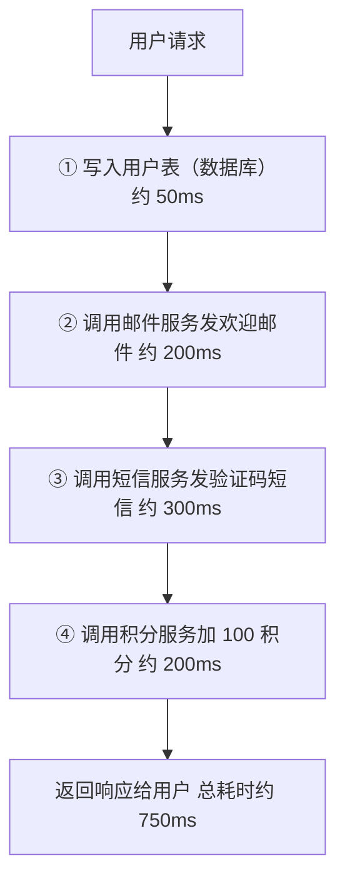
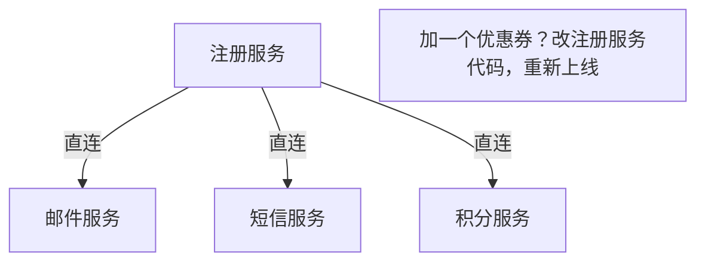
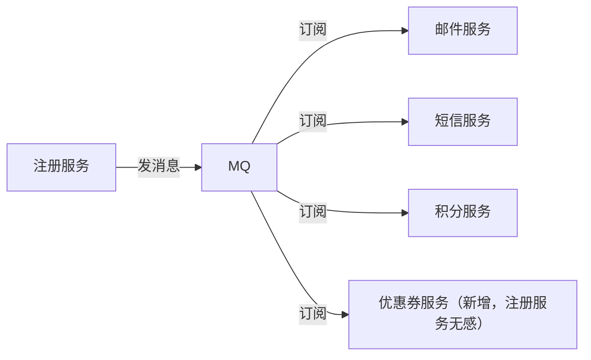
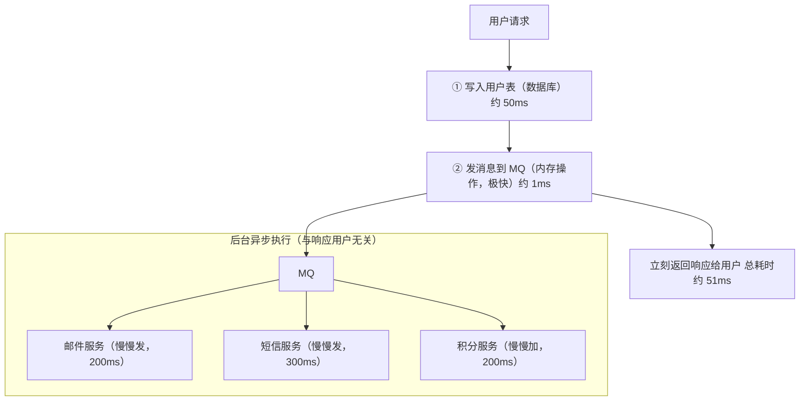
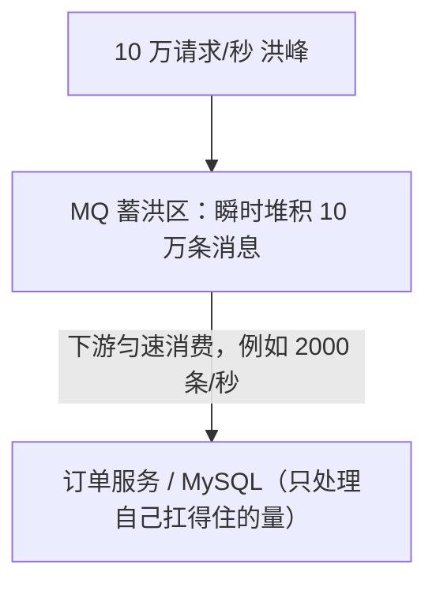
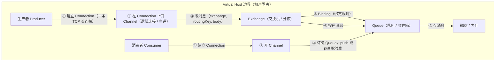
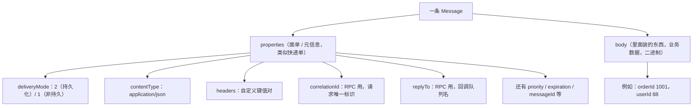

# 01 MQ 入门与环境搭建

> 本篇写给"第一次听说 MQ"的同学：先把"为什么需要 MQ、MQ 是什么、怎么把它跑起来、怎么用 Java 连上它发出第一条消息"这四件事彻底讲透。环境搭好之后，后面 02~0x 每一章的示例都基于这一篇搭出来的同一套 RabbitMQ，所以这篇请你跟着亲手跑一遍，别只看不练。

## 本篇要解决的问题

很多同学第一次接触消息队列（Message Queue，下文简称 MQ），脑子是一团浆糊：

- 公司里"下单之后发短信""改了数据同步到 ES"这些事，为什么不直接在代码里调一下接口？
- MQ 到底解决了什么痛点？它和直接 `new RestTemplate().postForObject(...)` 调接口有啥区别？
- RabbitMQ、RocketMQ、Kafka 这么多，我该学哪个？
- 本地怎么跑？Docker 一堆配置看不懂
- 容器反复重启、端口连不上、guest 用户登不进，怎么排查
- 用 Spring Boot / 原生 Java 怎么连上它，发出第一条消息

这一篇逐个解决。读完你应该能在自己机器上：

1. 用 Docker 跑起一个带管理界面的 RabbitMQ 4.x
2. 在 Management 网页上手动发一条、收一条消息
3. 用原生 `amqp-client` 写一个小程序，发出第一条消息并消费掉

## 一、为什么需要 MQ：同步调用的痛

先讲一个你一定见过的场景——**用户注册**。

### 1.1 全同步链路：一步卡住，步步卡住

假设"注册成功"后，你的系统还要顺手做四件事：把用户信息写进数据库、发一封欢迎邮件、发一条注册短信、给用户加 100 积分。最朴素的写法就是"一条线串到底"：



在这条链路里，**每一步都要等上一步彻底完成才能开始**。邮件服务慢了 200ms，短信服务就得多等 200ms；短信服务挂了，积分服务根本没机会执行，连"注册成功"的响应都给不出去。

这会带来三个典型的痛：

- **响应慢**：用户注册要干等 750ms，体验很差。
- **连锁故障**：邮件服务挂了，整个注册接口 500，用户根本注册不了——只是想发封邮件而已，至于吗？
- **牵一发动全身**：哪天产品说"注册完送张优惠券吧"，你就得回头改注册代码、重新上线注册服务。注册服务和优惠券服务被**焊死**在了一起。

MQ 就是来拆掉这根"焊死的铁链"的。

### 1.2 三大核心作用

引入 MQ 之后，注册服务只做一件事——把用户写进数据库，然后把"用户注册了"这条**消息**丢进 MQ，立刻返回。邮件、短信、积分、优惠券各自从 MQ 里取消息，自己慢慢干。下面逐个讲。

#### （1）解耦：你不用认识我，写信给邮局就行

没有 MQ 时，注册服务要直接认识邮件服务、短信服务、积分服务……每加一个下游，注册代码就改一次。这叫**强耦合**。

有了 MQ，注册服务只需要把消息交给 MQ，至于"谁关心这条消息"，注册服务完全不知道、也不需要知道。想加一个"送优惠券"，只要让优惠券服务去订阅同一类消息即可，**注册服务的代码一行都不用动**。





::: tip 一句话记住"解耦"
注册服务像在公司前台放了一个"公共收件箱"（MQ）。谁关心"有人注册了"这件事，谁自己去看收件箱。前台（注册服务）不认识任何看信的人。
:::

#### （2）异步提速：核心流程先返回，杂活后台跑

注册服务的"核心职责"只是把用户写进库。邮件、短信、积分都是**锦上添花**，用户没必要等它们。

把写库之后的三件事丢给 MQ，注册服务写完库就返回，响应时间从 750ms 直接降到 50ms：



这就是"异步提速"：把**非核心、可延迟**的操作从主链路里摘出去，让响应只保留真正必要的部分。

#### （3）削峰填谷：三峡大坝蓄洪

秒杀场景中，瞬间可能有 10 万请求打进来，但你的 MySQL 最多扛每秒 2000 次写入。直接让 10 万请求打进数据库，库瞬间被打挂。

MQ 在这里像**三峡大坝的蓄洪区**：上游洪峰（10 万请求）先堆在 MQ 里，下游（数据库/业务服务）按自己能承受的速度（比如每秒 2000）慢慢消费。洪峰过去后，MQ 里堆的消息再被慢慢处理掉，这叫"填谷"。



::: warning 削峰不等于"问题消失"
MQ 把"瞬时洪峰"变成了"一段时间内的平稳流量"，但**消息总归要处理**。如果下游消费速度长期低于生产速度，MQ 会越堆越多，最终撑爆磁盘。所以削峰填谷的前提是：洪峰是短暂的，下游最终能追上。
:::

## 二、MQ 的代价：什么时候不该用

MQ 不是银弹。引入它，你同时引入了三类成本。**滥用 MQ 比不用 MQ 更糟。**

### 2.1 系统可用性降低

原来 A 直接调 B，只有 A、B 两个角色。现在中间多了一个 MQ。MQ 一挂，A 发不出去、B 收不到，**全链路断**。也就是说，你系统的"单点"从一个变成了一串，可用性反而下降了。

所以上 MQ 之前，MQ 自己必须做高可用（集群、镜像队列），否则它就成了最脆弱的那块木板。

### 2.2 系统复杂度上升

同步调用 `try { b.doSomething(); } catch (Exception e) { ... }` 很简单，结果立刻知道。引入 MQ 后，你要额外处理一堆异步专属的问题：

- **重复消费**：消息可能因为网络重发、消费者重启而被消费两次，你的业务逻辑必须做成**幂等**（处理两次和处理一次结果一样）。
- **消息丢失**：生产者发丢了、MQ 崩了没持久化、消费者拿到还没处理就挂了——每一环都可能丢，都要兜底。
- **消息顺序**：同一笔订单的"创建→支付→发货"三条消息，如果顺序乱了就出 bug。
- **一致性问题**：A 写库成功了，消息发给 MQ 失败了，两边数据就不一致了。

### 2.3 一致性问题（异步 = 接受最终一致）

最重要的一点：**用了 MQ，就相当于默认接受"最终一致性"，而不是"强一致"**。

注册成功、邮件晚发 5 秒，用户无所谓——这是最终一致，没问题。但如果是"转账扣款"这种**必须要么全成、要么全不成**的场景，纯 MQ 搞不定，得上分布式事务（RocketMQ 的事务消息、或者本地消息表等方案），复杂度陡增。

### 2.4 灵魂拷问：什么时候不该用 MQ

::: danger 这三种情况，先别上 MQ
1. **强一致事务**：比如银行转账、扣库存下订单必须同时成功或同时失败——纯异步 MQ 满足不了，硬上会数据错乱。
2. **量小到没必要**：一天就几百次调用，直接同步调就行，上 MQ 纯属增加运维负担。
3. **调用方必须立刻拿到结果**：比如"查余额""校验验证码"，同步调接口等返回值才是正解，MQ 是异步的，等不了结果。
:::

## 三、主流 MQ 选型对比大表

市面上的 MQ 很多，先给你一张总表建立全局观，再给结论。

| MQ | 开发语言 | 协议 | 单机吞吐量 | 时效性 | 可用性 | 功能特性 | 典型场景 |
| --- | --- | --- | --- | --- | --- | --- | --- |
| **RabbitMQ** | Erlang | AMQP、MQTT、STOMP 等 | 万级~十万级 | **毫秒级，低延迟** | 高（镜像/仲裁队列） | 灵活路由、管理界面友好、插件多 | 中小业务、需要复杂路由、低延迟 |
| **RocketMQ** | Java | 自研（Remoting）、兼容部分 AMQP | 十万级~百万级 | 毫秒级 | 非常高（分布式架构） | **事务消息、定时/延时消息、重试、死信** | 国内电商、金融、大流量、需要事务/定时 |
| **Kafka** | Scala/Java | 自研（二进制）、兼容 Kafka 协议 | **百万级** | 毫秒级~秒级 | 非常高（分区多副本） | 超高吞吐、流处理、持久化日志 | 日志采集、实时流计算、大数据管道 |
| **ActiveMQ** | Java | AMQP、OpenWire、MQTT 等 | 万级 | 毫秒级 | 中 | 老牌、功能全但偏重 | 老系统维护，新项目少选 |
| **Pulsar** | Java | 自研（Pulsar 协议）、兼容 Kafka | 十万级~百万级 | 毫秒级 | 非常高（存算分离） | 多租户、分层存储、流批一体 | 云原生、多租户、超大规模 |

补充维度对比：

| 维度 | RabbitMQ | RocketMQ | Kafka | Pulsar |
| --- | --- | --- | --- | --- |
| 生态/文档/社区 | 文档极全，社区活跃 | 阿里开源，国内文档多 | 全球最火，资料最多 | 较新，增长快 |
| 运维复杂度 | **低**（单节点极易起） | 中（依赖 NameServer） | 中高（依赖 ZooKeeper/KRaft） | 高（BookKeeper 组件多） |
| 学习曲线 | **平缓，适合入门** | 中等 | 中等偏陡 | 较陡 |

### 3.1 明确选型结论

::: tip 给你一个直接能用的结论
- **中小型业务 + 需要灵活路由 / 低延迟 / 快速上手** → 选 **RabbitMQ**。本专栏就讲它。
- **国内电商、金融、大流量 + 需要事务消息 / 定时消息 / 严格顺序** → 选 **RocketMQ**。
- **日志采集、实时流计算、大数据管道、超高吞吐** → 选 **Kafka**。
- **云原生多租户、超大规模** → 可以看 **Pulsar**。
:::

为什么本专栏选 RabbitMQ 当入门？因为它**协议标准（AMQP）、概念清晰、管理界面开箱即用、单机一条命令就能跑**，最适合用来把"消息队列"这件事的底层模型（生产者、交换机、队列、消费者）讲透。理解了 RabbitMQ，再看 Kafka/RocketMQ 只是换层皮。

## 四、AMQP 协议与 RabbitMQ 架构

### 4.1 AMQP 0-9-1 是什么

**AMQP（Advanced Message Queuing Protocol，高级消息队列协议）0-9-1** 是一套"消息队列之间怎么说话"的约定。

打个比方：**HTTP 是 Web 世界里"浏览器和服务器怎么对话"的约定**；那 **AMQP 0-9-1 就是"消息生产者和消息队列怎么对话"的约定**。它规定了：连接怎么建、消息怎么发、怎么签收、交换机怎么绑定队列……

::: warning 版本差异请以官方最新文档为准
本文基于 **AMQP 0-9-1** 协议。RabbitMQ 官方明确：**AMQP 0-9-1 在 3.x 与 4.x 版本中保持一致**，你学的这套模型在 3.x 和 4.x 上通用。RabbitMQ 4.x 还内置了 AMQP 1.0，但入门与绝大多数业务场景仍走 0-9-1。请以 `https://www.rabbitmq.com/docs/protocols` 官方文档为准。
:::

### 4.2 整体架构图

RabbitMQ 不是"生产者直接把消息塞进队列"。中间隔着一个叫 **Exchange（交换机）** 的角色。完整链路如下：



一句话串起来：**生产者 → Connection → Channel → Exchange（按 Binding 规则）→ Queue → Channel → Connection → 消费者**。注意 Exchange 只负责"按规则把消息转发到队列"，**它自己不存消息**。

### 4.3 核心概念逐个讲

下面每个概念都先给一句大白话，再给一句术语定义。

| 概念 | 大白话 | 术语定义 |
| --- | --- | --- |
| **Broker** | 就是 RabbitMQ 这个"邮局"本身 | 消息代理服务器，负责接收、存储、转发消息 |
| **Virtual Host（vhost）** | 像 MySQL 里不同的"库"，互相隔离 | 逻辑隔离单位，不同 vhost 的 Exchange/Queue 互不干扰，权限按 vhost 控制 |
| **Connection** | 生产者和 Broker 之间的一条 **TCP 长连接** | 一个 AMQP 连接，底层是一条 TCP 连接 |
| **Channel** | 一条 TCP 连接上的"车道"，多个车道共用一条路 | 复用同一条 Connection 的轻量逻辑连接，AMQP 指令都走 Channel |
| **Exchange** | 邮局的**分拣员**，决定信进哪个格子 | 接收生产者消息，按路由规则把消息投递到一个或多个 Queue |
| **Queue** | 收件箱，消息最终堆这里等人来取 | 存储消息的缓冲区，消费者从 Queue 取消息 |
| **Binding** | 分拣员手里的"路由表"，写着"某类信进某格" | Exchange 到 Queue 的绑定关系，带一个 Routing Key 规则 |
| **Routing Key** | 信上写的"地址"，分拣员照它决定投递 | 生产者发消息时带上的路由键，Exchange 据此匹配 Binding |
| **Message** | 一封信（面单 + 内容） | 由 properties（元信息）和 body（业务数据）组成的一条消息 |

重点讲两个最容易懵的概念：

**Virtual Host 为什么像"不同的库"？** 公司里多个项目共用一个 RabbitMQ 时，A 项目的队列不能和 B 项目重名冲突，权限也要分开。Virtual Host 就是做这个隔离的：每个 vhost 是独立的命名空间，根 vhost 叫 `/`。默认用户 `guest` 只在 `/` 这个 vhost 有权限。

**为什么要用 Channel，而不每条消息都建一条 TCP？** TCP 连接的建立（三次握手）、维持、销毁都很贵。如果 1000 个线程发消息就建 1000 条 TCP，Broker 会被连接数打死。于是 RabbitMQ 在**一条 TCP 连接上开了多条 Channel（逻辑连接）**，就像**一条高速公路上画了多条车道**，所有车（消息）共用这条路，但各走各的道，互不干扰。实际开发中，几乎永远是一条 Connection + 多个 Channel。

### 4.4 消息的结构

一条消息 = **properties（面单，写收发信息）+ body（里面装的东西，你的业务数据）**。



`body` 永远是字节数组（`byte[]`）。所以你发 JSON 时，要先 `json.getBytes(StandardCharsets.UTF_8)` 转成字节。这一点在第八章写代码时会亲眼看到。

## 五、环境搭建（非常细）

RabbitMQ 是 Erlang 写的，所以运行它必须先装 Erlang。两个选择：**Docker（强烈推荐，一条命令）** 或 **裸机安装（Linux/Windows）**。

::: tip 推荐 Docker
学习阶段一律用 Docker。不用自己配 Erlang 环境、不用管版本匹配、一条 `docker run` 就起，删容器就干净。下面的 docker-compose 是给学习用的单节点配置。
:::

### 5.1 完整 docker-compose.yml

在你的工作目录（比如 `D:\workSpace\canoe-notes\` 下新建 `rabbitmq/`）新建 `docker-compose.yml`：

```yaml
# RabbitMQ 4.x 单机 + 管理界面（学习环境）
# 镜像标签说明：rabbitmq:4.1-management = 4.1.x 稳定版 + 带 web 管理插件
# 也可用 rabbitmq:4-management 跟随最新的 4.x
services:
  rabbitmq:
    image: rabbitmq:4.1-management
    container_name: rabbitmq
    # 主机名：RabbitMQ 集群靠节点名识别彼此，单节点也要固定主机名
    hostname: rabbitmq-local
    environment:
      # 默认用户（生产请改复杂密码，且不要暴露到公网）
      - RABBITMQ_DEFAULT_USER=guest
      - RABBITMQ_DEFAULT_PASS=guest
      # 默认虚拟主机（/）。多项目隔离时再建新 vhost
      - RABBITMQ_DEFAULT_VHOST=/
      # 时区，避免日志时间对不上
      - TZ=Asia/Shanghai
    ports:
      # AMQP 协议端口：Java 程序连这个
      - "5672:5672"
      # 管理界面端口：浏览器访问这个
      - "15672:15672"
    volumes:
      # 数据持久化：容器删了数据还在
      - rabbitmq_data:/var/lib/rabbitmq
    # RabbitMQ 在高峰会开大量文件描述符，调高 ulimit 避免 "Too many open files"
    ulimits:
      nofile:
        soft: 65536
        hard: 65536
    # 宿主机重启后自动拉起
    restart: unless-stopped
    # 健康检查：用 rabbitmq-diagnostics ping 探活
    healthcheck:
      test: ["CMD", "rabbitmq-diagnostics", "-q", "ping"]
      interval: 30s
      timeout: 10s
      retries: 5
      start_period: 60s

volumes:
  rabbitmq_data:
    driver: local
```

启动：

```bash
# 进入 docker-compose.yml 所在目录
cd rabbitmq

# 后台启动（-d = detached）
docker compose up -d

# 查看容器状态（STATUS 应为 healthy 或 Up）
docker ps
```

预期输出（节选）：

```text
CONTAINER ID   IMAGE                     STATUS                   PORTS
a1b2c3d4e5f6   rabbitmq:4.1-management   Up 2 minutes (healthy)   0.0.0.0:5672->5672/tcp, 0.0.0.0:15672->15672/tcp
```

### 5.2 Linux 安装（yum / apt，裸机）

裸机安装最坑的一点是：**Erlang 版本必须和 RabbitMQ 版本匹配**，装错版本 RabbitMQ 直接起不来。

```bash
# --- Debian / Ubuntu（apt）---
# 1) 先加 RabbitMQ 和 Erlang 的 apt 源（以 Ubuntu 22.04 为例，具体见官方文档）
#    注意：官方推荐用 Team RabbitMQ 维护的 Erlang 包，版本匹配更稳
curl -1sLf "https://ppa1.rabbitmq.com/rabbitmq/keyserver/gpg/key" | gpg --dearmor > /usr/share/keyrings/rabbitmq.gpg
curl -1sLf "https://ppa1.rabbitmq.com/erlang/keyserver/gpg/key"   | gpg --dearmor > /usr/share/keyrings/erlang.gpg

# 2) 安装（apt 会自动拉取匹配版本的 Erlang）
sudo apt-get update
sudo apt-get install -y rabbitmq-server

# 3) 启动并设置开机自启
sudo systemctl enable rabbitmq-server
sudo systemctl start  rabbitmq-server

# --- RHEL / CentOS（yum / dnf）---
# 加源后执行
sudo dnf install -y rabbitmq-server
sudo systemctl enable --now rabbitmq-server
```

::: warning Erlang 版本必须匹配 RabbitMQ
RabbitMQ 每个版本都要求一个**最低且兼容的 Erlang/OTP 版本区间**，装错（比如 RabbitMQ 4.x 配了太老的 Erlang 24）会启动失败。官方有一张"哪个 RabbitMQ 配哪个 Erlang"的对照表，装之前务必对一下：<https://www.rabbitmq.com/which-erlang.html>。用 Docker 镜像就完全不用操心这个，因为镜像里已经打包好匹配的 Erlang。
:::

启动后开启管理插件（裸机默认不自动开管理界面）：

```bash
# 开启 management 插件（Docker 镜像已自带，裸机需要手动开）
sudo rabbitmq-plugins enable rabbitmq_management

# 浏览器访问 http://<服务器IP>:15672 ，默认 guest/guest
```

### 5.3 Windows 安装提示

Windows 上**不建议裸装**（要单独装 Erlang 并设置 `ERLANG_HOME` 环境变量，坑多）。最简单：

1. 装 Docker Desktop for Windows（WSL2 后端）。
2. 用上面 5.1 的 `docker-compose.yml` 在 PowerShell 里 `docker compose up -d` 即可。
3. 浏览器开 `http://localhost:15672`。

如果一定要裸机装：去 <https://www.rabbitmq.com/docs/4.1/install-windows> 下载 Windows 安装包，先装匹配的 Erlang（<https://www.erlang.org/downloads>），再装 RabbitMQ，最后以管理员身份运行 `rabbitmq-plugins.bat enable rabbitmq_management`。路径里**不要有中文和空格**，否则容易出怪问题。

### 5.4 端口说明表

RabbitMQ 会占用好几个端口，记住这几个最常用的：

| 端口 | 用途 | 谁用 |
| --- | --- | --- |
| **5672** | AMQP 0-9-1 协议端口（明文） | **你的 Java 程序连这个** |
| **15672** | Management Web UI | 你用浏览器访问 |
| **5671** | AMQP over TLS（加密） | 生产环境走 HTTPS/TLS 时 |
| 25672 | 集群节点间通信（Erlang 分发端口） | 集群内部用，单机不用管 |
| 4369 | epmd（Erlang 端口映射守护进程） | 集群发现节点用 |

::: warning 连不上先看端口
Java 程序报 `connection refused`，90% 是：① 容器没起来；② 5672 没映射出来；③ 防火墙/云安全组没放 5672。先把 `docker ps` 和 `telnet 127.0.0.1 5672` 跑一遍确认端口通了，再查代码。
:::

### 5.5 怎么确认启动成功

看日志：

```bash
# 实时跟踪日志
docker logs -f rabbitmq
```

启动成功的标志性输出（节选）：

```text
2026-09-21 10:00:00.123 [info] <0.222.0> RabbitMQ 4.1.8 on Erlang 26.x
2026-09-21 10:00:01.456 [info] <0.222.0> Started message broker
2026-09-21 10:00:02.789 [info] <0.300.0> Management plugin started. Port: 15672
```

看到 `Started message broker` 和 `Management plugin started. Port: 15672` 就说明 Broker 和管理界面都好了。更严谨地用诊断命令探活：

```bash
docker exec rabbitmq rabbitmq-diagnostics -q ping
```

成功会打印：

```text
Ping succeeded, diff = 0.123 seconds
```

## 六、Management Web UI 使用指南

打开浏览器访问 `http://localhost:15672`，用 `guest/guest` 登录（Docker 默认；裸机默认也是 guest/guest，但**guest 只能从本机 localhost 登录**，见踩坑墙）。

### 6.1 Overview 面板

登录后默认在 **Overview（概览）**，重点看这几块：

- **消息速率图（Message rates）**：两张图，一张是"发布/投递速率"（Publisher/Consumer 实时曲线），一张是"队列内消息数变化"。消息堆积时，这里会看到入队远大于出队。
- **Totals 区**：总连接数（Connections）、总通道数（Channels）、总队列数（Queues）、总消费者数（Consumers）。
- **Nodes 区**：当前节点（单节点就一个 `rabbit@rabbitmq-local`），看内存、磁盘占用。

```text
Overview 面板关键指标（示意）
┌───────────────────────────────────────────────┐
│  Totals                                       │
│   Connections: 2   Channels: 2                │
│   Queues: 1        Consumers: 1               │
│                                               │
│  Message rates（实时曲线）                    │
│   publish:  ▁▂▃▅▇  ← 生产者发消息速率         │
│   deliver:  ▁▂▃▅▇  ← 消费者收消息速率         │
│                                               │
│  Nodes                                        │
│   rabbit@rabbitmq-local  内存 38%  磁盘 OK    │
└───────────────────────────────────────────────┘
```

::: tip 看速率图判断堆积
最有用的一招：当 `publish` 曲线远高于 `deliver` 曲线，且队列消息数持续上涨，说明**消费跟不上生产，消息在堆积**——该去查消费者是不是挂了、或者处理太慢。
:::

### 6.2 五个面板逐个讲

顶部导航有五个核心标签：

| 面板 | 看什么 | 你能干啥 |
| --- | --- | --- |
| **Connections** | 所有到 Broker 的 TCP 连接 | 看谁连了、连了多久、收发字节数；可点连接 Force Close 强制断开 |
| **Channels** | 每条连接上的逻辑通道 | 看每个 Channel 的收发速率、未确认消息数（Unacked） |
| **Exchanges** | 所有交换机 | 看类型（direct/fanout/topic/headers）、建新交换机、点进去发消息 |
| **Queues** | 所有队列 | 看消息数、堆积情况、建新队列、手动 Get/Publish 消息 |
| **Admin** | 用户、虚拟主机、权限、策略 | 建用户、建 vhost、配权限、设角色 |

其中 **Queues** 和 **Exchanges** 是你调试时最常用的，下面 6.3 手把手发一条消息。

### 6.3 在界面上手动发一条 / 收一条消息

不用写代码，先体验一遍"发消息 → 进队列 → 收消息"。

**第一步：建一个队列**

1. 进 **Queues** 面板 → 点 **Add a new queue**（或 "+ Add queue"）。
2. Name 填 `hello`（类型 Type 选 Classic，学习用默认即可）。
3. 点 **Add queue**。建好后队列出现在列表里，消息数 `Ready=0`。

**第二步：发一条消息**

1. 点刚建的 `hello` 队列，进队列详情页。
2. 拉到 **Publish message** 区域：
   - routing key 填 `hello`（默认交换机下 routing key 要等于队列名）。
   - payload（消息体）填 `Hello RabbitMQ!`。
3. 点 **Publish message**。
4. 看队列 `Ready` 从 0 变成 1——消息躺在队列里了。

```text
队列 hello 详情（示意）
┌───────────────────────────────────┐
│  hello                            │
│  State: running                   │
│  Ready: 1   ← 有 1 条待消费       │
│  Total: 1                         │
│  Unacked: 0                       │
└───────────────────────────────────┘
```

**第三步：收（Get）一条消息**

1. 在队列详情页拉到 **Get messages** 区域。
2. Ack mode 选 `Ack message(s) before delivery`（消费掉就删），数量填 `1`。
3. 点 **Get messages**。
4. 下方出现消息内容 `Hello RabbitMQ!`，同时队列 `Ready` 又变回 0。

::: warning Get messages 不是真正的"消费"
界面上 **Get messages** 只是"手动捞一条看看"，常用于排查。它和你后面写的 Java 消费者（`basicConsume`）是两套机制。**真正的消费者是长连接 push 模式**，消息被消费后自动从队列删除（autoAck 下）。排查堆积时 Get messages 很有用，但别把它当业务消费。
:::

### 6.4 虚拟主机与用户权限

默认 `guest/guest` 只在 `/` 这个 vhost 有权限，且**只能本机登录**。生产或多人协作时要建独立用户和 vhost。

**建用户并授权（命令行方式）：**

```bash
# 1) 新建用户 canoe，密码 123456
docker exec rabbitmq rabbitmqctl add_user canoe 123456

# 2) 给该用户在 / 这个 vhost 上授权
#    三个正则依次代表：配置权限 / 写权限 / 读权限
#    ".*" ".*" ".*" 表示全部允许（开发方便，生产要收紧）
docker exec rabbitmq rabbitmqctl set_permissions -p / canoe ".*" ".*" ".*"

# 3) 设为管理员角色（才能登录管理界面、建交换机队列）
docker exec rabbitmq rabbitmqctl set_user_tags canoe administrator
```

**权限三个正则的含义：**

| 位置 | 含义 | 例子 |
| --- | --- | --- |
| 第 1 个 `".*"` | **配置**（configure）权限：能否建/删队列、交换机 | 控制 `queue_declare` / `exchange_declare` |
| 第 2 个 `".*"` | **写**（write）权限：能否发消息、建绑定 | 控制 `basic_publish` / `queue_bind` |
| 第 3 个 `".*"` | **读**（read）权限：能否消费消息 | 控制 `basic_consume` / `basic_get` |

**角色 Tag 表：**

| Tag | 权限范围 | 用途 |
| --- | --- | --- |
| `administrator` | 最高，管用户/权限/vhost/策略 | 运维管理员，能登录 UI |
| `monitoring` | 只看监控信息，不能改配置 | 监控机器人账号 |
| `policymaker` | 能建 vhost 和策略，不能管用户 | 应用负责人 |
| `management` | 只能看自己有权限的 vhost 资源 | 普通开发查自己队列 |
| 自定义 | 用 `rabbitmqctl set_permissions` 细粒度控制 | 给某个应用只特定队列权限 |

::: tip vhost 是隔离边界
不同项目用不同 vhost（如 `/order`、`/user`），同名队列在 `/order` 和 `/user` 里是**两个互不相关**的队列。权限也是按 vhost 给的——用户 A 在 `/order` 有权限，不代表能碰 `/user` 的队列。
:::

## 七、常用命令行速查表

RabbitMQ 的命令行主要三个：`rabbitmqctl`（管控）、`rabbitmq-plugins`（插件）、`rabbitmq-diagnostics`（诊断）。

```bash
# ============ rabbitmqctl（管控）============
# 查看节点状态（版本、Erlang、内存、磁盘）
rabbitmqctl status

# 停止 broker 应用（节点还在，只是不收发消息）
rabbitmqctl stop_app
# 启动 broker 应用
rabbitmqctl start_app

# 重置节点（清掉所有数据！谨慎）
rabbitmqctl reset

# 列出所有队列（及消息数）
rabbitmqctl list_queues
# 列出队列 + 名称 + 消息数 + 消费者数
rabbitmqctl list_queues name messages consumers

# 列出所有交换机
rabbitmqctl list_exchanges
# 列出所有绑定关系
rabbitmqctl list_bindings
# 列出所有连接
rabbitmqctl list_connections
# 列出所有通道
rabbitmqctl list_channels

# 用户相关
rabbitmqctl add_user <用户名> <密码>
rabbitmqctl delete_user <用户名>
rabbitmqctl change_password <用户名> <新密码>
rabbitmqctl list_users

# 虚拟主机与权限
rabbitmqctl add_vhost <vhost名>
rabbitmqctl delete_vhost <vhost名>
rabbitmqctl list_vhosts
rabbitmqctl set_permissions -p <vhost> <用户> ".*" ".*" ".*"
rabbitmqctl list_permissions -p <vhost>
rabbitmqctl clear_permissions -p <vhost> <用户>

# ============ rabbitmq-plugins（插件）============
# 开启管理界面插件
rabbitmq-plugins enable rabbitmq_management
# 列出所有插件及启用状态（[E*] 表示已启用）
rabbitmq-plugins list

# ============ rabbitmq-diagnostics（诊断）============
# 探活（最常用）
rabbitmq-diagnostics -q ping
# 查集群状态
rabbitmq-diagnostics cluster_status
# 查内存告警阈值
rabbitmq-diagnostics memory_breakdown
```

速查表（Docker 里执行记得加 `docker exec rabbitmq` 前缀）：

| 命令 | 作用 | 常见用途 |
| --- | --- | --- |
| `rabbitmqctl list_queues` | 列队列+消息数 | 看哪个队列在堆积 |
| `rabbitmqctl list_bindings` | 列绑定 | 排查"消息没进队列" |
| `rabbitmqctl list_connections` | 列连接 | 看消费者是否连上 |
| `rabbitmq-diagnostics -q ping` | 探活 | 写脚本监控 |
| `rabbitmqctl stop_app` / `start_app` | 停/起应用 | 维护时 |
| `rabbitmqctl reset` | 重置（清数据） | **只在确认要清空时用** |

::: danger reset 会清空一切
`rabbitmqctl reset` 会删除该节点上**所有队列、交换机、用户、权限**。学习环境随便玩，生产环境执行前先确认你真的要清空，最好先备份。
:::

## 八、第一个 Java 程序（原生 amqp-client）

终于写代码了。我们用**原生 Java 客户端 `amqp-client`**（不是 Spring 封装），把底层每一步看清楚。Spring Boot 整合是后面 03 章的事。

### 8.1 完整 pom.xml

新建一个 Maven 工程，包名前缀 `com.canoe.rabbitmq`。`pom.xml` 如下（Spring Boot 父工程 3.5.5，版本统一在 `<properties>` 管）：

```xml
<?xml version="1.0" encoding="UTF-8"?>
<project xmlns="http://maven.apache.org/POM/4.0.0"
         xmlns:xsi="http://www.w3.org/2001/XMLSchema-instance"
         xsi:schemaLocation="http://maven.apache.org/POM/4.0.0
                             http://maven.apache.org/xsd/maven-4.0.0.xsd">
    <modelVersion>4.0.0</modelVersion>

    <!-- Spring Boot 父工程：统一依赖与插件版本 -->
    <parent>
        <groupId>org.springframework.boot</groupId>
        <artifactId>spring-boot-starter-parent</artifactId>
        <version>3.5.5</version>
        <relativePath/>
    </parent>

    <groupId>com.canoe</groupId>
    <artifactId>rabbitmq-demo</artifactId>
    <version>1.0.0</version>
    <name>rabbitmq-demo</name>

    <properties>
        <!-- 统一管版本，避免散落各处 -->
        <java.version>17</java.version>
        <maven.compiler.source>17</maven.compiler.source>
        <maven.compiler.target>17</maven.compiler.target>
        <project.build.sourceEncoding>UTF-8</project.build.sourceEncoding>
        <!-- RabbitMQ 原生 Java 客户端版本（5.x 需 JDK 8+，兼容 JDK 17） -->
        <amqp-client.version>5.36.0</amqp-client.version>
    </properties>

    <dependencies>
        <!-- RabbitMQ 原生 Java 客户端 -->
        <dependency>
            <groupId>com.rabbitmq</groupId>
            <artifactId>amqp-client</artifactId>
            <version>${amqp-client.version}</version>
        </dependency>

        <!-- 仅用原生客户端其实不需要 spring-boot-starter，
             这里引入是为了演示与 Spring Boot 工程共存；纯学习可去掉 -->
        <dependency>
            <groupId>org.springframework.boot</groupId>
            <artifactId>spring-boot-starter</artifactId>
        </dependency>

        <!-- SLF4J 日志（amqp-client 依赖它输出日志） -->
        <dependency>
            <groupId>org.slf4j</groupId>
            <artifactId>slf4j-simple</artifactId>
            <version>2.0.16</version>
        </dependency>
    </dependencies>

    <build>
        <plugins>
            <plugin>
                <groupId>org.springframework.boot</groupId>
                <artifactId>spring-boot-maven-plugin</artifactId>
            </plugin>
        </plugins>
    </build>
</project>
```

::: tip 纯原生客户端不必引 Spring Boot
上面为了方便你放进现有 Spring Boot 工程才带了 `spring-boot-starter`。如果你只想跑通原生示例，依赖里**只留 `amqp-client` + 一个日志实现**即可，父工程也可以不用 Spring Boot 的，直接用普通 Maven 工程配 JDK 17 编译。本文为了和全站基线（Spring Boot 3.5.5）一致，保留父工程。
:::

### 8.2 生产者 Producer

`src/main/java/com/canoe/rabbitmq/Producer.java`：

```java
package com.canoe.rabbitmq;

import com.rabbitmq.client.Channel;
import com.rabbitmq.client.Connection;
import com.rabbitmq.client.ConnectionFactory;
import com.rabbitmq.client.MessageProperties;

import java.io.IOException;
import java.nio.charset.StandardCharsets;
import java.util.concurrent.TimeoutException;

/**
 * 第一个生产者：连上 RabbitMQ，声明一个队列，发一条消息，关资源。
 * 这里用"默认交换机（AMQP default，名字是空字符串 ""）"，
 * 在默认交换机下，routingKey 必须等于队列名，消息才会进那个队列。
 */
public class Producer {

    // 队列名：要和消费者、以及管理界面里建的一致
    private static final String QUEUE_NAME = "hello";

    public static void main(String[] args) {
        // 1) 创建连接工厂，设置 Broker 地址、端口、账号、vhost
        ConnectionFactory factory = new ConnectionFactory();
        factory.setHost("localhost");          // RabbitMQ 主机
        factory.setPort(5672);                 // AMQP 协议端口
        factory.setUsername("guest");          // 用户名
        factory.setPassword("guest");          // 密码
        factory.setVirtualHost("/");           // 虚拟主机

        // 2) 用 try-with-resources 管理 Connection 和 Channel，自动关资源
        //    Connection 是一条 TCP 长连接，Channel 是上面的逻辑通道
        try (Connection connection = factory.newConnection();
             Channel channel = connection.createChannel()) {

            // 3) 声明队列：不存在就创建，存在就复用（幂等）
            //    参数：队列名, 是否持久化, 是否独占, 是否自动删, 额外参数
            channel.queueDeclare(QUEUE_NAME, false, false, false, null);

            // 4) 准备消息体：body 是字节数组，所以要转 UTF-8 字节
            String message = "Hello RabbitMQ! 这是我的第一条消息";
            byte[] body = message.getBytes(StandardCharsets.UTF_8);

            // 5) 发送消息
            //    参数：交换机(空串=默认), 路由键(=队列名), 消息属性(这里标记持久化), 消息体
            channel.basicPublish(
                    "",                         // exchange：空串表示默认交换机
                    QUEUE_NAME,                 // routingKey：默认交换机下要等于队列名
                    MessageProperties.PERSISTENT_TEXT_PLAIN, // props：持久化纯文本
                    body                        // body：字节数组
            );

            System.out.println("[x] 已发送：'" + message + "'");
        } catch (IOException | TimeoutException e) {
            // 连接失败 / 超时 / 队列声明失败都会到这里
            System.err.println("发送失败：" + e.getMessage());
            e.printStackTrace();
        }
    }
}
```

注意几个关键点：

- `MessageProperties.PERSISTENT_TEXT_PLAIN` 等价于 `deliveryMode=2` 的纯文本消息（下一章会展开讲 `BasicProperties`）。
- `basicPublish` 的 body 必须是 `byte[]`，所以 `getBytes(StandardCharsets.UTF_8)` 这一步不能省。
- `try-with-resources` 保证 Connection、Channel 用完自动关，不会泄露连接。

### 8.3 消费者 Consumer

`src/main/java/com/canoe/rabbitmq/Consumer.java`。这里演示用 `DeliverCallback`（RabbitMQ 5.x 推荐的回调式写法）接收消息：

```java
package com.canoe.rabbitmq;

import com.rabbitmq.client.Channel;
import com.rabbitmq.client.Connection;
import com.rabbitmq.client.ConnectionFactory;
import com.rabbitmq.client.DeliverCallback;
import com.rabbitmq.client.Delivery;

import java.io.IOException;
import java.nio.charset.StandardCharsets;
import java.util.concurrent.TimeoutException;

/**
 * 第一个消费者：连上 RabbitMQ，声明同样的队列，持续监听并消费消息。
 * 用 DeliverCallback 处理"消息送达"事件，CancelCallback 处理"消费被取消"事件。
 */
public class Consumer {

    private static final String QUEUE_NAME = "hello";

    public static void main(String[] args) {
        ConnectionFactory factory = new ConnectionFactory();
        factory.setHost("localhost");
        factory.setPort(5672);
        factory.setUsername("guest");
        factory.setPassword("guest");
        factory.setVirtualHost("/");

        try (Connection connection = factory.newConnection();
             Channel channel = connection.createChannel()) {

            // 1) 声明队列：消费者也要声明，确保队列存在（幂等）
            channel.queueDeclare(QUEUE_NAME, false, false, false, null);

            // 2) 定义"消息送达"回调：每收到一条消息就执行一次
            DeliverCallback deliverCallback = (consumerTag, delivery) -> {
                // delivery.getBody() 拿到字节数组，转回字符串
                String message = new String(delivery.getBody(), StandardCharsets.UTF_8);
                System.out.println("[x] 收到：'" + message + "'");
            };

            // 3) 定义"消费被取消"回调：一般只打日志
            com.rabbitmq.client.CancelCallback cancelCallback =
                    consumerTag -> System.out.println("消费被取消：" + consumerTag);

            // 4) 开始消费：autoAck=true 表示收到就自动确认（消息立刻从队列删）
            //    参数：队列名, 自动确认, 送达回调, 取消回调
            channel.basicConsume(QUEUE_NAME, true, deliverCallback, cancelCallback);

            // 5) 重要：消费者是长驻监听，主线程不能立刻退出！
            //    这里用阻塞让程序一直跑，按 Ctrl+C 退出
            System.out.println("[*] 等待消息中，按 Ctrl+C 退出");
            // 用 System.in.read() 让主线程挂起，保持消费者存活
            System.in.read();

        } catch (IOException | TimeoutException e) {
            System.err.println("消费失败：" + e.getMessage());
            e.printStackTrace();
        }
    }
}
```

::: warning 消费者主线程不能马上退
`basicConsume` 是异步注册监听，主线程如果跑完 `main` 就结束，JVM 直接退出，一条消息都收不到。所以消费者末尾要**阻塞主线程**（上面用 `System.in.read()`，生产里常用 `CountDownLatch` 或容器生命周期）。这个坑在第二章还会专门强调。
:::

### 8.4 运行结果

先跑 **Producer**，控制台输出：

```text
[x] 已发送：'Hello RabbitMQ! 这是我的第一条消息'
```

再跑 **Consumer**，控制台输出：

```text
[*] 等待消息中，按 Ctrl+C 退出
[x] 收到：'Hello RabbitMQ! 这是我的第一条消息'
```

同时去 Management 的 **Queues** 面板看 `hello` 队列：`Ready` 先被 Producer 顶到 1，Consumer 消费后又回到 0，`Total` 累计 1。恭喜，你的第一条消息走通了。

::: tip 也可以先起 Consumer 再起 Producer
队列只要存在，谁先启动都行。但要注意：**队列必须存在**。如果队列还没建，Producer 直接发消息到默认交换机且 routingKey 没有对应队列，消息会被**静默丢弃**（这个天坑第二章详细讲）。所以上面生产者、消费者都先 `queueDeclare` 一遍，确保队列在。
:::

## 九、常见踩坑墙

把新手最容易摔的坑列成一堵墙，遇到怪问题先来这面墙对一下。

| # | 坑 | 正解 |
| --- | --- | --- |
| ① | 端口没开 / 连不上 5672 | docker ps 看端口映射；telnet 127.0.0.1 5672；云服务器还要放开安全组 5672 |
| ② | guest 用户只能 localhost 登录 | 远程连接报 NOT_ALLOWED，换自建用户（6.4 节） |
| ③ | 虚拟主机权限没给 | ACCESS_REFUSED，set_permissions 补权限 |
| ④ | 队列不存在就发消息 → 静默丢弃 | 先 queueDeclare 或管理界面建队列 |
| ⑤ | 消费者主线程退出，收不到消息 | 末尾加 System.in.read() / CountDownLatch |
| ⑥ | 时间不同步 | 集群场景报错，单机无所谓；容器设 TZ |
| ⑦ | 磁盘空间不足 → Broker 阻塞写入 | 磁盘水位默认 50%，满了消息发不进，清磁盘 |

逐条解释：

- **①端口没开**：最常见。`docker ps` 确认 `0.0.0.0:5672->5672/tcp` 在；云服务器还要在云控制台安全组放行 5672。
- **②guest 只能 localhost**：这是 RabbitMQ 的安全机制。`guest` 用户默认禁止从非回环地址登录。远程连就报 `ACCESS_REFUSED - login refused`。解决：按 6.4 建一个普通用户（如 `canoe`）并授权，用新用户连。
- **③vhost 权限**：用户建了但没 `set_permissions`，或权限正则写错（比如写成 `""` 表示啥也不能干），会 `ACCESS_REFUSED`。
- **④队列不存在静默丢**：新手第一大坑，见上面 `::: tip` 和下一章 8。
- **⑤消费者秒退**：见 8.3 的 `::: warning`。
- **⑥时间不同步**：单节点无感；多节点集群要求时钟接近，否则节点间认证/日志出问题。
- **⑦磁盘水位**：RabbitMQ 默认当磁盘空闲低于 **50%** 时进入"磁盘告警"，**阻塞所有生产者写入**（保护数据不丢）。看到发不进消息、management 显示 `disk_free_limit` 告警，就是磁盘快满了。

::: danger 生产环境不要暴露 guest / 不要裸奔 5672
- 默认 `guest/guest` 只能在 localhost 用，但**别图省事改成 guest 还能远程登**。生产请建独立用户、强密码、按 vhost 最小权限授权。
- 5672 是明文 AMQP，公网暴露建议走 **5671（TLS）** 或放内网 + VPN。
- 管理界面 15672 更要藏好，别用默认密码挂公网。
:::

## 本篇小结

- **MQ 解决同步调用的三大痛点**：**解耦**（生产者不认识消费者）、**异步提速**（主链路只留核心，响应从 750ms 降到 50ms）、**削峰填谷**（洪峰堆 MQ，下游匀速消费，像三峡蓄洪）。
- **MQ 的代价**：可用性降低（MQ 成新单点）、复杂度上升（重复消费/丢失/顺序/一致性）、**一致性变最终一致**，别滥用。
- **三种别用 MQ 的场景**：强一致事务、量太小没必要、调用方必须立刻拿结果。
- **选型结论**：中小业务+灵活路由+低延迟 → **RabbitMQ**；电商金融+事务/定时消息 → RocketMQ；日志/流计算 → Kafka。
- **AMQP 0-9-1** 是消息队列的"HTTP 式约定"，在 RabbitMQ 3.x/4.x 保持一致。
- **架构链路**：生产者 → Connection → Channel → **Exchange（分拣员，不存消息）** → Binding → Queue → Channel → Connection → 消费者；**Channel 复用一条 TCP，避免连接爆炸**。
- **环境搭建**：学习用 `rabbitmq:4.1-management` 的 docker-compose 一条命令起；裸机装要注意 **Erlang 版本必须匹配** RabbitMQ。
- **端口**：`5672` 程序连、`15672` 管理界面、`5671` TLS、`25672` 集群、`4369` epmd。
- **Management UI**：Overview 看速率图判断堆积；Queues 面板能手动 Publish / Get messages 排查。
- **权限**：`set_permissions` 三个正则分别是配置/写/读；角色 Tag 有 administrator/monitoring/policymaker/management。
- **第一个程序**：原生 `amqp-client`，`ConnectionFactory` → `newConnection` → `createChannel` → `queueDeclare` → `basicPublish`；`basicPublish` 的 body 必须是 `byte[]`，消费者用 `DeliverCallback` 且主线程要阻塞。
- **两大天坑**：guest 只能 localhost、队列不存在发消息会**静默丢弃**。

## 参考链接

- RabbitMQ 官网下载与最新版本：<https://www.rabbitmq.com/docs/4.1/download>
- RabbitMQ Docker 镜像（含 management）：<https://hub.docker.com/_/rabbitmq>
- Erlang 与 RabbitMQ 版本兼容对照表：<https://www.rabbitmq.com/which-erlang.html>
- AMQP 0-9-1 协议总览：<https://www.rabbitmq.com/docs/protocols>
- RabbitMQ Java 客户端（amqp-client）官方文档：<https://www.rabbitmq.com/java-client.html>
- RabbitMQ Java 客户端 Maven 坐标：<https://mvnrepository.com/artifact/com.rabbitmq/amqp-client>
- Management 插件使用指南：<https://www.rabbitmq.com/docs/management>
- rabbitmqctl 命令行参考：<https://www.rabbitmq.com/docs/rabbitmqctl>

下一篇 → [02 交换机与消息模型](/java/middleware/rabbitmq/exchange)
