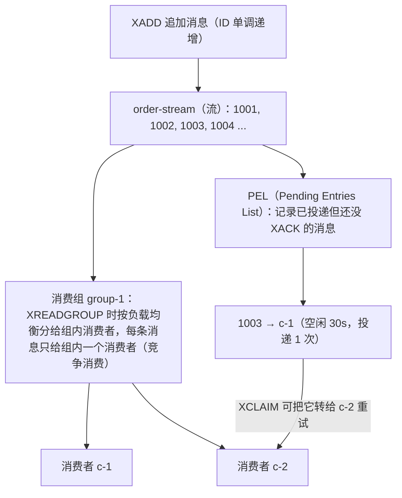

# 03 高级数据类型与典型场景

> 本篇导读：上一篇我们讲了 Redis 的五种"基本类型"（String/Hash/List/Set/ZSet），足够应付大部分缓存、计数器、排行榜需求。但面试和实战里还经常冒出一批"听起来很高级"的东西：BitMap 做签到、HyperLogLog 算 UV、GEO 找附近的人、Stream 做消息队列、布隆过滤器防缓存穿透……它们其实都不是"新类型"，而是**站在 String / ZSet / 普通命令之上的巧妙用法或扩展模块**。本篇把它们逐个拆开：先用生活化比喻讲清"它到底解决了什么痛点"，再上命令、算内存、给可运行 Java 代码，最后给出一张"什么时候该用哪个"的选型表。读完你应该能在真实需求里一眼认出该上哪种武器。

## 本篇要解决的问题

- 用户一年签到、亿级 DAU 统计，为什么用 Set 会爆内存，用 BitMap 却能压到几十字节？
- UV 去重统计（页面访问人数）用 Set 存 userId 太大，HyperLogLog 凭什么只用 12KB 就能估？误差多大、能不能接受？
- "附近的人 / 附近门店"用 GEO 怎么做？它底层到底是啥？为什么没有删除命令？
- 想用 Redis 做**可靠**消息队列，Pub/Sub 为什么不行？List 又差在哪？Stream 是怎么补齐短板的？
- 缓存穿透、爬虫去重，布隆过滤器为什么说"存在不一定在、不在一定不在"？
- RedisJSON / RediSearch / RedisTimeSeries / RedisBloom 这些"Stack 模块"是什么，什么时候该引入？

读完你应该能：针对"签到、UV、附近、队列、去重"五类需求，直接选对数据结构并写出正确的 Redis 命令和 Java 代码。

## 〇、本篇代码环境与依赖（共用）

本篇所有 Java 示例基于 Spring Boot 3.5.5 + `spring-boot-starter-data-redis`（默认 Lettuce），外加 Redisson（布隆过滤器示例用到）。下面这份 `pom.xml` 和 `application.yml` 是后续各节的统一前提。

```xml
<?xml version="1.0" encoding="UTF-8"?>
<project xmlns="http://maven.apache.org/POM/4.0.0"
         xmlns:xsi="http://www.w3.org/2001/XMLSchema-instance"
         xsi:schemaLocation="http://maven.apache.org/POM/4.0.0
                             http://maven.apache.org/xsd/maven-4.0.0.xsd">
    <modelVersion>4.0.0</modelVersion>

    <!-- 统一父工程，版本集中由父工程管理 -->
    <parent>
        <groupId>org.springframework.boot</groupId>
        <artifactId>spring-boot-starter-parent</artifactId>
        <version>3.5.5</version>
        <relativePath/>
    </parent>

    <groupId>com.canoe</groupId>
    <artifactId>redis-advanced-demo</artifactId>
    <version>1.0.0</version>
    <name>redis-advanced-demo</name>

    <!-- 统一版本：所有依赖版本都收口到这里，避免散落各处 -->
    <properties>
        <java.version>17</java.version>
        <maven.compiler.release>17</maven.compiler.release>
        <!-- 布隆过滤器示例用到 Redisson；版本请以 Maven Central 最新为准 -->
        <redisson.version>3.30.0</redisson.version>
    </properties>

    <dependencies>
        <!-- Web 启动器（提供 Spring 容器与配置绑定） -->
        <dependency>
            <groupId>org.springframework.boot</groupId>
            <artifactId>spring-boot-starter</artifactId>
        </dependency>

        <!-- Spring Data Redis：封装 RedisTemplate / StringRedisTemplate，默认带 Lettuce -->
        <dependency>
            <groupId>org.springframework.boot</groupId>
            <artifactId>spring-boot-starter-data-redis</artifactId>
        </dependency>

        <!-- Redisson：分布式对象与布隆过滤器 RBloomFilter -->
        <dependency>
            <groupId>org.redisson</groupId>
            <artifactId>redisson</artifactId>
            <version>${redisson.version}</version>
        </dependency>

        <!-- Jackson 的 Java 8 时间模块（LocalDateTime 等序列化用） -->
        <dependency>
            <groupId>com.fasterxml.jackson.datatype</groupId>
            <artifactId>jackson-datatype-jsr310</artifactId>
        </dependency>

        <!-- 单元测试 -->
        <dependency>
            <groupId>org.springframework.boot</groupId>
            <artifactId>spring-boot-starter-test</artifactId>
            <scope>test</scope>
        </dependency>
    </dependencies>

    <build>
        <plugins>
            <!-- Spring Boot 打包插件 -->
            <plugin>
                <groupId>org.springframework.boot</groupId>
                <artifactId>spring-boot-maven-plugin</artifactId>
            </plugin>
        </plugins>
    </build>
</project>
```

```yaml
spring:
  data:
    redis:
      # Redis 服务器地址（Docker 里一般是宿主机 IP 或容器名）
      host: 127.0.0.1
      # 端口，默认 6379
      port: 6379
      # 若有密码在此填写，没有则删掉本行
      password: ""
      # 数据库编号 0~15，默认 0
      database: 0
      # 连接超时（毫秒）
      connect-timeout: 5000ms
      # 读写超时（毫秒）
      timeout: 5000ms
      #  Lettuce 默认不开连接池；大并发阻塞场景才需要（见 04 篇连接池调优）
      lettuce:
        pool:
          enabled: false
          max-active: 8
          max-idle: 8
          min-idle: 0
          max-wait: -1ms
```

::: tip Windows 同学注意
本篇命令行示例默认在 Linux/macOS 或 Docker 容器里的 `redis-cli` 执行。Windows 上如果你装的是 WSL，直接进 WSL 敲命令即可；如果用的是原生 Redis for Windows（已不再官方维护），命令完全一致，只是路径不同。Docker 起一个 Redis 最省心：`docker run -d --name redis7 -p 6379:6379 redis:7`.
:::

## 一、BitMap（位图）

### 1.1 一句话比喻：一张超大的打卡表

想象公司前台有一张**超长打卡表**，每一格只填 `0`（没来）或 `1`（来了），第 1 格代表 1 号、第 2 格代表 2 号……你要查"张三 3 月 15 号来没来"，直接看第 74 格（31+28+15=74）；要统计"张三 3 月来了几天"，把 3 月那 31 格加起来数有几个 1。

**BitMap 就是这样**：用一连串 bit（位）存布尔状态，`offset`（偏移量）对应"第几格"，`value` 是 0/1。因为每个格子只占 1 bit，所以特别省内存——10 亿个布尔标记也才约 120MB，而用普通 `int` 数组得 4GB。

::: tip 一句话记住
- **BitMap = 用 bit 当开关**，擅长"某用户在某天/某刻是否发生某事"这种二值状态。
- 典型：签到、在线状态、活跃用户、布尔特征标记。
:::

### 1.2 底层真相：它根本不是新类型，就是 String

Redis 没有专门的"BitMap 类型"。**BitMap 操作的是 String 类型 value 的每一个 bit**。一个 String 最大 512MB，换算成 bit 是 `512 * 1024 * 1024 * 8 ≈ 42.9 亿`个 bit。所以对单个 key 你最多可以表示约 42 亿个布尔位——足够绝大多数业务。

```bash
# 看底层类型：BITMAP 操作的 key，TYPE 返回的还是 string
127.0.0.1:6379> SETBIT sign:u1 100 1
(integer) 0
127.0.0.1:6379> TYPE sign:u1
string
127.0.0.1:6379> OBJECT ENCODING sign:u1
"raw"
```

::: warning 版本差异请以官方最新文档为准
BitMap 相关命令在 Redis 2.2+ 就已存在，绝大多数场景无需担心版本。但 `BITFIELD`（含 `OVERFLOW`）是 Redis 3.2 引入，`BITFIELD` 的 `u`/`i` 类型溢出控制在 3.2 也支持；生产老版本请确认。命令细节以官方 `BITMAP` 文档为准。
:::

### 1.3 命令全解

| 命令 | 作用 | 示例 |
| --- | --- | --- |
| `SETBIT key offset value` | 把第 `offset` 位设为 0/1，返回该位旧值 | `SETBIT sign:u1 100 1` |
| `GETBIT key offset` | 取第 `offset` 位的值 | `GETBIT sign:u1 100` |
| `BITCOUNT key [start end]` | 统计 1 的个数（可按字节范围） | `BITCOUNT sign:u1` |
| `BITOP op dest src [src...]` | 对多个 BitMap 做位运算，结果存 `dest`（`AND`/`OR`/`XOR`/`NOT`） | `BITOP AND both sign:u1 sign:u2` |
| `BITPOS key bit [start end]` | 找第一个 0 或 1 的位（如找第一次签到的天） | `BITPOS sign:u1 1` |
| `BITFIELD key ...` | 把 bit 当"多位整数"读写，支持溢出控制 | 见下 |

重点讲 `BITFIELD`——它把一串 bit 当成若干个"小整数"来读写，常用于"同时存连续几天的签到状态"或"存一个计数器"。

```bash
# 把第 100 位起、1 位无符号整数（u1）设为 1，等价 SETBIT，但 BITFIELD 能一次操作多个字段
127.0.0.1:6379> BITFIELD sign:u1 SET u1 100 1
1) (integer) 0

# 一次读多个：读 offset 0 起的 u1，再读 offset 100 起的 u8
127.0.0.1:6379> BITFIELD sign:u1 GET u1 0 GET u8 100
1) (integer) 0
2) (integer) 1

# 溢出控制：对 u8（无符号 8 位，范围 0~255）自增，超过 255 会怎样？
# 默认 WRAP（回绕）：255+1 -> 0
127.0.0.1:6379> BITFIELD c OVERFLOW WRAP INCRBY u8 0 1
1) (integer) 0
# SAT（饱和）：超出范围就停在最大/最小值，不会回绕
127.0.0.1:6379> BITFIELD c OVERFLOW SAT INCRBY u8 0 300
1) (integer) 255
# FAIL（失败）：溢出时直接返回 nil，不动原值
127.0.0.1:6379:0> BITFIELD c OVERFLOW FAIL INCRBY u8 0 300
1) (nil)
```

`u` = 无符号（unsigned），`i` = 有符号（integer，最高位表正负）。`OVERFLOW` 三种策略：

- `WRAP`（默认，仅对 `u` 按 2^n 取模，对 `i` 按补码回绕）
- `SAT`（saturate 饱和，停在最大/最小边界）
- `FAIL`（溢出则整条命令返回 nil，原值不变）

### 1.4 场景 1：用户一年签到

需求：记录用户 `u1` 在 2024 年每天的签到情况，并支持"今天签到了吗 / 今年签到了几天 / 连续签到几天"。

**思路**：key = `sign:2024:u1`，offset = 一年中的第几天（1 月 1 日=0，或直接用 1~365）。签到 = `SETBIT`，统计天数 = `BITCOUNT`，查某天 = `GETBIT`。

```bash
# 1 月 1 日（第 0 天）签到
127.0.0.1:6379> SETBIT sign:2024:u1 0 1
(integer) 0
# 3 月 15 日（第 74 天，31+29+15-1=74，2024 是闰年 2 月 29 天）签到
127.0.0.1:6379> SETBIT sign:2024:u1 74 1
(integer) 0

# 查 3 月 15 日是否签到
127.0.0.1:6379> GETBIT sign:2024:u1 74
(integer) 1

# 今年累计签到天数
127.0.0.1:6379> BITCOUNT sign:2024:u1
(integer) 2

# 第一次签到是第几天（找第一个 1）
127.0.0.1:6379> BITPOS sign:2024:u1 1
(integer) 0
```

**连续签到判断**：用 `BITFIELD` 一次取出最近 N 天的位，从今天往前数，遇到第一个 0 就停。

```bash
# 假设今天是年内第 74 天，取出最近 7 天的位（74-6=68 起，u7 表示 7 个连续 bit）
127.0.0.1:6379> BITFIELD sign:2024:u1 GET u7 68
1) (integer) 126   # 二进制 1111110：最近 7 天里前 6 天签了、今天（最低位）没签
```

> 上面 `126` 的二进制 `1111110` 对应"第 68~74 位"，最低位（第 74 位）是 0 表示今天还没签；从最低位往高位数，连续 1 的个数就是连续签到天数。

### 1.5 场景 2：亿级活跃用户统计

需求：每天统计"今天有多少独立用户活跃过"，并支持"某两天都活跃的用户"。

**思路**：key = `active:20240921`（日期当 key），offset = `userId`（用户 ID 当偏移）。用户一活跃就 `SETBIT active:日期 userId 1`。

```bash
# 用户 100001、100002 在 9/21 活跃
127.0.0.1:6379> SETBIT active:20240921 100001 1
(integer) 0
127.0.0.1:6379> SETBIT active:20240921 100002 1
(integer) 0
# 9/21 日活（DAU）
127.0.0.1:6379> BITCOUNT active:20240921
(integer) 2

# 9/21 和 9/22 都活跃的用户（交集），结果存 active:both
127.0.0.1:6379> SETBIT active:20240922 100001 1
(integer) 0
127.0.0.1:6379> BITOP AND active:both active:20240921 active:20240922
(integer) 12501
127.0.0.1:6379> BITCOUNT active:both
(integer) 1
```

::: warning 内存放大提醒
`offset` 直接用 `userId`，如果用户 ID 是一个很大的稀疏数字（比如 9 位数），BitMap 会"撑大"到那个偏移量，中间空洞也占空间。1 亿用户 = `10^8` bit ≈ 12.5MB/天，可接受；但若 ID 是 UUID 或超大雪花 ID，bit 偏移会爆炸，**BitMap 不适合非连续的大 ID**，此时应改用 HyperLogLog 或布隆过滤器。
:::

### 1.6 内存对比：Set 存 vs BitMap 存

以"用户一年（365 天）签到"为例，算清楚字节数：

```text
BitMap：365 天 = 365 bit → ceil(365 / 8) = 46 字节（Redis String 最少 1 字节）
Set（存整数天数，intset 编码）：每个 16 位整数 2 字节 × 365 + 头 ≈ 0.7 KB
Set（存日期字符串，如 "2024-01-01"，hashtable 编码）：每个字符串数十字节 + 哈希表开销 → 几十 KB
```

| 方案 | 365 天签到占用 | 说明 |
| --- | --- | --- |
| **BitMap**（`SETBIT` 按天偏移） | **约 46 字节** | `ceil(365/8)=46`，且与签到天数多少无关，永远固定 |
| Set 存整数天数（intset 编码） | 约 0.7 KB（365×2B+头） | 天数 1~365 用 16 位 int，仍比 BitMap 大十几倍 |
| Set 存日期字符串（hashtable 编码） | **几十 KB** | 每个 `"2024-01-01"` 字符串 + 哈希表开销，最浪费 |

结论：**BitMap 在"二值状态"场景内存碾压 Set**，且空间与"实际签到天数"无关，只与"时间跨度"有关。

### 1.7 Java 代码（RedisTemplate）

`src/main/java/com/canoe/redis/BitMapDemo.java`：

```java
package com.canoe.redis;

import org.springframework.beans.factory.annotation.Autowired;
import org.springframework.data.redis.connection.RedisStringCommands;
import org.springframework.data.redis.core.StringRedisTemplate;
import org.springframework.stereotype.Component;

import java.util.List;

/**
 * BitMap 三种用法演示：签到、日活、位运算。
 * 对应 CLI：SETBIT / GETBIT / BITCOUNT / BITOP / BITFIELD
 */
@Component
public class BitMapDemo {

    @Autowired
    private StringRedisTemplate redisTemplate;

    /** 用户某天签到：SETBIT sign:2024:{userId} {dayOfYear} 1 */
    public void sign(int userId, int dayOfYear) {
        // opsForValue().setBit 内部就是 SETBIT 命令
        redisTemplate.opsForValue().setBit("sign:2024:" + userId, dayOfYear, true);
    }

    /** 查某天是否签到：GETBIT */
    public boolean isSigned(int userId, int dayOfYear) {
        return Boolean.TRUE.equals(
                redisTemplate.opsForValue().getBit("sign:2024:" + userId, dayOfYear));
    }

    /** 统计累计签到天数：BITCOUNT（RedisTemplate 没有直接的 bitCount，用 execute 拿原生连接） */
    public long signDays(int userId) {
        return redisTemplate.execute((org.springframework.data.redis.core.RedisCallback<Long>) conn ->
                conn.bitCount(("sign:2024:" + userId).getBytes()));
    }

    /** 两天都活跃的用户数：BITOP AND + BITCOUNT */
    public long bothActive(String dateA, String dateB) {
        // BITOP 需要 RedisStringCommands.BitOp 枚举（AND/OR/XOR/NOT）
        redisTemplate.execute((org.springframework.data.redis.core.RedisCallback<Long>) conn ->
                conn.bitOp(RedisStringCommands.BitOp.AND,
                        "active:both".getBytes(),
                        ("active:" + dateA).getBytes(),
                        ("active:" + dateB).getBytes()));
        return redisTemplate.execute((org.springframework.data.redis.core.RedisCallback<Long>) conn ->
                conn.bitCount("active:both".getBytes()));
    }

    /** BITFIELD：一次读最近 7 天的签到位（GET u7 offset） */
    public List<Long> last7Bits(int userId, int startDay) {
        // 用原生 connection.execute 跑原始 BITFIELD 命令，最稳，不依赖 BitFieldArgs 的版本差异
        return (List<Long>) redisTemplate.execute((org.springframework.data.redis.core.RedisCallback<Object>) conn ->
                (List<Long>) conn.execute("BITFIELD".getBytes(),
                        ("sign:2024:" + userId).getBytes(),
                        "GET".getBytes(),
                        "u7".getBytes(),
                        String.valueOf(startDay).getBytes()));
    }
}
```

::: tip 为什么 BITFIELD 用 `connection.execute` 跑原始命令
`RedisTemplate` 对 `BITFIELD` 没有像 `setBit` 那样现成封装；要么用 `BitFieldArgs`（各 Spring Data Redis 小版本 API 略有差异），要么直接用 `connection.execute("BITFIELD", ...)` 传原始参数，后者最不易写错。**生产建议封装成工具方法**，别在每个业务里裸写。
:::

## 二、HyperLogLog

### 2.1 问题引出：UV 统计用 Set 会爆内存

老板要你统计"网站每天有多少独立访客（UV）"。你很自然地想：来一个用户就把 `userId` 塞进一个 Set，`SCARD` 就是 UV。

```bash
# 朴素做法：把每个访客 userId 放进当天 Set
127.0.0.1:6379> SADD uv:20240921 u10001 u10002 u10003
(integer) 3
127.0.0.1:6379> SADD uv:20240921 u10001        # 重复访客不会增加
(integer) 0
127.0.0.1:6379> SCARD uv:20240921
(integer) 3
```

**痛点**：日活 1000 万，每个 userId 按 8 字节算，一天就是 80MB；一年 365 天 29GB，还只是 UV 一个指标。而且你其实**只想要一个数字（UV 是多少）**，并不需要把每个 userId 都存下来。HyperLogLog 就是为这种"只求近似去重计数"而生的。

### 2.2 原理通俗讲：抛硬币估轮数

HyperLogLog 的思想可以用"抛硬币"来理解（这叫**伯努利试验**）：

> 你反复抛一枚公平硬币，记录"连续抛到正面的最大次数 k"。如果某次连续抛了 5 次才出正面（即中间 4 次反面、第 5 次正面），直觉上你大概抛了 `2^5 = 32` 轮左右。换句话说，**连续反面的长度 k 能反推"总共抛了多少轮"**。

HyperLogLog 对每个元素算一个哈希，看哈希二进制末尾"连续 0 的个数"（相当于抛硬币连续反面的长度），记下最大的那个。但它不会只抛一组——它把哈希**分成 m 个桶（bucket）**，每组各自记录自己的最大连续 0 长度，最后用**调和平均**（而不是简单平均）把这些桶的值合起来，算出总数估计。

::: tip 三个关键认知
1. **它不存元素本身**，只维护一个固定大小（约 12KB）的"估算状态"——所以无论你加 100 个还是 10 亿个元素，内存基本不变。
2. **结果是近似值**，标准误差约 **0.81%**，不是精确值。
3. 加进去的元素**无法取出来、无法判断某元素是否加过**（那是布隆过滤器的事）。
:::

### 2.3 命令全解

| 命令 | 作用 | 示例 |
| --- | --- | --- |
| `PFADD key element [element...]` | 加入元素（不返回数量，返回是否变更） | `PFADD uv:20240921 u10001 u10002` |
| `PFCOUNT key [key...]` | 估算基数（去重后的数量） | `PFCOUNT uv:20240921` |
| `PFMERGE dest key [key...]` | 合并多个 HLL 到 dest（并集去重） | `PFMERGE uv:week uv:1 uv:2 ... uv:7` |

```bash
# 加入 3 个访客
127.0.0.1:6379> PFADD uv:20240921 u10001 u10002 u10003
(integer) 1
# 重复加同一个，HLL 状态可能不变，返回 0
127.0.0.1:6379> PFADD uv:20240921 u10001
(integer) 0
# 估算 UV（误差约 0.81%）
127.0.0.1:6379> PFCOUNT uv:20240921
(integer) 3

# 合并 7 天 UV 成一周 UV（去重后的并集）
127.0.0.1:6379> PFMERGE uv:week uv:0921 uv:0922 uv:0923 uv:0924 uv:0925 uv:0926 uv:0927
OK
127.0.0.1:6379> PFCOUNT uv:week
(integer) 21
```

::: warning 合并后仍是去重并集
`PFMERGE` 是把多个 HLL 的"估算状态"做并集合并，**结果就是这几天去重后的总 UV**，不会因为合并了 7 个就变成 7 倍。这正是它比"每天 SCARD 再相加"正确的地方。
:::

### 2.4 误差与内存

- **内存**：每个 HLL key 固定约 **12KB**（内部 16384 个 6-bit 寄存器 = `16384 × 6 / 8 ≈ 12KB`）。和元素数量无关。
- **误差**：标准误差约 **0.81%**（理论值 `1.04 / sqrt(16384) ≈ 0.8125%`）。
- **能否接受**：UV 从 100 万误差到 100.8 万，对绝大多数运营决策无影响；但如果你要"精确对账到每一个用户"，HLL 不行，得上 Set 或精确计数服务。

### 2.5 对比表：Set 精确 vs HyperLogLog 估算

| 维度 | Set 精确统计 | HyperLogLog 估算 |
| --- | --- | --- |
| 内存 | 随元素线性增长（1000 万 ≈ 80MB+/天） | 固定 ~12KB/key，与元素数无关 |
| 结果 | 精确（SCARD） | 近似，误差 ~0.81% |
| 能否取回元素 | 能（SMEMBERS） | 不能 |
| 能否判断某元素是否在 | 能（SISMEMBER） | 不能 |
| 合并多个 | SUNION（耗内存） | PFMERGE（极省） |
| 适合 | 需要精确、要回元素 | 只关心"大概多少"的 UV/DAU |

### 2.6 场景

- **页面 UV / 日活 DAU / 月活 MAU**：只要数字量级，不要精确名单。
- **搜索词去重**：统计"今天有多少个不同搜索词"。
- **多天/多页面 UV 合并**：`PFMERGE` 一键并集。

### 2.7 Java 代码（RedisTemplate）

`src/main/java/com/canoe/redis/HllDemo.java`：

```java
package com.canoe.redis;

import org.springframework.beans.factory.annotation.Autowired;
import org.springframework.data.redis.core.HyperLogLogOperations;
import org.springframework.data.redis.core.StringRedisTemplate;
import org.springframework.stereotype.Component;

import java.util.concurrent.ThreadLocalRandom;

/**
 * HyperLogLog 三件套：add / size / union，对应 PFADD / PFCOUNT / PFMERGE
 */
@Component
public class HllDemo {

    @Autowired
    private StringRedisTemplate redisTemplate;

    /** 模拟记录一天 UV：每来一个访客就 add 一次 */
    public void recordUv(String date, String userId) {
        // opsForHyperLogLog() 返回 HyperLogLogOperations<K, V>
        HyperLogLogOperations<String, String> hll = redisTemplate.opsForHyperLogLog();
        hll.add("uv:" + date, userId);   // PFADD
    }

    /** 估算当天 UV */
    public long estimateUv(String date) {
        return redisTemplate.opsForHyperLogLog().size("uv:" + date);  // PFCOUNT
    }

    /** 合并一周 UV 到 uv:week */
    public void mergeWeek() {
        HyperLogLogOperations<String, String> hll = redisTemplate.opsForHyperLogLog();
        hll.union("uv:week",                                  // dest key
                "uv:0921", "uv:0922", "uv:0923",
                "uv:0924", "uv:0925", "uv:0926", "uv:0927");  // PFMERGE
    }

    /** 批量灌入造数据，方便你本地看误差 */
    public void mock(int n) {
        for (int i = 0; i < n; i++) {
            recordUv("20240921", "u" + ThreadLocalRandom.current().nextInt(n));
        }
        System.out.println("真实去重≈" + n + "，HLL 估算=" + estimateUv("20240921"));
    }
}
```

## 三、GEO

### 3.1 比喻：手机地图的"附近的人"

你打开外卖 App，点"附近商家"，屏幕列出 500 米内的店并标了距离——这背后就是 GEO。Redis 的 GEO 让你往里塞"成员 + 经纬度"，然后按"某个点附近多少米 / 多少公里"或"某个矩形框内"把成员捞出来并算距离。

### 3.2 命令全解

| 命令 | 作用 | 示例 |
| --- | --- | --- |
| `GEOADD key lng lat member [lng lat member...]` | 添加地理点（经度在前，纬度在后！） | `GEOADD bikes 116.39 39.91 bike:1` |
| `GEOPOS key member` | 取成员坐标 | `GEOPOS bikes bike:1` |
| `GEODIST key m1 m2 unit` | 两成员间距离（`m`/`km`/`ft`/`mi`） | `GEODIST bikes bike:1 bike:2 km` |
| `GEOSEARCH key ...` | 6.2+ 推荐：按点/成员 + 半径/框搜索 | 见下 |
| `GEOSEARCHSTORE dest key ...` | 把搜索结果存到新 key | `GEOSEARCHSTORE res bikes ...` |
| `GEOHASH key member` | 取 Geohash 字符串（用于调试/对比） | `GEOHASH bikes bike:1` |
| `GEORADIUS`（旧）/ `GEORADIUSBYMEMBER`（旧） | 老命令，Redis 6.2 起建议用 GEOSEARCH 替代 | 已弃用倾向 |

```bash
# 加 3 辆共享单车（经度 116.39，纬度 39.91 附近）
127.0.0.1:6379> GEOADD bikes 116.397128 39.916527 bike:1
(integer) 1
127.0.0.1:6379> GEOADD bikes 116.403027 39.915173 bike:2
(integer) 1

# 以某点为中心，5 公里半径内、由近到远取 10 个，带坐标和距离
127.0.0.1:6379> GEOSEARCH bikes FROMLONLAT 116.40 39.92 BYRADIUS 5 km ASC COUNT 10 WITHDIST WITHCOORD
1) 1) "bike:1"
   2) "1.1234"
   3) 1) "116.397128"
      2) "39.916527"
2) 1) "bike:2"
   2) "0.5678"
   3) 1) "116.403027"
      2) "39.915173"

# 矩形框搜索：以某点为中心 10km × 10km 的方框内
127.0.0.1:6379> GEOSEARCH bikes FROMLONLAT 116.40 39.92 BYBOX 10 km 10 km ASC

# 两辆车直线距离
127.0.0.1:6379> GEODIST bikes bike:1 bike:2 km
"1.6912"
```

`GEOSEARCH` 关键选项：

- `FROMLONLAT lng lat`：从指定经纬度出发；`FROMMEMBER member`：从已有成员出发。
- `BYRADIUS 5 km`：圆形半径；`BYBOX 10 km 10 km`：矩形框（宽×高）。
- `ASC`/`DESC`：按距离升序/降序。
- `COUNT n`：最多返回 n 个。
- `WITHDIST`：附带距离；`WITHCOORD`：附带坐标；`WITHHASH`：附带整数 hash。

### 3.3 底层真相：GEO 就是 ZSet

GEO 没有自己的类型，它把"经纬度"编成一个 52 位的整数（Geohash 编码），存进一个 **ZSet**，score 就是那个整数。所以你用 `ZRANGE` 能直接看到所有成员——只不过 score 是一串看不懂的大数字。

```bash
# TYPE 返回 zset，证明 GEO 底层是 ZSet
127.0.0.1:6379> TYPE bikes
zset
# ZRANGE 能看到成员和 score（score 是 Geohash 的 52 位整数编码）
127.0.0.1:6379> ZRANGE bikes 0 -1 WITHSCORES
1) "bike:1"
2) "4069885379668032"
3) "bike:2"
4) "40698855534xxxxx"
```

::: tip 由此得出的一个重要结论
既然 GEO 是 ZSet，那它的"删除"就是 `ZREM`——Redis **没有 GEODEL 命令**：

```bash
127.0.0.1:6379> ZREM bikes bike:1      # 删除一辆单车
(integer) 1
```
:::

### 3.4 场景

- **附近门店 / 附近车辆 / 外卖骑手距离**：GEOSEARCH 半径搜索。
- **距离排序**：`ASC` 由近到远。
- **热力框选**：`BYBOX` 拉一个矩形区域做运营活动。

### 3.5 Java 代码（RedisTemplate）

`src/main/java/com/canoe/redis/GeoDemo.java`：

```java
package com.canoe.redis;

import org.springframework.beans.factory.annotation.Autowired;
import org.springframework.data.geo.Circle;
import org.springframework.data.geo.Distance;
import org.springframework.data.geo.Metrics;
import org.springframework.data.geo.Point;
import org.springframework.data.redis.connection.GeoSearchCommandArgs;
import org.springframework.data.redis.connection.RedisGeoCommands;
import org.springframework.data.redis.core.GeoOperations;
import org.springframework.data.redis.core.StringRedisTemplate;
import org.springframework.data.redis.domain.geo.GeoLocation;
import org.springframework.stereotype.Component;

import java.util.List;

/**
 * GEO 演示：add / radius（老式，通用）/ search（6.2+ 推荐）
 */
@Component
public class GeoDemo {

    @Autowired
    private StringRedisTemplate redisTemplate;

    /** 添加地理点：GEOADD。注意 Point 构造是 (经度 lng, 纬度 lat) */
    public void addBike(String bikeId, double lng, double lat) {
        Point point = new Point(lng, lat);
        redisTemplate.opsForGeo().add("bikes", point, bikeId);   // GEOADD
    }

    /** 老式半径搜索：GEORADIUS 的封装，返回带距离的结果 */
    public void nearByOld(double lng, double lat) {
        GeoOperations<String, String> geo = redisTemplate.opsForGeo();
        Circle circle = new Circle(new Point(lng, lat), new Distance(5, Metrics.KILOMETERS));
        RedisGeoCommands.GeoResults<GeoLocation<String>> results = geo.radius("bikes", circle);
        print(results);
    }

    /** 6.2+ 推荐：GEOSEARCH，支持 BYRADIUS / ASC / COUNT / WITHCOORD / WITHDIST */
    public void nearByNew(double lng, double lat) {
        GeoOperations<String, String> geo = redisTemplate.opsForGeo();
        GeoSearchCommandArgs args = GeoSearchCommandArgs.newGeoSearchArgs()
                .fromLonLat(new Point(lng, lat))        // FROMLONLAT
                .byRadius(new Distance(5, Metrics.KILOMETERS))  // BYRADIUS 5 km
                .sortAscending()                        // ASC
                .limit(10)                              // COUNT 10
                .includeCoordinates()                   // WITHCOORD
                .includeDistance();                     // WITHDIST
        RedisGeoCommands.GeoResults<GeoLocation<String>> results = geo.search("bikes", args);
        print(results);
    }

    /** 两成员距离：GEODIST */
    public Distance dist(String a, String b) {
        return redisTemplate.opsForGeo().distance("bikes", a, b, Metrics.KILOMETERS);
    }

    private void print(RedisGeoCommands.GeoResults<GeoLocation<String>> results) {
        for (RedisGeoCommands.GeoResult<GeoLocation<String>> r : results) {
            GeoLocation<String> loc = r.getContent();
            Distance d = r.getDistance();
            System.out.println("成员=" + loc.getName() + "，距离=" + d);
        }
    }
}
```

### 3.6 删除与精度坑

- **没有 GEODEL**：删除成员用 `ZREM key member`（因为底层是 ZSet）。
- **Geohash 边界问题**：地球是球面，Geohash 把二维坐标编码成一维，相邻区域在边界可能被切到不同桶，极端情况下"框边缘"的成员排序有微小误差，一般业务无感。
- **距离是球面大圆距离**：`GEODIST` 算的是地球表面最短距离，不是"沿马路的实际路程"，导航场景别直接拿来当导航里程。
- **精度约 1cm**（52 位编码足够细），但对超近距离无影响。

::: warning 版本差异请以官方最新文档为准
`GEOSEARCH` / `GEOSEARCHSTORE` 是 Redis 6.2 引入，老的 `GEORADIUS` / `GEORADIUSBYMEMBER` 在 6.2+ 标记为**弃用（deprecated）**，未来版本会移除。Spring Data Redis 的 `opsForGeo().search(...)` 也需较新版本。生产请确认 Redis ≥ 6.2 再使用 GEOSEARCH。
:::

## 四、Stream（Redis 5.0+）

### 4.1 为什么需要 Stream

你可能想用 Redis 做消息队列，但现有方案都有硬伤：

- **List 做队列**：`LPUSH` + `BRPOP` 能实现，但**没有消费组、没有 ack、没有"已读未确认"概念**，一个消费者挂了，它正在处理的消息就丢了；多个消费者无法自动分摊（得自己写）。
- **Pub/Sub**：消息**不持久化、不堆积**，消费者离线期间的消息直接丢失，更像"广播喇叭"而非队列。

**Stream 是 Redis 5.0 引入的专门消息流类型**，补齐了：消息持久化、消费组（Consumer Group）、ACK 确认、Pending 待确认列表（PEL）、阻塞读取。一句话——**它是一个能当"可靠消息队列 + 事件溯源日志"用的类型**。

### 4.2 命令全解

| 命令 | 作用 |
| --- | --- |
| `XADD key [NOMKSTREAM] [MAXLEN\|MAXLEN ~] *\|id field value [field value...]` | 追加消息；`*` 自动生成 ID；`MAXLEN ~ n` 近似裁剪 |
| `XLEN key` | 消息总数 |
| `XRANGE key start end [COUNT n]` | 按 ID 范围读（`-` 到 `+` 全量） |
| `XREVRANGE key end start [COUNT n]` | 反向范围读 |
| `XREAD [COUNT n] [BLOCK ms] STREAMS key [key...] id [id...]` | 简单读取，`BLOCK` 阻塞等新消息 |
| `XGROUP CREATE key group $ \| 0 [MKSTREAM]` | 建消费组；`$` 只消费新消息，`0` 从头部（含历史） |
| `XREADGROUP GROUP g c [COUNT n] [BLOCK ms] STREAMS key >` | 组内消费；`>` 读新消息，`0`/`0-0` 重读 pending |
| `XACK key group id [id...]` | 确认消息，移出 PEL |
| `XPENDING key group [start end count] [consumer]` | 查看 pending 消息 |
| `XCLAIM` / `XAUTOCLAIM` | 把长时间未 ack 的消息转给别的消费者（消息转移） |
| `XTRIM key MAXLEN [~] n` | 裁剪流长度 |
| `XDEL key id [id...]` | 删除指定消息 |
| `XINFO STREAM\|GROUPS\|CONSUMERS key` | 查看流/组/消费者信息 |

```bash
# 追加一条订单消息，* 让 Redis 自动生成 毫秒时间戳-序号 形式的 ID
127.0.0.1:6379> XADD order-stream * orderId 1001 amount 89.00
"1726886400000-0"

# 只保留最近 1000 条（~ 表示近似裁剪，性能更好）
127.0.0.1:6379> XADD order-stream MAXLEN ~ 1000 orderId 1002 amount 12.00
"1726886401000-0"

# 建消费组：从流头部开始消费历史消息（含已存在的）
127.0.0.1:6379> XGROUP CREATE order-stream group-1 0 MKSTREAM
OK
# 若用 $ 代替 0，则只消费"建组之后"新来的消息

# 消费者 c-1 读取组内新消息（> 表示只拿未投递给其他人的新消息）
127.0.0.1:6379> XREADGROUP GROUP group-1 c-1 COUNT 10 STREAMS order-stream >
1) 1) "order-stream"
   2) 1) 1) "1726886400000-0"
         2) 1) "orderId"
            2) "1001"
            3) "amount"
            4) "89.00"

# 处理完后确认，消息从 PEL 移除
127.0.0.1:6379> XACK order-stream group-1 1726886400000-0
(integer) 1

# 查看还有哪些消息已投递但未确认
127.0.0.1:6379> XPENDING order-stream group-1
...（显示 pending 的 id、所属消费者、空闲时长、投递次数）
```

### 4.3 消费组模型通俗讲



::: tip 三个必须理解的概念
1. **消息 ID 单调递增**：`毫秒时间-序号`，天然有序，可作为事件溯源的时间线。
2. **组内负载均衡**：同一消费组里，一条消息只投递给组内一个消费者（类似 Kafka 的 partition 分配给 consumer），实现分摊。
3. **PEL（Pending Entries List）**：记录"已发给消费者、但还没 ack"的消息。消费者崩了，别人能用 `XCLAIM` 接手重处理——这就是"可靠"的来源。
:::

### 4.4 对比表：List / Pub/Sub / Stream

| 维度 | List 队列 | Pub/Sub | Stream |
| --- | --- | --- | --- |
| 持久化 | 有（在内存，可落盘） | **无** | 有 |
| 消息堆积 | 能堆积 | 不能（离线丢） | 能堆积 |
| 消费组 | 无 | 无 | **有** |
| ACK 确认 | 无 | 无 | **有（XACK）** |
| 待确认/Pending | 无 | 无 | **有（PEL + XCLAIM）** |
| 阻塞读取 | `BRPOP` 有 | 订阅即收 | `XREAD BLOCK` 有 |
| 适用 | 简单 FIFO | 实时广播 | **可靠队列 / 事件溯源** |

### 4.5 场景

- **可靠消息队列**：订单、通知异步处理，崩了不丢消息。
- **事件溯源（Event Sourcing）**：把业务事件按时间全量落 Stream，`XRANGE` 可回放。
- **异步任务分发**：多消费者组内竞争消费。

### 4.6 Java 代码（StreamMessageListenerContainer）

`src/main/java/com/canoe/redis/RedisStreamConfig.java`：

```java
package com.canoe.redis;

import org.springframework.context.annotation.Bean;
import org.springframework.context.annotation.Configuration;
import org.springframework.data.redis.connection.RedisConnectionFactory;
import org.springframework.data.redis.connection.stream.Consumer;
import org.springframework.data.redis.connection.stream.MapRecord;
import org.springframework.data.redis.connection.stream.ReadOffset;
import org.springframework.data.redis.connection.stream.RecordId;
import org.springframework.data.redis.connection.stream.StreamOffset;
import org.springframework.data.redis.connection.stream.StreamReadOptions;
import org.springframework.data.redis.core.StringRedisTemplate;
import org.springframework.data.redis.stream.StreamListener;
import org.springframework.data.redis.stream.StreamMessageListenerContainer;

import java.time.Duration;

/**
 * 用 StreamMessageListenerContainer 监听消费组消息，自动 ack。
 * 对应 CLI：XGROUP CREATE / XREADGROUP / XACK
 */
@Configuration
public class RedisStreamConfig {

    @Bean
    public StreamMessageListenerContainer<String, MapRecord<String, String, String>> streamContainer(
            RedisConnectionFactory factory, StringRedisTemplate redisTemplate) {

        // 1) 容器选项：每次拉取最多阻塞 2 秒
        StreamMessageListenerContainer.StreamMessageListenerContainerOptions<String, MapRecord<String, String, String>> options =
                StreamMessageListenerContainer.StreamMessageListenerContainerOptions.builder()
                        .pollTimeout(Duration.ofSeconds(2))
                        .build();

        StreamMessageListenerContainer<String, MapRecord<String, String, String>> container =
                StreamMessageListenerContainer.create(factory, options);

        // 2) 注册监听：组 group-1、消费者 c-1，从"最后消费位置"继续读新消息
        container.receive(
                Consumer.from("group-1", "c-1"),
                StreamOffset.create("order-stream", ReadOffset.lastConsumed()),
                new OrderStreamListener(redisTemplate));

        container.start();
        return container;
    }

    /** 监听器：收到消息后处理并手动 ack */
    static class OrderStreamListener implements StreamListener<String, MapRecord<String, String, String>> {
        private final StringRedisTemplate redisTemplate;

        OrderStreamListener(StringRedisTemplate redisTemplate) {
            this.redisTemplate = redisTemplate;
        }

        @Override
        public void onMessage(MapRecord<String, String, String> message) {
            // message.getId() 消息 ID，如 1726886400000-0
            // message.getValue() 字段-值 Map
            System.out.println("收到消息 id=" + message.getId() + " 内容=" + message.getValue());
            try {
                // 这里写你的业务（扣库存、发通知……）
                handle(message.getValue());
                // 处理成功 → 确认，移出 PEL
                redisTemplate.opsForStream().acknowledge("group-1", message.getId());
            } catch (Exception e) {
                // 失败不 ack，消息留在 PEL，可被 XCLAIM 转移重试
                System.err.println("处理失败，保留 pending：" + e.getMessage());
            }
        }

        private void handle(java.util.Map<String, String> value) {
            // 模拟业务
            System.out.println("处理订单 orderId=" + value.get("orderId"));
        }
    }
}
```

生产者（`XADD`）示例：

```java
package com.canoe.redis;

import org.springframework.beans.factory.annotation.Autowired;
import org.springframework.data.redis.connection.stream.MapRecord;
import org.springframework.data.redis.connection.stream.RecordId;
import org.springframework.data.redis.core.StringRedisTemplate;
import org.springframework.stereotype.Component;

import java.util.Map;

/** 往 Stream 里追加消息，对应 XADD */
@Component
public class StreamProducer {

    @Autowired
    private StringRedisTemplate redisTemplate;

    public RecordId send(String orderId, String amount) {
        // MapRecord.create(stream, Map) 内部生成 * 形式的 ID
        MapRecord<String, String, String> record =
                MapRecord.create("order-stream", Map.of("orderId", orderId, "amount", amount));
        return redisTemplate.opsForStream().add(record);   // XADD
    }
}
```

::: tip 手动建组 vs MKSTREAM
如果流还不存在，`XGROUP CREATE` 会报错。CLI 里加 `MKSTREAM` 可在建组时顺带建流；Java 里可先判断再调用 `opsForStream().createGroup("order-stream", ReadOffset.from("0"), "group-1")`，或用 `createGroup` 前先 `add` 一条让流存在。
:::

## 五、Pub/Sub

### 5.1 命令全解

| 命令 | 作用 | 示例 |
| --- | --- | --- |
| `SUBSCRIBE channel [channel...]` | 订阅频道 | `SUBSCRIBE news` |
| `PUBLISH channel message` | 发布消息 | `PUBLISH news "hello"` |
| `UNSUBSCRIBE [channel...]` | 取消订阅 | `UNSUBSCRIBE news` |
| `PSUBSCRIBE pattern [pattern...]` | 模式订阅（通配） | `PSUBSCRIBE news.*` |
| `PUNSUBSCRIBE [pattern...]` | 取消模式订阅 | `PUNSUBSCRIBE news.*` |
| `PUBSUB CHANNELS [pattern]` | 查看活跃频道 | `PUBSUB CHANNELS` |
| `PUBSUB NUMSUB channel [channel...]` | 查看频道订阅数 | `PUBSUB NUMSUB news` |

```bash
# 终端 A：订阅 news 频道（会阻塞等待消息）
127.0.0.1:6379> SUBSCRIBE news
1) "subscribe"
2) "news"
3) (integer) 1
1) "message"
2) "news"
3) "hello canoe"

# 终端 B：发布
127.0.0.1:6379> PUBLISH news "hello canoe"
(integer) 1    # 返回收到消息的订阅者数量
```

### 5.2 为什么不能当可靠队列（重点反例）

::: danger 不要拿 Pub/Sub 做消息队列
Pub/Sub 有四大硬伤，决定了它**只适合"实时广播"，绝不适合"可靠投递"**：

1. **不持久化**：消息发出去就消失，没接住的消费者永远收不到。
2. **无 ACK**：发出即视为成功，不管对方是否处理。
3. **消费者离线消息直接丢**：你订阅期间断线，那几秒的消息全没了。
4. **消息不堆积**：没有缓冲，生产者快、消费者慢就会丢消息。
:::

**反例**：你想用 Pub/Sub 做"订单创建后发短信"，结果短信服务重启 3 秒，这 3 秒内创建的订单短信全丢——这是线上事故。正确做法是用 Stream（见 4.x）或专业 MQ（RabbitMQ/Kafka）。

### 5.3 场景

- **实时通知广播**：如"配置刷新了，各节点重新加载"。
- **WebSocket 桥接**：把 Redis 订阅的消息转发到前端 WebSocket。
- **轻量事件通知**：对"丢一两条无所谓"的实时性场景。

### 5.4 Java 代码（Spring Data Redis）

`src/main/java/com/canoe/redis/RedisPubSubConfig.java`：

```java
package com.canoe.redis;

import org.springframework.context.annotation.Bean;
import org.springframework.context.annotation.Configuration;
import org.springframework.data.redis.connection.RedisConnectionFactory;
import org.springframework.data.redis.connection.Message;
import org.springframework.data.redis.connection.MessageListener;
import org.springframework.data.redis.listener.ChannelTopic;
import org.springframework.data.redis.listener.PatternTopic;
import org.springframework.data.redis.listener.RedisMessageListenerContainer;
import org.springframework.data.redis.listener.adapter.MessageListenerAdapter;
import org.springframework.data.redis.serializer.StringRedisSerializer;

/**
 * Redis 发布订阅配置：模式匹配订阅 news.*，消息转发到一个 POJO 方法
 */
@Configuration
public class RedisPubSubConfig {

    @Bean
    public RedisMessageListenerContainer container(RedisConnectionFactory factory,
                                                   MessageListenerAdapter adapter) {
        RedisMessageListenerContainer container = new RedisMessageListenerContainer();
        container.setConnectionFactory(factory);
        // 精确频道用 ChannelTopic；模式匹配（通配）用 PatternTopic
        container.addMessageListener(adapter, new PatternTopic("news.*"));
        return container;
    }

    @Bean
    public MessageListenerAdapter listenerAdapter(Receiver receiver) {
        MessageListenerAdapter adapter = new MessageListenerAdapter(receiver, "receiveMessage");
        // 消息体按 String 反序列化（默认是 JDK，会乱码）
        adapter.setSerializer(new StringRedisSerializer());
        return adapter;
    }

    @Bean
    public Receiver receiver() {
        return new Receiver();
    }

    /** 直接实现 MessageListener，最直观：onMessage 拿到原始消息和匹配的 pattern */
    static class Receiver implements MessageListener {
        @Override
        public void onMessage(Message message, byte[] pattern) {
            String channel = new String(pattern);
            String body = new String(message.getBody());
            System.out.println("频道=" + channel + " 消息=" + body);
        }

        /** 供 MessageListenerAdapter 调用的方法（消息体为 String） */
        public void receiveMessage(String message) {
            System.out.println("收到=" + message);
        }
    }
}
```

## 六、Redis Stack 扩展模块简介

Redis 官方把一批"高级能力"做成了**模块（module）**，打包成 **Redis Stack**（开源版叫 `redis-stack-server`）。它们不是核心命令，需要单独加载。

### 6.1 RedisJSON

- **是什么**：把 JSON 文档当成一等公民存进 Redis，支持按 JSONPath 读写嵌套字段。
- **典型命令**：`JSON.SET` / `JSON.GET` / `JSON.DEL` / `JSON.NUMINCRBY`。
- **何时引入**：你的 value 是复杂嵌套 JSON，又不想整体序列化/反序列化，想"只改某个字段"。

### 6.2 RediSearch

- **是什么**：全文检索 + 二级索引 + 向量检索。给 Hash/JSON 建索引，支持中文分词、聚合。
- **典型命令**：`FT.CREATE` / `FT.SEARCH` / `FT.AGGREGATE` / `FT.ADD`。
- **何时引入**：要做"商品搜索、日志检索、RAG 向量召回"，比自己维护 ES 轻量。

### 6.3 RedisTimeSeries

- **是什么**：专门存时序数据（指标、监控点），自动按时间分块、降采样、保留策略。
- **典型命令**：`TS.ADD` / `TS.RANGE` / `TS.CREATERULE`。
- **何时引入**：只想要"轻量监控指标存储"，不想上 Prometheus/InfluxDB。

### 6.4 RedisBloom

- **是什么**：布隆过滤器 + 布谷鸟过滤器 + Count-Min Sketch + Top-K 等概率数据结构集合。
- **典型命令**：`BF.ADD` / `BF.EXISTS` / `BF.RESERVE`（见下一节）。
- **何时引入**：缓存穿透防护、海量去重、Top-K 热词——见 7.x。

::: warning 版本差异请以官方最新文档为准
RedisJSON / RediSearch / RedisTimeSeries / RedisBloom 都是**独立模块**，开源版需自行在 `redis.conf` 里 `loadmodule` 加载对应 `.so`；或用 `redis/redis-stack` Docker 镜像一键带上。云厂商（阿里云、AWS ElastiCache、腾讯云）对各模块的支持程度不同，**上云前务必确认你用的云版本是否包含该模块**，命令以官方 Redis Stack 文档为准。
:::

## 七、布隆过滤器（Bloom Filter）

### 7.1 原理通俗讲：宁可错杀一千，不可放过一个

布隆过滤器用**一组 hash 函数 + 一个位数组**判断"某元素是否可能存在"：

- **加入元素**：用 k 个 hash 函数算出 k 个位置，把位数组上这些位都置 1。
- **查询元素**：同样算 k 个位置，只要**有一个位是 0**，就**一定不存在**；如果**全是 1**，则"可能存在"（因为别的元素的 hash 可能恰好把这些位也置 1 了）。

::: tip 一句话结论
- **说"不存在" → 一定不存在**（位数组有 0，铁证）。
- **说"存在" → 可能误判**（所有位都是 1，但可能是别人凑出来的）。
- 这正是：**宁可错杀一千（把存在的误判为存在，无妨），不可放过一个（把不存在的当成存在）**。误判只会"假阳性"，不会"假阴性"。
:::

**不支持删除**：因为多个元素共享位，你把某元素的 k 个位清 0，可能误伤别的元素。变体 **Counting Bloom**（计数布隆）用计数器支持删除，但 RedisBloom 的 `BF` 命令不支持删除（它的 `BF.RESERVE` 是普通布隆）。

### 7.2 参数选择：误判率 vs 容量 vs 内存

布隆过滤器的空间公式：对 n 个元素、目标误判率 p，所需 bit 数 `m ≈ -n·ln(p) / (ln2)²`，每个元素约 `m/n` 个 bit；hash 函数个数 `k ≈ (m/n)·ln2`。

| 目标误判率 p | 每元素 bit 数 | hash 数 k | 1 亿元素内存估算 |
| --- | --- | --- | --- |
| 1% (0.01) | ~9.6 bit | 7 | ~114 MB |
| 0.1% (0.001) | ~14.4 bit | 10 | ~171 MB |
| 0.01% (0.0001) | ~19.2 bit | 13 | ~228 MB |

::: warning 误判率设太低会爆内存
p 从 1% 降到 0.01%（100 倍更准），bit 数大约从 9.6 涨到 19.2（翻倍），内存直接翻倍。而且**容量 n 估小了**也会让实际误判率飙升——所以 `BF.RESERVE` 时容量要按"未来最大可能值"预留余量。
:::

### 7.3 命令（RedisBloom 模块）

```bash
# 预先建一个过滤器：容量 1000 万，误判率 1%（容量不够会自动扩容但误判率上升）
127.0.0.1:6379> BF.RESERVE user:visited 0.01 10000000
OK
# 加入元素
127.0.0.1:6379> BF.ADD user:visited u10001
(integer) 1
# 批量
127.0.0.1:6379> BF.MADD user:visited u10002 u10003
1) (integer) 1
2) (integer) 1
# 判断是否存在（1=可能存在，0=一定不存在）
127.0.0.1:6379> BF.EXISTS user:visited u10001
(integer) 1
127.0.0.1:6379> BF.EXISTS user:visited u99999
(integer) 0
# 批量判断
127.0.0.1:6379> BF.MEXISTS user:visited u10001 u99999
1) (integer) 1
2) (integer) 0
# 看过滤器信息（容量、已用、误判率）
127.0.0.1:6379> BF.INFO user:visited
```

### 7.4 场景

- **缓存穿透防护**：先查布隆"key 可能存在吗"，不存在直接返回，避免打到 DB。
- **爬虫 URL 去重**：亿级 URL 判重，内存远小于 Set。
- **垃圾邮件 / 黑名单过滤**：允许极小误判（把正常邮件当垃圾）时用。

### 7.5 Java 代码（Redisson RBloomFilter）

`src/main/java/com/canoe/redis/BloomDemo.java`：

```java
package com.canoe.redis;

import org.redisson.Redisson;
import org.redisson.api.RBloomFilter;
import org.redisson.api.RedissonClient;
import org.redisson.config.Config;
import org.springframework.stereotype.Component;

/**
 * 用 Redisson 的 RBloomFilter（底层即 RedisBloom 的 BF 命令）
 * 完整 import，无 import xxx.*；更复杂的分布式锁/对象见第 07 章 Redisson 展开
 */
@Component
public class BloomDemo {

    public void cachePenetrationGuard() {
        // 1) 建 Redisson 客户端（实际项目应注入单例 RedissonClient，别每次 new）
        Config config = new Config();
        config.useSingleServer().setAddress("redis://127.0.0.1:6379");
        RedissonClient redisson = Redisson.create(config);

        // 2) 拿到布隆过滤器（名字任意）
        RBloomFilter<String> bf = redisson.getBloomFilter("user:visited");
        // 3) 初始化：预期 1000 万元素，误判率 1%（只在首次调用，重复调用不生效）
        bf.tryInit(10_000_000L, 0.01);

        // 4) 使用
        bf.add("u10001");                       // BF.ADD
        boolean maybeExists = bf.contains("u10001");  // BF.EXISTS
        boolean definitelyNot = !bf.contains("u99999"); // contains=false 一定不存在

        System.out.println("u10001 可能存在=" + maybeExists);
        System.out.println("u99999 一定不存在=" + definitelyNot);

        redisson.shutdown();
    }
}
```

::: tip 还没引入 RedisBloom 模块？用 BitMap + 多 hash 自实现（可选思路）
若你的 Redis 没装 RedisBloom，可退而用 BitMap 模拟：选 k 个简单 hash（如 Murmur3 取模），`SETBIT filter (hash_i(userId) % N) 1` 写入，`GETBIT` 全为 1 才"可能存在"。代价是容量固定、hash 质量一般，生产建议直接上 RedisBloom 或 Redisson。
:::

## 八、高级类型选型速查表

```text
需求场景                  优先选择            关键命令/API                  备注
──────────────────────────────────────────────────────────────────────────────
用户签到 / 在线状态        BitMap            SETBIT/GETBIT/BITCOUNT      1 个 bit 占 1 位，超省
日活/月活统计(近似)        BitMap(按天)       BITOP+BITCOUNT               跨天交集
UV/独立访客(不要精确)      HyperLogLog       PFADD/PFCOUNT/PFMERGE        ~12KB，误差0.81%
页面UV/搜索词去重          HyperLogLog       PFADD/PFCOUNT               只求个数
附近的人/门店             GEO              GEOADD/GEOSEARCH            底层ZSet，删除用ZREM
可靠消息队列              Stream           XADD/XREADGROUP/XACK       消费组+PEL，可靠
简单 FIFO 任务            List             LPUSH/BRPOP                 无ack，别用于重要任务
实时广播/配置刷新          Pub/Sub          PUBLISH/SUBSCRIBE          不持久，丢消息无所谓
缓存穿透防护              布隆过滤器         BF.ADD/BF.EXISTS           存在可能误判，不存在一定准
复杂JSON读写             RedisJSON        JSON.SET/JSON.GET           需模块
全文检索/向量             RediSearch       FT.CREATE/FT.SEARCH        需模块
监控指标时序              RedisTimeSeries   TS.ADD/TS.RANGE            需模块
```

## 九、常见坑

1. **BitMap 的 offset 不能用超大稀疏 ID**：userId 若是 9 位甚至更大的非连续 ID，bit 偏移会撑爆内存，应改用 HLL/布隆。
2. **HyperLogLog 不能取回元素、不能判断某元素是否在**：它只给一个数字，去重判断请用布隆过滤器。
3. **GEO 没有删除命令**：删除成员用 `ZREM`，新手常到处找 `GEODEL`。
4. **GEOSEARCH 需要 Redis ≥ 6.2**：老 `GEORADIUS` 已弃用，版本不够会报未知命令。
5. **Stream 消费后必须 XACK**：不 ack 消息永远留在 PEL，XPENDING 会越积越多，最终内存爆。
6. **Pub/Sub 不能当可靠队列**：断线/重启消息就丢，重要业务换 Stream 或 MQ。
7. **BF.RESERVE 容量要预留余量**：容量估小，实际误判率会远超设定的 p。
8. **模块需单独加载**：RedisJSON/RediSearch/TimeSeries/Bloom 不是核心命令，开源版要 `loadmodule` 或用 redis-stack 镜像，云上确认支持。

## 本篇小结

- **BitMap 本质是 String 的 bit 操作**，擅长"二值状态"：签到、在线、活跃用户，365 天只要约 46 字节，远小于 Set。
- **HyperLogLog 只存估算状态、不存元素**，固定 ~12KB、误差 ~0.81%，适合 UV/DAU 这种"只要大概数字"的场景。
- **GEO 底层就是 ZSet**（score 是 Geohash 52 位整数），`GEOSEARCH`（6.2+）做附近搜索，删除用 `ZREM`。
- **Stream 是 Redis 5.0+ 的可靠消息流**：消费组 + ACK + PEL，能当可靠队列和事件溯源，崩了不丢消息。
- **Pub/Sub 只广播不持久**：无 ack、离线丢消息、不堆积，绝不能当可靠队列用。
- **布隆过滤器结论**：说"不存在"一定准，说"存在"可能误判；不支持删除，容量要预留避免误判率飙升。
- **Redis Stack 模块**（JSON/RediSearch/TimeSeries/Bloom）是扩展能力，开源需 `loadmodule`、云上支持各异，别假设核心版自带。
- **选型口诀**：二值→BitMap；近似去重计数→HLL；附近→GEO；可靠队列→Stream；广播→Pub/Sub；穿透防护→布隆。
- **Java 入口**：`opsForValue().setBit/getBit`、`opsForHyperLogLog()`、`opsForGeo()`、`opsForStream()`，原生命令用 `redisTemplate.execute(RedisCallback)`。
- **版本红线**：GEOSEARCH、BITFIELD 溢出控制、Stream 等都有最低版本要求，生产先 `INFO` 或查官方文档确认。
- **内存敏感场景优先 BitMap/HLL/布隆**：三者都是"用极小的固定或线性空间换功能"，比 Set 省几个数量级。

## 参考链接

- Redis BitMap 官方文档：<https://redis.io/docs/latest/develop/data-types/bitmaps/>
- Redis HyperLogLog 官方文档：<https://redis.io/docs/latest/develop/data-types/hyperloglogs/>
- Redis GEO 官方文档：<https://redis.io/docs/latest/develop/data-types/geospatial/>
- Redis Stream 官方文档：<https://redis.io/docs/latest/develop/data-types/streams/>
- Redis Pub/Sub 官方文档：<https://redis.io/docs/latest/develop/use/patterns/pubsub/>
- Redis Stack 模块总览：<https://redis.io/docs/latest/develop/use/patterns/distributed-locks/>
- RedisBloom 官方文档（布隆过滤器）：<https://redis.io/docs/latest/develop/data-types/probabilistic/bloom-filter/>
- Redisson RBloomFilter API：<https://github.com/redisson/redisson/wiki/6.-Distributed-objects#bloom-filter>

下一篇 → [04 Java 客户端实战](/java/middleware/redis/java-client)
