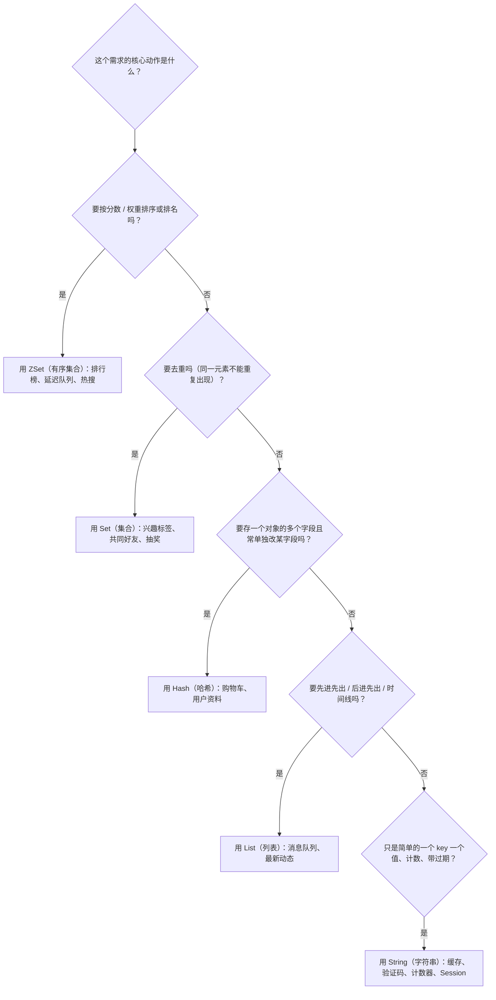

# 02 数据类型与常用命令

> 上一篇我们跑通了环境、用 `StringRedisTemplate` 存了第一个 key。但 Redis 真正的威力，藏在它的**数据类型**里——value 不只是"一段字符串"，它可以是哈希、列表、集合、带分数的有序集合。这一篇我们把五种基本数据类型逐个拆开：每条命令怎么敲、`OBJECT ENCODING` 看底层是怎么存的、什么场景该用哪个、以及对应的 Java 代码怎么写。读完这篇，你写缓存、排行榜、计数器、消息队列时，能"选对类型、敲对命令"，而不是把所有东西都塞进 String。

## 本篇要解决的问题

- Redis 说"同一个 type 底层可能不同 encoding"是什么意思？怎么亲眼验证？
- 五种基本类型（String/Hash/List/Set/ZSet）各自有哪些必会命令？
- 为什么 Hash 存购物车比"整个对象序列化成一个 String"更省内存、更好改？
- 排行榜用 ZSet 怎么实现？并列名次怎么处理？延迟队列又是怎么用 ZSet 做的？
- 这些类型在 Java 里用 `RedisTemplate` / `StringRedisTemplate` 怎么一一对应地操作？
- 一堆命令里，`NX`/`XX`/`KEEPTTL` 这些后缀到底什么意思？区间是闭还是开？

读完你应该能：针对"排行榜、购物车、共同好友、限流、消息队列"这类需求，直接选对数据类型并写出正确的 Redis 命令和 Java 代码。

## 一、Redis 对象系统总览：先看清"冰山下的结构"

很多人以为"我 `SET` 的就是一个字符串"。其实**你看到的 `string/hash/list` 只是冰山水面以上的"类型"，水面下 Redis 还藏了一层"编码（encoding）"**——同一个类型，数据量小时用一种紧凑编码，数据量大了换成另一种。

### 1.1 五种基本类型速览

先记住这五个"类型（type）"，本篇后面每节拆一个：

| 类型（type） | 中文 | 一句话 | 典型命令 |
| --- | --- | --- | --- |
| **string** | 字符串 | 最普通的 KV，能存文本/数字/二进制 | `SET` `GET` `INCR` |
| **hash** | 哈希 | 一个 key 里存多对 field-value，像对象 | `HSET` `HGET` `HINCRBY` |
| **list** | 列表 | 有序可重复的元素序列，可做队列/栈 | `LPUSH` `RPUSH` `LRANGE` |
| **set** | 集合 | 无序、唯一的元素集合，可做去重/交并 | `SADD` `SINTER` `SPOP` |
| **zset** | 有序集合 | 带 score 的集合，按分数排序，做排行 | `ZADD` `ZRANGE` `ZINCRBY` |

::: tip 记住"类型"和"编码"是两件事
- **type（类型）**：你逻辑上看到的，比如"这是个 hash"。命令 `TYPE key` 返回它。
- **encoding（编码）**：Redis 内部真正用什么数据结构存。命令 `OBJECT ENCODING key` 返回它。
- 同一个 type 可能因为数据大小/内容，底层用**不同 encoding**。下面每节都会讲"什么时候换 encoding"。
:::

### 1.2 redisObject：每个 value 的统一外壳

Redis 在内部用一个叫 `redisObject` 的结构包裹每个 value，关键三个字段：

```text
redisObject
├── type      ：逻辑类型（string/hash/list/set/zset 之一）
├── encoding  ：底层编码（int/embstr/raw/ziplist/hashtable/quicklist/intset/skiplist...）
└── ptr       ：指向真正数据结构的指针
```

- `type`：决定你可以用哪一组命令操作它（乱用命令会报错，比如对 hash 执行 `GET`）。
- `encoding`：决定内存怎么排布、操作多快。Redis 会**按数据情况自动选最省内存的编码**。
- `ptr`：指向实际数据（比如一个真正的哈希表、一个跳表）。

### 1.3 用 OBJECT ENCODING 亲自验证

光说不练假把式。连上 Redis 敲命令，亲眼看看"同一个 string 类型，底层编码会随内容变"：

```bash
# 存一个整数 → 底层编码 int（直接用整数存，最省）
127.0.0.1:6379> SET n 100
OK
127.0.0.1:6379> OBJECT ENCODING n
"int"

# 存一个短字符串（≤44 字节）→ 底层编码 embstr（嵌入式，一次分配）
127.0.0.1:6379> SET s "hello canoe"
OK
127.0.0.1:6379> OBJECT ENCODING s
"embstr"

# 存一个超长字符串（>44 字节）→ 底层编码 raw（独立分配 SDS）
127.0.0.1:6379> SET big "这是一个明显超过四十四字节长度的字符串用来触发 raw 编码的示例内容。。。。。。。。"
OK
127.0.0.1:6379> OBJECT ENCODING big
"raw"
```

```bash
# 再看 hash：少量小字段时用 listpack（Redis 7 对 ziplist 的替代），多了转 hashtable
127.0.0.1:6379> HSET user:1 name "张三" age "18"
(integer) 2
127.0.0.1:6379> OBJECT ENCODING user:1
"listpack"

# 往里塞很多字段，超过阈值后：
127.0.0.1:6379> OBJECT ENCODING user:1
"hashtable"      # 元素多了以后自动转换（见第四节）
```

::: warning 版本差异请以官方最新文档为准
本文基于 Redis 7.4 验证。Redis 7.0 起用 **listpack** 替代了老旧的 **ziplist**（listpack 消除了 ziplist 的"连锁更新"性能坑）。所以你在新版本看到的编码是 `listpack` 而非 `ziplist`。老的 `hash-max-ziplist-entries` 配置项也已更名为 `hash-max-listpack-entries`（详见第四节）。**具体默认阈值与配置名以你所用的 Redis 版本官方文档为准。**
:::

## 二、String（字符串）：最常用，也最容易被用错

String 是 Redis 最基础的类型。表面是"字符串"，其实**还能高效存整数和浮点数**（因为底层 `int` 编码直接存数字）。

### 2.1 必会命令表

| 命令 | 作用 | 示例 | 返回 |
| --- | --- | --- | --- |
| `SET key val [EX s] [PX ms] [NX\|XX] [KEEPTTL]` | 设值，可带过期/条件 | `SET code 8848 EX 120` | `OK` |
| `GET key` | 取值 | `GET code` | `"8848"` 或 nil |
| `MSET k1 v1 k2 v2` | 批量设 | `MSET a 1 b 2` | `OK` |
| `MGET k1 k2` | 批量取 | `MGET a b` | `1) "1" 2) "2"` |
| `SETNX key val` | 不存在才设（= `SET key val NX`） | `SETNX lock 1` | `1` 成功 / `0` 失败 |
| `SETEX key sec val` | 设值并指定秒过期 | `SETEX code 120 8848` | `OK` |
| `GETSET key val` | 取旧值并设新值 | `GETSET count 0` | 旧值 |
| `INCR key` | 整数原子 +1 | `INCR views` | 新值（整数） |
| `INCRBY key n` | 整数加 n | `INCRBY views 10` | 新值 |
| `INCRBYFLOAT key f` | 浮点加 f | `INCRBYFLOAT price 0.5` | 新值 |
| `DECR key` | 整数原子 -1 | `DECR stock` | 新值 |
| `APPEND key val` | 追加字符串 | `APPEND log "ok"` | 新长度 |
| `STRLEN key` | 字符串长度 | `STRLEN name` | 长度 |
| `GETRANGE key s e` | 取子串（闭区间） | `GETRANGE name 0 2` | 子串 |
| `SETRANGE key off val` | 从偏移量覆盖写 | `SETRANGE name 0 "Li"` | 新长度 |

`SET` 的选项重点记：

| 选项 | 含义 | 记忆口诀 |
| --- | --- | --- |
| `EX 秒` / `PX 毫秒` | 设过期时间 | **EX**pire |
| `NX` | **只有 key 不存在**才设 | **N**ot e**X**ists |
| `XX` | **只有 key 存在**才设 | **X**ists e**X**actly（已存在） |
| `KEEPTTL` | 覆盖值时**保留原来的过期时间** | **KEEP** **TTL** |

```bash
# NX：不存在才写 → 适合"抢锁 / 防重复创建"
127.0.0.1:6379> SET lock:order:1 "me" NX
OK
127.0.0.1:6379> SET lock:order:1 "other" NX
(nil)              # 已存在，写入失败，返回 nil

# XX：存在才写 → 适合"只能改、不能凭空建"
127.0.0.1:6379> SET config:x "v" XX
(nil)              # 不存在，拒绝写
127.0.0.1:6379> SET config:x "v"
OK
127.0.0.1:6379> SET config:x "v2" XX
OK

# KEEPTTL：覆盖但保留原过期（避免"重设即变永久"的坑，见上篇 5.2）
127.0.0.1:6379> SET token "a" EX 300
OK
127.0.0.1:6379> SET token "b" KEEPTTL
OK
127.0.0.1:6379> TTL token
(integer) 297      # 过期被保留，没有变成 -1（永久）
```

### 2.2 底层结构：SDS 与三种编码

**SDS（Simple Dynamic String，简单动态字符串）** 是 Redis 自己实现的字符串结构，替代了 C 语言原生字符串。为什么不用 C 原生字符串？看对比：

| 维度 | C 原生字符串 | Redis 的 SDS |
| --- | --- | --- |
| 取长度 | 遍历到 `\0` 结束符，O(N) | 结构里存了 `len`，O(1) |
| 二进制安全 | 遇 `\0` 就截断，不能存图片/压缩包 | 按 `len` 读，可存任意二进制 |
| 内存重分配 | 每次修改可能频繁 realloc | 预分配 + 惰性释放，减少 realloc |

::: tip 什么是"二进制安全"
C 字符串以 `\0` 当结束标志，如果数据里本身有 `\0`（比如一张图片的二进制），就会被误判为"到这就结束了"。SDS 靠记录长度 `len` 来界定字符串，**所以能安全地存图片、音视频、序列化后的对象等任意二进制数据**。这也是为什么 Redis 的 String 能当"二进制桶"用。
:::

String 的 value 根据内容，底层会用三种编码之一：

| 编码 | 触发条件 | 说明 |
| --- | --- | --- |
| `int` | value 是**能用 long 表示的整数** | 直接存整数，最省，且 `INCR` 原地改 |
| `embstr` | 是字符串且长度 **≤ 44 字节**（Redis 7） | 一次内存分配同时放下 redisObject + SDS，紧凑高效 |
| `raw` | 字符串长度 **超过 44 字节** | redisObject 和 SDS 分别分配，适合大字符串 |

::: warning 版本差异请以官方最新文档为准
`embstr` 的阈值在不同 Redis 版本略有差异：早期 3.x 是 39 字节，3.2 起改为 **44 字节**（因为 jemalloc 的 64 字节分配单元 + redisObject 头占用，能刚好装下一个 ≤44 字节的 SDS）。本文按 Redis 7.4 的 44 字节说明，**精确阈值以官方源码/文档为准**。`OBJECT ENCODING` 是最可靠的验证手段。
:::

### 2.3 String 的典型场景

**① 分布式锁（预告第 06 章）**

```bash
# 用 SETNX 抢锁：只有没人持锁时才抢到，天然原子
127.0.0.1:6379> SETNX lock:order:1001 "clientA"
(integer) 1        # 抢到
# 释放锁要用 Lua 脚本保证"只删自己的锁"，完整实现留到第 06 章
```

**② 计数器 / 点赞数**

```bash
127.0.0.1:6379> SET article:888:likes 0
OK
127.0.0.1:6379> INCR article:888:likes
(integer) 1
127.0.0.1:6379> INCR article:888:likes
(integer) 2
```

**③ 验证码带过期**

```bash
127.0.0.1:6379> SET sms:138001 "8848" EX 120
OK
```

**④ 共享 Session**

```bash
# 用户登录后，把 session 存 Redis，多台 Web 服务器都能读
127.0.0.1:6379> SET session:tokenabc "{uid:1001,role:user}" EX 1800
OK
```

**⑤ 限流（INCR + EXPIRE）**

```bash
# 1 秒内第 1 次访问：建计数器并设 1 秒过期
127.0.0.1:6379> INCR ratelimit:ip:1.2.3.4
(integer) 1
127.0.0.1:6379> EXPIRE ratelimit:ip:1.2.3.4 1
(integer) 1
# 同 1 秒内再来 → 计数上升，超过阈值就拒绝
```
## 三、Hash（哈希）：存"对象"最自然的类型

Hash 是一个 key 里面装了**多对 field-value**，非常适合存一个"对象"（比如用户信息：name、age、email 各是一个 field）。

### 3.1 必会命令表

| 命令 | 作用 | 示例 |
| --- | --- | --- |
| `HSET key field val [field val...]` | 设一个或多个 field | `HSET user:1 name 张三 age 18` |
| `HGET key field` | 取单个 field | `HGET user:1 name` |
| `HMSET key f1 v1 f2 v2` | 批量设（老的写法，现推荐 HSET 一次多 field） | `HMSET user:1 a 1 b 2` |
| `HMGET key f1 f2` | 批量取多个 field | `HMGET user:1 name age` |
| `HGETALL key` | 取全部 field-value | `HGETALL user:1` |
| `HKEYS key` | 取所有 field 名 | `HKEYS user:1` |
| `HVALS key` | 取所有 value | `HVALS user:1` |
| `HLEN key` | field 个数 | `HLEN user:1` |
| `HEXISTS key field` | field 是否存在 | `HEXISTS user:1 age` |
| `HINCRBY key field n` | field 整数加 n | `HINCRBY user:1 age 1` |
| `HINCRBYFLOAT key field f` | field 浮点加 f | `HINCRBYFLOAT user:1 score 0.5` |
| `HDEL key field [field...]` | 删一个或多个 field | `HDEL user:1 age` |
| `HSETNX key field val` | field 不存在才设 | `HSETNX user:1 vip 1` |
| `HRANDFIELD key [count [WITHVALUES]]` | 随机取 field（可做抽奖） | `HRANDFIELD user:1 2 WITHVALUES` |

```bash
# 存一个用户对象（多个 field 一次写入）
127.0.0.1:6379> HSET user:1001 name "张三" age 18 vip 0
(integer) 3

# 取单个字段
127.0.0.1:6379> HGET user:1001 name
"张三"

# 给 age 字段 +1（计数器场景，比如"用户等级经验"）
127.0.0.1:6379> HINCRBY user:1001 age 1
(integer) 19

# 看全部
127.0.0.1:6379> HGETALL user:1001
1) "name"
2) "张三"
3) "age"
4) "19"
5) "vip"
6) "0"
```

### 3.2 底层：listpack → hashtable（以及 Redis 7 的配置项名）

Hash 的底层随数据规模自动切换：

```text
数据小、字段少  →  listpack（紧凑列表，省内存）
   │  超过阈值后自动转换
   ▼
数据大、字段多  →  hashtable（真正的哈希表，O(1) 查 field）
```

控制转换的**两个配置项**（Redis 7 的正式名字）：

| 配置项（Redis 7） | 默认值 | 含义 |
| --- | --- | --- |
| `hash-max-listpack-entries` | 512 | Hash 的 field 数量超过此值 → 转 hashtable |
| `hash-max-listpack-value` | 64 | 任一 field 的 value 字节数超过此值 → 转 hashtable |

::: warning 老的 ziplist 配置已更名（重要）
在 **Redis 7.0 之前**，这两个配置叫 `hash-max-ziplist-entries` 和 `hash-max-ziplist-value`（用的是老结构 ziplist）。**Redis 7.0 起 ziplist 被 listpack 取代，配置项同步更名为 `hash-max-listpack-*`**。如果你在老教程/旧版本里看到 `hash-max-ziplist-*`，在新版本 Redis 里**已失效**（会被忽略甚至报错）。本篇统一用 Redis 7 的 `hash-max-listpack-*` 写法。ZSet 对应的配置也从 `zset-max-ziplist-*` 更名为 `zset-max-listpack-*`（见第七节）。
:::

### 3.3 场景：购物车（Hash 的经典用法）

购物车天然适合 Hash：key 是"用户购物车"，field 是"商品 sku"，value 是"数量"。改数量只要 `HINCRBY`，不用动别的商品。

```bash
# 用户 u1001 往购物车加 sku2001 两件、sku2002 一件
127.0.0.1:6379> HSET cart:u1001 sku2001 2 sku2002 1
(integer) 2

# 再买一件 sku2001
127.0.0.1:6379> HINCRBY cart:u1001 sku2001 1
(integer) 3

# 看整个购物车
127.0.0.1:6379> HGETALL cart:u1001
1) "sku2001"
2) "3"
3) "sku2002"
4) "1"
```

### 3.4 重点对比：Hash 存对象 vs String 存整个 JSON

存一个"用户对象"，有两种常见做法，优劣分明：

| 维度 | Hash 存对象（field 拆开） | String 存整个 JSON |
| --- | --- | --- |
| 改一个字段 | `HSET user:1 age 19`，只改 age | 要读出整个 JSON、改 age、再写回 |
| 网络开销 | 改局部小（只传 age） | 改局部大（每次传整个对象） |
| 取部分字段 | `HMGET user:1 name` 精准取 | 只能整体取，自己解析 |
| 整体读写 | 需 `HGETALL`（字段多时慢，见 3.5） | `GET` 一把取，简单 |
| 内存（小对象） | 更省（listpack 紧凑） | 稍多（JSON 字符串 + 引号） |
| 和数据库映射 | 需手动 field↔列映射 | 直接对象↔JSON 序列化 |

::: tip 选型结论（记住这句）
- **小对象、要高频改其中某几个字段**（购物车、用户资料局部更新）→ 用 **Hash**。
- **大对象、总是整体读写**（一篇长文章、配置快照）→ 用 **String 存 JSON**，简单直接。
- 别把整个大 JSON 塞进 Hash 的单个 field——那等于把 Hash 用回了 String，两不讨好。
:::

### 3.5 HGETALL 的阻塞风险 + 替代

`HGETALL` 会一次性返回**所有 field-value**。如果某个 Hash 有几十万个 field（比如把"全站商品"塞进一个 Hash），`HGETALL` 会一次性吐出巨量数据，**阻塞单线程、撑爆网络**。

```bash
# ❌ 危险：field 极多时一把全取，卡顿 + 大包
127.0.0.1:6379> HGETALL big:hash

# ✅ 只取需要的字段
127.0.0.1:6379> HMGET big:hash field1 field2

# ✅ 渐进式遍历（类似 KEYS → SCAN，HASH 用 HSCAN）
127.0.0.1:6379> HSCAN big:hash 0 COUNT 100
```

::: warning 大 Hash 同样是"大 key"
一个 Hash 的 field 数量建议控制在**几千以内**。要存超大量子项，考虑拆成多个 Hash（如按 uid 取模分片：`user:1:attrs`、`user:2:attrs`），或换其他结构。字段多时优先 `HMGET`/`HSCAN`，别无脑 `HGETALL`。
:::
## 四、List（列表）：有序可重复的序列

List 是**按插入顺序排序、元素可重复**的字符串序列。左右都能插、都能弹，所以既能当栈、又能当队列、还能当时间线。

### 4.1 必会命令表

| 命令 | 作用 | 示例 |
| --- | --- | --- |
| `LPUSH key v [v...]` | 从左边（头）插入 | `LPUSH list a b` |
| `RPUSH key v [v...]` | 从右边（尾）插入 | `RPUSH list c` |
| `LPOP key [n]` | 从左边弹出（可弹 n 个） | `LPOP list` |
| `RPOP key [n]` | 从右边弹出 | `RPOP list` |
| `LRANGE key s e` | 取区间元素（闭区间，支持负下标） | `LRANGE list 0 -1` |
| `LINDEX key idx` | 按下标取（慢，O(N)） | `LINDEX list 0` |
| `LLEN key` | 长度 | `LLEN list` |
| `LTRIM key s e` | 只保留区间内元素（裁剪成固定长度） | `LTRIM list 0 99` |
| `LSET key idx val` | 按下标改值 | `LSET list 0 x` |
| `LREM key n val` | 删前 n 个等于 val 的元素 | `LREM list 0 x` |
| `RPOPLPUSH src dst` | 从 src 右弹、左推到 dst | `RPOPLPUSH q1 q2` |
| `BLPOP key [key...] timeout` | 左阻塞弹出（无元素则等） | `BLPOP q 0` |
| `BRPOP key [key...] timeout` | 右阻塞弹出 | `BRPOP q 0` |

```bash
# 从左插 a、b（b 在左头），从右插 c（c 在右尾）→ 列表为 [b, a, c]
127.0.0.1:6379> LPUSH mylist a b
(integer) 2
127.0.0.1:6379> RPUSH mylist c
(integer) 3

# 看全部（0 到 -1，-1 表示最后一个）
127.0.0.1:6379> LRANGE mylist 0 -1
1) "b"
2) "a"
3) "c"

# 取最后一个元素（负下标：从右往左数）
127.0.0.1:6379> LINDEX mylist -1
"c"
```

### 4.2 底层：Redis 7 的 quicklist

Redis 7 里，List 的底层结构是 **quicklist**——可以通俗理解为"**用链表把多个 listpack 串起来**"：

```text
quicklist
├── node1 (listpack：存若干元素，紧凑省内存)
├── node2 (listpack)
├── node3 (listpack)
└── ...（双向链表串起来）
```

- 每个节点是一个 **listpack**（紧凑列表，省内存，类似 Hash 用的那种），存一小段元素。
- 节点之间用**双向指针**连成链表，所以头尾插入/删除都是 O(1)，还能存超长列表而不爆内存。
- 为什么这么设计？纯"数组/连续内存"扩容贵、改中间慢；纯"链表"每个元素都要单独分配、内存碎片多。**quicklist = 链表的大O优势 + listpack 的内存紧凑优势**，两头好处都占。

（早期 Redis 用 ziplist + linkedlist 混合，Redis 7 把 ziplist 换成了 listpack。）

### 4.3 场景一：简易消息队列

最经典的"队列"用法：生产者 `LPUSH` 往左边投任务，消费者 `BRPOP` 从右边阻塞取。

```bash
# 生产者：投两个任务
127.0.0.1:6379> LPUSH queue:tasks "task-1"
(integer) 1
127.0.0.1:6379> LPUSH queue:tasks "task-2"
(integer) 2

# 消费者：阻塞取（没有就等，timeout=0 表示一直等，不超时返回）
127.0.0.1:6379> BRPOP queue:tasks 0
1) "queue:tasks"
2) "task-1"        # 先投的先出 → 先进先出（FIFO）
```

::: tip 关于 `BRPOP` 的 timeout 参数
`BRPOP key timeout` 的 `timeout`：
- `0`：永久阻塞，直到有元素可取（消费者常这么用，等价于"一直监听"）。
- 正数（如 `5`）：最多等 5 秒，超时还没元素就返回 nil（适合"等一会儿就算了"的场景）。
- `BLPOP`/`BRPOP` 是**阻塞**的，不会空转占用 CPU；多个消费者抢同一个队列时，一个元素只会被一个消费者拿到（竞争消费）。
:::

### 4.4 场景二：最新动态 / 时间线 + FIFO/LIFO/栈 命令组合

朋友圈时间线：新动态 `LPUSH` 到头，取最新 10 条用 `LRANGE 0 9`。配合 `LTRIM` 把列表裁到只留最近 N 条，防止无限增长。

| 想要的效果 | 命令组合 |
| --- | --- |
| **队列 FIFO（先进先出）** | 生产 `RPUSH`，消费 `LPOP`（或 `BRPOP`） |
| **栈 LIFO（后进先出）** | 入栈 `LPUSH`，出栈 `LPOP` |
| **最新 N 条（时间线）** | `LPUSH` 新动态 + `LTRIM key 0 N-1` 只留最新的 |
| **阻塞消费** | 用 `BLPOP` / `BRPOP` 替代 `LPOP` / `RPOP` |

```bash
# 只保留最新 100 条动态，防止列表无限膨胀
127.0.0.1:6379> LPUSH feed:u1001 "新动态A"
(integer) 1
127.0.0.1:6379> LTRIM feed:u1001 0 99
OK
127.0.0.1:6379> LRANGE feed:u1001 0 9
1) "新动态A"
```
## 五、Set（集合）：无序且唯一

Set 是**元素唯一、无序**的字符串集合。去重、交集、并集、差集是它的强项。

### 5.1 必会命令表

| 命令 | 作用 | 示例 |
| --- | --- | --- |
| `SADD key m [m...]` | 添加成员（重复自动忽略） | `SADD tag:u1 篮球 音乐` |
| `SREM key m [m...]` | 删除成员 | `SREM tag:u1 篮球` |
| `SMEMBERS key` | 取所有成员（量大时慢，慎用） | `SMEMBERS tag:u1` |
| `SISMEMBER key m` | 是否成员 | `SISMEMBER tag:u1 篮球` |
| `SCARD key` | 成员数量 | `SCARD tag:u1` |
| `SINTER key1 key2 [k...]` | 交集（共同元素） | `SINTER f:u1 f:u2` |
| `SINTERCARD numkeys key [key...]` | 交集大小（不返回元素，省内存） | `SINTERCARD 2 f:u1 f:u2` |
| `SUNION key1 key2` | 并集 | `SUNION f:u1 f:u2` |
| `SDIFF key1 key2` | 差集（key1 有、key2 没有） | `SDIFF f:u1 f:u2` |
| `SRANDMEMBER key [count]` | 随机取成员（**不删除**，可重复取） | `SRANDMEMBER tag:u1 2` |
| `SPOP key [count]` | 随机弹出成员（**删除**，不可重复） | `SPOP tag:u1 1` |
| `SMOVE src dst m` | 把成员从 src 移到 dst | `SMOVE f:u1 f:u2 篮球` |
| `SSCAN key cursor [MATCH p] [COUNT n]` | 渐进遍历（替代 SMEMBERS） | `SSCAN tag:u1 0` |

```bash
# 用户 u1、u2 的兴趣标签
127.0.0.1:6379> SADD tag:u1 篮球 音乐 足球
(integer) 3
127.0.0.1:6379> SADD tag:u2 篮球 音乐 游戏
(integer) 3

# 共同兴趣（交集）→ 篮球、音乐
127.0.0.1:6379> SINTER tag:u1 tag:u2
1) "篮球"
2) "音乐"

# 只想知道共同几个，不取明细（省网络）
127.0.0.1:6379> SINTERCARD 2 tag:u1 tag:u2
(integer) 2
```

### 5.2 底层：intset → hashtable

| 编码 | 触发条件 | 说明 |
| --- | --- | --- |
| `intset` | 所有成员都是**整数**，且数量较少 | 紧凑整数数组，省内存、查找快 |
| `hashtable` | 有非整数成员，或数量超过阈值 | 退化为哈希表（value 统一存 null） |

你可以用 `OBJECT ENCODING` 验证：塞一堆整数成员时是 `intset`，加一个字符串成员立刻变 `hashtable`。

### 5.3 场景一：共同好友 / 二度人脉

"共同好友"就是两个用户好友 Set 的**交集**：

```bash
# u1、u2 的好友集合
127.0.0.1:6379> SADD friend:u1 alice bob carol
(integer) 3
127.0.0.1:6379> SADD friend:u2 bob carol dave
(integer) 3

# 共同好友（交集）
127.0.0.1:6379> SINTER friend:u1 friend:u2
1) "bob"
2) "carol"

# 二度人脉（u1 可能认识的人）：u2 的好友 - u1 已有的好友 = 差集
127.0.0.1:6379> SDIFF friend:u2 friend:u1
1) "dave"
```

### 5.4 场景二：抽奖（SRANDMEMBER vs SPOP）

```bash
# 奖池
127.0.0.1:6379> SADD lottery u1 u2 u3 u4 u5
(integer) 5

# 中奖但还能再中（不删成员）→ 用 SRANDMEMBER
127.0.0.1:6379> SRANDMEMBER lottery 2
1) "u2"
2) "u5"

# 抽走就不让再中（删成员）→ 用 SPOP
127.0.0.1:6379> SPOP lottery 1
1) "u3"
127.0.0.1:6379> SCARD lottery
(integer) 4
```

::: tip 抽奖该用哪个
- **可重复中奖**（如"每日免费抽，抽中还能抽"）→ `SRANDMEMBER`，不删成员。
- **不可重复中奖**（如"实物大奖只能中一次"）→ `SPOP`，抽走即从奖池移除。
:::

### 5.5 场景三：防重复提交 / 去重

```bash
# 用户 10 秒内不能重复提交同一表单：用请求指纹当成员，加了就说明已提交
127.0.0.1:6379> SADD submit:u1001:formA "req-fingerprint-xyz" "EX 10"
# ⚠️ 上面这行是错的！Set 不支持 EX 选项，正确做法见下方 tip
```

::: warning Set 不能直接设过期
`SADD` 没有 `EX` 选项（只有 String 的 `SET` 支持）。要给 Set 设过期，得单独 `EXPIRE key 10`，或对整个 key 生效。上面那行是**错误示范**，正确写法：

```bash
127.0.0.1:6379> SADD submit:u1001:formA "req-fingerprint-xyz"
(integer) 1
127.0.0.1:6379> EXPIRE submit:u1001:formA 10
(integer) 1
# 第二次提交同一指纹 → 已存在，拒绝（配合 SISMEMBER 判断）
127.0.0.1:6379> SISMEMBER submit:u1001:formA "req-fingerprint-xyz"
(integer) 1
```
:::
## 六、ZSet（有序集合）：排行榜的灵魂

ZSet（Sorted Set）是 Set 的升级版：**每个成员带一个 `score`（分数）**，集合按 score 从小到大排序。正因为有分数，它天生能做排行榜、延迟队列、优先级队列。

### 6.1 必会命令表

| 命令 | 作用 | 示例 |
| --- | --- | --- |
| `ZADD key [NX\|XX] score member [score member...]` | 加/改成员分数 | `ZADD rank 100 alice` |
| `ZRANGE key s e [WITHSCORES]` | 按排名升序取（下标） | `ZRANGE rank 0 9 WITHSCORES` |
| `ZREVRANGE key s e [WITHSCORES]` | 按排名**降序**取（排行榜常用） | `ZREVRANGE rank 0 9 WITHSCORES` |
| `ZRANGEBYSCORE key min max [WITHSCORES]` | 按分数区间取（闭区间） | `ZRANGEBYSCORE rank 80 100` |
| `ZRANGEBYLEX key min max` | 按字典序取（成员 score 相同时用） | `ZRANGEBYLEX rank [a [c` |
| `ZREM key member [member...]` | 删成员 | `ZREM rank alice` |
| `ZCARD key` | 成员数量 | `ZCARD rank` |
| `ZSCORE key member` | 查某成员分数 | `ZSCORE rank alice` |
| `ZINCRBY key incr member` | 成员分数加 incr | `ZINCRBY rank 50 alice` |
| `ZRANK key member` | 升序排名（从 0） | `ZRANK rank alice` |
| `ZREVRANK key member` | 降序排名（从 0） | `ZREVRANK rank alice` |
| `ZCOUNT key min max` | 分数区间内成员数 | `ZCOUNT rank 80 100` |
| `ZREMRANGEBYRANK key s e` | 按排名删区间（裁剪榜） | `ZREMRANGEBYRANK rank 100 -1` |
| `ZREMRANGEBYSCORE key min max` | 按分数删区间 | `ZREMRANGEBYSCORE rank 0 59` |
| `ZPOPMIN key [count]` | 弹分数最小 | `ZPOPMIN rank` |
| `ZPOPMAX key [count]` | 弹分数最大 | `ZPOPMAX rank` |
| `BZPOPMIN key [key...] timeout` | 阻塞弹最小 | `BZPOPMIN delayq 0` |
| `ZUNIONSTORE dst n key [key...]` | 多集合并集（聚合分数） | `ZUNIONSTORE total 2 r1 r2` |
| `ZINTERSTORE dst n key [key...]` | 多集合交集（聚合分数） | `ZINTERSTORE both 2 r1 r2` |
| `ZMSCORE key m [m...]` | 批量查分数（Redis 6.2+） | `ZMSCORE rank alice bob` |

```bash
# 加三个玩家分数
127.0.0.1:6379> ZADD rank:game 100 alice 150 bob 120 carol
(integer) 3

# 降序排行榜前 3（带分数）→ 做"战力榜"
127.0.0.1:6379> ZREVRANGE rank:game 0 2 WITHSCORES
1) "bob"        # 第 1 名
2) "150"
3) "carol"      # 第 2 名
4) "120"
5) "alice"      # 第 3 名
6) "100"

# 给 alice 加 50 分（实时更新榜）
127.0.0.1:6379> ZINCRBY rank:game 50 alice
"150"
127.0.0.1:6379> ZREVRANK rank:game alice
(integer) 0      # alice 现在并列第 0 名（第一）
```

### 6.2 底层：skiplist（跳表）+ dict 双结构

ZSet 为了"既能按分数快速查排名、又能按成员快速查分数"，用了**两个结构配合**：

```text
ZSet
├── 跳表（skiplist）：按 score 排序，支持范围查询/排名（ZRANGE/ZREVRANGE）
└── 字典（dict / hashtable）：member → score 的映射，O(1) 查某成员分数
```

两者**共享同一份成员和分数数据**（不重复存），只是两种索引方式。

**跳表（skiplist）通俗讲：** 想象一条从头到尾有序的链表（地铁普通站，每站都停）。如果想知道"第 50 站"在哪，只能从头数 50 下。跳表给它加了几条"快线"：有些节点多指了"往前跳 4 站/8 站"的指针（快线站，跨越多站）。查找时先坐快线跳一大段，快接近了再换慢线一站站挪——**用"多级索引"把 O(N) 的链表查找提速到平均 O(log N)**。

```text
普通链表（每站都停）：
头 → 1 → 2 → 3 → 4 → 5 → 6 → 7 → 8 → 尾

跳表（加快线索引）：
头 ────────┐
  ├─→ 2 ──┐│
  │    ├─→ 4 ──┐
  │    │    ├─→ 6 ──┐
  └→1→2→3→4→5→6→7→8→ 尾   （底层仍是一串完整有序节点）
```

**为什么不用红黑树？** 三个理由：

| 维度 | 跳表（skiplist） | 红黑树 |
| --- | --- | --- |
| **范围查询** | 找到起点后顺着底层链表往后遍历即可，实现简单 | 需中序遍历，代码更复杂 |
| **内存** | 平均额外指针开销小，更省 | 每个节点要存颜色、父子指针，开销略大 |
| **并发/调试** | 结构直观，易实现、易调试 | 旋转操作复杂，易写错 |

::: tip 一句话记住
ZSet 用"**跳表**负责按分数排序和范围取，**字典**负责按成员查分数"，两个结构互补，所以既快又灵活。跳表就是"带快线索引的有序链表"。
:::

### 6.3 场景一：实时排行榜（含并列名次的坑）

排行榜是 ZSet 最经典的用法。要点：

- 用 `ZREVRANGE key 0 9 WITHSCORES` 取"分数最高前 10 名"（降序带分数）。
- 用 `ZINCRBY` 更新分数，排名自动重排。
- **并列名次坑**：`ZREVRANK` 返回的是"索引位"（0,1,2…），**两个分数相同的人，rank 不同**（一个占第 0 位、一个占第 1 位），但展示时你往往希望"同分同名次"。处理办法：按 `ZREVRANGE` 取出后，**在应用层自己比较分数做同名次合并**，而不是直接用 `ZREVRANK`。

```bash
# 同分情况：alice 和 bob 都是 150
127.0.0.1:6379> ZADD rank:game 150 alice 150 bob
(integer) 2
127.0.0.1:6379> ZREVRANK rank:game alice
(integer) 0
127.0.0.1:6379> ZREVRANK rank:game bob
(integer) 1      # 索引位是 1，但分数和 alice 一样 → 业务上应都显示"第 1 名"
```

::: warning 并列名次要应用层处理
Redis 的 `ZREVRANK` 只给"排序后的下标"，不保证同分同名次。要"同分并列第 N 名"，取列表后在 Java 里按分数分段：分数相同就并列，后面的人名次顺延。别直接拿 `ZREVRANK` 当展示名次。
:::

### 6.4 场景二：延迟队列（score = 执行时间戳）

把"执行时间"编码进 score，用范围查询捞"到点的任务"：

```bash
# 任务将在 1700000000 这个时间戳执行，score 就设成它
127.0.0.1:6379> ZADD delay:queue 1700000000 "task:email:1"
(integer) 1

# 消费者周期性捞"已到点（score <= 当前时间戳）"的任务
127.0.0.1:6379> ZRANGEBYSCORE delay:queue 0 1700000000
1) "task:email:1"

# 抢到后删除（高并发用 Lua 保证"查+删"原子，避免重复消费）
127.0.0.1:6379> ZREM delay:queue "task:email:1"
(integer) 1
```

### 6.5 场景三：优先级队列 / 热搜榜

- **优先级队列**：score 设成优先级数字，小的先处理 → `ZPOPMIN`；或反向用 `ZPOPMAX`。
- **热搜榜**：每搜索一次 `ZINCRBY hot 1 "关键词"`，取前 N 用 `ZREVRANGE hot 0 9 WITHSCORES`。
## 七、五大基本类型横向对比 + 选型决策图

### 7.1 横向对比表

| 类型 | 是否有序 | 元素是否唯一 | 典型查询方式 | 典型应用 |
| --- | --- | --- | --- | --- |
| **string** | 无意义（单值） | 单值 | 按 key 取 | 缓存、计数、验证码、Session |
| **hash** | field 无序 | field 唯一 | 按 key + field | 对象存储、购物车、部分更新 |
| **list** | **插入有序** | 可重复 | 按下标/首尾 | 队列、栈、时间线、最新 N 条 |
| **set** | 无序 | **唯一** | 按成员/集合运算 | 去重、标签、共同好友、抽奖 |
| **zset** | **按 score 有序** | 成员唯一 | 按分数/排名 | 排行榜、延迟队列、优先级、热搜 |

### 7.2 选型决策文本图

遇到需求，按这个流程选类型（纯文本图，不依赖流程图语法）：



::: tip 一个 key 能放多少数据
Redis 的单个 key 最多能容纳约 **2^32 - 1（约 42 亿）**个元素（List/Set/Hash/ZSet 都在这个量级），单个 String 的 value 最大 **512MB**。但这些是理论上限——**实际请用"小 key、合理拆分"**，别真往一个 key 里塞几百万元素（见各节"大 key"提醒）。
:::

## 八、Java 侧代码汇总：CLI 命令 ↔ RedisTemplate API 对照

下面把"五大数据类型"的 Java API 和 CLI 命令**集中对照**，并给出一个完整的 ZSet 排行榜例子，方便你复制成工具类。

### 8.1 操作入口对照表

`StringRedisTemplate` 通过 `opsForXxx()` 拿到对应类型的操作对象，映射如下：

| 类型 | Java 入口方法 | 返回的 Operations 对象 | 对应 CLI |
| --- | --- | --- | --- |
| string | `opsForValue()` | `ValueOperations<String, String>` | `SET`/`GET`/`INCR` |
| hash | `opsForHash()` | `HashOperations<String, String, String>` | `HSET`/`HGET`/`HINCRBY` |
| list | `opsForList()` | `ListOperations<String, String>` | `LPUSH`/`LRANGE`/`BLPOP` |
| set | `opsForSet()` | `SetOperations<String, String>` | `SADD`/`SINTER`/`SPOP` |
| zset | `opsForZSet()` | `ZSetOperations<String, String>` | `ZADD`/`ZRANGE`/`ZINCRBY` |

::: tip StringRedisTemplate vs RedisTemplate 泛型
- `StringRedisTemplate` 是 `RedisTemplate<String, String>` 的特化，key/value/field/member 全是 `String`，最直观。
- 通用 `RedisTemplate` 是泛型 `RedisTemplate<K, V>`，默认用 JDK 序列化（存对象会变二进制乱码）。要存 Java 对象（如 `User`），得给 `RedisTemplate` 配 JSON 序列化器（如 `GenericJackson2JsonRedisSerializer`），后面缓存章节专门讲。本篇统一用 `StringRedisTemplate`，对象先手动转 JSON 字符串再存。
:::

### 8.2 完整汇总示例（一个类覆盖五种类型）

`src/main/java/com/canoe/redis/RedisTypeCheatSheet.java`：

```java
package com.canoe.redis;

import org.springframework.data.redis.core.StringRedisTemplate;
import org.springframework.data.redis.core.ZSetOperations;
import org.springframework.beans.factory.annotation.Autowired;
import org.springframework.stereotype.Component;

import java.util.List;
import java.util.Map;
import java.util.Set;

/**
 * 五种基本类型的 Java 操作速查表（对应本篇所有 CLI 命令）。
 * 真实项目里不必写这么大一个类，按类型拆成多个 Service 即可。
 */
@Component
public class RedisTypeCheatSheet {

    // 统一注入 StringRedisTemplate
    @Autowired
    private StringRedisTemplate redisTemplate;

    // ===== 1) String =====
    public void stringOps() {
        redisTemplate.opsForValue().set("k", "v");                 // SET k v
        String v = redisTemplate.opsForValue().get("k");           // GET k
        Long n = redisTemplate.opsForValue().increment("counter"); // INCR counter
        Boolean ok = redisTemplate.opsForValue()
                .setIfAbsent("lock", "1");                         // SETNX lock 1
    }

    // ===== 2) Hash =====
    public void hashOps() {
        redisTemplate.opsForHash().put("user:1", "name", "张三");   // HSET user:1 name 张三
        Object name = redisTemplate.opsForHash().get("user:1", "name"); // HGET
        redisTemplate.opsForHash().increment("user:1", "age", 1);  // HINCRBY user:1 age 1
        Map<String, String> all = redisTemplate.opsForHash().entries("user:1"); // HGETALL
    }

    // ===== 3) List =====
    public void listOps() {
        redisTemplate.opsForList().leftPush("list", "a");          // LPUSH list a
        redisTemplate.opsForList().rightPush("list", "c");         // RPUSH list c
        List<String> all = redisTemplate.opsForList().range("list", 0, -1); // LRANGE 0 -1
        String pop = redisTemplate.opsForList().leftPop("list");   // LPOP list
    }

    // ===== 4) Set =====
    public void setOps() {
        redisTemplate.opsForSet().add("tag:1", "篮球", "音乐");    // SADD tag:1 篮球 音乐
        Boolean m = redisTemplate.opsForSet().isMember("tag:1", "篮球"); // SISMEMBER
        Set<String> inter = redisTemplate.opsForSet()
                .intersect("tag:1", "tag:2");                      // SINTER
        String winner = redisTemplate.opsForSet().pop("tag:1");    // SPOP
    }

    // ===== 5) ZSet（完整排行榜） =====
    public void zsetOps() {
        redisTemplate.opsForZSet().incrementScore("rank", "alice", 100); // ZINCRBY
        // 降序前 10 带分数
        Set<ZSetOperations.TypedTuple<String>> top =
                redisTemplate.opsForZSet().reverseRangeWithScores("rank", 0, 9);
        for (ZSetOperations.TypedTuple<String> t : top) {
            System.out.println(t.getValue() + " => " + t.getScore());
        }
        Double score = redisTemplate.opsForZSet().score("rank", "alice"); // ZSCORE
    }
}
```

## 九、命令记忆技巧 + 常见坑

### 9.1 后缀记忆法

Redis 命令有一套"词根 + 后缀"的命名规律，记住能猜出大半：

| 后缀 / 词根 | 含义 | 例子 |
| --- | --- | --- |
| `NX` | **N**ot e**X**ists，不存在才做 | `SETNX`、`HSETNX`、`SET ... NX` |
| `XX` | e**X**ists，存在才做 | `SET ... XX` |
| `EX` | **EX**pire 秒 | `SET k v EX 120` |
| `PX` | 毫秒（**p**recision ms） | `SET k v PX 120000` |
| `KEEPTTL` | 保留原过期 | `SET k v KEEPTTL` |
| `M` 前缀 | **M**ulti 批量 | `MSET`/`MGET`/`HMSET`/`HMGET` |
| `H` 前缀 | **H**ash | `HSET`/`HGET`/`HLEN` |
| `S` 前缀 | **S**et / **S**orted | `SADD`/`SMEMBERS`；`Z` 才是 Sorted Set |
| `Z` 前缀 | **Z**orted Set（有序集合） | `ZADD`/`ZRANGE` |
| `B` 前缀 | **B**locking 阻塞 | `BLPOP`/`BRPOP`/`BZPOPMIN` |
| `SCAN` 族 | 渐进遍历 | `SCAN`/`HSCAN`/`SSCAN`/`ZSCAN` |

::: tip 一个易混点：Set 是 S，Sorted Set 是 Z
很多人把 ZSet 叫"Sorted Set"，但命令前缀是 `Z`（取 Zset 的 Z），不是 `S`。`SADD` 是集合（无序唯一），`ZADD` 是有序集合（带分数）。别用错前缀，否则要么报错要么逻辑错。
:::

### 9.2 五大常见坑

**坑 1：把 `NX` 和 `XX` 搞反**

- `NX` = 不存在才写（防重复创建 / 抢锁）。
- `XX` = 存在才写（只能改、不能凭空建）。
- 记法：`N` 像"None/空"，所以是"空（不存在）才写"；`X` 像"已有/EXists"，所以是"存在才写"。

**坑 2：覆盖写清掉过期（忘记 `KEEPTTL`）**

上篇讲过：`SET` 一个已有过期的 key 会清掉过期。要保留用 `SET key val KEEPTTL`（Redis 6.0+），或先 `TTL` 读出来再 `SET` + `EXPIRE`。

**坑 3：负下标的含义**

`LRANGE`/`LINDEX`/`ZRANGE` 里的 `-1` 表示"最后一个"，`-2` 是"倒数第二"。`LRANGE list 0 -1` = 取全部。

```bash
127.0.0.1:6379> LRANGE mylist 0 -1     # 全部
127.0.0.1:6379> LRANGE mylist -3 -1    # 最后三个
```

**坑 4：区间是闭区间（含两端）**

`ZRANGEBYSCORE key 80 100` 包含 **80 和 100 两端**。`ZRANGE key 0 9` 取的是**第 0 到第 9 共 10 个**元素（共 10 个，不是 9 个）。

```bash
# 默认闭区间：取 80~100（含 80 和 100）
127.0.0.1:6379> ZRANGEBYSCORE rank 80 100
# 想排除 100？用 ( 表示开区间
127.0.0.1:6379> ZRANGEBYSCORE rank 80 (100    # 含 80，不含 100
```

**坑 5：大 key 一刀切操作会阻塞**

`HGETALL`/`SMEMBERS`/`LRANGE 0 -1`（巨长列表）/`ZRANGE` 全量，在元素极多时会一次性返回大包、阻塞单线程。改用 `HSCAN`/`SSCAN`/`ZSCAN` 或限定区间。

::: warning 版本差异请以官方最新文档为准
- `KEEPTTL`、`ZMSCORE`、`SINTERCARD` 等是较新命令（Redis 6.0 / 6.2+），老版本没有，调用会报未知命令。**生产请确认 Redis 版本支持**。
- ZSet 的范围命令在 Redis 6.2 起 `ZRANGE` 统一支持 `BYSCORE`/`BYLEX`/`REV` 等选项，老版本仍建议用 `ZRANGEBYSCORE`/`ZREVRANGE`。具体以官方命令文档为准。
:::

## 本篇小结

- **type 与 encoding 是两回事**：`TYPE` 看逻辑类型，`OBJECT ENCODING` 看底层编码；同类型会按数据自动换编码（如 hash 从小 listpack 转 hashtable）。
- **String** 用 SDS 存，三种编码 `int`/`embstr`(≤44 字节)/`raw`；`INCR` 原子自增、`SETNX` 抢锁、`SET ... KEEPTTL` 保留过期，适合缓存/计数/验证码/Session/限流。
- **Hash** 适合存对象（`user:1` 的 name/age）；小对象高频改字段用 Hash，大对象整体读写用 String JSON；`HGETALL` 字段多时阻塞，改 `HMGET`/`HSCAN`。
- **Redis 7 的 Hash 编码配置项是 `hash-max-listpack-entries`(默认 512) 与 `hash-max-listpack-value`(默认 64)**，老版 `hash-max-ziplist-*` 已失效。
- **List** 底层是 quicklist（链表串 listpack），`LPUSH`+`BRPOP`+`timeout=0` 做阻塞队列，`LTRIM` 留最新 N 条；可做 FIFO 队列 / LIFO 栈 / 时间线。
- **Set** 无序唯一，`SINTER` 算共同好友、`SPOP`(不可重复) vs `SRANDMEMBER`(可重复) 抽奖、`SADD`+`EXPIRE` 做防重复提交；底层 `intset`→`hashtable`。
- **ZSet** 是带 score 的有序集合，底层跳表 + 字典；`ZREVRANGE ... WITHSCORES` 做排行榜，`ZINCRBY` 实时更新，**并列名次需在应用层合并**。
- **跳表**=带多级快线索引的有序链表，范围查询简单、更省内存、易实现，所以 Redis 选它而非红黑树。
- **选型口诀**：要排序→ZSet；要去重→Set；要存对象部分改→Hash；要队列/时间线→List；简单 KV/计数→String。
- **Java 映射**：`StringRedisTemplate` 的 `opsForValue/Hash/List/Set/ZSet` 一一对应五类型；泛型是 `RedisTemplate<K, V>`，`StringRedisTemplate` 即 `RedisTemplate<String, String>`。
- **命令后缀**：`NX`(不存在才写)/`XX`(存在才写)/`EX`(秒)/`PX`(毫秒)/`KEEPTTL`；区间是**闭区间**；下标 `-1` 是最后一个；`SCAN` 族做安全遍历。

## 参考链接

- Redis 数据类型官方总览：<https://redis.io/docs/latest/develop/data-types/>
- Redis 命令参考（全部命令）：<https://redis.io/docs/latest/commands/>
- String 类型与命令：<https://redis.io/docs/latest/develop/data-types/strings/>
- Hash 类型与命令：<https://redis.io/docs/latest/develop/data-types/hashes/>
- List 类型与命令：<https://redis.io/docs/latest/develop/data-types/lists/>
- Set 类型与命令：<https://redis.io/docs/latest/develop/data-types/sets/>
- Sorted Set 类型与命令：<https://redis.io/docs/latest/develop/data-types/sorted-sets/>
- Redis 7.0 新特性（listpack 替代 ziplist）：<https://redis.io/docs/latest/operate/oss_and_stack/reference/configfile/>

下一篇 → [03 高级数据类型与典型场景](/java/middleware/redis/advanced-types)
