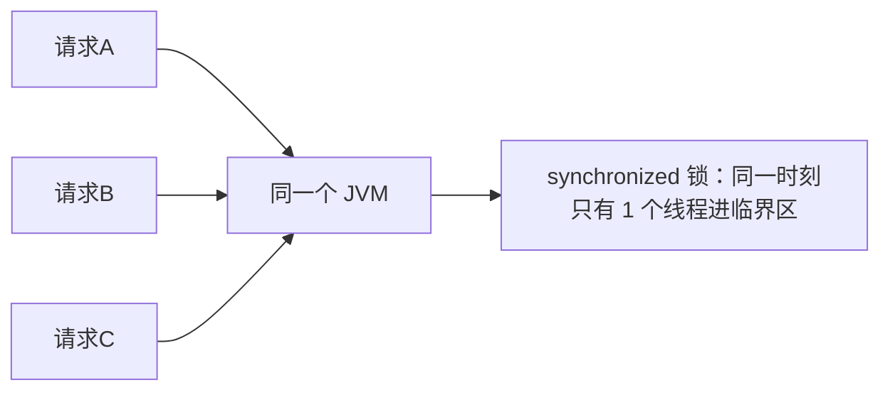
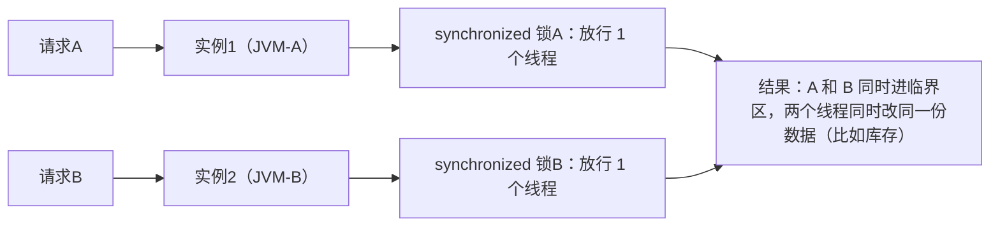
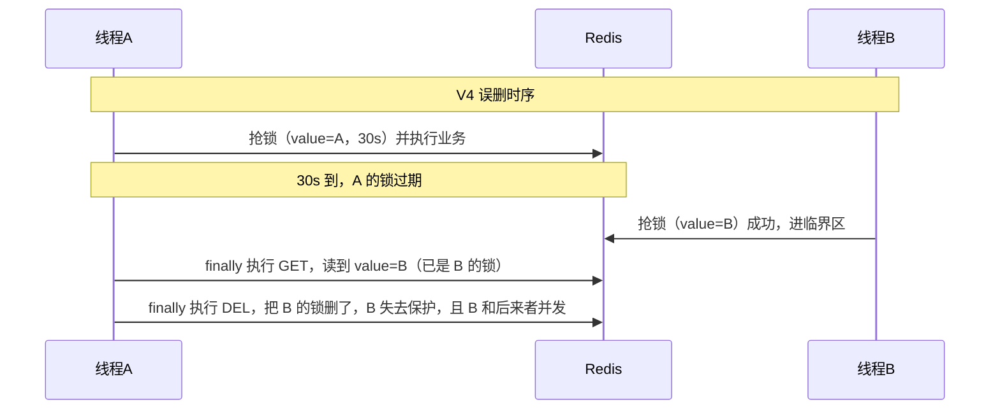
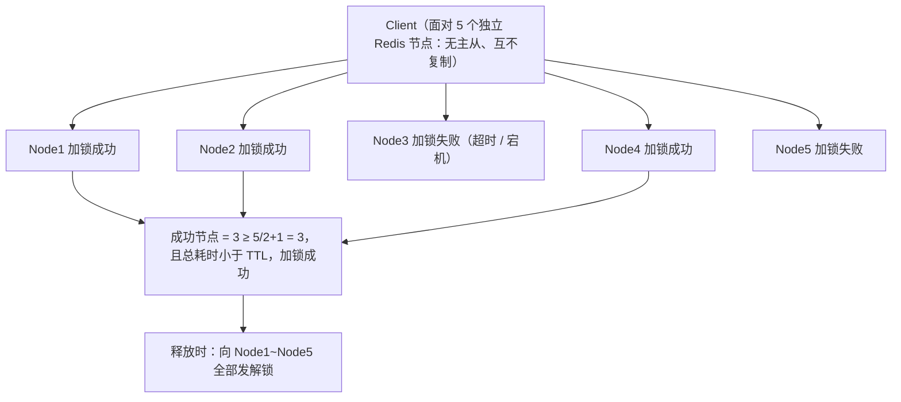

# 06 分布式锁实战

> 本篇导读：单机应用的 `synchronized` 在微服务多实例部署下彻底失效——因为锁只管得住自己那个 JVM。本篇像讲故事一样，从一个最朴素、会死锁的写法出发，一路踩坑、一路改进，走过 7 个版本，最终得到一个接近 Redisson 生产可用思路的分布式锁：原子加锁、防死锁、防误删、看门狗续期、可重入。读完你不仅能写出锁，更能讲清"每一步为什么这么改"。本篇代码基于 JDK 17 + Spring Boot 3.5.5 + Redis 7.x + Lettuce。

## 本篇要解决的问题

- 为什么本地 `ReentrantLock` / `synchronized` 在分布式部署下没用？
- 分布式锁到底"锁"在哪儿？本质是什么？
- 一个能用的分布式锁必须满足哪些条件？缺一不可？
- 从 `SETNX + DEL` 到"可重入 + 看门狗"，中间每一版解决了什么、又留下什么坑？
- Redlock 红锁是什么、为什么有争议、`RedissonRedLock` 为什么被弃用？
- MySQL / Redis / Zookeeper 三种锁怎么选？常见坑有哪些？

## 一、为什么本地锁失效

### 1.1 一个生活化比喻：两个房间两把锁

`synchronized` 就像你家门上的锁，只管"进你家门的人"。现在你有**两套房**（两个 JVM 实例），各装一把锁。小偷（并发请求）同时从两套房的前门进，每套房各自只放一个人——看起来每把锁都"生效"了，但其实**两个小偷同时进了两套不同的房**。要防住，得有一把"两套房共用、谁都看得到"的锁，比如小区门口的大锁。

### 1.2 文本图：单体 vs 微服务多实例





### 1.3 本地锁示例代码（只在当前 JVM 内有效）

```java
package com.canoe.redis.locklocal;

import java.util.concurrent.locks.ReentrantLock;

public class LocalLockDemo {

    // 这把锁只存在于"当前这个 JVM 进程"的内存里
    private final ReentrantLock lock = new ReentrantLock();

    public void deductStock(Long productId) {
        lock.lock();            // 只拦住"同一个 JVM 内的其他线程"
        try {
            // 临界区：扣库存
            System.out.println("扣库存，线程=" + Thread.currentThread().getName());
        } finally {
            lock.unlock();
        }
    }
}
```

当你把这份代码部署成**两个实例**（两个 JVM），实例 1 的 `lock` 和实例 2 的 `lock` 是**两个完全独立的对象**，互相看不见。并发请求分别打进两个实例时，两把锁各放行一个线程，临界区被同时进入 → 数据不一致。

### 1.4 分布式锁的本质

分布式锁的本质一句话：**在多个 JVM 都能看到的"第三方"里，放一个所有人都能抢、且同一时刻只有一个人能拿到的标记**。这个"第三方"可以是：

- **Redis**（SETNX 抢一个 key）
- **MySQL**（唯一索引插入 / `for update` 行锁）
- **Zookeeper**（临时顺序节点）

只要这个标记"存在"就代表锁被占，"不存在"就能抢。本篇主角是 Redis。

## 二、分布式锁必须满足的条件

不是"能 SET 一个 key"就叫分布式锁。下面这些条件**缺一个都可能出生产事故**：

| 条件 | 含义 | 不满足会怎样 |
| --- | --- | --- |
| **互斥性** | 同一时刻只有一个客户端能持有锁 | 多个线程同时进临界区，数据错乱 |
| **防死锁（自动释放）** | 客户端崩溃后锁必须能自动过期释放 | 持有者宕机 → 锁永远在 → 别人全卡死 |
| **解铃还须系铃人** | 只能释放自己加的锁，不能删别人的 | A 的锁过期，B 拿到，A 回头把 B 的锁删了 → 并发 |
| **可重入** | 同一线程可多次加同一把锁 | 方法嵌套调用时自己把自己锁死 |
| **高可用** | 锁服务本身不能轻易挂 | Redis 挂了 → 全员拿不到锁或都拿到 |
| **高性能** | 加锁/释放开销小 | 高并发下锁成为瓶颈 |
| **锁粒度合理** | 锁该锁的最小范围（如 `product:1`） | 锁太大 → 并发度暴跌；锁太小 → 漏保护 |

::: tip 一句话
好锁 = 抢得到、自动放、不误删、能重入、服务稳。后面 7 个版本，就是逐条把这些条件补齐的过程。
:::

## 三、七个版本的演进（本篇精华）

每一版都给**完整 Java 代码**，并明确说清"上一版有什么致命缺陷、这一版怎么解决"。请按顺序读，演进感是最好的理解方式。

### V1：SETNX + 业务 + DEL（会死锁）

最朴素的想法：用 `SETNX lock 1`（SET if Not eXists）抢锁，抢到就执行业务，完了 `DEL` 释放。

```java
package com.canoe.redis.lock.v1;

import org.springframework.data.redis.core.StringRedisTemplate;
import org.springframework.stereotype.Component;

@Component
public class V1Lock {

    private final StringRedisTemplate redisTemplate;

    public V1Lock(StringRedisTemplate redisTemplate) {
        this.redisTemplate = redisTemplate;
    }

    private static final String LOCK_KEY = "lock:order";

    public void doBusiness() {
        // 1) 抢锁：key 不存在才能设成功
        Boolean ok = redisTemplate.opsForValue().setIfAbsent(LOCK_KEY, "1");
        if (Boolean.FALSE.equals(ok)) {
            return;   // 没抢到，直接返回（或抛异常）
        }
        try {
            // 2) 临界区业务
            System.out.println("V1 执行业务");
        } finally {
            // 3) 释锁
            redisTemplate.delete(LOCK_KEY);
        }
    }
}
```

**致命缺陷（死锁）**：如果业务执行中**抛异常**，或者持有锁的实例**突然宕机**，`finally` 里的 `DEL` 永远不会执行 → 锁永远留在 Redis → 所有其他线程永远抢不到 → **死锁，整个功能卡死**。

```text
V1 时序：
线程A 抢到锁 ──► 执行业务 ──► 宕机/异常 ──► DEL 没执行 ──► 锁永久在 ❌
线程B/C/D 永远 setIfAbsent=false ──► 全部拿不到锁，卡死
```

### V2：SETNX + EXPIRE（两条命令非原子，仍会死锁）

给锁加一个过期时间，这样即使不主动删，时间一到自动释放。问题在于：SETNX 和 EXPIRE 是**两条命令**。

```java
package com.canoe.redis.lock.v2;

import org.springframework.data.redis.core.StringRedisTemplate;
import org.springframework.stereotype.Component;
import java.util.concurrent.TimeUnit;

@Component
public class V2Lock {

    private final StringRedisTemplate redisTemplate;

    public V2Lock(StringRedisTemplate redisTemplate) {
        this.redisTemplate = redisTemplate;
    }

    private static final String LOCK_KEY = "lock:order";

    public void doBusiness() {
        Boolean ok = redisTemplate.opsForValue().setIfAbsent(LOCK_KEY, "1");
        if (Boolean.FALSE.equals(ok)) {
            return;
        }
        // ❌ 危险：加分隔的两步
        redisTemplate.expire(LOCK_KEY, 30, TimeUnit.SECONDS);   // 第二步
        try {
            System.out.println("V2 执行业务");
        } finally {
            redisTemplate.delete(LOCK_KEY);
        }
    }
}
```

**致命缺陷（仍会死锁）**：如果实例在 `setIfAbsent` **成功之后、`expire` 执行之前**宕机，锁依然没有过期时间 → 又回到 V1 的死锁。根因是"加锁"和"设过期"不是原子操作。

```text
V2 时序（非原子）：
线程A  setIfAbsent 成功 ──► 实例宕机 ──► expire 没执行 ──► 锁无 TTL ❌ 死锁
```

### V3：SET key value NX EX 30（一条原子命令，Redis 2.6.12+）

Redis 2.6.12 起，`SET` 命令支持 `NX`（不存在才设）和 `EX`（过期秒数）**同时生效**，一条命令搞定"加锁 + 设过期"，天然原子。

```java
package com.canoe.redis.lock.v3;

import org.springframework.data.redis.core.StringRedisTemplate;
import org.springframework.stereotype.Component;
import java.util.concurrent.TimeUnit;

@Component
public class V3Lock {

    private final StringRedisTemplate redisTemplate;

    public V3Lock(StringRedisTemplate redisTemplate) {
        this.redisTemplate = redisTemplate;
    }

    private static final String LOCK_KEY = "lock:order";

    public void doBusiness() {
        // ✅ 一条命令：不存在才设，且立刻带 30 秒过期（原子，杜绝 V2 死锁）
        Boolean ok = redisTemplate.opsForValue()
                .setIfAbsent(LOCK_KEY, "1", 30, TimeUnit.SECONDS);
        if (Boolean.FALSE.equals(ok)) {
            return;
        }
        try {
            System.out.println("V3 执行业务");
        } finally {
            redisTemplate.delete(LOCK_KEY);
        }
    }
}
```

参数速查：

| 参数 | 含义 |
| --- | --- |
| `NX` | Not eXists，key 不存在才设置（等价于 SETNX） |
| `XX` | 仅当 key 已存在才设置 |
| `EX <秒>` | 过期时间（秒） |
| `PX <毫秒>` | 过期时间（毫秒） |
| `KEEPTTL` | 保留原有 TTL（Redis 6.0+，SET 时不覆盖已有过期） |

**仍存在缺陷（业务超时被别人抢走）**：锁过期时间是固定的 30 秒。如果业务真的执行了 **40 秒**（慢 SQL、Full GC、网络抖动），锁在 30 秒时**自己过期了**，线程 B 抢到锁进临界区；此时线程 A 还在跑，40 秒时 A 执行完 `finally` 里的 `DEL`，把 **B 的锁删了** → B 和后来者又并发了。而且 A、B 同时临界区，数据错乱。

```text
V3 时序（过期竞态）：
线程A 抢锁(30s) ──► 执行业务(耗时40s)
         │ 30s 到，锁自动过期
线程B 抢锁成功 ──► 进临界区 ❌（A 还在跑）
线程A 跑完 ──► DEL 把 B 的锁删了 ❌ B 的临界区失去保护
```

### V4：value 放 UUID，释放时先 GET 判断再 DEL（GET/DEL 非原子，仍误删）

为了"解铃还须系铃人"，给锁的 value 放一个**唯一标识**（如 UUID），释放时先 `GET` 看是不是自己的，是再 `DEL`。

```java
package com.canoe.redis.lock.v4;

import org.springframework.data.redis.core.StringRedisTemplate;
import org.springframework.stereotype.Component;
import java.util.UUID;
import java.util.concurrent.TimeUnit;

@Component
public class V4Lock {

    private final StringRedisTemplate redisTemplate;

    public V4Lock(StringRedisTemplate redisTemplate) {
        this.redisTemplate = redisTemplate;
    }

    private static final String LOCK_KEY = "lock:order";

    public void doBusiness() {
        String value = UUID.randomUUID().toString();   // 自己的唯一标识
        Boolean ok = redisTemplate.opsForValue()
                .setIfAbsent(LOCK_KEY, value, 30, TimeUnit.SECONDS);
        if (Boolean.FALSE.equals(ok)) {
            return;
        }
        try {
            System.out.println("V4 执行业务");
        } finally {
            // 释放前先判断：是不是自己加的锁
            String current = redisTemplate.opsForValue().get(LOCK_KEY);
            if (value.equals(current)) {
                redisTemplate.delete(LOCK_KEY);   // 是自己的才删
            }
        }
    }
}
```

**致命缺陷（GET 和 DEL 非原子，仍会误删）**：`GET` 和 `DEL` 是两步。时序如下：



根因：`if (value.equals(current)) { delete }` 这一"判断 + 删除"不是原子的，判断完到删除之间，锁可能刚好被 Redis 过期、被别人拿走。

### V5：用 Lua 脚本把"判断 + 删除"合成原子操作

Redis 执行 **Lua 脚本是单线程、原子**的——脚本里要么全做、要么全不做，中间不会被别的命令插队。把"GET 对比 + DEL"写进 Lua，彻底解决 V4 误删。

```java
package com.canoe.redis.lock.v5;

import org.springframework.data.redis.core.StringRedisTemplate;
import org.springframework.core.io.ClassPathResource;
import org.springframework.data.redis.core.script.DefaultRedisScript;
import org.springframework.data.redis.core.script.RedisScript;
import org.springframework.scripting.support.ResourceScriptSource;
import org.springframework.stereotype.Component;
import java.util.Collections;
import java.util.UUID;
import java.util.concurrent.TimeUnit;

@Component
public class V5Lock {

    private final StringRedisTemplate redisTemplate;

    // 释放锁的 Lua 脚本：只有 value 匹配才删除（原子执行）
    // KEYS[1]=锁名, ARGV[1]=自己的 value
    private final RedisScript<Long> UNLOCK_SCRIPT = new DefaultRedisScript<>(
            "if redis.call('get', KEYS[1]) == ARGV[1] then "
          + "    return redis.call('del', KEYS[1]) "
          + "else "
          + "    return 0 "
          + "end", Long.class);

    public V5Lock(StringRedisTemplate redisTemplate) {
        this.redisTemplate = redisTemplate;
    }

    private static final String LOCK_KEY = "lock:order";

    public void doBusiness() {
        String value = UUID.randomUUID().toString();
        Boolean ok = redisTemplate.opsForValue()
                .setIfAbsent(LOCK_KEY, value, 30, TimeUnit.SECONDS);
        if (Boolean.FALSE.equals(ok)) {
            return;
        }
        try {
            System.out.println("V5 执行业务");
        } finally {
            // ✅ 原子释放：只有 value 是自己才删
            redisTemplate.execute(UNLOCK_SCRIPT,
                    Collections.singletonList(LOCK_KEY), value);
        }
    }
}
```

::: tip Lua 为什么能解决
Redis 单线程执行 Lua，脚本内的 `get` 和 `del` 之间**不会被任何其他客户端命令插入**，所以"判断是不是自己的"和"删除"是同一原子动作，不可能出现 V4 的误删窗口。
:::

**仍存在缺陷**：锁过期时间还是**写死的 30 秒**。业务万一超过 30 秒（且这次不会误删了，因为 V5 锁不会乱删别人的），但锁过期后别人照样能抢走 → 还是并发。治本得让锁"在业务没跑完时自动续期"。

### V6：看门狗自动续期（锁快过期时后台线程延长）

思路：加锁成功后，起一个**后台线程（看门狗）**，每隔 `leaseTime/3` 就给锁**刷新一次过期时间**。只要业务还在跑，锁就一直活着；业务结束主动取消看门狗，锁自然过期释放。这正是 **Redisson 看门狗**的实现思想（默认锁 30 秒、每 10 秒续一次）。

```java
package com.canoe.redis.lock.v6;

import org.springframework.data.redis.core.StringRedisTemplate;
import org.springframework.data.redis.core.script.RedisScript;
import org.springframework.stereotype.Component;
import java.util.Collections;
import java.util.UUID;
import java.util.concurrent.Executors;
import java.util.concurrent.ScheduledExecutorService;
import java.util.concurrent.ScheduledFuture;
import java.util.concurrent.TimeUnit;

@Component
public class V6Lock {

    private final StringRedisTemplate redisTemplate;

    private final RedisScript<Long> UNLOCK_SCRIPT = new RedisScript<>() {
        @Override
        public String getSha1() { return null; }
        @Override
        public Class<Long> getResultType() { return Long.class; }
        @Override
        public String getScriptAsString() {
            return "if redis.call('get', KEYS[1]) == ARGV[1] then "
                 + "    return redis.call('del', KEYS[1]) "
                 + "else return 0 end";
        }
    };

    // 续期脚本：只有 value 匹配才刷新过期时间
    private final RedisScript<Long> RENEW_SCRIPT = new RedisScript<>() {
        @Override
        public String getSha1() { return null; }
        @Override
        public Class<Long> getResultType() { return Long.class; }
        @Override
        public String getScriptAsString() {
            return "if redis.call('get', KEYS[1]) == ARGV[1] then "
                 + "    return redis.call('expire', KEYS[1], ARGV[2]) "
                 + "else return 0 end";
        }
    };

    private final ScheduledExecutorService watchdog = Executors.newScheduledThreadPool(1);

    public V6Lock(StringRedisTemplate redisTemplate) {
        this.redisTemplate = redisTemplate;
    }

    private static final String LOCK_KEY = "lock:order";
    private static final long LEASE_SECONDS = 30;   // 锁初始 30 秒

    public void doBusiness() {
        String value = UUID.randomUUID().toString();
        Boolean ok = redisTemplate.opsForValue()
                .setIfAbsent(LOCK_KEY, value, LEASE_SECONDS, TimeUnit.SECONDS);
        if (Boolean.FALSE.equals(ok)) {
            return;
        }

        // ✅ 启动看门狗：每 10 秒（= LEASE/3）续一次期，把过期刷新回 30 秒
        ScheduledFuture<?> future = watchdog.scheduleAtFixedRate(() -> {
            redisTemplate.execute(RENEW_SCRIPT,
                    Collections.singletonList(LOCK_KEY),
                    value, String.valueOf(LEASE_SECONDS));
        }, LEASE_SECONDS / 3, LEASE_SECONDS / 3, TimeUnit.SECONDS);

        try {
            System.out.println("V6 执行业务（锁会被看门狗续期）");
        } finally {
            // ⚠️ 业务结束必须取消看门狗，否则线程一直跑 → 线程泄漏
            future.cancel(true);
            redisTemplate.execute(UNLOCK_SCRIPT,
                    Collections.singletonList(LOCK_KEY), value);
        }
    }
}
```

::: danger 必须主动取消看门狗，否则线程泄漏
`future.cancel(true)` 是关键。如果不取消，后台续期线程会一直跑，每 10 秒去 Redis 刷一次过期，即使业务早结束了——**线程泄漏、Redis 里锁永不过期**。Redisson 在 `unlock()` 内部自动 `cancel` 看门狗，你自己写一定要记得。
:::

**仍存在缺陷（不可重入）**：如果同一个线程在持锁期间**再次**调用加同一把锁的方法（方法嵌套），`setIfAbsent` 会返回 false（因为 key 已存在是自己刚设的），线程**把自己锁死**（自己等自己释放，死锁）。真正的生产锁要支持"同一线程多次加锁"。

### V7：可重入（Hash 结构 + HINCRBY）

可重入 = 同一线程可多次获取同一把锁，每加一次"重入计数 +1"，释放时 -1，减到 0 才真正删锁。底层用 **Hash**：`key=锁名`，`field=线程标识`，`value=重入次数`。思想和 JDK `ReentrantLock` 里 AQS 的 `state` 计数完全一致。

**加锁 Lua（可重入）**：

```lua
-- KEYS[1]=锁名  ARGV[1]=过期秒数  ARGV[2]=线程标识(如 UUID:threadId)
if (redis.call('exists', KEYS[1]) == 0) then
    -- 锁不存在：设 Hash，field=线程标识，value=1，并设过期
    redis.call('hset', KEYS[1], ARGV[2], 1)
    redis.call('expire', KEYS[1], ARGV[1])
    return 1
end
if (redis.call('hexists', KEYS[1], ARGV[2]) == 1) then
    -- 锁存在且是自己：重入计数 +1，并刷新过期
    redis.call('hincrby', KEYS[1], ARGV[2], 1)
    redis.call('expire', KEYS[1], ARGV[1])
    return 1
end
-- 锁被别人持有：加锁失败
return 0
```

**解锁 Lua（可重入）**：

```lua
-- KEYS[1]=锁名  ARGV[1]=线程标识
if (redis.call('hexists', KEYS[1], ARGV[1]) == 0) then
    -- 不是自己的锁，直接返回
    return 0
end
-- 重入计数 -1
local cnt = redis.call('hincrby', KEYS[1], ARGV[1], -1)
if (cnt > 0) then
    -- 还有重入层没释放，只刷新过期不删
    redis.call('expire', KEYS[1], ARGV[2])
    return 1
else
    -- 减到 0，真正删除锁
    redis.call('del', KEYS[1])
    return 1
end
```

**V7 完整 Java 实现**：

```java
package com.canoe.redis.lock.v7;

import org.springframework.data.redis.core.StringRedisTemplate;
import org.springframework.data.redis.core.script.DefaultRedisScript;
import org.springframework.data.redis.core.script.RedisScript;
import org.springframework.stereotype.Component;
import java.util.Collections;
import java.util.UUID;
import java.util.concurrent.TimeUnit;

@Component
public class V7ReentrantLock {

    private final StringRedisTemplate redisTemplate;

    // 加锁 Lua：不存在则设 Hash(value=1) 并过期；是自己则重入 +1 并刷新过期
    private static final String LOCK_LUA =
            "if (redis.call('exists', KEYS[1]) == 0) then "
          + "    redis.call('hset', KEYS[1], ARGV[2], 1) "
          + "    redis.call('expire', KEYS[1], ARGV[1]) "
          + "    return 1 "
          + "end "
          + "if (redis.call('hexists', KEYS[1], ARGV[2]) == 1) then "
          + "    redis.call('hincrby', KEYS[1], ARGV[2], 1) "
          + "    redis.call('expire', KEYS[1], ARGV[1]) "
          + "    return 1 "
          + "end "
          + "return 0";

    // 解锁 Lua：是自己则重入 -1，减到 0 才删；否则返回 0
    private static final String UNLOCK_LUA =
            "if (redis.call('hexists', KEYS[1], ARGV[1]) == 0) then "
          + "    return 0 "
          + "end "
          + "local cnt = redis.call('hincrby', KEYS[1], ARGV[1], -1) "
          + "if (cnt > 0) then "
          + "    redis.call('expire', KEYS[1], ARGV[2]) "
          + "    return 1 "
          + "else "
          + "    redis.call('del', KEYS[1]) "
          + "    return 1 "
          + "end";

    private final RedisScript<Long> lockScript = new DefaultRedisScript<>(LOCK_LUA, Long.class);
    private final RedisScript<Long> unlockScript = new DefaultRedisScript<>(UNLOCK_LUA, Long.class);

    public V7ReentrantLock(StringRedisTemplate redisTemplate) {
        this.redisTemplate = redisTemplate;
    }

    private static final String LOCK_KEY = "lock:order";
    private static final long LEASE_SECONDS = 30;

    /** 加锁：用 UUID:threadId 作为线程标识，支持可重入 */
    public boolean lock() {
        String threadId = UUID.randomUUID() + ":" + Thread.currentThread().getId();
        Long result = redisTemplate.execute(lockScript,
                Collections.singletonList(LOCK_KEY),
                String.valueOf(LEASE_SECONDS), threadId);
        return result != null && result == 1L;
    }

    /** 解锁：带上同一线程标识 */
    public void unlock() {
        String threadId = UUID.randomUUID() + ":" + Thread.currentThread().getId();
        redisTemplate.execute(unlockScript,
                Collections.singletonList(LOCK_KEY),
                threadId, String.valueOf(LEASE_SECONDS));
    }

    public void doBusiness() {
        if (!lock()) {
            System.out.println("没抢到锁，跳过");
            return;
        }
        try {
            System.out.println("V7 执行业务");
            nestedCall();   // 可重入：同一线程再次加锁不会死锁
        } finally {
            unlock();
        }
    }

    // 嵌套调用：再次加同一把锁（可重入演示）
    private void nestedCall() {
        if (lock()) {
            try {
                System.out.println("V7 嵌套调用，重入计数=2");
            } finally {
                unlock();
            }
        }
    }
}
```

::: tip 和 JDK ReentrantLock 是同一个思想
JDK `ReentrantLock` 内部用 AQS 的 `state` 整数记"重入次数"：加锁 `state++`，解锁 `state--`，减到 0 才释放。V7 用 Redis Hash 的 `value` 当这个 `state`，**思想一模一样**，只是把计数从 JVM 内存搬到了 Redis，让多实例共享。
:::

### 演进总结表

| 版本 | 解决什么问题 | 还留下什么问题 |
| --- | --- | --- |
| V1 | 最朴素抢锁 | 宕机/异常 → 锁永不释放 → **死锁** |
| V2 | 加过期时间 | SETNX+EXPIRE 非原子，中间宕机仍**死锁** |
| V3 | 一条命令原子加锁+过期 | 锁过期时间固定，业务超时 → 别人抢走、并发 |
| V4 | value 放标识，防误删 | GET+DEL 非原子，判断窗口仍**误删别人锁** |
| V5 | Lua 原子"判断+删" | 过期时间仍写死，业务超时被抢 |
| V6 | 看门狗自动续期 | **不可重入**，自调用会死锁 |
| V7 | Hash+Lua 可重入 | 已基本可用；但单机 Redis 仍有主从切换丢锁风险（见 Redlock） |

### 补充 1：阻塞式抢锁 vs 直接失败

上面版本都是"抢不到就立刻返回（非阻塞）"。生产常要"抢不到就**自旋等待**一小会儿，超过总超时干脆放弃"。

```java
package com.canoe.redis.lock;

import org.springframework.data.redis.core.StringRedisTemplate;
import org.springframework.data.redis.core.script.RedisScript;
import org.springframework.stereotype.Component;
import java.util.Collections;
import java.util.UUID;
import java.util.concurrent.TimeUnit;

@Component
public class BlockingLock {

    private final StringRedisTemplate redisTemplate;
    private final RedisScript<Long> lockScript;
    private final RedisScript<Long> unlockScript;

    public BlockingLock(StringRedisTemplate redisTemplate) {
        this.redisTemplate = redisTemplate;
        this.lockScript = new RedisScript<>() {
            public String getSha1() { return null; }
            public Class<Long> getResultType() { return Long.class; }
            public String getScriptAsString() {
                return "if (redis.call('exists', KEYS[1]) == 0) then "
                     + "    redis.call('hset', KEYS[1], ARGV[2], 1) "
                     + "    redis.call('expire', KEYS[1], ARGV[1]) return 1 end "
                     + "if (redis.call('hexists', KEYS[1], ARGV[2]) == 1) then "
                     + "    redis.call('hincrby', KEYS[1], ARGV[2], 1) "
                     + "    redis.call('expire', KEYS[1], ARGV[1]) return 1 end return 0";
            }
        };
        this.unlockScript = new RedisScript<>() {
            public String getSha1() { return null; }
            public Class<Long> getResultType() { return Long.class; }
            public String getScriptAsString() {
                return "if (redis.call('hexists', KEYS[1], ARGV[1]) == 0) then return 0 end "
                     + "local cnt = redis.call('hincrby', KEYS[1], ARGV[1], -1) "
                     + "if (cnt > 0) then redis.call('expire', KEYS[1], ARGV[2]) return 1 "
                     + "else redis.call('del', KEYS[1]) return 1 end";
            }
        };
    }

    private static final String LOCK_KEY = "lock:order";
    private static final long LEASE_SECONDS = 30;

    /** 阻塞式抢锁：最多等 waitMillis 毫秒，期间自旋+sleep；超时才放弃 */
    public boolean tryLock(long waitMillis) throws InterruptedException {
        long deadline = System.currentTimeMillis() + waitMillis;
        String threadId = UUID.randomUUID() + ":" + Thread.currentThread().getId();
        while (System.currentTimeMillis() < deadline) {
            Long r = redisTemplate.execute(lockScript,
                    Collections.singletonList(LOCK_KEY),
                    String.valueOf(LEASE_SECONDS), threadId);
            if (r != null && r == 1L) {
                return true;   // 抢到
            }
            Thread.sleep(50);  // 没抢到，睡 50ms 再试（避免空转烧 CPU）
        }
        return false;          // 超时放弃
    }

    public void unlock() {
        String threadId = UUID.randomUUID() + ":" + Thread.currentThread().getId();
        redisTemplate.execute(unlockScript,
                Collections.singletonList(LOCK_KEY), threadId, String.valueOf(LEASE_SECONDS));
    }
}
```

::: warning 自旋 sleep 别太短
自旋里 `Thread.sleep(50)` 是必须的，否则会在 while 里疯狂打 Redis（空转），反而把 Redis 压垮。等待间隔按业务敏感度调，一般 10~100ms。
:::

### 补充 2：锁粒度——锁 `product:1` 而不是锁 `product`

**反例**：用同一个锁名 `lock:product` 保护所有商品的库存操作。结果：用户 A 买商品 1、用户 B 买商品 2，明明是两条**互不相干**的数据，却被同一把大锁串行化 → 并发度暴跌。

```java
// ❌ 反例：所有商品共用一把锁，互不相干的操作也被串行
private static final String LOCK_KEY = "lock:product";

// ✅ 正确：锁名带具体商品 id，只锁"这一件商品"
private String lockKey(Long productId) {
    return "lock:product:" + productId;   // 锁 product:1、product:2 互不影响
}
```

::: tip 锁粒度口诀
锁的范围 = 你真正要保护的数据的最小边界。扣哪个商品的库存，就锁哪个商品的 id，别一把大锁锁住整个表。
:::

## 四、一个生产可用的 RedisDistributedLock 工具类

把前面 7 版的长处合起来：原子加锁、**可重入**、**看门狗续期**、`tryLock` 带超时、Lua 原子解锁。下面给一个可直接拷进项目的工具类（含 Javadoc 与全部 import）。

```java
package com.canoe.redis.lock;

import java.util.Collections;
import java.util.UUID;
import java.util.concurrent.Executors;
import java.util.concurrent.ScheduledExecutorService;
import java.util.concurrent.ScheduledFuture;
import java.util.concurrent.TimeUnit;
import org.springframework.data.redis.core.StringRedisTemplate;
import org.springframework.data.redis.core.script.DefaultRedisScript;
import org.springframework.data.redis.core.script.RedisScript;

/**
 * 基于 Redis 的分布式锁工具类（教学版，思路对齐 Redisson）。
 *
 * <p>特性：
 * 1) 原子加锁：SET + NX + EX 思想，用 Lua 实现可重入（Hash 结构）。
 * 2) 防误删：解锁用 Lua 原子判断线程标识。
 * 3) 看门狗：业务未结束自动续期，避免固定 TTL 被业务超时被抢。
 * 4) 可重入：同一线程多次加锁，计数 +1，全释放才删。
 *
 * <p>注意：本类未含 Redlock 多节点容错，单机 Redis 主从切换仍可能丢锁（见第 6 节）。
 */
public class RedisDistributedLock {

    /** 加锁 Lua：不存在则设 Hash(value=1)+过期；是自己则重入+1+刷新过期 */
    private static final String LOCK_LUA =
            "if (redis.call('exists', KEYS[1]) == 0) then "
          + "    redis.call('hset', KEYS[1], ARGV[2], 1) "
          + "    redis.call('expire', KEYS[1], ARGV[1]) return 1 end "
          + "if (redis.call('hexists', KEYS[1], ARGV[2]) == 1) then "
          + "    redis.call('hincrby', KEYS[1], ARGV[2], 1) "
          + "    redis.call('expire', KEYS[1], ARGV[1]) return 1 end return 0";

    /** 解锁 Lua：是自己则重入-1，减到0才删；否则返回0 */
    private static final String UNLOCK_LUA =
            "if (redis.call('hexists', KEYS[1], ARGV[1]) == 0) then return 0 end "
          + "local cnt = redis.call('hincrby', KEYS[1], ARGV[1], -1) "
          + "if (cnt > 0) then redis.call('expire', KEYS[1], ARGV[2]) return 1 "
          + "else redis.call('del', KEYS[1]) return 1 end";

    /** 续期 Lua：只有 value 匹配才刷新过期 */
    private static final String RENEW_LUA =
            "if (redis.call('get', KEYS[1]) == ARGV[1]) then "
          + "    return redis.call('expire', KEYS[1], ARGV[2]) else return 0 end";

    private final StringRedisTemplate redisTemplate;
    private final RedisScript<Long> lockScript = new DefaultRedisScript<>(LOCK_LUA, Long.class);
    private final RedisScript<Long> unlockScript = new DefaultRedisScript<>(UNLOCK_LUA, Long.class);
    private final RedisScript<Long> renewScript = new DefaultRedisScript<>(RENEW_LUA, Long.class);

    /** 看门狗线程池（生产建议用独立线程池，别和業务共用） */
    private final ScheduledExecutorService watchdog = Executors.newScheduledThreadPool(2);

    /** 看门狗续期间隔 = 锁租期 / 3 */
    private final long leaseSeconds;
    private final long renewIntervalMs;

    /** 当前线程持有的锁标识（用于看门狗续期与解锁） */
    private final ThreadLocal<String> lockValue = new ThreadLocal<>();
    private final ThreadLocal<ScheduledFuture<?>> renewTask = new ThreadLocal<>();

    public RedisDistributedLock(StringRedisTemplate redisTemplate, long leaseSeconds) {
        this.redisTemplate = redisTemplate;
        this.leaseSeconds = leaseSeconds;
        this.renewIntervalMs = leaseSeconds * 1000 / 3;
    }

    /**
     * 加锁（阻塞式）：自旋等待直到抢到或超时。
     *
     * @param waitMillis 最多等待的毫秒数
     * @return 是否成功拿到锁
     */
    public boolean tryLock(long waitMillis) throws InterruptedException {
        long deadline = System.currentTimeMillis() + waitMillis;
        String value = UUID.randomUUID() + ":" + Thread.currentThread().getId();
        while (System.currentTimeMillis() < deadline) {
            Long r = redisTemplate.execute(lockScript,
                    Collections.singletonList(getLockKey()), String.valueOf(leaseSeconds), value);
            if (r != null && r == 1L) {
                lockValue.set(value);
                startWatchdog(value);   // 启动看门狗续期
                return true;
            }
            TimeUnit.MILLISECONDS.sleep(50);
        }
        return false;
    }

    /** 启动看门狗：每 lease/3 续一次期 */
    private void startWatchdog(String value) {
        ScheduledFuture<?> future = watchdog.scheduleAtFixedRate(() -> {
            redisTemplate.execute(renewScript,
                    Collections.singletonList(getLockKey()), value, String.valueOf(leaseSeconds));
        }, renewIntervalMs, renewIntervalMs, TimeUnit.MILLISECONDS);
        renewTask.set(future);
    }

    /** 释放锁：取消看门狗 + Lua 原子解锁 */
    public void unlock() {
        String value = lockValue.get();
        if (value == null) {
            return;
        }
        ScheduledFuture<?> future = renewTask.get();
        if (future != null) {
            future.cancel(true);   // ⚠️ 必须取消看门狗，否则线程泄漏
        }
        redisTemplate.execute(unlockScript,
                Collections.singletonList(getLockKey()), value, String.valueOf(leaseSeconds));
        lockValue.remove();
        renewTask.remove();
    }

    /** 子类/调用方覆盖此方法以指定锁名（默认 lock:default） */
    protected String getLockKey() {
        return "lock:default";
    }
}
```

::: warning 子类需重写 getLockKey
上面基类 `getLockKey()` 返回固定名。真实使用请让调用方传入具体锁名（如 `lock:product:1`），或把锁名作为构造参数。否则所有锁共用一个 key = 锁粒度过大。
:::

**使用示例 1：下单防重复提交（同一订单号并发只处理一次）**

```java
package com.canoe.redis.lock;

import org.springframework.data.redis.core.StringRedisTemplate;
import org.springframework.stereotype.Service;

@Service
public class OrderService {

    private final StringRedisTemplate redisTemplate;

    public OrderService(StringRedisTemplate redisTemplate) {
        this.redisTemplate = redisTemplate;
    }

    /** 同一 orderNo 并发提交，只有第一个能处理，其余直接拒绝（防重复下单） */
    public String submitOrder(String orderNo) throws InterruptedException {
        // 锁名带上订单号，粒度最小化
        RedisDistributedLock lock = new RedisDistributedLock(redisTemplate, 30) {
            @Override
            protected String getLockKey() {
                return "lock:order:" + orderNo;   // 锁具体订单号
            }
        };
        if (!lock.tryLock(3000)) {   // 最多等 3 秒
            return "重复提交，请稍后再试";
        }
        try {
            // 临界区：真正的下单逻辑（查重、落库、扣库存）
            return "下单成功，orderNo=" + orderNo;
        } finally {
            lock.unlock();   // 务必在 finally 释放
        }
    }
}
```

**使用示例 2：库存扣减**

```java
package com.canoe.redis.lock;

import org.springframework.data.redis.core.StringRedisTemplate;
import org.springframework.stereotype.Service;

@Service
public class StockService {

    private final StringRedisTemplate redisTemplate;

    public StockService(StringRedisTemplate redisTemplate) {
        this.redisTemplate = redisTemplate;
    }

    /** 扣减指定商品库存，分布式锁保证不超卖 */
    public boolean deduct(Long productId, int count) throws InterruptedException {
        RedisDistributedLock lock = new RedisDistributedLock(redisTemplate, 30) {
            @Override
            protected String getLockKey() {
                return "lock:product:" + productId;   // 锁具体商品
            }
        };
        if (!lock.tryLock(3000)) {
            return false;
        }
        try {
            // 简化：用 Redis 计数器当库存（真实应结合 DB + 事务）
            Long stock = redisTemplate.opsForValue().decrement("stock:" + productId, count);
            return stock != null && stock >= 0;
        } finally {
            lock.unlock();
        }
    }
}
```

**压测验证思路**

可以用 JMeter 或简单 curl 循环并发打同一个订单号/商品，观察：只有一次真正"下单成功"，其余返回"重复提交"。也可写单元测试用线程池并发调用 `submitOrder` 同一 `orderNo`，断言只有一个返回成功。

```bash
# 用 xargs 起 20 个并发 curl 打同一个订单号
seq 20 | xargs -P 20 -I{} curl -s "http://localhost:8080/order/submit?orderNo=NO123"
# 期望：只有 1 条"下单成功"，其余 19 条"重复提交"
```

## 五、Redlock（红锁）

### 5.1 算法原理

V7 的锁跑在**单个 Redis 节点**上。如果 Redis 是"主从"架构，主节点拿到锁后**异步复制**给从节点；若主节点刚加完锁就宕机、锁还没复制过去，从节点被提升为新主 → **新主上根本没有这把锁** → 别的客户端又能加锁成功 → 并发。Redlock 想解决的就是"单点/主从复制丢锁"的问题。

Redlock 思路：部署 **N 个（一般 5 个）互相独立、无主从关系**的 Redis 节点（各自独立持久化、互不同步）。客户端向每个节点用**相同 key/value** 依次加锁，并满足：

- 向每个节点加锁要有**独立超时**（远小于锁 TTL），避免某个节点卡住拖死整体；
- **超过半数（N/2 + 1，5 个里要 3 个）** 加锁成功，**且总耗时 < 锁的有效时间**，才算加锁成功；
- 释放时向**所有**节点发解锁（不管当初哪个成功）。



### 5.2 争议要点：Martin Kleppmann vs antirez

Redlock 不是没有质疑。2016 年两位大佬的著名辩论：

- **Martin Kleppmann（剑桥）观点**：分布式锁的正确性不能依赖"墙上时钟"（系统时间）。他举了两个反例：
  1. **GC 停顿 / 进程暂停**：客户端 A 拿到锁后发生长时间 GC STW，锁在 A 不知情时已过期，B 拿到了锁；A 恢复后两人同时临界区 → 并发。
  2. **时钟跳跃**：如果某 Redis 节点系统时钟突然跳变（NTP 校正、运维误操作），可能导致锁"提前过期"。
  他认为 Redlock 在"锁有效期内客户端真的在独家运行"这件事上**无法给出强保证**，应改用带 fencing token（单调序号）的方案让存储层自己拒绝旧请求。

- **antirez（Redis 作者）反驳**：Redlock 只需要"近似时钟"即可，且要求"客户端在锁有效期内完成工作"本就是锁的通用前提；fencing token 能缓解但也要业务改造。他认为在合理工程假设下 Redlock 是够用的。

::: tip 本篇立场：不站队
两边都有道理。核心是：Redlock 提升了"少数节点故障"下的可用性，但**没有、也无法**根除"客户端暂停导致锁过期"这类问题。是否采用取决于你对"正确性"的要求有多苛刻。需要真正强一致，请往下看第 7 节的对比。
:::

### 5.3 RedissonRedLock 已被官方标记弃用

::: warning 版本差异请以官方最新文档为准
Redisson 从较新版本起，已将 `RedissonRedLock`（红锁实现）**标记为弃用（deprecated）**。官方理由是：Redlock 依赖的"时钟假设"在生产环境难以严格满足，且其带来的收益相对复杂度不成正比；Redisson 官方更推荐基于**单个 Redis 主节点 + 看门狗**的 `RLock`（见第 07 章），或在真正需要强一致时改用其他协调服务。具体弃用状态与替换建议请以 Redisson 官方最新文档/`RLock` 的 `tryLock` 文档为准：<https://github.com/redisson/redisson>。
:::

### 5.4 面试怎么答：单机锁 → 主从丢锁 → Redlock → 更强一致

把这条逻辑讲顺，面试基本拿分：

```text
1) 单机 Redis 锁：SET NX + Lua 解锁 + 看门狗，足够多数业务。
2) 隐患：主从异步复制，master 加锁后宕机、锁未同步到 slave，
          slave 被提主 → 锁丢失 → 别人又能加锁 → 并发。
3) Redlock：多独立节点，过半成功才算拿到，想挡住"单点故障丢锁"。
4) 但 Redlock 仍有争议（GC 停顿 / 时钟跳跃可能让锁在自己不知情时过期），
   且 Redisson 已弃用 RedissonRedLock。
5) 结论：真要强一致，用 Zookeeper / etcd（基于共识、无时钟假设）
         或数据库唯一索引/for update；否则接受"最终一致 + 看门狗"即可。
```

## 六、三种分布式锁方案对比表

| 维度 | MySQL 锁 | Redis 锁（SETNX+Lua） | Zookeeper 锁（临时顺序节点） |
| --- | --- | --- | --- |
| 性能 | 低（走 DB，有事务/行锁开销） | **高**（内存操作，毫秒级） | 中（需写 ZK，有网络往返） |
| 可靠性 | 高（DB 本身稳） | 中（主从切换可能丢锁） | **高**（ZAB 共识，无时钟假设） |
| 实现复杂度 | 低（SQL 即可） | 中（要写 Lua、看门狗） | 高（Curator 封装后尚可） |
| 是否可重入 | 需自己实现 | 可（Hash+Lua，本篇 V7） | **天然可重入**（Curator 支持） |
| 死锁风险 | 低（DB 有超时/行锁释放） | 有（需 TTL+看门狗兜底） | 低（临时节点，会话断自动删） |
| 典型实现 | 唯一索引 / 乐观锁 / `for update` | `SET key NX EX` + Lua | Curator `InterProcessMutex` |
| 适用场景 | 并发不高、强一致要求 | **高并发、最终一致**主流选 | 强一致、并发适中 |

::: tip 选型一句话
高并发读多写少、能接受短暂不一致 → **Redis 锁**（本篇主角）。并发不高但要绝对稳 → MySQL 锁。强一致不容有失 → Zookeeper/etcd。Redlock 因争议与弃用，非特殊需求不优先。
:::

## 七、常见坑清单

| # | 坑 | 一句话解释 |
| --- | --- | --- |
| 1 | **锁粒度太大** | 锁整个表/整个业务，并发度暴跌；应锁最小数据边界（如 `product:1`） |
| 2 | **忘了 `finally` 释放** | 异常路径不解锁 → 死锁；解锁必须放 `finally` |
| 3 | **锁超时拍脑袋** | TTL 设太短业务没跑完就被抢；建议压测得 P99 耗时 ×2~3，再配看门狗 |
| 4 | **锁写在事务里** | 锁释放了事务还没提交，别人读到未提交/已回滚数据；锁范围要包住"事务提交之后" |
| 5 | **Redis 主从切换丢锁** | 主加锁未同步从就宕机，从提主后锁丢失；需 Redlock 或更强的存储 |
| 6 | **看门狗线程没停** | 不 `cancel` 续期任务 → 线程泄漏、锁永不过期；`unlock` 内必须取消 |
| 7 | **锁名用错** | 多个业务误用同一锁名 → 互不想干的操作被串行；锁名要带业务唯一标识 |

### 7.1 坑 4 详细展开：锁写在事务里

这是最容易翻车的一个。下面反例：方法上加 `@Transactional`，在事务内加锁、解锁。问题在于：Spring 的事务是在方法**返回后**才提交（或回滚），而你的 `unlock()` 在方法结束前就执行了——**锁释放时事务还没提交**。

```java
// ❌ 反例：锁在事务提交前就释放了
@Transactional
public void deductWrong(Long productId) {
    lock.lock();            // 加锁
    try {
        // 扣库存（DB 还没提交）
        stockMapper.decrement(productId);
    } finally {
        lock.unlock();      // 锁释放了！但事务此刻还没提交
    }
    // ← 事务在这里才真正提交
}
// 危险：unlock 后、commit 前，另一个线程抢到锁去读，读到的是"未提交"的旧值
```

正确姿势：**锁的范围要完全包住事务提交**。把"加锁+事务+解锁"放在同一把锁的保护下，且确保 `unlock()` 在事务提交之后。

```java
// ✅ 正确：在外层加锁，内部开事务，锁包住整个事务生命周期
public void deductRight(Long productId) {
    lock.lock();   // 外层加锁（锁范围覆盖事务）
    try {
        deductInTx(productId);   // 内部 @Transactional 真正扣减
    } finally {
        lock.unlock();   // 此时事务已提交，再释放锁
    }
}

@Transactional
public void deductInTx(Long productId) {
    stockMapper.decrement(productId);
}
```

::: danger 关键结论
分布式锁保护的是"临界区数据一致性"，而数据库事务保护的是"ACID"。两者生命周期要**对齐**：锁必须在事务**提交之后**才释放，否则会出现"锁没了但数据还没落地"的窗口，并发线程读到脏/旧数据。
:::

## 本篇小结

- **本地锁只管当前 JVM**：微服务项目多实例时，`synchronized`/`ReentrantLock` 失效，必须用"第三方"共享标记做分布式锁。
- **分布式锁本质**：在 Redis/MySQL/Zookeeper 这类多实例共享的地方放一个"唯一可抢标记"。
- **好锁七条件**：互斥、防死锁、防误删、可重入、高可用、高性能、粒度合理。
- **V1→V7 演进**：SETNX+DEL（死锁）→ +EXPIRE（非原子仍死锁）→ SET NX EX（原子加锁）→ value 标识（GET/DEL 非原子误删）→ Lua 原子解锁 → 看门狗续期 → Hash 可重入。
- **看门狗防业务超时**：锁快过期时后台线程续期，思想是 Redisson 默认 30s 锁、每 10s 续一次。
- **可重入用 Hash + Lua**：`field=线程标识`、`value=重入次数`，思想同 JDK AQS 的 `state`。
- **解锁必须放 `finally` 且取消看门狗**，否则死锁或线程泄漏。
- **锁粒度最小化**：锁 `product:1` 而非 `product`，互不相干操作不被串行。
- **Redlock 红锁**：5 独立节点过半成功才算加锁，但存在 GC/时钟争议，**RedissonRedLock 已被官方标记弃用**。
- **面试主线**：单机锁 → 主从异步复制丢锁 → Redlock 想补 → 仍有争议 → 真强一致用 ZK/etcd 或 DB 锁。
- **三种锁选型**：高并发最终一致用 Redis，强一致用 ZK，并发低要稳用 MySQL。

## 参考链接

- Redis `SET` 命令官方文档（NX/XX/EX/PX）：<https://redis.io/docs/latest/commands/set/>
- Redis Lua 脚本官方文档：<https://redis.io/docs/latest/commands/eval/>
- Redisson 官方文档（RLock / 看门狗）：<https://github.com/redisson/redisson>
- Martin Kleppmann 关于 Redlock 的分析（How to do distributed locking）：<https://martin.kleppmann.com/2016/02/08/how-to-do-distributed-locking.html>
- antirez 对 Redlock 的回应：<http://antirez.com/news/101>
- Spring Data Redis 文档：<https://docs.spring.io/spring-data/redis/docs/current/reference/html/>
- Zookeeper 官方文档（Curator 分布式锁）：<https://curator.apache.org/curator-recipes/distributed-lock.html>
- Redis 分布式锁官方推荐（Distributed Locks with Redis）：<https://redis.io/docs/latest/develop/use/patterns/distributed-locks/>

下一篇 → [07 Redisson 全解](/java/middleware/redis/redisson)
