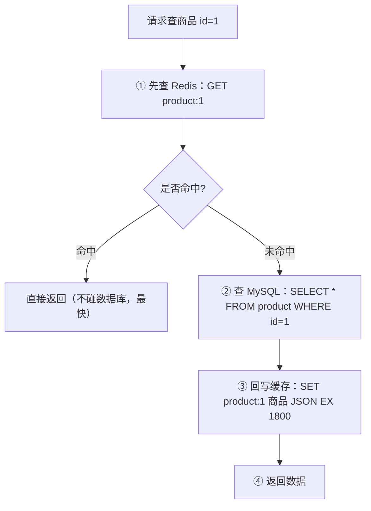
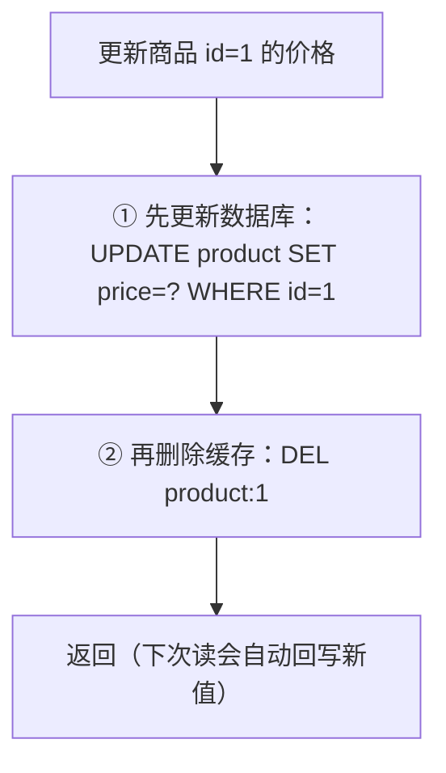

# 05 Spring Boot 缓存实战

> 本篇导读：缓存是 Redis 最经典的用途，但"加个 Redis"和"加对缓存"是两码事。这一篇先把"缓存更新策略、缓存三大问题、双写一致性"这些绕不开的思路讲透，再带你用 Spring Boot 的 `@Cacheable` 全家桶把商品详情缓存落地。读完你能写出一套**不踩坑**的缓存代码，并知道"缓存穿透 / 击穿 / 雪崩"到底差在哪、分别怎么治。本篇代码基于 JDK 17 + Spring Boot 3.5.5 + MyBatis-Plus + Redis 7.x。

## 本篇要解决的问题

- 缓存更新到底该"先删缓存还是先更新库"？为什么？
- `@Cacheable`、`@CachePut`、`@CacheEvict` 三个注解到底怎么配合，key 写错会发生什么？
- 为什么 Spring Cache 配了却"不生效"——同一类里调方法、方法加 `final`、非 public 这些坑。
- 缓存穿透、击穿、雪崩，名字像三兄弟，其实是三件不同的事，各自怎么救。
- 缓存和数据库"双写"怎么保证尽量一致，延迟双删和 Canal 又是什么。

## 一、缓存更新策略

先把"为什么要更新、怎么更新"这件事的**思路**聊清楚，再上代码。缓存本质是一份"数据库的影子副本"，只要数据库变了，影子就得跟着变，否则用户看到的就是旧数据。

### 1.1 一个生活化比喻：门口的快递柜

你家（数据库）住 18 楼，每次下楼拿快递（查库）很累。于是你在门口（缓存）放了个小柜子，把最近常收的快递先放门口，取件快。问题来了：

- **别人往你家塞了新快递（写库）**，门口柜子还是旧的，怎么办？
- 你有两种选择：① 先把门口柜子清掉，让人下次下楼取了再放回来；② 直接把门口柜子换成新的。

缓存更新的所有策略，本质上就是回答这两个选择。下面四种是业界公认的标准解法。

### 1.2 Cache Aside（旁路缓存，最常用）

这是**业务代码里 99% 会用的策略**。特点是：业务代码自己同时管缓存和数据库，"缓存"在旁边当辅助，不直接落库。

**读流程（Cache Aside 读）**：



**写流程（Cache Aside 写）**：



::: tip 为什么是"删缓存"而不是"更新缓存"
更新数据库后如果你选择"把新值 SET 进缓存"，在**并发写**场景下容易写出脏数据（两个写请求先后到，后到的库更新先写缓存，反而把旧值留在缓存）。而"删缓存"让下一次读自动回写，逻辑最干净、并发最安全。所以 Cache Aside 的标准动作是**删**，不是写。
:::

### 1.3 Read / Write Through（穿透式）

这种策略里，**应用只跟缓存打交道**，业务代码完全不知道数据库的存在。缓存自己负责：读没命中时去查库并回填、写时同步落库。

```text
应用 ──读/写──► 缓存 ──(缓存自己)──► 数据库
```

优点：业务代码极简，不用关心"先删还是先更"。缺点：缓存层要自己实现"落库"逻辑，框架支持少，定制成本高。Spring Cache 默认不是这个模型。

### 1.4 Write Behind（异步回写 / Write Back）

写的时候**只写缓存，不立刻落库**，由缓存层在后台**异步批量**把数据刷进数据库。

```text
应用 ──写──► 缓存（立刻返回）
                  │
                  │ 后台线程定时/定量
                  ▼
              数据库（批量落盘）
```

优点：写入性能极高（内存写完就返回，还能合并多次修改）。缺点：**一旦缓存挂了、没来得及刷盘，数据就丢了**，可靠性差。所以多用于对丢失不敏感的场景（如浏览量计数）。

### 1.5 四种策略对比表

| 策略 | 谁管落库 | 读未命中谁回填 | 一致性 | 性能 | 实现复杂度 | 业务代码侵入 | 典型场景 |
| --- | --- | --- | --- | --- | --- | --- | --- |
| **Cache Aside** | 业务代码 | 业务代码 | 最终一致 | 高 | 低 | 中（要写删缓存逻辑） | 绝大多数业务缓存 |
| **Read Through** | 缓存层 | 缓存层 | 最终一致 | 高 | 中 | 低（业务只管缓存） | 读多写少、想简化业务 |
| **Write Through** | 缓存层 | — | 强（写即落库） | 中 | 中 | 低 | 写即要求落库 |
| **Write Behind** | 缓存层（异步） | — | 弱（可能丢） | 极高 | 高 | 高 | 计数、日志等可丢场景 |

::: warning 结论
业务代码里 99% 用 **Cache Aside**：读时回填、写时删缓存。本篇后续所有实战都基于它。Read/Write Through、Write Behind 理解思路即可，真要用需引入专门缓存中间件或自研，不在本篇落地。
:::

## 二、Spring Cache 抽象

### 2.1 为什么要有抽象层

假设你今天用 Redis 做缓存，明天老板说"热点数据改用本地 Caffeine 更快"。如果业务代码里到处手写 `redisTemplate.opsForValue().get(...)`，那你得改几百处。

**Spring Cache 抽象**做的事就是：把"怎么存、怎么取"这件事用注解声明，底层具体用 Redis 还是 Caffeine，由 `CacheManager` 决定。**换缓存实现，业务代码一行都不用改。**

```java
// 业务只声明"意图"，不关心底层是 Redis 还是 Caffeine
@Cacheable(cacheNames = "product", key = "#id")
public Product getById(Long id) { ... }
```

启用抽象需要一个总开关：`@EnableCaching`，放在配置类或启动类上。

```java
package com.canoe.redis;

import org.springframework.boot.SpringApplication;
import org.springframework.boot.autoconfigure.SpringBootApplication;
import org.springframework.cache.annotation.EnableCaching;

@SpringBootApplication
@EnableCaching   // 开启 Spring Cache 抽象，没有它所有 @Cache* 注解都不生效
public class RedisApplication {
    public static void main(String[] args) {
        SpringApplication.run(RedisApplication.class, args);
    }
}
```

### 2.2 @Cacheable：方法结果自动入缓存

方法第一次被调用时执行真实逻辑，把返回值按 key 存进缓存；之后同样 key 的调用直接走缓存，方法体**不再执行**。

```java
package com.canoe.redis.service;

import com.canoe.redis.entity.Product;
import org.springframework.cache.annotation.Cacheable;
import org.springframework.stereotype.Service;

@Service
public class ProductService {

    // cacheNames 指定缓存分区；key 用 SpEL 取入参 id
    @Cacheable(cacheNames = "product", key = "#id")
    public Product getById(Long id) {
        System.out.println(">>> 查数据库了，id=" + id);   // 命中缓存时这行不会打印
        return queryFromDb(id);
    }
}
```

### 2.3 key 的 SpEL 表达式全集

`key` 支持 Spring Expression Language（SpEL）。下面这张表把常用写法列全：

| 写法 | 含义 | 示例 |
| --- | --- | --- |
| `#参数名` | 按形参名取 | `#id`、`#userId` |
| `#p0` / `#a0` | 按位置取第 0 个参数（p=parameter，a=arg） | `#p0` 等于第一个入参 |
| `#p1` | 第 1 个参数 | `#p1` |
| `#root.methodName` | 当前方法名 | `#root.methodName` |
| `#root.target` | 当前目标对象 | `#root.target` |
| `#root.args[0]` | 参数数组第 0 个 | `#root.args[0]` |
| `#root.caches[0].name` | 当前缓存名 | `#root.caches[0].name` |
| `#result` | 方法返回值（仅 `unless` / `cachePut` 可用） | `#result.id` |

::: tip 实用组合
多参数时拼 key 很常见：`key = "#userId + ':' + #skuId"`。这样缓存 key 是 `userId:skuId`，避免不同用户互相串。
:::

### 2.4 condition 与 unless：一个在"执行前"判断，一个在"执行后"判断

- `condition`：**调用方法之前**就判断，条件不成立就**不缓存、且方法照常执行**。能用 `#参数`。
- `unless`：**方法执行完之后**才判断，能用 `#result`。条件成立就**不存**进缓存。

```java
// 只有 id 是正数才走缓存（执行前判断入参）
@Cacheable(cacheNames = "product", key = "#id", condition = "#id > 0")
// 返回结果若为 null 则不缓存（执行后判断返回值，#result 可用）
@Cacheable(cacheNames = "product", key = "#id", unless = "#result == null")
public Product getById(Long id) { ... }
```

::: warning unless 是缓存穿透的"帮凶"之一
默认情况下 `unless` 没配，但 Spring 的 `RedisCacheManager` 有一个相关开关 `disableCachingNullValues`（见后文），默认**不缓存 null**。如果你查到 null 又想缓存空值来防穿透，必须显式开启缓存 null，否则 null 永远不进缓存，每次穿透请求都打库。
:::

### 2.5 sync = true：解决缓存击穿的内置方案

当多个线程**同时**查询同一个"刚过期/不存在"的热点 key，会同时击穿到数据库。`@Cacheable(sync = true)` 让 Spring 在回源时**对同一个 key 加锁**，只有一个线程去查库，其余线程等待结果，避免并发回源。

```java
@Cacheable(cacheNames = "product", key = "#id", sync = true)
public Product getById(Long id) { ... }
```

::: tip sync 的本质
`sync=true` 底层用 `ConcurrentMap` 或 `synchronized` 对"同一 key"做串行化回源。它是解决**缓存击穿**成本最低的方案，但只保护"回源"那一下；key 还没进缓存时的并发它不保证（那属于穿透范畴）。
:::

### 2.6 @CachePut：每次都执行并更新缓存

`@CachePut` 和 `@Cacheable` 最大的区别：**它每次都会执行方法体**，把返回值写进缓存。常用于"更新"操作——既要落库，又要把最新结果刷进缓存。

```java
package com.canoe.redis.service;

import com.canoe.redis.entity.Product;
import org.springframework.cache.annotation.CachePut;
import org.springframework.stereotype.Service;

@Service
public class ProductService {

    // 每次都执行，把返回值以 key=#product.id 写进缓存 product 分区
    @CachePut(cacheNames = "product", key = "#product.id")
    public Product update(Product product) {
        updateToDb(product);
        return product;   // 注意：必须返回最新对象，它才会被写进缓存
    }
}
```

::: danger @CachePut 和 @Cacheable 的 key 必须一致！
如果 `@Cacheable` 用 `key="#id"`，而 `@CachePut` 用 `key="#product.id"`，两者 key 形式一致（都是 id 值）没问题；但如果你一个用 `key="#id"`，另一个写成 `key="'p_' + #product.id"`，那更新写进的是 `p_1`，读取的却是 `1`，**更新根本没覆盖到读的那条缓存**，用户永远看到旧数据。两个注解的 key 表达式产出的"最终字符串"必须完全相等。
:::

### 2.7 @CacheEvict：删除缓存

更新/删除数据时，把对应缓存清掉。

```java
package com.canoe.redis.service;

import org.springframework.cache.annotation.CacheEvict;
import org.springframework.stereotype.Service;

@Service
public class ProductService {

    // 删除指定 key 的缓存
    @CacheEvict(cacheNames = "product", key = "#id")
    public void delete(Long id) {
        deleteFromDb(id);
    }
}
```

两个易踩的属性：

| 属性 | 含义 | 坑 |
| --- | --- | --- |
| `allEntries = true` | 清空该 `cacheNames` 下**所有** key | 粒度粗，会误删无关 key，慎用 |
| `beforeInvocation = true` | 在方法**执行前**就删缓存 | 默认 `false`（方法执行后删）。若方法抛异常，`false` 不会删；`true` 先删了，万一后面失败库没改，缓存却是空的 |

```java
// 删除整个 product 分区的所有缓存（危险操作，会清掉别人的 key）
@CacheEvict(cacheNames = "product", allEntries = true)
public void clearAll() { ... }

// 方法开始前就先删缓存（适合"先删缓存再更新库"语义）
@CacheEvict(cacheNames = "product", key = "#id", beforeInvocation = true)
public void deleteBefore(Long id) { ... }
```

### 2.8 @Caching：组合多个注解

一个方法上要同时加/删多个缓存分区时用它。

```java
package com.canoe.redis.service;

import org.springframework.cache.annotation.CacheEvict;
import org.springframework.cache.annotation.CachePut;
import org.springframework.cache.annotation.Caching;
import org.springframework.stereotype.Service;

@Service
public class ProductService {

    // 更新商品时，同时刷新 product 分区和更新 user:rank 分区
    @Caching(
        put = { @CachePut(cacheNames = "product", key = "#product.id") },
        evict = { @CacheEvict(cacheNames = "userRank", allEntries = true) }
    )
    public Product updateComplex(Product product) {
        return updateToDb(product);
    }
}
```

### 2.9 @CacheConfig：类级抽取公共配置

一个 Service 里所有方法都用了同一个 `cacheNames = "product"`，可以提到类上，方法里省略。

```java
package com.canoe.redis.service;

import org.springframework.cache.annotation.CacheConfig;
import org.springframework.cache.annotation.Cacheable;
import org.springframework.stereotype.Service;

@CacheConfig(cacheNames = "product")   // 类级统一定义缓存名
@Service
public class ProductService {

    @Cacheable(key = "#id")   // 不用再写 cacheNames 了
    public Product getById(Long id) { return queryFromDb(id); }
}
```

### 2.10 Spring Cache 的三个坑（代理失效）

这是新手问得最多的"为什么注解不生效"。Spring Cache 靠 **AOP 代理**实现：容器注入给你的不是原始对象，而是一个"代理对象"，调用方法时代理先去查缓存。问题就出在**代理只能拦"从外面进来的调用"**。

**坑一：同一类内部方法调用不生效**

```java
package com.canoe.redis.service;

import org.springframework.cache.annotation.Cacheable;
import org.springframework.stereotype.Service;

@Service
public class ProductService {

    public Product buy(Long id) {
        // ❌ 反例：this 指向原始对象本身，绕过了代理，@Cacheable 完全不生效
        return this.getById(id);
    }

    @Cacheable(cacheNames = "product", key = "#id")
    public Product getById(Long id) {
        return queryFromDb(id);
    }
}
```

**坑二：对象内部自调用（本质同上）**

即使拆成两个方法但仍在同一个类里互调，依然是 `this` 调用，代理拦不到。

**坑三：`final` 方法 / 非 public 方法不生效**

- Spring 用 CGLIB 代理需要**继承**目标类并重写方法，`final` 方法无法被重写 → 代理失败。
- 非 public 方法默认不在 AOP 切点内 → 不生效（CGLIB 可代理 protected，但 Spring Cache 默认只拦截 public）。

```java
// ❌ final 方法：CGLIB 无法重写，缓存不生效
@Cacheable(cacheNames = "product", key = "#id")
public final Product getByIdFinal(Long id) { return queryFromDb(id); }

// ❌ private 方法：不在缓存拦截范围
@Cacheable(cacheNames = "product", key = "#id")
private Product getByIdPrivate(Long id) { return queryFromDb(id); }
```

**解决办法一：拆成两个类**

把被调用的方法移到另一个 `@Service`，通过注入的 Bean 调用，走的就是代理了。

```java
package com.canoe.redis.service;

import org.springframework.stereotype.Service;

@Service
public class ProductReadService {

    @Cacheable(cacheNames = "product", key = "#id")
    public Product getById(Long id) { return queryFromDb(id); }
}
```

```java
package com.canoe.redis.service;

import org.springframework.stereotype.Service;
import com.canoe.redis.service.ProductReadService;

@Service
public class ProductService {

    private final ProductReadService readService;

    public ProductService(ProductReadService readService) {
        this.readService = readService;
    }

    public Product buy(Long id) {
        // ✅ 通过注入的 Bean 调用，经过代理，缓存生效
        return readService.getById(id);
    }
}
```

**解决办法二：AopContext 自调用（需开启 exposeProxy）**

```java
package com.canoe.redis.service;

import org.springframework.aop.framework.AopContext;
import org.springframework.cache.annotation.Cacheable;
import org.springframework.stereotype.Service;

@Service
public class ProductService {

    public Product buy(Long id) {
        // ✅ 通过 AopContext 拿到代理对象自己，再调方法，缓存生效
        ProductService proxy = (ProductService) AopContext.currentProxy();
        return proxy.getById(id);
    }

    @Cacheable(cacheNames = "product", key = "#id")
    public Product getById(Long id) { return queryFromDb(id); }
}
```

开启 `exposeProxy`（启动类或配置类加 `@EnableAspectJAutoProxy(exposeProxy = true)`）：

```java
package com.canoe.redis;

import org.springframework.boot.SpringApplication;
import org.springframework.boot.autoconfigure.SpringBootApplication;
import org.springframework.cache.annotation.EnableCaching;
import org.springframework.context.annotation.EnableAspectJAutoProxy;

@SpringBootApplication
@EnableCaching
@EnableAspectJAutoProxy(exposeProxy = true)   // 允许 AopContext.currentProxy() 拿到代理
public class RedisApplication {
    public static void main(String[] args) {
        SpringApplication.run(RedisApplication.class, args);
    }
}
```

## 三、RedisCacheManager 配置

### 3.1 默认 JDK 序列化的问题

Spring Boot 自动配置的 `RedisCacheManager` 默认用 **JDK 序列化**（ObjectOutputStream），存进 Redis 的 value 是一串**乱码二进制**，你用 `redis-cli` 看全是 `\xac\xed\x00\x05t\x00...`，既看不懂，也和其他语言/客户端不互通。必须改成 **JSON 序列化**。

### 3.2 RedisCacheConfiguration 全配置项

```java
package com.canoe.redis.config;

import java.time.Duration;
import org.springframework.data.redis.cache.RedisCacheConfiguration;
import org.springframework.data.redis.serializer.RedisSerializationContext;
import org.springframework.data.redis.serializer.GenericJackson2JsonRedisSerializer;
import org.springframework.data.redis.serializer.StringRedisSerializer;

public class CacheConfigMeta {

    public static RedisCacheConfiguration build() {
        return RedisCacheConfiguration
                .defaultCacheConfig()
                // entryTtl：缓存整体过期时间，比如 30 分钟
                .entryTtl(Duration.ofMinutes(30))
                // disableCachingNullValues：默认 true = 不缓存 null。
                // 这其实是"缓存穿透"的一个成因（见第 6 节），防穿透要改 false
                .disableCachingNullValues()
                // serializeKeysWith：key 用 String 序列化（可读）
                .serializeKeysWith(
                        RedisSerializationContext.SerializationPair
                                .fromSerializer(new StringRedisSerializer()))
                // serializeValuesWith：value 用 JSON 序列化（可读、跨语言）
                .serializeValuesWith(
                        RedisSerializationContext.SerializationPair
                                .fromSerializer(new GenericJackson2JsonRedisSerializer()))
                // prefixCacheNameWith：给所有 key 加统一前缀，方便在 Redis 里区分
                .prefixCacheNameWith("canoe:");
    }
}
```

关键配置项一览：

| 配置方法 | 作用 | 默认值/建议 |
| --- | --- | --- |
| `entryTtl(Duration)` | 缓存 TTL | 建议按业务设，别用默认（默认不过期！） |
| `disableCachingNullValues()` | 不缓存 null | 默认开启；防穿透要改成允许缓存 null（`.enableCachingNullValues()` 配短 TTL） |
| `serializeKeysWith(...)` | key 序列化器 | `StringRedisSerializer`（务必） |
| `serializeValuesWith(...)` | value 序列化器 | `GenericJackson2JsonRedisSerializer`（JSON） |
| `prefixCacheNameWith(String)` | key 前缀 | 如 `canoe:`，便于排查 |
| `computePrefixWith(...)` | 自定义 key 拼接规则 | 高级用法 |

::: warning 默认不过期是灾难
`RedisCacheConfiguration.defaultCacheConfig()` **默认没有 TTL**，意味着缓存永不过期。一旦你代码里忘了主动删，陈旧数据永远在。生产务必显式 `entryTtl(...)`。
:::

### 3.3 不同缓存不同 TTL 的实现

真实业务里：商品详情可以缓存 30 分钟，用户信息 5 分钟，短信验证码 2 分钟。`RedisCacheManager.builder()` 支持用 `Map` 给每个 `cacheNames` 配不同 `RedisCacheConfiguration`。

```java
package com.canoe.redis.config;

import java.time.Duration;
import java.util.HashMap;
import java.util.Map;
import org.springframework.context.annotation.Bean;
import org.springframework.context.annotation.Configuration;
import org.springframework.data.redis.cache.RedisCacheConfiguration;
import org.springframework.data.redis.cache.RedisCacheManager;
import org.springframework.data.redis.connection.RedisConnectionFactory;
import org.springframework.data.redis.serializer.GenericJackson2JsonRedisSerializer;
import org.springframework.data.redis.serializer.RedisSerializationContext;
import org.springframework.data.redis.serializer.StringRedisSerializer;

@Configuration
public class CacheConfig {

    @Bean
    public RedisCacheManager cacheManager(RedisConnectionFactory connectionFactory) {
        // 1) 公共基础配置：key 用 String，value 用 JSON
        RedisCacheConfiguration base = RedisCacheConfiguration
                .defaultCacheConfig()
                .serializeKeysWith(RedisSerializationContext.SerializationPair
                        .fromSerializer(new StringRedisSerializer()))
                .serializeValuesWith(RedisSerializationContext.SerializationPair
                        .fromSerializer(new GenericJackson2JsonRedisSerializer()));

        // 2) 每个缓存分区各自的 TTL
        Map<String, RedisCacheConfiguration> configMap = new HashMap<>();
        configMap.put("product",  base.entryTtl(Duration.ofMinutes(30)));   // 商品 30 分钟
        configMap.put("user",     base.entryTtl(Duration.ofMinutes(5)));     // 用户 5 分钟
        configMap.put("code",     base.entryTtl(Duration.ofMinutes(2)));     // 验证码 2 分钟

        // 3) 用 builder + withInitialCacheConfigurations 组装
        return RedisCacheManager
                .builder(connectionFactory)
                .withInitialCacheConfigurations(configMap)
                // 没在 map 里声明的 cacheNames，用这个默认配置（10 分钟）
                .cacheDefaults(base.entryTtl(Duration.ofMinutes(10)))
                .build();
    }
}
```

### 3.4 完整的 CacheConfig.java

把 JSON 序列化、前缀、null 处理、不同 TTL 全部合到一起：

```java
package com.canoe.redis.config;

import java.time.Duration;
import java.util.HashMap;
import java.util.Map;
import org.springframework.context.annotation.Bean;
import org.springframework.context.annotation.Configuration;
import org.springframework.data.redis.cache.RedisCacheConfiguration;
import org.springframework.data.redis.cache.RedisCacheManager;
import org.springframework.data.redis.connection.RedisConnectionFactory;
import org.springframework.data.redis.serializer.GenericJackson2JsonRedisSerializer;
import org.springframework.data.redis.serializer.RedisSerializationContext;
import org.springframework.data.redis.serializer.StringRedisSerializer;

@Configuration
public class CacheConfig {

    /** JSON 序列化器（value 用），可读且跨语言 */
    private GenericJackson2JsonRedisSerializer jsonSerializer() {
        return new GenericJackson2JsonRedisSerializer();
    }

    /** 公共基础配置：String 键 + JSON 值 + 统一前缀 */
    private RedisCacheConfiguration baseConfig() {
        return RedisCacheConfiguration
                .defaultCacheConfig()
                .prefixCacheNameWith("canoe:")                                  // key 前缀，便于排查
                .serializeKeysWith(RedisSerializationContext.SerializationPair
                        .fromSerializer(new StringRedisSerializer()))
                .serializeValuesWith(RedisSerializationContext.SerializationPair
                        .fromSerializer(jsonSerializer()))
                .disableCachingNullValues();                                   // 默认不缓存 null（防穿透需改）
    }

    @Bean
    public RedisCacheManager cacheManager(RedisConnectionFactory connectionFactory) {
        RedisCacheConfiguration base = baseConfig();

        Map<String, RedisCacheConfiguration> configMap = new HashMap<>();
        configMap.put("product", base.entryTtl(Duration.ofMinutes(30)));
        configMap.put("user",    base.entryTtl(Duration.ofMinutes(5)));
        configMap.put("code",    base.entryTtl(Duration.ofMinutes(2)));

        return RedisCacheManager
                .builder(connectionFactory)
                .withInitialCacheConfigurations(configMap)
                .cacheDefaults(base.entryTtl(Duration.ofMinutes(10)))
                .build();
    }
}
```

## 四、实战项目：商品详情缓存

### 4.1 完整建表 SQL

```sql
-- 商品表
CREATE TABLE `product` (
  `id`          BIGINT       NOT NULL AUTO_INCREMENT COMMENT '商品主键',
  `name`        VARCHAR(128) NOT NULL DEFAULT '' COMMENT '商品名称',
  `price`       DECIMAL(10,2) NOT NULL DEFAULT 0.00 COMMENT '价格',
  `stock`       INT          NOT NULL DEFAULT 0 COMMENT '库存',
  `description` VARCHAR(255) NOT NULL DEFAULT '' COMMENT '描述',
  `create_time` DATETIME     NOT NULL DEFAULT CURRENT_TIMESTAMP COMMENT '创建时间',
  `update_time` DATETIME     NOT NULL DEFAULT CURRENT_TIMESTAMP ON UPDATE CURRENT_TIMESTAMP COMMENT '更新时间',
  PRIMARY KEY (`id`)
) ENGINE=InnoDB DEFAULT CHARSET=utf8mb4 COMMENT='商品表';

-- 插入一条测试数据
INSERT INTO `product` (`id`, `name`, `price`, `stock`, `description`)
VALUES (1, '轻舟同款机械键盘', 399.00, 100, '茶轴，客制化配列');
```

### 4.2 Entity

```java
package com.canoe.redis.entity;

import java.math.BigDecimal;
import java.time.LocalDateTime;
import com.baomidou.mybatisplus.annotation.IdType;
import com.baomidou.mybatisplus.annotation.TableId;
import com.baomidou.mybatisplus.annotation.TableName;

@TableName("product")
public class Product {

    @TableId(type = IdType.AUTO)
    private Long id;

    private String name;

    private BigDecimal price;

    private Integer stock;

    private String description;

    private LocalDateTime createTime;

    private LocalDateTime updateTime;

    // 省略 getter / setter / toString（实际项目用 Lombok @Data 更省事）
    public Long getId() { return id; }
    public void setId(Long id) { this.id = id; }
    public String getName() { return name; }
    public void setName(String name) { this.name = name; }
    public BigDecimal getPrice() { return price; }
    public void setPrice(BigDecimal price) { this.price = price; }
    public Integer getStock() { return stock; }
    public void setStock(Integer stock) { this.stock = stock; }
    public String getDescription() { return description; }
    public void setDescription(String description) { this.description = description; }
    public LocalDateTime getCreateTime() { return createTime; }
    public void setCreateTime(LocalDateTime createTime) { this.createTime = createTime; }
    public LocalDateTime getUpdateTime() { return updateTime; }
    public void setUpdateTime(LocalDateTime updateTime) { this.updateTime = updateTime; }
}
```

### 4.3 Mapper（MyBatis-Plus 注解风格）

```java
package com.canoe.redis.mapper;

import com.baomidou.mybatisplus.core.mapper.BaseMapper;
import com.canoe.redis.entity.Product;
import org.apache.ibatis.annotations.Mapper;

@Mapper
public interface ProductMapper extends BaseMapper<Product> {
    // BaseMapper 已提供 selectById / updateById / deleteById 等，无需手写
}
```

### 4.4 Service（@Cacheable / @CachePut / @CacheEvict 全注解演示）

```java
package com.canoe.redis.service;

import com.canoe.redis.entity.Product;
import com.canoe.redis.mapper.ProductMapper;
import org.springframework.cache.annotation.CacheConfig;
import org.springframework.cache.annotation.CacheEvict;
import org.springframework.cache.annotation.CachePut;
import org.springframework.cache.annotation.Cacheable;
import org.springframework.stereotype.Service;
import org.springframework.transaction.annotation.Transactional;

@CacheConfig(cacheNames = "product")   // 类级统一定义缓存分区名
@Service
public class ProductService {

    private final ProductMapper productMapper;

    public ProductService(ProductMapper productMapper) {
        this.productMapper = productMapper;
    }

    // 查：命中缓存直接返回，不进库
    @Cacheable(key = "#id", unless = "#result == null")
    public Product getById(Long id) {
        System.out.println(">>> 打印 SQL：查数据库 product id=" + id);
        return productMapper.selectById(id);
    }

    // 增：写入后把新对象塞进缓存（key 必须是 #product.id，和 getById 的 #id 对齐）
    @CachePut(key = "#product.id")
    @Transactional
    public Product create(Product product) {
        productMapper.insert(product);
        return product;
    }

    // 改：每次执行，刷新缓存为最新对象
    @CachePut(key = "#product.id")
    @Transactional
    public Product update(Product product) {
        productMapper.updateById(product);
        return product;
    }

    // 删：删除对应 key 的缓存（beforeInvocation=true 先删缓存再删库，符合 Cache Aside）
    @CacheEvict(key = "#id", beforeInvocation = true)
    @Transactional
    public void delete(Long id) {
        productMapper.deleteById(id);
    }
}
```

### 4.5 Controller

```java
package com.canoe.redis.controller;

import com.canoe.redis.entity.Product;
import com.canoe.redis.service.ProductService;
import org.springframework.web.bind.annotation.DeleteMapping;
import org.springframework.web.bind.annotation.GetMapping;
import org.springframework.web.bind.annotation.PathVariable;
import org.springframework.web.bind.annotation.PostMapping;
import org.springframework.web.bind.annotation.PutMapping;
import org.springframework.web.bind.annotation.RequestBody;
import org.springframework.web.bind.annotation.RequestMapping;
import org.springframework.web.bind.annotation.RestController;

@RestController
@RequestMapping("/product")
public class ProductController {

    private final ProductService productService;

    public ProductController(ProductService productService) {
        this.productService = productService;
    }

    @GetMapping("/{id}")
    public Product get(@PathVariable Long id) {
        return productService.getById(id);
    }

    @PostMapping
    public Product create(@RequestBody Product product) {
        return productService.create(product);
    }

    @PutMapping
    public Product update(@RequestBody Product product) {
        return productService.update(product);
    }

    @DeleteMapping("/{id}")
    public String delete(@PathVariable Long id) {
        productService.delete(id);
        return "ok";
    }
}
```

### 4.6 完整的 pom.xml

```xml
<?xml version="1.0" encoding="UTF-8"?>
<project xmlns="http://maven.apache.org/POM/4.0.0"
         xmlns:xsi="http://www.w3.org/2001/XMLSchema-instance"
         xsi:schemaLocation="http://maven.apache.org/POM/4.0.0
                             http://maven.apache.org/xsd/maven-4.0.0.xsd">
    <modelVersion>4.0.0</modelVersion>

    <!-- 父工程统一管 Spring Boot 版本 -->
    <parent>
        <groupId>org.springframework.boot</groupId>
        <artifactId>spring-boot-starter-parent</artifactId>
        <version>3.5.5</version>
        <relativePath/>
    </parent>

    <groupId>com.canoe</groupId>
    <artifactId>redis-cache-demo</artifactId>
    <version>1.0.0</version>
    <name>redis-cache-demo</name>

    <!-- 统一管版本，避免各依赖版本打架 -->
    <properties>
        <java.version>17</java.version>
        <maven.compiler.release>17</maven.compiler.release>
        <project.build.sourceEncoding>UTF-8</project.build.sourceEncoding>
        <mybatis-plus.version>3.5.12</mybatis-plus.version>
    </properties>

    <dependencies>
        <!-- Web -->
        <dependency>
            <groupId>org.springframework.boot</groupId>
            <artifactId>spring-boot-starter-web</artifactId>
        </dependency>

        <!-- Spring Cache 抽象 + Redis 实现 -->
        <dependency>
            <groupId>org.springframework.boot</groupId>
            <artifactId>spring-boot-starter-cache</artifactId>
        </dependency>
        <dependency>
            <groupId>org.springframework.boot</groupId>
            <artifactId>spring-boot-starter-data-redis</artifactId>
        </dependency>

        <!-- MyBatis-Plus -->
        <dependency>
            <groupId>com.baomidou</groupId>
            <artifactId>mybatis-plus-spring-boot3-starter</artifactId>
            <version>${mybatis-plus.version}</version>
        </dependency>

        <!-- MySQL 驱动 -->
        <dependency>
            <groupId>com.mysql</groupId>
            <artifactId>mysql-connector-j</artifactId>
            <scope>runtime</scope>
        </dependency>

        <!-- Lombok（可选，省 getter/setter） -->
        <dependency>
            <groupId>org.projectlombok</groupId>
            <artifactId>lombok</artifactId>
            <optional>true</optional>
        </dependency>

        <!-- 测试 -->
        <dependency>
            <groupId>org.springframework.boot</groupId>
            <artifactId>spring-boot-starter-test</artifactId>
            <scope>test</scope>
        </dependency>
    </dependencies>

    <build>
        <plugins>
            <plugin>
                <groupId>org.springframework.boot</groupId>
                <artifactId>spring-boot-maven-plugin</artifactId>
                <configuration>
                    <excludes>
                        <exclude>
                            <groupId>org.projectlombok</groupId>
                            <artifactId>lombok</artifactId>
                        </exclude>
                    </excludes>
                </configuration>
            </plugin>
        </plugins>
    </build>
</project>
```

### 4.7 完整的 application.yml

```yaml
server:
  port: 8080

spring:
  application:
    name: redis-cache-demo
  # ===== 数据源 =====
  datasource:
    url: jdbc:mysql://localhost:3306/canoe?useUnicode=true&characterEncoding=utf8mb4&serverTimezone=Asia/Shanghai&useSSL=false
    username: root          # 改成你的数据库账号
    password: root          # 改成你的数据库密码
    driver-class-name: com.mysql.cj.jdbc.Driver
  # ===== Redis =====
  data:
    redis:
      host: localhost       # Redis 地址
      port: 6379            # Redis 端口
      password: ""          # 有密码就填，没密码留空
      database: 0           # 用 0 号库
      lettuce:
        pool:
          max-active: 8     # 连接池最大活跃连接
          max-idle: 8
          min-idle: 0
          max-wait: 3000ms  # 取连接最多等 3 秒
  # ===== Spring Cache =====
  cache:
    type: redis             # 指定缓存实现为 Redis（不配也能自动探测到）
    redis:
      use-key-prefix: true
      key-prefix: canoe:    # 兜底前缀（CacheConfig 里也配了 prefixCacheNameWith）
      time-to-live: 600000  # 兜底 TTL，毫秒；具体分区 TTL 以 CacheConfig 为准

# MyBatis-Plus 日志：把 SQL 打出来，方便验证"第二次没查库"
mybatis-plus:
  configuration:
    log-impl: org.apache.ibatis.logging.stdout.StdOutImpl
  global-config:
    db-config:
      id-type: auto
```

### 4.8 用 curl 验证

启动应用后，连续查两次同一商品：

```bash
# 第一次：控制台会打印 ">>> 打印 SQL：查数据库 product id=1"
curl http://localhost:8080/product/1

# 第二次：缓存命中，控制台不再打印 SQL，直接返回
curl http://localhost:8080/product/1
```

验证缓存确实写入 Redis：

```bash
redis-cli
# 127.0.0.1:6379> KEYS canoe:product*
# 1) "canoe:product::1"
# 127.0.0.1:6379> GET canoe:product::1
# "\"{...JSON...}\""   <- value 是可读 JSON，不再是 JDK 乱码
```

::: tip 怎么确认"第二次没查库"
开着 `mybatis-plus` 的 SQL 日志，第一次请求会看到 `SELECT ... FROM product`，第二次请求控制台**没有任何 SQL 输出**，就说明命中缓存了。
:::

## 五、缓存三大问题

这是缓存章节**重点中的重点**。三个词名字像三兄弟，其实是三件完全不同的事，下面逐个拆开，每个都给完整代码。

### 5.1 缓存穿透：查一个压根不存在的数据

**场景**：黑客狂刷 `GET /product/-1`、`/product/999999`（库里根本没有）。因为缓存里也没这条（查不到不会写缓存，或者 null 不缓存），所以**每次请求都打到数据库**，缓存形同虚设，DB 被压垮。

```text
攻击者 ──查 id=-1──► Redis：没有 ──► MySQL：也没有 ──► 每次都打库（穿透）
攻击者 ──查 id=-2──► Redis：没有 ──► MySQL：也没有 ──► 每次都打库
攻击者 ──查 id=-3──► ...
```

**方案 A：缓存空值 + 短 TTL**

查库返回 null 时，也往缓存写个"空标记"，并设置**短 TTL**（如 2 分钟），让短时间内同样的非法请求直接命中空值、不落库。

```java
package com.canoe.redis.service;

import com.canoe.redis.entity.Product;
import com.canoe.redis.mapper.ProductMapper;
import org.springframework.data.redis.core.StringRedisTemplate;
import org.springframework.stereotype.Service;
import com.fasterxml.jackson.databind.ObjectMapper;
import java.time.Duration;
import java.util.concurrent.TimeUnit;

@Service
public class ProductPenetrationService {

    private final ProductMapper productMapper;
    private final StringRedisTemplate redisTemplate;
    private final ObjectMapper objectMapper = new ObjectMapper();

    public ProductPenetrationService(ProductMapper productMapper,
                                     StringRedisTemplate redisTemplate) {
        this.productMapper = productMapper;
        this.redisTemplate = redisTemplate;
    }

    private static final String KEY_PREFIX = "product:";
    private static final String NULL_MARK = "{\"__null__\":true}";   // 空值标记

    public Product getByIdSafe(Long id) throws Exception {
        String key = KEY_PREFIX + id;
        String cached = redisTemplate.opsForValue().get(key);
        if (cached != null) {
            // 命中空标记，直接返回 null，不再打库
            if (NULL_MARK.equals(cached)) {
                return null;
            }
            return objectMapper.readValue(cached, Product.class);
        }
        // 未命中，查库
        Product product = productMapper.selectById(id);
        if (product == null) {
            // ⚠️ 关键：缓存空值，但 TTL 要短（2 分钟），否则非法 id 占满内存
            redisTemplate.opsForValue().set(key, NULL_MARK, 2, TimeUnit.MINUTES);
            return null;
        }
        // 正常结果写缓存（30 分钟）
        redisTemplate.opsForValue().set(key, objectMapper.writeValueAsString(product),
                30, TimeUnit.MINUTES);
        return product;
    }
}
```

::: warning 要区分 null 和"空字符串"
空值标记必须和"真实业务里的空字符串结果"区分开。上面用 `{"__null__":true}` 作专属标记，而不是存一个空 `""`，避免把"查不到"和"查到一个空内容对象"混为一谈。另外空值 TTL 一定要短，否则几亿个非法 id 把 Redis 内存撑爆（这也是一种"缓存被污染"）。
:::

**方案 B：布隆过滤器**

布隆过滤器（Bloom Filter）用一个**比特数组 + 多个哈希函数**判断"某个 id 是否可能存在"。它说"不存在"就**一定不存在**，说"存在"可能误判。把"所有合法商品 id"提前放进布隆过滤器，请求先过过滤器，连"可能存在"都达不到的直接拦截，根本不打 Redis 和 DB。

```java
package com.canoe.redis.service;

import org.springframework.data.redis.core.StringRedisTemplate;
import org.springframework.stereotype.Service;
import java.util.BitSet;

/**
 * 简化版布隆过滤器演示（生产推荐用 Redis 的 BitMap 或 Redisson 的 RBloomFilter）。
 * 这里用本地 BitSet 仅演示思想；Redisson 的布隆过滤器会在 07 章展开。
 */
@Service
public class BloomFilterDemo {

    private final BitSet bitSet = new BitSet(1 << 20);   // 100 万 bit 的数组
    private final int[] seeds = {7, 11, 13, 31};          // 多个哈希种子

    /** 把合法 id 加入过滤器 */
    public void put(Long id) {
        for (int seed : seeds) {
            int index = (id.hashCode() ^ seed) & (bitSet.size() - 1);
            bitSet.set(index);
        }
    }

    /** 判断 id 是否"可能存在"；返回 false 则一定不存在 */
    public boolean mightContain(Long id) {
        for (int seed : seeds) {
            int index = (id.hashCode() ^ seed) & (bitSet.size() - 1);
            if (!bitSet.get(index)) {
                return false;   // 只要有一个 bit 没置位，就肯定没加过
            }
        }
        return true;            // 都在，可能存在于集合（有极小误判率）
    }
}
```

::: tip 预告
本地 `BitSet` 在多实例下不共享。生产用 **Redisson 的 `RBloomFilter`**（基于 Redis 的 BitMap，多实例共享），第 07 章会完整落地。
:::

**方案 C：参数校验 / 拦截非法 id**

最便宜的一层：在 Controller 入口就拦掉明显非法的请求（负数、超长、非数字、不在业务 id 区间内）。

```java
package com.canoe.redis.controller;

import com.canoe.redis.entity.Product;
import com.canoe.redis.service.ProductService;
import org.springframework.web.bind.annotation.GetMapping;
import org.springframework.web.bind.annotation.PathVariable;
import org.springframework.web.bind.annotation.RequestMapping;
import org.springframework.web.bind.annotation.RestController;

@RestController
@RequestMapping("/product")
public class ProductSafeController {

    private final ProductService productService;

    public ProductSafeController(ProductService productService) {
        this.productService = productService;
    }

    @GetMapping("/{id}")
    public Product get(@PathVariable Long id) {
        // ❌ 非法 id 直接拦截，连 Redis 都不用碰
        if (id == null || id <= 0) {
            throw new IllegalArgumentException("非法商品 id: " + id);
        }
        return productService.getById(id);
    }
}
```

**三种方案对比表**

| 方案 | 防穿透原理 | 优点 | 缺点 | 适用 |
| --- | --- | --- | --- | --- |
| 缓存空值 + 短 TTL | 让非法 key 也命中缓存 | 实现简单、零额外组件 | 占内存、TTL 内仍有脏窗口 | 绝大多数场景首选 |
| 布隆过滤器 | 请求前先判断"是否存在" | 内存极小、可挡海量非法 id | 有误判、要预热、删除麻烦 | 非法 id 量大、范围未知 |
| 参数校验 | 入口拦掉明显非法 | 零成本 | 只能挡"规则内"的非法 | 必做的基础防线 |

### 5.2 缓存击穿：一个热点 key 恰好过期

**场景**：某爆款商品 `product:1` 缓存刚好过期，瞬间几万请求同时来查它。因为缓存没了，这几万请求**同时击穿到数据库**，DB 瞬间被打爆。击穿和穿透的区别：**击穿查的是"真实存在且很热"的数据，只是缓存恰好没了**；穿透查的是"根本不存在"的数据。

```text
热点 product:1 缓存过期瞬间
请求1 ─┐
请求2 ─┼─ 同时发现缓存没了 ──► 全部并发打到 MySQL ──► DB 被打爆
请求N ─┘
```

**方案 A：互斥锁（Redis SETNX 实现，含双重检查）**

第一个线程抢到锁去查库并回写，其余线程等锁释放后重新查缓存（此时已有值）。核心技术点：**双重检查**——抢到锁后、查库前再确认一次缓存是否已被别人写好，避免重复查库。

```java
package com.canoe.redis.service;

import com.canoe.redis.entity.Product;
import com.canoe.redis.mapper.ProductMapper;
import org.springframework.data.redis.core.StringRedisTemplate;
import org.springframework.stereotype.Service;
import com.fasterxml.jackson.databind.ObjectMapper;
import java.util.concurrent.TimeUnit;

@Service
public class ProductHotService {

    private final ProductMapper productMapper;
    private final StringRedisTemplate redisTemplate;
    private final ObjectMapper objectMapper = new ObjectMapper();

    public ProductHotService(ProductMapper productMapper, StringRedisTemplate redisTemplate) {
        this.productMapper = productMapper;
        this.redisTemplate = redisTemplate;
    }

    private static final String KEY_PREFIX = "product:";
    private static final String LOCK_PREFIX = "lock:product:";

    public Product getByIdWithLock(Long id) throws Exception {
        String key = KEY_PREFIX + id;
        String cached = redisTemplate.opsForValue().get(key);
        if (cached != null) {
            return objectMapper.readValue(cached, Product.class);
        }

        // 缓存未命中，尝试抢锁（SETNX：不存在才设，返回 true 表示抢到）
        String lockKey = LOCK_PREFIX + id;
        Boolean locked = redisTemplate.opsForValue()
                .setIfAbsent(lockKey, "1", 10, TimeUnit.SECONDS);   // 锁带 10 秒过期防死锁
        if (Boolean.TRUE.equals(locked)) {
            try {
                // 【双重检查】抢到锁后，再查一次缓存，可能被别的线程已写好
                String cached2 = redisTemplate.opsForValue().get(key);
                if (cached2 != null) {
                    return objectMapper.readValue(cached2, Product.class);
                }
                // 真正查库 + 回写
                Product product = productMapper.selectById(id);
                if (product != null) {
                    redisTemplate.opsForValue().set(key,
                            objectMapper.writeValueAsString(product), 30, TimeUnit.MINUTES);
                }
                return product;
            } finally {
                redisTemplate.delete(lockKey);   // 释放锁
            }
        } else {
            // 没抢到锁，短暂等待后重试（简单自旋）
            Thread.sleep(50);
            return getByIdWithLock(id);
        }
    }
}
```

::: warning 锁一定要带过期时间
`setIfAbsent(lockKey, "1", 10, TimeUnit.SECONDS)` 这一句**同时设值和过期时间（原子）**。如果先 `setIfAbsent` 再 `expire`，中间宕机，锁就永远不释放 → 死锁。分布式锁的"防死锁"在第 06 章详细讲。
:::

**方案 B：逻辑过期（不设 TTL，过期时间放 value 里）**

不给 key 设 TTL，而是把"逻辑过期时间"写进 value 的 JSON 里。读取时发现"逻辑过期"了，就**开一个后台线程去重建**，当前请求**先返回旧值**（不阻塞）。这样热点 key 永远不会出现"缓存集体消失 → 全打库"的瞬间。

```java
package com.canoe.redis.service;

import com.canoe.redis.entity.Product;
import com.canoe.redis.mapper.ProductMapper;
import org.springframework.data.redis.core.StringRedisTemplate;
import org.springframework.stereotype.Service;
import com.fasterxml.jackson.databind.ObjectMapper;
import com.fasterxml.jackson.databind.node.ObjectNode;
import java.util.concurrent.ExecutorService;
import java.util.concurrent.Executors;
import java.util.concurrent.TimeUnit;

@Service
public class ProductLogicalExpireService {

    private final ProductMapper productMapper;
    private final StringRedisTemplate redisTemplate;
    private final ObjectMapper objectMapper = new ObjectMapper();
    private final ExecutorService rebuildPool = Executors.newFixedThreadPool(10);

    public ProductLogicalExpireService(ProductMapper productMapper,
                                       StringRedisTemplate redisTemplate) {
        this.productMapper = productMapper;
        this.redisTemplate = redisTemplate;
    }

    private static final String KEY_PREFIX = "product:";
    private static final String LOCK_PREFIX = "lock:product:";

    /** 写入时把逻辑过期时间也塞进 value */
    public void saveWithLogicalExpire(Product product, long expireSeconds) throws Exception {
        ObjectNode node = objectMapper.createObjectNode();
        node.put("data", objectMapper.writeValueAsString(product));
        node.put("expireAt", System.currentTimeMillis() + expireSeconds * 1000);
        redisTemplate.opsForValue().set(KEY_PREFIX + product.getId(),
                node.toString());   // 注意：不设 Redis TTL
    }

    public Product getByIdLogical(Long id) throws Exception {
        String cached = redisTemplate.opsForValue().get(KEY_PREFIX + id);
        if (cached == null) {
            return null;   // 这里简化：首次没有就直接查库回写（真实应配合互斥锁兜底）
        }
        ObjectNode node = (ObjectNode) objectMapper.readTree(cached);
        long expireAt = node.get("expireAt").asLong();
        Product product = objectMapper.readValue(node.get("data").asText(), Product.class);

        // 未过期：直接返回
        if (System.currentTimeMillis() < expireAt) {
            return product;
        }
        // 已逻辑过期：尝试抢锁，抢到则异步重建，当前请求先返回旧值（不阻塞）
        String lockKey = LOCK_PREFIX + id;
        Boolean locked = redisTemplate.opsForValue()
                .setIfAbsent(lockKey, "1", 10, TimeUnit.SECONDS);
        if (Boolean.TRUE.equals(locked)) {
            rebuildPool.submit(() -> {
                try {
                    Product fresh = productMapper.selectById(id);
                    if (fresh != null) {
                        try {
                            saveWithLogicalExpire(fresh, 30 * 60);   // 重建并刷新逻辑过期
                        } catch (Exception ignored) {}
                    }
                } finally {
                    redisTemplate.delete(lockKey);
                }
            });
        }
        // 无论是否抢到锁，都先返回旧值，用户无感知
        return product;
    }
}
```

::: tip 为什么"逻辑过期"不阻塞
因为 key 本身**没有 Redis TTL**，Redis 不会把它删掉，所以读取时永远能拿到旧值。重建是后台线程异步做的，当前请求**立刻拿到旧数据返回**，不会像"互斥锁"那样干等。代价是：重建完成前，用户短暂看到旧数据（最终一致）。
:::

**方案 C：@Cacheable(sync = true)**

最省事：Spring 自带的同步回源，多个线程查同一过期 key 时，只有一个去查库，其余等待。

```java
@Cacheable(cacheNames = "product", key = "#id", sync = true)
public Product getByIdSync(Long id) {
    return productMapper.selectById(id);
}
```

**三种方案对比表（一致性 / 性能 / 复杂度）**

| 方案 | 一致性 | 性能 | 实现复杂度 | 用户感知 |
| --- | --- | --- | --- | --- |
| 互斥锁（SETNX） | 强（重建完才放读） | 中（未抢到锁的线程要等） | 中 | 等待片刻拿到新值 |
| 逻辑过期 | 弱（先返回旧值） | 高（不阻塞） | 高 | 短暂看到旧值 |
| `@Cacheable(sync=true)` | 强 | 中 | 低 | 等待片刻拿到新值 |

### 5.3 缓存雪崩：同一时间大批 key 集体过期，或 Redis 直接宕机

**成因两条线**：

- **批量过期**：你给大量 key 设了**相同 TTL**（比如凌晨 0 点统一加载、统一 1 小时过期），到 1 点集体失效，瞬间全打库。
- **Redis 挂了**：Redis 宕机 / 网络分区，所有缓存同时不可用，100% 流量打向 DB。

```text
成因一（批量过期）：
product:1,2,3...10000 都是 TTL=3600s，1 点同时消失 ──► DB 瞬间被 1 万请求淹没

成因二（Redis 挂了）：
Redis 宕机 ──► 所有缓存请求穿透 ──► 100% 流量直击 DB ──► DB 也挂
```

**方案：TTL 加随机值**

给基础 TTL 加一个随机抖动，避免集体过期。

```java
package com.canoe.redis.service;

import com.canoe.redis.entity.Product;
import com.canoe.redis.mapper.ProductMapper;
import org.springframework.data.redis.core.StringRedisTemplate;
import org.springframework.stereotype.Service;
import com.fasterxml.jackson.databind.ObjectMapper;
import java.util.concurrent.ThreadLocalRandom;
import java.util.concurrent.TimeUnit;

@Service
public class ProductRandomTtlService {

    private final ProductMapper productMapper;
    private final StringRedisTemplate redisTemplate;
    private final ObjectMapper objectMapper = new ObjectMapper();

    public ProductRandomTtlService(ProductMapper productMapper,
                                   StringRedisTemplate redisTemplate) {
        this.productMapper = productMapper;
        this.redisTemplate = redisTemplate;
    }

    private static final String KEY_PREFIX = "product:";
    private static final int BASE_TTL = 30 * 60;   // 基础 30 分钟

    public void save(Product product) throws Exception {
        // ⚠️ 加 0~300 秒随机抖动，让过期时间分散，避免集体失效
        int jitter = ThreadLocalRandom.current().nextInt(0, 300);
        int ttl = BASE_TTL + jitter;
        redisTemplate.opsForValue().set(KEY_PREFIX + product.getId(),
                objectMapper.writeValueAsString(product), ttl, TimeUnit.SECONDS);
    }
}
```

**方案：多级缓存（本地 Caffeine + Redis）**

请求先查本地缓存（JVM 内存，纳秒级），没有再查 Redis，再没有才查 DB。即使 Redis 挂了，本地缓存还能扛一阵。

```java
package com.canoe.redis.service;

import com.canoe.redis.entity.Product;
import com.canoe.redis.mapper.ProductMapper;
import com.github.benmanes.caffeine.cache.Cache;
import com.github.benmanes.caffeine.cache.Caffeine;
import org.springframework.data.redis.core.StringRedisTemplate;
import org.springframework.stereotype.Service;
import com.fasterxml.jackson.databind.ObjectMapper;
import java.util.concurrent.TimeUnit;

@Service
public class ProductMultiLevelService {

    private final ProductMapper productMapper;
    private final StringRedisTemplate redisTemplate;
    private final ObjectMapper objectMapper = new ObjectMapper();

    // 一级：本地 Caffeine 缓存（JVM 内，最快，但多实例不共享）
    private final Cache<Long, Product> localCache = Caffeine.newBuilder()
            .maximumSize(1000)                  // 最多 1000 条
            .expireAfterWrite(5, TimeUnit.MINUTES)   // 本地 5 分钟
            .build();

    public ProductMultiLevelService(ProductMapper productMapper,
                                    StringRedisTemplate redisTemplate) {
        this.productMapper = productMapper;
        this.redisTemplate = redisTemplate;
    }

    public Product getByIdMulti(Long id) throws Exception {
        // 1) 查本地
        Product p = localCache.getIfPresent(id);
        if (p != null) return p;
        // 2) 查 Redis
        String cached = redisTemplate.opsForValue().get("product:" + id);
        if (cached != null) {
            p = objectMapper.readValue(cached, Product.class);
            localCache.put(id, p);          // 回填本地
            return p;
        }
        // 3) 查 DB + 回写两级
        p = productMapper.selectById(id);
        if (p != null) {
            redisTemplate.opsForValue().set("product:" + id,
                    objectMapper.writeValueAsString(p), 30, TimeUnit.MINUTES);
            localCache.put(id, p);
        }
        return p;
    }
}
```

对应 Maven 依赖（加在 `pom.xml` 里）：

```xml
<!-- 本地缓存 Caffeine -->
<dependency>
    <groupId>com.github.ben-manes.caffeine</groupId>
    <artifactId>caffeine</artifactId>
</dependency>
```

**方案：熔断降级（Resilience4j 简介）**

当 DB 压力大或 Redis 异常时，用熔断器（Circuit Breaker）直接拒绝部分请求、返回默认/降级数据，保护 DB 不被冲垮。Resilience4j 是 Spring Cloud 推荐的轻量熔断库：

```java
package com.canoe.redis.service;

import com.canoe.redis.entity.Product;
import io.github.resilience4j.circuitbreaker.annotation.CircuitBreaker;
import org.springframework.stereotype.Service;

@Service
public class ProductFallbackService {

    // 当被保护方法连续失败达到阈值，熔断器打开，后续调用直接走 fallback
    @CircuitBreaker(name = "productService", fallbackMethod = "fallback")
    public Product getById(Long id) {
        // 这里放"查 DB"的脆弱逻辑
        return null;
    }

    // 降级方法：返回兜底数据，避免把 DB 打挂
    public Product fallback(Long id, Throwable t) {
        Product p = new Product();
        p.setId(id);
        p.setName("服务繁忙，请稍后再试");
        return p;
    }
}
```

::: tip 熔断 vs 降级一句话
熔断=“发现下游快挂了，先切断请求保护它”；降级=“切了之后给用户一个能接受的兜底结果”。两者常配合用。细节不在本篇展开。
:::

**方案：Redis 高可用**

雪崩成因二（Redis 挂了）的根本解法是**让 Redis 本身不挂**：主从 + 哨兵或 Cluster 集群。第 08 章会完整讲哨兵与集群。

**一张"穿透 / 击穿 / 雪崩"术语辨析表**

| 维度 | 缓存穿透 | 缓存击穿 | 缓存雪崩 |
| --- | --- | --- | --- |
| 查的数据 | **根本不存在**（库里也没有） | **存在且很热**，只是缓存刚过期 | 大量 key **同时失效** 或 **Redis 宕机** |
| 触发点 | 恶意/异常 id 狂刷 | 单个热点 key 过期瞬间高并发 | 批量 TTL 相同 / Redis 不可用 |
| 危害面 | 单点持续打库 | 单热点被打爆 | 全局流量打爆 DB |
| 核心解法 | 缓存空值 / 布隆过滤器 / 参数校验 | 互斥锁 / 逻辑过期 / sync=true | TTL 随机 / 多级缓存 / 熔断 / 高可用 |
| 一句话 | “查不存在的” | “热 key 刚好没了” | “一堆 key 一起没了 / Redis 没了” |

::: warning 最容易记混的一点
穿透是"数据本身不存在"（防它要靠空值/布隆）；击穿是"数据存在、只是热点 key 过期"（防它要靠锁/逻辑过期）；雪崩是"大批 key 同时没"或"Redis 没了"（防它要靠随机 TTL/多级/高可用）。三者**成因和药方都不一样**，别张冠李戴。
:::

## 六、双写一致性

缓存和数据库两份数据，怎么保证尽量一致？这是面试高频题。

### 6.1 先删缓存再更新 DB（不推荐）

```text
时序（有并发问题）：
线程A：删缓存 product:1
线程B：读 product:1 → 缓存没 → 查库（拿到旧值）→ 写回缓存（旧值！）
线程A：更新 DB 为 新值
结果：缓存是旧值，DB 是新值 → 脏数据，且一直脏到 TTL 过期
```

### 6.2 先更新 DB 再删缓存（推荐，Cache Aside 标准）

```text
时序：
线程A：更新 DB 为 新值
线程A：删缓存 product:1
线程B：读 product:1 → 缓存没（刚被删）→ 查库（新值）→ 写回缓存（新值）✓
结果：最终一致，且窗口极小
```

为什么这个更好：它把"脏窗口"缩到"更新 DB 后、删缓存前"这一瞬间，且这个窗口里只有"恰好在删缓存前发起的读"可能拿到旧值并写回——概率极低。而"先删再更"的脏窗口大得多。

### 6.3 延迟双删

为应对"先更库再删缓存"那极小概率的脏窗口，业界加一道保险：**更新 DB 后，先删一次缓存，隔一会儿再删一次**。

```java
package com.canoe.redis.service;

import com.canoe.redis.entity.Product;
import com.canoe.redis.mapper.ProductMapper;
import org.springframework.data.redis.core.StringRedisTemplate;
import org.springframework.stereotype.Service;
import java.util.concurrent.Executors;
import java.util.concurrent.ScheduledExecutorService;
import java.util.concurrent.TimeUnit;

@Service
public class ProductDoubleDeleteService {

    private final ProductMapper productMapper;
    private final StringRedisTemplate redisTemplate;
    private final ScheduledExecutorService scheduler = Executors.newSingleThreadScheduledExecutor();

    public ProductDoubleDeleteService(ProductMapper productMapper,
                                      StringRedisTemplate redisTemplate) {
        this.productMapper = productMapper;
        this.redisTemplate = redisTemplate;
    }

    public void updateWithDoubleDelete(Product product) {
        // 1) 更新数据库
        productMapper.updateById(product);
        // 2) 立刻删一次缓存
        redisTemplate.delete("product:" + product.getId());
        // 3) 延迟一段时间（如 500ms~1s，大于一次读+回写耗时）再删一次，清掉脏窗口
        String key = "product:" + product.getId();
        Long id = product.getId();
        scheduler.schedule(() -> redisTemplate.delete("product:" + id),
                500, TimeUnit.MILLISECONDS);
    }
}
```

::: tip 延迟多久
延迟时间要**大于"一次读库 + 写回缓存"的业务耗时**（一般读库几十毫秒，所以 500ms~1s 足够）。太短清不掉脏窗口，太长用户短暂读到旧值。本质是拿"短暂不一致"换"几乎不可能脏"。
:::

### 6.4 删除失败怎么办

如果"删缓存"这步因为 Redis 抖动失败了，缓存会一直脏。两种补法：

- **重试队列**：删缓存失败就扔进消息队列（RabbitMQ/Kafka），后台消费者重试删除，直到成功。
- **Canal 订阅 binlog 异步删除**：用 Canal 监听 MySQL 的 binlog，只要库发生更新，就自动删对应缓存。这样业务代码完全不用管删缓存，由中间件保证。

```text
MySQL 更新 ──binlog──► Canal ──► 删 Redis 缓存
（业务代码只管写库，删缓存交给 Canal，彻底解耦）
```

### 6.5 强一致的代价

想要"缓存和库绝对同时一致"，只能**用分布式锁把读写串行化**（读时加锁、写时加锁，同一 key 同一时刻只有一个人动），性能极差。结论：

::: warning 结论
缓存场景**接受短暂不一致、最终一致即可**。只有"钱、库存扣减"这类强一致要求的，才考虑分布式锁串行化或干脆不缓存、直接查库。绝大多数读多写少业务，Cache Aside + 延迟双删足够。
:::

## 七、分布式 Session

传统 Session 存在**单个应用进程的内存**里。微服务多实例部署时，用户第一次请求落到实例 A 登录了，第二次请求被负载均衡打到实例 B，B 里没有这个 Session → 又要求登录。解决办法：把 Session 存到**所有实例共享的 Redis** 里。

### 7.1 依赖与配置

只需加 `spring-session-data-redis`，Spring Session 会自动用 Redis 存 Session，业务代码里用 `HttpSession` 的方式完全不变。

```xml
<!-- 分布式 Session：把 Session 存进 Redis，多实例共享登录态 -->
<dependency>
    <groupId>org.springframework.session</groupId>
    <artifactId>spring-session-data-redis</artifactId>
</dependency>
```

`application.yml` 里指定 Session 存储类型为 redis：

```yaml
spring:
  session:
    store-type: redis        # Session 存 Redis
    timeout: 30m              # Session 过期 30 分钟
    redis:
      namespace: spring:session   # Redis 里的 key 前缀
```

### 7.2 验证：两个端口起同一个应用，登录态共享

```bash
# 用同一份代码，不同端口起两个实例
java -jar app.jar --server.port=8080
java -jar app.jar --server.port=8081
```

```java
package com.canoe.redis.controller;

import jakarta.servlet.http.HttpSession;
import org.springframework.web.bind.annotation.GetMapping;
import org.springframework.web.bind.annotation.PostMapping;
import org.springframework.web.bind.annotation.RequestParam;
import org.springframework.web.bind.annotation.RestController;

@RestController
public class SessionController {

    // 登录：把用户名放进 Session
    @PostMapping("/login")
    public String login(@RequestParam String user, HttpSession session) {
        session.setAttribute("loginUser", user);
        return "login ok, sessionId=" + session.getId();
    }

    // 读取：在 8080 登录后，访问 8081 也能拿到，证明 Session 共享
    @GetMapping("/whoami")
    public String whoami(HttpSession session) {
        return "current user=" + session.getAttribute("loginUser");
    }
}
```

验证步骤（用 curl 带 cookie）：

```bash
# 1) 在 8080 登录，保存 cookie 到文件
curl -c cookie.txt -X POST "http://localhost:8080/login?user=canoe"

# 2) 带着同一个 cookie 访问 8081，依然能拿到 loginUser=canoe
curl -b cookie.txt "http://localhost:8081/whoami"
# 输出：current user=canoe   ✅ 登录态跨实例共享
```

::: tip Redis 里看 Session
登录后执行 `redis-cli KEYS spring:session:*`，能看到 Session 数据。底层由 `RedisIndexedSessionRepository` 管理，它用 Hash 结构存 Session 属性，并维护"过期索引"做清理。
:::

### 7.3 RedisIndexedSessionRepository 的清理策略

`RedisIndexedSessionRepository` 不直接依赖 Redis 的 key TTL 来清理，而是：

- 每个 Session 用一个 **Hash** 存属性，并另设一个 **过期时间 key**（如 `spring:session:sessions:expires:<id>`）配 TTL。
- 后台有**定时任务**扫描"已过期"的 Session 索引，把真正的数据 Hash 删掉。
- 因为 Redis 的 key 过期是**惰性 + 定期**删除，Session 数据可能过期后还留一会儿，但索引保证"过期后读不到"。

::: warning 版本差异请以官方最新文档为准
`spring-session-data-redis` 的存储结构和清理策略随版本微调，类名 `org.springframework.session.data.redis.RedisIndexedSessionRepository` 在 Spring Session 3.x 中保持稳定，但具体过期扫描参数请以官方最新文档为准：<https://docs.spring.io/spring-session/reference/>。
:::

## 八、缓存实战 checklist

落地一套缓存前，对着这张清单自检：

- [ ] 是否明确了缓存更新策略（默认 Cache Aside：先更库再删缓存）
- [ ] 是否给缓存设了 `entryTtl`（别用默认不过期）
- [ ] value 是否用了 JSON 序列化（别用 JDK 默认乱码）
- [ ] 是否处理了缓存穿透（非法 id：空值/布隆/参数校验）
- [ ] 是否处理了热点 key 击穿（锁/逻辑过期/sync）
- [ ] 批量 key 是否加了 TTL 随机抖动（防雪崩）
- [ ] 是否考虑了 Redis 高可用（防 Redis 挂了全穿透）
- [ ] `@Cacheable`/`@CachePut` 的 key 是否一致（否则更新不覆盖）
- [ ] 是否避开了自调用、`final`、非 public 这三个代理失效坑
- [ ] 多实例下 Session / 登录态是否用 Redis 共享

## 本篇小结

- **缓存更新首选 Cache Aside**：读时回填、写时删缓存，业务代码 99% 用这套。
- **Spring Cache 抽象**让你换缓存实现（Redis/Caffeine）不改业务代码，靠 `@EnableCaching` 开启。
- **`@Cacheable` 缓存读取、`@CachePut` 每次更新、`@CacheEvict` 删除缓存**，三者 key 表达式必须产出相同字符串，否则更新覆盖不到。
- **`sync=true`** 用内置锁解决"回源击穿"，是成本最低的击穿方案。
- **三个代理失效坑**：同类自调用、`final` 方法、非 public 方法导致注解不生效；解法拆类或用 `AopContext`。
- **`RedisCacheManager` 必须改 JSON 序列化**，且 `entryTtl` 要显式设，默认不过期是灾难。
- **不同业务配不同 TTL**：`withInitialCacheConfigurations(Map)` 给商品/用户/验证码分别设时长。
- **缓存穿透**=查不存在的数据，解法是空值+短TTL/布隆过滤器/参数校验。
- **缓存击穿**=热点key刚过期，解法是互斥锁/逻辑过期/`sync=true`。
- **缓存雪崩**=大批key同失效或Redis挂，解法是TTL随机/多级缓存/熔断/高可用。
- **双写一致性**用"先更库再删缓存 + 延迟双删"，接受短暂不一致、最终一致即可。
- **分布式 Session**用 `spring-session-data-redis` 把登录态存 Redis，多实例共享。

## 参考链接

- Spring Cache 官方文档：<https://docs.spring.io/spring-framework/reference/integration/cache.html>
- `@Cacheable` 注解 Javadoc：<https://docs.spring.io/spring-framework/docs/current/javadoc-api/org/springframework/cache/annotation/Cacheable.html>
- RedisCacheManager 文档：<https://docs.spring.io/spring-data/redis/docs/current/api/org/springframework/data/redis/cache/RedisCacheManager.html>
- Spring Session 官方文档：<https://docs.spring.io/spring-session/reference/>
- MyBatis-Plus 官方文档：<https://baomidou.com/>
- Caffeine 缓存：<https://github.com/ben-manes/caffeine>
- Resilience4j 断路器：<https://resilience4j.readme.io/>
- Bloom Filter 维基：<https://en.wikipedia.org/wiki/Bloom_filter>

下一篇 → [06 分布式锁实战](/java/middleware/redis/distributed-lock)
