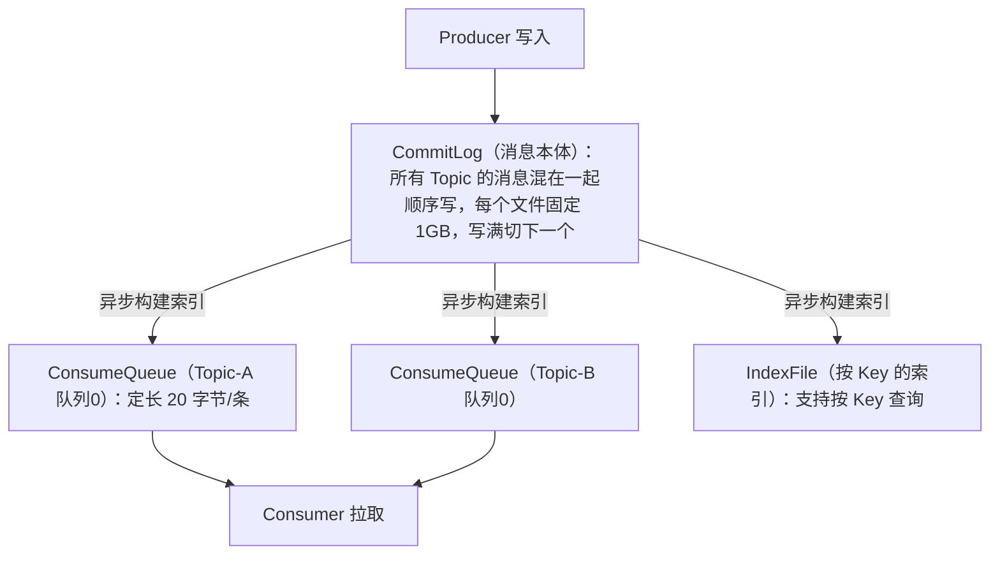
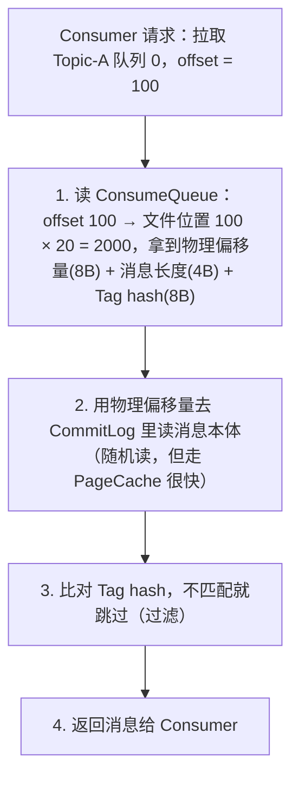

# 06 存储原理、集群与调优

> 本篇回答三个问题：**RocketMQ 为什么这么快**（存储设计）、**消息失败后去了哪**（重试与死信）、**生产上要怎么配**（刷盘、主从、参数、监控、ACL）。理解了存储设计，你就能解释"为什么 RocketMQ 单机能扛十万 TPS"，也能明白很多参数为什么那么设。

## 本篇要解决的问题

- 消息到底存在哪个文件里？CommitLog、ConsumeQueue、IndexFile 是什么关系？
- 同步刷盘和异步刷盘怎么选？会不会丢消息？
- 消费失败的消息去哪了？重试几次？最后呢？
- 消息堆积了怎么救？加队列有用吗？
- 生产上哪些参数必须调？

## 一、存储设计：RocketMQ 快的根本原因

### 三件套



| 文件 | 存什么 | 特点 |
| --- | --- | --- |
| **CommitLog** | **消息本体**（完整内容 + 属性） | **所有 Topic 混着写**，顺序追加，单文件 1GB |
| **ConsumeQueue** | 消息的**索引**（目录） | 每个 Topic 的每个队列一个文件，**每条固定 20 字节**（8 字节物理偏移 + 4 字节长度 + 8 字节 Tag hash） |
| **IndexFile** | 按 MessageKey 的**哈希索引** | 支持 `queryMsgByKey` 查消息，单文件约 400MB |

### 为什么这么设计：顺序写 + 小索引

**关键洞察 1：磁盘顺序写 ≈ 内存随机写**

这是很多人不信但真实存在的现象。机械硬盘的顺序写能达到 100MB/s 以上，而随机写可能只有几百 KB/s，**差了上百倍**。SSD 也有类似差距（没那么夸张）。

RocketMQ 把所有消息**顺序追加**到 CommitLog 一个文件里，把随机写变成了顺序写。

**关键洞察 2：ConsumeQueue 是定长的，可以当数组用**

ConsumeQueue 每条 20 字节，消费时想读第 N 条消息，直接 `N × 20` 算出文件位置，一次就能定位——不用遍历。

**关键洞察 3：所有 Topic 共享一个 CommitLog**

这是 RocketMQ 和 Kafka 最大的存储差异：

| | RocketMQ | Kafka |
| --- | --- | --- |
| 存储单位 | **所有 Topic 共用一个 CommitLog** | 每个 Partition 一个 append-only 文件 |
| Topic 变多时 | 磁盘写入**始终是顺序的** | Partition 很多（比如几千个）时，磁盘 I/O 会**退化成随机写** |
| 优势场景 | **海量 Topic**（官方宣称支持百万级 Topic） | 单 Topic 超大吞吐 |

::: tip 一句话总结
RocketMQ 用"**一个顺序写的大文件 + 一堆定长小索引**"的结构，把"多 Topic 写入"这个本来会导致随机写的场景，变成了纯顺序写。这就是为什么它能同时扛住高并发和海量 Topic。
:::

### 读消息的完整流程



注意第 2 步是**随机读**，但因为 CommitLog 刚写完的内容通常在操作系统的 **PageCache** 里（内存），所以实际上大部分是内存读，很快。

::: warning 消费"冷数据"会很慢
如果消费者要消费几小时前甚至几天前的消息，这些数据早就不在 PageCache 里了，会变成真正的**磁盘随机读**，性能急剧下降，还可能把 PageCache 挤掉影响正常写入。

**这就是"消费堆积后追历史消息特别慢"的原因**。堆积严重时，与其让消费者慢慢追，不如考虑重置位点跳过 + 走离线补偿。
:::

### 零拷贝

RocketMQ 用了 **mmap（内存映射）** 读写文件：把磁盘文件直接映射到进程的虚拟地址空间，读写文件就像读写内存，**省掉一次内核态到用户态的数据拷贝**。

发送大消息给消费者时用 **`sendfile`**（transferTo），数据直接从文件系统缓存送到网卡，**零 CPU 拷贝**。

## 二、刷盘机制

消息写到 CommitLog 有两种落盘方式：

| 方式 | 配置 | 流程 | 可靠性 | 性能 |
| --- | --- | --- | --- | --- |
| **异步刷盘**（默认） | `flushDiskType = ASYNC_FLUSH` | 写到 PageCache 就返回成功，后台线程定时刷盘 | Broker 宕机可能丢**少量**消息 | **高** |
| **同步刷盘** | `flushDiskType = SYNC_FLUSH` | 必须真正写进磁盘才返回成功 | **不丢**（除非磁盘坏了） | 低（TPS 下降明显） |

```properties
# broker.conf
flushDiskType = ASYNC_FLUSH
# 同步刷盘时的超时时间（毫秒），超时会返回 FLUSH_DISK_TIMEOUT
syncFlushTimeout = 5000
```

::: tip 怎么选
- **金融、支付核心链路** → `SYNC_FLUSH`，宁可慢不能丢
- **绝大多数业务**（订单、通知、日志）→ `ASYNC_FLUSH` + 主从复制。Broker 整体宕机是小概率事件，而性能是天天要吃的
- 实测：异步刷盘比同步刷盘 TPS 通常高 **数倍**
:::

## 三、主从复制

| 角色 | 配置 | 行为 | 可靠性 |
| --- | --- | --- | --- |
| `ASYNC_MASTER` | 默认 | Master 写完就返回，异步复制给 Slave | Master 宕机且没同步完 → **丢少量** |
| `SYNC_MASTER` | 手动配 | Master 和 Slave 都写完才返回 | Master 宕机**不丢** |
| `SLAVE` | — | 只接收 Master 的数据，不接受写 | — |

```properties
brokerRole = ASYNC_MASTER
```

::: warning 主从是"备份"不是"自动切换"
老版本（4.5 之前）的 Master/Slave **只是数据备份，不会自动故障转移**。Master 挂了要人工把 Slave 改成 Master（改 `brokerRole` 和 `brokerId` 后重启）。

4.5 之后引入了 **Dledger**（基于 Raft），可以做到**自动选主**。生产要自动切换的话要用 Dledger 模式或多副本（5.x）。
:::

## 四、消息清理

RocketMQ 不会永久保留消息，默认 **保留 48 小时** 后删除过期文件。

```properties
# 每天几点执行清理（04 = 凌晨 4 点）
deleteWhen = 04
# 文件保留时长（小时），默认 48
fileReservedTime = 48
# 磁盘使用率超过这个比例就强制清理（另有 85%、90% 两档，逐级更激进）
diskMaxUsedSpaceRatio = 75
```

清理逻辑：
1. 定时（每天 `deleteWhen` 时刻）检查 CommitLog / ConsumeQueue 文件
2. 文件最后修改时间超过 `fileReservedTime` 就删除
3. 磁盘使用率超过水位时，不管过没过期，从最老的开始删

::: danger 消息被删了但还没消费怎么办
如果消费堆积超过 `fileReservedTime`，那些消息会被**物理删除，永久丢失**。

**防护**：
1. `fileReservedTime` 至少设 72 小时
2. **监控消费堆积（Delay）**，这是必须的告警项
3. 磁盘留足余量，别让水位强制清理频繁触发
:::

## 五、消费重试与死信队列

### 重试队列

消费失败（返回 `RECONSUME_LATER` 或抛异常）后，消息不会立刻重投，而是被放进一个**特殊的重试 Topic**：

```text
%RETRY%<消费组名>
```

比如消费组 `order-consumer-group` 的重试 Topic 就是 `%RETRY%order-consumer-group`。

**重试的时间间隔是递增的**（对应 4.x 的延时等级，从等级 3 开始）：

| 第几次重试 | 1 | 2 | 3 | 4 | 5 | 6 | 7 | 8 |
| --- | --- | --- | --- | --- | --- | --- | --- | --- |
| 延时等级 | 3 | 4 | 5 | 6 | 7 | 8 | 9 | 10 |
| 间隔 | 10s | 30s | 1m | 2m | 3m | 4m | 5m | 6m |

| 第几次重试 | 9 | 10 | 11 | 12 | 13 | 14 | 15 | 16 |
| --- | --- | --- | --- | --- | --- | --- | --- | --- |
| 延时等级 | 11 | 12 | 13 | 14 | 15 | 16 | 17 | 18 |
| 间隔 | 7m | 8m | 9m | 10m | 20m | 30m | 1h | 2h |

**默认最多重试 16 次**，之后进入死信队列。

可以在消费者端改：

```java
// 原生 API
consumer.setMaxReconsumeTimes(3);

// Spring Boot
@RocketMQMessageListener(
        topic = "ORDER_TOPIC",
        consumerGroup = "order-consumer-group",
        maxReconsumeTimes = 3   // ★ 改成 3 次
)
```

::: tip 为什么重试间隔要递增
如果失败原因是"依赖的服务挂了"，立刻重试大概率还是失败，只会白白浪费资源。递增间隔给了下游服务恢复的时间。这是所有重试系统的通用设计。
:::

### 死信队列

重试超过上限后，消息进入死信队列：

```text
%DLQ%<消费组名>
```

**死信队列的特点**：
- 消息**不会再被自动消费**，需要人工介入
- 它的 `perm` 被设为 2（**禁写，只能读**）
- 保留时间同样是 `fileReservedTime`

### 死信消息怎么救

```bash
# 1. 找到死信队列
sh mqadmin topicList -n 127.0.0.1:9876 | grep DLQ
# %DLQ%order-consumer-group

# 2. 查死信消息（按时间范围或 key）
sh mqadmin queryMsgByKey -n 127.0.0.1:9876 -t "%DLQ%order-consumer-group" -k ORDER_10086

# 3. 处理办法：
#    办法一：修好 bug 后，把死信消息重新发到原 Topic（写个小工具读死信再发）
#    办法二：直接人工处理业务逻辑（比如手动补发积分）
#    办法三：确认是脏数据，直接丢弃
```

一个"把死信消息重新投递"的小工具：

```java
package com.canoe.rocketmq.dlq;

import org.apache.rocketmq.client.consumer.DefaultMQPullConsumer;
import org.apache.rocketmq.client.consumer.PullResult;
import org.apache.rocketmq.client.producer.DefaultMQProducer;
import org.apache.rocketmq.common.message.Message;
import org.apache.rocketmq.common.message.MessageExt;

import java.nio.charset.StandardCharsets;
import java.util.List;

/**
 * 死信消息重投工具（思路示例）。
 * 生产建议：用 DefaultLitePullConsumer 或直接在 Dashboard 上查到 body 后手动重发。
 */
public class DlqResender {

    public static void main(String[] args) throws Exception {
        String nameServer = "127.0.0.1:9876";
        String dlqTopic = "%DLQ%order-consumer-group";
        String targetTopic = "ORDER_TOPIC:CREATE";

        DefaultMQProducer producer = new DefaultMQProducer("dlq_resend_producer");
        producer.setNamesrvAddr(nameServer);
        producer.start();

        // 注意：DefaultMQPullConsumer 已废弃，这里仅示意思路。
        // 实际项目推荐：Dashboard 查到消息 → 手动重发；或用 LitePullConsumer 拉取后重发
        DefaultMQPullConsumer pullConsumer = new DefaultMQPullConsumer("dlq_read_consumer");
        pullConsumer.setNamesrvAddr(nameServer);
        pullConsumer.start();

        // 遍历死信队列的所有队列
        org.apache.rocketmq.common.message.MessageQueue mq =
                new org.apache.rocketmq.common.message.MessageQueue(dlqTopic, "broker-a", 0);

        PullResult pullResult = pullConsumer.pullBlockIfNotFound(mq, "*", 0, 32);
        List<MessageExt> msgs = pullResult.getMsgFoundList();
        if (msgs != null) {
            for (MessageExt ext : msgs) {
                System.out.println("死信消息：" + new String(ext.getBody(), StandardCharsets.UTF_8));

                // 重发到原 Topic（注意保留 keys 和 tag）
                Message msg = new Message(targetTopic, ext.getTags(), ext.getKeys(), ext.getBody());
                producer.send(msg);
                System.out.println("已重发：" + ext.getKeys());
            }
        }

        producer.shutdown();
        pullConsumer.shutdown();
    }
}
```

::: warning 重投前先想清楚
死信消息之所以进死信，通常是因为**业务逻辑有问题**或**数据本身有问题**。盲目重投只会再失败一次。

正确流程：
1. 先看死信消息的 body 和失败原因
2. **修好 bug** 或 **修正数据**
3. 再重投
:::

## 六、消息堆积

### 现象与危害

`Delay`（堆积量）持续增长，可能的原因：

| 原因 | 表现 | 解决 |
| --- | --- | --- |
| 消费者挂了 | Delay 线性增长 | 重启消费者 |
| 消费逻辑变慢（依赖慢、GC 长） | Delay 缓慢增长 | 优化消费逻辑，加线程数 |
| 生产量突然暴涨（大促） | Delay 快速增长 | 扩容消费者 |
| 消费一直失败在重试 | Delay 增长，同时重试队列也在涨 | 修 bug |

**危害**：
- 磁盘被写满 → 触发强制清理 → **消息被删** → 数据丢失
- 消费延迟越来越高，业务时效无法保证

### 排查命令

```bash
# 看消费进度和堆积（最重要）
sh mqadmin consumerProgress -n 127.0.0.1:9876 -g order-consumer-group
# #Topic            #Broker  #QID  #BrokerOffset  #ConsumerOffset  #Diff(堆积)
# ORDER_TOPIC       broker-a  0     10000          8000             2000

# 看客户端连接情况（确认消费者是不是真的连上了）
sh mqadmin consumerConnection -n 127.0.0.1:9876 -g order-consumer-group

# 看 Topic 总消息数
sh mqadmin topicStatus -n 127.0.0.1:9876 -t ORDER_TOPIC
```

### 解决办法

**方案一：扩容消费者（最常用）**

加消费者实例，但**不能超过队列数**（见 01 篇）。如果消费者数已经等于队列数了，就得走方案二。

**方案二：临时扩容队列数（终极方案）**

::: warning 增加队列数不能解决"已有"堆积
这是个重要认知：**给 Topic 增加队列，只对新消息生效**。已经堆积在老队列里的消息不会自动迁移到新队列。

所以解决已有堆积的正确做法是**分流**：
1. 新建一个临时 Topic，队列数是原来的 N 倍（比如 16 个）
2. 起一个"转发消费者"，消费原 Topic 的积压消息，**平均分发**到临时 Topic 的 16 个队列
3. 起 N 倍的消费者消费临时 Topic
4. 积压消化完，下线临时 Topic 和转发消费者
:::

```java
package com.canoe.rocketmq.tools;

import org.apache.rocketmq.client.consumer.DefaultMQPushConsumer;
import org.apache.rocketmq.client.consumer.listener.ConsumeConcurrentlyStatus;
import org.apache.rocketmq.client.consumer.listener.MessageListenerConcurrently;
import org.apache.rocketmq.client.producer.DefaultMQProducer;
import org.apache.rocketmq.client.producer.MessageQueueSelector;
import org.apache.rocketmq.client.producer.SendResult;
import org.apache.rocketmq.common.message.Message;
import org.apache.rocketmq.common.message.MessageExt;
import org.apache.rocketmq.common.message.MessageQueue;

import java.nio.charset.StandardCharsets;
import java.util.List;
import java.util.concurrent.atomic.AtomicLong;

/**
 * 积压消息分流器：把老 Topic 的积压消息均匀转发到临时的多队列 Topic。
 * 用于"消费者数已等于队列数，无法再扩容"的紧急场景。
 */
public class BacklogDispatcher {

    public static void main(String[] args) throws Exception {
        String nameServer = "127.0.0.1:9876";
        String sourceTopic = "ORDER_TOPIC";        // 积压的老 Topic（4 个队列）
        String targetTopic = "ORDER_TOPIC_TMP";    // 临时 Topic（建 16 个队列）

        DefaultMQProducer producer = new DefaultMQProducer("dispatch_producer");
        producer.setNamesrvAddr(nameServer);
        producer.start();

        // 用计数器轮询分发，保证均匀
        AtomicLong counter = new AtomicLong(0);

        DefaultMQPushConsumer consumer = new DefaultMQPushConsumer("dispatch_consumer");
        consumer.setNamesrvAddr(nameServer);
        consumer.subscribe(sourceTopic, "*");
        consumer.setConsumeThreadMax(64);

        consumer.registerMessageListener((MessageListenerConcurrently) (msgs, context) -> {
            for (MessageExt ext : msgs) {
                // 原样转发：保留 body 和 keys，tag 也带上
                Message msg = new Message(targetTopic, ext.getTags(), ext.getKeys(), ext.getBody());
                try {
                    // 轮询选队列，保证 16 个队列均匀
                    SendResult result = producer.send(msg, new MessageQueueSelector() {
                        @Override
                        public MessageQueue select(List<MessageQueue> mqs, Message msg, Object arg) {
                            long idx = (Long) arg;
                            return mqs.get((int) (idx % mqs.size()));
                        }
                    }, counter.getAndIncrement());
                } catch (Exception e) {
                    return ConsumeConcurrentlyStatus.RECONSUME_LATER;
                }
            }
            return ConsumeConcurrentlyStatus.CONSUME_SUCCESS;
        });

        consumer.start();
        System.out.println("分流器已启动，把 " + sourceTopic + " 的消息转到 " + targetTopic);
    }
}
```

**方案三：重置消费位点（放弃堆积）**

如果积压的消息已经没有意义（比如是几小时前的通知），可以直接跳过：

```bash
# 1. 先停掉消费者（重要！不停的话位点会被立刻推回去）
# 2. 重置到最后
sh mqadmin resetOffsetByTime -n 127.0.0.1:9876 -g order-consumer-group -t ORDER_TOPIC -s now
# 3. 重启消费者
```

## 七、生产参数调优

### JVM 参数

```bash
# runbroker.sh 里的推荐配置（8 核 16G 机器示例）
JAVA_OPT="${JAVA_OPT} -server -Xms8g -Xmx8g -Xmn4g"
JAVA_OPT="${JAVA_OPT} -XX:+UseG1GC -XX:G1HeapRegionSize=16m"
JAVA_OPT="${JAVA_OPT} -XX:G1ReservePercent=25 -XX:InitiatingHeapOccupancyPercent=30"
JAVA_OPT="${JAVA_OPT} -XX:-UseGCOverheadLimit"
JAVA_OPT="${JAVA_OPT} -XX:+AlwaysPreTouch"          # 启动时就把内存分配好，避免运行时抖动
JAVA_OPT="${JAVA_OPT} -XX:MaxDirectMemorySize=4g"   # 堆外内存，Netty 用
```

::: tip -Xms 和 -Xmx 要设成一样
避免运行时动态扩容带来的 GC 抖动。RocketMQ 大量使用堆外内存（Netty + mmap），`-Xmn`（新生代）建议设成堆的一半。
:::

### Broker 参数

| 参数 | 建议 | 说明 |
| --- | --- | --- |
| `sendMessageThreadPoolNums` | 默认 1（Broker 内部实际会扩） | 发送线程池大小。**报 `broker busy` 时可以调大** |
| `useReentrantLockWhenPutMessage` | false | **报 `[REJECTREQUEST]system busy` 时改成 true**（用可重入锁代替自旋锁，降低 CPU） |
| `sendThreadPoolQueueCapacity` | 10000 | 发送队列容量 |
| `brokerFastFailureEnable` | true | 快速失败，避免请求堆积 |
| `waitTimeMillsInSendQueue` | 200 | 在发送队列里最多等多久 |
| `transientStorePoolEnable` | false | 异步刷盘时启用堆外内存池（**只在异步刷盘 + SYNC_MASTER 关掉时开**） |
| `maxTransferBytesOnMessageInMemory` | 262144 | 内存态消息一次传输的最大字节 |
| `mappedFileSizeCommitLog` | 1073741824 (1G) | CommitLog 单文件大小。**改小=切文件频繁；改大=恢复慢**，一般不动 |

::: warning broker busy 怎么解
日志里出现 `[TIMEOUT_CLEAN_QUEUE]broker busy` 或 `system busy`，说明 Broker 处理不过来了。按这个顺序处理：

1. 先确认是不是磁盘 IO 到瓶颈了（`iostat -x 1` 看 `%util` 和 `await`）
2. 是的话换 SSD，或者减少同步刷盘
3. 不是的话调 `sendMessageThreadPoolNums`（比如改成 32）+ `useReentrantLockWhenPutMessage=true`
4. 检查是不是消息太大（`maxMessageSize`），大消息会严重拖慢 Broker
:::

### 操作系统参数

```bash
# 1. 文件描述符（RocketMQ 会开大量文件）
ulimit -n 655350
# 写入 /etc/security/limits.conf：
# * soft nofile 655350
# * hard nofile 655350

# 2. 虚拟内存区域数量（mmap 用）
echo "vm.max_map_count = 655360" >> /etc/sysctl.conf

# 3. 脏页刷盘参数（关键！影响异步刷盘性能）
echo "vm.dirty_background_ratio = 5"    >> /etc/sysctl.conf   # 后台开始刷盘的阈值
echo "vm.dirty_ratio = 10"              >> /etc/sysctl.conf   # 强制刷盘的阈值
echo "vm.dirty_expire_centisecs = 1000" >> /etc/sysctl.conf   # 脏页多久算过期
sysctl -p

# 4. 禁用 swap（内存交换会毁掉性能）
swapoff -a
# 注释掉 /etc/fstab 里的 swap 行

# 5. 磁盘 IO 调度（SSD 用 noop/deadline，机械盘用 deadline）
echo "deadline" > /sys/block/sda/queue/scheduler
```

### 客户端参数

| 参数 | 建议 | 说明 |
| --- | --- | --- |
| `consumeThreadMin/Max` | 20~64 | 消费线程数，**受队列数上限约束** |
| `pullBatchSize` | 32 | 一次拉多少条 |
| `consumeMessageBatchMaxSize` | 1 | 一次消费多少条（**批量消费要业务支持才调大**） |
| `retryTimesWhenSendFailed` | 2~3 | 发送重试次数 |
| `sendMsgTimeout` | 3000~5000 | 发送超时 |
| `vipChannelEnabled` | false（端口受限时） | 关闭 VIP 通道 |
| `maxReconsumeTimes` | 3~5 | 重试上限，别让它一直重试 |

## 八、监控

### 监控什么

| 指标 | 怎么取 | 告警阈值建议 |
| --- | --- | --- |
| ★ **消费堆积 Delay** | `consumerProgress` 的 `#Diff` | **> 10000 持续 5 分钟** 告警（按业务调整） |
| 消费 TPS | Dashboard / Exporter | 突然跌到 0 → 消费者挂了 |
| 生产 TPS | Dashboard / Exporter | 异常暴涨/暴跌 |
| Broker 磁盘使用率 | `df` / `diskMaxUsedSpaceRatio` | **> 80% 告警**（超过 90% 会强制清理） |
| Broker 内存 | JVM 监控 | > 80% 告警 |
| 死信队列消息数 | `topicStatus` 查 `%DLQ%xxx` | **> 0 就要看** |
| 重试队列消息数 | `topicStatus` 查 `%RETRY%xxx` | 持续增长说明消费有问题 |
| CommitLog 目录大小 | `du -sh store/commitlog` | 结合磁盘一起看 |
| 消息发送 RT | `checkMsgSendRT` | P99 > 100ms 要关注 |

### Prometheus + Grafana

```bash
# 用 rocketmq-exporter
docker run -d --name rocketmq-exporter \
  -p 5557:5557 \
  -e "rocketmq.config.namesrvAddr=你的IP:9876" \
  apache/rocketmq-exporter:latest

# 指标接口
curl http://localhost:5557/metrics
```

Grafana 里导入 RocketMQ 官方 Dashboard（搜索 `rocketmq` 找一个 star 高的，比如 ID 10477）。

### 消息轨迹

```properties
# broker.conf 开启
traceTopicEnable = true
```

```java
// 生产者开启轨迹
DefaultMQProducer producer = new DefaultMQProducer("group", true);  // 第二个参数 enableMsgTrace
// 或
producer.setEnableMsgTrace(true);

// 消费者开启轨迹
consumer.setEnableMsgTrace(true);
```

开启后可以在 Dashboard 的 **Message Trace** 页面看到：谁发的、什么时候发的、落到哪台 Broker、被谁消费了、消费成功还是失败。

::: warning 消息轨迹有性能开销
轨迹本身也是消息（写到 `RMQ_SYS_TRACE_TOPIC`），全量开启会增加约 10% 的开销。**生产建议只对核心 Topic 开启**，或者采样率调低。
:::

## 九、ACL 权限控制

生产环境不该让任何人都能发消息。RocketMQ 2.0+ 支持 ACL。

### Broker 端

```properties
# broker.conf
aclEnable = true
```

配置 `conf/plain_acl.yml`：

```yaml
globalWhiteRemoteAddresses:
  - 10.10.103.*
  - 192.168.0.*

accounts:
  - accessKey: RocketMQ
    secretKey: 12345678
    whiteRemoteAddress:
    admin: false
    defaultTopicPerm: DENY
    defaultGroupPerm: SUB
    topicPerms:
      - ORDER_TOPIC=PUB|SUB
      - PAY_TOPIC=PUB
    groupPerms:
      - order-consumer-group=SUB

  - accessKey: admin
    secretKey: 12345678
    admin: true
```

权限值：`PUB`（发）、`SUB`（订阅）、`PUB|SUB`（都有）、`DENY`（拒绝）。

### 客户端接入

```java
package com.canoe.rocketmq.acl;

import org.apache.rocketmq.acl.common.AclClientRPCHook;
import org.apache.rocketmq.acl.common.SessionCredentials;
import org.apache.rocketmq.client.producer.DefaultMQProducer;
import org.apache.rocketmq.remoting.RPCHook;

/**
 * 带 ACL 鉴权的生产者。
 */
public class AclProducerDemo {

    public static void main(String[] args) throws Exception {
        String accessKey = "RocketMQ";
        String secretKey = "12345678";

        // 构造 ACL 的 RPC Hook
        RPCHook rpcHook = new AclClientRPCHook(new SessionCredentials(accessKey, secretKey));

        // 把 rpcHook 传给 Producer 的构造方法
        DefaultMQProducer producer = new DefaultMQProducer("acl_producer_group", rpcHook);
        producer.setNamesrvAddr("127.0.0.1:9876");
        producer.start();

        // 之后正常发消息即可，鉴权在底层自动完成
        producer.shutdown();
    }
}
```

需要的额外依赖：

```xml
<dependency>
    <groupId>org.apache.rocketmq</groupId>
    <artifactId>rocketmq-acl</artifactId>
    <version>5.3.4</version>
</dependency>
```

::: tip 生产建议
- **不要开 `globalWhiteRemoteAddresses: *`**，只放行内网网段
- 每个应用一个 `accessKey`，权限最小化（只给它需要的 Topic 的 PUB 或 SUB）
- 定期轮换 `secretKey`
:::

## 十、生产调优 checklist

```text
【存储与可靠性】
□ flushDiskType 按业务选好（核心链路 SYNC_FLUSH，其余 ASYNC_FLUSH）
□ brokerRole 按业务选好（ASYNC_MASTER / SYNC_MASTER）
□ fileReservedTime ≥ 72 小时
□ 磁盘留足余量（监控 diskMaxUsedSpaceRatio，别超过 80%）
□ 用 SSD，机械盘扛不住高并发

【高可用】
□ NameServer 至少 2 台
□ Broker 配 Slave（主从在不同机器）
□ 需要自动切换的话用 Dledger 或多副本
□ brokerIP1 显式配置（多网卡/容器环境必配）

【客户端】
□ Producer 单例复用，不每条消息 new
□ 应用关闭时 shutdown()
□ 发送时设置 keys（业务唯一 ID）
□ 消费端做幂等（状态机 / 唯一索引 / Redis SETNX）
□ 判断 reconsumeTimes 设重试上限，别无限重试
□ 消费者数 ≤ 队列数
□ consumerGroup 不跨应用复用

【运维】
□ 监控消费堆积 Delay 并配告警
□ 监控死信队列（>0 就要看）
□ 监控磁盘、内存、JVM
□ 关闭 autoCreateTopicEnable，Topic 走审批创建
□ 开启 ACL（生产环境）
□ 定期演练：Broker 宕机、消费堆积、消息回溯

【参数】
□ ulimit -n、vm.max_map_count、脏页参数已调
□ 关闭 swap
□ JVM 参数 -Xms = -Xmx，用 G1GC
□ Docker 环境必须设 JAVA_OPT_EXT 降内存
```

## 本篇小结

- **存储三件套**：CommitLog（消息本体，所有 Topic 混着顺序写）、ConsumeQueue（定长 20 字节的索引）、IndexFile（按 Key 的哈希索引）。
- **快的根本原因**：把随机写变成顺序写（顺序写 ≈ 内存随机写的速度）+ 定长索引可随机定位 + **所有 Topic 共享一个 CommitLog**，Topic 再多也不会退化成随机写。
- 读消息是"**先查 ConsumeQueue 拿物理偏移，再去 CommitLog 随机读**"，靠 PageCache 加速；**消费冷数据会很慢**（不在 PageCache 里）。
- **异步刷盘**（默认）性能好但宕机可能丢少量；**同步刷盘**不丢但 TPS 掉几倍。金融用同步，其余用异步 + 主从。
- 老版本主从**只是备份不会自动切换**，要自动切得用 Dledger（4.5+）或多副本（5.x）。
- 消息默认保留 **48 小时**，`fileReservedTime` 建议 ≥72 小时，否则堆积超限会被**物理删除**。
- 消费失败进 `%RETRY%<消费组>` 重试队列，**间隔递增**（10s → 30s → 1m → ... → 2h），**默认最多 16 次**。
- 重试超限进 `%DLQ%<消费组>` **死信队列**，禁写只读，不会自动消费，要人工介入（先修 bug 再重投）。
- **消息堆积时增加队列数没用**（只对新消息生效），得用"临时多队列 Topic + 转发消费者"分流，或者直接重置位点跳过。
- 调优三块：JVM（`-Xms`=`-Xmx`、G1GC、堆外内存）、Broker（`sendMessageThreadPoolNums`、`useReentrantLockWhenPutMessage`）、OS（`ulimit`、`vm.max_map_count`、脏页参数、关 swap）。
- **必须监控消费堆积 Delay**，这是 MQ 最重要的告警项；死信队列 >0 就要看。
- 生产开 **ACL**，每个应用独立 accessKey + 最小权限，别开全局白名单。

## 参考链接

- [RocketMQ 存储设计（官方）](https://rocketmq.apache.org/zh/docs/bestPractice/02diveinto/)
- [RocketMQ 消息重试与死信](https://rocketmq.apache.org/zh/docs/featureBehavior/09consumerretryanddlq/)
- [RocketMQ 最佳实践](https://rocketmq.apache.org/zh/docs/bestPractice/01dployment/)
- [RocketMQ 系统参数调优](https://rocketmq.apache.org/zh/docs/bestPractice/03systemtuning/)
- [rocketmq-exporter GitHub](https://github.com/apache/rocketmq-exporter)
- [RocketMQ ACL 使用指南](https://rocketmq.apache.org/zh/docs/featureBehavior/03ACL/)

下一篇 → [回到 01 入门与整体架构](/java/middleware/rocketmq/overview)（RocketMQ 篇到此结束）
