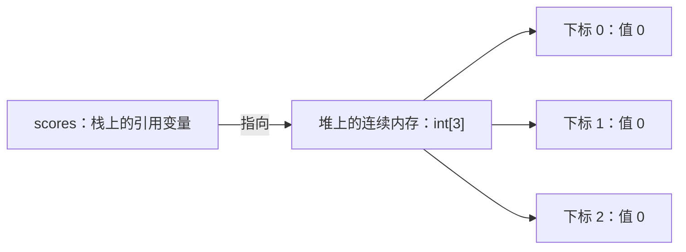
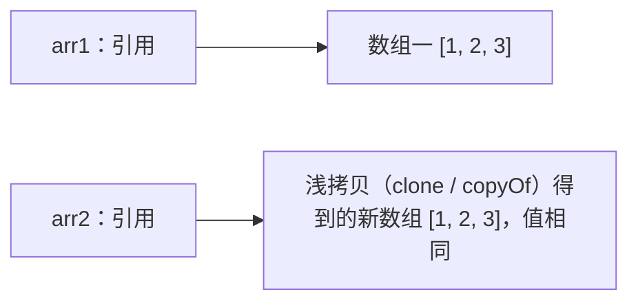
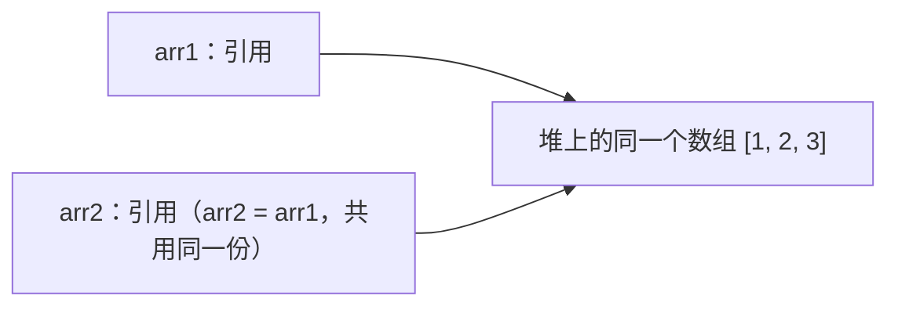

# 05 数组操作

> 本篇导读：数组是 Java 里最基础、最高频的"批量装数据"容器。本篇从"数组在内存里长什么样"讲起，带你掌握声明初始化、下标访问与遍历、`Arrays` 工具类的各种好用方法、二维与不规则数组、深浅拷贝，以及数组与集合的相互转换，最后用一串经典算法练习收尾。

## 一、数组是什么

数组（Array）是**相同类型数据**的**固定长度**容器，元素在内存中**连续存放**。

**为什么下标从 0 开始？** 因为访问第 `i` 个元素时，CPU 用公式 `起始地址 + i × 每个元素字节数` 直接算出位置（偏移量）。让 `i` 从 0 开始，公式最简洁：`首地址 + 0` 就是第一个元素。从 1 开始反而要多减一次，既浪费又易错。

数组是**对象**，本体存在堆（heap）上，变量只是保存指向它的"引用"：



## 二、声明与初始化

三种写法对比：

| 写法 | 说明 |
| --- | --- |
| `new int[5]` | 只定长度，元素取默认值 |
| `new int[]{1,2,3}` | 边给值边定长度 |
| `{1,2,3}` | 简写，**只能声明时直接赋值** |

**默认值表**（只分配空间、没赋值时）：

| 类型 | 默认值 |
| --- | --- |
| `int` / `long` / `short` / `byte` | `0` |
| `float` / `double` | `0.0` |
| `char` | `'\u0000'`（空字符） |
| `boolean` | `false` |
| 引用类型（如 `String`） | `null` |

```java
package com.canoe.quickstart.array;

// 文件名：ArrayInit.java
// 演示三种初始化写法与默认值
public class ArrayInit {

    public static void main(String[] args) {
        // 写法一：只定长度，元素为默认值（int 默认 0）
        int[] a = new int[3];
        System.out.println("a[0] 默认值=" + a[0]); // 0

        // 写法二：边给值边定长度
        int[] b = new int[]{10, 20, 30};

        // 写法三：简写（声明时才能用）
        String[] c = {"小明", "小红", "小刚"};

        // 引用类型默认值是 null
        String[] d = new String[2];
        System.out.println("d[0] 默认值=" + d[0]); // null
    }
}
```

## 三、访问与遍历

- **下标访问**：`arr[0]` 取第一个元素，**下标范围 0 ~ length-1**。
- **越界异常**：访问超出范围会抛 `ArrayIndexOutOfBoundsException`（运行时异常，编译不报错，必须小心）。
- **两种遍历**：普通 `for`（能拿到下标、能改元素）vs 增强 `for`（只读、简洁）。
- **`length` 是属性不是方法**，后面没有 `()`。

```java
package com.canoe.quickstart.array;

import java.util.Arrays;

// 文件名：ArrayVisit.java
// 演示访问、越界、两种遍历方式
public class ArrayVisit {

    public static void main(String[] args) {
        int[] scores = {88, 92, 75};

        // 普通 for：能拿到下标
        for (int i = 0; i < scores.length; i++) {
            System.out.println("第 " + (i + 1) + " 个：" + scores[i]);
        }

        // 增强 for：只读遍历，拿不到下标
        for (int s : scores) {
            System.out.println("成绩：" + s);
        }

        // 越界会抛异常：scores 只有 0~2，下标 3 不存在
        // System.out.println(scores[3]); // ArrayIndexOutOfBoundsException
    }
}
```

## 四、Arrays 工具类

`java.util.Arrays` 提供了一堆静态方法，日常操作数组基本靠它：

| 方法 | 作用 |
| --- | --- |
| `toString(arr)` | 把数组转成可读字符串（调试打印必备） |
| `sort(arr)` | 排序（默认升序） |
| `binarySearch(arr, key)` | 二分查找，数组须先排序，找不到返回负值 |
| `fill(arr, val)` | 把所有元素填成同一个值 |
| `copyOf(arr, n)` | 复制出长度为 n 的新数组 |
| `equals(a, b)` | 比较两个数组内容是否相等 |
| `asList(arr)` | 把数组转成 `List`（但有坑） |

**`asList` 的两个大坑**：

1. 返回的是**定长 List**，不能 `add` / `remove`，否则抛 `UnsupportedOperationException`。
2. 传入**基本类型数组**时，它会把"整个数组"当成一个元素，`List` 的 `size` 是 1，而不是元素个数。

```java
package com.canoe.quickstart.array;

import java.util.Arrays;
import java.util.List;

// 文件名：ArrayTools.java
// 演示 Arrays 工具类的常用方法，以及 asList 的坑
public class ArrayTools {

    public static void main(String[] args) {
        int[] nums = {3, 1, 2};

        // toString：打印数组内容
        System.out.println("原数组：" + Arrays.toString(nums));

        // sort + binarySearch：先排序再查找
        Arrays.sort(nums);
        System.out.println("排序后：" + Arrays.toString(nums));
        int idx = Arrays.binarySearch(nums, 2);
        System.out.println("2 的位置=" + idx);

        // fill：整体填充
        int[] pad = new int[3];
        Arrays.fill(pad, 9);
        System.out.println("填充后：" + Arrays.toString(pad));

        // equals：比较内容
        int[] x = {1, 2, 3};
        int[] y = {1, 2, 3};
        System.out.println("内容相等=" + Arrays.equals(x, y)); // true

        // copyOf：复制成指定长度
        int[] z = Arrays.copyOf(x, 5);
        System.out.println("复制扩容：" + Arrays.toString(z)); // [1,2,3,0,0]

        // ⚠️ asList 坑一：基本类型数组被当成一个元素，size=1
        List<int[]> wrong = Arrays.asList(nums);
        System.out.println("基本类型数组 asList 的 size=" + wrong.size()); // 1

        // ⚠️ asList 坑二：返回的 List 定长，add 会抛异常
        String[] names = {"小明", "小红"};
        List<String> list = Arrays.asList(names);
        System.out.println("字符串数组 asList 的 size=" + list.size()); // 2
        // list.add("小刚"); // ❌ UnsupportedOperationException
    }
}
```

## 五、数组排序

- `Arrays.sort` 底层很聪明：**基本类型**用双轴快速排序，**对象类型**用 TimSort（稳定、适合近似有序数据）。
- **对象数组**排序有两种方式：让类实现 `Comparable` 接口（定义"自然顺序"），或排序时传入 `Comparator`（临时指定规则）。
- **降序**：基本类型用 `Comparator` 反转；或者用 Lambda 一行搞定。

```java
package com.canoe.quickstart.array;

import java.util.Arrays;
import java.util.Comparator;

// 文件名：ArraySort.java
// 演示对象数组排序：Comparable 自然顺序 + Comparator/Lambda 降序
public class ArraySort {

    // 学生类，实现 Comparable 定义"按分数自然升序"
    static class Student implements Comparable<Student> {
        String name;
        int score;

        Student(String name, int score) {
            this.name = name;
            this.score = score;
        }

        @Override
        public int compareTo(Student o) {
            return this.score - o.score; // 升序
        }

        @Override
        public String toString() {
            return name + "(" + score + ")";
        }
    }

    public static void main(String[] args) {
        Student[] class1 = {
                new Student("小明", 88),
                new Student("小红", 95),
                new Student("小刚", 76)
        };

        // ① 靠 Comparable 自然升序
        Arrays.sort(class1);
        System.out.println("升序：" + Arrays.toString(class1));

        // ② 用 Comparator 降序（匿名写法）
        Arrays.sort(class1, new Comparator<Student>() {
            @Override
            public int compare(Student a, Student b) {
                return b.score - a.score; // 反转即降序
            }
        });
        System.out.println("降序(匿名)：" + Arrays.toString(class1));

        // ③ Lambda 一行写 Comparator 降序
        Arrays.sort(class1, (a, b) -> a.score - b.score);
        System.out.println("升序(Lambda)：" + Arrays.toString(class1));
    }
}
```

## 六、二维数组

Java 的二维数组**本质是一维数组的数组**：外层数组的每个元素，又是一个一维数组。正因为如此，它可以是**不规则数组**——每一行的长度可以不同。

```text
int[][] m = { {1,2,3}, {4,5}, {6,7,8,9} };

m (引用)
 ├─ m[0] → [1, 2, 3]
 ├─ m[1] → [4, 5]
 └─ m[2] → [6, 7, 8, 9]    每行长度不同（不规则）
```

```java
package com.canoe.quickstart.array;

import java.util.Arrays;

// 文件名：TwoDArray.java
// 演示二维数组（含不规则数组）的创建与遍历
public class TwoDArray {

    public static void main(String[] args) {
        // 规则二维数组：3 行 3 列
        int[][] matrix = new int[3][3];
        matrix[0][0] = 1;
        matrix[2][2] = 9;

        // 不规则数组：每行长度不同
        int[][] irregular = {
                {1, 2, 3},
                {4, 5},
                {6, 7, 8, 9}
        };

        // 遍历：外层走行，内层走列（注意每行长度用 irregular[i].length）
        for (int i = 0; i < irregular.length; i++) {
            for (int j = 0; j < irregular[i].length; j++) {
                System.out.print(irregular[i][j] + " ");
            }
            System.out.println();
        }
        System.out.println("第一行内容：" + Arrays.toString(irregular[0]));
    }
}
```

## 七、数组拷贝

数组是引用类型，拷贝要分清"复制引用"还是"复制内容"：

| 方式 | 特点 |
| --- | --- |
| `arr2 = arr1` | 只复制**引用**，两变量指向**同一个数组**，改一个另一个也变 |
| `arr.clone()` | 复制出**新数组**（浅拷贝） |
| `System.arraycopy` | 底层 native 方法，高效，可指定起止位置 |
| `Arrays.copyOf` | 最常用，内部调用 `arraycopy`，能顺便扩容 |

> 数组里存的是基本类型时，"浅拷贝"就足够（值独立）；只有数组元素是对象时，浅拷贝才会让新旧数组共享同一批对象。





```java
package com.canoe.quickstart.array;

import java.util.Arrays;

// 文件名：ArrayCopy.java
// 演示 = 只复制引用，以及 clone / copyOf 复制内容
public class ArrayCopy {

    public static void main(String[] args) {
        int[] a = {1, 2, 3};

        // ❌ 只复制引用：b 和 a 指向同一个数组
        int[] b = a;
        b[0] = 999;
        System.out.println("a 被改了：" + Arrays.toString(a)); // [999,2,3]

        // ✅ clone：得到独立的新数组
        int[] c = a.clone();
        c[0] = 1;
        System.out.println("a 不受影响：" + Arrays.toString(a)); // [999,2,3]

        // ✅ Arrays.copyOf：常用且可扩容
        int[] d = Arrays.copyOf(a, 5);
        System.out.println("copyOf 扩容：" + Arrays.toString(d)); // [999,2,3,0,0]
    }
}
```

## 八、数组与集合的转换

实际开发中常在数组和 `List` 之间来回转：

- **数组 → List**：用 `Arrays.asList`（记得前面的定长坑）；若要可增删的 `List`，再包一层 `new ArrayList<>(...)`。
- **List → 数组**：用 `toArray(new String[0])`。传 `new String[0]`（空数组）是推荐写法——JDK 会根据实际大小**自动创建正好大小的数组**，既安全又不浪费。

```java
package com.canoe.quickstart.array;

import java.util.ArrayList;
import java.util.Arrays;
import java.util.List;

// 文件名：ArrayCollection.java
// 演示数组与 List 的相互转换
public class ArrayCollection {

    public static void main(String[] args) {
        String[] names = {"小明", "小红", "小刚"};

        // 数组 → List（定长，不能增删）
        List<String> fixed = Arrays.asList(names);

        // 想要可增删的 List，再包一层 ArrayList
        List<String> list = new ArrayList<String>(Arrays.asList(names));
        list.add("小美");
        System.out.println("List：" + list);

        // List → 数组：推荐 toArray(new String[0])
        String[] back = list.toArray(new String[0]);
        System.out.println("转回数组：" + Arrays.toString(back));
    }
}
```

## 九、常见算法练习

下面给出 5 个高频数组算法，每个都能独立运行。

**① 最大最小值**

```java
package com.canoe.quickstart.array;

// 文件名：MaxMin.java
// 找出数组的最大值与最小值
public class MaxMin {

    public static void main(String[] args) {
        int[] arr = {5, 2, 9, 1, 7, 3};
        int max = arr[0], min = arr[0];
        for (int v : arr) {
            if (v > max) max = v;
            if (v < min) min = v;
        }
        System.out.println("最大值=" + max + " 最小值=" + min);
    }
}
```

**② 线性查找 + 二分查找**（二分要求数组已排序）

```java
package com.canoe.quickstart.array;

// 文件名：SearchDemo.java
// 线性查找（无序可用）与二分查找（须有序）
public class SearchDemo {

    public static void main(String[] args) {
        int[] arr = {5, 2, 9, 1, 7, 3};

        // 线性查找：从头比到尾
        int target = 9, idx = -1;
        for (int i = 0; i < arr.length; i++) {
            if (arr[i] == target) {
                idx = i;
                break;
            }
        }
        System.out.println("线性查找 " + target + " 的位置=" + idx);

        // 二分查找：先排序，再左右夹逼
        java.util.Arrays.sort(arr);
        int left = 0, right = arr.length - 1, pos = -1;
        while (left <= right) {
            int mid = (left + right) / 2;
            if (arr[mid] == target) {
                pos = mid;
                break;
            } else if (arr[mid] < target) {
                left = mid + 1;
            } else {
                right = mid - 1;
            }
        }
        System.out.println("二分查找 " + target + " 的位置=" + pos);
    }
}
```

**③ 数组反转**

```java
package com.canoe.quickstart.array;

import java.util.Arrays;

// 文件名：ReverseArray.java
// 原地反转数组（头尾两两交换）
public class ReverseArray {

    public static void main(String[] args) {
        int[] arr = {1, 2, 3, 4, 5};
        int left = 0, right = arr.length - 1;
        while (left < right) {
            int temp = arr[left];
            arr[left] = arr[right];
            arr[right] = temp;
            left++;
            right--;
        }
        System.out.println("反转后：" + Arrays.toString(arr)); // [5,4,3,2,1]
    }
}
```

**④ 去重**（先排序，再压缩相邻重复元素）

```java
package com.canoe.quickstart.array;

import java.util.Arrays;

// 文件名：DistinctArray.java
// 对数组去重（先排序，再保留不重复的元素）
public class DistinctArray {

    public static void main(String[] args) {
        int[] arr = {3, 1, 2, 3, 2, 1, 4};
        Arrays.sort(arr); // 排序后相同元素相邻

        int[] temp = new int[arr.length];
        int size = 0;
        for (int i = 0; i < arr.length; i++) {
            // 第一个，或和前一个不同，就保留
            if (i == 0 || arr[i] != arr[i - 1]) {
                temp[size++] = arr[i];
            }
        }
        int[] result = Arrays.copyOf(temp, size);
        System.out.println("去重后：" + Arrays.toString(result)); // [1,2,3,4]
    }
}
```

**⑤ 两个有序数组合并**

```java
package com.canoe.quickstart.array;

import java.util.Arrays;

// 文件名：MergeSorted.java
// 合并两个已排序数组，结果仍有序
public class MergeSorted {

    public static void main(String[] args) {
        int[] a = {1, 3, 5};
        int[] b = {2, 4, 6};
        int[] merged = new int[a.length + b.length];

        int i = 0, j = 0, k = 0;
        // 双指针：谁小先放谁
        while (i < a.length && j < b.length) {
            if (a[i] < b[j]) {
                merged[k++] = a[i++];
            } else {
                merged[k++] = b[j++];
            }
        }
        // 把剩下的补齐
        while (i < a.length) merged[k++] = a[i++];
        while (j < b.length) merged[k++] = b[j++];

        System.out.println("合并后：" + Arrays.toString(merged)); // [1,2,3,4,5,6]
    }
}
```

## 本篇小结

- 数组是**同类型、固定长度**的容器，元素在内存中**连续存放**，本体在堆上。
- 下标从 **0** 开始，源于"首地址 + 偏移量"的计算方式。
- 声明初始化有**三种写法**，只分配空间时元素取**默认值**（int=0、boolean=false、引用=null）。
- 访问越界会抛 **`ArrayIndexOutOfBoundsException`**，`length` 是**属性**不是方法。
- `Arrays.toString` 是**调试打印数组**的标配；`sort`/`binarySearch`/`fill`/`copyOf`/`equals` 各司其职。
- `Arrays.asList` 有两大坑：**定长不可增删**、**基本类型数组会被当成一个元素**。
- `Arrays.sort` 对基本类型用**双轴快排**、对对象用 **TimSort**；降序用 `Comparator` 或 Lambda。
- 二维数组本质是**一维数组的数组**，因此可以是**不规则数组**（每行长度不同）。
- 拷贝要分清：`=` 只复制**引用**，`clone` / `Arrays.copyOf` 才复制**内容**。
- 数组转 List 用 `Arrays.asList`；List 转数组推荐 **`toArray(new String[0])`**。

## 参考链接

- [Oracle Java 教程：数组](https://docs.oracle.com/javase/tutorial/java/nutsandbolts/arrays.html)
- [Arrays 官方 API](https://docs.oracle.com/en/java/javase/21/docs/api/java.base/java/util/Arrays.html)
- [Comparable 官方 API](https://docs.oracle.com/en/java/javase/21/docs/api/java.base/java/lang/Comparable.html)
- [Comparator 官方 API](https://docs.oracle.com/en/java/javase/21/docs/api/java.base/java/util/Comparator.html)
- [System.arraycopy 文档](https://docs.oracle.com/en/java/javase/21/docs/api/java.base/java/lang/System.html#arraycopy(java.lang.Object,int,java.lang.Object,int,int))
- [ArrayList 官方 API](https://docs.oracle.com/en/java/javase/21/docs/api/java.base/java/util/ArrayList.html)
- [廖雪峰 Java 教程：数组](https://www.liaoxuefeng.com/wiki/1252599548343744/1265122633993888)
- [Java 算法可视化（Visualgo）](https://visualgo.net/en/sorting)

下一篇 → [返回专栏首页](/java/quickstart/env)
