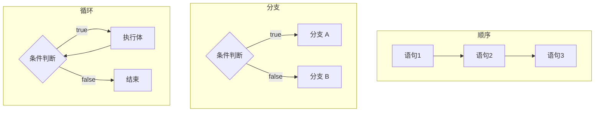

# 04 流程控制

> 本篇导读：程序之所以"智能"，是因为它能根据条件走不同的路、能一遍遍重复干活。本篇带你掌握 Java 的三种执行结构——顺序、分支、循环，重点拆解 `if`、`switch`、各种 `for`/`while` 的写法与坑，以及 `break`/`continue` 和调试技巧。把流程控制练熟，算法题和真实业务都不在话下。

## 一、顺序、分支、循环三种结构

程序执行只有三种基本结构：

- **顺序**：从上到下依次执行，绝大多数代码都是这样。
- **分支**：根据条件判断，走不同的分支（`if`、`switch`）。
- **循环**：满足条件下，把一段代码重复执行多次（`for`、`while`）。



## 二、if 判断

`if` 有四种常见形态：单 `if`、`if-else`、`if-else if-else`、嵌套。几个**重点坑**：

1. **省略花括号的坑**：`if` 后面如果不写 `{}`，它只控制**紧接着的第一行**。下面代码看起来两行都受 `if` 控制，其实只有打印受控制，永远会执行"扣钱"——这是经典 bug。

```java
if (score >= 60)
    System.out.println("及格");
    System.out.println("奖励糖果"); // ❌ 这行永远执行，不受 if 控制！
```

正确写法是无论几行都加 `{}`。

2. **`else` 就近匹配**：`else` 总是和最靠近它的那个 `if` 配对。
3. **引用类型别用 `==` 比较内容**：`==` 比较的是地址。`String` 内容比较要用 `equals`。

```java
package com.canoe.quickstart.control;

import java.util.Scanner;

// 文件名：IfDemo.java
// 演示 if / if-else / if-else if-else，以及成绩评级
public class IfDemo {

    public static void main(String[] args) {
        Scanner sc = new Scanner(System.in);
        System.out.print("请输入成绩：");
        int score = sc.nextInt();

        // 单 if：不及格才警告
        if (score < 60) {
            System.out.println("警告：需要补考！");
        }

        // if-else if-else：分段评级（强烈建议永远带花括号）
        String level;
        if (score >= 90) {
            level = "优秀";
        } else if (score >= 75) {
            level = "良好";
        } else if (score >= 60) {
            level = "及格";
        } else {
            level = "不及格";
        }
        System.out.println("评级=" + level);
        sc.close();
    }
}
```

## 三、switch 语句

`switch` 适合"一个变量等于多个固定值"的分支判断。

**传统写法（注意穿透）**：`case` 后面如果不写 `break`，会"穿透"继续执行下一个 `case`，这是老 `switch` 最常见的 bug。

**Java 12+ 的 switch 表达式**：用 `->` 代替冒号，自动不穿透，还能直接返回值；需要返回多语句时用 `yield` 给出值。

```java
package com.canoe.quickstart.control;

// 文件名：SwitchDemo.java
// 对比传统 switch（易穿透）与 Java 12+ switch 表达式（-> 自动不穿透）
public class SwitchDemo {

    public static void main(String[] args) {
        int month = 2;

        // ① 传统写法：每个 case 必须手动 break，否则穿透
        String seasonOld;
        switch (month) {
            case 12:
            case 1:
            case 2:
                seasonOld = "冬季";
                break;
            case 3:
            case 4:
            case 5:
                seasonOld = "春季";
                break;
            default:
                seasonOld = "其他";
        }
        System.out.println("传统写法：" + seasonOld);

        // ② 新写法（Java 12+ 表达式）：-> 自动不穿透，还能直接赋值
        String seasonNew = switch (month) {
            case 12, 1, 2 -> "冬季";
            case 3, 4, 5 -> "春季";
            case 6, 7, 8 -> "夏季";
            case 9, 10, 11 -> "秋季";
            default -> {
                // 多语句时用 yield 返回结果
                System.out.println("非法月份：" + month);
                yield "未知";
            }
        };
        System.out.println("新写法：" + seasonNew);
    }
}
```

## 四、while 与 do-while

两者都"先判断后循环"，但 `do-while` **至少执行一次**——它先做事，再判断要不要继续。

**死循环的常见成因**：循环条件永远为真，或循环变量始终不更新（忘了 `i++`）。写循环时一定想清楚"什么条件让它停下来"。

```java
package com.canoe.quickstart.control;

// 文件名：WhileDemo.java
// 演示 while（先判断）与 do-while（至少执行一次）的区别
public class WhileDemo {

    public static void main(String[] args) {
        // while：条件不满足时一次都不执行
        int i = 1;
        while (i <= 3) {
            System.out.println("while 第 " + i + " 次");
            i++;
        }

        // do-while：哪怕条件一开始就不满足，也先执行一次
        int j = 1;
        do {
            System.out.println("do-while 第 " + j + " 次");
            j++;
        } while (j <= 0); // 条件为假，但上面已经执行过一次
    }
}
```

## 五、for 循环

标准 `for` 的三部分：`for (初始化; 条件; 更新)`。执行顺序是：

```text
初始化(仅一次) → 条件判断 → 条件true则执行循环体 → 更新变量 → 再判断 → ...
```

- 在 `for` 里定义的变量（如 `int i`）**作用域只在这个 for 内**，出了循环访问不到。
- 三部分都可以是**逗号表达式**，同时操作多个变量。

```java
package com.canoe.quickstart.control;

// 文件名：ForDemo.java
// 演示 for 三部分执行顺序，以及逗号表达式同时控制两个变量
public class ForDemo {

    public static void main(String[] args) {
        // 普通 for：打印 0~4
        for (int i = 0; i < 5; i++) {
            System.out.println("i=" + i);
        }

        // 逗号表达式：i 递增、j 递减
        for (int i = 0, j = 10; i < j; i++, j--) {
            System.out.println("i=" + i + " j=" + j);
        }
    }
}
```

## 六、增强 for（for-each）

`for-each` 是遍历集合/数组的语法糖，写起来更简洁，且**不需要下标**：

```java
for (String name : names) { ... }
```

它适合"只读遍历"，但不适合在遍历时**增删集合元素**。如果在遍历 `ArrayList` 时调用 `remove`，底层会检查 `modCount`（修改次数）与遍历开始时的期望值是否一致，不一致就抛出 `ConcurrentModificationException`。要安全地边遍历边删除，请用 `Iterator` 的 `remove()`。

```java
package com.canoe.quickstart.control;

import java.util.ArrayList;
import java.util.Iterator;
import java.util.List;

// 文件名：ForEachDemo.java
// 演示增强 for 遍历，以及遍历时删除元素的正确/错误方式
public class ForEachDemo {

    public static void main(String[] args) {
        List<String> names = new ArrayList<String>();
        names.add("小明");
        names.add("小红");
        names.add("小刚");

        // ✅ 只读遍历：增强 for 最合适
        for (String name : names) {
            System.out.println("学员：" + name);
        }

        // ❌ 错误：增强 for 里直接 remove 会抛 ConcurrentModificationException
        // for (String name : names) {
        //     if (name.equals("小红")) names.remove(name);
        // }

        // ✅ 正确：用 Iterator 的 remove 安全删除
        Iterator<String> it = names.iterator();
        while (it.hasNext()) {
            String name = it.next();
            if (name.equals("小红")) {
                it.remove(); // 由迭代器自己删除，modCount 保持一致
            }
        }
        System.out.println("删除后：" + names);
    }
}
```

## 七、break 与 continue

- **`break`**：立刻**结束整个循环**（或跳出 `switch`）。
- **`continue`**：**跳过本次循环剩余部分**，直接进入下一次。

**带标签的 break / continue**：当有多层嵌套循环，普通的 `break` 只能跳出最内层。给外层循环加一个**标签**（如 `outer:`），就能用 `break outer;` 直接跳出多层。

```java
package com.canoe.quickstart.control;

// 文件名：BreakContinueDemo.java
// 演示 break、continue，以及带标签的多层循环跳出
public class BreakContinueDemo {

    public static void main(String[] args) {
        // break：找到第一个 5 的倍数就停
        for (int i = 1; i <= 10; i++) {
            if (i % 5 == 0) {
                System.out.println("碰到 5 的倍数，break：" + i);
                break;
            }
            System.out.println("i=" + i);
        }

        // continue：跳过偶数，只打印奇数
        for (int i = 1; i <= 5; i++) {
            if (i % 2 == 0) {
                continue;
            }
            System.out.println("奇数：" + i);
        }

        // 带标签的 break：在二维里找到目标就整体跳出
        int target = 3;
        outer:
        for (int i = 0; i < 3; i++) {
            for (int j = 0; j < 3; j++) {
                System.out.println("检查 (" + i + "," + j + ")");
                if (j == target) {
                    System.out.println("找到目标，整体跳出！");
                    break outer; // 直接跳出 outer 标记的整层循环
                }
            }
        }
    }
}
```

## 八、嵌套循环与经典练习

嵌套循环是算法基本功。下面给出 5 个经典例子，每个都可独立运行。

**① 九九乘法表**

```java
package com.canoe.quickstart.control;

// 文件名：MultiplicationTable.java
// 打印九九乘法表
public class MultiplicationTable {

    public static void main(String[] args) {
        for (int i = 1; i <= 9; i++) {
            for (int j = 1; j <= i; j++) {
                System.out.print(j + "×" + i + "=" + (i * j) + "\t");
            }
            System.out.println(); // 每行结束换行
        }
    }
}
```

**② 打印直角三角形**

```java
package com.canoe.quickstart.control;

// 文件名：Triangle.java
// 用 * 打印一个直角三角形
public class Triangle {

    public static void main(String[] args) {
        int rows = 5;
        for (int i = 1; i <= rows; i++) {
            for (int j = 0; j < i; j++) {
                System.out.print("* ");
            }
            System.out.println();
        }
    }
}
```

**③ 水仙花数**（三位数，各位数字的立方和等于它本身，如 153 = 1³+5³+3³）

```java
package com.canoe.quickstart.control;

// 文件名：NarcissisticNumber.java
// 找出所有三位水仙花数
public class NarcissisticNumber {

    public static void main(String[] args) {
        for (int n = 100; n < 1000; n++) {
            int hundreds = n / 100;
            int tens = (n / 10) % 10;
            int ones = n % 10;
            int sum = hundreds * hundreds * hundreds
                    + tens * tens * tens
                    + ones * ones * ones;
            if (sum == n) {
                System.out.println("水仙花数：" + n);
            }
        }
    }
}
```

**④ 质数判断**（只能被 1 和自身整除，大于 1 的自然数）

```java
package com.canoe.quickstart.control;

// 文件名：PrimeCheck.java
// 判断并打印 2~50 之间的质数
public class PrimeCheck {

    public static void main(String[] args) {
        for (int n = 2; n <= 50; n++) {
            boolean isPrime = true;
            // 只需试除到 sqrt(n)，能整除就不是质数
            for (int i = 2; i * i <= n; i++) {
                if (n % i == 0) {
                    isPrime = false;
                    break;
                }
            }
            if (isPrime) {
                System.out.print(n + " ");
            }
        }
    }
}
```

**⑤ 冒泡排序**（相邻两两比较，大的往后"冒泡"）

```java
package com.canoe.quickstart.control;

import java.util.Arrays;

// 文件名：BubbleSort.java
// 对数组做冒泡排序
public class BubbleSort {

    public static void main(String[] args) {
        int[] arr = {5, 2, 9, 1, 7};
        int n = arr.length;
        for (int i = 0; i < n - 1; i++) {
            for (int j = 0; j < n - 1 - i; j++) {
                if (arr[j] > arr[j + 1]) {
                    // 交换 arr[j] 与 arr[j+1]
                    int temp = arr[j];
                    arr[j] = arr[j + 1];
                    arr[j + 1] = temp;
                }
            }
        }
        System.out.println("排序后：" + Arrays.toString(arr));
    }
}
```

## 九、调试技巧

光看代码找 bug 效率低，学会**断点调试**事半功倍（以 IntelliJ IDEA 为例）：

1. 在代码行号左侧**单击加红点**设断点。
2. 右键选择 `Debug` 运行，程序会在断点处**暂停**。
3. 调试按钮（底部工具栏）：
   - **Step Over（F8）**：执行当前行，跳到下一行（不进入方法内部）。
   - **Step Into（F7）**：进入当前行调用的方法内部，看清细节。
   - **Resume（F9）**：继续运行到下一个断点。
4. **条件断点**：右键断点设置条件（如 `i == 5`），只有满足条件时才暂停，适合定位大循环里的某次异常。
5. 调试时观察**变量窗口**里循环变量 `i`、`j` 的变化，能直观看到哪一步出了问题。

> 建议：初学循环时，故意在循环里加断点，用 Step Over 一步步看 `i` 怎么变、数组怎么被改，比死记语法有效得多。

## 本篇小结

- 程序三种结构：**顺序、分支、循环**，分支用 `if`/`switch`，循环用 `for`/`while`。
- `if` 省略 `{}` 只控制**第一行**，强烈建议所有分支都写 `{}`。
- 引用类型比较内容用 **`equals`**，别用 `==`（它比的是地址）。
- 传统 `switch` 漏写 **`break` 会穿透**，新版 `switch` 表达式用 `->` 自动不穿透。
- `while` 先判断后执行，`do-while` **至少执行一次**。
- 标准 `for` 三部分的顺序是**初始化 → 条件 → 循环体 → 更新**。
- **增强 for** 适合只读遍历，遍历时增删元素请用 `Iterator.remove()`。
- `break` 结束整个循环，`continue` 跳过本次；**带标签的 break** 可跳出多层循环。
- 嵌套循环是算法基本功：乘法表、三角形、水仙花数、质数、冒泡都靠它。
- 用 IDEA 的 **Step Over / Step Into / Resume** 调试，配合**条件断点**定位问题最快。

## 参考链接

- [Oracle Java 教程：流程控制](https://docs.oracle.com/javase/tutorial/java/nutsandbolts/flow.html)
- [JEP 361：Switch 表达式](https://openjdk.org/jeps/361)
- [JEP 441：switch 模式匹配](https://openjdk.org/jeps/441)
- [Java `for` 语句语言规范](https://docs.oracle.com/javase/specs/jls/se21/html/jls-14.html)
- [ArrayList 官方 API](https://docs.oracle.com/en/java/javase/21/docs/api/java.base/java/util/ArrayList.html)
- [Iterator 官方 API](https://docs.oracle.com/en/java/javase/21/docs/api/java.base/java/util/Iterator.html)
- [廖雪峰 Java 教程：流程控制](https://www.liaoxuefeng.com/wiki/1252599548343744/1259539512391488)
- [IntelliJ IDEA 调试官方文档](https://www.jetbrains.com/help/idea/debugging-code.html)

下一篇 → [05 数组操作](/java/quickstart/array)
