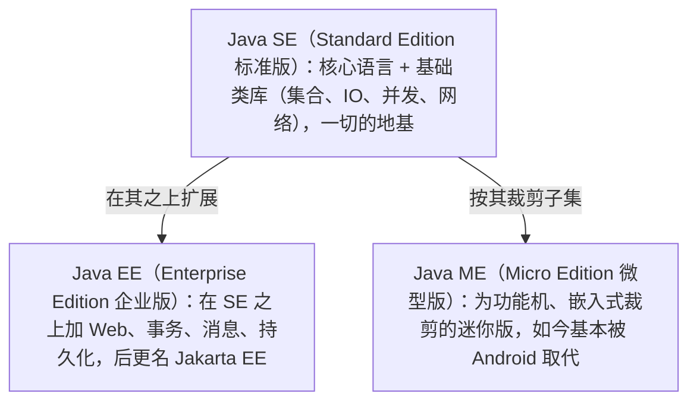
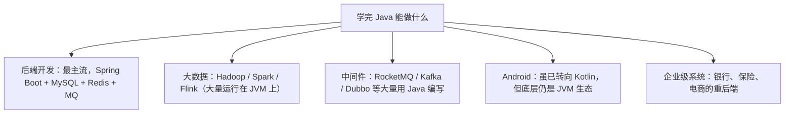

# 01 Java 历史与发展

> 本篇导读：很多人学 Java 只记语法，却说不清它从哪来、为什么能火三十年。这一篇我们用讲故事的方式，把 Java 的诞生、命名、三大平台、版本演进和 LTS 发布节奏一次讲透。理解这条时间线，你再看 `Java 8`、`Java 17`、`Java 21` 这些词，就不是孤立的版本号，而是一部"语言如何进化"的历史。

## 一、Java 从哪里来

故事要从 1991 年说起。当时 Sun 公司（Stanford University Network）成立了一个代号 **Green（绿色计划）** 的小组，目标不是做网页，而是做**消费电子设备的嵌入式控制软件**——机顶盒、遥控器、电视机。

项目负责人是 **James Gosling（詹姆斯·高斯林）**，后来被称为"Java 之父"。他们发现 C++ 太复杂、跨平台能力弱，于是决定设计一门更简单、更安全、可移植的新语言。

团队最初给这门语言取名 **Oak（橡树）**，因为 Gosling 办公室窗外正好有一棵橡树。可等到要注册商标时才发现，**Oak 已经被另一家公司占用了**。于是团队开会重新起名，最后选中了 **Java**——据说是取自他们常喝的一种爪哇咖啡。所以直到今天，Java 的官方图标就是一杯冒着热气的咖啡。

## 二、三个改变命运的时间点

```text
1991   Green 计划启动，语言雏形 Oak 诞生（面向嵌入式）
  │
1995   SunWorld 大会正式发布 Java 1.0，"Write Once, Run Anywhere" 一战成名
  │
2010   Oracle 收购 Sun，Java 进入 Oracle 时代
```

- **1995 年**：Sun 在 SunWorld 大会上正式发布 Java，打出 **"Write Once, Run Anywhere"（一次编写，到处运行）** 的口号。同一时期互联网开始爆发，Java 的 Applet 让网页第一次能跑程序，Java 顺势起飞。
- **2010 年**：Oracle 以 74 亿美元收购 Sun，Java 的商标和主导权归 Oracle。此后 Java 由 Oracle 主导、通过 **JCP（Java Community Process）** 联合社区共同演进。

## 三、三大平台：SE、EE、ME

早期 Java 按应用场景划分成三个平台，初学者最容易搞混：



一句话记忆：**SE 是地基，EE 是盖楼，ME 是给"小手机"用的精简版**。今天你面试、写后端，99% 打交道的是 **Java SE + Java EE（现 Jakarta EE）**。

## 四、版本演进时间线

Java 的版本号有一段"黑历史"：早期叫 **JDK 1.0 ~ 1.4**，从 1.5 开始官方改叫 **Java 5**，但内部版本号仍写作 `1.5`。所以你会同时看到 `JDK 1.8` 和 `Java 8` 两种写法，**它们指的是同一个东西**。

| 版本 | 年份 | 里程碑特性（记住这些就够了） |
| --- | --- | --- |
| JDK 1.0 | 1996 | 首个正式版本，"一次编写到处运行" |
| JDK 1.2 | 1998 | 集合框架（Collection）、Swing |
| JDK 1.4 | 2002 | 正则、NIO、日志 API |
| **Java 5** | 2004 | **泛型、枚举、注解、自动装箱、增强 for、可变参数、并发包** |
| Java 6 | 2006 | 性能优化，企业级广泛使用 |
| Java 7 | 2011 | try-with-resources、钻石语法、switch 支持 String |
| **Java 8** | 2014 | **Lambda、Stream、函数式接口、新日期时间 API、接口默认方法**（至今生产使用最广） |
| Java 9 | 2017 | 模块化系统（JPMS）、JShell |
| Java 11 | 2018 | 首个新节奏 **LTS**，`var` 局部变量推断、HTTP Client |
| Java 17 | 2021 | **LTS**，密封类、记录类（record）、模式匹配 |
| Java 21 | 2023 | **LTS**，虚拟线程（Virtual Threads）、模式匹配 switch |
| Java 25 | 2025 | **LTS**，继续在虚拟线程与性能上前进 |

## 五、LTS：为什么大家不追新版本

从 Java 9 开始，Oracle 改成**每半年发一个版本**（每年 3 月、9 月），但只有部分版本是 **LTS（Long Term Support，长期支持版）**。企业通常只升级 LTS 版本，因为非 LTS 版本的支持周期很短（几个月），没人愿意天天升级生产环境。

```text
非 LTS：  9   10   [11]  12  13  14  15  16  [17]  18  19  20  [21] ...
         └── 每半年一版，支持期短，适合尝鲜
              └── 方括号为 LTS，支持 8 年以上，生产首选
```

面试常问的"你用哪个版本、为什么"，标准答案通常是：**Java 8（存量最多）或 Java 17/21（新项目 LTS）**。

## 六、Java 为什么能火三十年

- **跨平台**：靠 **JVM（Java 虚拟机）** 屏蔽操作系统差异，字节码一次编译、到处运行。
- **生态庞大**：Maven 中央仓库有数百万个开源库，Spring、MyBatis、Netty、RocketMQ 等几乎覆盖所有场景。
- **向后兼容**：二十年前写的老代码，放在新 JDK 上大多还能跑，这让企业敢长期投资。
- **企业与社区共同驱动**：Oracle、IBM、阿里、腾讯、谷歌等都在贡献，语言本身没有"被一家公司绑架"的风险。
- **稳、可维护**：强类型、面向对象、成熟的工程实践，适合大型团队协作。

## 七、学完 Java 能做什么



## 本篇小结

- **1991 年** Sun 启动 Green 计划，语言雏形叫 **Oak**。
- 因 **Oak 商标被占用**，最终更名 **Java**，取名自爪哇咖啡。
- **1995 年**正式发布，靠 **"一次编写，到处运行"** 崛起。
- **2010 年** Oracle 收购 Sun，Java 进入 Oracle 主导、**JCP 社区共治**的时代。
- 三大平台：**Java SE（地基）、Java EE / Jakarta EE（企业后端）、Java ME（嵌入式）**。
- 版本号有 **`JDK 1.8` 与 `Java 8` 同义**的历史遗留写法。
- **Java 5** 带来泛型/注解/并发包，**Java 8** 带来 Lambda/Stream，是两大分水岭。
- 从 Java 9 起改为**每半年一版**，其中 **11 / 17 / 21 / 25 是 LTS**，生产首选 LTS。
- Java 长盛不衰的核心：**跨平台 + 庞大生态 + 向后兼容 + 开放共治**。
- 学完 Java 可做**后端、大数据、中间件、企业级系统**等。

## 参考链接

- [Oracle：Java 版本演进历史](https://www.oracle.com/java/technologies/java-se-glance.html)
- [维基百科：Java（编程语言）](https://zh.wikipedia.org/wiki/Java)
- [Oracle：Java SE 支持路线图（LTS）](https://www.oracle.com/java/technologies/java-se-support-roadmap.html)
- [Oracle JDK 官方下载页](https://www.oracle.com/java/technologies/downloads/)
- [OpenJDK 官网](https://openjdk.org/)
- [Oracle：Java 25 发布说明](https://www.oracle.com/java/technologies/javase/25-relnote-issues.html)
- [James Gosling 访谈：Java 的诞生](https://www.oracle.com/java/technologies/javase/jdk-history.html)

下一篇 → [02 搭建开发环境](/java/quickstart/env)
