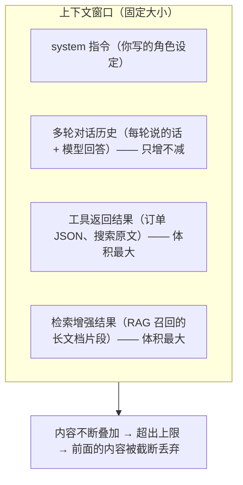

# 12 上下文工程

> 决定 Agent 稳定性和成本的关键一环，比 Prompt 调优更底层。上下文工程回答的不是"这一句该怎么说"，而是"这次调用该往模型窗口里放什么"。

::: tip 本章的承诺
读完这一章，你会明白为什么同一个 Agent 聊到第 30 轮就开始胡说八道、为什么跑着跑着就爆了上下文、为什么账单会突然暴涨。更重要的是，你会拿到 7 个**直接能跑**的治理手段，每个都配完整 Maven 依赖、import、配置代码和"副作用提醒"。
:::

## 本篇要解决的问题

- 什么是上下文工程？它和提示词工程到底差在哪？
- 上下文窗口为什么会"爆"？是谁在悄悄吃掉宝贵的 token？
- 上下文被污染了有什么典型症状，怎么一眼看出来？
- 六种治理手段（压缩 / 编辑 / 模型上限 / 工具上限 / 重试降级 / 规划 / 动态工具选择）各自怎么用、什么时候用、有什么副作用？
- 不同业务场景，这些参数到底该填多少？

::: warning 版本说明
本章所有 Hook / Interceptor 类名、包路径与 builder 方法，均依据 Spring AI Alibaba **1.1.2.0**（对应 Spring AI 1.1.2）官方文档与源码核实。该框架 API 演进很快，**不同小版本的方法名可能不同**（例如 `SummarizationHook` 在部分版本用 `.trigger()/.clearAtLeast()/.keep()`，在 1.1.x 用 `.maxTokensBeforeSummary()/.messagesToKeep()`）。若你发现方法名对不上，**以你所用版本的官方文档为准**，查找路径：包 `com.alibaba.cloud.ai.graph.agent.hook.*`（Hook）与 `com.alibaba.cloud.ai.graph.agent.interceptor.*`（Interceptor）。
:::

## 一、先把两个概念讲透：提示词工程 vs 上下文工程

### 1.1 装行李箱的比喻

把"让大模型干活"想象成**你去出差，要往一个固定大小的行李箱里装东西**。

- **提示词工程（Prompt Engineering）** 研究的是：**某一件东西怎么摆更好看、怎么写标签更清楚**。比如"请在便签上写'我是 Java 架构师，回答要简洁'"。它优化的是单条指令的措辞。
- **上下文工程（Context Engineering）** 研究的是：**这次出门，行李箱里到底该装哪些东西**。出差三天带羽绒服就离谱；同样，让模型处理"查订单"，你却把三年前的聊天记录、十万字检索文档全塞进去，它就是装不下、也找不着重点。

一句话区分：

| 维度 | 提示词工程 | 上下文工程 |
| --- | --- | --- |
| 关心什么 | 这一句"指令"怎么写 | 这次调用"窗口里总共放什么" |
| 操作对象 | system / user 的单条文本 | 历史消息 + 工具返回 + 检索结果 + 指令 的总和 |
| 比喻 | 怎么写一张便签 | 怎么收拾整个行李箱 |
| 典型手段 | 角色设定、few-shot、格式约束 | 压缩、裁剪、限额、筛选、规划 |
| 解决痛点 | 模型"不会做" | 模型"看不过来 / 看错了 / 看太贵" |

::: tip 为什么上下文工程更底层
提示词工程是在"已经装好的行李箱"里微调一张便签；上下文工程决定行李箱里**有没有装错东西、是不是装太满**。行李箱都爆了，便签写再漂亮也没用。所以上下文工程是 Agent 稳定性的地基。
:::

### 1.2 上下文窗口为什么会被"撑爆"

模型一次能"看到"的文本总量是有限的，叫做**上下文窗口**（context window），单位是 token。qwen-plus 约 128K～32K 视配置。窗口里装的东西来自**三个来源叠加**：



关键认知：**这三样东西会同时无限增长**。

- 多轮对话：每聊一轮，历史就多两条，永不回收。
- 工具返回：一个 `queryOrder` 可能返回 2KB 的 JSON，十个工具调用就是 20KB。
- 检索结果：RAG 一次召回 5 段文档，每段可能上千字。

它们叠加在一起，几十轮之后窗口必然爆掉。窗口一爆，模型"忘事"、答非所问、甚至直接报错 `context length exceeded`。

### 1.3 上下文污染的三种典型症状

窗口没爆，但 Agent 还是变傻了，这往往是**污染**——有用的东西被无用的东西稀释了。

| 症状 | 表现 | 根因 |
| --- | --- | --- |
| **信息稀释** | 模型对早期关键约束视而不见，比如忘了"只用中文回答" | 关键指令被海量历史/工具结果淹没在窗口中段，注意力被分散 |
| **陈旧/错误残留** | 用户已纠正过的事实，模型仍按旧信息作答 | 早期错误回答留在历史里，后续轮次仍被当作"事实"喂回去 |
| **噪声淹没** | 一个超长工具返回（如 5 万字符日志）后，模型开始答非所问 | 单次超大返回挤占了窗口，真正重要的对话上下文被挤出或冲淡 |

::: danger 一个真实事故
某客服 Agent 把"用户已明确说订单已退款"的对话留在历史里，但中间插入了一个返回 3 万字符的物流查询。下一轮模型"没看到"退款声明，又去调用退款工具——**对同一笔订单二次退款**。这就是噪声淹没 + 无裁剪导致的资损。后面所有治理手段，本质都在防止这类事。
:::

## 二、治理手段 1：上下文压缩（Compaction，自动摘要历史）

### 什么时候用

- 长对话、多轮任务（客服、代码助手、深度研究）。
- 历史消息总 token 接近模型窗口上限（如超过 4000 token）。
- 你希望"保留长期记忆"但又不想把每条原始消息都发给模型。

### 原理

`SummarizationHook` 会在接近 token 上限时，把**较早的一批消息**交给另一个（或同一个）模型 summarizing 成一段摘要，然后用"摘要 + 最近 N 条原始消息"替换掉旧历史。它内部用 `findSafeCutoff` 保证不会把"模型调用"和"工具返回"这一对拆散（拆散会让模型逻辑断裂）。

### 完整依赖（pom.xml）

路径：`pom.xml`

```xml
<?xml version="1.0" encoding="UTF-8"?>
<project xmlns="http://maven.apache.org/POM/4.0.0"
         xmlns:xsi="http://www.w3.org/2001/XMLSchema-instance"
         xsi:schemaLocation="http://maven.apache.org/POM/4.0.0
         https://maven.apache.org/xsd/maven-4.0.0.xsd">

    <modelVersion>4.0.0</modelVersion>

    <parent>
        <groupId>org.springframework.boot</groupId>
        <artifactId>spring-boot-starter-parent</artifactId>
        <version>3.5.5</version>
        <relativePath/>
    </parent>

    <groupId>com.example</groupId>
    <artifactId>saa-context-demo</artifactId>
    <version>1.0.0</version>

    <properties>
        <java.version>17</java.version>
        <spring-ai.version>1.1.2</spring-ai.version>
        <spring-ai-alibaba.version>1.1.2.0</spring-ai-alibaba.version>
    </properties>

    <dependencies>
        <!-- Web 能力，提供 HTTP 接口 -->
        <dependency>
            <groupId>org.springframework.boot</groupId>
            <artifactId>spring-boot-starter-web</artifactId>
        </dependency>

        <!-- Spring AI Alibaba Agent Framework：ReactAgent / Hook / Interceptor 都在这里 -->
        <dependency>
            <groupId>com.alibaba.cloud.ai</groupId>
            <artifactId>spring-ai-alibaba-agent-framework</artifactId>
            <version>${spring-ai-alibaba.version}</version>
        </dependency>

        <!-- DashScope 模型接入（通义千问 qwen-plus） -->
        <dependency>
            <groupId>com.alibaba.cloud.ai</groupId>
            <artifactId>spring-ai-alibaba-starter-dashscope</artifactId>
            <version>${spring-ai-alibaba.version}</version>
        </dependency>
    </dependencies>

    <dependencyManagement>
        <dependencies>
            <!-- 两个 BOM 统一管理版本，避免 Spring AI 各模块版本打架 -->
            <dependency>
                <groupId>org.springframework.ai</groupId>
                <artifactId>spring-ai-bom</artifactId>
                <version>${spring-ai.version}</version>
                <type>pom</type>
                <scope>import</scope>
            </dependency>
            <dependency>
                <groupId>com.alibaba.cloud.ai</groupId>
                <artifactId>spring-ai-alibaba-bom</artifactId>
                <version>${spring-ai-alibaba.version}</version>
                <type>pom</type>
                <scope>import</scope>
            </dependency>
        </dependencies>
    </dependencyManagement>

    <build>
        <plugins>
            <plugin>
                <groupId>org.springframework.boot</groupId>
                <artifactId>spring-boot-maven-plugin</artifactId>
            </plugin>
        </plugins>
    </build>
</project>
```

### 配置（application.yml）

路径：`src/main/resources/application.yml`

```yaml
spring:
  application:
    name: saa-context-demo
  ai:
    dashscope:
      # 从环境变量读取，绝不写死
      api-key: ${AI_DASHSCOPE_API_KEY}
      chat:
        options:
          model: qwen-plus
          temperature: 0.7
          max-tokens: 2048

server:
  port: 8080
```

### 配置代码

路径：`src/main/java/com/example/saa/context/CompactionAgentConfig.java`

```java
package com.example.saa.context;

import com.alibaba.cloud.ai.dashscope.api.DashScopeApi;
import com.alibaba.cloud.ai.dashscope.chat.DashScopeChatModel;
import com.alibaba.cloud.ai.graph.agent.ReactAgent;
import com.alibaba.cloud.ai.graph.agent.hook.summarization.SummarizationHook;
import com.alibaba.cloud.ai.graph.checkpoint.savers.MemorySaver;
import org.springframework.ai.chat.model.ChatModel;
import org.springframework.context.annotation.Bean;
import org.springframework.context.annotation.Configuration;

/**
 * 上下文压缩示例。
 *
 * 关键点：SummarizationHook 必须挂到 Agent 的 hooks 列表里，
 * 它会在历史 token 接近上限时自动把旧消息摘要化。
 * 同时需要配置一个 CheckpointSaver（这里用内存版 MemorySaver），
 * 因为压缩涉及"重算并替换历史"，需要持久化状态。
 */
@Configuration
public class CompactionAgentConfig {

    /**
     * 创建 DashScope 的 ChatModel。
     * 注意：压缩时框架会用同一个 model 去做摘要，生产环境建议单独配一个便宜的模型。
     */
    @Bean
    public ChatModel chatModel() {
        DashScopeApi dashScopeApi = DashScopeApi.builder()
                .apiKey(System.getenv("AI_DASHSCOPE_API_KEY"))
                .build();
        return DashScopeChatModel.builder().dashScopeApi(dashScopeApi).build();
    }

    @Bean
    public ReactAgent compactionAgent(ChatModel chatModel) {
        // 构建压缩 Hook：
        //   maxTokensBeforeSummary  —— 历史 token 达到这个值才触发摘要，避免频繁摘要浪费钱
        //   messagesToKeep          —— 摘要后保留最近多少条原始消息，保证"近期细节"不丢
        SummarizationHook summarizationHook = SummarizationHook.builder()
                .model(chatModel)
                .maxTokensBeforeSummary(4000)   // 超过 4000 token 才压缩
                .messagesToKeep(20)             // 压缩后保留最近 20 条原始消息
                .build();

        return ReactAgent.builder()
                .name("compaction_agent")
                .model(chatModel)
                .systemPrompt("你是一个耐心的技术助手，回答要简洁准确。")
                .hooks(summarizationHook)   // 把 Hook 挂上
                .saver(new MemorySaver())    // 压缩需要状态保存，必须用 saver
                .build();
    }
}
```

### 副作用

- **多花一次模型调用**：摘要本身要调一次模型，有额外成本（生产建议用 `qwen-turbo` 做摘要）。
- **摘要会丢细节**：被摘要掉的原始消息，模型之后就"看不全"了。对需要精确回溯历史的场景要谨慎。
- **有版本差异**：部分版本 `SummarizationHook` 的方法名是 `.trigger(10000) / .clearAtLeast(6000) / .keep(4)`，与上面的 `.maxTokensBeforeSummary / .messagesToKeep` 等价。对不上就查 `com.alibaba.cloud.ai.graph.agent.hook.summarization` 包。

## 三、治理手段 2：上下文编辑（Editing，裁剪/删除特定内容）

### 什么时候用

- 你知道某些内容**一定没用**或**不该进窗口**：超大日志、脱敏后的空字段、调试输出。
- 想要"按阈值"自动清理：当累计上下文超过某个字符/token 上限，至少砍掉一部分。
- 想保护某些工具（如写待办）的输出不被误删，用 `excludeTools` 排除。

### 原理

`ContextEditingInterceptor` 是拦截器，在每次请求构造上下文时介入，按 `trigger`（触发阈值）和 `clearAtLeast`（至少清除量）把超出部分裁掉，并可 `excludeTools` 指定哪些工具的结果永不裁剪。

### 配置代码

路径：`src/main/java/com/example/saa/context/EditingAgentConfig.java`

```java
package com.example.saa.context;

import com.alibaba.cloud.ai.graph.agent.ReactAgent;
import com.alibaba.cloud.ai.graph.agent.interceptor.contextediting.ContextEditingInterceptor;
import org.springframework.ai.chat.model.ChatModel;
import org.springframework.context.annotation.Bean;
import org.springframework.context.annotation.Configuration;

/**
 * 上下文编辑示例。
 *
 * 与"压缩"不同：编辑是"硬砍"，不做摘要，直接删除超出阈值的内容。
 * 适合那些"超出部分本来就没用"的场景（比如超长日志）。
 */
@Configuration
public class EditingAgentConfig {

    @Bean
    public ReactAgent editingAgent(ChatModel chatModel) {
        // trigger     —— 累计上下文超过这个值（部分版本单位为字符，部分版本为 token）才触发清理
        // clearAtLeast—— 触发后至少清除这么多，避免"清一点又马上满"的抖动
        // keep        —— 无论如何保留最近多少条消息，保证近期对话连续
        // excludeTools—— 这些工具的结果不参与清理（写待办这类关键结果要留着）
        ContextEditingInterceptor editingInterceptor = ContextEditingInterceptor.builder()
                .trigger(120000)        // 累计超 12 万才动刀
                .clearAtLeast(60000)    // 一次至少砍 6 万
                .keep(4)                // 保留最近 4 条
                .excludeTools("write_todos")
                .build();

        return ReactAgent.builder()
                .name("editing_agent")
                .model(chatModel)
                .systemPrompt("你是一个日志分析助手。")
                .interceptors(editingInterceptor)   // 注意：拦截器用 .interceptors() 挂
                .build();
    }
}
```

### 副作用

- **可能砍掉有用信息**：硬删不分辨内容重要性，配置不当会误删。务必用 `excludeTools` 保护关键工具。
- **单位要确认**：`trigger`/`clearAtLeast` 到底是字符还是 token，不同版本不一致，先看源码注释。
- 它和"压缩"是两套思路：编辑=快但粗暴；压缩=慢但保语义。可组合使用。

## 四、治理手段 3：模型调用上限（防止死循环烧钱）

### 什么时候用

- 任何"对外开放"的 Agent：**必须设**。防止模型陷入"调自己→不满意→再调"的死循环，几分钟内烧掉几十块钱。
- 任务有明确步骤上限时，用来兜底强制终止。

### 原理

`ModelCallLimitHook` 统计"本轮请求里模型被调用的次数"，超过 `runLimit` 直接终止 Agent，避免无限推理。

### 配置代码

路径：`src/main/java/com/example/saa/context/ModelLimitAgentConfig.java`

```java
package com.example.saa.context;

import com.alibaba.cloud.ai.graph.agent.ReactAgent;
import com.alibaba.cloud.ai.graph.agent.hook.modelcalllimit.ModelCallLimitHook;
import com.alibaba.cloud.ai.graph.checkpoint.savers.MemorySaver;
import org.springframework.ai.chat.model.ChatModel;
import org.springframework.context.annotation.Bean;
import org.springframework.context.annotation.Configuration;

/**
 * 模型调用上限示例。
 *
 * 这是"防烧钱开关"：超过 N 次模型调用就停。
 * runLimit 的取值经验：简单任务 5～8，复杂多步任务 15～25。
 */
@Configuration
public class ModelLimitAgentConfig {

    @Bean
    public ReactAgent modelLimitAgent(ChatModel chatModel) {
        // runLimit(5) —— 本轮最多让模型推理 5 次，第 6 次直接终止
        ModelCallLimitHook modelCallLimitHook = ModelCallLimitHook.builder()
                .runLimit(5)
                .build();

        return ReactAgent.builder()
                .name("model_limit_agent")
                .model(chatModel)
                .hooks(modelCallLimitHook)
                .saver(new MemorySaver())
                .build();
    }
}
```

### 副作用

- **任务可能被截断**：limit 设太小，复杂任务没跑完就被停。需结合任务复杂度调。
- 截断后 Agent 返回的是"未完成任务"状态，上游要做好提示，别当成成功结果用。

::: warning 方法名版本差异
`ModelCallLimitHook` 在 1.1.x 用 `.runLimit(int)`；早期版本可能叫 `.maxModelCalls(int)`。若编译报错，查 `com.alibaba.cloud.ai.graph.agent.hook.modelcalllimit` 包内的 builder 方法。
:::

## 五、治理手段 4：工具调用上限（控制成本与延迟）

### 什么时候用

- 工具本身贵（调一次几毛钱）或慢（一次几秒）。
- 防止模型反复调同一个工具刷屏。
- 和"模型调用上限"配合，双层兜底。

### 原理

`ToolCallLimitHook` 统计本轮工具被执行的次数，超过 `runLimit` 停止继续调工具。

### 配置代码

路径：`src/main/java/com/example/saa/context/ToolLimitAgentConfig.java`

```java
package com.example.saa.context;

import com.alibaba.cloud.ai.graph.agent.ReactAgent;
import com.alibaba.cloud.ai.graph.agent.hook.toolcalllimit.ToolCallLimitHook;
import com.alibaba.cloud.ai.graph.checkpoint.savers.MemorySaver;
import org.springframework.ai.chat.model.ChatModel;
import org.springframework.context.annotation.Bean;
import org.springframework.context.annotation.Configuration;

/**
 * 工具调用上限示例。
 *
 * 和模型上限互补：模型上限管"思考次数"，工具上限管"动手次数"。
 */
@Configuration
public class ToolLimitAgentConfig {

    @Bean
    public ReactAgent toolLimitAgent(ChatModel chatModel) {
        // runLimit(25) —— 本轮最多执行 25 次工具调用，超过就停
        ToolCallLimitHook toolCallLimitHook = ToolCallLimitHook.builder()
                .runLimit(25)
                .build();

        return ReactAgent.builder()
                .name("tool_limit_agent")
                .model(chatModel)
                .hooks(toolCallLimitHook)
                .saver(new MemorySaver())
                .build();
    }
}
```

### 副作用

- 同样可能截断任务。工具 limit 一般设得比模型 limit 略高（一次模型推理常伴随 1～2 次工具调用）。

::: warning 类名确认
部分早期资料里出现过 `ToolCallLimitInterceptor`（拦截器版，`.maxToolCalls(10)`）。在 1.1.x 中它是 **Hook** 形态 `ToolCallLimitHook`。若你用的是不同版本，按实际包 `com.alibaba.cloud.ai.graph.agent.hook.toolcalllimit` 为准。
:::

## 六、治理手段 5：工具失败重试与降级

### 什么时候用

- 工具依赖外部 API / 网络（查库存、调第三方），偶发超时或 5xx。
- 你希望"瞬时故障自动恢复"，而不是整个 Agent 直接失败。

### 原理

`ToolRetryInterceptor` 在工具抛异常时自动重试，超过 `maxRetries` 后按 `onFailure` 策略降级（这里用 `RETURN_MESSAGE`：返回一段提示文本让模型自己决定下一步，而不是直接崩溃）。

### 配置代码

路径：`src/main/java/com/example/saa/context/RetryAgentConfig.java`

```java
package com.example.saa.context;

import com.alibaba.cloud.ai.graph.agent.ReactAgent;
import com.alibaba.cloud.ai.graph.agent.interceptor.toolretry.ToolRetryInterceptor;
import org.springframework.ai.chat.model.ChatModel;
import org.springframework.context.annotation.Bean;
import org.springframework.context.annotation.Configuration;

import java.time.Duration;

/**
 * 工具重试与降级示例。
 *
 * 重试解决"网络抖一下就废"的问题；降级保证"重试也失败时不崩"。
 */
@Configuration
public class RetryAgentConfig {

    @Bean
    public ReactAgent retryAgent(ChatModel chatModel) {
        ToolRetryInterceptor retryInterceptor = ToolRetryInterceptor.builder()
                .maxRetries(2)   // 最多重试 2 次（首次 + 2 次重试 = 共 3 次尝试）
                // 重试间隔：部分版本支持 .retryDelay(Duration)，用来做指数退避
                // 降级策略 RETURN_MESSAGE：重试耗尽后，把失败信息作为"工具返回"喂给模型，
                //                     让模型自己决定是换工具、还是告诉用户暂时不行，而不是直接抛异常中断整个 Agent
                .onFailure(ToolRetryInterceptor.OnFailureBehavior.RETURN_MESSAGE)
                .build();

        return ReactAgent.builder()
                .name("retry_agent")
                .model(chatModel)
                .interceptors(retryInterceptor)
                .build();
    }
}
```

### 副作用

- **重试会重复计费 / 重复副作用**：非幂等工具（发邮件、创建订单）重试可能重复执行。这类工具要么别加重试，要么在工具内部做幂等（用唯一业务号去重）。
- 重试会增加整体延迟，超时时间要相应放宽。

::: danger 幂等红线
"发短信""扣款""创建工单"这类**有副作用且非幂等**的工具，**不要**无脑加重试。正确做法：工具入参带 `requestId`，服务端用 `requestId` 去重；或干脆不重试、转人工（见第 13 章 HITL）。
:::

## 七、治理手段 6：Planning（任务规划与待办清单）

### 什么时候用

- 多步骤、长任务（"帮我订机票 + 酒店 + 租车"）。
- 你希望**用户/开发者能看到 Agent 的计划**，增强透明度、便于调试。
- 你希望 Agent 先列计划再执行，减少"想到哪做到哪"的跑偏。

### 原理

`TodoListInterceptor` 会在工具执行前，让模型先生成一份待办清单（plan），并在执行过程中维护。它对最终答案无影响，但提供"可观察性"。

### 配置代码

路径：`src/main/java/com/example/saa/context/PlanningAgentConfig.java`

```java
package com.example.saa.context;

import com.alibaba.cloud.ai.graph.agent.ReactAgent;
import com.alibaba.cloud.ai.graph.agent.interceptor.todolist.TodoListInterceptor;
import org.springframework.ai.chat.model.ChatModel;
import org.springframework.context.annotation.Bean;
import org.springframework.context.annotation.Configuration;

/**
 * 任务规划示例。
 *
 * TodoListInterceptor 让 Agent 显式列出"我打算分几步做"，
 * 对调试复杂任务非常有帮助——你能直接看到它计划对不对。
 */
@Configuration
public class PlanningAgentConfig {

    @Bean
    public ReactAgent planningAgent(ChatModel chatModel) {
        TodoListInterceptor planningInterceptor = TodoListInterceptor.builder()
                .build();

        return ReactAgent.builder()
                .name("planning_agent")
                .model(chatModel)
                .systemPrompt("你是一个旅行规划助手，复杂任务请先列出步骤。")
                .interceptors(planningInterceptor)
                .build();
    }
}
```

### 副作用

- 会多消耗一点 token（要生成计划文本）。
- 它本身不"强制"模型按计划走，只是提供清单；真正的约束靠提示词 + 工具设计。

## 八、治理手段 7：动态工具选择（工具太多时先筛选）

### 什么时候用

- 你注册了**几十上百个工具**（客服系统可能有查订单、查物流、查库存、退款、换货……）。
- 把所有工具描述全塞进 system 提示词，窗口被撑爆、模型选择准确率下降。
- 你希望"先按当前问题语义，筛选出最相关的几个工具"再交给模型决策。

### 原理

`ToolSelectionInterceptor` 在每次模型调用前，用一个小模型/检索步骤从全部工具里筛出最相关的子集，只把子集的描述发给模型。相当于"行李箱装不下全部工具说明书，先挑今天用得上的几本"。

### 配置代码

路径：`src/main/java/com/example/saa/context/DynamicToolAgentConfig.java`

```java
package com.example.saa.context;

import com.alibaba.cloud.ai.graph.agent.ReactAgent;
import com.alibaba.cloud.ai.graph.agent.interceptor.toolselection.ToolSelectionInterceptor;
import org.springframework.ai.chat.model.ChatModel;
import org.springframework.context.annotation.Bean;
import org.springframework.context.annotation.Configuration;

/**
 * 动态工具选择示例。
 *
 * 工具很多时（几十个），不要把全部工具描述都塞给模型。
 * 先用 ToolSelectionInterceptor 按语义筛出最相关的几个，再让模型决策。
 */
@Configuration
public class DynamicToolAgentConfig {

    @Bean
    public ReactAgent dynamicToolAgent(ChatModel chatModel) {
        ToolSelectionInterceptor selectionInterceptor = ToolSelectionInterceptor.builder()
                .build();

        return ReactAgent.builder()
                .name("dynamic_tool_agent")
                .model(chatModel)
                // 这里可以 .tools(几十个工具...) 一次全注册，
                // 拦截器会负责"每次只暴露最相关的子集"给模型
                .interceptors(selectionInterceptor)
                .build();
    }
}
```

### 副作用

- 多一次"筛选"调用，有额外延迟和成本。
- 筛选可能漏掉冷门但正确的工具，导致模型"想调却没看到"。工具分组策略要测试调优。
- 部分版本该能力属于 `ToolSelectionInterceptor`，若有差异查 `com.alibaba.cloud.ai.graph.agent.interceptor.toolselection` 包。

## 九、按场景取值的建议表

下面是一份**起点参考**，不是金科玉律。所有数值都要在你自己的任务上压测后调整。

| 场景 | 压缩 | 编辑 | 模型上限 | 工具上限 | 重试 | 规划 | 动态工具 |
| --- | --- | --- | --- | --- | --- | --- | --- |
| 短问答机器人（几轮） | 关 | 关 | 8 | 15 | 开(2) | 关 | 关（工具<10） |
| 长程客服（几十轮） | 开(4000/20) | 开 | 15 | 25 | 开(2) | 开 | 工具多时开 |
| 代码助手（长上下文） | 开(8000/30) | 开 | 20 | 40 | 开(3) | 开 | 开 |
| 深度研究（上百轮） | 开(12000/6) | 开 | 25 | 60 | 开(3) | 开 | 开 |
| 对外开放/按量计费 | 开 | 视情况 | **必设** 8 | **必设** 15 | 开(2) | 视情况 | 视情况 |
| 不可逆操作多（退款/发消息） | 开 | 开 | 必设 | 必设 | **非幂等工具关** | 开 | 视情况 |

::: tip 调参心法
1. **先设上限，再谈效果**：模型上限 + 工具上限是"防火墙"，永远先开。
2. **压缩的 keep 别太小**：保留太少，模型会失忆；保留太多，压缩没意义。从 20 起步调。
3. **重试只对幂等工具开**：发钱发消息的工具，重试 = 事故。
4. **工具超过 10 个就考虑动态选择**：否则窗口被工具描述吃满，选择准确率肉眼可见地掉。
:::

## 本篇小结

- **上下文工程 = 决定窗口里放什么**，比提示词工程更底层；提示词工程只是"行李箱里一张便签怎么写"。
- **窗口被三样东西叠加撑爆**：多轮历史 + 工具返回 + 检索结果。它们只增不减。
- **污染的三种症状**：信息稀释（关键指令被淹没）、陈旧残留（错误历史被当事实）、噪声淹没（超大返回挤掉重点）。
- **七种治理手段**：压缩（`SummarizationHook`）保语义、编辑（`ContextEditingInterceptor`）硬砍、模型上限（`ModelCallLimitHook`）防死循环烧钱、工具上限（`ToolCallLimitHook`）控成本、重试降级（`ToolRetryInterceptor`）抗瞬时故障、规划（`TodoListInterceptor`）增透明、动态工具选择（`ToolSelectionInterceptor`）抗工具爆炸。
- **Hook 用 `.hooks()` 挂，Interceptor 用 `.interceptors()` 挂**，二者都得配 `saver`（如 `MemorySaver`）。
- 所有数值**先按场景表给起点，再压测微调**；不可逆操作相关的工具，重试要关、要接人工（下一章）。

## 参考链接

- Spring AI Alibaba 官网：<https://java2ai.com/>
- 上下文工程 / Hooks 与 Interceptors：<https://java2ai.com/docs/frameworks/agent-framework/tutorials/hooks>
- 人工介入 HITL（Hook 机制）：<https://java2ai.com/docs/frameworks/agent-framework/advanced/human-in-the-loop/>
- GitHub 仓库：<https://github.com/alibaba/spring-ai-alibaba>
- 阿里云百炼控制台：<https://bailian.console.aliyun.com/>

下一篇 → [13 人机协同 HITL](/java/saa/hitl)
