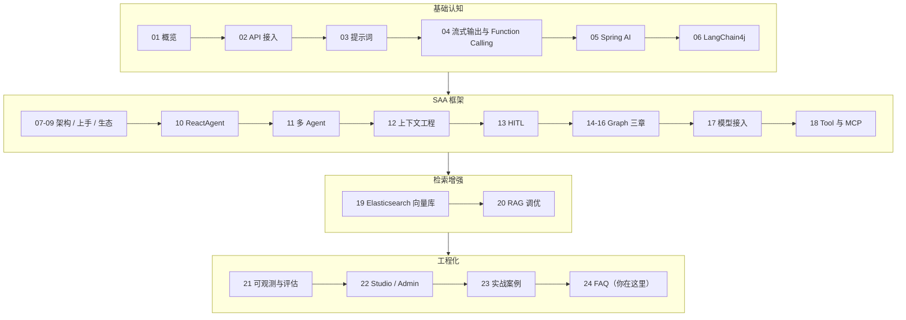

# 24 常见问题与踩坑

> 记录真实踩过的坑，以及版本升级时需要注意的迁移项。这是全站收尾章，目标是让你把前面 23 章的"知识"变成"不翻车的能力"。每一条都按「现象 → 原因 → 解决办法」组织，建议当字典用——遇到症状先来这里查。
>
> 全站导航在文末，并附整站回顾与进阶路线。

## 本篇要解决的问题

- 依赖和版本冲突怎么彻底解决
- 最常见的运行时报错怎么排查（Key、乱码、超时、连接池、Streaming、工具不调用、结构化输出、Token、RAG 召回）
- 性能与成本怎么优化
- 上线前到底要检查什么（可对照执行的清单）
- 升级 Spring AI / SAA 版本要注意什么

---

## 一、依赖与版本冲突

### 1.1 多个 Spring AI starter 同时引入，启动报 "expected single matching bean"

- **现象**：项目里同时引了 `spring-ai-alibaba-starter-dashscope` 和 `spring-ai-starter-model-openai`，启动报 `NoUniqueBeanDefinitionException: expected single matching bean but found 2`。
- **原因**：两个 starter 各自注册了一个 `ChatModel` Bean（`dashscopeChatModel` 和 `openaiChatModel`），注入 `ChatModel` 时 Spring 不知道选哪个。
- **解决**：
  1. 只保留一个模型 starter，统一接入方式；
  2. 如果确实要接多个模型，用 `@Qualifier("dashscopeChatModel")` 显式指定，或注入 `ChatClient.Builder` 并按名区分；
  3. 引入 Studio 时若项目用的是 OpenAI 兼容模式，记得排除 Studio 内的 dashscope starter（见第 22 章）。

### 1.2 Spring AI 各模块版本对不上，报离谱的类找不到 / 方法不存在

- **现象**：编译或运行报 `NoClassDefFoundError`、`NoSuchMethodError`，错误堆栈指向 `org.springframework.ai` 下的类。
- **原因**：`spring-ai-core`、`spring-ai-model-*`、`spring-ai-alibaba-*` 版本不一致，Maven 仲裁后拼出一套互相打架的版本。
- **解决**：**所有 Spring AI / SAA 依赖一律用 BOM 管理版本**，不要手写各模块版本号：

```xml
<dependencyManagement>
    <dependencies>
        <dependency>
            <groupId>org.springframework.ai</groupId>
            <artifactId>spring-ai-bom</artifactId>
            <version>1.1.2</version>
            <type>pom</type>
            <scope>import</scope>
        </dependency>
        <dependency>
            <groupId>com.alibaba.cloud.ai</groupId>
            <artifactId>spring-ai-alibaba-bom</artifactId>
            <version>1.1.2.0</version>
            <type>pom</type>
            <scope>import</scope>
        </dependency>
    </dependencies>
</dependencyManagement>
```

### 1.3 同时引入 Brave 和 OTel 两套 tracing，Trace 数据错乱

- **现象**：链路追踪出现重复 Span、父子关系错乱、平台收不到数据。
- **原因**：Micrometer 的 tracing 桥接只能有一套（Brave 或 OTel），两套并存会争抢 Observation 处理链。
- **解决**：只保留 `micrometer-tracing-bridge-otel` + `opentelemetry-exporter-otlp`，删掉任何 Brave 相关依赖（第 21 章已强调）。

---

## 二、常见报错排查

先给本节做个"症状 → 小节"速查表，对号入座再往下看细节：

| 你看到的现象 | 跳到 |
| --- | --- |
| 启动报 `NoUniqueBeanDefinitionException` / 多个 ChatModel | 一、1.1 |
| 编译运行报 `NoClassDefFoundError` / `NoSuchMethodError` | 一、1.2 |
| Trace 数据错乱、重复 Span | 一、1.3 |
| `401` / `Invalid API key` | 二、2.1 |
| 中文乱码 `??` | 二、2.2 |
| 接口 30s 无返回 / `Read timed out` | 二、2.3 |
| `Connection pool exhausted` | 二、2.4 |
| 流式无输出 | 二、2.5 |
| `@Tool` 定义了却不调用 | 二、2.6 |
| 结构化输出反序列化失败 | 二、2.7 |
| `context length exceeded` / 回答被截断 | 二、2.8 |
| RAG 召回不到 / 答非所问 | 二、2.9 |
| 偶发空答 / 内容安全拦截 | 二、2.10 |
| 向量检索搜不到 | 二、2.11 |
| 用户间上下文串台 | 二、2.12 |
| 网关后流式丢失 | 二、2.13 |
| 线程池打满 / 普通接口 504 | 二、2.14 |

### 2.1 环境变量 / API Key 报错

- **现象**：启动或调用报 `401`、`Invalid API key`、`请先设置环境变量 AI_DASHSCOPE_API_KEY`。
- **原因**：Key 没设置、设错名字、或设到了错误的 shell 会话（Windows PowerShell 的 `$env:` 只对当前窗口生效）。
- **解决**：
  1. 确认 `application.yml` 里是 `api-key: ${AI_DASHSCOPE_API_KEY}` 占位符；
  2. 终端执行 `echo $AI_DASHSCOPE_API_KEY`（Linux/macOS）或 `echo $env:AI_DASHSCOPE_API_KEY`（PowerShell）确认非空；
  3. 生产用配置中心（Nacos / K8s Secret）下发，并给 Key 设额度上限。

### 2.2 中文乱码

- **现象**：模型返回或日志里中文变成 `??` 或乱码。
- **原因**：HTTP 请求/响应没指定 UTF-8（手写 HttpClient 时最容易漏），或文件/控制台编码不是 UTF-8。
- **解决**：
  1. 手写 HTTP 时请求体和解析都用 `StandardCharsets.UTF_8`（第 02 章示例已带）；
  2. `application.yml` 文件保存为 UTF-8；
  3. Maven 编译加 `<project.build.sourceEncoding>UTF-8</project.build.sourceEncoding>`。

### 2.3 超时 / 调用慢

- **现象**：接口 30 秒还没返回，前端已断开；或偶发 `Read timed out`。
- **原因**：AI 调用本就比普通接口慢（秒级到几十秒），默认 HTTP/框架超时太短；或上游限流导致重试堆积。
- **解决**：
  1. 框架层给足超时：`spring.ai.dashscope.chat.options` 相关超时，或在自定义客户端设 `timeout(Duration.ofSeconds(120))`；
  2. 前端用流式输出（第 04 章），避免干等；
  3. 加 Resilience4j 重试（第 02 章），但注意重试会重复计费，且只对网络异常重试、不对业务失败重试。

### 2.4 连接池耗尽

- **现象**：高并发下报 `Connection pool exhausted` 或大量请求卡住。
- **原因**：底层 HTTP 客户端默认连接数有限，AI 调用耗时长，连接被占满。
- **解决**：
  1. 调大底层客户端连接池（如 Spring AI 使用的 WebClient/HttpClient 最大连接数）；
  2. 给 AI 调用加信号量/线程池隔离，限制并发上限；
  3. 用 `gen_ai_client_operation_active_count` 监控在途调用数，设熔断。

### 2.5 Streaming 无输出

- **现象**：`.stream()` 调用，前端收不到任何流，或只收到一个空响应。
- **原因**：最常见三样——① 没用 `textStream()` / `stream().content()` 正确消费 Flux；② 前端没按 SSE 解析（要读 `text/event-stream`）；③ 网关/代理缓冲了响应（Nginx 默认 buffering 会攒批）。
- **解决**：
  1. 后端用 `chatClient.prompt().user(x).stream().content()` 返回 `Flux<String>`；
  2. 前端用 `fetch` + `ReadableStream` 或 `EventSource` 消费 SSE；
  3. 反向代理（Nginx）加 `proxy_buffering off;`、`chunked_transfer_encoding on;`。

### 2.6 工具（@Tool）不被调用

- **现象**：明明定义了 `@Tool`，模型就是不调，自己瞎编答案。
- **原因**：
  1. 工具没注册（忘了 `.defaultTools(this)` 或 `@Bean`）；
  2. 工具 `description` 写得太含糊，模型不知道何时用；
  3. temperature 太高，模型"发挥"过头；
  4. 模型本身不支持/不擅长 tool calling（确认用的 `qwen-plus` 及以上支持）。
- **解决**：
  1. 确认工具已被 `ChatClient` 注册（日志里能看到工具定义）；
  2. `description` 写清"何时调用 + 参数含义"；
  3. 降 temperature 到 0.2~0.3；
  4. system 里明确要求"遇到 X 类问题必须先调用 Y 工具"。

### 2.7 结构化输出解析失败

- **现象**：用 `.entity(Class)` 或结构化输出，报反序列化错误、JSON 格式不对。
- **原因**：模型偶尔不严格按 schema 输出（多了注释、用了 Markdown 代码块包裹、字段名不一致）。
- **解决**：
  1. 用 Spring AI 的结构化输出 API（`.entity(MyClass.class)`），框架会注入格式约束；
  2. 在 system 里强调"只输出纯 JSON，不要 Markdown 代码块"；
  3. 做 try-catch 兜底：解析失败时让模型重试一次或降级返回文本；
  4. 字段用 `@JsonProperty` 明确映射，容忍模型的大小写差异。

### 2.8 Token 超限

- **现象**：报 `context length exceeded`、回答被截断（`finish_reason=length`）、或费用暴涨。
- **原因**：历史消息无限累积，或单次塞入过长文档，超出模型上下文窗口（如 32K/128K）。
- **解决**：
  1. 用 `MessageWindowChatMemory` 限制 `maxMessages`（第 03/12 章）；
  2. RAG 做上下文压缩，只保留最相关片段；
  3. 给 `max_tokens` 设上限；
  4. 长文档走摘要/分块，不让原文全进窗口。

### 2.9 RAG 召回不到 / 答非所问（排查清单）

按顺序逐项排查：

| 排查项 | 怎么查 | 常见问题 |
| --- | --- | --- |
| 文档是否真的写入 ES | 查 ES 索引文档数 | 写入时 mapping 不对、没 bulk 成功 |
| Embedding 模型是否一致 | 写入和查询用同一 `text-embedding-v3` | 两边模型不同 → 向量空间不一致 |
| 相似度阈值是否过高 | 调低 `similarityThreshold` | 阈值 0.8 太严，全被过滤 |
| 分块（chunk）是否合理 | 看 chunk 大小和重叠 | 块太大/太小都影响召回 |
| 查询是否走了向量检索 | 打日志看检索返回条数 | advisor 没挂上、collection 名错 |
| 中文分词 | ES 用 `ik_max_word` 等中文分词器 | 默认分词对中文不友好 |
| 是否命中但被截断 | 看传给模型的上下文长度 | 召回太多没截断，挤掉问题 |

::: tip 召回不到的第一性原理
RAG 的"召回"本质是**向量相似度**。召回不到，99% 是"写入和查询用的 Embedding 不是同一个模型""或文档根本没进库"。先确认这两点，再调阈值和分块。
:::

---

### 2.10 模型返回被内容安全拦截（空答/报错）

- **现象**：偶发返回空、或报 `data_inspection_failed`、`content filter` 类错误，同样的问题有时又正常。
- **原因**：大模型平台（含百炼）有内容安全审核，命中敏感词或疑似违规会拦截；少量是模型自身拒答。
- **解决**：① 确认输入不含敏感内容；② 对空返回做兜底文案而非崩溃；③ 生产如需更宽松策略，在百炼控制台确认应用的内容安全配置；④ 不要把拦截当普通异常吞掉，应记录日志便于发现系统性拦截。

### 2.11 Embedding 模型不一致导致向量检索失效

- **现象**：文档写进 ES 后能搜到，但用自然语言查不出来；或反过来。
- **原因**：**写入时用的 Embedding 模型和查询时用的不是同一个**（`text-embedding-v3` 必须与查询同一模型），向量空间不同，相似度毫无意义。
- **解决**：在配置里固定 Embedding 模型名，写入和查询共用同一个 `EmbeddingModel` Bean；迁移 ES 数据时也要用同一模型重新向量化，不能搬旧向量。

### 2.12 多轮对话 sessionId 串台

- **现象**：A 用户问的隐私/上下文出现在 B 用户的回答里。
- **原因**：没传 `sessionId`/`conversationId`，或所有请求共用同一个 ID，记忆 Advisor 把所有用户历史混在一起。
- **解决**：每个终端用户用独立且稳定的 `sessionId`（登录用户用 userId，匿名用前端生成的 uuid），并在 Advisor 里通过 `ChatMemory.CONVERSATION_ID` 传递（第 02、03 章有完整示例）。

### 2.13 流式在网关/负载均衡后丢失

- **现象**：本地 `stream()` 正常，部署到加了 Nginx / SLB / Spring Cloud Gateway 后前端收不到流或只收到最后一包。
- **原因**：中间层默认缓冲响应（攒够再发）或不支持 `text/event-stream` 长连接。
- **解决**：在网关层关闭响应缓冲、放行 SSE 的 `Transfer-Encoding: chunked`；必要时后端与前端之间走直连或专用长连接通道。

### 2.14 生产线程被 AI 调用长时间阻塞

- **现象**：Tomcat 线程池打满，普通接口也跟着 504。
- **原因**：AI 调用动辄几秒到几十秒，占着 Web 线程不释放，并发一高就全堵。
- **解决**：① AI 调用尽量异步化 / 用响应式（`stream()` 返回 Flux）；② 对 AI 接口单独限流、单独线程池；③ 超时 + 熔断双保险。

### 2.15 如何高效向社区/官方求助（少走弯路）

遇到文档查不到的问题，提问时附上这四样，能大幅缩短解决时间：

1. **版本四元组**：JDK、Spring Boot、Spring AI、SAA 具体版本；
2. **最小复现代码**：去掉业务噪音，保留能跑出错的片段；
3. **完整错误栈**：尤其是 `Caused by` 部分，别只截最后一行；
4. **已尝试过的排查**：避免被反问答"你配了 X 吗"。

官方渠道：GitHub Issues（<https://github.com/alibaba/spring-ai-alibaba>）、官网文档（<https://java2ai.com/>）、官方社区钉群/微信群。

## 三、性能与 Token 成本优化清单

直接可执行的优化项：

1. **模型分级**：日常用 `qwen-plus`，简单分类/评测用 `qwen-turbo`，只有复杂推理才上 `qwen-max`（第 02 章）。
2. **限制历史**：`MessageWindowChatMemory` 的 `maxMessages` 设 20 左右，长对话做上下文压缩。
3. **限制输出**：每个接口显式给 `max_tokens`，防止失控。
4. **缓存**：相同问题（如 FAQ）做语义缓存，命中就不调模型。
5. **批处理**：能合并的多次小调用合并成一次。
6. **评测模型用便宜的**：第 21 章的 LLM-as-Judge 用 `qwen-turbo`。
7. **监控驱动**：盯 `gen_ai_client_token_usage_total`，按用户/接口画出成本曲线，异常高就优化。
8. **Key 额度上限**：百炼控制台设置，兜底防失控。

::: warning 别过早优化
先让功能正确，再用监控数据决定优化哪。凭感觉"优化"往往花了力气没省到钱。先有数据（第 21 章的指标），再谈优化。
:::

### 3.1 推荐的生产默认配置片段

把下面这套作为一个"安全基线"起点（数值按你的体量调），覆盖超时、限流意识、可观测：

```yaml
spring:
  application:
    name: canoe-saa-prod
  ai:
    dashscope:
      api-key: ${AI_DASHSCOPE_API_KEY}
      chat:
        options:
          model: qwen-plus
          temperature: 0.3      # 生产偏稳定，别用高随机
          max-tokens: 2048       # 防止生成失控
      embedding:
        options:
          model: text-embedding-v3

management:
  endpoints:
    web:
      exposure:
        include: health,info,prometheus,metrics
  tracing:
    sampling:
      probability: 0.1           # 生产抽样 10%，降成本
  otlp:
    tracing:
      endpoint: ${OTEL_EXPORTER_OTLP_ENDPOINT}   # 接 Langfuse / ARMS

# 关键：给 AI 接口单独限流、单独线程池，避免拖垮普通接口（见 2.14）
# 关键：API Key 在百炼控制台设额度上限，兜底防失控
```

::: tip 配置即文档
这份 yml 本身就是一份"生产 checklist"：模型档次、temperature、max-tokens、采样率、可观测端点，缺一不可。新项目直接复制，比从头配更不容易漏。
:::

---

## 四、上线前检查清单（可直接对照执行）

把下面每一项打勾再发版：

**安全**
- [ ] API Key 用环境变量/配置中心，已加 `.gitignore`，未硬编码
- [ ] Key 已设额度上限
- [ ] 涉及 SQL/外部写操作的服务，应用层有权限校验（如 NL2SQL 白名单）
- [ ] 写操作（退款/发邮件）走 HITL 人工确认，模型不直接执行
- [ ] Prompt/Completion 若进 Trace，已做脱敏或仅 dev 开启（第 21 章）

**可靠性**
- [ ] 超时已按 AI 调用特点调大
- [ ] 已加重试（Resilience4j），且只对网络异常重试
- [ ] 流式接口前端/代理已正确处理 SSE
- [ ] 工具已注册、description 清晰、低温测试过被调用

**可观测**
- [ ] OTel 依赖已加，指标能进 Prometheus / Langfuse / ARMS
- [ ] `gen_ai_client_token_usage_total` 已能看
- [ ] 已配置成本告警阈值（第 21 章）
- [ ] 已用 Studio 或 Trace 平台验证过一次完整链路

**成本**
- [ ] `max_tokens` 已设上限
- [ ] 历史消息长度受控
- [ ] 已确认生产用模型档次（避免全员 `qwen-max`）

**评测**
- [ ] 黄金集已建（20~50 条）
- [ ] 已用 Relevancy/FactChecking 跑过回归，关键用例不退化

**依赖**
- [ ] 只引一个模型 starter，或用 `@Qualifier` 区分
- [ ] 版本全部由 BOM 管理
- [ ] 只保留一套 tracing 桥接（OTel）

---

## 五、版本迁移记录

### 5.1 Spring AI 升级注意

- Spring AI 1.0 → 1.1 在 **可观测性**上有增强（Observation 上下文传播、可配置 Advisor 观测、指标映射指南）。升级后建议核对 `management.observability` / tracing 相关配置项名称。
- API 包名、部分 Builder 方法可能随小版本微调。**升级前**：① 看官方 Release Notes；② 跑通你第 21 章的评测集做回归；③ 先在小流量环境验证。
- 具体迁移步骤与破坏性功能变更，**以官方迁移指南为准**：<https://docs.spring.io/spring-ai/reference/>

### 5.2 Spring AI Alibaba 升级注意

- SAA 与 Spring AI 版本**强绑定**，升级 SAA 必须同步对齐 Spring AI 版本（都用对应 BOM）。
- Studio / Admin / Graph 模块迭代快，**API 形态、UI 路径、docker-compose 配置可能变化**，升级后请以新版本 README 为准。
- NL2SQL、MCP、Nacos 等 starter 的子模块命名与能力随版本演进，引用时核对 artifactId。

::: danger 升级铁律
**永远先升到"文档明确支持的组合版本"**，不要混搭 `spring-ai 1.1.2` + `saa 1.0.x` 这种跨大版本组合。BOM 版本对齐是最省心的办法。升级后用评测集回归，别凭"好像能跑"就发生产。
:::

---

## 六、整站回顾与进阶学习路径

### 6.1 整站回顾：你其实已经会了什么

先给整站做一个"章节速查"，方便你随时回跳：

| 章 | 一句话 | 章 | 一句话 |
| --- | --- | --- | --- |
| 01 概览 | 大模型是续写机器，你负责工程化 | 13 HITL | 关键节点人工确认/接管 |
| 02 API 接入 | 调用=HTTP，多轮=重发历史 | 14-16 Graph | 有状态工作流编排三连 |
| 03 提示词 | 零成本提效果 | 17 模型接入 | 接模型与参数 |
| 04 流式/FC | SSE + 工具调用基础 | 18 Tool/MCP | 给 Agent 装手和眼 |
| 05 Spring AI | 核心抽象 ChatClient | 19 ES 向量库 | RAG 的存储底座 |
| 06 LangChain4j | 横向对照 | 20 RAG 调优 | 召回质量是命门 |
| 07-09 架构/上手/生态 | SAA 三层与入门 | 21 可观测评估 | 看得见 + 评得准 |
| 10 ReactAgent | 单智能体推理+行动 | 22 Studio/Admin | 调试与一站式平台 |
| 11 多 Agent | 协作分工 | 23 实战案例 | 三个能抄的作业 |
| 12 上下文工程 | 窗口里塞最重要的 | 24 FAQ | 你正在看的避坑字典 |

回看 01 → 24 章，你建立的能力地图：



一句话总结：**你从"大模型是个续写机器"这个朴素认知出发，逐步给它装上了记忆（RAG）、手和眼（Tool/MCP）、协作与流程（Graph/多 Agent）、可靠性（HITL/重试）、以及工程化闭环（可观测/评测/平台）。** 这恰好是 Java 工程师把"聪明的大模型"变成"靠谱的线上系统"的全过程。

### 6.2 进阶学习路径

| 方向 | 建议 |
| --- | --- |
| **读源码** | 从 `spring-ai-alibaba-examples` 的 Playground、DeepResearch、JManus 入手，对照本专栏概念读 |
| **深入 Graph** | 第 14-16 章只是入门，生产级状态持久化、嵌套图、并行图值得深挖 |
| **可观测进阶** | 在 Prometheus + Grafana 自建 AI 专属大盘（成本、延迟、质量） |
| **评测体系** | 把黄金集做成持续演进的数据集，接进 Admin 做实验管理 |
| **生态集成** | MCP 注册中心（Nacos MCP Registry）、Higress AI 网关、百炼 RAG |
| **社区** | 关注 SAA GitHub Release 与官方文档，社区迭代很快 |

::: tip 最后一句实在话
AI 应用落地，**80% 的功夫在工程化，不在模型**。你已经学完了那 80%。接下来最好的老师是：亲手做一个垂直场景的小项目，跑通它，然后用第 21 章的可观测和第 24 章的清单把它"钉"稳。祝顺利。
:::

## 本篇小结

- **依赖冲突根因**是版本没对齐 / 多 starter 抢 Bean：用 BOM 统一管理、只留一个模型 starter、只留一套 tracing 桥接。
- **运行时报错**按"现象→原因→解决"对症处理，最高频的是 Key 未设、超时太短、Streaming 代理缓冲、工具未注册/未低温、结构化输出未约束、Token 超限、RAG 召回失败。
- **性能成本**：模型分级 + 限历史 + 限输出 + 缓存 + 监控驱动。
- **上线清单**覆盖安全/可靠/可观测/成本/评测/依赖六大类，可逐项打勾。
- **版本迁移**：SAA 与 Spring AI 强绑定，务必 BOM 对齐、评测回归、不混搭跨大版本。
- 全站收尾：你已具备把大模型变成靠谱线上系统的完整工程能力。

## 参考链接

- Spring AI 官方文档与迁移指南：<https://docs.spring.io/spring-ai/reference/>
- Spring AI Alibaba 官网：<https://java2ai.com/>
- Spring AI Alibaba GitHub：<https://github.com/alibaba/spring-ai-alibaba>
- 示例仓库：<https://github.com/springaialibaba/spring-ai-alibaba-examples>
- 阿里云百炼控制台：<https://bailian.console.aliyun.com/>

下一篇 → [回到 01 AI 开发概览](/java/ai/overview)（本专栏到此结束，建议回头再读一遍概览）
