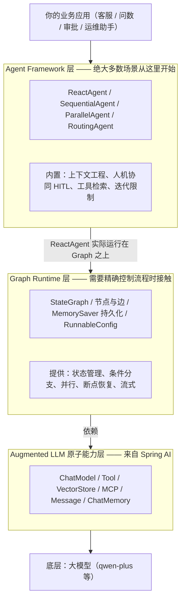
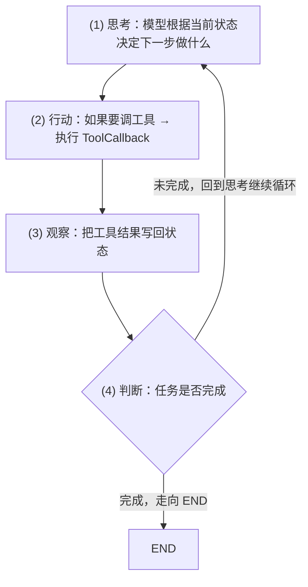

# 07 概览与三层架构

> 在写第一行 Agent 代码之前，先把这个框架的「骨架」看清楚。本章不堆代码，而是把 Spring AI Alibaba（下文简称 SAA）到底是什么、它和 Spring AI 谁依赖谁、内部三层各自负责什么讲透。看懂这一章，后面 08、09、10 章的代码你就不会「只知其然」。

## 本篇要解决的问题

很多同学第一次听到 SAA，脑子里会冒出一堆问号：

- 它和 Spring AI 是什么关系？是不是又造了一个轮子？
- 老听说 "10 行代码写个 Agent"，底层到底发生了什么？
- 为什么一会儿讲 Graph，一会儿讲 ReactAgent，是不是两套东西？
- 我到底要先学哪一层？能不能跳过？

这一章就是来拆这些困惑的。读完你会有三样东西：**一张清晰的分层图**、**一张"能做什么 / 不能做什么"的边界清单**、**一份读完本专栏的阅读路线图**。

## 一、一句话讲清：Spring AI Alibaba 到底是什么

先用一个盖房子的比喻，把这件事从零讲起。

假设你要在空地上盖一套能住的房子：

- **大模型（qwen-plus）** 相当于「钢筋水泥和砖头」——它是原材料，单独放着不能住人。
- **Spring AI** 相当于「标准化的建材和施工规范」——它把"调用模型、定义工具、管理对话记忆"这些脏活累活封装成统一的接口（`ChatClient`、`Tool`、`VectorStore`……），让你不用每次手写 HTTP 请求。但它给到的是"毛坯房"：接口有了，具体怎么拼成好用的 Agent，还得你自己设计。
- **Spring AI Alibaba（SAA）** 相当于「精装房 + 智能家居套装」——它在 Spring AI 之上，额外提供了开箱即用的 **Agent 开发框架（ReactAgent 等）** 和 **Graph 工作流运行时**，并且针对阿里云生态（百炼 DashScope、通义千问、Nacos、百炼平台）做了深度集成。

所以一句话总结：

::: tip 一句话定义
**Spring AI Alibaba 是阿里巴巴在 Spring AI 之上构建的 Agent 应用开发框架，它给你"高层 Agent 抽象 + 底层工作流运行时 + 阿里云生态集成"，让你用极少代码写出能调工具、会思考、可编排的智能体。**
:::

它**不是**替代 Spring AI，而是**站在 Spring AI 肩膀上**。这点下一节展开。

## 二、它和 Spring AI 的关系：谁依赖谁

这是必须澄清的关键点，很多初学者在这里犯迷糊。

### 2.1 依赖方向

SAA **依赖** Spring AI，而不是反过来。用依赖箭头表示（箭头指向"被依赖方"）：

```text
Spring AI Alibaba  ──依赖──▶  Spring AI  ──依赖──▶  大模型 HTTP API
   （高层框架）                （原子能力抽象）        （百炼 / OpenAI …）
```

也就是说：

- **你可以用 Spring AI 而不用 SAA**：只用 `ChatClient` 调模型、用 `@Tool` 定义工具、自己拼 ReAct 循环，完全不引入 SAA 也能做 AI 应用（本站第 02～06 章就是这么做的）。
- **但你不能脱离 Spring AI 单独用 SAA**：SAA 的底层原子能力（模型、工具、向量存储、消息、记忆）全部复用 Spring AI 的抽象。SAA 的 `ReactAgent` 内部调用的就是 Spring AI 的 `ChatModel`、Spring AI 的 `ToolCallback`。

### 2.2 为什么要分两层，而不是一个库搞定

因为关注点不同：

| 维度 | Spring AI | Spring AI Alibaba |
| --- | --- | --- |
| 定位 | 跨模型的"通用原子能力层" | 面向 Agent 的"应用开发框架 + 阿里生态" |
| 关心什么 | 怎么统一调用不同厂商的模型、怎么定义工具、怎么存取向量 | 怎么把多个工具编排成 Agent、怎么管理工作流状态、怎么和百炼/Nacos 打通 |
| 是否绑定阿里云 | 否，厂商中立 | 是，深度集成 DashScope、通义、百炼平台 |
| 你直接用的频率 | 几乎每处代码都在用 | 写 Agent / 工作流时才用 |

::: warning 一个常见误解
有人以为"用了 SAA 就不用学 Spring AI 了"。**恰恰相反**：SAA 是 Spring AI 的"上层封装"，它的 `ChatModel`、`Tool`、`VectorStore` 全部来自 Spring AI。如果你连 `ChatClient` 怎么用、`@Tool` 怎么写、`VectorStore` 是什么都不知道，直接上手 SAA 会处处卡壳。本站第 05 章《Spring AI 框架》是前置基础，本章最后一节给出了必会清单。
:::

### 2.3 一个对比：纯 ChatClient 能做什么，ReactAgent 多做在哪

为了把"为什么要加这一层"说透，我们拿同一个需求对比：**用户问"北京今天天气怎么样"，系统要给出真实天气**。

**只用 Spring AI 的 ChatClient（无框架）**：你需要自己写"思考—调工具—回灌结果—再问模型"的循环。伪代码大概是：

```java
// 伪代码：纯 ChatClient 实现"会调工具的助手"，所有编排逻辑都得自己写
String question = "北京今天天气怎么样？";
while (true) {
    String answer = chatClient.prompt().user(question).call().content();
    if (answer 里没有"我要调工具"的信号) break;   // 自己解析模型意图
    ToolResult r = 执行对应的 Java 方法(解析出的参数); // 自己分发到正确工具
    question = question + "\n工具返回：" + r;        // 自己把结果塞回上下文
}
```

上面这几行"自己写"的东西——**意图解析、工具分发、结果回灌、循环终止条件**——恰恰是 ReactAgent 帮你自动做掉的。把同样的需求交给 SAA：

```java
// 同样的需求，ReactAgent 把上面那个循环封装进了框架
ReactAgent agent = ReactAgent.builder()
        .name("weather_agent")
        .model(chatModel)
        .tools(toolCallbacks)
        .systemPrompt("你是一个天气助手，必要时调用天气工具。")
        .build();
String answer = agent.call("北京今天天气怎么样？");  // 内部自动完成整个循环
```

**结论**：纯 ChatClient 不是不能做 Agent，而是要你手写一套"Agent 运行时"。SAA 的价值，就是把这个运行时标准化、工程化、可复用了。

## 三、三层架构总览

SAA 从架构上分为三层，从上往下依次是：**Agent Framework 层 → Graph Runtime 层 → Augmented LLM 原子能力层**。

下面这张图把三层和它们各自的职责、你日常接触的频度画出来（注意箭头方向：**上层依赖下层**）：



### 三层职责对照表

下面这张表是本章的"主心骨"，请结合上面的图一起看。原专栏已有的三层架构表在这里保留并补全了「代表 API」一列：

| 层 | 定位 | 什么时候会直接接触 | 代表 API / 类 |
| --- | --- | --- | --- |
| **Agent Framework** | 以 `ReactAgent` 为核心的 Agent 开发框架，内置上下文工程与人机协同 | 日常开发，绝大多数场景从这里开始 | `ReactAgent`、`SequentialAgent`、`ParallelAgent`、`ModelCallLimitHook`、`AgentTool` |
| **Graph** | 工作流与多智能体编排的底层运行时，提供状态管理与持久化 | 需要精确控制流程、分支、并行、断点恢复时 | `StateGraph`、`MemorySaver`、`RunnableConfig`、`Node`、`Edge` |
| **Augmented LLM** | 基于 Spring AI 的模型、工具、MCP、消息、向量存储等原子抽象 | 接入模型、定义工具、做检索增强时 | `ChatModel`/`DashScopeChatModel`、`@Tool`、`VectorStore`、`ToolCallback` |

::: tip 关键认知
**ReactAgent 并不是独立实现的"另一套东西"，它实际运行在 Graph Runtime 之上。** 更准确地说，`ReactAgent.builder()...build()` 在内部会构造并驱动一个 `StateGraph` 来执行「思考—行动—观察」的 ReAct 循环。理解了这一点，后面单独学 Graph 时，你不会觉得在学另一套体系，而会觉得"哦，原来 ReactAgent 就是把这套图封装好了"。
:::

## 四、逐层拆解与代表 API

下面逐层展开，每一层都给出**概念 + 代表 API + 一段可直接对照的代码片段**。这些碎片在后续章节会拼成完整应用，这里先建立"每一层长什么样"的直觉。

### 4.1 Augmented LLM 原子能力层

**概念**：这一层是地基，提供所有 AI 应用都绕不开的"原子能力"。它们全部来自 Spring AI（SAA 只是在此之上加了一些阿里扩展，例如 `DashScopeChatModel`）。所谓"原子"，是指它们各自独立、不可再分：

- **模型调用**：把一段文字发给大模型，拿到续写结果。
- **工具（Tool）**：让模型能调用你写好的 Java 方法（查数据库、调接口）。
- **向量存储（VectorStore）**：把文本转成向量存起来，做语义检索（本站统一用 **Elasticsearch 8.x**）。
- **MCP**：工具调用的标准协议，让工具能跨项目复用。
- **消息与记忆**：表示一次对话里 system/user/assistant 的内容，以及多轮上下文。

**代表 API 与代码示意**：

```java
package com.example.saa.intro;

import com.alibaba.cloud.ai.dashscope.api.DashScopeApi;
import com.alibaba.cloud.ai.dashscope.chat.DashScopeChatModel;
import org.springframework.ai.chat.model.ChatModel;

/**
 * Augmented LLM 原子能力层的最小示例：仅仅是"接入一个模型"。
 *
 * 你会发现这里用的全是 Spring AI 的接口（ChatModel），
 * 加上 SAA 提供的 DashScope 实现（DashScopeChatModel）。
 * 这一层不关心"Agent""编排"，只关心"能不能把话传给模型"。
 */
public class AugmentedLlmDemo {

    /**
     * 手动构造一个 DashScope 的 ChatModel。
     * 日常开发中更推荐用 starter 自动配置（见第 08 章），这里手写是为了看清底层。
     */
    public ChatModel buildChatModel() {
        // DashScopeApi 封装了访问阿里云百炼的 HTTP 客户端配置
        DashScopeApi dashScopeApi = DashScopeApi.builder()
                .apiKey(System.getenv("AI_DASHSCOPE_API_KEY"))
                .build();

        // DashScopeChatModel 是 Spring AI 的 ChatModel 接口在百炼上的实现
        return DashScopeChatModel.builder()
                .dashScopeApi(dashScopeApi)
                .build();
    }
}
```

> 注：`VectorStore`、`@Tool`、`MCP` 的具体写法在后续章节（工具见第 18 章、向量库见第 19～20 章）展开，本章先把"它们属于哪一层"记牢。

### 4.2 Graph Runtime 层

**概念**：当你需要的不是"一问一答"，而是"先查资料 → 再分析 → 最后汇总"这种**有步骤、有分支、有状态**的流程时，就需要 Graph。

Graph 把流程建模成一张**有向图**：节点（Node）是一步操作（比如"调用模型""调用工具""做判断"），边（Edge）决定走哪条路。它额外解决了几个 Agent 绕不开的难题：

- **状态（State）**：流程跑到一半，中间结果存哪？Graph 用统一的 `State` 对象贯穿全程。
- **持久化（持久化/Saver）**：流程中断了（服务重启、用户离开），下次怎么从断点继续？靠 `MemorySaver` 或数据库版 Saver。
- **会话隔离**：不同用户用 `threadId` 区分，互不干扰。

**代表 API 与代码示意**（这里只展示骨架，完整 Graph 在第 14～16 章讲）：

```java
package com.example.saa.intro;

import com.alibaba.cloud.ai.graph.StateGraph;
import com.alibaba.cloud.ai.graph.checkpoint.savers.MemorySaver;
import com.alibaba.cloud.ai.graph.RunnableConfig;

/**
 * Graph Runtime 层的最小骨架（仅示意结构，不可直接运行）。
 *
 * 目的：让你直观看到"流程 = 节点 + 边 + 状态 + 持久化"长什么样。
 * 真正的业务节点需要你实现 Node 接口，这里省略具体逻辑。
 */
public class GraphDemo {

    public void buildAndRun() throws Exception {
        // 1. StateGraph 是构图的核心对象
        StateGraph graph = new StateGraph("my-first-graph");

        // 2. 添加节点（每个节点是一个处理步骤）
        //    graph.addNode("llm", state -> { ... });
        //    graph.addNode("tool", state -> { ... });

        // 3. 添加边，决定执行顺序（也可加条件边做分支）
        //    graph.addEdge(START, "llm");
        //    graph.addEdge("llm", "tool");
        //    graph.addEdge("tool", END);

        // 4. 编译成可执行的图，并挂载持久化（MemorySaver 是内存版）
        var compiled = graph.compile(new MemorySaver());

        // 5. 用 threadId 区分会话，保证同一会话的状态可续接
        RunnableConfig config = RunnableConfig.builder()
                .threadId("user-session-1")
                .build();

        compiled.invoke("你好", config);
    }
}
```

> 上面用了 `MemorySaver`（内存版）。生产环境请改用 Redis / MySQL / Mongo / Postgres 等持久化 Saver，否则服务一重启，所有进行中的流程状态就丢了。

### 4.3 Agent Framework 层

**概念**：这一层是给"不想亲自画图的你"准备的。绝大多数业务场景，你只需要一个能**自主思考、循环调用工具直到任务完成**的 Agent，而 `ReactAgent` 就是为此设计的高层抽象。

它把 4.2 节那张"思考—行动—观察"的图**预先画好并封装**，你只要告诉它：用什么模型、有哪些工具、系统提示词是什么。框架内部的 ReAct 循环（Reason + Act）自动运转。

**代表 API 与代码示意**：

```java
package com.example.saa.intro;

import com.alibaba.cloud.ai.graph.agent.ReactAgent;
import org.springframework.ai.chat.model.ChatModel;
import org.springframework.ai.tool.method.MethodToolCallbackProvider;
import org.springframework.ai.tool.ToolCallback;

/**
 * Agent Framework 层的最小示例：用 ReactAgent 包一个"会调工具的助手"。
 *
 * 这里故意写得极简，只为展示"高层抽象长什么样"。
 * 完整可运行的版本在第 08、10 章。
 */
public class AgentFrameworkDemo {

    public ReactAgent buildAgent(ChatModel chatModel, Object toolBean) {
        // 用 MethodToolCallbackProvider 把 @Tool 标注的方法转成 ToolCallback[]
        ToolCallback[] callbacks = MethodToolCallbackProvider.builder()
                .toolObjects(toolBean)
                .build()
                .getToolCallbacks();

        // ReactAgent.builder() 链式配置，最后 build()
        return ReactAgent.builder()
                .name("demo_agent")                       // Agent 的名字，多 Agent 编排时用于区分
                .model(chatModel)                         // 底层 ChatModel（来自 Augmented LLM 层）
                .tools(callbacks)                         // 给它挂上工具
                .systemPrompt("你是一个乐于助人的助手。")   // 设定角色
                .build();
    }
}
```

::: tip 三层如何串起来
回看这三段代码你会发现一条清晰的依赖链：`AgentFrameworkDemo` 的 `ReactAgent` 内部会用到 `GraphDemo` 的 `StateGraph`，而它们最终都依赖 `AugmentedLlmDemo` 的 `ChatModel`。**三层不是并列选项，而是自底向上的堆叠。** 你平时只写最上层，但出问题时往往要往下钻。
:::

## 五、ReactAgent 为什么"站在 Graph 肩膀上"

这一节把 `::: tip` 里那句"ReactAgent 运行在 Graph 之上"掰开讲，因为它直接决定了你后续的学习策略。

### 5.1 ReAct 循环本质就是一张固定的图

`ReactAgent` 背后做的事，本质上是一张只有几个节点的有向图：



`ReactAgent.builder()` 在 `build()` 时，会把上面这套循环编译成一张 `StateGraph`：思考节点、工具节点、条件边（"要不要继续"）一应俱全。之后每次 `agent.call(...)`，就是让这张图跑一轮。

### 5.2 这对你意味着什么

- **想快速做业务**：直接用 `ReactAgent`，别自己画 Graph，90% 的场景它够用。
- **遇到 ReactAgent 满足不了的需求**（比如"先并行查三个数据源，再汇总"，或者"在第三步必须人工审核"）：下沉到 Graph 层自己构图。这时你会发现，你已经懂 ReactAgent 的运行机制，学 Graph 是"换一种更灵活的表达方式"，而不是从零学新东西。
- **排查问题时有方向**：如果 Agent 死循环、工具没被调用、状态串台，你心里清楚——问题大概率出在 Graph 那层的状态/边/持久化上，而不是 ReactAgent 这个"壳"。

::: warning 不要神化"10 行代码"
官方宣传的"不到 10 行构建一个 Agent"，指的是**业务代码行数少**，因为大量逻辑（ReAct 循环、状态管理、工具调度）已经被框架封装。但封装不等于不存在——你省下的是写的功夫，不是理解的成本。建议先用 ReactAgent 跑通，再回头理解它脚下的 Graph，这样既不卡进度，也不留知识黑洞。
:::

## 六、SAA 能做什么、不能做什么

再强的框架也有边界。先把边界画清楚，能少踩很多坑。

### 6.1 它能做的事

| 能力 | 说明 |
| --- | --- |
| 快速构建单 Agent | `ReactAgent` 几行配置搞定"会调工具的助手" |
| 多 Agent 编排 | `SequentialAgent`/`ParallelAgent`/`RoutingAgent`/`LoopAgent` 等内置模式 |
| 复杂工作流 | 基于 Graph 做条件分支、并行、循环、断点恢复 |
| 上下文工程 | 内置上下文压缩、工具检索、迭代次数限制等最佳实践 |
| 人机协同（HITL） | 在关键节点暂停，等人工确认再继续 |
| 多模态 | 文本 + 图片输入，工具生成图片/音频 |
| 阿里云生态集成 | 深度对接百炼 DashScope、通义、Nacos（A2A 通信）、百炼平台（Admin/Studio） |

### 6.2 它不能 / 暂不适合做的事

| 场景 | 为什么 | 建议 |
| --- | --- | --- |
| 训练或微调模型 | SAA 是"应用层框架"，不碰模型权重 | 用算法平台（PAI 等） |
| 脱离 Spring 生态的纯脚本 | 它建立在 Spring / Spring Boot 之上 | 用 Python 侧 LangChain 等 |
| 极简一次性脚本调用 | 引入整套框架反而重 | 直接用 Spring AI 的 `ChatClient` 甚至裸 HTTP |
| 强实时低延迟场景（如高频交易） | 模型推理本身有秒级延迟 | 把 AI 放在异步链路，别卡主流程 |
| 需要某模型独家能力且 SAA 未适配 | 适配器覆盖有限 | 直接用对应厂商 SDK 或 Spring AI 原生 starter |

::: danger 重要提醒
**SAA 解决的是"如何把模型能力组织成可靠应用"，而不是"让模型变得更聪明"。** 如果模型本身答非所问、幻觉严重，换框架无济于事——那是模型选型、提示词、RAG 数据质量的问题。先掂量清楚瓶颈在哪一层，再决定用什么工具。
:::

## 七、前置知识清单（读本章前你需要会什么）

SAA 是 Spring AI 的上层封装，**以下前置知识强烈建议先掌握**，否则后面代码会看不懂。本专栏第 05 章《Spring AI 框架》已系统讲解，链接见文末。

### 7.1 必会清单

| 前置概念 | 为什么必须会 | 对应本专栏章节 |
| --- | --- | --- |
| `ChatClient` / `ChatModel` | SAA 的 `ReactAgent` 内部就是驱动它们 | [05 Spring AI 框架](/java/ai/spring-ai) |
| `Tool`（工具调用 / `@Tool`） | 给 Agent "装上手"，没有工具 Agent 只能聊天 | [05 Spring AI 框架](/java/ai/spring-ai)、[18 Tool 与 MCP](/java/saa/mcp) |
| `VectorStore`（向量存储） | 做 RAG 检索增强的地基；本站统一用 Elasticsearch | [19～20 Elasticsearch 与 RAG](/java/saa/rag) |
| 多轮对话 / 会话记忆 | 理解 Agent 的"状态"概念的前提 | [02 大模型 API 接入](/java/ai/llm-api) |
| Maven / Spring Boot 基础 | 跑通示例工程的基本功 | 通用 Java 基础 |

### 7.2 三句话自测

如果你能不看文档回答下面三个问题，说明前置知识过关，可以放心继续：

1. `ChatClient.prompt().user(...).call().content()` 这一行每一段在干什么？
2. 用 `@Tool` 标一个方法后，模型是怎么"知道"并"调用"它的？
3. 为什么多轮对话要在每次请求里重发完整历史，而不是让模型自己记住？

答不上来的，先回头补 [05 Spring AI 框架](/java/ai/spring-ai)，十分钟就能补齐。

## 八、本专栏阅读路线图

结合全站规划，Spring AI Alibaba 这一部分的阅读路线如下（07～18 章是 SAA 主线，19～20 是检索增强，21～24 是工程化）：

```text
基础铺垫（已在前面的 ai/ 专栏）
  ├── 01 AI 开发概览          大模型本质、技术基线
  ├── 02 大模型 API 接入       裸 HTTP + Spring AI 接入
  ├── 03 提示词工程            零成本提效
  ├── 04 流式输出与 Function Calling
  ├── 05 Spring AI 框架        ★ 本专栏的前置核心
  └── 06 LangChain4j 框架      横向对照（可选）

Spring AI Alibaba 主线（本专栏 saa/）
  ├── 07 概览与三层架构        ← 你在这里
  ├── 08 快速上手              ★ 建议从这里开始动手
  ├── 09 版本与生态关系        选型和升级必读
  ├── 10 ReactAgent            ★ 单 Agent 核心
  ├── 11 多 Agent 编排
  ├── 12 上下文工程
  ├── 13 人机协同(HITL)
  ├── 14～16 Graph 三连        构图 / 状态 / 持久化
  ├── 17 模型接入
  └── 18 Tool 与 MCP

检索增强（19～20）             Elasticsearch 向量库 + RAG
工程化（21～24）               可观测 / Studio 与 Admin / 实战 / FAQ
```

### 按背景选路线

::: tip 不同起点的推荐路径
- **完全零基础（没调过任何模型 API）**：`01 → 02 → 05 → 07 → 08 → 10`。先建立"调用模型"的体感，再上框架。
- **已会 Spring AI 的 ChatClient/Tool**：直接 `07 → 08 → 10 → 17 → 18`，跳过基础铺垫。
- **只想快速拿 SAA 做项目**：重点看 `07、08、10、17、18、19`，其余按需。
- **要做复杂多 Agent 工作流**：在跑通 10 之后，再深入 `11～16` 的 Graph 与编排。
:::

## 九、本章术语速查

后面章节会反复出现这些词，先在这里统一口径，避免和 Spring AI 的术语混淆：

| 术语 | 在 SAA 语境下的含义 |
| --- | --- |
| **Augmented LLM** | 三层架构的最底层，指基于 Spring AI 的"模型 + 工具 + 向量 + 消息"等原子能力 |
| **Graph Runtime** | 中间层，工作流运行时，负责状态、节点/边、持久化、断点恢复 |
| **StateGraph** | Graph 的核心类，用来"画"一张有向流程图 |
| **Node / Edge** | 流程图里的"处理步骤"和"流转连线" |
| **MemorySaver** | Graph 的持久化组件，把流程状态存起来以便续接（内存版，生产换 DB 版） |
| **RunnableConfig** | 运行配置，最常用的是 `threadId` 用来隔离不同会话 |
| **ReactAgent** | 最上层的单 Agent 抽象，内部把 ReAct 循环编译成一张 StateGraph |
| **ReAct** | Agent 经典范式：Reason（推理）+ Act（行动）交替进行 |
| **Context Engineering** | 上下文工程，SAA 内置的"如何把好钢用在刀刃上"的最佳实践集合 |
| **HITL** | Human-In-The-Loop，人机协同，在关键节点暂停等人工确认 |
| **Agent Framework** | SAA 最上层，提供 ReactAgent、SequentialAgent、ParallelAgent 等开箱即用的 Agent |
| **A2A** | Agent-to-Agent，Agent 之间通信，SAA 通过 Nacos 集成支持 |

::: tip 记住最关键的三个词就够了
如果时间有限，先把 **ReactAgent（上层抽象）**、**StateGraph（底层图）**、**MemorySaver（状态持久化）** 这三个词刻进脑子里。全书的 Agent 相关内容，几乎都绕着它们转。
:::

## 本篇小结

- **SAA 是 Spring AI 的上层框架**，不是替代：底层原子能力（模型、工具、向量存储）全部复用 Spring AI，SAA 在其上提供 Agent 抽象、Graph 运行时和阿里云生态集成。
- **三层自底向上堆叠**：Augmented LLM（原子能力）→ Graph Runtime（工作流/状态/持久化）→ Agent Framework（ReactAgent 等高层抽象）。上层依赖下层。
- **ReactAgent 运行在 Graph 之上**：它内部把"思考—行动—观察"的 ReAct 循环编译成一张 `StateGraph`。日常用 ReactAgent 即可，遇到复杂流程再下沉到 Graph，两者是同一体系。
- **先认清边界**：SAA 解决"如何组织成可靠应用"，不解决"让模型变聪明"；它依赖 Spring 生态，不适合纯脚本或模型训练。
- **前置知识是 Spring AI 的 ChatClient / Tool / VectorStore**（第 05 章），没掌握先补，否则后续代码会卡。

## 参考链接

- Spring AI Alibaba 官网：<https://java2ai.com/>
- Spring AI Alibaba GitHub：<https://github.com/alibaba/spring-ai-alibaba>
- 官方示例仓库：<https://github.com/alibaba/spring-ai-alibaba/tree/main/examples>
- Spring AI 官方文档：<https://docs.spring.io/spring-ai/reference/>
- 阿里云百炼控制台：<https://bailian.console.aliyun.com/>
- 前置基础：[05 Spring AI 框架](/java/ai/spring-ai)

下一篇 → [08 快速上手](/java/saa/quickstart)
