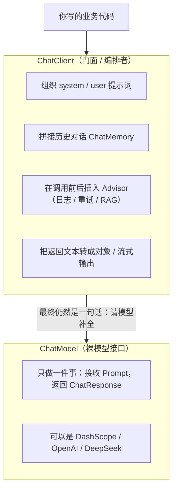

# 17 模型与 ChatClient

> 这一章站在「接入层」讲清楚两件事：Spring AI 里 `ChatModel` 和 `ChatClient` 到底谁干啥，以及怎么把阿里云百炼的 qwen-plus 接进来、在多个模型之间自由切换、把参数调到合适的位置。读完你就能独立搭出一套可上生产的模型接入层。

## 本篇要解决的问题

很多同学刚接触 Spring AI 时会被两个名字搞晕：

- 文档里一会儿说 `ChatModel`，一会儿说 `ChatClient`，**到底用哪个？**
- 一个 `spring-ai-alibaba-starter-dashscope` 加一份 yml 就跑通了，可是**真正的 Fluent API 每一段是什么意思？**
- 业务里想「简单问答用便宜的 qwen-turbo、复杂推理用 qwen-max」，**怎么让多个模型共存而不打架？**
- `temperature`、`maxTokens` 这些参数到底给多少？为什么有时候模型答非所问、有时候又说到一半被截断？
- 流式输出怎么写？结构化输出（让模型直接返回 Java 对象）怎么写？记忆（ChatMemory）在 `ChatClient` 里是什么位置？

这一章把上面每一个问题都拆开讲，并给出**能直接复制运行的代码**。

## 一、ChatModel 与 ChatClient：裸模型 vs 带 Advisor 链的门面

先建立一个最核心的认知，后面所有代码都建立在这个区别上。

### 1.1 一个装修队的比喻

把调用大模型想象成「请一个超级聪明的顾问来干活」：

- **`ChatModel` = 那个顾问本人**。你给一段话，他回一段话。他能力很强，但**只有一个最核心的本事：接收文本、产出文本**。他不知道你的系统提示词长什么样、不会记得上一句聊了什么、不会自动去查知识库、也不会在出错时重试。

- **`ChatClient` = 围着这个顾问的一整套「助理 + 流程」**。它帮顾问准备好系统提示词、把历史对话拼好、在调用前后插入各种处理逻辑（Advisor）、把返回结果转成你想要的 Java 对象或流式推给前端。`ChatClient` 自己不「思考」，它只是把一切安排妥当后，最终还是交给 `ChatModel` 去真正推理。

用图表示它们的分工：



::: tip 一句话记住
`ChatModel` 是「能力和协议的抽象」——换模型只换它；`ChatClient` 是「好用的门面」——你 90% 的时间都在用它写业务。两者是**组合关系**：`ChatClient` 内部持有一个 `ChatModel`。
:::

### 1.2 从接口层面看清关系

`ChatModel` 是 Spring AI 定义的最底层接口（`org.springframework.ai.chat.model.ChatModel`），最核心的方法是：

```java
// 低层调用：你手动构造 Prompt，拿到 ChatResponse
ChatResponse call(Prompt prompt);
```

而 `ChatClient`（`org.springframework.ai.chat.client.ChatClient`）是建立在 `ChatModel` 之上的流式 API 门面，提供了我们后面大量使用的 `.prompt().user().call().content()` 写法。

下面看一个「用裸 `ChatModel`」和「用 `ChatClient`」的对比，你就明白为什么要设计两层：

```java
// 方式 A：裸 ChatModel，自己拼 Prompt（能跑，但啰嗦）
Prompt prompt = new Prompt(List.of(
        new UserMessage("用一句话解释什么是 Spring Boot")
));
ChatResponse response = chatModel.call(prompt);
String text = response.getResult().getOutput().getText();

// 方式 B：ChatClient，一句话搞定（推荐）
String text2 = chatClient.prompt()
        .user("用一句话解释什么是 Spring Boot")
        .call()
        .content();
```

结论：**日常业务用 `ChatClient`；需要极致控制请求细节（比如手写 Prompt 模板、自定义 Advisor 链）时才下沉到 `ChatModel`。**

## 二、接入 DashScope 通义（完整配置）

本专栏默认模型统一用阿里云百炼 DashScope 的 **qwen-plus**。先把最小可运行项目搭起来。

### 2.1 完整 pom.xml

```xml
<?xml version="1.0" encoding="UTF-8"?>
<project xmlns="http://maven.apache.org/POM/4.0.0"
         xmlns:xsi="http://www.w3.org/2001/XMLSchema-instance"
         xsi:schemaLocation="http://maven.apache.org/POM/4.0.0
         https://maven.apache.org/xsd/maven-4.0.0.xsd">

    <modelVersion>4.0.0</modelVersion>

    <!-- 继承 Spring Boot 父 POM，统一管理 Spring 生态依赖版本 -->
    <parent>
        <groupId>org.springframework.boot</groupId>
        <artifactId>spring-boot-starter-parent</artifactId>
        <version>3.5.5</version>
        <relativePath/>
    </parent>

    <groupId>com.example</groupId>
    <artifactId>saa-model-demo</artifactId>
    <version>1.0.0</version>

    <properties>
        <java.version>17</java.version>
        <!-- Spring AI 与 SAA 的版本，本专栏统一基线 -->
        <spring-ai.version>1.1.2</spring-ai.version>
        <spring-ai-alibaba.version>1.1.2.0</spring-ai-alibaba.version>
    </properties>

    <dependencies>
        <!-- Web 能力：提供 HTTP 接口给前端 / curl 调用 -->
        <dependency>
            <groupId>org.springframework.boot</groupId>
            <artifactId>spring-boot-starter-web</artifactId>
        </dependency>

        <!-- Spring AI Alibaba 的 DashScope starter：封装了通义系列模型的调用 -->
        <!-- 引入它之后，Spring Boot 会自动创建一个 ChatModel Bean 和 ChatClient.Builder Bean -->
        <dependency>
            <groupId>com.alibaba.cloud.ai</groupId>
            <artifactId>spring-ai-alibaba-starter-dashscope</artifactId>
        </dependency>
    </dependencies>

    <dependencyManagement>
        <dependencies>
            <!-- 两个 BOM 统一管理版本，避免 Spring AI 各模块之间版本冲突 -->
            <dependency>
                <groupId>org.springframework.ai</groupId>
                <artifactId>spring-ai-bom</artifactId>
                <version>${spring-ai.version}</version>
                <type>pom</type>
                <scope>import</scope>
            </dependency>
            <dependency>
                <groupId>com.alibaba.cloud.ai</groupId>
                <artifactId>spring-ai-alibaba-bom</artifactId>
                <version>${spring-ai-alibaba.version}</version>
                <type>pom</type>
                <scope>import</scope>
            </dependency>
        </dependencies>
    </dependencyManagement>

    <build>
        <plugins>
            <plugin>
                <groupId>org.springframework.boot</groupId>
                <artifactId>spring-boot-maven-plugin</artifactId>
            </plugin>
        </plugins>
    </build>
</project>
```

::: warning 依赖很容易踩的坑
Spring AI 生态里 `spring-ai-core`、`spring-ai-model-*`、`spring-ai-alibaba-*` 各模块版本必须对齐。**务必用 BOM 管理，不要自己写各模块的版本号**，否则 Maven 依赖仲裁后会得到一套互相打架的版本，报出来的错往往离谱到看不懂。
:::

### 2.2 application.yml

```yaml
spring:
  application:
    name: saa-model-demo
  ai:
    dashscope:
      # 从环境变量读取，绝不写死在这里（见下文「常见坑」）
      api-key: ${AI_DASHSCOPE_API_KEY}
      chat:
        options:
          # 默认模型：本专栏统一用 qwen-plus
          model: qwen-plus
          # 随机性：0 最确定，1 更有创造性；业务系统默认 0.3~0.7
          temperature: 0.7
          # 单次最多生成 token 数，防止失控。中文约 1 字 ≈ 1 token
          max-tokens: 2048

server:
  port: 8080

logging:
  level:
    # 打开框架日志，能看清请求和响应，调试阶段非常有用
    org.springframework.ai: DEBUG
```

设置环境变量（不要提交到仓库）：

```bash
# Windows PowerShell
$env:AI_DASHSCOPE_API_KEY="sk-xxxxxxxxxx"

# Linux / macOS
export AI_DASHSCOPE_API_KEY=sk-xxxxxxxxxx
```

::: danger 血泪教训
Key 一旦提交到公开仓库，很快就会被扫描到并盗刷，产生真实账单。**务必用环境变量或配置中心，并且加到 `.gitignore`。**
:::

### 2.3 主启动类

```java
package com.example.saa.model;

import org.springframework.boot.SpringApplication;
import org.springframework.boot.autoconfigure.SpringBootApplication;

/**
 * 启动类。
 *
 * 引入 spring-ai-alibaba-starter-dashscope 之后，Spring Boot 的自动配置
 * 会读取上面的 yml，自动创建一个 ChatModel Bean 和 ChatClient.Builder Bean 放进容器。
 * 我们不需要写任何创建模型客户端的代码 —— 这就是 starter 的价值。
 */
@SpringBootApplication
public class ModelDemoApplication {

    public static void main(String[] args) {
        SpringApplication.run(ModelDemoApplication.class, args);
    }
}
```

### 2.4 第一个对话接口

```java
package com.example.saa.model.controller;

import org.springframework.ai.chat.client.ChatClient;
import org.springframework.web.bind.annotation.GetMapping;
import org.springframework.web.bind.annotation.RequestMapping;
import org.springframework.web.bind.annotation.RequestParam;
import org.springframework.web.bind.annotation.RestController;

/**
 * 对话接口。
 *
 * ChatClient 是 Spring AI 提供的流式 API 入口，
 * 相当于对底层 ChatModel 的一层「更好用的包装」。
 */
@RestController
@RequestMapping("/api/chat")
public class ChatController {

    private final ChatClient chatClient;

    /**
     * 构造器注入 ChatClient.Builder。
     * 这个 Builder 由 Spring Boot 自动配置提供，已经绑定好了 DashScope 的模型。
     */
    public ChatController(ChatClient.Builder builder) {
        this.chatClient = builder
                // defaultSystem 给整个 ChatClient 设定统一的系统提示词
                .defaultSystem("你是一位务实的 Java 架构师，回答要简洁，直接给结论。")
                .build();
    }

    /**
     * 最简单的对话：http://localhost:8080/api/chat/simple?msg=你好
     */
    @GetMapping("/simple")
    public String simpleChat(@RequestParam(defaultValue = "介绍一下你自己") String msg) {
        // Fluent API：prompt() 开始 → user() 设用户输入 → call() 发起调用 → content() 取文本内容
        return chatClient.prompt()
                .user(msg)
                .call()
                .content();
    }
}
```

调用测试：

```bash
curl "http://localhost:8080/api/chat/simple?msg=用一句话解释什么是 Spring%20Boot"
```

## 三、ChatClient 的 Fluent API 逐段拆解

上面 `.prompt().user().call().content()` 看似一行，其实每一段都有明确职责。这一节把它拆开，逐个讲清楚，并演示 `system`、`advisors` 的用法。

### 3.1 每段在干什么

| 段落 | 作用 | 常见用法 |
| --- | --- | --- |
| `prompt()` | 开启一次请求的定义，返回一个 `PromptSpec` | 也可写成 `prompt(String)` 直接当 user 消息 |
| `system(...)` | 设置系统提示词（本轮生效，覆盖 defaultSystem） | 临时改变模型人格/约束 |
| `user(...)` | 设置用户消息 | 用户的实际问题，支持模板 `{param}` |
| `advisors(...)` | 在调用前后插入处理逻辑链 | 记忆、日志、RAG 检索都靠它 |
| `call()` | **真正发起同步调用**，返回 `CallResponseSpec` | 同步等待结果 |
| `stream()` | 发起流式调用，返回 `StreamResponseSpec` | 逐字推送（见第六章） |
| `content()` | 取回纯文本回答 | 只要文字时用它 |
| `chatResponse()` | 取回完整 `ChatResponse`（含 Token 用量） | 需要计费/元数据时 |
| `entity(Class)` | 把回答解析成指定 Java 类型 | 结构化输出（见第七章） |

### 3.2 把每一段显式写出来

下面这个例子把 `system / user / advisors / call` 全部显式写出，方便你理解每段的位置：

```java
package com.example.saa.model.controller;

import org.springframework.ai.chat.client.ChatClient;
import org.springframework.ai.chat.client.advisor.MessageChatMemoryAdvisor;
import org.springframework.ai.chat.memory.ChatMemory;
import org.springframework.ai.chat.model.ChatResponse;
import org.springframework.web.bind.annotation.GetMapping;
import org.springframework.web.bind.annotation.RequestMapping;
import org.springframework.web.bind.annotation.RequestParam;
import org.springframework.web.bind.annotation.RestController;

/**
 * 演示 ChatClient Fluent API 每一段的显式写法。
 */
@RestController
@RequestMapping("/api/chat")
public class FluentApiController {

    private final ChatClient chatClient;
    private final ChatMemory chatMemory;

    public FluentApiController(ChatClient.Builder builder, ChatMemory chatMemory) {
        this.chatMemory = chatMemory;
        this.chatClient = builder
                // defaultAdvisors：每次调用都自动套用这组 Advisor（这里是记忆）
                .defaultAdvisors(MessageChatMemoryAdvisor.builder(chatMemory).build())
                .build();
    }

    @GetMapping("/fluent")
    public String fluent(@RequestParam String msg,
                         @RequestParam String sessionId) {
        // 注意每一段的顺序和含义：
        return chatClient
                // 1) prompt()：开始构造这次请求
                .prompt()
                // 2) system()：本轮临时覆盖系统提示词（不写就用 defaultSystem）
                .system("你是一个严谨的数据库专家，只回答确定的事实，不知道就说不知道。")
                // 3) user()：用户的真实问题，支持模板占位符
                .user(u -> u.text("请解释下面的 SQL 有什么问题：\n{sql}")
                        .param("sql", "SELECT * FROM t WHERE id = 1 LIMIT"))
                // 4) advisors()：本轮再叠加一个 Advisor（这里用 Consumer 形式传会话 ID）
                .advisors(spec -> spec.param(ChatMemory.CONVERSATION_ID, sessionId))
                // 5) call()：发起同步调用
                .call()
                // 6) content()：只要文本结果
                .content();
    }

    /**
     * 如果你想拿完整响应（包含 Token 用量、实际模型名），用 chatResponse() 而不是 content()。
     */
    @GetMapping("/fluent-detail")
    public String fluentDetail(@RequestParam String msg) {
        ChatResponse response = chatClient.prompt()
                .user(msg)
                .call()
                .chatResponse();

        // 取文本
        String text = response.getResult().getOutput().getText();
        // 取 Token 用量（计费依据）
        int total = response.getMetadata().getUsage().getTotalTokens();
        return "【消耗 " + total + " tokens】\n" + text;
    }
}
```

::: tip call() 与 content() 的区别
`call()` 返回的是一个「响应规约」对象，你再决定要什么：`.content()` 拿纯文本、`.chatResponse()` 拿完整对象、`.entity(Class)` 拿结构化对象。养成用 `.chatResponse()` 统计 Token 的习惯，成本控制才有数据。
:::

## 四、切换 OpenAI / DeepSeek（不混用 starter）

Spring AI 是「模型无关」的：换模型本质上只是换一个 `ChatModel` 实现 + 改配置。下面演示怎么切到 DeepSeek 或 OpenAI 兼容端点。

::: warning 两种方式别混用
`spring-ai-alibaba-starter-dashscope` 和 `spring-ai-starter-model-openai` 会各自创建**不同**的 `ChatModel` Bean。**同时引入两个 starter，注入时会出现多个候选 Bean 导致启动失败。** 选一种，然后专注用到底；多模型共存的正确做法见第五章（用 @Qualifier 显式声明多个 Bean）。
:::

### 4.1 切到 DeepSeek（替换 starter + 改 yml）

把 `pom.xml` 里的 DashScope starter 换成 OpenAI 兼容 starter：

```xml
<!-- 替换 spring-ai-alibaba-starter-dashscope -->
<dependency>
    <groupId>org.springframework.ai</groupId>
    <artifactId>spring-ai-starter-model-openai</artifactId>
</dependency>
```

`application.yml` 改成：

```yaml
spring:
  ai:
    openai:
      api-key: ${DEEPSEEK_API_KEY}
      base-url: https://api.deepseek.com
      chat:
        options:
          model: deepseek-chat
          temperature: 0.7
          max-tokens: 2048
```

### 4.2 用 OpenAI 兼容端点访问通义（保持 DashScope 不变）

如果你希望保持 DashScope 的接入方式，只是想「走 OpenAI 协议风格」，也可以这样改 yml（**仍然用 dashscope starter**）：

```yaml
spring:
  ai:
    openai:
      api-key: ${AI_DASHSCOPE_API_KEY}
      base-url: https://dashscope.aliyuncs.com/compatible-mode
      chat:
        options:
          model: qwen-plus
```

::: tip 切换的本质
无论换哪个厂商，上层 `ChatClient` 的写法**一行都不用改**——这就是 `ChatModel` 抽象的价值。本专栏所有主示例均使用 DashScope 的 qwen-plus，需要对比时再切 DeepSeek / OpenAI。
:::

## 五、多模型并存：多个 ChatModel Bean + @Qualifier

真实业务常需要「便宜模型做闲聊、强模型做复杂推理」。正确做法是**显式声明多个 `ChatModel` Bean，并用 `@Qualifier` 区分**，避免自动装配冲突。

### 5.1 用 DashScopeChatModel 手动声明多个 Bean

`DashScopeChatModel` 是 `ChatModel` 的实现类，我们可以用它的 builder 手动创建多个实例，分别绑定不同模型。

```java
package com.example.saa.model.config;

import com.alibaba.cloud.ai.dashscope.api.DashScopeApi;
import com.alibaba.cloud.ai.dashscope.chat.DashScopeChatModel;
import com.alibaba.cloud.ai.dashscope.chat.DashScopeChatOptions;
import org.springframework.ai.chat.model.ChatModel;
import org.springframework.beans.factory.annotation.Qualifier;
import org.springframework.beans.factory.annotation.Value;
import org.springframework.context.annotation.Bean;
import org.springframework.context.annotation.Configuration;

/**
 * 多模型配置：声明两个 ChatModel Bean，分别指向 qwen-plus 和 qwen-max。
 *
 * 关键点：
 *   1. 每个 Bean 都加 @Qualifier 起名字，注入时靠名字区分
 *   2. DashScopeChatModel.builder() 需要传入 DashScopeApi（含 apiKey）
 *   3. defaultOptions 里设定该实例默认的 model / temperature，注入后调用方无需关心
 */
@Configuration
public class MultiModelConfig {

    /** 统一构造 DashScopeApi：把 apiKey 从配置文件注入，绝不硬编码 */
    private DashScopeApi dashScopeApi(String apiKey) {
        return DashScopeApi.builder()
                .apiKey(apiKey)
                .build();
    }

    /**
     * 默认模型：qwen-plus，性价比均衡，适合绝大多数场景。
     * Bean 名字通过 @Qualifier("qwenPlus") 暴露。
     */
    @Bean
    @Qualifier("qwenPlus")
    public ChatModel qwenPlus(@Value("${spring.ai.dashscope.api-key}") String apiKey) {
        return DashScopeChatModel.builder()
                .dashScopeApi(dashScopeApi(apiKey))
                .defaultOptions(DashScopeChatOptions.builder()
                        .model("qwen-plus")
                        .temperature(0.7)
                        .maxTokens(2048)
                        .build())
                .build();
    }

    /**
     * 强模型：qwen-max，推理能力更强，适合复杂任务（如代码生成、长文总结）。
     * 注意 maxTokens 的 setter 在不同小版本里可能叫 maxTokens / withMaxToken，
     * 具体以你所用版本的官方文档为准；若编译报错请改用对应方法名。
     */
    @Bean
    @Qualifier("qwenMax")
    public ChatModel qwenMax(@Value("${spring.ai.dashscope.api-key}") String apiKey) {
        return DashScopeChatModel.builder()
                .dashScopeApi(dashScopeApi(apiKey))
                .defaultOptions(DashScopeChatOptions.builder()
                        .model("qwen-max")
                        .temperature(0.3)
                        .maxTokens(4096)
                        .build())
                .build();
    }
}
```

### 5.2 在 Controller 里按 @Qualifier 注入并使用

```java
package com.example.saa.model.controller;

import org.springframework.ai.chat.client.ChatClient;
import org.springframework.ai.chat.model.ChatModel;
import org.springframework.beans.factory.annotation.Qualifier;
import org.springframework.web.bind.annotation.GetMapping;
import org.springframework.web.bind.annotation.RequestMapping;
import org.springframework.web.bind.annotation.RequestParam;
import org.springframework.web.bind.annotation.RestController;

/**
 * 演示按 @Qualifier 选择不同模型。
 *
 * ChatClient.builder(ChatModel) 是静态工厂：用指定的 ChatModel 构造一个 ChatClient，
 * 这样这次请求就走对应的模型，不会和其他 Bean 冲突。
 */
@RestController
@RequestMapping("/api/chat")
public class MultiModelController {

    private final ChatClient plusClient;
    private final ChatClient maxClient;

    public MultiModelController(@Qualifier("qwenPlus") ChatModel qwenPlus,
                                @Qualifier("qwenMax") ChatModel qwenMax) {
        this.plusClient = ChatClient.builder(qwenPlus).build();
        this.maxClient = ChatClient.builder(qwenMax).build();
    }

    /** 闲聊 / 简单问答：走便宜的 qwen-plus */
    @GetMapping("/plus")
    public String usePlus(@RequestParam String msg) {
        return plusClient.prompt().user(msg).call().content();
    }

    /** 复杂推理：走强模型 qwen-max */
    @GetMapping("/max")
    public String useMax(@RequestParam String msg) {
        return maxClient.prompt().user(msg).call().content();
    }
}
```

### 5.3 另一种更轻量的切换：per-call 覆盖模型名

如果多个模型来自**同一个厂商同一种协议**，其实不需要声明多个 Bean，直接在单次调用里用 `ChatOptions` 覆盖模型名即可：

```java
package com.example.saa.model.controller;

import org.springframework.ai.chat.client.ChatClient;
import org.springframework.ai.chat.model.ChatOptions;
import org.springframework.web.bind.annotation.GetMapping;
import org.springframework.web.bind.annotation.RequestMapping;
import org.springframework.web.bind.annotation.RequestParam;
import org.springframework.web.bind.annotation.RestController;

@RestController
@RequestMapping("/api/chat")
public class SwitchModelController {

    private final ChatClient chatClient;

    public SwitchModelController(ChatClient.Builder builder) {
        this.chatClient = builder.build();
    }

    /** 同一个 ChatClient，本次调用临时切到 qwen-max */
    @GetMapping("/switch")
    public String switchModel(@RequestParam String msg) {
        return chatClient.prompt()
                .user(msg)
                // options() 只影响这一次请求：临时换成 qwen-max，temperature 调到更低
                .options(ChatOptions.builder()
                        .model("qwen-max")
                        .temperature(0.2)
                        .maxTokens(2000)
                        .build())
                .call()
                .content();
    }
}
```

::: tip 两种做法怎么选
- 模型来自**不同协议/不同厂商**（如 DashScope + OpenAI），或需要长期固定不同默认参数 → 用第五章的「多 Bean + @Qualifier」。
- 只是同厂商、偶尔换模型名 → 用 `ChatOptions` 覆盖，更轻量。
:::

## 六、流式输出

大模型是一个 token 一个 token 生成的，同步 `call()` 会让前端干等好几秒。流式输出（`stream()`）让回答边生成边推给前端，体验好很多。

### 6.1 返回 `Flux<String>` 的流式接口

```java
package com.example.saa.model.controller;

import org.springframework.ai.chat.client.ChatClient;
import org.springframework.web.bind.annotation.GetMapping;
import org.springframework.web.bind.annotation.RequestMapping;
import org.springframework.web.bind.annotation.RequestParam;
import org.springframework.web.bind.annotation.RestController;
import reactor.core.publisher.Flux;

/**
 * 流式对话接口。
 *
 * stream() 返回 Flux<String>，Spring WebFlux/WebMVC 都能把它以 SSE（text/event-stream）推给前端。
 */
@RestController
@RequestMapping("/api/chat")
public class StreamController {

    private final ChatClient chatClient;

    public StreamController(ChatClient.Builder builder) {
        this.chatClient = builder.build();
    }

    /**
     * 流式返回：http://localhost:8080/api/chat/stream?msg=讲一个关于Java的冷笑话
     *
     * 用 curl 测试时加 -N 关闭缓冲，才能看到逐字效果：
     *   curl -N "http://localhost:8080/api/chat/stream?msg=讲一个关于Java的冷笑话"
     */
    @GetMapping(value = "/stream", produces = "text/html;charset=UTF-8")
    public Flux<String> streamChat(@RequestParam String msg) {
        return chatClient.prompt()
                .user(msg)
                .stream()          // 关键：用 stream() 代替 call()
                .content();        // 返回 Flux<String>，逐段推送
    }
}
```

`curl` 测试（注意 `-N`）：

```bash
curl -N "http://localhost:8080/api/chat/stream?msg=讲一个关于Java的冷笑话"
```

::: tip call() vs stream()
- `call()`：`ChatResponse` 一次性返回，适合后台任务、批量处理。
- `stream()`：`Flux<String>` 逐段返回，适合面向用户的实时对话。两者的模型调用次数和计费完全一致，只是**传输方式**不同。
:::

## 七、常用参数说明（推荐取值与场景）

这些参数直接影响「回答质量、稳定性、成本」。下面给一版可落地的推荐表。

### 7.1 temperature（随机性）

控制模型在候选词上的概率分布，值越低越确定、越保守。

| 取值 | 表现 | 适合场景 |
| --- | --- | --- |
| 0 ~ 0.2 | 几乎每次输出一致，非常保守 | 数据提取、分类、代码生成、事实问答、结构化输出 |
| 0.3 ~ 0.7 | 平衡 | 日常对话、通用问答（**业务系统默认 0.3~0.7**） |
| 0.8 ~ 1.2 | 有创意、发散 | 文案创作、头脑风暴、起名 |

::: tip 经验
很多「AI 不稳定、答非所问」的抱怨，把 `temperature` 调到 0.2~0.3 就解决了一大半。涉及「抽取/分类/转结构」的任务，务必用 0。
:::

### 7.2 topP（核采样）

模型只在累计概率达到 `topP` 的候选 token 里选词。日常调试**优先调 `temperature`**，`topP` 保持默认即可。两者不要同时猛调，否则行为难以预测。

| 取值 | 表现 | 说明 |
| --- | --- | --- |
| 0.1 ~ 0.5 | 更聚焦、保守 | 与低 temperature 类似的效果 |
| 0.7 ~ 0.95（默认常见） | 平衡 | 一般不动它 |

### 7.3 maxTokens（单次最大生成长度）

限制本次生成的最大 token 数，**强烈建议显式设置**：

| 取值建议 | 理由 |
| --- | --- |
| 闲聊/分类：256~512 | 回答短，避免无意义铺长 |
| 通用问答：1024~2048 | 兼顾完整性与成本 |
| 长文/代码：4096+ | 但也要防失控 |

```yaml
spring:
  ai:
    dashscope:
      chat:
        options:
          max-tokens: 2048   # 根据业务给，不要偷懒给最大值
```

::: warning 别忘了看 finish_reason
如果模型返回 `finish_reason = length`，说明**回答被长度截断了**，用户看到的是半截话。生产环境要么调大 `maxTokens`，要么检测到 `length` 时给用户提示「答案过长已截断」。
:::

### 7.4 stop（停止词）

遇到指定字符串就停止生成。适合「让模型只产出某段内容、不要画蛇添足」：

| 场景 | stop 取值 |
| --- | --- |
| 只要第一行答案 | `["\n"]` |
| 不要解释、只要 JSON | `["```"]` |
| 角色扮演时别抢对方台词 | `["用户：", "User:"]` |

在代码里设置：

```java
chatClient.prompt()
        .user("给一个 Java 单例模式的类名，不要解释")
        .options(ChatOptions.builder()
                .model("qwen-plus")
                // stop 是 List<String>，遇到换行就停
                .stop(List.of("\n"))
                .build())
        .call()
        .content();
```

### 7.5 参数设置的三层位置

| 层级 | 写法 | 作用范围 |
| --- | --- | --- |
| 全局默认 | `application.yml` 的 `spring.ai.dashscope.chat.options.*` | 整个应用 |
| 客户端默认 | `ChatClient.Builder.defaultOptions(...)` | 该 ChatClient 实例 |
| 单次覆盖 | `prompt().options(ChatOptions.builder()...)` | 仅本次请求，优先级最高 |

::: tip 优先级
单次 `options()` > 客户端 `defaultOptions` > yml 全局配置。写代码时记住这个顺序，出问题先查「是不是被更上层覆盖了」。
:::

## 八、结构化输出

很多时候你不想拿到一段「模型自己组织的中文」，而是想要一个**直接能用的 Java 对象**（比如要落库、要分支路由）。`ChatClient` 的 `.entity()` 就是为此而生。

### 8.1 用 Java record 接收单个对象

先定义要返回的「形状」：

```java
package com.example.saa.model.dto;

import java.time.LocalDate;

/**
 * 模型要填充的结构化结果。
 * 用 record 最省事：Spring AI 会根据字段自动生成 JSON Schema 告诉模型该怎么答。
 */
public record OrderSummary(
        String orderId,        // 订单号
        double amount,         // 金额
        String status,         // 状态：待付款/已发货/已完成
        LocalDate estimatedDelivery // 预计送达日期
) {
}
```

调用 `entity(OrderSummary.class)`，框架会自动：① 根据 record 生成 JSON Schema → ② 指示模型按此格式答 → ③ 把 JSON 反序列化成对象。

```java
package com.example.saa.model.controller;

import com.example.saa.model.dto.OrderSummary;
import org.springframework.ai.chat.client.ChatClient;
import org.springframework.web.bind.annotation.GetMapping;
import org.springframework.web.bind.annotation.RequestMapping;
import org.springframework.web.bind.annotation.RequestParam;
import org.springframework.web.bind.annotation.RestController;

@RestController
@RequestMapping("/api/extract")
public class StructuredOutputController {

    private final ChatClient chatClient;

    public StructuredOutputController(ChatClient.Builder builder) {
        this.chatClient = builder.build();
    }

    /**
     * 从一段自由文本里抽取订单结构化信息。
     * 注意：抽取类任务把 temperature 设 0，结果才稳定可复现。
     */
    @GetMapping("/order")
    public OrderSummary extractOrder(@RequestParam String text) {
        return chatClient.prompt()
                .user(u -> u.text("从下面订单文本中提取结构化信息：\n{text}")
                        .param("text", text))
                .options(org.springframework.ai.chat.model.ChatOptions.builder()
                        .model("qwen-plus")
                        .temperature(0.0)
                        .build())
                .call()
                // 用 entity(Class) 代替 content()：直接拿到类型化对象
                .entity(OrderSummary.class);
    }
}
```

`curl` 测试：

```bash
curl "http://localhost:8080/api/extract/order?text=订单号A20260921，金额358.5元，已发货，预计9月25日到"
```

### 8.2 返回列表（泛型）

裸 `List` 在运行时丢失元素类型，必须用 `ParameterizedTypeReference`：

```java
package com.example.saa.model.controller;

import org.springframework.ai.chat.client.ChatClient;
import org.springframework.core.ParameterizedTypeReference;
import org.springframework.web.bind.annotation.GetMapping;
import org.springframework.web.bind.annotation.RequestMapping;
import org.springframework.web.bind.annotation.RestController;

import java.util.List;

@RestController
@RequestMapping("/api/extract")
public class TagController {

    private final ChatClient chatClient;

    public TagController(ChatClient.Builder builder) {
        this.chatClient = builder.build();
    }

    @GetMapping("/tags")
    public List<String> extractTags(@RequestParam String text) {
        return chatClient.prompt()
                .user(u -> u.text("提取下面文本的关键标签，最多 5 个：\n{text}")
                        .param("text", text))
                .call()
                // 泛型必须用 ParameterizedTypeReference 保留元素类型
                .entity(new ParameterizedTypeReference<List<String>>() {});
    }
}
```

### 8.3 开校验 / 走模型原生结构化（更稳）

模型偶尔会返回不合规的 JSON。可以开启 schema 校验（失败自动重试），或让模型厂商在 API 层强制结构化：

```java
// 方式 1：开启 schema 校验，格式不对就自动重试一次
OrderSummary a = chatClient.prompt()
        .user("...")
        .call()
        .entity(OrderSummary.class, spec -> spec.validateSchema());

// 方式 2：让厂商 API 强制按 schema 输出（qwen-plus 经 DashScope 支持 JSON 模式，
//         具体以你所用模型/版本的官方文档为准）
OrderSummary b = chatClient.prompt()
        .user("...")
        .call()
        .entity(OrderSummary.class, spec -> spec.useProviderStructuredOutput().validateSchema());
```

::: warning 结构化输出不是「准确率保证」
`.entity()` 保证的是「形状对」，不保证「内容对」——模型可能编造一个看似合理的日期。涉及金额、订单号等关键信息，拿到对象后**一定要再校验/对账**，不能无条件信任。
:::

## 九、ChatMemory 在 ChatClient 里的位置

`ChatClient` 本身**不持有记忆**——它是无状态的门面。记忆是通过一个叫 `ChatMemory` 的组件 + `MessageChatMemoryAdvisor` 这个 Advisor「挂」上去的。

### 9.1 声明一个内存记忆

```java
package com.example.saa.model.config;

import org.springframework.ai.chat.client.advisor.MessageChatMemoryAdvisor;
import org.springframework.ai.chat.memory.ChatMemory;
import org.springframework.ai.chat.memory.InMemoryChatMemoryRepository;
import org.springframework.ai.chat.memory.MessageWindowChatMemory;
import org.springframework.context.annotation.Bean;
import org.springframework.context.annotation.Configuration;

@Configuration
public class ChatMemoryConfig {

    /**
     * 声明基于内存的会话记忆。
     *
     * MessageWindowChatMemory：只保留最近 N 条消息，防止上下文无限膨胀。
     * 这是最常用的实现；生产环境可换成 Redis / JDBC 持久化版本（思路完全一样）。
     */
    @Bean
    public ChatMemory chatMemory() {
        return MessageWindowChatMemory.builder()
                .chatMemoryRepository(new InMemoryChatMemoryRepository())
                .maxMessages(20)   // 最多记住最近 20 条，超出就丢掉最早的
                .build();
    }
}
```

### 9.2 把记忆接到 ChatClient（靠 Advisor）

```java
package com.example.saa.model.controller;

import org.springframework.ai.chat.client.ChatClient;
import org.springframework.ai.chat.client.advisor.MessageChatMemoryAdvisor;
import org.springframework.ai.chat.memory.ChatMemory;
import org.springframework.web.bind.annotation.GetMapping;
import org.springframework.web.bind.annotation.RequestMapping;
import org.springframework.web.bind.annotation.RequestParam;
import org.springframework.web.bind.annotation.RestController;

@RestController
@RequestMapping("/api/chat")
public class MemoryChatController {

    private final ChatClient chatClient;

    public MemoryChatController(ChatClient.Builder builder, ChatMemory chatMemory) {
        this.chatClient = builder
                // 把记忆作为一个 Advisor 挂上：每次调用前后自动读写历史
                .defaultAdvisors(MessageChatMemoryAdvisor.builder(chatMemory).build())
                .build();
    }

    /**
     * 多轮对话：http://localhost:8080/api/chat/memory?sessionId=user-1&msg=我叫张三
     *
     * @param sessionId 会话标识，同一个用户的多轮对话要用同一个 ID
     */
    @GetMapping("/memory")
    public String memoryChat(@RequestParam String sessionId,
                             @RequestParam String msg) {
        return chatClient.prompt()
                .user(msg)
                // 关键：把 sessionId 传给记忆 Advisor，它据此区分不同用户的历史
                .advisors(spec -> spec.param(ChatMemory.CONVERSATION_ID, sessionId))
                .call()
                .content();
    }
}
```

测试记忆是否生效：

```bash
# 第一轮
curl "http://localhost:8080/api/chat/memory?sessionId=user-1&msg=我叫张三"
# 第二轮：模型应该知道你叫张三
curl "http://localhost:8080/api/chat/memory?sessionId=user-1&msg=我叫什么名字？"
# 换个 sessionId，模型就不记得了
curl "http://localhost:8080/api/chat/memory?sessionId=user-2&msg=我叫什么名字？"
```

::: tip 记忆在 ChatClient 里的定位
记忆**不是** ChatClient 的内置字段，而是一个 `Advisor`。这也呼应了第一章的认知：`ChatClient` 是个门面，所有「附加能力」（记忆、日志、RAG）都是通过 Advisor 链挂上去的。所谓「多轮对话」，本质是每次把历史消息整段重发给模型。
:::

## 十、常见坑

### 10.1 两个 starter 同时引入导致 Bean 冲突

**现象**：启动报 `No qualifying bean` / `expected single matching bean but found 2`。

**原因**：`spring-ai-alibaba-starter-dashscope` 和 `spring-ai-starter-model-openai` 各创建一个 `ChatModel` Bean，注入 `ChatModel` 时出现多个候选。

**解决**：
- 只引入你真正要用的那一个 starter；
- 确实需要多模型时，按第五章用 `@Qualifier` 显式声明多个 Bean，并配合 `@Primary` 指定默认。

```java
// 示例：给其中一个标 @Primary，未指定 @Qualifier 的注入就走它
@Bean
@Primary
@Qualifier("qwenPlus")
public ChatModel qwenPlus(...) { ... }
```

### 10.2 API Key 硬编码

**现象**：把 `sk-xxx` 写进代码并提交到 Git，几天后收到天价账单。

**解决**：一律用环境变量或配置中心，`application.yml` 只写占位符 `${AI_DASHSCOPE_API_KEY}`；`.gitignore` 加上 `application-local.yml`、`*.env`；给 Key 设额度上限并定期轮换。

```java
// 错误示范
private static final String API_KEY = "sk-abc123def456";

// 正确：从环境变量读取
String key = System.getenv("AI_DASHSCOPE_API_KEY");
```

### 10.3 超时设置过短

**现象**：偶发 `Read timed out`，长回答直接失败。

**原因**：AI 接口比普通业务接口慢很多（几秒到几十秒），默认超时往往不够。

**解决**：在 yml 或底层 HTTP 客户端把超时拉到合理值（如 60~120s），并对网络抖动加重试（注意重试会重复计费，写操作慎用）。

```yaml
spring:
  ai:
    dashscope:
      api-key: ${AI_DASHSCOPE_API_KEY}
      chat:
        options:
          model: qwen-plus
      # 超时相关配置项名称随版本可能略有差异，以官方文档为准；
      # 若 starter 未暴露该属性，可自定义底层 OkHttp/WebClient 客户端 Bean 兜底。
```

::: danger Git 提交前必查
Key 泄露后往往几分钟内就被自动化脚本扫到。如果怀疑泄露，**第一时间去控制台禁用**，而不是删提交记录——fork 和缓存里可能还在。
:::

## 本篇小结

- **`ChatModel` 是裸模型接口（只管推理），`ChatClient` 是带 Advisor 链的门面（负责编排）**，日常用 `ChatClient`，要极致控制才下沉到 `ChatModel`。
- **DashScope 接入 = 一个 starter + 一份 yml**：`spring-ai-alibaba-starter-dashscope` 自动创建 `ChatModel` 和 `ChatClient.Builder` Bean。
- **Fluent API 顺序**：`prompt → system/user → advisors → call/stream → content/chatResponse/entity`，每段职责清晰。
- **多模型共存**用「多 `ChatModel` Bean + `@Qualifier`」；同厂商偶尔换模型用 `ChatOptions` 覆盖更轻量；**别同时引两个 starter**。
- **流式用 `stream()` 返回 `Flux<String>`**，面向用户实时对话必备。
- **参数重点**：`temperature` 决定稳定性（抽取类用 0）、`maxTokens` 决定成本上限、`stop` 控制停止。
- **结构化输出用 `.entity(Class)`**，但只保证形状、不保证内容正确，关键信息要再校验。
- **记忆是 Advisor 不是 ChatClient 字段**，多轮对话本质仍是每次重发历史，必须用 `sessionId` 隔离用户。

## 参考链接

- 阿里云百炼控制台：<https://bailian.console.aliyun.com/>
- DashScope 接入文档（SAA）：<https://java2ai.com/integration/chatmodels/dashScope/>
- Spring AI ChatClient 参考：<https://docs.spring.io/spring-ai/reference/api/chatclient.html>
- Spring AI 结构化输出：<https://docs.spring.io/spring-ai/reference/api/structured-output-converter.html>
- Spring AI Alibaba GitHub：<https://github.com/alibaba/spring-ai-alibaba>

下一篇 → [18 Tool 与 MCP](/java/saa/tool-mcp)
